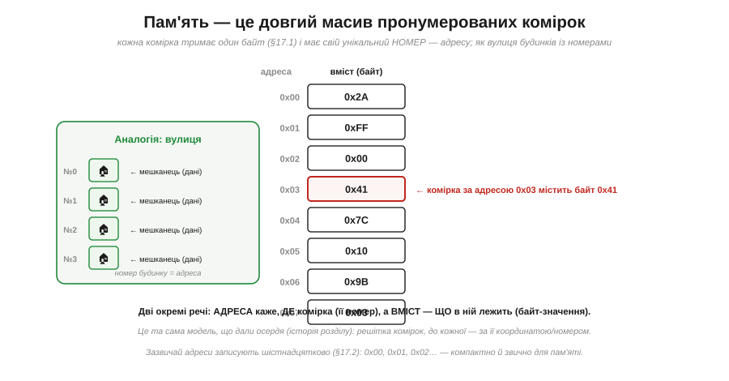
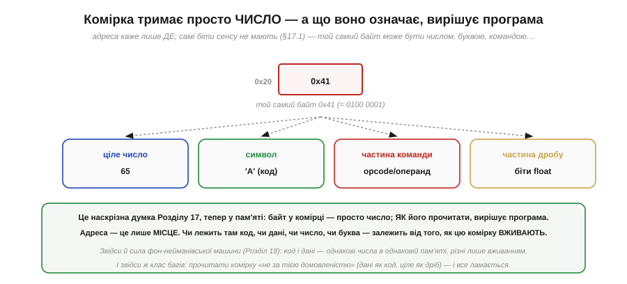

# Пам'ять як масив комірок з адресами

Найпростіша і найважливіша модель пам'яті, на якій тримається все інше, така. **Пам'ять — це довгий масив пронумерованих комірок.** Кожна комірка тримає один байт, і кожна має свій унікальний номер — **адресу**. Усе, що робить процесор із пам'яттю, зводиться до двох дій: **прочитати** комірку за її адресою або **записати** в неї. Звучить буденно — та саме в цій моделі ховаються поняття, без яких не зрозуміти ні покажчиків, ні стека, ні половини програмістських багів: різниця між **адресою** і **даними**, розмір **адресного простору**, і та глибока думка, що [байт — це лише число, а сенс йому надає вживання](book:math/why-binary).

### Масив пронумерованих комірок

Уявімо пам'ять як **вулицю будинків**, кожен зі своїм номером.

*Рис. Пам'ять — послідовність комірок, кожна тримає один **байт** і має унікальний номер — **адресу** (0x00, 0x01, 0x02…). Як на вулиці: номер будинку — це адреса, а мешканець усередині — дані. Дві геть різні речі: **адреса** каже, **де** комірка, а **вміст** — **що** в ній лежить. Це решітка комірок, до кожної з яких можна звернутися за її номером.*

Зверніть увагу на цю двоїстість «де» і «що» — вона фундаментальна. Адреса 0x03 і байт 0x41, що в ній лежить, — це **два різні числа** з різним змістом: одне вказує **місце**, інше — **вміст**. Плутати їх — класична помилка початківця (і джерело багів, особливо коли дійде до [покажчиків](book:programming/addresses-pointers)). Тримаймо їх чітко нарізно від самого початку. (Адреси, до речі, майже завжди записують [**шістнадцятково**](book:math/positional-systems) — 0x00, 0x1F, 0xFF — бо так компактно й зручно лягає на біти; ви бачитимете їх скрізь у роботі з пам'яттю.)

### Адреса проти даних

Закріпімо цю різницю, бо вона того варта.

*Рис. Процесор називає **адресу** (наприклад, 0x20 — «яка комірка»), а пам'ять віддає чи приймає **дані** (байт 0x41 — «що в ній»). І несуть їх [**різні шини**](book:programming/processor-parts): адресна шина — «де», шина даних — «що». Саме тому їх дві. 0x20 і 0x41 — обидва числа, та сенс цілком різний: одне — місце, інше — значення.*

Ось навіщо процесору окремі [**адресна** шина й шина **даних**](book:programming/processor-parts): по адресній шині процесор каже пам'яті, **куди** звернутися, а по шині даних іде сам **байт** — туди (при записі) чи назад (при читанні). Третя, шина **керування**, каже, що робити — читати чи писати. Уся розмова процесора з пам'яттю — це «адреса + операція + дані». А плутанина «адреса проти значення» — настільки поширене джерело багів, що варто закарбувати: **число-адреса ≠ число-значення**, навіть коли обидва виглядають однаково.

### Один байт на адресу

Скільки даних адресує одна адреса? Рівно **один байт** — найдрібнішу стандартну порцію.

*Рис. Кожна адреса вказує на **один байт**. Тож багатобайтове число займає кілька **послідовних** адрес: 32-бітне 0x12345678 лягає в чотири сусідні комірки (0x10, 0x11, 0x12, 0x13). А в якому **порядку** ті байти розкладені (молодший першим чи старший) — це вже [endianness](book:programming/bits-bytes-endianness); тут важливо лише, що вони **сусідні**.*

Це називають **побайтовою адресацією** (*byte-addressable*): найменша річ, яку можна назвати адресою, — байт. Хочете 16-бітне число — воно займе **дві** сусідні комірки, 32-бітне — **чотири**, 64-бітне — **вісім**. Саме тут і живе питання [**порядку** байтів (endianness)](book:programming/bits-bytes-endianness): коли число розкладене на кілька комірок, його байти можна викласти старшим уперед (big-endian) чи молодшим (little-endian, як ESP32) — і це стосується саме послідовних комірок пам'яті. (Через це, до речі, багатобайтові значення зазвичай кладуть за адресами, кратними їхньому розміру — це зветься **вирівнюванням** і допомагає залізу читати їх швидше.)

### Скільки комірок: 2ᴺ

Наскільки великою може бути пам'ять? Це визначає **ширина адреси** — скільки бітів у номері комірки.

*Рис. N бітів адреси дають **2ᴺ** різних адрес — стільки комірок машина може позначити. 8-бітна адреса бачить 256 байтів; 16-бітна — 65 536 (64 КБ); 24-бітна — 16 МБ; 32-бітна — близько 4.3 мільярда (4 ГБ). Та сама вибухова формула **2ᴺ** тут міряє **місткість адресного простору**: кожен доданий біт адреси **подвоює** обсяг пам'яті, яку можна адресувати.*

Ось чому [«розрядність» процесора](book:programming/processor-parts) важлива не лише для чисел, а й для **пам'яті**. Ширина адресної шини задає **стелю** пам'яті: 16-бітна адреса фізично не дотягнеться далі 64 КБ, хоч би скільки мікросхем ви приставили; 32-бітна бачить уже 4 ГБ. Саме тому перехід комп'ютерів із 32 на 64 біти був значною мірою про пам'ять — [32-бітна адреса бачить лише 4 ГіБ](book:math/address-space), і ця межа стала тісною. Запам'ятайте зв'язок: **N бітів адреси → 2ᴺ комірок**; він підкаже, скільки пам'яті здатна охопити дана машина.

### Дві операції: читання й запис

Що ж процесор робить із пам'яттю? Лише **дві** речі.

*Рис. **Читання** (read): процесор дає адресу — пам'ять повертає байт із тієї комірки. **Запис** (write): процесор дає адресу **і** байт — пам'ять зберігає його в тій комірці. Що саме робити, каже [шина керування](book:programming/processor-parts). І все: будь-яка робота з пам'яттю — це послідовність читань і записів.*

Усе, абсолютно все, що відбувається в пам'яті, зводиться до цих двох дій. [**Вибірка** команди процесором](book:programming/fetch-decode-execute) — це **читання** за адресою з PC; збереження результату обчислення — це **запис**. Завантаження змінної в регістр — читання; збереження назад — запис. Коли в коді ви оголошуєте змінну й присвоюєте їй значення, під капотом це й є запис у комірку пам'яті за певною адресою, а використання змінної — читання звідти. І цей доступ — **випадковий** (*random access*, звідси RAM): будь-яку комірку напряму й миттєво, не чекаючи, поки вона «доїде».

### Комірка тримає просто число

І наостанок — найглибша думка про пам'ять. Що ж лежить у комірці? **Просто число.** Не «команда», не «буква», не «ціле» — лише вісім бітів, байт.

*Рис. Байт 0x41 у комірці 0x20 — це просто число (0100 0001). Чим воно є — залежить від того, **як його вживають**: як ціле це 65, як символ — літера 'A', як частина команди — шматок opcode чи операнда, як частина float — кілька бітів дробу. Адреса каже лише **де** байт; що він **означає**, вирішує програма.*

Ось чому пам'ять така універсальна — і така небезпечна. Універсальна, бо в тих самих комірках можна тримати що завгодно: і код, і дані, і числа, і текст — усе це просто байти, різні лише **вживанням** (саме на цьому стоїть [фон-нейманівська машина](book:programming/von-neumann-harvard): код і дані — однакові числа в одній пам'яті). А небезпечна — бо ніщо в самій комірці не каже, **як** її читати; це знає лише програма. Прочитати дані **не за тією домовленістю** (байти тексту як команду, ціле як дріб, адресу як значення) — і все ламається. Тримайте в голові: адреса — це **місце**, байт — це **число**, а **сенс** йому надаєте ви, програміст, тим, як цю комірку вживаєте.

> 🔧 **Навіщо це.** Ця модель — підмурок усього, що ви робитимете з пам'яттю в коді. Перше: **адреса ≠ значення** — комірка має номер (де) і вміст (що); плутати їх не можна, і ця відмінність стане критичною з [покажчиками](book:programming/addresses-pointers). Друге: пам'ять **побайтова**, тож ваші 16-/32-бітні змінні займають по 2/4 сусідні комірки, а їхній порядок — це [endianness](book:programming/bits-bytes-endianness), що кусає при обміні даними. Третє: **N бітів адреси → 2ᴺ** комірок — звідси межі пам'яті вашого МК (наприклад, скільки SRAM здатна адресувати архітектура); коли впираєтесь у «брак пам'яті», згадайте цю стелю. Четверте, найважливіше концептуально: [**байт у пам'яті — просто число, сенс надає вживання**](book:math/why-binary); більшість «незрозумілих» багів із пам'яттю — це коли байти прочитали не як треба (тип переплутано, дані затерли код, вийшли за межі масиву). А все, що робить процесор, — це **читання й запис** комірок за адресами. Засвоївши цю просту картину, ви легко візьмете й карту пам'яті, і покажчики, і стек.
