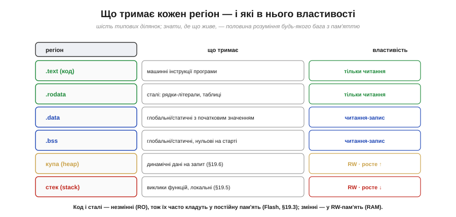
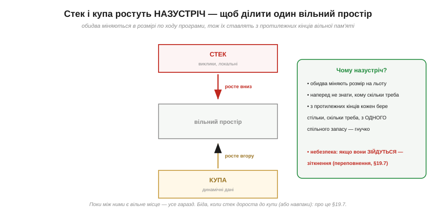
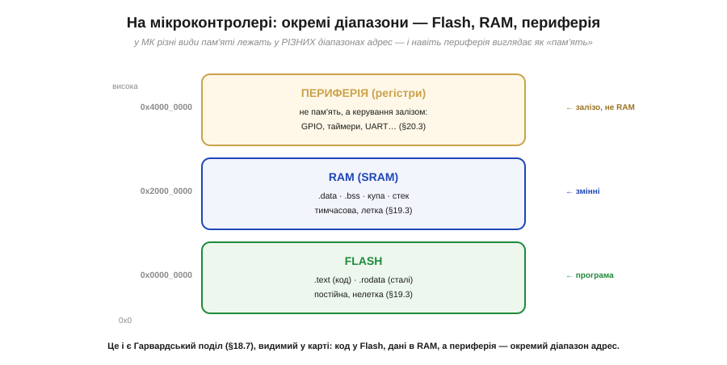
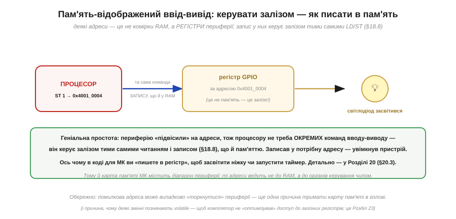

# Карта пам'яті: де що лежить (регіони)

[Адресний простір](book:programming/memory-as-array) — це довга низка комірок від 0 до межі. Та було б хаосом, якби програма кидала код, змінні й дані абияк упереміш. Натомість простір **поділено на регіони**: кожен діапазон адрес відведено під певний рід даних — тут лежить код, там сталі, отам змінні, ще далі — стек і купа, а на мікроконтролері навіть **периферія** має свій діапазон адрес. Цю схему «що за якими адресами» називають **картою пам'яті** (*memory map*), і вона — друга за важливістю річ після самої моделі комірок. Знати карту — це наполовину розуміти будь-який баг із пам'яттю: куди вказує підозрілий покажчик, чому змінна обнулилася, де програма «впала». Розберімо типову карту, що тримає кожен регіон, і — найцікавіше для нас — як на мікроконтролері в цю карту вписані Flash, RAM і навіть органи керування залізом.

### Адресний простір — поділений на зони

Ось класична карта пам'яті програми — її варто закарбувати, бо вона майже однакова всюди.

*Рис. Адресний простір поділено на регіони (від низьких адрес угору): **.text** — машинний код (тільки читання); **.rodata** — сталі (рядки, таблиці, RO); **.data** — глобальні змінні з початковим значенням; **.bss** — глобальні, нульові на старті; **купа** — динамічна пам'ять, росте вгору; великий **вільний простір**; і **стек** на вершині, що росте вниз. Кожне має своє місце: код — де процесор його вибирає; змінні — де їх можна міняти; купа й стек ростуть назустріч у спільний вільний простір.*

Придивіться до логіки цього поділу. **Незмінне** (код і сталі) — внизу, окремою купкою: його ніхто не міняє під час роботи, тож воно лежить компактно й захищене від запису. **Змінне, але наперед відоме** (глобальні змінні — .data і .bss) — далі. А **те, що росте й міняється** під час роботи (купа й стек) — з протилежних кінців вільного простору, щоб гнучко його ділити. Цей поділ не випадковий, а продуманий: він віддзеркалює **час життя** й **мінливість** даних. (Дрібна деталь: .bss тримає глобальні змінні, що на старті дорівнюють нулю, — їх не треба зберігати в програмі поіменно, досить сказати «обнули цей шмат», що економить місце; .data ж зберігає початкові значення, бо вони ненульові.)

### Що тримає кожен регіон

Зведімо регіони в таблицю — це ваша шпаргалка на все життя.

*Рис. **.text** — інструкції програми (RO). **.rodata** — сталі: рядки-літерали, таблиці (RO). **.data** — глобальні/статичні з початковим значенням (RW). **.bss** — глобальні/статичні, нульові на старті (RW). **Купа** — динамічні дані на запит (RW, росте вгору). **Стек** — виклики функцій і локальні змінні (RW, росте вниз). Код і сталі незмінні (RO), тож їх часто кладуть у постійну пам'ять (Flash); змінні — в RW-пам'ять (RAM).*

Зверніть увагу на стовпчик **властивостей**: одні регіони «тільки читання» (RO), інші «читання-запис» (RW). Це не примха — це **захист**. Код позначають RO, щоб випадковий (чи зловмисний) запис не зіпсував інструкції; адже код — це теж байти, і нічого не заважало б їх перезаписати, якби не цей захист. А ще ця властивість прямо підказує, **де** регіон фізично житиме: незмінне (RO) — у постійній пам'яті, змінне (RW) — у тимчасовій. Саме цей поділ постійної й тимчасової пам'яті — [Flash і RAM](book:programming/flash-vs-ram); тут досить бачити, що карта **групує** дані за їхньою мінливістю.

### Стек і купа ростуть назустріч

Два регіони на карті поводяться особливо — вони **міняють розмір** під час роботи. Це стек і купа, і їх не випадково ставлять з протилежних кінців.

*Рис. **Стек** (виклики функцій, локальні) сидить угорі й росте **вниз**; **купа** (динамічні дані) — нижче й росте **вгору**; між ними — спільний **вільний простір**. Чому назустріч? Бо обидва міняють розмір на льоту, і наперед не знати, кому скільки треба. З протилежних кінців кожен бере стільки, скільки треба, з **одного** спільного запасу — гнучко. Небезпека: якщо вони **зійдуться** — зіткнення (переповнення).*

Це елегантне рішення поширеної дилеми: маємо обмежений вільний простір і двох «пожильців», апетит яких непередбачуваний. Якби кожному виділити фіксовану половину, один міг би «голодувати», поки другий не дочерпав свою. Поставивши їх **назустріч**, ми дозволяємо кожному рости в спільну порожнечу, скільки треба, — поки між ними лишається місце. [Стек](book:programming/stack-lifo) роздувається при глибоких вкладених викликах функцій, [купа](book:programming/heap-dynamic-memory) — при численних динамічних виділеннях. А коли вони **зустрічаються**, стається лихо — [переповнення стека чи купи](book:programming/stack-overflow), один із найкаверзніших класів багів. Головне тут — сама **геометрія**: два рухливі регіони ділять один запас, ростучи назустріч.

### На мікроконтролері: Flash, RAM, периферія

Дотепер карта була універсальною. А ось як вона виглядає на **мікроконтролері**, бо тут є важлива особливість, прямо пов'язана з [Гарвардською архітектурою](book:programming/von-neumann-harvard).

*Рис. На МК різні види пам'яті лежать у **різних** діапазонах адрес. **Flash** (низькі адреси) — постійна, нелетка: туди кладуть **код** (.text) і **сталі** (.rodata). **RAM** (SRAM, інший діапазон) — тимчасова, летка: там живуть .data, .bss, **купа** й **стек**. А ще окремий діапазон — **периферія**: адреси, що ведуть не до пам'яті, а до **регістрів керування** залізом (GPIO, таймери, UART…). Це і є Гарвардський поділ, видимий просто в карті адрес.*

Ось де абстрактний поділ [«фон Нейман проти Гарварда»](book:programming/von-neumann-harvard) стає **відчутним**. На типовому МК код фізично живе в одному діапазоні (Flash — щоб пережити вимкнення), змінні — в іншому (RAM — швидка, але летка), і вони мають **окремі** адресні діапазони. Тому, до речі, та сама числова адреса в Flash і в RAM — це **різні** комірки в різних пам'ятях. Чим саме [Flash відрізняється від RAM](book:programming/flash-vs-ram) (швидкість, нелеткість, обмеження на запис) — окрема велика тема; тут важливо побачити, що на МК карта пам'яті **фізично** розкладена по різних видах пам'яті. Але найцікавіший — третій діапазон, периферія, бо він ховає одну з найелегантніших ідей у будові комп'ютера.

### Пам'ять-відображений ввід-вивід

Зверніть увагу: у карті МК є адреси, за якими **немає пам'яті** — там сидять **регістри периферії**. І звернення до них працює навдивовижу красиво.

*Рис. Деякі адреси — це не комірки RAM, а **регістри керування** залізом. Записавши байт у таку адресу тими самими [машинними командами](book:programming/risc-cisc) `LD`/`ST`, що й у звичайну пам'ять, процесор **керує пристроєм** — наприклад, засвічує світлодіод на ніжці. Периферію «підвісили» на адреси, тож не треба окремих команд вводу-виводу: записав у потрібну адресу — увімкнув залізо. Це зветься **пам'ять-відображений ввід-вивід** (*memory-mapped I/O*).*

Осягніть, наскільки це елегантно. Процесорові не потрібна окрема «мова» для спілкування із зовнішнім світом — ні особливих команд, ні окремих шин. Периферію просто **підвісили на адреси**, і тепер увімкнути світлодіод, запустити таймер чи послати байт по UART — це все той самий **запис у пам'ять** ([та сама команда](book:programming/risc-cisc) `ST`), лише за «магічною» адресою, що веде не до RAM, а до залізного регістра. Ось чому в коді для мікроконтролера ви раз у раз «пишете в регістр», щоб щось увімкнути, — під цим стоїть [пам'ять-відображений ввід-вивід](book:programming/memory-mapped-io). Саме тому помилкова адреса небезпечна — вона може випадково зачепити периферію; а ще тому деякі змінні позначають [`volatile`](book:programming/volatile), щоб компілятор не «оптимізував» доступ до залізних регістрів.

> 🔧 **Навіщо це.** Карта пам'яті — практичний інструмент, яким ви користуватиметеся постійно при налагодженні. Перше: знаючи **регіони**, ви розумітимете повідомлення компонувальника й налагоджувача — скільки у вас .text (код), скільки .bss і .data (глобальні), скільки лишилось RAM під стек і купу; коли МК «не влазить» у пам'ять, ви дивитеся саме на цю карту. Друге: на МК **код у Flash, змінні в RAM** — звідси практичні наслідки (великі сталі таблиці варто тримати у Flash, щоб не з'їдати дефіцитну RAM). Третє: **стек і купа ростуть назустріч** у спільний простір — тому брак RAM проявляється як їхнє [зіткнення](book:programming/stack-overflow), і це частий корінь «незрозумілих» збоїв на МК. Четверте, дуже практичне: **memory-mapped I/O** означає, що керування залізом — це запис у регістри за адресами; майже весь код роботи з периферією — це читання й запис таких адрес. Тримайте карту пам'яті свого чипа під рукою — вона відповість на половину питань «чому воно так поводиться».

---

Підсумок: адресний простір **поділено на регіони** — це **карта пам'яті**. Типові регіони (від низьких адрес): **.text** (код, RO), **.rodata** (сталі, RO), **.data** (глобальні з початковим значенням, RW), **.bss** (глобальні, нульові на старті, RW), **[купа](book:programming/heap-dynamic-memory)** (динамічні дані, росте вгору) і **[стек](book:programming/stack-lifo)** (виклики й локальні, росте вниз); між купою й стеком — спільний **вільний простір**, у який вони ростуть **назустріч** (а зіткнуться — [переповнення](book:programming/stack-overflow)). Поділ віддзеркалює **мінливість** даних: незмінне (RO) окремо від змінного (RW). На **мікроконтролері** карта фізично розкладена: **Flash** (код + сталі, нелетка) і **RAM** (змінні, стек, купа, летка) — окремі діапазони ([Гарвардський поділ](book:programming/von-neumann-harvard) наживо), плюс діапазон **периферії**. Останній ховає **[пам'ять-відображений ввід-вивід](book:programming/memory-mapped-io)**: регістри керування залізом «підвішені» на адреси, тож процесор керує периферією тими самими `LD`/`ST`, що й пам'яттю, — записав у потрібну адресу й увімкнув пристрій.

---
