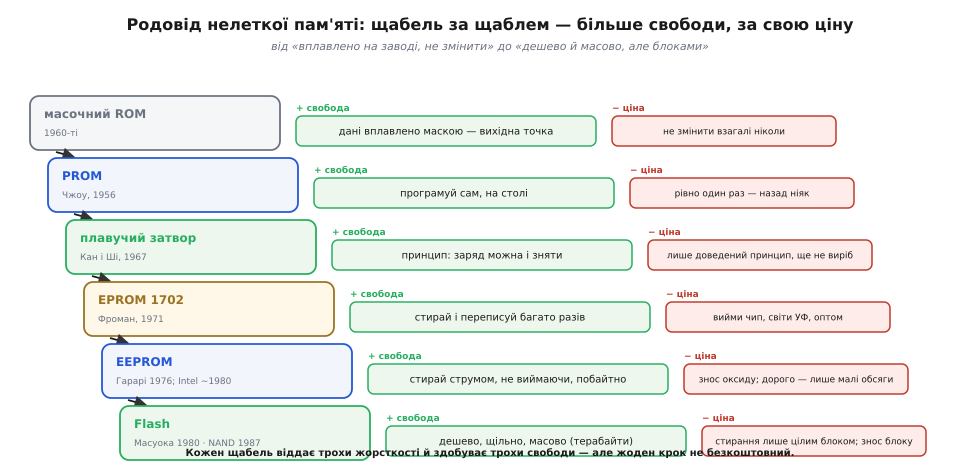

# 📜 Родовід енергонезалежної пам'яті: від «зашито на заводі» до «перезаписуй побайтно»

Уся ця родина носіїв виросла з однієї впертої незручності. Перші напівпровідникові пам'яті, що тримали дані без струму, тримали їх **надто добре**: записане на заводі лишалося там назавжди, змінити не можна було нічого. І кожен наступний винахід у цьому родоводі — це рівно один крок від тієї жорсткості вбік гнучкості. Спершу навчилися програмувати один раз у себе на столі замість заводу. Потім — стирати й переписувати, але цілою пластиною під ультрафіолетом. Потім — стирати струмом, не виймаючи чип. Потім — стирати побайтно. І нарешті — зробити це масовим і дешевим ціною того, що стирати доводиться цілими блоками. Кожен крок додавав свободи, і майже кожен за цю свободу чимось платив. Ось як це відбувалося насправді — з іменами, датами й тим, що саме бентежило інженерів на кожному повороті.

## Масочний ROM: візерунок, вплавлений у кремній

Найперша й найжорсткіша форма — **масочний ROM** (mask ROM, від англ. mask — маска, шаблон). Ідея гранично проста. Пам'ять — це сітка: горизонтальні дроти-адреси (рядки) і вертикальні дроти-дані (стовпці). У кожному перетині сітки може стояти або не стояти з'єднання — діод чи транзистор. Стоїть з'єднання — при зверненні до рядка на стовпці з'явиться струм, читач бачить одне значення; немає з'єднання — струму немає, читач бачить інше. Уся інформація — це географія цих перетинів: де провідник є, а де його немає.

Слово «масочний» тут не метафора. Візерунок з'єднань задається літографічною **маскою** — тим самим фотошаблоном, крізь який світло малює структуру чипа під час його виготовлення. Дані буквально вкарбовані в один із шарів кремнієвої пластини на фабриці. Це означає дві речі, і обидві визначили долю технології. По-перше, коли пластину виготовлено, вміст **неможливо змінити ніяк** — ні струмом, ні світлом, ні чим завгодно: щоб отримати інші дані, треба замовити нову маску й прогнати новий цикл виробництва. По-друге, саме через це масочний ROM донині найдешевший на біт при великих тиражах: жодної хитрої фізики захоплення заряду, просто є доріжка чи немає, а вартість маски розмазується на мільйони однакових чипів.

> 🔧 **Навіщо це.** Масочний ROM не помер — він живе там, де код величезним тиражем і ніколи не змінюється: таблиці символів, вбудовані шрифти, мікрокод, звукові семпли в іграшках. Якщо мільйон пристроїв несуть той самий незмінний масив, вплавити його маскою досі дешевше за будь-яку перезаписувану пам'ять.

Перші такі мікросхеми з'явилися в середині 1960-х: 1965 року Sylvania виготовила для Honeywell 256-бітний біполярний ROM, де візерунок формував технік. Але суть уже була та сама: **дані — частина фізичної конструкції чипа**. І одразу постала незручність, з якої почався весь родовід. Замовити маску коштує дорого й довго; помилка в даних означає викинуту партію й новий цикл. Інженерові, що розробляє й налагоджує пристрій, потрібно було міняти вміст пам'яті **у себе на столі, сьогодні**, а не через місяць новою маскою з фабрики. Звідси й народився перший крок до гнучкості.

## PROM: програмуй сам, але один раз

Розв'язок вигадав **Вень Цін Чжоу** (溫斯青周, Wen Tsing Chow) — інженер китайського походження, який навчався в Національному університеті Цзяотун (1940) та MIT (1942) і працював у підрозділі Arma корпорації American Bosch Arma в Гарден-Сіті під Нью-Йорком. 1956 року він придумав **PROM** — programmable read-only memory, програмовану користувачем пам'ять.

Поштовх був цілком конкретний і зовсім не цивільний. Військово-повітряним силам США потрібно було зберігати цільові константи в бортовому цифровому комп'ютері міжконтинентальної ракети Atlas — так, щоб дані можна було задати **пізно й гнучко**, не замовляючи щоразу нову маску, і при цьому таємно. Чекати на фабричний цикл під кожен набір координат було нестерпно. Патент і сама технологія кілька років лишалися під грифом секретності — поки Atlas був основною ракетою американського ядерного щита.

Трюк Чжоу елегантний. Візьмімо ту саму сітку, але тепер у **кожному** перетині від початку стоїть з'єднання — тоненька металева перемичка, **плавкий запобіжник** (fusible link), часто з ніхрому. Свіжий чип іде до користувача з усіма перемичками цілими: скажімо, суцільні одиниці. Щоб записати нуль у конкретну комірку, крізь її перемичку пропускають сильний струм — і вона **перегорає**, розриваючи з'єднання назавжди, точнісінько як побутовий запобіжник від перевантаження. Був там струмовий місток — не стало.

Гнучкість зросла на цілий щабель: тепер не завод, а **сам інженер зі спеціальним програматором** вирішує візерунок даних — прямо на столі, за хвилини. Але фізика перегорілої перемички дала й межу: **перемичку не зростити назад**. Записати нуль можна, а забрати його — вже ніяк. PROM програмується **рівно один раз**; помилився в даних — викидай чип і бери новий. По-англійськи такі носії влучно звуть OTP — one-time programmable, «одноразово програмовані». Свобода з'явилася, але однобічна: рух лише в один бік, назад дороги немає.

Тут родовід уперся в природну наступну мету. Одноразовість — це вже не завод, але й досі марнотратно: кожна ітерація налагодження коштує спаленого чипа. Наступний винахід мусив дати те, чого не могли ні маска, ні запобіжник, — **оборотність**. А для оборотності потрібен був зовсім інший фізичний носій біта.

## Плавучий затвор: заряд, який нікуди не тече

1967 року в Bell Labs двоє фізиків — **Кан Де Вон** (강대원, Dawon Kahng), кореєць родом із Сеула, і **Ші Мінь** (施敏, Simon Min Sze), уродженець Нанкіна, що виріс на Тайвані, — придумали фізичний принцип, на якому досі стоїть майже вся перезаписувана нелетка пам'ять світу: **плавучий затвор** (floating gate).

Щоб відчути красу ідеї, згадаймо звичайний польовий транзистор: керівний затвор напругою відкриває або закриває провідний канал під ним. Кан і Ші вставили **між** керівним затвором і каналом ще один шматочок провідника — і **повністю обгорнули його ізолятором**, оксидом, з усіх боків. Цей внутрішній затвор нікуди не під'єднаний: він «плаває» в оксиді, як острівець. Сенс острівця ось у чому. Якщо якимось чином загнати на нього жменю електронів, стекти їм нікуди — навколо суцільна ізоляційна стіна, крізь яку за звичайних умов заряд не проходить. А захоплений заряд зсуває поріг, за яким відкривається транзистор. При читанні цей зсув видно: є заряд на острівці чи немає — це і є збережений біт, що тримається **без жодного струму**.

Своєю статтею в Bell System Technical Journal (червень 1967) Кан і Ші не просто описали ідею — вони **виготовили й випробували** зразки на кремнії й побачили, що заряд тримається понад годину. Годину — не роки; це був доказ **принципу**, не готовий виріб. Але саме тоді вони прямо вказали, до чого це веде: плавучий затвор годиться для нелеткої пам'яті й **перепрограмовуваного** ROM. У тій фразі — зерно і EPROM, і EEPROM, і всієї Flash, що прийде за десятиліття.

Головне ж, що змінив плавучий затвор у самому родоводі: біт став **оборотним у принципі**. Перемичка PROM, перегоряючи, знищувала себе фізично — назад ніяк. Заряд же на острівці можна і загнати, і **прибрати**: якщо є спосіб покласти електрони, має бути й спосіб їх зняти. Питання лишалося інженерне, дуже практичне — **як саме стирати**? Відповідей на нього історія дала кілька, і кожна відповідь — окремий член родини.

## EPROM: вікно у чип і ультрафіолет

Першу практичну відповідь на «як стирати» дав **Дов Фроман** (דב פרוהמן, Dov Frohman) — інженер, чия біографія сама по собі варта паузи. Він народився 1939 року в Амстердамі в родині польських євреїв, що втекли до Нідерландів від антисемітизму; під час нацистської окупації батьки віддали малого дитину голландському підпіллю, батьки загинули, а він вижив, пройшов сиротинці й 1949 року переїхав до Ізраїлю. Згодом Фроман став інженером, прийшов у молодий Intel — і саме там 1971 року втілив плавучий затвор у робочу перезаписувану мікросхему **1702**, першу **EPROM** (erasable programmable read-only memory, стирувана програмована пам'ять) на 2048 бітів.

Записував Фроман заряд на плавучі затвори електрично — сильним полем заганяв на них електрони. А ось стирав напрочуд фізично й наочно: у корпусі чипа над кристалом було маленьке **кварцове віконце**, і якщо посвітити крізь нього **ультрафіолетом**, фотони передавали захопленим електронам стільки енергії, що ті перескакували ізоляційний бар'єр і сходили з острівця геть. Кілька хвилин під ультрафіолетовою лампою — і вся мікросхема поверталася в чистий стан, готова до нового запису. Ті характерні мікросхеми зі скляним віконцем, заклеєним наліпкою (щоб денне світло випадково не стерло дані), ще довго були обличчям галузі.

> 🔧 **Навіщо це.** Заклеєне віконце — не дивацтво, а необхідність: ультрафіолет у сонячному світлі повільно, але стирає EPROM, тож робочі чипи заклеювали, а перед перепрошивкою наліпку знімали. Це перший приклад того, як фізика стирання диктує **експлуатаційне правило**, — та сама логіка, за якою пізніше Flash вимагатиме берегти цикли стирання.

На демонстрації 1971 року Фроман засвітив на бітах чипа слово «Intel» — і галузь одразу зрозуміла, що отримала. Розробник міг тепер **прошити, знайти помилку, стерти під лампою і прошити знову** — скільки завгодно разів, тим самим чипом. Порівняно з викинутою PROM це була революція гнучкості: ітерація налагодження коштувала кількох хвилин, а не спаленого кристала.

І все ж стеля лишалася відчутна. Щоб стерти EPROM, чип **треба вийняти** з плати, віднести до ультрафіолетової лампи й почекати. У готовому пристрої, що вже працює в полі, оновити пам'ять неможливо, не розібравши його. До того ж стирання — оптом, усю мікросхему разом; вибірково прибрати один байт не вийде. Наступний крок родоводу напрошувався сам: навчитися стирати **електрично, не виймаючи чип**.

## EEPROM: стерти струмом, не виймаючи, і навіть побайтно

Перейти від «світло крізь віконце» до «стирання струмом» дав змогу тонший спосіб проштовхувати електрони крізь ізолятор — квантове **тунелювання Фаулера–Нордгейма**: під достатньо сильним полем електрони «протунельовують» крізь дуже тонкий шар оксиду, замість того щоб отримувати енергію від фотонів. Якщо оксид навколо плавучого затвора зробити достатньо тонким, і запис, і стирання можна робити **тим самим інструментом — напругою**, без жодного світла й без виймання чипа.

Ключовий винахід тут належить **Елі Гарарі** (אלי הarari, Eli Harari): 1976–1977 років, працюючи в Hughes, він створив практичну EEPROM з тонким тунельним оксидом — електрично стирувану пам'ять на плавучому затворі. А перший **комерційно успішний** EEPROM-виріб довела до серії команда Intel: **Джордж Перлегос** (George Perlegos) спроєктував мікросхему **2816** (структура FLOTOX — floating-gate tunnel oxide), що вийшла близько 1980 року. Тут корисно розрізняти, як велить чесна історія техніки: **винахід принципу** (Гарарі, тунельний оксид, 1976–77) і **перший масовий продукт** (Перлегос, Intel 2816, ~1980) — це різні заслуги різних людей, і зливати їх в одне ім'я було б неточно.

Абревіатура набула зайвої «E»: **EEPROM** — electrically erasable PROM, електрично стирувана. Ця друга «E» — і є суть кроку. Стирання більше не потребує ні світла, ні виймання: чип стирається й переписується **прямо на платі**, самою напругою, під керуванням коду. А головне — з'явилася **зернистість**: у типовій EEPROM можна стерти й перезаписати **окремий байт**, не чіпаючи сусідні. Це вже майже те «перезаписуй побайтно», з якого починався родовід як мета.

За цю зручність EEPROM платить двома цінами, і обидві дожили до сьогодні. Тонкий оксид, крізь який щоразу проштовхують заряд, **потроху зношується** — після десятків чи сотень тисяч циклів комірка перестає надійно тримати біт (той самий знос, що потім стане головним клопотом Flash). І схема, що дає адресувати кожен байт окремо, **дорога за площею**: на кожну комірку йде більше транзисторів і дротів, тож на тому самому кристалі EEPROM містить у рази менше даних, ніж могла б простіша структура. Саме тому EEPROM оселилася там, де даних **мало, а зручність побайтного запису дорога**: калібрування, серійні номери, дрібні налаштування, які час від часу міняються по одному полю.

> 🔧 **Навіщо це.** Коли прошивці треба зберегти лічильник чи змінити один параметр, не переписуючи все довкола, — це історично робота EEPROM: побайтний доступ без плати за стирання цілого блоку. У сучасних мікроконтролерах ту саму зручність часто **емулюють** поверх Flash програмним шаром саме тому, що фізичної EEPROM на кристалі мало й вона дорога.

Отже, до початку 1980-х родовід уже пройшов шлях від «завод» аж до «побайтно, струмом, не виймаючи чип». Здавалося б, мету досягнуто. Але лишалася остання, найупертіша перешкода — **ціна за біт**. Побайтна гнучкість EEPROM коштувала стільки площі, що зберігати нею **гігабайти** було безнадійно дорого. Хтось мав поставити зустрічне питання: а що, як пожертвувати частиною цієї гнучкості — і в обмін отримати дешеву, щільну, масову пам'ять?

## Flash: пожертвувати зернистістю заради дешевизни й обсягу

Це питання поставив і відповів на нього **Масуока Фудзіо** (舛岡富士雄, Fujio Masuoka) в Toshiba. Його логіка була точно зустрічною до логіки EEPROM. EEPROM витрачала транзистори на те, щоб **кожну** комірку можна було стерти окремо. А що, як стирати не поодинці, а **великими ділянками — цілими блоками разом**? Тоді на комірку можна залишити майже мінімум транзисторів, схема різко спрощується й ущільнюється, а ціна за біт падає в рази. Плата за це — втрата тонкої зернистості: стерти окремий байт уже не можна, лише цілий блок гуртом. Але для великих обсягів даних це виявилося цілком прийнятним компромісом.

Тут теж варто чесно розрізнити **ідею**, **патент** і **продукт**, як велить сумлінна історія. Основний винахід Масуока зробив на межі 1970–80-х: **патент на цей тип пам'яті** (те, що згодом назвуть **NOR**-Flash) він подав 1980 року. **Публічно** й розгорнуто NOR-Flash він представив на конференції IEDM (IEEE International Electron Devices Meeting) **1984 року** в Сан-Франциско. А ще щільніший різновид — **NAND**-Flash — Масуока з колегами показав на IEDM **1987 року**, і того ж року Toshiba вивела NAND на ринок. Тобто між ідеєю, першою публікацією й комерційним запуском минули роки — звична для великих винаходів дистанція, яку не варто стискати в одну дату.

А звідки взялася сама назва — **Flash**? Її підказав колега Масуоки, **Аріідзумі Сьодзі** (有泉庄司, Shōji Ariizumi): стирання цілого блоку разом, миттєвий скид великої ділянки в чистий стан, нагадав йому **спалах фотоапарата** (англ. flash — спалах). Ім'я прижилося саме через цей образ — не побайтне поступове стирання, а різкий «спалах», що вмить очищає цілий блок.

Різниця між двома гілками Flash — теж наслідок того самого обміну «гнучкість ↔ щільність», тільки вже всередині родини:

```
різновид   як влаштовані комірки       за що платить            де живе
─────────  ──────────────────────────  ───────────────────────  ────────────────────
NOR        паралельно до ліній          менша щільність,         прошивка, звідки код
           (кожна доступна прямо)       дорожча за біт           виконують «на місці»
NAND       послідовно, ланцюжками       не можна читати          масові дані: SSD,
           (щільно, мінімум дротів)     окремий байт як завгодно  флешки, картки пам'яті
```

NOR лишає прямий доступ до кожної комірки — тому з неї можна **виконувати код прямо на місці** (процесор читає інструкції побайтно, як з ROM); ціна — менша щільність. NAND зшиває комірки в щільні ланцюжки, економлячи дроти до краю, — тому вона **найдешевша й найємніша**, з неї роблять SSD, флешки та картки на терабайти; ціна — читати й писати доводиться сторінками, а не будь-яким окремим байтом. Обидві живуть донині саме тому, що займають різні кінці того самого компромісу.

І тут родовід замкнувся на власному коромислі. Flash дала нарешті **дешеву, щільну, масову** нелетку пам'ять — те, чого не могли ні дорога побайтна EEPROM, ні тим паче незмінний ROM. Але дала її ціною двох незручностей, які тягнуться напряму з фізики цього компромісу: писати можна лише стираючи цілі блоки (бо саме на груповому стиранні заощаджено транзистори), а тунельне поле, що ганяє заряд крізь оксид, поволі зношує комірку (той самий знос, що вперше з'явився ще в EEPROM). Обидві ці риси — не вада реалізації, а **пряма плата за дешевизну**, і саме тому вони визначають, як пишуть код для Flash досі.

## Що показує весь родовід

Якщо вибудувати всіх членів родини в один ряд, видно єдину наскрізну лінію — повільне здобування свободи, крок за кроком, і ціну кожного кроку:



*Кожен щабель родоводу віддає трохи жорсткості й здобуває трохи свободи — а поруч завжди стоїть ціна, якою за неї заплачено.*

```
носій        рік/віха           що додав до свободи              чим заплатив
───────────  ─────────────────  ──────────────────────────────  ─────────────────────────
масочний ROM 1960-ті            (вихідна точка: дані вплавлені)  не змінити взагалі ніколи
PROM         Чжоу, 1956         програмуй сам, на столі         рівно один раз, назад ніяк
плавучий     Кан і Ші,          принцип оборотного біта:        (сам по собі — ще не виріб,
затвор       Bell Labs, 1967    заряд можна і зняти             лише доведений принцип)
EPROM        Фроман,            стирай і переписуй багато разів вийми чип, світи УФ, оптом
             Intel 1702, 1971
EEPROM       Гарарі 1976–77;    стирай струмом, не виймаючи,    знос оксиду; дорого за біт,
             Intel 2816 ~1980   ще й ПОБАЙТНО                    тому лише малі обсяги
Flash        Масуока, Toshiba:  дешево, щільно, масово          стирання лише цілим блоком;
             патент 1980,       (гігабайти й терабайти)         знос блоку — скінченні цикли
             NOR ~1984, NAND 1987
```

Кожен рядок цієї таблиці — це той самий рух: віддати трохи жорсткості, отримати трохи свободи, заплатити чимось за неї. ROM не змінити зовсім, зате він дешевий і надійний до безглуздя. PROM дала своєму власникові право самому вирішувати вміст — але тільки раз. Плавучий затвор зробив біт **оборотним у принципі** й тим відкрив усе подальше. EPROM обернула оборотність на практику ціною виймання й ультрафіолету. EEPROM прибрала і виймання, і світло, довівши свободу аж до окремого байта, — але за площу й знос. А Flash віддала частину цієї побайтної свободи назад — і в обмін отримала дешевизну й обсяг, на яких стоять усі сучасні накопичувачі.

Тому «перезаписуй побайтно» так і не стало безкоштовним ідеалом, до якого все зійшлося. Воно виявилося **однією з осей** великого компромісу, і різні члени родини назавжди осіли в різних її точках: EEPROM — там, де побайтність важливіша за ціну; Flash — там, де ціна й обсяг важливіші за побайтність; а масочний ROM усе ще держить свій куток для того, що не змінюється ніколи. Родовід не завершився перемогою одного носія — він розклав фізичні можливості по нішах, і кожна з них досі жива саме тому, що платить свою окрему ціну за свою окрему свободу.
