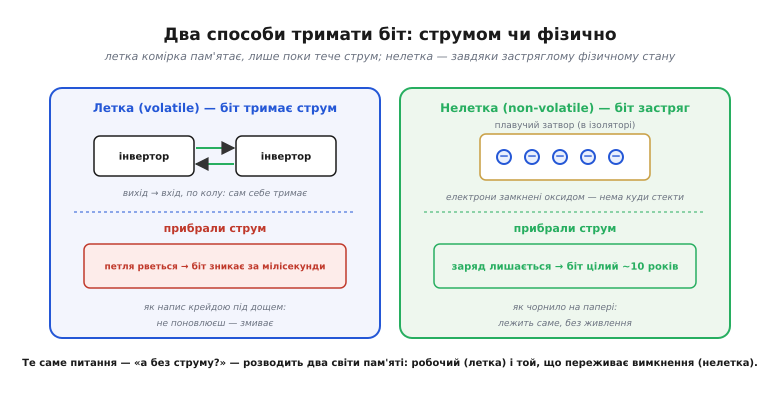
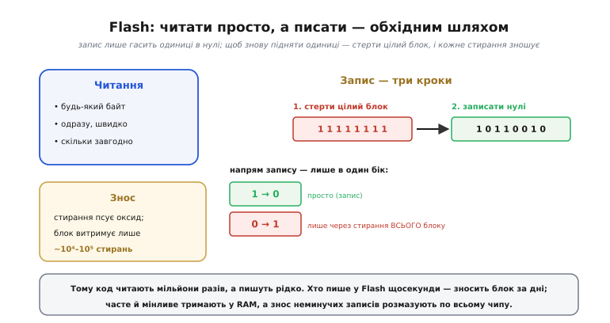

# Енергонезалежне зберігання

<preknowlist>
- [Пам'ять як масив](topic:programming/memory-as-array) — пам'ять машини як довгий ряд пронумерованих комірок-байтів, куди пишуть і звідки читають за адресою.
- [Біти й порядок байтів](topic:programming/bits-bytes-endianness) — байт як вісім бітів, число як послідовність байтів; що взагалі означає «зберегти дані».
</preknowlist>

Вимкніть комп'ютер посеред роботи — і все, що було в оперативній пам'яті, зникає безслідно. Увімкніть знову — а файли, програма, налаштування на місці. Ці дві частини пам'яті поводяться протилежно, і різниця не в програмі, а у **фізиці носія**. Розберімося, чому одна пам'ять забуває все за мить без струму, інша тримає роками, і що це коштує тому, хто пише код.

## Чому летка пам'ять забуває

Візьмемо комірку оперативної пам'яті — статичної (SRAM), тієї, з якої зроблена робоча пам'ять мікроконтролера. Усередині — крихітна петля з двох інверторів, замкнених одне на одного: вихід першого йде на вхід другого, а вихід другого — назад на вхід першого. Така петля має рівно два стійких стани («0» і «1») і сама себе тримає: якщо там «1», перший інвертор штовхає «1» у другий, другий повертає «1» у перший — біт стоїть.

Але стоїть він **лише поки тече струм**. Інвертор — це транзистори, а транзистор проводить, тільки коли на нього подано напругу. Приберіть живлення — і петля не має чим себе підтримувати; заряди на затворах стікають, обидва інвертори «відпускають», і за мілісекунди від стану не лишається нічого. Наступного ввімкнення комірка стартує з випадкового сміття.

> 🔧 **Навіщо це.** Саме тому глобальна змінна в C щоразу мусить отримати початкове значення заново: воно не «пам'ятається» в RAM між запусками. Стартовий код прошивки копіює початкові значення з нелеткого носія в RAM перед `main()` — бо в самій RAM їх узяти нема звідки.

Динамічна пам'ять (DRAM), з якої роблять головну пам'ять ПК, забуває навіть **із** живленням: там біт — це заряд на мікроскопічному конденсаторі, а конденсатор потихеньку розряджається сам, тож його доводиться освіжати тисячі разів на секунду. Різні комірки, той самий висновок: **летка пам'ять (volatile, від лат. volare — літати, звідси «летюча») тримає біт лише завдяки безперервному струму**. Немає струму — немає біта.

Аналогія — напис крейдою на дошці під час дощу: поки хтось стоїть і поновлює літери, напис читається; відійшов — дощ змив. Аналогія ламається в одному: дощ змиває поступово, а RAM гасне різко, за один спад напруги нижче робочого порога.

## Що означає «зберегти назавжди»

Щоб дані пережили вимкнення, потрібен носій, який тримає стан **без струму** — де сам стан застряг фізично, а не тримається зворотним зв'язком. Такий носій називають **енергонезалежним** (non-volatile): він не залежить від енергії ззовні, щоб пам'ятати. І тут інженерія знайшла кілька різних фізичних трюків «застрягання».

Класичний і досі найпоширеніший — **плавучий затвор** (floating gate). Уявіть звичайний польовий транзистор, але між керівним затвором і каналом вбудований ще один шматочок провідника, з усіх боків обгорнутий ізолятором — оксидом. Цей внутрішній затвор ні до чого не під'єднаний, він «плаває». Якщо якимось чином загнати на нього жменю електронів, вони там і лишаться: оксид навколо — стіна, крізь яку за звичайних умов заряд не тече. Наявність чи відсутність цього захопленого заряду зсуває поріг відмикання транзистора, і при читанні ми бачимо різницю — це і є збережений біт.

Загнати електрони крізь ізолятор допомагає квантовий ефект — **тунелювання Фаулера–Нордгейма**: під сильним електричним полем (десяток вольтів) електрони «протунельовують» крізь тонкий оксид на плавучий затвор. Прибрати їх — полем протилежного знаку. А от у спокої, без поля, вони сидять там **роками**: типовий носій зберігає заряд близько десяти років. Заряд усе-таки помалу стікає (швидше в спеці — за законом Арреніуса), тож «десять років» — не вічність, а паспортна цифра для звичайних умов.

*Порівняння двох способів тримати біт: у леткій комірці стан підтримує струм у петлі, у нелеткій — фізично захоплений заряд, якому струм не потрібен.*



Заряд у пастці — не єдиний трюк. У **сегнетоелектричній** пам'яті (FRAM) біт тримає напрям поляризації особливого кристала, який лишається поляризованим сам по собі. У **магніторезистивній** (MRAM) — напрям намагніченості крихітного магнітного шару. Спільне в усіх: є фізичний стан із двома стійкими положеннями, який **не потребує енергії, щоб зберігатися**, а лише щоб змінитися.

## Родина носіїв і чим вони різняться

Історично енергонезалежна пам'ять пройшла шлях від «зашито назавжди на заводі» до «перезаписуй скільки треба, побайтно». Кожен крок додавав гнучкості. Коротка ця історія — хто, коли й що саме зробив — винесена окремо: [як зростала родина: від масочного ROM до Flash](topic:programming/persistent-storage/hist-memory-lineage.md).

Сьогоднішній інженер обирає носій за кількома осями, і осі ці часто тягнуть у різні боки:

```
вісь                що означає для коду
──────────────────  ─────────────────────────────────────────────
зернистість запису  можна писати окремий байт — чи лише цілий блок?
витривалість        скільки разів комірку можна перезаписати?
швидкість запису    запис за такти — чи за мілісекунди?
об'єм і ціна         скільки байтів на гривню?
```

Зіставимо головних гравців по цих осях:

```
носій    запис             витривалість (циклів)   де живе
───────  ────────────────  ──────────────────────  ────────────────────
ROM      ніколи (завод)    —                        заводський код
EEPROM   побайтно          ~10⁴–10⁶                 малі налаштування
Flash    блоками           ~10⁴–10⁵ на блок         прошивка, SSD, картки
FRAM     побайтно          ~10¹⁴                    лічильники, чорні скриньки
MRAM     побайтно          ~10¹⁶ (майже без межі)   там, де пишуть безупину
```

Головна пастка ховається у стовпці «запис». **Flash — найдешевший і найємніший, але платить за це двома незручностями**, які треба знати, бо об них розбивається наївний код.

## Дві незручності Flash

**Перше: писати можна лише в один бік — гасити нулі в одиниці, а не навпаки.** Стерта комірка Flash — це «1». Запис може лише перетворити окремі одиниці на нулі. Щоб знову зробити з нуля одиницю, комірку треба **стерти** — а стирання б'є не по одному байту, а по цілому **блоку** (сектору) відразу, тисячами байтів гуртом. Тобто «переписати один байт» насправді означає: стерти весь блок (усе стало «1») і записати блок наново з потрібними нулями.

**Друге: кожне стирання потроху зношує оксид.** Сильне поле тунелювання, що ганяє електрони туди-сюди, з часом псує ізолятор навколо плавучого затвора — після десятків тисяч циклів комірка перестає надійно тримати заряд. Тому **число перезаписів блоку скінченне**.

Разом ці дві властивості дають просте, але залізне правило.

> 🔧 **Навіщо це.** Лічильник, що пише поточне значення у Flash щосекунди, зітре свій блок за лічені дні й перетворить чип на цеглу. Те, що змінюється часто, живе в леткій RAM; у Flash пишуть рідко — раз при прошивці, зрідка при збереженні налаштувань. А коли часто писати у Flash таки треба, знос **розмазують** по всьому чипу спеціальним шаром — щоб жоден блок не помирав першим. Про цей шар — [вирівнювання зносу](topic:programming/wear-leveling): що знати — Flash має обмежене число стирань блоку, тож службовий шар кружляє запис по всіх блоках порівну, продовжуючи життя чипа в десятки разів.

*Запис у Flash — це не «змінити байт», а «стерти весь блок в одиниці, тоді записати нулі»; часте стирання зношує блок.*



Коли зернистість блоку й знос заважають, а даних треба зберігати багато й часто, над сирою Flash кладуть **файлову систему**, розраховану саме на її вдачу — вона ховає стирання блоків, розкидає запис і дає звичний інтерфейс «файл» чи «ключ–значення». Що знати: [файлові системи для Flash](topic:programming/flash-filesystems) не переписують дані на місці, а дописують нову версію в чисте місце й позначають стару як застарілу, обходячи і зернистість блоку, і знос.

## Головна проблема: пережити зникнення живлення

Тут криється найтонше в усьому енергонезалежному зберіганні, і саме воно робить тему **системною**, а не просто питанням фізики. Носій пам'ятає без струму — чудово. Але **процес запису триває в часі**, а живлення може зникнути будь-якої миті цього процесу. Що станеться, якщо струм пропав **посеред** запису?

Уявімо просте збереження налаштувань: код стирає блок, потім записує туди новий запис із 200 байтів. Стирання пройшло, записалося 120 байтів — і тут просадка напруги, чип скидається. Після ввімкнення в блоці лежить **покруч**: перша частина — нові дані, решта — стерті одиниці, а разом це не старий і не новий запис, а сміття. Пристрій прочитає зіпсовані налаштування й може не завантажитися взагалі. Цей клас лиха називають **розривним записом** (torn write): операція, яку код замислив як єдине ціле, обірвалася посередині й лишила дані в напівстані.

Проблема та сама, що й у гонитві потоків за спільними даними, тільки суперник тут — не інший потік, а раптове вимкнення. Що знати про цей клас загалом: [атомарність і гонки](topic:programming/atomicity-races) — операція, яку хочеться бачити неподільною, насправді складається з кількох кроків, і між ними може втрутитися чужа сила, лишивши стан напівзміненим.

Розв'язок — зробити оновлення **атомарним**: або старий стан цілий, або новий цілий, третього не буває, хай би струм зник у будь-яку мить. Загальна ідея — **ніколи не псувати єдину копію на місці**. Пишемо нову версію **поруч**, у чисте місце, а перемикання зі старого на нове робимо однією крихітною дією, яка або сталася, або ні:

```c
// Атомарне збереження конфігурації: пишемо в резервний слот,
// перемикаємось однією позначкою. Старий слот цілий, поки новий
// не готовий повністю.
typedef struct {
    uint32_t seq;      // номер версії: більший = новіший
    Config   data;     // самі налаштування
    uint32_t crc;      // контрольна сума ВСЬОГО запису вище
} Record;

void config_save(const Config *cfg) {
    int cur  = active_slot();        // де зараз чинний запис (0 або 1)
    int next = cur ^ 1;              // пишемо в ІНШИЙ слот

    Record r;
    r.seq  = read_seq(cur) + 1;      // на одиницю новіший за чинний
    r.data = *cfg;
    r.crc  = crc32(&r, sizeof(r) - sizeof(r.crc));  // сума покриває seq і data

    flash_erase(next);               // готуємо чистий слот
    flash_write(next, &r, sizeof(r));// цілком записуємо новий запис
    // Аж ТЕПЕР новий запис існує повністю. Старий у слоті cur — недоторканий.
}
```

Чому це рятує від розривного запису? Розберімо, де саме може обірватися струм:

```
момент обриву             що в пам'яті після ввімкнення
────────────────────────  ──────────────────────────────────────────
до flash_erase(next)      обидва слоти старі; чинний cur — цілий
під час запису в next     next недописаний → його CRC не зійдеться;
                          читач відкине його й візьме цілий cur
запис у next завершився    next цілий і має більший seq → читач бере
                          його як чинний; старий cur відкине пізніше
```

Ключ — у стовпці «читач». При старті код читає **обидва** слоти, перевіряє CRC кожного й серед тих, що пройшли перевірку, бере запис із **найбільшим `seq`**:

```c
int active_slot(void) {
    Record a, b;
    bool ok_a = read_slot(0, &a) && crc_ok(&a);  // цілий і сума збіглась?
    bool ok_b = read_slot(1, &b) && crc_ok(&b);

    if (ok_a && ok_b) return (a.seq > b.seq) ? 0 : 1;  // обидва цілі — новіший
    if (ok_a) return 0;    // цілий лише слот 0
    if (ok_b) return 1;    // цілий лише слот 1
    return -1;             // обидва биті — перший старт або лихо
}
```

Недописаний запис завжди має **невірну контрольну суму** (бо в нього не потрапила частина даних або сам `crc`), і читач його просто не бачить. А чинним лишається той, що записався **до кінця**. Виходить властивість «усе-або-нічого»: перемикання поколінь відбувається не в мить запису байтів, а в мить, коли новий запис **уперше** проходить перевірку CRC. Живлення зникло раніше — маємо старий цілий стан; пізніше — новий цілий; напівстану не існує ніде.

> 🔧 **Навіщо це.** Це не академічна тонкість, а щоденний хліб прошивок: два слоти й `seq` рятують налаштування, лічильники напрацювання, журнали, а той самий прийом у більшому масштабі — два образи прошивки — дає безпечне оновлення «через повітря»: новий образ пишуть у вільний слот, а перемикаються на нього однією позначкою лише коли він записався й перевірився повністю. Готова реалізація такого сховища «ключ–значення» на мікроконтролері — [NVS](topic:programming/nvs): що знати — це журнальне сховище пар «ключ–значення» поверх Flash, яке саме веде версії, обходить знос і не б'є цілісність при зникненні живлення.

Той самий скелет — «пиши поруч, перемикайся однією дією, перевіряй сумою» — стоїть під усім спектром надійного зберігання: від збереження одного числа на дешевому чипі до журналів баз даних. Детальний розбір патерну з граничними випадками (що як обидва слоти мають однаковий `seq`, як бути з переповненням лічильника версій, чим замінити CRC там, де потрібен захист від підробки) — окремо: [патерн атомарного оновлення на місці](topic:programming/persistent-storage/proj-atomic-update.md).

## Що з усього цього забрати

Пам'ять машини живе у двох світах. **Летка** — швидка, побайтна, безмежно перезаписувана, але тримає дані лише під струмом: це робочий стіл для змінних, стека, купи. **Енергонезалежна** — пам'ятає без живлення завдяки фізично застряглому стану (заряд у плавучому затворі, поляризація, намагніченість), але платить за це: Flash пише блоками й зношується, EEPROM повільна, а швидкі FRAM і MRAM дорогі. Тому все, що мусить пережити вимкнення, — код, налаштування, журнали — кладуть у нелеткий носій, а часте й тимчасове лишають у RAM.

І над усім стоїть системна вимога, про яку легко забути, поки не «згорить» перший пристрій у полі: **запис має бути атомарним щодо зникнення живлення**. Не псуй єдину копію на місці — пиши нову поруч, перемикайся однією перевірюваною дією. Тоді хай струм зникне будь-якої миті — на носії завжди лежатиме цілий стан, старий або новий, але ніколи не покруч.
