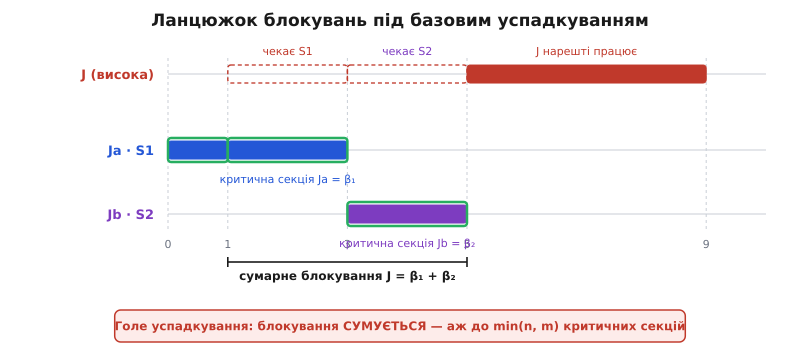
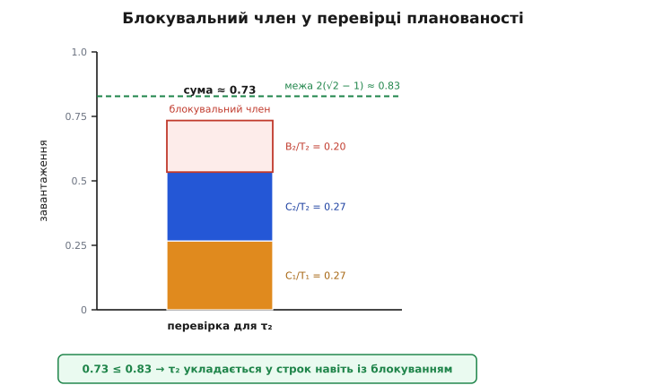

# 🧮 Два протоколи проти інверсії: строгий розбір

<preknowlist>
- [Планувальник](book:programming/scheduler) — фіксовані пріоритети, витіснення на користь важливішої готової задачі; період і строк періодичної задачі.
- [Черги й семафори](book:programming/task-ipc) — семафор і м'ютекс як замок навколо спільного ресурсу.
- Завантаження процесора задачею (частка *Cᵢ/Tᵢ* її часу від періоду) — базове поняття, потрібне для перевірки планованості; означення межі Ляна–Лейленда розписано просто в тексті нижче.
</preknowlist>

Інтуїція вже відома: голий замок пускає між власника й того, хто чекає, будь-кого — і інверсія стає необмеженою; «розумний» замок піднімає власника й повертає затримці стелю. Але «повертає стелю» — це обіцянка, а в системі реального часу обіцянки коштують рівно стільки, скільки їх можна **порахувати наперед**. Скільки саме простоїть найважливіша задача? Одну критичну секцію чи п'ять? Чи може ця цифра врости в зірваний строк? І чи не заведе успадкування у взаємне блокування, де ніхто не поступається взагалі?

На ці питання 1990 року дали строгу відповідь Луї Ша (Lui Sha), Рагунатан Раджкумар (Ragunathan Rajkumar) і Джон Лехоцкі (John P. Lehoczky) у статті «Priority Inheritance Protocols: An Approach to Real-Time Synchronization» (IEEE Transactions on Computers, т. 39, № 9, вересень 1990) — це **першоджерело**, де обидва протоколи вперше означено акуратно й доведено про них теореми. Розберімо їхній апарат від першопричини: що таке блокувальний член, чому базове успадкування дає лише **верхню межу** й пускає ланцюжки, чому стеля тисне блокування до **однієї** секції й доведено вбиває взаємне блокування, і як усе це одним доданком заходить у перевірку планованості.

## Блокувальний член: одне число, яке треба знати

Почнімо з означення, бо на ньому тримається все інше.

> **Блокувальний член** *Bᵢ* задачі *τᵢ* — це найдовший час, на який будь-який запуск задачі *τᵢ* може бути затриманий задачами **нижчого** пріоритету через спільні замки.

Три слова тут навантажені, і кожне варте паузи.

**«Нижчого пріоритету».** Затримка від задач вищого пріоритету — це не блокування, а звичайне витіснення: вони важливіші, їм і дорога, це закладено в саму ідею пріоритетів. Блокування — це протиприродна затримка: важливіша задача стоїть через **менш** важливу. Саме її треба окремо обмежити й порахувати, бо планувальник сам її не усуває.

**«Найдовший».** *Bᵢ* — не той час, що стався в конкретному прогоні, а найгірший можливий по всіх збігах у часі. Реального часу цікавить лише найгірший випадок: якщо задача вкладається у строк за найдовшого блокування, вона вкладеться завжди.

**«Через спільні замки».** Нижча задача може затримати вищу, лише поки тримає замок, потрібний вищій (або замок, до якого вищу не пустять за правилом протоколу). Поза критичною секцією нижчу негайно витісняють — блокувати вона не може.

> 🔧 **Навіщо це.** *Bᵢ* — не абстракція, а рядок у таблиці на етапі проєктування. Для кожної задачі прошивки треба вписати число: «стільки мілісекунд ця задача може простояти через дрібніші». Без нього перевірка планованості неповна — вона врахує витіснення згори, але прогледить затримку знизу, і система, що «за розрахунком встигає», зірве строк на стенді. Величина *Bᵢ* залежить не лише від коду, а й від того, **який протокол** керує замками: той самий набір критичних секцій дає під голим успадкуванням одне *Bᵢ*, під стелею — менше. Тому вибір протоколу — це прямо вибір числа, що вирішує, чи система планована.

Ключова прикмета блокувального члена: *Bₙ = 0* для найнижчої задачі. Під нею немає нікого, хто міг би її заблокувати, — тож найдрібніша задача блокувального члена не має взагалі. Це не окреме правило, а прямий наслідок означення, і він стане в пригоді як перевірка на здоровий глузд.

Тепер головне питання: **чому саме** цей член під двома протоколами виходить різний.

## Базове успадкування: чому лише верхня межа

Правило базового успадкування одне: щойно вища задача заблокувалася на замку, який тримає нижча, власник замка **успадковує** пріоритет того, хто чекає, — і несе цей піднятий пріоритет, доки не віддасть замок. Тоді пріоритет падає назад до рідного.

Це усуває необмеженість: доки нижча тримає потрібний вищій замок, її вже не витіснить ніякий середняк, бо на час тримання вона тимчасово важливіша. Затримка вищої більше не залежить від примхи посередників — вона впирається в **тривалість критичної секції** нижчої. Скінченна величина. Але — і в цьому вся тонкість — це лише **верхня межа однієї** секції, а не всієї затримки. Затримок може набратися кілька, і успадкування їх не склеює в одну.

Щоб побачити чому, потрібні два різновиди блокування, які розрізняє першоджерело.

**Пряме блокування.** Вища хоче замок *S*, а *S* уже в руках нижчої. Класика: вища чесно чекає, поки нижча добіжить свою секцію під *S*.

**Наскрізне блокування (push-through).** Тонший випадок. Нижча задача *J_L* тримає замок *S*, і через успадкування її пріоритет піднявся вище за якусь **середню** задачу *J_M* — вищу за *J_L*, але нижчу за того, хто спричинив успадкування. Тоді *J_M* стоїть, хоча *S* їй і не потрібен: її «проштовхує» вниз чужий успадкований пріоритет. Так замок, до якого середня не має діла, все одно її затримує.

А тепер збіг, від якого верхня межа однієї секції **не рятує**. Нехай вища задача *J* по черзі бере два замки — спершу *S1*, потім *S2*. Нижча *Ja* встигла взяти *S1*; ще нижча *Jb* — *S2*. *J* прокидається, хоче *S1* — стоїть, поки *Ja* добіжить свою секцію (перше блокування тривалістю *β₁*). *Ja* віддала *S1*, *J* його схопила, попрацювала, дійшла до *S2* — а *S2* тримає *Jb*, і *J* стоїть знову (друге блокування тривалістю *β₂*). Дві окремі критичні секції поспіль, дві затримки, які **сумуються** в *β₁ + β₂*.



*Під голим успадкуванням затримки від різних замків складаються: J чекає одну секцію Ja, потім ще одну секцію Jb. Верхня межа стосується кожної окремо, а не суми.*

Скільки таких доданків може набратися? Першоджерело дає точну відповідь двома лемами. З одного боку (Теорема 3), кожна з *n* нижчих задач може заблокувати *J* **щонайбільше раз** — вийшовши зі своєї секції, нижча вже не встигне заблокувати *J* повторно, бо її негайно витіснять. З другого боку (Теорема 6), кожен з *m* замків теж блокує *J* **щонайбільше раз** — бо семафор двійковий, і поки він зайнятий однією нижчою, іншій його не взяти. Обидві межі чинні водночас, тож переможе менша:

```
Базове успадкування — найгірше блокування:
  Bᵢ ≤ сума тривалостей до  min(n, m)  критичних секцій

  n — скільки нижчих задач можуть заблокувати τᵢ
  m — скільки різних замків можуть заблокувати τᵢ
```

Це і є «лише верхня межа»: не одна секція, а **сума** — до min(*n*, *m*) доданків. Цитуючи авторів прямо: під базовим успадкуванням задачу можна заблокувати на тривалість min(*n*, *m*) критичних секцій. Величина скінченна й обчислювана наперед — цим успадкування вже незрівнянно краще за голий замок. Але вона може бути велика, і росте вона з кількістю замків, які бере задача.

### Дві шпарини, яких сума не закриває

Сумарне блокування — прикро, та передбачувано. Гірше те, що базове успадкування, крім довгої суми, лишає ще дві діри, які самою арифметикою не залатати.

**Ланцюжок блокувань (chained blocking)** — це якраз та сама сума, побачена з боку затримки: одна вища задача проходить через кілька послідовних блокувань від різних нижчих. Що більше замків вона зачіпає, то довший ланцюг і то більший розкид найгіршого часу.

**Взаємне блокування (deadlock)** — окрема, злоякісніша діра. Успадкування саме по собі його **не виключає**. Першоджерело подає такий сценарій. Нехай *J2* бере *S2*, тоді хоче вкладено взяти *S1*. Тим часом прокидається вища *J1*, витісняє *J2*, бере *S1* — і тепер хоче *S2*. Складається замкнене коло: *J1* тримає *S1* і чекає *S2*; *J2* тримає *S2* і чекає *S1*. Ніхто не поступиться, обидві стоять навік. Успадкування тут безсиле: воно вміє **піднімати** власника, але не вміє **не дати** утворитися колу.

Тому в першоджерелі базове успадкування розбирають з окремим застереженням: взаємне блокування усувають **сторонніми засобами** — наприклад, жорстким порядком, у якому дозволено брати замки (завжди *S1* перед *S2*, ніколи навпаки). Спрацьовує, але це дисципліна поза протоколом: її мусить витримати кожен програміст у кожному місці коду, і жоден замок сам її не нагляне. Саме ці дві шпарини — довгий ланцюг і незакритий deadlock — і закриває наступний протокол однією конструкцією.

## Протокол стелі: одна секція й доведено без deadlock

Ідея стелі, якщо звести її до одного речення першоджерела: не пускати задачу в нову критичну секцію, поки не буде **гарантовано**, що ця секція виконається на пріоритеті **вищому** за успадковані пріоритети всіх уже перерваних чужих секцій. Якщо гарантії немає — задачу не пускають і присипляють, а той, хто її блокує, успадковує її пріоритет. Ця відмова наперед і є те, що ламає і ланцюжки, і кола.

Реалізується ідея двома складниками.

**Стеля замка.** Кожному замку *S* наперед приписують число — **стелю** (priority ceiling): пріоритет найвищої задачі, яка коли-небудь цей замок бере.

```
стеля(S) = найвищий пріоритет серед усіх задач,
           що будь-коли беруть замок S
```

Стелю можна порахувати статично, ще на етапі складання системи: досить знати, хто які замки чіпає. Змістовно стеля — це відповідь на питання «наскільки важливу задачу цей замок може зачепити?».

**Правило входу.** Задача *J* дістає дозвіл узяти замок (почати нову критичну секцію), **лише якщо** її пріоритет **строго вищий** за стелі **всіх замків, зайнятих у цей момент іншими** задачами. Інакше *J* блокується, хоч би замок, якого вона просить, був вільний.

```
J може взяти замок  ⟺  пріоритет(J) > max стеля(Sₖ)
                        по всіх Sₖ, зайнятих іншими задачами
```

Останнє слово тут — головне й найнесподіваніше. Задачу можуть **не пустити навіть до вільного замка**, якщо десь тримають інший замок із високою стелею. Ця «зайва» відмова — не недогляд, а плата: саме вона вбиває обидві шпарини успадкування. Першоджерело виділяє її як третій вид блокування — **блокування стелею (ceiling blocking)** — на додачу до прямого й наскрізного. Протокол свідомо жертвує трохи паралельності заради двох залізних гарантій. Погляньмо, як вони виникають.

### Чому щонайбільше одна секція

Твердження першоджерела різке: під протоколом стелі задачу може заблокувати нижча **щонайбільше на тривалість однієї** критичної секції за весь запуск (Теорема 12). Не сума, не min(*n*, *m*) — **один** доданок.

Ключ — лема про наскрізність (у першоджерелі Лема 8): якщо секцію задачі *Jj* перервала задача *Ji*, увійшовши у власну секцію, то *Jj* **не зможе** успадкувати пріоритет, вищий або рівний *Ji*, доки *Ji* не завершиться. Чому? Бо *Ji* пустили в її секцію лише тому, що її пріоритет був **вищий за стелі всіх** зайнятих замків. Виходить, жодна задача з пріоритетом *Ji* або вищим уже не заблокується на тих замках — правило входу їх туди просто не пустить. А раз ніхто такий не заблокується, *Jj* нема від кого успадкувати той високий пріоритет.

Звідси прямо валиться **транзитивне блокування** (Лема 9): ланцюжок «*J* чекає *Ji*, а *Ji* чекає *Jj*» вимагав би, щоб *Jj* успадкувала пріоритет *J* понад *Ji* — а це заборонено щойно наведеною лемою. Ланцюг довший за одну ланку не збирається. Отже, коли важлива задача починає роботу, її може затримати рівно **одна** нижча секція — та, що вже трималася в мить її старту; далі жодне вкладене блокування не нарощується. Сумарне min(*n*, *m*) стискається в одиницю:

```
Протокол стелі — найгірше блокування:
  Bᵢ = тривалість ОДНІЄЇ найдовшої критичної секції
       нижчої задачі, що може заблокувати τᵢ
```

Порівняймо два *Bᵢ* поруч, бо саме тут виграш стає числом:

```
                    Bᵢ (найгірший випадок)
базове успадкування : сума до min(n, m) критичних секцій
протокол стелі      : одна найдовша критична секція
```

Що більше замків бере задача, то ширша прірва між цими рядками.

### Чому взагалі без deadlock

Друга гарантія — доведена відсутність взаємного блокування (Теорема 10). Доказ короткий і спирається на ту саму лему про наскрізність.

Взаємне блокування — це коло задач, де кожна тримає замок і чекає замок сусіда. У колі мусить бути щонайменше двоє. Але Лема 9 щойно показала: транзитивних ланцюгів немає, тож у «колі» може бути щонайбільше **двоє** — назвімо їх *J1* і *J2*. Нехай секцію *J2* перервала *J1*, увійшовши у свою секцію. Тоді за лемою про наскрізність *J2* **не може** успадкувати пріоритет, рівний *J1* чи вищий, доки *J1* не завершиться. А замкнене коло вимагало б протилежного: щоб *J2*, тримаючи потрібний *J1* замок, стала на шляху *J1* «як рівна» — тобто перебрала її пріоритет. Суперечність. Кола не буде.

Це доведено, а не залатано дисципліною. Програмісту вже не треба вручну впорядковувати взяття замків, щоб уникнути deadlock, — сама конструкція входу унеможливлює коло, і то за єдиної слабкої умови: задача не блокує **сама себе** (не бере той самий замок двічі вкладено). Про це першоджерело каже прямо: доки жодна задача не входить у deadlock сама з собою, deadlock у системі не виникне. Ось за що платять «зайвим» блокуванням стелі — за верхню межу в **одну** секцію й за коло, якого не буде ніколи.

### Негайна стеля: той самий результат, простіша реалізація

У протоколі стелі є дві форми, і в прошивці частіше живе друга.

**Первинна стеля (original / OCPP).** Власник підстрибує до стелі не одразу, а лише коли на замок **справді** спробувала заблокуватися важливіша задача — тоді власник успадковує її пріоритет. Пріоритет міняється лише за фактом блокування.

**Негайна стеля (immediate / ICPP; у POSIX — *priority protect*, «захист пріоритетом»).** Власник підстрибує до стелі замка **одразу** при взятті, ще до того, як хтось заблокувався. Наслідок гарний: поки задача тримає замок, вона вже біжить на його стелі, тож жодна задача, здатна цей замок зачепити, взагалі не отримає процесора й не встигне заблокуватися. Блокування стає геть неявним — задача або не стартує, або, стартувавши, уже нікого не чекає.

Головне: **обидві форми дають однакову найгіршу поведінку** — те саме *Bᵢ* в одну секцію, ту саму відсутність deadlock. Різниця суто інженерна. Негайна стеля міняє пріоритет частіше (при кожному взятті замка), зате не потребує від ядра відстежувати черги очікування на замках і робить менше перемикань контексту в разі суперечки — тому її й люблять реалізації. Саме негайну стелю втілює атрибут м'ютекса `PTHREAD_PRIO_PROTECT` у POSIX і стельовий м'ютекс у багатьох RTOS.

## Як блокувальний член заходить у перевірку планованості

Тепер зберімо все докупи: навіщо взагалі так морочитися з *Bᵢ*. Затим, що це **єдиний доданок**, яким блокування входить у перевірку, чи встигне система.

Класичну перевірку для фіксованих пріоритетів дав тест Ляна–Лейленда (Liu & Layland) для монотонної за темпом розкладки: набір із *n* періодичних задач укладається у строки, якщо сумарне завантаження не перевищує межу

```
C₁/T₁ + C₂/T₂ + … + Cₙ/Tₙ  ≤  n·(2^(1/n) − 1)
```

де *Cᵢ* — час обчислення задачі, *Tᵢ* — її період. Права частина спадає з *n* від 100 % (одна задача) до ≈ 69 % (межа при великому *n*). Але цей тест припускає, що задачі **незалежні** — ніхто нікого не блокує. Реальна прошивка ділить ресурси, отже блокує; тест треба узагальнити.

Узагальнення першоджерела (Теорема 16) вражає простотою. Блокування задачі *τᵢ* — хоч пряме, хоч наскрізне, хоч стелею — за побудовою протоколу не перевищує *Bᵢ*. Тож його додають **одним членом** до перевірки саме тієї задачі. Причому перевіряти треба **кожну** задачу окремо (для кожного *i* від 1 до *n*), беручи лише задачі від найвищої до *i*-ї включно плюс її власний блокувальний член:

```
Для кожної i = 1 … n:
  C₁/T₁ + C₂/T₂ + … + Cᵢ/Tᵢ  +  Bᵢ/Tᵢ   ≤   i·(2^(1/i) − 1)
  └──────── витіснення згори + своє ────┘   └── власне блокування знизу ──┘
```

Перші *i* доданків — це витіснення від усіх вищих задач і власне обчислення *τᵢ*; окремий член *Bᵢ/Tᵢ* — найгірше блокування знизу. Задача планована, якщо нерівність тримається для **кожного** *i*.

**Чому доданок саме такий — і саме тут.** Доказ першоджерела прозорий до краси. Якщо для *τᵢ* нерівність виконано, то це те саме, що взяти незалежний тест Ляна–Лейленда, але з роздутим часом обчислення *C\*ᵢ = Cᵢ + Bᵢ*. Тобто: якщо задача встигла б, **виконуючись** зайві *Bᵢ* одиниць, то вона встигне й тоді, коли ці *Bᵢ* одиниць вона не рахує, а **стоїть заблокована**. Простій знизу й зайва робота — для строку однаково згаяний час. Ось чому блокування заходить рівно як додаткова «уявна» тривалість самої задачі, і рівно у її власну нерівність.

Погляньмо на це очима стосу завантаження.



*Блокувальний член кладеться згори на стос завантаження, як «уявне» продовження задачі. Планованість зберігається, поки вершина стосу не перетнула межу.*

Пройдімо конкретний приклад — просто з першоджерела (Теорема 18, там перевіряють точним тестом; тут ідея та сама).

**Умова: три періодичні задачі, τ₁ найважливіша. Часи в умовних одиницях.**

```
τ₁ : C₁ = 40,  T₁ = 100,  B₁ = 20     U₁ = 0.40
τ₂ : C₂ = 40,  T₂ = 150,  B₂ = 30     U₂ ≈ 0.267
τ₃ : C₃ = 100, T₃ = 350,  B₃ = 0      U₃ ≈ 0.286
```

Сумарне завантаження без блокування ≈ 0.40 + 0.267 + 0.286 = 0.953 — надто високо, щоб проскочити простий утилізаційний тест згори. Тому перевіряємо задачу за задачею, точним тестом на найкоротший строк (перший дедлайн), додаючи блокувальний член:

```
τ₁:  C₁ + B₁  ≤  T₁ ?
     40 + 20 = 60  ≤  100        ✓  (τ₁ встигає до першого строку)

τ₂:  за найгіршого збігу τ₂ мусить умістити своє обчислення,
     одне витіснення від τ₁ і власне блокування у межах строку T₂:
     C₂ + B₂ + C₁  ≤  T₂ ?
     40 + 30 + 40 = 110  ≤  150   ✓

τ₃:  B₃ = 0 (нижче немає кого чекати); τ₃ терпить витіснення
     від τ₁ і τ₂ у межах свого строку — теж укладається.  ✓
```

Усі три нерівності тримаються — набір планований. Зверніть увагу на два уроки, вбудовані в цифри. По-перше, *B₃ = 0*: найнижча задача блокувального члена не має — саме та перевірка на здоровий глузд, що випливала з означення. По-друге, блокування **з'їдає запас**: у *τ₂* сам код важить лише 40 із 150, та після додавання *B₂ = 30* і витіснення від *τ₁* лишається всього 40 одиниць люфту. Зменшиться цей люфт — і задача, «яка за завантаженням легка», зірве строк саме через блокування знизу. Ось чому *Bᵢ* не можна прогледіти: воно з'їдає той самий бюджет строку, що й обчислення, і система, планована на папері без нього, на стенді валиться.

І тут дві частини історії стуляються в один інженерний висновок. *Bᵢ* заходить у перевірку одним доданком — але **величина** цього доданка залежить від протоколу. Під голим успадкуванням *Bᵢ* — сума до min(*n*, *m*) секцій, доданок товстий, запас строку тане швидко, і та сама система легше провалює тест. Під стелею *Bᵢ* — одна секція, доданок худий, а на додачу зникає ризик deadlock, який жодним доданком не виміряти взагалі. Тому в системах найвищої критичності беруть стелю (частіше — негайну): платять трохи наперед — треба знати стелі всіх замків — а натомість дістають і найтонше можливе блокування в перевірці, і гарантію, що замкненого кола не буде ніколи.
