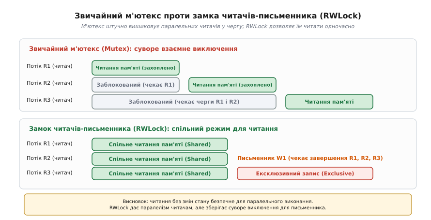
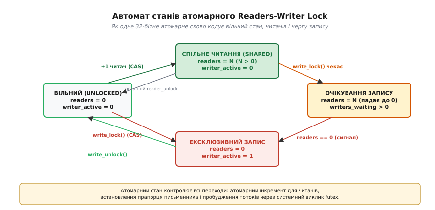
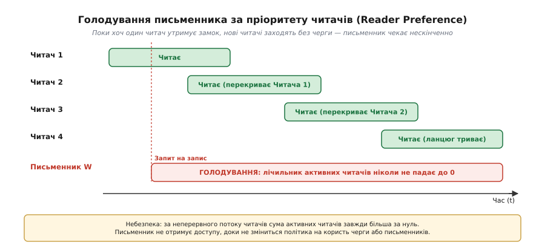
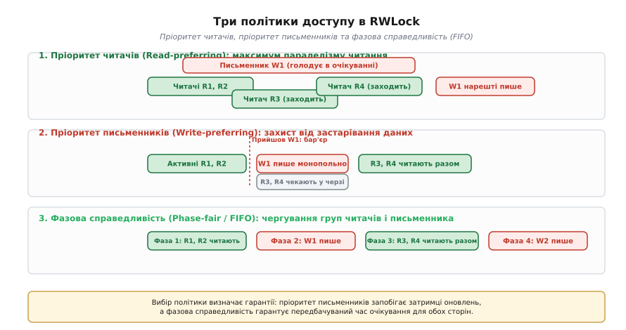
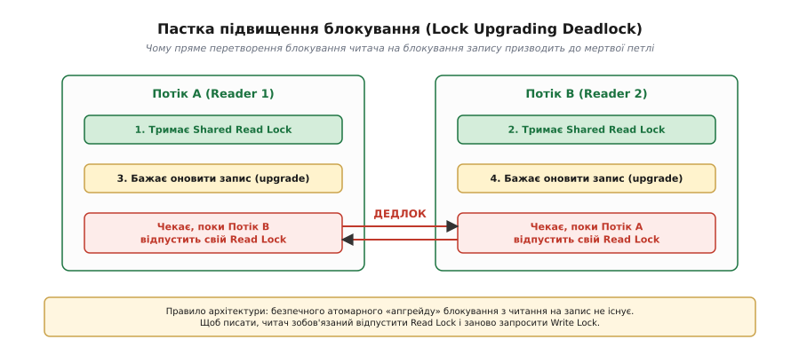
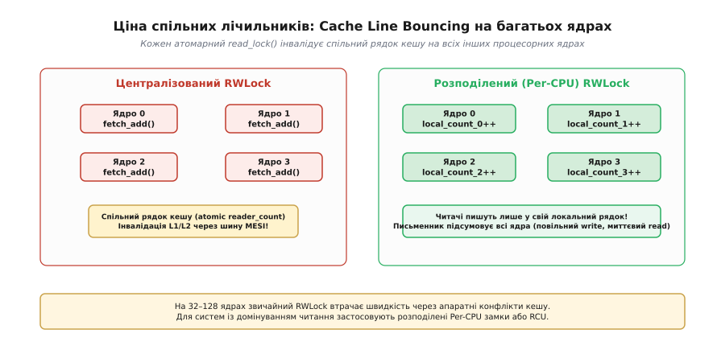

# Багато читачів, один письменник

<preknowlist>
- [Атомарність і гонки](topic:programming/atomicity-races) — чому спільний стан ламається без синхронізації та як працюють критичні секції.
- [Перегони даних і замки](topic:programming/data-races-locks) — взаємне виключення (м'ютекс) для захисту спільних даних у паралельних потоках.
- [Дедлок](topic:programming/deadlock) — взаємне блокування потоків під час очікування зайнятих ресурсів.
</preknowlist>

Уявімо сервер доменних імен (DNS) або високонавантажений мережевий шлюз маршрутизації, який обробляє 100 000 вхідних пакетів щосекунди на 32 процесорних ядрах. Для кожного пакету мережевий стек повинен виконати швидкий пошук префікса в таблиці маршрутизації, розташованій у спільній оперативній пам'яті. У такій системі 99.9% усіх звернень — це виключно зчитування маршрутів, а оновлення топології службовим демоном відбувається лише раз на кілька хвилин. Якщо захистити цю таблицю класичним м'ютексом, 32 ядра процесора не зможуть читати пам'ять одночасно: замок змусить їх вишикуватися в єдину сувору чергу. Тридцять одне ядро простоюватиме в очікуванні, пропускна здатність впаде в десятки разів, а час відгуку зросте через постійне перемикання контекстів та присипляння потоків планувальником операційної системи.

### Чому взаємне виключення надмірне для паралельного читання

Корінь неефективності звичайного замка полягає у природі конфліктів доступу до пам'яті. Взаємне виключення (лат. *mutua exclusio*, скорочено [м'ютекс](topic:programming/data-races-locks)) було створене для захисту від перегонів даних (англ. *data races*), коли несинхронізований паралельний доступ порушує внутрішню цілісність структури. Проте стан гонки виникає виключно за умови, коли хоча б один із потоків виконує **запис** — тобто модифікує байти в пам'яті, перебудовує вказівники бінарного дерева або переалокує масив геш-таблиці.

Коли два або двадцять потоків лише зчитують пам'ять, жоден байт не змінюється. Їхні операції читання абсолютно безпечні для одночасного виконання, не створюють спотворень і не заважають одна одній. Звичайний м'ютекс «не бачить» різниці між читанням і записом: він забороняє будь-який паралелізм, вважаючи кожного відвідувача критичної секції потенційним руйнівником даних.


*Звичайний м'ютекс штучно серіалізує паралельні потоки читання в одну повільну чергу. Замок читачів-письменника дозволяє довільній кількості читачів звертатися до пам'яті одночасно, але надає монопольний доступ письменнику, коли потрібно змінити дані.*

Для подолання цього обмеження було розроблено спеціалізований примітив синхронізації — **замóк читачів-письменника** (англ. *readers-writer lock*, або скорочено *rwlock*), також відомий як розділювано-монопольний замок (англ. *shared-exclusive lock*). Він підтримує два чітко розмежованих режими захоплення:

1. **Розділюваний режим (Shared / Read Lock):** довільна кількість потоків-читачів може одночасно утримувати блокування та паралельно читати пам'ять, за умови, що в цей час немає активного письменника.
2. **Монопольний режим (Exclusive / Write Lock):** рівно один потік-письменник отримує виключний доступ до пам'яті. Усі інші потоки — як читачі, так і інші письменники — повністю блокуються і чекають за межами критичної секції.

Такий поділ повертає системі повний апаратний паралелізм на операціях зчитування, зберігаючи математично строгу безпеку даних під час рідкісних модифікацій.

### Внутрішня будова та атомарний автомат станів

Як замок читачів-письменника влаштований зсередини? У сучасних операційних системах та системних бібліотеках багатопотоковості rwlock оптимізований для максимальної швидкості та мінімального споживання пам'яті. Замість важких структур стан замка кодується в єдиному 32-бітному або 64-бітному [атомарному числі](topic:programming/std-atomic) (грец. *ἄтоμος*, *átomos* — неподільний).

Типовий розподіл бітів у такому атомарному слові виглядає наступним чином:
- Молодші біти (наприклад, біти 0..29) зберігають лічильник активних читачів (`reader_count`), які зараз перебувають у критичній секції.
- Старший біт (біт 31) є прапорцем монопольного запису (`writer_active`). Він дорівнює `1`, якщо письменник захопив замок.
- Додатковий біт або сусіднє поле (біт 30) позначає наявність очікуючих у черзі письменників (`writers_waiting`).


*Автомат станів атомарного rwlock: переходи між вільним станом, паралельним читанням багатьох потоків, чергою очікування запису та монопольним володінням одного письменника.*

Завдяки такому представленню замок реалізує швидкий шлях (англ. *fast path*) без звернення до ядра операційної системи:

- **Вхід читача (`read_lock`):** потік виконує атомарну інструкцію порівняння з обміном (CAS, англ. *Compare-And-Swap*) або атомарне додавання `fetch_add(1)`. Якщо прапорець письменника дорівнює `0`, лічильник читачів успішно збільшується, і потік миттєво входить у критичну секцію за лічені наносекунди.
- **Вихід читача (`read_unlock`):** потік атомарно зменшує лічильник `fetch_sub(1)`. Якщо лічильник після віднімання став рівним `0` і в системі є очікуючий письменник, потік робить системний виклик (наприклад, `futex` у Linux), щоб розбудити заснулий потік запису.
- **Вхід письменника (`write_lock`):** потік перевіряє, чи значення слова дорівнює точно `0` (немає ні читачів, ні іншого письменника), і атомарно виставляє біт `writer_active = 1`. Якщо стан ненульовий, потік переходить на повільний шлях (англ. *slow path*), збільшує лічильник очікуючих письменників і засинає в черзі очікування планувальника ОС.
- **Вихід письменника (`write_unlock`):** потік скидає біт `writer_active` в `0` і сповіщає потоки, що очікують у черзі.

В ядрі Linux схожий механізм реалізований у семафорі читачів-письменників `rw_semaphore` (`down_read` / `down_write` / `up_read` / `up_write`), де стан кодується єдиним 64-бітним цілим числом: додатні значення позначають кількість читачів, а від'ємні значення сигналізують про присутність або очікування активного письменника. Якщо блокування триває лічені такти в контексті обробників переривань, ядро надає [спінлок](topic:programming/spinlock) читачів-письменника (`rwlock_t`), де потік не засинає, а активно крутиться в циклі.

Як саме створюється повнофункціональний замок з умовними змінними та захистом від гонок, докладно розібрано у вставці [Реалізація замка з пріоритетом запису](topic:programming/readers-writer-lock/proj-rwlock-impl.md).

### Три політики планування: небезпека голодування

На перший погляд здається, що правила прості: читачі читають разом, письменник пише сам. Але що має відбуватися, коли читачі вже перебувають усередині критичної секції, підходить письменник і стає в чергу, а вслід за ним прибуває новий читач? Чи повинен новий читач негайно увійти, чи він зобов'язаний зачекати на письменника?

Відповідь на це питання формує **політику планування** (англ. *scheduling policy*) замка. Історично виділяють три класичні варіанти, кожен із яких несе фундаментальні компроміси.

#### 1. Пріоритет читачів (Read-preferring / Reader-bias)

За цієї політики новий читач отримує доступ негайно, якщо в цей момент хоча б один інший читач уже утримує замок, навіть якщо в черзі вже стоїть і чекає письменник.

Це рішення дає абсолютний максимум пропускної здатності для читання, оскільки читачі ніколи не зупиняються штучно. Проте воно породжує критичну вразливість — **голодування письменника** (англ. *writer starvation*).


*Якщо потік читачів інтенсивний, інтервали їхньої роботи постійно перекриваються: перший ще не вийшов, як зайшов другий, другий не вийшов — зайшов третій. Сумарна кількість читачів ніколи не падає до нуля, і потік запису блокується на невизначений час.*

У системах із високим навантаженням голодування письменника призводить до накопичення застарілих даних, вичерпання буферів запису та фактичного зависання оновлювальних модулів програми.

#### 2. Пріоритет письменників (Write-preferring / Writer-bias)

Щойно будь-який потік викликає `write_lock()` і стає в чергу, замок переходить у стан блокування нових читачів. Усі нові читачі, які надходять після цього моменту, зупиняються на вході й засинають. Ті читачі, які вже встигли зайти до появи письменника, спокійно дочитують і виходять. Щойно останній із них відпускає замок, лічильник читачів падає до нуля, і черговий письменник негайно захоплює монопольний контроль.

Ця політика гарантує свіжість даних: оновлення не відкладаються в довгий ящик. Проте вона має зворотний бік — **голодування читачів** (англ. *reader starvation*). Якщо програма починає генерувати часті або довгі записи, читачі будуть постійно заблоковані, а паралельний зчитувальний трафік деградує.

#### 3. Фазова справедливість та черги FIFO (Fair / Phase-fair locks)

Щоб унеможливити голодування обох сторін, застосовують справедливі алгоритми доступу, які вишиковують усі запити за порядком надходження (англ. *First-In, First-Out* — перший прийшов, перший пішов).

Найбільш ефективним різновидом справедливих замків є **фазово-справедливий замок** (англ. *phase-fair rwlock*, розроблений Бранденбургом та Андерсоном). Замість обслуговування кожного запиту поодинці алгоритм чергує дві фази:
- **Фаза читання:** усі читачі, які стояли в черзі на момент закінчення попереднього запису, запускаються в критичну секцію єдиною групою та виконують роботу паралельно.
- **Фаза запису:** після завершення поточної групи читачів управління передається одному письменнику з черги. Наступні читачі чекають завершення цього запису.

Фазово-справедливі замки гарантують строгу верхню межу часу очікування: будь-який читач очікує щонайбільше завершення однієї фази запису, а будь-який письменник очікує щонайбільше завершення однієї фази читання та однієї фази запису. Це робить час реакції системи повністю передбачуваним.


*Порівняння трьох політик планування в часі: пріоритет читачів веде до голодування запису; пріоритет письменників оперативно пропускає зміни; фазова справедливість чергує пакети читачів і окремі записи за принципом строгої черги.*

Математичні розрахунки ймовірності голодування та середнього часу очікування наведено у вставці [Імовірнісна модель голодування та ціна когерентності](topic:programming/readers-writer-lock/math-rwlock-fairness.md). А про те, як історично в 1971 році формулювалися ці три задачі в наукових працях, читайте у вставці [Від семафорів Дейкстри до задачі Куртуа](topic:programming/readers-writer-lock/hist-courtois.md).

### Пастка підвищення блокування (Lock Upgrading Deadlock)

Класична архітектурна пастка під час використання rwlock виникає, коли потік хоче «підвищити» (англ. *upgrade*) своє блокування з розділюваного читання до монопольного запису.

Розгляньмо типовий сценарій: потік-читач шукає запис у кеші. Він захоплює `read_lock()`, перевіряє таблицю і виявляє, що потрібного ключа немає. Тепер потік хоче обчислити значення та вставити його в таблицю. Розробник-початківець вирішує: «Я вже тримаю замок, навіщо мені його відпускати? Я просто викличу функцію переходу в монопольний режим `upgrade_to_writer()`».

Чому це майже гарантовано призводить до взаємного блокування ([дедлоку](topic:programming/deadlock))?


*Два потоки A і B одночасно тримають Shared Read Lock і водночас вирішують виконати підвищення до Write Lock. Потік A чекає, поки потік B відпустить свій Read Lock, а потік B чекає, поки потік A відпустить свій. Виникає класична мертва петля.*

Оскільки обидва читачі заблоковані всередині спроби підвищення і чекають один одного, жоден із них ніколи не вийде з критичної секції читання. Система мертво зависає.

Саме тому стандартні системні інтерфейси — як-от POSIX `pthread_rwlock` та стандартна бібліотека C++ (`std::shared_mutex`) — **взагалі не підтримують операцію підвищення блокування**.

Правильний патерн роботи вимагає суворого двоетапного підходу:

1. Читач захоплює `read_lock()`, перевіряє наявність даних.
2. Якщо дані відсутні, читач **повністю відпускає** `read_unlock()`.
3. Потік захоплює повноцінний монопольний замок `write_lock()`.
4. **Обов'язкова повторна перевірка (Double-Checked Locking):** після захоплення `write_lock()` потік зобов'язаний знову перевірити наявність ключа в таблиці! Адже за той проміжок часу, поки замок був вільний між кроками 2 і 3, інший потік міг встигнути захопити запис і додати цей ключ.
5. Якщо ключа досі немає — виконати запис.
6. Звільнити `write_unlock()`.

#### Пониження блокування (Lock Downgrading)

На відміну від підвищення, зворотна операція — **пониження блокування** (англ. *lock downgrading*) з монопольного запису на розділюване читання — є абсолютно безпечною. Оскільки письменник утримує монопольний доступ і в критичній секції більше немає нікого, він може атомарно трансформувати стан замка з `writer_active = 1` на `reader_count = 1`, не випускаючи ресурс із рук і не дозволяючи іншим письменникам вклинитися між записом і наступним читанням. Деякі спеціалізовані бібліотеки (наприклад, `boost::shared_mutex` або ядро Linux) підтримують цю операцію.

### Інверсія пріоритетів у замках читачів-письменника

У системах реального часу замок читачів-письменника стикається зі складною проблемою [інверсії пріоритетів](topic:programming/priority-inversion). У випадку звичайного м'ютекса протокол успадкування пріоритетів (англ. *Priority Inheritance Protocol*, PIP) працює просто: якщо високопріоритетний потік блокується на м'ютексі, потік із низьким пріоритетом, який зараз утримує замок, тимчасово підвищує свій пріоритет до рівня очікуючого, щоб якнайшвидше завершити роботу та віддати ресурс.

У замку читачів-письменника ситуація набагато заплутаніша:
- Якщо високопріоритетний письменник чекає звільнення замка, його можуть блокувати **десятки низькопріоритетних читачів одночасно**.
- Ядро операційної системи зобов'язане підвищити пріоритет **усім активним читачам одразу**. Якщо хоча б одного читача буде пропущено, середньопріоритетний сторонній потік витіснить його з процесора, і високопріоритетний письменник чекатиме необмежено довго.
- Якщо замок використовує чергу FIFO, підвищення пріоритету має передаватися ланцюжком через усіх читачів і письменників, які стоять у черзі перед високопріоритетною задачею.

Через надмірну складність та накладні витрати на відстеження множинних володільців більшість операційних систем загального призначення не реалізують успадкування пріоритетів для rwlock. Тому в жорстких системах реального часу (RTOS) замки читачів-письменника замінюють на детерміновані черги повідомлень або схеми з подвійною буферизацією.

### Апаратні обмеження на багатоядерних системах (Cache Bouncing)

Коли кількість процесорних ядер у системі зростає до 32, 64 або 128 (сервери AMD EPYC, Intel Xeon або багатоядерні чипи ARM Ampere), розробники стикаються з несподіваним парадоксом: заміна звичайного м'ютекса на rwlock під високим навантаженням читання іноді призводить **не до прискорення, а до різкого падіння продуктивності**.

Чому це відбувається на рівні апаратного забезпечення комп'ютера?

Причина криється в роботі кеш-пам'яті та апаратних [протоколів когерентності кешу](topic:programming/memory-ordering-barriers) (MESI / MOESI).


*Апаратне вузьке місце централізованого rwlock: кожен читач виконує атомарну інструкцію запису в спільний лічильник reader_count. Це інвалідує рядок кешу на всіх інших ядрах і створює колосальний трафік між'ядерної шини. Розподілений замок Per-CPU усуває конфлікти кешу.*

Щоб зайти в режим читання, кожен потік на кожному ядрі зобов'язаний виконати атомарну інструкцію (наприклад, `LOCK XADD` на x86 або `LDREX/STREX` на ARM), яка змінює спільну змінну `reader_count`. 

З погляду процесорного ядра зміна лічильника — це операція **запису в пам'ять**:
1. Ядро 0 виконує атомарний інкремент лічильника. Для цього воно захоплює монопольні права на 64-байтовий рядок кешу (Cache Line), в якому лежить замок, і надсилає широкомовний сигнал інвалідації (RFO, англ. *Read For Ownership*) по між'ядерній шині.
2. Рядки кешу L1 та L2 на ядрах 1, 2, 3... 63 миттєво інвалідуються (викидаються як застарілі).
3. Через кілька наносекунд ядро 1 намагається виконати свій `read_lock`. Воно стикається з апаратним промахом кешу (Cache Miss), зупиняє виконання інструкцій і змушене через системну шину тягнути оновлений рядок кешу з ядра 0.
4. Ядро 1 змінює лічильник і своєю чергою інвалідує рядок на ядрі 0 та всіх інших ядрах.

Цей ефект називається **хитанням рядка кешу** (англ. *cache line bouncing*). Хоча логічно всі 64 потоки лише читають корисні дані, фізично вони безперервно б'ються за один і той самий 64-байтовий шматочок пам'яті, в якому зберігається сам лічильник замка. Пропускна здатність між'ядерної шини вичерпується, ядра простоюють у циклах очікування пам'яті, а накладні витрати на взяття блокування зростають у сотні разів.

#### Розв'язання проблеми: Per-CPU Locks та RCU

Для подолання апаратного конфлікту кешів у високонавантажених системах застосовують два принципово інші підходи:

1. **Розподілені замки на рівні ядер (Per-CPU / Big-Reader Locks):**
   Замість одного спільного лічильника читачів створюється масив лічильників — окремий лічильник для кожного процесорного ядра, вирівняний за межею 64 байт (щоб уникнути хибного спільного використання, англ. *false sharing*). Читач збільшує лічильник виключно на своєму локальному ядрі — це займає лічені такти і не створює жодного трафіку по шині. Письменник, щоб захопити монопольний замок, змушений обійти та підсумувати лічильники всіх ядер. Це робить операцію запису значно дорожчою, але забезпечує ідеальне лінійне масштабування читання на сотнях ядер (саме так працює `percpu_rw_semaphore` в ядрі Linux).
2. **Механізм RCU (Read-Copy-Update):**
   У підході [RCU](topic:programming/read-copy-update) читачі взагалі не виконують жодних атомарних операцій і не змінюють спільну пам'ять — вони просто беруть прямий вказівник і читають дані зі швидкістю звичайного доступу до пам'яті (0 наносекунд на синхронізацію). Письменник створює копію структури, оновлює її та атомарно підміняє вказівник, а стару версію видаляє лише тоді, коли всі активні читачі гарантовано завершать роботу.

### Порівняльна таблиця примітивів синхронізації

| Примітив | Швидкість читання | Швидкість запису | Складність реалізації | Небезпека голодування | Коли застосовувати |
| :--- | :--- | :--- | :--- | :--- | :--- |
| **М'ютекс (`std::mutex`)** | Низька при багатьох потоках | Середня | Мінімальна | Відсутня (FIFO) | Частий запис (20–50%), короткі критичні секції |
| **Звичайний RWLock** | Висока на 2–8 ядрах | Середня | Середня | Можливе за пріоритету читачів | 90%+ читання, довгі секції, помірне число ядер |
| **Per-CPU RWLock** | Максимальна на 64+ ядрах | Дуже низька | Висока | Залежить від черги | 99%+ читання, рідкісний запис, багатоядерні сервери |
| **Seqlock (послідовний замок)** | Надвисока (без атомарного запису) | Висока | Середня | Читачі можуть повторювати цикл | Прості структури без вказівників (лічильники, координати) |
| **RCU (Read-Copy-Update)** | Надвисока (нульовий оверхед) | Повільна (вимагає копіювання) | Дуже висока | Відсутня для читачів | Динамічні зв'язні структури, дерева, таблиці ядра |

### Критерії вибору: коли потрібен RWLock

Замок читачів-письменника не є універсальною заміною звичайного м'ютекса. Його застосування виправдане лише тоді, коли вигода від паралельного читання перевищує додаткові накладні витрати на роботу самого замка.

Слід зважати на три головні критерії:

1. **Співвідношення операцій читання та запису (Read/Write Ratio):**
   RWLock дає відчутний виграш лише тоді, коли частка читання становить **понад 90–95%** від усіх операцій. Якщо запис становить 20–50%, постійне блокування та зміна станів призведуть до того, що звичайний м'ютекс виявиться значно швидшим через простішу внутрішню логіку.
2. **Тривалість критичної секції читання:**
   Якщо операція читання триває крихітний проміжок часу (наприклад, зчитати одне 64-бітне число або один прапорець за 5 наносекунд), накладні витрати на атомарний інкремент лічильника rwlock, бар'єри пам'яті та потенційні конфлікти кешу виявляться довшими, ніж сама робота. Для крихітних критичних секцій ефективніше використовувати атомарні змінні або звичайний короткий [спінлок](topic:programming/spinlock). RWLock проявляє себе там, де читання триває помітний час (обхід дерева, сканування великої таблиці, генерація звіту).
3. **Рівень паралелізму (кількість потоків):**
   Якщо в програмі одночасно працюють лише 1–2 потоки, м'ютекс завжди швидший. Ефект від rwlock розкривається при десятках паралельних читачів.

> 🔧 **Навіщо це.** Запам'ятайте золоте правило архітектури багатопотокових сховищ:
> - **Рідкісне читання або 50/50 читання/запис** → звичайний м'ютекс (`std::mutex` / `pthread_mutex_t`). Він простий, компактний і швидкий.
> - **95%+ читання, довгі критичні секції, помірне число ядер** → замок читачів-письменника (`std::shared_mutex` / `pthread_rwlock_t`).
> - **99%+ читання, надвисока частота запитів, багато ядер, читання не повинно блокуватися ніколи** → архітектура [RCU](topic:programming/read-copy-update) або копіювання при записі (Copy-on-Write) з атомарною заміною вказівника.

### Приклад використання в коді

Нижче наведено практичний приклад реалізації потокобезпечної таблиці маршрутизації (In-Memory Routing Table) мовами C (POSIX threads) та C++ (стандартна бібліотека C++17).

:::tabs
```c
#include <pthread.h>
#include <stdbool.h>
#include <stdio.h>
#include <stdlib.h>
#include <string.h>

#define MAX_ROUTES 256
#define IP_LEN     16

typedef struct {
    char subnet[IP_LEN];
    char gateway[IP_LEN];
} route_entry_t;

typedef struct {
    pthread_rwlock_t rwlock;
    route_entry_t    routes[MAX_ROUTES];
    size_t           count;
} routing_table_t;

int routing_table_init(routing_table_t *table) {
    table->count = 0;
    return pthread_rwlock_init(&table->rwlock, NULL);
}

void routing_table_destroy(routing_table_t *table) {
    pthread_rwlock_destroy(&table->rwlock);
}

// Операція читання: багато потоків шукають маршрути одночасно
bool routing_table_lookup(routing_table_t *table, const char *subnet, char *out_gateway, size_t max_len) {
    pthread_rwlock_rdlock(&table->rwlock); // Вхід у спільний режим (Shared)

    bool found = false;
    for (size_t i = 0; i < table->count; ++i) {
        if (strcmp(table->routes[i].subnet, subnet) == 0) {
            strncpy(out_gateway, table->routes[i].gateway, max_len - 1);
            out_gateway[max_len - 1] = '\0';
            found = true;
            break;
        }
    }

    pthread_rwlock_unlock(&table->rwlock); // Звільнення блокування
    return found;
}

// Операція запису: монопольний доступ для додавання або зміни маршруту
bool routing_table_add(routing_table_t *table, const char *subnet, const char *gateway) {
    pthread_rwlock_wrlock(&table->rwlock); // Вхід у монопольний режим (Exclusive)

    if (table->count >= MAX_ROUTES) {
        pthread_rwlock_unlock(&table->rwlock);
        return false;
    }

    // Перевірка на існування або оновлення
    for (size_t i = 0; i < table->count; ++i) {
        if (strcmp(table->routes[i].subnet, subnet) == 0) {
            strncpy(table->routes[i].gateway, gateway, IP_LEN - 1);
            table->routes[i].gateway[IP_LEN - 1] = '\0';
            pthread_rwlock_unlock(&table->rwlock);
            return true;
        }
    }

    // Додавання нового запису
    strncpy(table->routes[table->count].subnet, subnet, IP_LEN - 1);
    table->routes[table->count].subnet[IP_LEN - 1] = '\0';
    strncpy(table->routes[table->count].gateway, gateway, IP_LEN - 1);
    table->routes[table->count].gateway[IP_LEN - 1] = '\0';
    table->count++;

    pthread_rwlock_unlock(&table->rwlock);
    return true;
}
```
```cpp
#include <iostream>
#include <optional>
#include <shared_mutex>
#include <string>
#include <string_view>
#include <unordered_map>

class ThreadSafeRoutingTable {
public:
    ThreadSafeRoutingTable() = default;
    ~ThreadSafeRoutingTable() = default;

    // Заборона копіювання через наявність м'ютекса
    ThreadSafeRoutingTable(const ThreadSafeRoutingTable&) = delete;
    ThreadSafeRoutingTable& operator=(const ThreadSafeRoutingTable&) = delete;

    // Операція читання: безпечний одночасний пошук багатьма потоками
    std::optional<std::string> lookup(std::string_view subnet) const {
        // std::shared_lock захоплює std::shared_mutex у розділюваному режимі (Shared)
        std::shared_lock<std::shared_mutex> lock(rw_mutex_);
        
        auto it = table_.find(std::string(subnet));
        if (it != table_.end()) {
            return it->second;
        }
        return std::nullopt;
    }

    // Операція запису: монопольний доступ для додавання або оновлення
    void set_route(std::string subnet, std::string gateway) {
        // std::unique_lock захоплює std::shared_mutex у монопольному режимі (Exclusive)
        std::unique_lock<std::shared_mutex> lock(rw_mutex_);
        table_[std::move(subnet)] = std::move(gateway);
    }

    // Безпечне видалення маршруту
    bool remove_route(std::string_view subnet) {
        std::unique_lock<std::shared_mutex> lock(rw_mutex_);
        return table_.erase(std::string(subnet)) > 0;
    }

    // Отримання поточної кількості записів
    std::size_t size() const {
        std::shared_lock<std::shared_mutex> lock(rw_mutex_);
        return table_.size();
    }

private:
    mutable std::shared_mutex                   rw_mutex_;
    std::unordered_map<std::string, std::string> table_;
};
```
:::

Повний перелік функцій POSIX Threads та методів стандартної бібліотеки C++ із кодами повернення та вимогами стандарту ви знайдете у вставці [Інтерфейс RWLock у POSIX Threads та C++](topic:programming/readers-writer-lock/api-posix-cpp.md).
