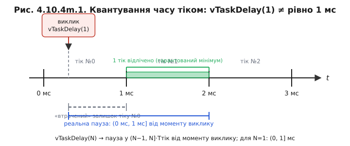
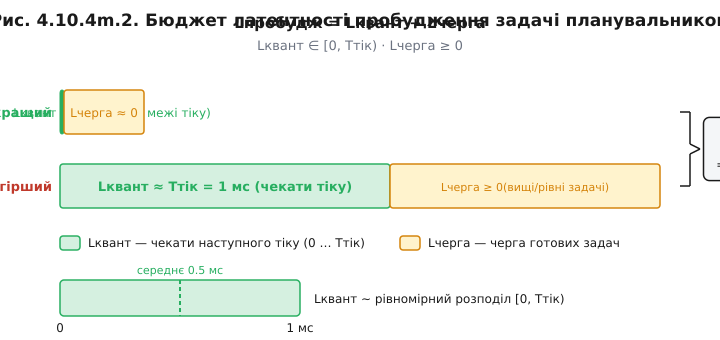

# 🧮 Тік 1 мс: квант, джитер, tickless-режим (математика латентності планування)

> Математична вставка до теми [«Планувальник»](book:programming/scheduler). У [планувальника FreeRTOS](book:programming/scheduler) тік цокає ~щомілісекунди, `vTaskDelay` рахує тіки, а не мілісекунди, і є «безтіковий простій». Тут — **числа** за цими словами: чому 1 мс — це **квант**, скільки реально триватиме `vTaskDelay(5)`, звідки береться джитер пробудження і коли рівномірний тік марнує енергію. Це планувальницький, грубший брат латентності [переривання](book:programming/interrupt-priorities): там квант — десятки тактів, тут — ціла мілісекунда.

## 4.10.4 Тік 1 мс: квант, джитер, tickless

### Означення: тік як квант часу планувальника

Тік (tick) — це переривання апаратного таймера, яке служить годинником планувальника FreeRTOS. Його частота задається константою `configTICK_RATE_HZ`; на ESP32-Arduino вона дорівнює 1000 Гц за замовчуванням, тож:

```
Tтік = 1 / configTICK_RATE_HZ = 1 / 1000 Гц = 1 мс
```

Саме тут народжується **квант планування** (scheduling quantum): планувальник переоцінює, кому поступитися процесором, лише на межі тіку — і ніколи між ними. Наслідок невідворотний: будь-яка пауза, будь-який таймаут вимірюються цілим числом тіків, а не мілісекундами в повному сенсі слова. Ось чому `vTaskDelay` рахує тіки, а не мілісекунди — тепер у числах.

Важливо відчути масштабну різницю між двома рівнями часу в системі. Квант [переривання](book:programming/interrupt-priorities) становить одиниці-десятки тактів по 4 нс кожен; квант планувальника — 1 мс. Різниця в ~250 000 разів. Переривання реагує на подію протягом мікросекунд; планувальник вирішує, кого запустити, лише раз на мілісекунду. Обидва «кванти» реальні, просто живуть у різних шарах системи.

### Інтуїція: округлення вгору й чому vTaskDelay(1) — це не рівно 1 мс

Уявіть автобус, що відходить точно щомілісекунди. Ви підходите до зупинки в довільний момент — і якщо рейс щойно пішов, ви чекаєте майже повну мілісекунду до наступного. Якщо пощастить підійти за мить до відправлення — сідаєте майже одразу. У плануванні задача, що викликала `vTaskDelay(1)`, потрапляє в точно таку саму ситуацію: вона «висаджує» себе з CPU і чекає найближчої межі тіку, а відтоді відлічує замовлений час.

Головний контрінтуїтивний факт: `vTaskDelay(1)` гарантує **щонайменше один тік**, але фактична пауза від моменту виклику залежить від фази. Якщо виклик стався на початку тіку, задача чекає майже 0 до першої межі, а потім іще один повний тік — разом трохи більше 1 мс. Якщо виклик стався майже наприкінці поточного тіку, задача досягає наступної межі за якісь мікросекунди — і відлічує один тік від неї; разом виходить трохи менше 1 мс від моменту виклику. Узагальнено:

```
vTaskDelay(N) → реальна пауза від виклику ∈ (N−1, N]·Tтік
для N=1: пауза ∈ (0 мс, 1 мс]
```



*Рис. Чому vTaskDelay(1) — не рівно 1 мс: момент виклику падає всередину тіку, відлік стартує з наступної межі.*

Звідси практичне правило: щоб гарантовано проспати **не менш як N мілісекунд**, потрібен `vTaskDelay(N+1)`. Один зайвий тік перекриває «початкове округлення» — очікування до першої межі незалежно від фази.

> 🔧 **Навіщо це знати.** Не покладайся на `vTaskDelay(1)` як на «рівно 1 мс» — пауза коливається. Для точного, не дрейфуючого з часом інтервалу використовуй `vTaskDelayUntil`: він відраховує від **абсолютної** бази і не накопичує помилку виклику. Побудова строго-періодичних задач під реальні дедлайни — це вже [детермінізм реального часу](book:programming/realtime-determinism).

### Формальний апарат: латентність = квантування + черга

Розкладемо **латентність пробудження** задачі з блокування на дві незалежні складові:

```
Lпробудж = Lквант + Lчерга
Lквант  ∈ [0, Tтік)      — час від події до найближчого тіку
Lчерга  ≥ 0              — на тіку готові задачі вищих/рівних пріоритетів біжать першими
```

Перша складова, Lквант, виникає через сам факт квантування. Подія (спрацювання таймера, прихід байта, зняття блокування) фіксується не миттєво, а тільки коли наступний тік «опитує» список готових задач. Тому Lквант розподілений рівномірно між 0 і Tтік:

```
середнє   Lквант = Tтік / 2 = 0.5 мс
найгірше  Lквант → Tтік = 1 мс (подія одразу після тіку)
найкраще  Lквант = 0          (подія рівно на межі тіку)
```

**Приклад. Скільки насправді спить `vTaskDelay(5)`?**

```
Tтік = 1 мс
Виклик vTaskDelay(5) о момент t = 0.3 мс (всередину тіку №0)
Відлік 5 тіків стартує від наступної межі: t = 1 мс
Пробудження-готовність: t = 1 + 5 = 6 мс
Фактична пауза від виклику: 6 − 0.3 = 5.7 мс

При будь-якому моменті виклику всередині тіку:
  пауза ∈ (5·Tтік − Tтік, 5·Tтік] = (4 мс, 5 мс] від наступної межі
  = (4.0 мс, 5.0 мс] від першої межі плюс залишок → (4+, 6] мс від виклику

Конкретно: t_виклику ∈ (0, 1] мс → пауза від виклику ∈ [5, 6) мс
```

Задача просила п'ять тіків, отримала 5.7 мс — не через помилку, а через квантування.

Друга складова, Lчерга, з'являється, якщо на тому самому тіку готові до виконання задачі з вищим або рівним пріоритетом: планувальник запустить їх першими, і наша задача чекатиме ще. У системі без конкурентів Lчерга ≈ 0.



*Рис. Латентність пробудження = квантування (0…Tтік) + черга готових; джитер = Tтік. Середнє Lквант = 0.5 мс, найгірше = 1 мс.*

**Джитер пробудження** — різниця між найгіршим і найкращим значенням Lквант:

```
джитер = Lквант(worst) − Lквант(best) = Tтік − 0 = 1 мс
```

Для задачі, що хоче спрацьовувати з рівним інтервалом, джитер у 1 мс — помітний шум. `vTaskDelayUntil` прибирає дрейф (накопичення від виклику до виклику), але квант в 1 тік залишається: одне пробудження все одно може спізнитися до Tтік відносно «ідеального» моменту. Менший джитер дає або вища частота тіку, або вихід за межі планувальника на [апаратний таймер](book:programming/timer-counter).

### Компроміс частоти тіку: чуйність проти накладних витрат

Якщо квант 1 мс здається грубим, чому не підняти `configTICK_RATE_HZ` до 10 000? Відповідь — у вартості кожного тіку: це переривання плюс запуск планувальника. Частка CPU, що витрачається на обробку тіків:

```
частка_CPU(тік) = f · Tобробки_тіку

f = 1 000 Гц,  Tобробки ≈ 2 μs  →  1 000 · 2·10⁻⁶ = 0.002 = 0.2 %
f = 10 000 Гц, те саме Tобробки  →  10 000 · 2·10⁻⁶ = 0.02  = 2.0 %
```

Ціна зростає лінійно: у 10 разів частіший тік — у 10 разів більший «податок». У бюджеті процесора, де [кожну мікросекунду на перериваннях рахують](book:programming/polling-vs-interrupts), це помітна стаття витрат. Тут 0.2 % — зовсім небагато, але 2 % — вже відчутно. Тому 1 кГц є золотою серединою за замовчуванням: дрібніший квант коштує дорого, а ще дрібніший час реакції краще реалізовувати апаратними перериваннями, не піднімаючи тік.

Проте є й інший бік: більшість задач спить більшу частину часу. Якщо найближча подія через 200 мс, навіщо будити CPU 200 разів, щоб кожен раз дістати відповідь «ще нічого нема»? Саме тут з'являється tickless.

### Tickless-режим: не будити CPU даремно

**Tickless idle** (безтіковий простій) — режим, за якого FreeRTOS не генерує рівномірних переривань, коли всі задачі заблоковані надовго. Натомість планувальник знаходить момент t_next — найближчий дедлайн будь-якої задачі — і ставить один будильник на t_next. Процесор засинає в режимі low-sleep аж до нього.

```
Без tickless: 1 с сну → CPU будять 1000 разів (кожен тік)
З tickless:   наступна подія через 200 мс →
              CPU спить 200 мс одним шматком, будять 1 раз замість 200
              → ~200× менше пробуджень за той самий інтервал
```

Ціна цієї економії невелика: на виході зі сну FreeRTOS повинна «надолужити» лічильник тіків — скільки їх «пройшло» за час сну, — і скоригувати системний час. Точність залежить від того, наскільки точний low-power-таймер, що тримав будильник. Якщо він трохи відстає, системний годинник відстає разом. Повна енергетична картина — струм у мА·год, вибір [low-power-режимів ESP32](book:programming/sleep-modes) — окрема тема; тут нас цікавить лише математика пробуджень.

### Як це пов'язано з рештою

Квант 1 мс — це пояснення того, чому `vTaskDelay` [недоточний](book:programming/scheduler), чому задача на голому `vTaskDelay` має джитер пробудження до Tтік і чому [tickless економить](book:programming/sleep-modes) сотні зайвих пробуджень за хвилину. Усі три факти мають спільний корінь — квантування часу тіком.

Поряд стоять два сусідні шари. Тонший шар нижче: латентність [переривання](book:programming/interrupt-priorities) (нс-такти, ~250 000 разів дрібніший квант) — переривання реагує до того, як планувальник навіть дізнається про подію. Грубший шар над нами: вибір пріоритетів і розрахунок утилізації під реальні дедлайни — [детермінізм реального часу](book:programming/realtime-determinism) і Rate Monotonic Scheduling. Звідки фізично береться рівний 1 мс тік — прескалер [апаратного таймера](book:programming/timer-counter).

Загальна теза: «реальний час» планувальника квантований тіком, і гарантії треба давати в тіках, а не мікросекундах. Хочеш дрібніше — або піднімай `configTICK_RATE_HZ` (платиш відсотком CPU), або виходь на апаратний таймер і переривання, де планувальник більше не посередник.
