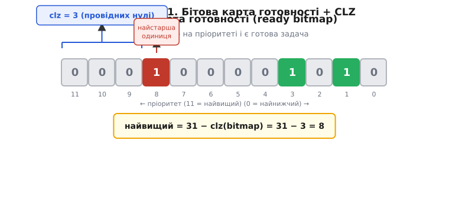
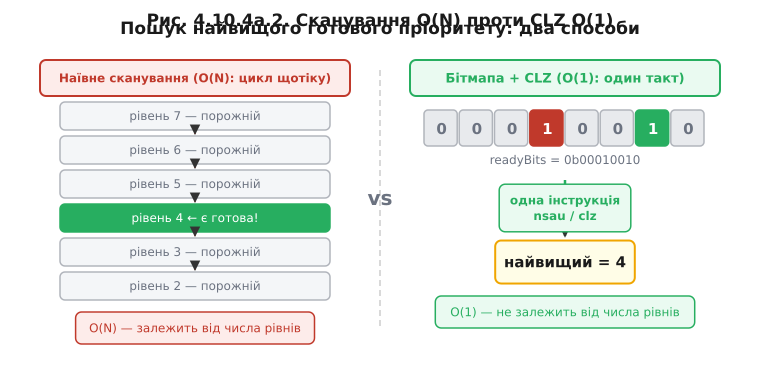

# ⚙️ CLZ і бітова карта готовності: знайти найвищий пріоритет за один такт

> Алгоритмічна вставка до теми [«Планувальник»](book:programming/scheduler). Правило [планувальника FreeRTOS](book:programming/scheduler) просте: біжить **готова задача з найвищим пріоритетом**. Лишилося питання реалізації: як планувальник **щотіку** знаходить цей найвищий пріоритет — і робить це так дешево, щоб витіснення не з'їдало процесор?

## Задача

У FreeRTOS кількість рівнів пріоритету задає `configMAX_PRIORITIES` — на ESP32 за замовчуванням 25, але може бути й більше. На кожному рівні є список задач у стані «готова»: задача або готова виконуватися, або заблокована в очікуванні якоїсь події. Кожного разу, коли [планувальник](book:programming/scheduler) отримує керування — на тіку (~1 мс) чи коли задача добровільно поступається — він мусить знайти **найвищий непорожній рівень**: той, де є хоч одна готова задача. Саме її він і поставить на процесор.

Наївний спосіб — пробігти масив списків готових задач згори вниз і зупинитися на першому непорожньому. Це звичайний цикл: 25 рівнів — до 25 перевірок, 256 рівнів — до 256. І виконується він на **кожному** перемиканні: сотні, а то й тисячі разів на секунду.

Ціна відчутна. [Перемикання контексту](book:programming/scheduler) й без того коштує: збереження й відновлення регістрів, промахи кешу. Якщо ще й пошук рівня лінійний, планувальник витрачає дедалі більше часу на «жонглювання» в міру зростання числа рівнів. Ідеал — знайти відповідь за **сталий** час, незалежно від `configMAX_PRIORITIES`, — в ідеалі одну інструкцію.

Ключ до рішення — подати «які рівні зайняті» не списком, а **числом-бітмапою**.

## Ідея: бітова карта готовності + CLZ

**Крок 1 — бітова карта готовності (ready bitmap, `uxTopReadyPriority`).** Замість масиву списків тримаємо одне машинне слово — [32-бітне на ESP32](book:programming/esp32-vs-8bit). **Біт i цього слова дорівнює 1**, якщо на пріоритеті i є хоч одна готова задача, і 0 якщо рівень порожній. Це та сама ідея [масок і бітових полів](book:programming/memory-mapped-io): ставимо біт коли задача стає готовою (`readyBits |= 1u << i`), скидаємо коли рівень спорожнів (`readyBits &= ~(1u << i)`). 32-бітне слово ESP32 вміщає 32 незалежних прапорці — рівно стільки, скільки потрібно для типової конфігурації.

**Крок 2 — знайти найвищий зведений біт.** Тепер задача зводиться до класичної: знайти позицію **найстаршої одиниці** (most significant set bit) у 32-бітному слові. Це і є апаратна операція **CLZ (count leading zeros, підрахунок старших нулів)** — вона каже, скільки нульових бітів стоїть від старшого краю до першої одиниці. Маючи це число, номер найвищого зайнятого пріоритету знаходиться одразу: `найвищий = 31 − clz(bitmap)`. Інтуїція проста: CLZ за один погляд показує, де стоїть «найлівіша» одиниця, а її позиція — це і є номер найвищого готового рівня.


*Бітова карта готовності: біт i=1 — на пріоритеті i є готова задача. CLZ рахує старші нулі до найстаршої одиниці, а 31−clz одразу дає номер найвищого готового пріоритету — без сканування.*

Чому це швидко: CLZ — **одна інструкція** в залізі. На [ядрі Xtensa LX6 (ESP32)](book:programming/esp32-architecture) CLZ реалізується [асемблерною](book:programming/compiler-stages) інструкцією `nsau` (normalize shift amount unsigned); на ARM Cortex-M — інструкцією `clz`. Компілятор GCC перетворює стандартний білтін `__builtin_clz()` рівно в цю інструкцію. Таким чином пошук рівня, що в наївному варіанті коштував цикл з N ітерацій, стає **одним тактом** — незалежно від кількості пріоритетів.

> 🔧 **Навіщо це.** Структуру даних обирають так, щоб **найчастіша операція стала найдешевшою**. Планувальник питає «хто найвищий готовий?» на кожному перемиканні — тому відповідь має коштувати один такт, а не цикл. Бітмапа+CLZ перетворює пошук-сканування на одну інструкцію; ціна — лише дисципліна тримати бітмапу в актуальному стані при кожній зміні статусу задачі.

Саме так і влаштований FreeRTOS у «оптимізованому» режимі (`configUSE_PORT_OPTIMISED_TASK_SELECTION = 1`): макрос `portGET_HIGHEST_PRIORITY` ховає за собою виклик CLZ. У «портативному» режимі (коли апаратного CLZ немає або він не визначений для порту) FreeRTOS відкочується на загальний C-цикл — це і є пастка переносності, яку треба тримати в голові.


*Той самий пошук найвищого готового рівня. Ліворуч — лінійне сканування списків (цикл, що довшає з кількістю рівнів). Праворуч — одна інструкція CLZ над бітмапою: сталий час, незалежно від числа пріоритетів.*

**Приклад: знайти найвищий готовий пріоритет за один такт.**

```cpp
#include <stdint.h>

// Бітова карта готовності: біт i = 1 → на пріоритеті i є ≥1 готова задача.
// 32 біти ESP32 (§4.1.6) покривають 32 рівні — достатньо для configMAX_PRIORITIES ≤ 32.
static volatile uint32_t readyBits = 0;

// Встановити біт рівня p (викликати, коли задача рівня p стає готовою).
static inline void setReady(int p) {
    readyBits |= (1u << p);   // бітова маска §4.1.3 / §4.4.7
}

// Скинути біт рівня p (викликати, коли список рівня p повністю спорожнів).
static inline void clearReady(int p) {
    readyBits &= ~(1u << p);
}

// Повернути номер найвищого готового пріоритету.
// УВАГА: __builtin_clz(0) — невизначена поведінка; захист обов'язковий.
static inline int highestReady(void) {
    if (readyBits == 0) return -1;         // порожня бітмапа — задач немає
    return 31 - __builtin_clz(readyBits);  // GCC → nsau на Xtensa, clz на ARM
}

// --- Числовий приклад ---
// readyBits = 0x0000000A = 0b00000000_00000000_00000000_00001010
//   → біти 1 і 3 зведені (готові пріоритети 1 і 3)
//   → __builtin_clz(0x0000000A) = 28  (28 нулів від MSB до першої одиниці на позиції 3)
//   → highestReady() = 31 − 28 = 3   ✓ найвищий готовий = пріоритет 3
```

Один виклик `__builtin_clz` замінює весь цикл сканування. Зверніть увагу на захист `if (readyBits == 0)`: idle-задача завжди на рівні 0 і завжди готова, тому бітмапа на практиці майже ніколи не буває рівно нулем — але без явного захисту поведінка при нульовому аргументі архітектурно невизначена, і на деяких ISA інструкція CLZ із нулем справді дає непередбачуваний результат.

## Складність і пастки на МК

- **`clz(0)` — невизначена поведінка.** `__builtin_clz(0)` на більшості ISA дає непередбачуваний результат: інструкція не визначена для нульового аргументу. Завжди перевіряйте порожню бітмапу окремо — або тримайте вічно зведений біт рівня [idle-задачі](book:programming/scheduler), яка готова завжди, і тоді бітмапа ніколи не обнуляється.

- **Біт означає РІВЕНЬ, а не задачу.** Один біт каже лише «на цьому пріоритеті є хоч одна готова задача», а не скільки їх. Якщо на рівні кілька рівних задач — їх крутять [round-robin](book:programming/scheduler); бітмапа їх не розрізняє, це окремий список усередині рівня. Скидати біт рівня можна лише тоді, коли список цього рівня **повністю спорожнів** — інакше ви приховаєте від планувальника живі задачі.

- **Атомарність оновлення бітмапи.** Бітмапу змінюють і планувальник (з тік-переривання), і код, що будить або блокує задачі. Операція `|=`/`&=` — це read-modify-write (RMW) — про [гонки на спільних даних](book:programming/atomicity-races), — яка не є атомарною за замовчуванням. На ESP32 з двома ядрами голий `|=` у двох потоках може призвести до загубленого оновлення. FreeRTOS захищає бітмапу планувальниковим критичним розділом — просте `|=` у довільному місці не годиться.

- **MSB чи LSB — визнач напрям однозначно.** «Найвищий пріоритет» можна кодувати старшим бітом (тоді `31 − clz(bitmap)`, як вище) або молодшим бітом (тоді шукають CTZ — count trailing zeros, `__builtin_ctz`/`ffs`). Плутанина в напрямку означає вибір задачі з **неправильного** рівня. FreeRTOS кодує вищий пріоритет старшим бітом, але якщо ви робите власний порт — зафіксуйте напрям явно.

- **Кількість рівнів ≤ ширина слова.** 32-бітна бітмапа покриває максимум 32 пріоритети. Більше рівнів потребує масиву слів і CLZ по кожному з них — складніше й повільніше. Практична порада: на МК рідко потрібно понад кілька рівнів; на старті розумно тримати задачі на рівних пріоритетах, і тоді 32 рівні — це більш ніж достатньо для переважної більшості прошивок.

- **Переносність CLZ.** Не на кожному ядрі є апаратний CLZ. Наприклад, [простий 8-бітний AVR](book:programming/avr) не має такої інструкції, і `__builtin_clz` розгортається в програмну емуляцію або пошук у таблиці — отже «один такт» гарантовано лише там, де інструкція фізично присутня: Xtensa `nsau`, ARM `clz`, RISC-V `clz` (розширення Zbb). Саме тому FreeRTOS зберігає й портативний fallback-цикл.

## Підсумок

Правило [планувальника](book:programming/scheduler) «біжить найвищий готовий» коштує рівно стільки, скільки коштує знайти найстаршу одиницю в бітмапі — а це один такт через CLZ. Структура даних (бітмапа замість сканування списків) перетворює найчастішу операцію планувальника на найдешевшу; розплата — дисципліна тримати бітмапу актуальною й атомарною при кожній зміні стану задачі.

> ▶️ Повернутися до теми: [Планувальник](book:programming/scheduler)
