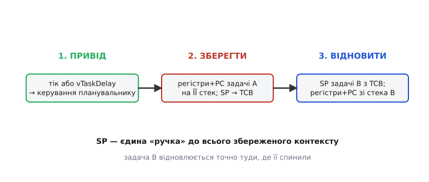
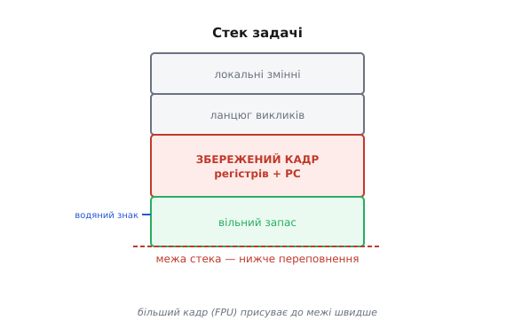

# ⚙️ Перемикання контексту зсередини

Коли [планувальник](topic:programming/scheduler) зупиняє одну задачу й пускає іншу, він «зберігає контекст поточної задачі та відновлює контекст наступної». Але *як саме* це відбувається на рівні регістрів і стека? Що фізично трапляється в ту мить між «біжить A» і «біжить B»? І — головна цінність цієї вставки — як побачити цю «невидиму» мить і зміряти її ціну власноруч на ESP32.

## Що це коштує і чому це невидиме

Перемикання контексту відбувається десятки й сотні разів на секунду — і водночас **цілком непомітне з C**. Його виконує крихітний асемблерний фрагмент порту FreeRTOS; із задачі жодних слідів: вона просто «прокинулася» трохи пізніше, наче нічого не сталося. Через цю невидимість одразу постають три практичні питання. По-перше, скільки воно коштує в тактах і чи справді надто часте перемикання марнує ресурс — чи це лише теоретичне застереження? По-друге, де фізично живе «збережений стан» задачі між двома її запусками — це якийсь спеціальний регістр планувальника чи щось зовсім інше? По-третє, чому досвідчені розробники постійно повторюють «дай задачі достатньо стека» — який зв'язок між перемиканням і розміром стека?

Відповідь на всі три питання одна й та сама: стек. Розбираємо механізм по кроках.

## Три кроки: зупинити → сховати → підмінити

Незалежно від того, чим спровоковане перемикання — [тік-перериванням планувальника](topic:programming/scheduler) чи добровільним `vTaskDelay` від самої задачі, — послідовність завжди однакова.

**Крок 1. Привід.** На кожному тіку переривання від таймера пробуджує [планувальник](topic:programming/scheduler): «подивись, чи не час комусь поступитися». Якщо поточній задачі вийшов квант або прокинулася важливіша, планувальник вирішує перемкнутися. Або ж сама задача викликала `vTaskDelay` — і тим самим добровільно поступилася. У будь-якому разі керування на мить переходить до коду планувальника.

**Крок 2. Зберегти контекст.** Саме тут відбувається головне. Усі **робочі регістри процесора** — загального призначення, лічильник команд (PC), прапорці умов — зберігаються на **власний стек поточної задачі**. Не до якогось центрального буфера, не до пам'яті планувальника, а буквально на той самий стек, де ця задача розкладала свої локальні змінні й ланцюг викликів. Щойно всі регістри опинилися на стеку, планувальник читає поточне значення **вказівника стека (SP)** і записує його до службової структури задачі — блока керування задачею (TCB). Ось ключова думка, яку варто запам'ятати: **SP — єдина «ручка» до всього збереженого контексту**. Знаючи лише SP задачі, можна відновити її повністю — знявши зі стека всі регістри й передавши управління на збережений PC.

**Крок 3. Відновити наступну.** Планувальник обирає наступну задачу — за правилом [«найвищий готовий»](topic:programming/scheduler) — і бере збережений SP **тієї** задачі з її TCB. Потім виконує зворотну операцію: знімає зі стека задачі B усі регістри й PC, які були туди покладені минулого разу, коли її зупиняли. Остання інструкція — «повернутися з переривання» — і процесор уже виконує код задачі B, рівно в тій точці, де її колись спинили, з тими самими значеннями регістрів.

Звідси й «ілюзія власної машини», у якій живе кожна задача: регістри задачі A лежали на її стеку весь час, поки виконувалася B; коли A відновлюється, вона бачить своє середовище без жодних слідів B.


*Три кроки перемикання контексту: привід (тік-переривання або vTaskDelay) → зберегти регістри+PC поточної задачі на ЇЇ стек, запам'ятати її SP у TCB → відновити SP наступної задачі, підняти її регістри+PC зі стека й повернутися з переривання вже в неї. SP — «ручка» до всього контексту; кожна задача відновлюється точно туди, де її спинили.*

> 🔧 **Навіщо це.** Стек задачі повинен вміщати не лише локальні змінні й ланцюг викликів, а ще й **повний збережений кадр регістрів** — він кладеться туди щоразу, коли задачу перемикають. Ось чому занадто малий стек руйнує систему саме під час перемикання, а не в «звичайному» коді: задача може бездоганно працювати роками й упасти лише тоді, коли кадр регістрів під час перемикання перетне межу стека. Тому [розмір стека задачі](topic:programming/task-stacks) обирають із запасом.

## Побачити й зміряти перемикання

Два коротких робочих фрагменти — кожен робить невидиме видимим.

---

**Фрагмент 1. Зміряти ціну перемикання лічильником тактів.**

Ідея: дві задачі однакового пріоритету на одному процесорному ядрі по черзі передають одна одній керування через `taskYIELD()`. Лічильник тактів процесора (`esp_cpu_get_cycle_count()`) знімається до і після — різниця й є ціна одного перемикання в тактах. Щоб задачі справді чергувалися, а не виконувалися паралельно, обидві прив'язуємо до **одного** ядра (`xTaskCreatePinnedToCore` з однаковим номером ядра — ESP32 має два ядра, і без прив'язки задачі могли б розійтися по різних).

```cpp
// --- Фрагмент 1: вартість перемикання контексту ---
#include <Arduino.h>
#include "esp_cpu.h"          // esp_cpu_get_cycle_count()

static volatile uint32_t t_before = 0;
static volatile uint32_t total_cost = 0;
static const int N = 10000;
static volatile int count = 0;

// Задача-«пінгер»: фіксує момент до yield
void taskPing(void*) {
    for (;;) {
        t_before = esp_cpu_get_cycle_count();
        taskYIELD();           // вимушене перемикання на taskPong
        // повернулися — підраховуємо вартість
        uint32_t cost = esp_cpu_get_cycle_count() - t_before;
        total_cost += cost;
        count++;
        if (count >= N) {
            uint32_t avg = total_cost / N;
            // cost_ns = avg_cycles / 240.0   (ESP32 типово 240 МГц)
            float ns = (float)avg / 240.0f;
            Serial.printf("Перемикання: ~%lu тактів = ~%.1f нс\n", avg, ns);
            total_cost = 0; count = 0;
        }
    }
}

// Задача-«понгер»: просто повертає управління
void taskPong(void*) {
    for (;;) {
        taskYIELD();
    }
}

void setup() {
    Serial.begin(115200);
    // Обидві задачі — на ядрі 1, однаковий пріоритет
    xTaskCreatePinnedToCore(taskPing, "ping", 2048, nullptr, 2, nullptr, 1);
    xTaskCreatePinnedToCore(taskPong, "pong", 2048, nullptr, 2, nullptr, 1);
}

void loop() { vTaskDelay(portMAX_DELAY); }
```

Типовий результат на ESP32 при 240 МГц: від 200 до 800 тактів на перемикання, тобто приблизно 1–3 мкс. Порівняно з реальною роботою задачі (мілісекунди й більше) це дрібниця — але якщо перемикатися мільйон разів на секунду (частота тіку 1000 Гц × 1000 задач), сумарні витрати стають відчутними. Ось кількісний доказ тези про [роботу планувальника](topic:programming/scheduler): надто часте перемикання справді марнує ресурс, і баланс між чуйністю та накладними витратами — реальний, а не теоретичний.

---

**Фрагмент 2. Побачити, що контекст лежить на стеку.**

`uxTaskGetStackHighWaterMark(NULL)` повертає мінімальний вільний залишок стека поточної задачі за весь час її роботи — у словах. Виміряємо його до і після примусового перемикання — і побачимо, що перемикання «з'їдає» трохи стека: саме там лежить збережений кадр регістрів.

```cpp
void taskMeasure(void*) {
    Serial.printf("Старт. Вільний стек: %lu слів\n",
                  (uint32_t)uxTaskGetStackHighWaterMark(NULL));

    // Одне перемикання: задача засинає і прокидається
    vTaskDelay(1);   // планувальник збереже кадр регістрів на нашому стеку

    Serial.printf("Після delay. Вільний стек: %lu слів\n",
                  (uint32_t)uxTaskGetStackHighWaterMark(NULL));
    // Різниця — розмір збереженого кадру перемикання
    // (на ESP32/Xtensa: зазвичай 50–80 слів для простої задачі
    //  без апаратного співпроцесора)

    vTaskDelete(NULL);
}

void setup() {
    Serial.begin(115200);
    xTaskCreate(taskMeasure, "meas", 4096, nullptr, 2, nullptr);
}
void loop() { vTaskDelay(portMAX_DELAY); }
```

Різниця між двома відліками — і є той самий кадр контексту: усі регістри та PC, які планувальник поклав на стек, поки задача спала. Ось де «збережений контекст» живе фізично — не десь у планувальнику, а прямо на стеку задачі.


*Що займає стек задачі: локальні змінні + ланцюг викликів + ЗБЕРЕЖЕНИЙ КАДР регістрів перемикання; під ним — межа стека, нижче якої переповнення. Більший кадр (плаваюча кома / співпроцесор) присуває до межі швидше. Пунктир — «водяний знак» (те, що міряє `uxTaskGetStackHighWaterMark`).*

Обидва вимірювання роблять невидиме видимим: перший фрагмент дає конкретне число тактів — відповідь на питання «скільки коштує», другий показує, де фізично живе збережений стан — відповідь на питання «де він». Разом вони обґрунтовують дві практичні цифри: як часто варто перемикатися і скільки стека просити.

## Пастки перемикання на мікроконтролері

Тепер, коли механізм зрозумілий, — конкретні пастки, на яких спотикаються навіть досвідчені розробники.

**Не пиши код перемикання вручну.** Асемблерний фрагмент збереження й відновлення регістрів — внутрішня справа порту FreeRTOS; із C ти лише *просиш* перемикання: `taskYIELD()` із задачі або спеціальний виклик `...FromISR` із обробника переривання. Саме «`...FromISR`» — і ніяк інакше: звичайний `taskYIELD()` зсередини ISR порушить стек переривання й призведе до непередбачуваного збою. У FreeRTOS для цього є окрема функція (`portYIELD_FROM_ISR`), яка правильно сигналізує планувальнику, що перемикання потрібне після виходу з ISR, а не зсередини нього.

**Стек повинен уміщати весь кадр.** Переповнення стека під час перемикання — найпоширеніша причина дивних вильотів: задача працює бездоганно, але падає у випадковий момент — саме тоді, коли кадр регістрів кладеться на й без того заповнений стек. FreeRTOS має **гачок переповнення стека** (`vApplicationStackOverflowHook`): його варто вмикати під час розробки (`configCHECK_FOR_STACK_OVERFLOW` у `FreeRTOSConfig.h`) — він виявить проблему раніше, ніж вона стане незрозумілим крашем.

**Ціна залежить від того, ЩО зберігається.** Якщо задача використовує апаратний блок плаваючої коми або співпроцесор, кадр контексту більший — регістри FPU теж потрібно зберегти. Перемикання стає дорожчим. Звідси практичне правило: «гарячі» задачі, які часто прокидаються, тримай простими — без важкої математики в критичній ділянці, де частота перемикань найвища.

**Лічильник тактів — на кожне ядро окремий.** Пастка саме фрагмента 1: регістр `CCOUNT` (лічильник тактів) є **власним** для кожного процесорного ядра ESP32. Якщо задачі-пінгер і задача-понгер опиняться на різних ядрах (наприклад, одна не прив'язана до ядра), різниця між їхніми відліками `CCOUNT` буде безглуздою — як порівнювати годинники в різних часових поясах. Саме тому в фрагменті обидві задачі прив'язані до одного ядра — лише так їхні відліки `CCOUNT` беруться з того самого лічильника й різниця має сенс.

**Атомарність не гарантована.** Оскільки перемикання може статися будь-де, твердження «короткий фрагмент коду виконається цілісно» — хибне у витісняючій системі. Спільні дані між задачами потребують захисту — інакше перемикання посеред оновлення лишить їх у неузгодженому стані.

Тепер «зберегти й відновити контекст» — не магія, а конкретні такти й байти стека, які можна зміряти. І саме ці два числа — ціна перемикання в тактах і розмір кадру на стеку — відповідають на практичні питання, з яких починалася вставка: як часто варто перемикатися і скільки стека просити.
