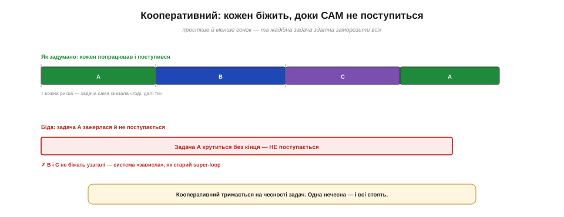
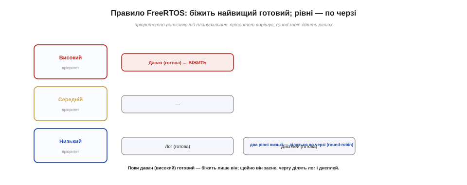

# Планувальник: хто й коли виконується (витісняючий vs кооперативний)

[Задачі](book:programming/tasks) живуть «водночас» завдяки швидкому перемиканню. Та хто ж ним керує — вирішує, котра задача біжить цієї миті, а котра чекає? Це робить **планувальник (*scheduler*)** — серце будь-якої багатозадачної системи. У нього два головні питання: **хто** має бігти і **коли** перемикати. Відповідь на «коли» ділить усі системи на дві філософії — **кооперативну** й **витісняючу**.

### Планувальник: розпорядник процесорного часу

Найперше уявімо роль планувальника просто. У будь-яку мить багато задач хочуть процесора (вони **готові**), а деякі чекають на свою подію (вони **заблоковані**). Планувальник — це розпорядник, що серед **готових** обирає одну й віддає їй процесор. Заблоковані його не обходять: вони не змагаються за час, поки сплять.

Зручна аналогія — диспетчер на вокзалі: він не їде в поїздах, а лише вирішує, котрий відправити з єдиної колії наступним. Сам планувальник — це невеликий і дуже швидкий шматок коду: його робота має бути блискавичною, бо виконується він часто й сам відбирає час у задач. Тому планувальники роблять гранично простими — складна логіка вибору коштувала б дорожче, ніж користь від неї.


*Рис. Планувальник — розпорядник процесорного часу: серед **готових** задач він обирає одну й віддає їй процесор. Заблоковані задачі стоять осторонь і за час не змагаються. Уся його робота — щоразу відповісти на питання «кому бігти тепер?».*

Важливо розуміти, що планувальник працює **не безперервно**, а лише в окремі моменти — коли є привід щось вирішувати. Решту часу процесор просто виконує обрану задачу, а планувальник «спить». Тож по-справжньому цікаве питання не «що він робить», а **коли він прокидається** й бере кермо у свої руки. Цих приводів рівно три.

### Коли перемикати: три приводи


*Рис. Планувальник вступає в дію з трьох причин: (1) задача сама заблокувалася («чекаю») і віддала процесор; (2) прокинулась готова задача з **вищим** пріоритетом і витісняє поточну; (3) настав **тік** таймера, за яким рівних діляться по черзі. Перший привід добровільний, два інші — примусові.*

Перший привід — **добровільний**: задача сама каже «чекаю» (пауза, дані, подія), переходить у заблокований стан і звільняє процесор; планувальник тоді обирає наступного. Другий і третій — **примусові**: планувальник забирає процесор у задачі, навіть якщо та й не думала поступатися. Другий спрацьовує, коли прокидається важливіша (вищопріоритетна) задача; третій — за «тіком» таймера, щоб рівні задачі не захопили час назавжди. І ось ключова думка: чи дозволено планувальникові **примусово** забирати процесор — це і є та межа, що ділить дві філософії планування.

Варто оцінити, який із приводів найважливіший для **ефективності**. Це перший — добровільне блокування: саме воно перетворює просте очікування на [корисний час для інших задач](book:programming/tasks). Якби існував лише він, ми мали б кооперативну систему; додавання примусових приводів (другого й третього) і робить її витісняючою, придатною до роботи в реальному часі. Тобто блокування дає ощадність, а витіснення — надійність; добра система спирається на обидва.

### Кооперативний: задача сама поступається

У **кооперативному (*cooperative*)** плануванні дозволено лише **перший** привід — добровільний. Кожна задача біжить, аж доки **сама** не поступиться (не заблокується чи не покличе явний «поступись»). Планувальник тут увічливий: він не втручається, доки задача не віддасть процесор з власної волі.


*Рис. Кооперативний планувальник перемикає задачі лише тоді, коли поточна **сама** поступається. Як задумано (вгорі) — кожна попрацювала й передала чергу. Біда (внизу) — задача, що зажерлася й не поступається, крутиться без кінця, і всі інші стоять, як у застряглому super-loop.*

Кооперативний підхід має свої принади: він простіший, і в ньому менше підступних «гонок» — адже задачу ніколи не зупиняють посеред справи, а лише на чітких, нею ж обраних точках. Та є й велика вада: уся система тримається на **чесності** задач. Досить одній зажертися — увійти в довге обчислення чи, боронь боже, у блокувальний цикл — і вона заморозить **усіх**, точнісінько як одна довга справа [морозила super-loop](book:programming/super-loop-limits). Кооперативне планування годиться, лише коли ви певні, що всі задачі поводяться чемно; а в реальному світі такої певності зазвичай нема.

Це не теорія: цілі епохи персональних комп'ютерів жили на кооперативному плануванні — ранні версії Windows і Mac OS перемикали програми лише тоді, коли ті самі поступалися. Наслідок знайомий усім, хто застав ту добу: одна зависла програма морозила всю систему. Саме тому індустрія зрештою перейшла на витісняюче планування. Утім, кооперативне й досі живе там, де задач мало, усі вони свої й перевірені, а простота та відсутність гонок цінніші за гарантії, — у деяких крихітних вбудованих системах.

### Витісняючий: планувальник забирає силою

У **витісняючому (*preemptive*)** плануванні дозволені й примусові приводи. Планувальник може **відібрати** процесор у задачі, не питаючи її згоди, — і робить це у двох випадках: коли прокинулась важливіша задача або коли настав черговий «тік». Поточну задачу спиняють посеред роботи (зберігши її [контекст](book:programming/tasks)) і дають процесор іншій.


*Рис. Витісняючий планувальник може спинити задачу примусово: щойно прокинулась важливіша (високопріоритетна) задача A, низькопріоритетну B **негайно** відсувають, не питаючи її згоди; а коли A знову заблокується, B повертається. Жодна задача не здатна «зажерти» процесор — планувальник завжди сильніший.*

Це принципово надійніше. Оскільки планувальник сильніший за будь-яку задачу, **жодна** з них не може захопити процесор назавжди: навіть зажерливу спинить найближчий тік. Тому витісняюче планування дає те, чого кооперативне обіцяти не може, — **гарантію чуйності**: важлива подія дочекається реакції за передбачений час, хоч би що робили інші задачі. Платою є складніші «гонки»: задачу можуть спинити **будь-якої** миті, навіть посеред оновлення спільних даних, — і про це доведеться дбати окремо, [узгоджуючи доступ між задачами](book:programming/task-ipc). Та заради надійності й роботи в реальному часі на цю плату йдуть охоче; тому майже всі сучасні RTOS, зокрема й FreeRTOS на ESP32, витісняючі.

Не варто, однак, думати, що витіснення безкоштовне. Кожне перемикання контексту коштує процесорного часу — зберегти стан однієї задачі, відновити стан іншої, — тож **надто** часте перемикання саме по собі марнує ресурс. Тому й тут шукають баланс: перемикати досить часто для чуйності, але не настільки, щоб система більше «жонглювала» задачами, ніж виконувала корисну роботу. Витіснення — потужний інструмент, та, як і будь-який, має свою ціну.

> 🔧 **Навіщо це.** Тримайте в голові головний наслідок витіснення: вашу задачу можуть спинити **в будь-якому місці**, навіть на півдорозі зміни спільної змінної. Тому не покладайтеся на те, що «короткий шматок коду виконається цілісно» — це правда лише в кооперативній системі. У витісняючій (а саме така в ESP32) спільні дані між задачами треба [захищати спеціально](book:programming/task-ipc), інакше отримаєте [ту саму гонку, що й між циклом і ISR](book:programming/atomicity-races), лише тепер між задачами.

### Тік: серцебиття планувальника

Звідки ж планувальник бере силу витісняти? З **тіку (*tick*)** — періодичного таймерного переривання, що править йому за пульс. [Таймер](book:programming/timer-counter) налаштовують цокати через рівні проміжки (на ESP32 — зазвичай щомілісекунди), і кожен такий тік збуджує [переривання](book:programming/interrupts), яке на мить передає кермо планувальникові: «глянь, чи не час перемкнутися».


*Рис. Тік — серцебиття планувальника: таймер рівно цокає, і кожен тік через переривання запускає планувальника, який вирішує, чи перемкнути задачі. Саме тік уможливлює і витіснення, і поділ часу між рівними.*

Ось де гарно сходяться три механізми. Абстрактне «таймерне переривання рухає поділ часу» тут стає буквальним: **таймер** дає рівний тік, **переривання** на кожному тіку будить планувальник, а той вирішує долю задач. Без тіку витіснення було б неможливе (нічого б не «штовхало» планувальник), і система скотилася б до кооперативної. Частоту тіку обирають як компроміс: частіший дає тонше перемикання, але з'їдає більше процесора на самі перемикання; тому беруть розумну середину — близько тисячі тіків на секунду.

Кілька корисних дрібниць про тік. По-перше, саме в тіках зазвичай і відміряють паузи задач: `vTaskDelay` рахує не мілісекунди, а **тіки**, тож реальна тривалість паузи залежить від частоти тіку (за тисячі тіків на секунду один тік — це якраз мілісекунда). По-друге, сучасні RTOS уміють **присипляти й сам тік**, коли всі задачі заблоковані надовго (так званий «безтіковий простій»), — щоб не будити процесор даремно й заощаджувати енергію. Тобто тік — не самоціль, а лише пульс, який за потреби можна притишити.

> ⚙️ **Зсередини.** Що насправді робить планувальник у мить перемикання — зберігає й відновлює регістри через стек — і як це **побачити та зміряти** на ESP32: [⚙️ Перемикання контексту зсередини](proj-context-switch.md).

### Як FreeRTOS обирає: пріоритет і round-robin

Лишилося відповісти на питання «**хто**?». FreeRTOS (планувальник ESP32) працює за простим і потужним правилом: завжди біжить **готова задача з найвищим пріоритетом**. Кожній задачі [при створенні](book:programming/tasks) задають число-пріоритет; планувальник серед усіх готових обирає найпріоритетнішу. А якщо найвищий пріоритет ділять **кілька** готових задач — вони біжать **по черзі**, по тік-скибочці кожній (це й зветься **round-robin**, циклічний поділ часу).


*Рис. Пріоритетно-витісняюче правило FreeRTOS: поки високопріоритетний давач готовий — біжить лише він, витісняючи все нижче. Щойно давач засне (заблокується), процесор дістається нижчому рівню, де лог і дисплей (рівні) ділять час по черзі — round-robin. Прокинеться давач — миттю забере процесор назад.*

Це правило поєднує дві ідеї: **пріоритет** вирішує, хто важливіший, а **round-robin** по-чесному ділить час між рівними. Завдяки цьому критична задача (скажімо, реакція на аварійний давач) дістає процесор миттєво, тільки-но стає готовою, а буденні справи мирно діляться рештою часу. Та є й пастка: якщо високопріоритетна задача **ніколи не блокується** (крутиться без пауз), нижчі не дістануть процесора **взагалі** — це зветься **голодуванням (*starvation*)**. Тому пріоритети треба роздавати продумано, а високопріоритетні задачі мусять чесно засинати, віддаючи час іншим. Як саме [проєктувати пріоритети для роботи в реальному часі](book:programming/realtime-determinism) — окрема велика тема; тут досить засвоїти правило вибору.

Дві технічні дрібниці про пріоритети у FreeRTOS, щоб не плутатися згодом. По-перше, тут **більше число — вищий** пріоритет (0 — найнижчий); кількість рівнів задає налаштування системи. По-друге, на найнижчому пріоритеті 0 завжди живе [**задача простою**](book:programming/tasks): вона біжить лише тоді, коли більше нікому, і саме їй система доручає присипляти ядро. Тож усі ваші задачі завжди мають пріоритет не нижчий за неї — а отже, гарантовано колись дістануть процесор, якщо чесно блокуються.

> 🔧 **Навіщо це.** Двічі подумайте, перш ніж дати задачі високий пріоритет. Високий пріоритет — не «зробити швидше», а «витісняти інших»: така задача забере процесор у всіх нижчих, щойно стане готовою. Якщо вона до того ж погано засинає, нижчі **зголодніють**. Практичне правило: високий пріоритет — лише тим задачам, що рідко прокидаються, та мусять реагувати вмить (реакція на подію), а довгу рутину тримайте на низькому. І завжди давайте задачам блокуватися, а не крутитися намарно.

Для початку ж не переймайтеся пріоритетами надміру. Цілком розумна стартова стратегія — дати **всім** задачам однаковий пріоритет: тоді вони просто чесно ділять час по черзі (round-robin), як рівні, і жодна нікого не витісняє. Це найпростіша й найбезпечніша відправна точка, на якій багатозадачна програма вже добре працює. А вже потім, коли якась задача справді потребуватиме реагувати вмить, ви свідомо піднімете їй пріоритет — і знатимете, навіщо саме, а не тицятимете числа навмання.

**Приклад (що робить пріоритетно-витісняючий планувальник).** Три задачі, два рівні пріоритету.

```
Задачі:  давач  — ВИСОКИЙ пріоритет (має реагувати вчасно)
         лог    — низький
         дисплей — низький

Робота планувальника:
  давач готовий       → біжить ЛИШЕ давач (негайно витісняє лог/дисплей)
  давач заснув (delay) → лог і дисплей ділять час по черзі (round-robin)
  у давача нові дані   → він миттю витісняє того, хто саме біг
```
Так критичний давач завжди реагує вчасно, а лог і дисплей живуть із того часу, що лишається, — і ніхто нікого не блокує намертво. Жоден `delay` усередині будь-якої з них уже не страшний: він спиняє лише свою задачу, а планувальник тим часом віддає процесор готовим — рівно те, чого ми й домагалися від багатозадачності.

Отже, планувальник — це розпорядник, що в трьох випадках (блокування, поява важливішої задачі, тік) вирішує, кому бігти; витісняючий підхід (на відміну від кооперативного) дає йому силу відбирати процесор примусово, а таймерний тік — пульс для цього. Конкретний планувальник на ESP32 — це [FreeRTOS](book:programming/freertos): він обирає за пріоритетом, а рівних ділить за принципом round-robin.
