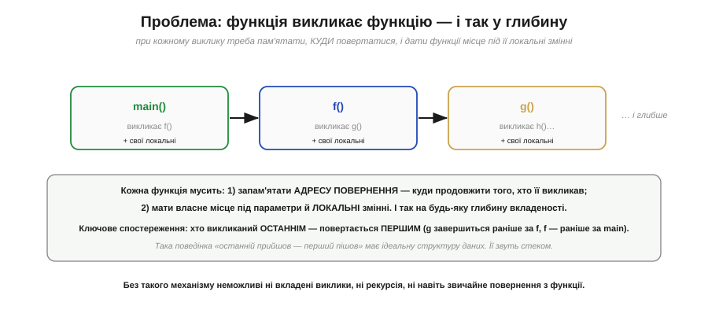
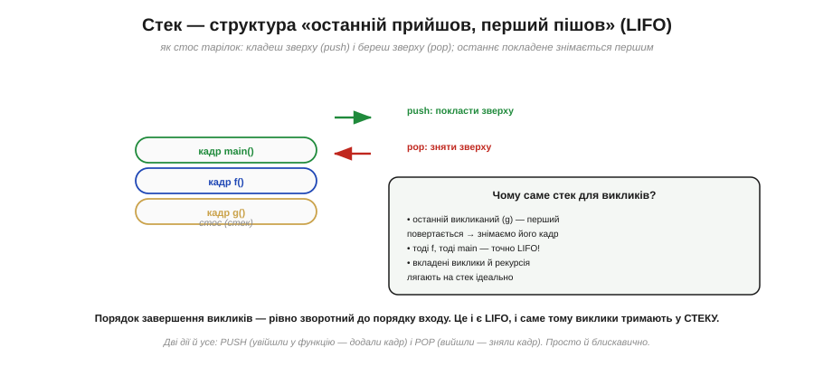
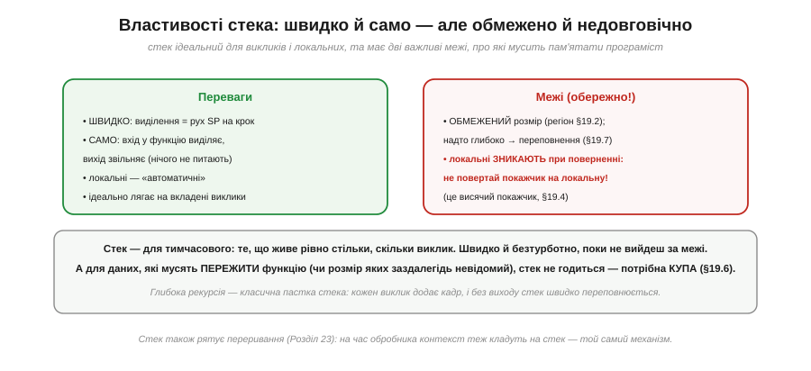

# Стек: як працює виклик функції (LIFO)

Кожна програма постійно **викликає функції** — а ми досі не питали, як це насправді працює в пам'яті. Коли функція `main` викликає `f`, а та — `g`, процесор мусить розв'язати дві задачі: запам'ятати, **куди повертатися** (бо після `g` треба продовжити `f`, а після `f` — `main`), і дати кожній функції **місце** під її параметри й локальні змінні — причому на будь-яку глибину вкладеності. Розв'язує це **стек** — одна з найелегантніших і найважливіших структур у всій інженерії. Зрозумівши стек, ви зрозумієте, як працюють виклики функцій, рекурсія, локальні змінні, і — що особливо цінно — звідки беруться цілі класи багів (переповнення стека, висячі покажчики на локальні). Розберімо механізм від проблеми до тонкощів.

### Проблема: виклики вкладаються


*Рис. Функція викликає функцію, та — ще одну, і так у глибину. Кожна мусить: 1) запам'ятати **адресу повернення** — куди продовжити того, хто її викликав; 2) мати власне місце під параметри й **локальні** змінні. Ключове спостереження: хто викликаний **останнім** — повертається **першим** (`g` завершиться раніше за `f`, `f` — раніше за `main`). Ця поведінка «останній прийшов — перший пішов» має ідеальну структуру даних — стек.*

Зверніть увагу на те **спостереження** — воно і є ключ. Вкладені виклики розкручуються в **строго зворотному** порядку: остання викликана функція завершується перша. Це не випадковість, а сама природа вкладеності (як дужки в математиці: остання відкрита закривається першою). І така впорядкованість «останній увійшов — перший вийшов» точно відповідає одній простій структурі даних, яку ми зараз і розглянемо.

### Стек — це LIFO


*Рис. **Стек** (*stack*) — структура «останній прийшов, перший пішов» (*LIFO, Last In First Out*), як **стос тарілок**: кладеш зверху (**push**) і береш зверху (**pop**); останнє покладене знімається першим. Це ідеально лягає на виклики: останній викликаний (`g`) повертається перший — знімаємо його кадр, тоді `f`, тоді `main`. Дві дії, і все: PUSH (увійшли у функцію — додали кадр) і POP (вийшли — зняли кадр).*

Стек — навмисно **проста** структура: лише дві операції, обидві працюють із **вершиною**. **Push** кладе щось наверх; **pop** знімає з верху. Жодного доступу до середини, жодного пошуку — тільки вершина. Саме ця простота робить стек блискавично швидким і саме вона ідеально відповідає вкладеним викликам: щойно функція починається — push її «кадру»; щойно завершується — pop. Порядок виходить сам собою правильний, бо LIFO стека збігається з порядком розкручування викликів. Лишилося з'ясувати, **що** саме кладеться на стек при виклику.

### Стековий кадр


*Рис. Кожен виклик додає на стек **кадр** (*stack frame*) — пакет усього потрібного: **адресу повернення** (куди продовжити того, хто викликав — піде в PC при `return`); **збережені регістри** (значення, які треба відновити після виклику); **параметри** (аргументи функції); **локальні змінні** (власні змінні функції). Увійшли у функцію — кадр ляг на стек (push); вийшли — кадр знявся (pop), і вся його пам'ять умить звільнилась.*

Ось чому локальні змінні ще звуть **«автоматичними»** (*automatic storage*): вони з'являються самі при вході у функцію (як частина її кадру) і зникають самі при виході (коли кадр знімається) — без жодного ручного керування з вашого боку. Це величезна зручність: ви оголошуєте локальну змінну, користуєтеся нею, а коли функція завершується, її пам'ять автоматично повертається в загальний запас. Кадр — це немов **робочий стіл**, який функції видають на час роботи й забирають, щойно вона закінчила. (Точний склад кадру залежить від процесора й «домовленості викликів» — calling convention, — але суть усюди та сама.) А найважливіша частина кадру — адреса повернення, бо саме вона відповідає на питання «як процесор знає, куди вертатися».

### Серце механізму: адреса повернення


*Рис. Коли `main` (на адресі 0x44) **викликає** `f`, процесор **кладе на стек** адресу наступної команди main (0x45) і стрибає в `f` (PC ← початок f). Коли `f` робить **`return`**, процесор **знімає** 0x45 зі стека назад у **PC** — і `main` продовжується рівно там, де перервався. Це прямо спирається на [лічильник команд PC](book:programming/processor-parts) і [стрибки](book:programming/what-is-processor): виклик — це стрибок із запам'ятовуванням, повернення — стрибок за збереженою адресою.*

Ось вона, серцевина всього. Тут працюють у парі [лічильник команд PC](book:programming/processor-parts) і [стрибки в коді](book:programming/what-is-processor). Виклик функції — це **стрибок із запам'ятовуванням**: перш ніж стрибнути в `f`, процесор зберігає на стеку адресу, куди потім повернутися. А `return` — це стрибок **за збереженою адресою**: дістати її зі стека в PC. Тому процесор завжди «знає дорогу назад» — вона лежить на стеку, доки функція працює. І завдяки LIFO-природі стека адреси повернення вкладених викликів складаються в ідеальному порядку: остання покладена знімається першою. Тут же причаїлася найгрізніша біда мікроконтролерів: якщо зіпсувати цю адресу на стеку — наприклад, [переповнивши локальний масив](book:programming/stack-overflow), — повернення піде «не туди», і програма стрибне в безодню.

### Наскрізний прохід

Простежмо все разом на конкретному прикладі.


*Рис. `main` викликає `f`, `f` викликає `g`, потім усе розкручується назад. Стек **росте** при викликах (push кадрів `f`, тоді `g`) і **спадає** при поверненнях — кадри знімаються у зворотному порядку (LIFO): `g` (доданий останнім) знімається першим, тоді `f`. Вершину стека стежить [**покажчик стека SP**](book:programming/processor-parts) (*stack pointer*): push рухає його, pop вертає. Пам'ять виділяється й звільняється **сама** — просто рухом SP.*

**Приклад (як росте й спадає стек).** Простежмо виклики покроково.

```
main працює        стек: [main]
main викликає f    push f       → [main][f]      (SP опустився)
f викликає g       push g       → [main][f][g]   (SP ще нижче)
g робить return    pop g        → [main][f]       (адреса повернення → PC)
f робить return    pop f        → [main]          (адреса повернення → PC)
main продовжується
```

Зверніть увагу на дві речі. По-перше, **SP** — [спеціальний регістр процесора](book:programming/processor-parts) — увесь час показує на вершину стека; push його зсуває, pop вертає. По-друге — і це чудово — пам'ять під кадри виділяється й звільняється **сама собою**, лише рухом SP: жодного ручного «виділи/звільни». Тому локальні змінні такі дешеві й безтурботні. (У [пам'яті процесора](book:programming/memory-map) стек росте до **нижчих** адрес; тут «вершину» намальовано вгорі для наочності, але SP насправді опускається при push.)

### Властивості стека

Зведімо баланс — переваги й важливі межі.


*Рис. **Переваги**: **швидко** (виділення — це рух SP на крок), **само** (вхід у функцію виділяє, вихід звільняє — нічого не питають), локальні «автоматичні», ідеально лягає на вкладені виклики. **Межі**: стек **обмежений** за розміром ([окремий регіон пам'яті](book:programming/memory-map)) — надто глибоко (зокрема **рекурсія** без кінця) [переповнить його](book:programming/stack-overflow); і локальні **зникають при поверненні** — тому **не можна повертати покажчик на локальну змінну** (це створює [висячий покажчик](book:programming/addresses-pointers)).*

Стек — інструмент для **тимчасового**: для того, що живе рівно стільки, скільки триває виклик. У цьому його сила (швидко, безтурботно) і його межа. Дві застороги варто закарбувати. Перша: стек **скінченний** (це лише [один регіон пам'яті](book:programming/memory-map)), тож надто глибока вкладеність — а надто **нескінченна рекурсія** — швидко [його переповнює](book:programming/stack-overflow). Друга, дуже підступна: локальна змінна живе **тільки** поки функція працює; повернути покажчик на неї — означає дати папірець з адресою **знесеного будинку** ([висячий покажчик](book:programming/addresses-pointers)), бо кадр уже знято. Для даних, що мусять **пережити** функцію (чи розмір яких заздалегідь невідомий), стек не годиться — для них є інша область пам'яті, [**купа**](book:programming/heap-dynamic-memory). Той самий механізм рятує і [**переривання**](book:programming/interrupts): на час обробника процесор теж кладе контекст на стек.

> 🔧 **Навіщо це.** Стек — те, що працює «за лаштунками» кожного вашого виклику функції, тож розуміння його рятує від цілого класу багів. Перше: **локальні змінні живуть на стеку** й зникають при виході з функції — тому ніколи не повертайте адресу (покажчик) на локальну змінну; коли «дані псуються після повернення з функції», підозрюйте саме це. Друге: **стек обмежений** (на МК — лічені кілобайти), тож стережіться глибокої рекурсії й великих локальних масивів — вони можуть [переповнити стек](book:programming/stack-overflow), а на МК це тихий і руйнівний збій. Третє: **виклик зберігає адресу повернення на стеку** — це пояснює і як працює `return`, і чому зіпсований стек веде до «стрибків у нікуди». Четверте: локальні — «автоматичні» й **дешеві** (виділення — рух SP), тож для тимчасових даних вони ідеальні; бережіть [купу](book:programming/heap-dynamic-memory) для того, що мусить жити довше. Тримайте картину стосу кадрів у голові — і поведінка викликів, рекурсії й локальних стане прозорою.
