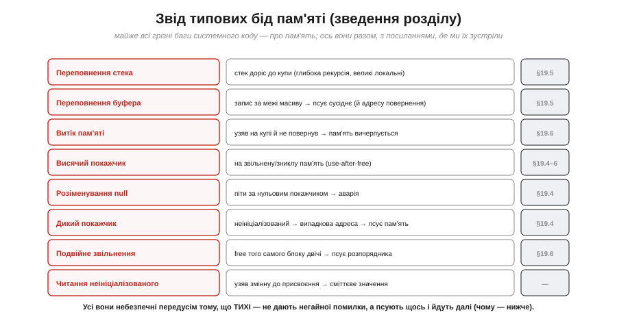
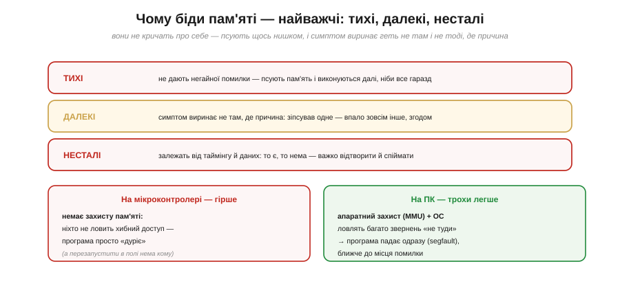
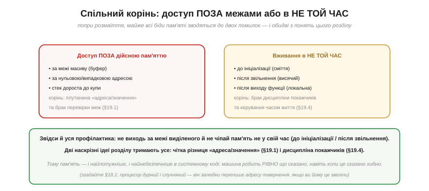
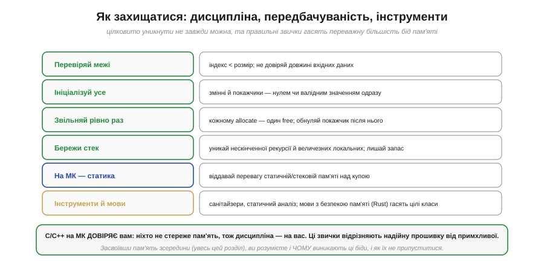

# Переповнення стека й типові біди пам'яті

Робота з пам'яттю — від [комірок і адрес](book:programming/memory-as-array) через [стек](book:programming/stack-lifo) до [купи](book:programming/heap-dynamic-memory) — раз у раз породжує особливий клас вад: переповнення, витоки, висячі покажчики. Це не розрізнені дрібниці, а **найгрізніший клас багів** у всьому системному програмуванні — і особливо на мікроконтролері, де ніхто не страхує. Розгляньмо їх системно: що це таке, чому вони такі підступні, який у них спільний корінь і як від них захищатися. Розмова якісна (без коду), бо мета — **розуміти природу** цих бід і впізнавати їх, а не зубрити рецепти. Почнімо з двох найзнаменитіших переповнень.

### Переповнення стека

*Рис. Стек росте вниз (глибокі виклики, рекурсія, великі локальні), а купа — вгору; між ними спільний простір [пам'яті](book:programming/memory-map). Якщо стек **дороста до купи**, вони починають псувати дані одне одного — це **переповнення стека**. Причини: нескінченна рекурсія, надто глибокі вкладені виклики, величезні локальні масиви. На ПК ОС спіймає й зупинить програму; на МК **немає захисту пам'яті**, тож стек тихо псує сусіднє — і програма починає поводитись загадково.*

Найчастіша причина — **нескінченна (чи надто глибока) рекурсія**: кожен виклик додає [кадр на стеку](book:programming/stack-lifo), і якщо функція не доходить до виходу, стек росте, росте — і вичерпується. Або величезний локальний масив, що сам по собі не влазить у скромний стек МК. Підступність у тому, що на мікроконтролері **ніхто не попередить**: на ПК апаратний захист пам'яті (MMU) спіймає звернення «за межі» і впорядковано обірве програму, а на МК захисту зазвичай немає — стек просто залазить на купу чи глобальні, тихо їх перезаписує, і пристрій починає «дуріти» без жодного натяку на причину. Запобігання просте за ідеєю: уникати безкінечної рекурсії, не класти величезні масиви на стек, лишати стеку запас.

### Переповнення буфера

*Рис. Маємо буфер (масив) на 8 байтів, а пишемо 12 — зайве «переливається» за край і затирає **сусідні** дані. А якщо буфер на стеку, поруч може лежати **[адреса повернення](book:programming/stack-lifo)** — і тоді функція «повернеться» в сміття (аварія) або, якщо «зайве» підібрав зловмисник, у **його** код (захоплення керування — класична діра безпеки «smashing the stack»). Корінь — відсутність перевірки меж: код пише, не глянувши, чи влазить.*

**Переповнення буфера** (*buffer overflow*) — мабуть, найзнаменитіший баг в історії, бо він не лише валить програми, а й десятиліттями був головною **дірою безпеки**. Механізм простий: пишеш у масив більше, ніж у нього влазить, і «зайве» псує те, що лежить поруч. На стеку поруч часто опиняється **[адреса повернення](book:programming/stack-lifo)** — і ось чому це так небезпечно: затерши її, ви відправляєте функцію «повертатися» казна-куди. А зловмисник може **навмисне** підібрати дані так, щоб адреса повернення вказала на його власний код, — і захопити керування машиною. Найтиповіша форма — **«off-by-one»** (на одиницю далі): цикл, що йде на крок задалеко, забутий нуль-термінатор рядка, недогляд на одиницю. Захист — **завжди перевіряти межі** (індекс менший за розмір), не довіряти довжині вхідних даних, користуватися безпечними функціями.

> 📜 **Історія.** Це не теоретична загроза: 2 листопада 1988 року рівно такий буфер на 512 байтів у сервісі `fingerd` став дверима, якими **хробак Морріса** за ніч паралізував тисячі машин тодішньої мережі — перший випадок, коли переповнення буфера стало зброєю масштабу мережі. Як саме «зайві» 24 байти підмінили адресу повернення, чому «зупинив інтернет» — гіпербола (насправді ~6 000 із ~60 000 хостів) і яку спадщину це лишило коду на МК — у вставці [📜 «Хробак Морріса (1988)»](hist-morris-worm.md).

### Звід типових бід

Окрім двох переповнень, з пам'яттю трапляється ще ціла родина споріднених вад — варто мати їх усі перед очима в одному списку.

*Рис. **Переповнення стека** — [стек](book:programming/stack-lifo) доріс до купи. **Переповнення буфера** — запис за межі масиву псує сусіднє, аж до адреси повернення. **Витік пам'яті** — узяв [на купі](book:programming/heap-dynamic-memory) й не повернув → вичерпання. **Висячий покажчик** — на звільнену/зниклу пам'ять. **Розіменування null** — піти за нульовим [покажчиком](book:programming/addresses-pointers). **Дикий покажчик** — випадкова адреса. **Подвійне звільнення**. **Читання неініціалізованого** — узяв змінну до присвоєння → сміття.*

Кожна біда — це зворотний бік потужного інструмента: [адреси й покажчики](book:programming/addresses-pointers) дають непрямість, але й дикі/висячі покажчики; [стек](book:programming/stack-lifo) дає дешеві локальні, але й переповнення; [купа](book:programming/heap-dynamic-memory) дає гнучкість, але й витоки та фрагментацію. Це не випадково: **сила й небезпека пам'яті — одне ціле**. А об'єднує всі ці біди одна риса, через яку вони й найважчі для лову.

### Чому біди пам'яті — найважчі

*Рис. Біди пам'яті — **тихі** (не дають негайної помилки — псують пам'ять і виконуються далі, ніби все гаразд), **далекі** (симптом виринає не там, де причина: зіпсував одне — впало зовсім інше, згодом) і **несталі** (залежать від таймінгу й даних: то є, то нема — важко відтворити). На **МК** ще гірше — немає захисту пам'яті, тож ніхто не ловить хибний доступ; на **ПК** легше — апаратний захист (MMU) і ОС ловлять багато звернень «не туди» й валять програму одразу, ближче до місця помилки.*

Ось чому досвідчені інженери бояться бід пам'яті понад усе. Звичайний баг кричить про себе — неправильний результат, виняток, повідомлення. А баг пам'яті **мовчить**: він тихенько перезаписав щось не те й пішов далі, програма ще довго працює нібито нормально — аж раптом падає в геть іншому місці, через хвилину чи годину, та ще й не щоразу. Зв'язати такий симптом із причиною — справжнє детективне розслідування. І на мікроконтролері це особливо болить: там немає апаратного захисту пам'яті, що на ПК ловить багато таких звернень і обриває програму близько до помилки (segfault). На МК хибний доступ просто тихо псує сусіднє — а пристрій у полі ще й нема кому перезапустити. Тому до пам'яті на МК ставляться з особливою повагою.

### Спільний корінь — і спільний захист

Попри все розмаїття, майже всі біди пам'яті мають **спільний корінь**.

*Рис. Дві помилки, і обидві — з фундаментальних понять пам'яті. **Доступ поза дійсною пам'яттю**: за межі масиву (буфер), за нульовою/випадковою адресою, стек до купи — корінь у плутанині [«адреса/значення»](book:programming/memory-as-array) і браку перевірки меж. **Вживання в не той час**: до ініціалізації (сміття), після звільнення (висячий), після виходу функції (локальна) — корінь у браку [дисципліни покажчиків](book:programming/addresses-pointers) і керування часом життя. Звідси й уся профілактика: не виходь за межі й не чіпай пам'ять не у свій час.*

Це чудова новина для практики: оскільки корінь спільний, то й **захист спільний**. Майже все зводиться до двох звичок — **не виходити за межі** виділеної пам'яті й **не чіпати** її не у свій час (до ініціалізації чи після звільнення). А тримають усе дві наскрізні ідеї: чітка різниця **[«адреса проти значення»](book:programming/memory-as-array)** і **[дисципліна покажчиків](book:programming/addresses-pointers)**. І тут спрацьовує проста істина: [процесор](book:programming/what-is-processor) **дурний і слухняний** — він залюбки перепише адресу повернення чи піде за диким покажчиком, якщо ви йому це звеліли; машина не вгадає ваш намір, вона зробить точно написане. Тому відповідальність за коректність пам'яті — цілком на програмістові.

### Як захищатися

*Рис. Правильні звички гасять переважну більшість бід: **перевіряй межі** (індекс < розмір); **ініціалізуй усе** (змінні й покажчики одразу); **звільняй рівно раз** (кожному allocate — один free, обнуляй покажчик після); **бережи стек** (уникай нескінченної рекурсії й величезних локальних); **на МК — статика** (віддавай перевагу статичній/стековій пам'яті над купою); **інструменти й мови** (санітайзери, статичний аналіз; мови з безпекою пам'яті, як Rust, гасять цілі класи). C/C++ на МК **довіряє** вам — дисципліна на вас.*

Ці звички — не бюрократія, а те, що відрізняє **надійну** прошивку від примхливої, яка «іноді зависає». Особливо на мікроконтролері, де мова C (а часто й C++) **довіряє** вам повністю: ніхто не стереже пам'ять, ніхто не спіймає вихід за межі — уся обачність на вас. Великі системи мають помічників (санітайзери, що ловлять биті пам'яті під час тестів; статичний аналіз; мови на кшталт **Rust**, що **конструктивно** унеможливлюють цілі класи бід пам'яті) — та на голому МК у C ви здебільшого сам на сам із пам'яттю. І головне: засвоївши пам'ять **зсередини** — від комірок і адрес до стека й купи, — ви розумієте не лише **як** уникати цих бід, а й **чому** вони виникають, а це найнадійніший захист.

> 🔧 **Навіщо це.** Біди пам'яті спіймають кожного, хто пише для МК, тож готуймося свідомо. Перше: **переповнення стека** (глибока рекурсія, великі локальні) і **буфера** (запис за межі масиву) — найчастіші; перевіряйте межі й бережіть стек. Друге: на МК **немає захисту пам'яті**, тож баг пам'яті **тихий**, **далекий** і **несталий** — коли пристрій «дуріє» без явної причини, підозрюйте саме пам'ять (зіпсований покажчик, вихід за межі, переповнення стека). Третє: **спільний корінь** усіх бід — доступ поза межами або вживання не у свій час; дві звички (перевіряй межі, не чіпай пам'ять не вчасно) гасять більшість. Четверте: на МК **віддавайте перевагу статичній і стековій пам'яті** над [купою](book:programming/heap-dynamic-memory) — передбачуваність дорожча за гнучкість. І пам'ятайте просту істину: [процесор](book:programming/what-is-processor) робить **рівно** що сказано, тож коректність пам'яті — на вас. Засвоївши це, ви писатимете прошивки, що працюють тижнями без збоїв, а не «зависають раз на день».
