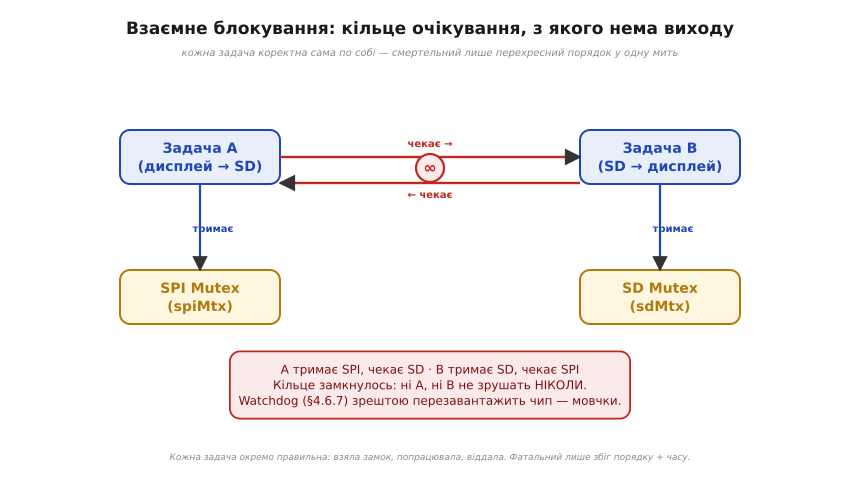
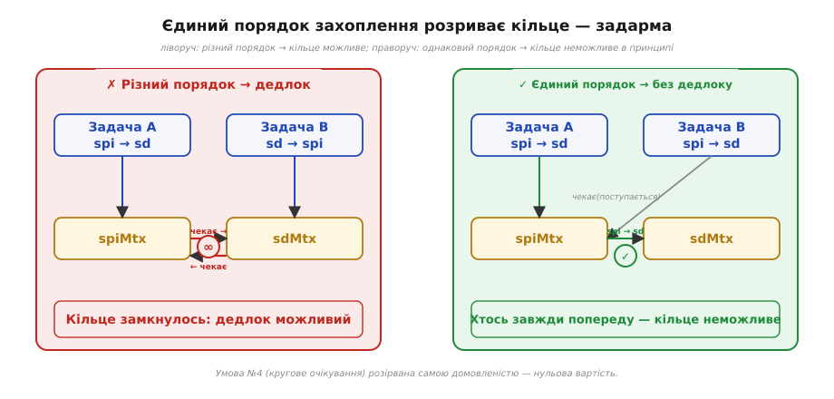

# ⚙️ Deadlock: чотири умови і дисципліна порядку захоплення

[М'ютекс](book:programming/task-ipc) — найдешевша страховка від гонок, але він має власну пастку: взаємне блокування (deadlock). Розберімо її до дна. Картина проста й невблаганна: дві задачі, два замки, кожна тримає один і чекає на інший — і обидві застигають не «надовго», а мертво, назавжди. Зрештою спрацює [сторожовий таймер](book:programming/watchdog) і мовчки перезавантажить чип, але причина залишиться. Нижче — чотири умови, що мусять збігтися водночас, і одна безкоштовна дисципліна, яка розриває одну з них.

---

### Задача: два замки, дві задачі, вічне очікування

На ESP32 є задача A, яка веде дисплей по шині SPI (ресурс `spiMtx`) і час від часу пише в журнал на SD-картку (ресурс `sdMtx`). Задача B робить навпаки: спочатку відкриває файл на SD, потім оновлює дисплей. Обидві шини спільні між задачами, і кожна з них чесно бере [м'ютекс](book:programming/task-ipc) перед роботою — саме так, як належить.

Фатальний збіг трапляється в одну мить: задача A захопила `spiMtx` і тягнеться по `sdMtx`; рівно в той самий момент задача B уже тримає `sdMtx` і тягнеться по `spiMtx`. Тепер A чекає на B, B чекає на A — кільце замкнулося.


*Рис. Взаємне блокування як кільце: A тримає SPI й чекає SD, B тримає SD й чекає SPI. Стрілки «чекає» замикаються в коло — і ні A, ні B не зрушать ніколи. Кожна задача сама по собі правильна; смертельний лише цей перехресний порядок у одну мить.*

Важливо наголосити: кожна задача окремо написана правильно — бере замок, працює, віддає. Жодної гонки, жодного порушення. Біда народжується виключно зі збігу двох речей: різних порядків захоплення й конкретного моменту в часі. Тому дедлок такий підступний: у 999 запусках усе гаразд, на 1000-му — мертво. Щоб здолати ворога, треба знати, з чого він складається.

---

### Ідея: чотири умови Коффмана і де їх розірвати

Взаємне блокування — не випадковість і не магія. Це детермінований наслідок **чотирьох умов Коффмана (Coffman conditions)**, які мусять виконуватися **одночасно**. Прибери хоча б одну — і дедлок стає неможливим у принципі.

```
Чотири умови дедлоку (всі ОДНОЧАСНО):
  1. взаємне виключення   — ресурс лише одному        (суть м'ютекса)
  2. утримуй-і-чекай      — тримаю замок, чекаю інший
  3. без витіснення замка — замок віддає лише власник
  4. кругове очікування   — A жде B, B жде A  (кільце)
Розірви БОДАЙ ОДНУ → дедлок неможливий.
Найдешевше рвати №4: єдиний порядок захоплення для ВСІХ задач.
```

Перша умова — **взаємне виключення (mutual exclusion)**: ресурс у будь-який момент може належати лише одному власнику. Це сама суть [м'ютекса](book:programming/task-ipc) — прибрати її не можна, інакше зникає весь захист від гонок.

Друга — **утримуй-і-чекай (hold-and-wait)**: задача вже тримає один замок і при цьому чекає на наступний. Саме в цьому стані зараз обидві наші задачі. Теоретично можна вимагати, щоб задача брала всі потрібні замки «разом або ніяк» — але на МК це часто незручно й дорого.

Третя — **без витіснення замка (no preemption)**: замок не можна відібрати силоміць у його власника; він сам вирішує, коли віддати. Зверніть увагу на різницю з витісненням задачі: [планувальник](book:programming/scheduler) **може** забрати в задачі процесор, але м'ютекс при цьому так і залишиться в задачі — ніхто не відбере його «автоматично». Відкат замків силоміць технічно реалізовний, але потребує складної інфраструктури.

Четверта — **кругове очікування (circular wait)**: A чекає на ресурс, що тримає B; B чекає на ресурс, що тримає A — кільце. Саме вона й є слабкою ланкою.

Умову 1 чіпати не можна. Умови 2 і 3 розірвати важко або дорого. А от умову 4 — кругове очікування — **зламати найдешевше**: достатньо домовитися про єдиний глобальний порядок захоплення замків і дотримуватися його в усіх задачах без винятку. Якщо всі завжди беруть `spiMtx` перед `sdMtx`, жодне кільце не може замкнутися — хтось завжди йтиме «попереду» в цьому порядку, і той, хто йде «після», просто чекатиме, а не блокуватиме.

Гарна аналогія: вузький місток, де рух можливий лише в один бік. Якщо всі погоджуються: «спочатку ліворуч, потім праворуч», зустрічного клінчу не буває — завжди хтось іде першим, а інший чекає. Кільце потребує, щоб кожен дивився у свій бік; єдине правило напряму це унеможливлює.


*Рис. Дисципліна порядку розриває кільце. Ліворуч — задачі беруть два замки в протилежному порядку, очікування замикається в коло (дедлок). Праворуч — усі задачі беруть замки в ОДНОМУ порядку (spi → sd): кругове очікування неможливе в принципі, і то задарма — самою домовленістю.*

Правило просте — лишилось побачити його в робочому коді.

---

### Робочий код: дисципліна порядку захоплення

Профілактика дедлоку в нашому сценарії не вимагає жодного нового механізму. Достатньо переписати задачу B так, щоб вона брала замки в тому ж порядку, що й A: спочатку `spiMtx`, потім `sdMtx`. Порядок у задачах A і B стає однаковим — кільце стає неможливим.

```c
SemaphoreHandle_t spiMtx, sdMtx;   // два спільні ресурси, кожен під своїм м'ютексом

// ✗ НЕБЕЗПЕЧНО: задачі беруть замки в РІЗНОМУ порядку → можливий дедлок
void taskA(void *p) {              // A: spi, потім sd
    for (;;) {
        xSemaphoreTake(spiMtx, portMAX_DELAY);
        xSemaphoreTake(sdMtx,  portMAX_DELAY);   // ← чекає на sd, тримаючи spi
        drawAndLog();
        xSemaphoreGive(sdMtx);
        xSemaphoreGive(spiMtx);
        vTaskDelay(pdMS_TO_TICKS(20));
    }
}
void taskB(void *p) {              // B: sd, потім spi  ← ПРОТИЛЕЖНИЙ порядок!
    for (;;) {
        xSemaphoreTake(sdMtx,  portMAX_DELAY);
        xSemaphoreTake(spiMtx, portMAX_DELAY);   // ← кільце замикається тут
        logAndDraw();
        xSemaphoreGive(spiMtx);
        xSemaphoreGive(sdMtx);
        vTaskDelay(pdMS_TO_TICKS(20));
    }
}
```

```c
// ✓ БЕЗПЕЧНО: ЄДИНИЙ порядок для ВСІХ — завжди spiMtx ПЕРЕД sdMtx
//   (домовленість, що рве умову №4 «кругове очікування»)
void takeBoth() {                  // спільний хелпер — один порядок на весь код
    xSemaphoreTake(spiMtx, portMAX_DELAY);   // 1) завжди spi
    xSemaphoreTake(sdMtx,  portMAX_DELAY);   // 2) потім sd
}
void giveBoth() {                  // віддаємо у ЗВОРОТНОМУ порядку
    xSemaphoreGive(sdMtx);
    xSemaphoreGive(spiMtx);
}
// тепер і taskA, і taskB викликають takeBoth()/giveBoth() — кільце неможливе
```

У реальному проєкті порядок зручно закріпити правилом — наприклад, завжди за зростанням числового ідентифікатора замка — щоб новачок, який додасть третій замок, не порушив дисципліну довільним вибором. Для двох замків досить чіткого коментаря в коді та хелпера `takeBoth()/giveBoth()`, який унеможливлює відхилення.

Де гарантувати єдиний порядок важко — наприклад, коли замки ховаються всередині сторонніх бібліотек або створюються динамічно — вдаються до **запасного важеля**: беруть замок із тайм-аутом і при невдачі відпускають усе, що вже тримають.

```c
// Де єдиний порядок гарантувати важко — бери з тайм-аутом і відкочуйся:
if (xSemaphoreTake(spiMtx, pdMS_TO_TICKS(50)) == pdTRUE) {
    if (xSemaphoreTake(sdMtx, pdMS_TO_TICKS(50)) == pdTRUE) {
        drawAndLog();
        xSemaphoreGive(sdMtx);
    }                                  // не дочекався sd —
    xSemaphoreGive(spiMtx);            //   ВІДПУСТИВ spi й вийшов (не тримаю-і-чекаю)
}                                      // наступної ітерації спробуємо знову
```

Тайм-аут рве умову «утримуй-і-чекай», а не кругове очікування — це інший важіль, але він теж руйнує одну з чотирьох умов. Важливо розуміти: тайм-аут не «ліки» від дедлоку, а спосіб виявити й відкотитися. Основний шлях — завжди єдиний порядок; тайм-аут лише підстраховує там, де порядок неможливо простежити наскрізь.

---

### Складність і пастки на МК

**Вартість дисципліни.** Єдиний порядок захоплення — це нуль накладних витрат: лише домовленість і кілька рядків у коментарі чи хелпері. Тайм-аут із відкатом потребує зайвих спроб і ускладнює логіку — тому де можна, обирайте порядок, а не тайм-аут.

**Прихований третій замок.** Бібліотеки для дисплея, SD-карток, мережевого стека беруть власні внутрішні замки, яких ви не бачите. Ваш «єдиний порядок» може виявитися зламаним ззовні: ваш замок → внутрішній замок бібліотеки — і у бібліотеці може бути свій внутрішній порядок. Тому тримайте замки якомога коротше й ніколи не викликайте «складний» зовнішній код, поки тримаєте свій замок.

**Самозахоплення.** Звичайний м'ютекс FreeRTOS — не рекурсивний. Якщо одна й та сама задача спробує взяти його двічі (наприклад, функція A тримає замок і викликає функцію B, яка теж бере той самий замок), вийде дедлок із самим собою — з одного замка. Якщо потрібна вкладеність, використовуйте `xSemaphoreCreateRecursiveMutex()` і `xSemaphoreTakeRecursive()`.

**Дедлок маскується під зависання.** Симптом — частина пристрою завмерла, інші задачі ще живі; через деякий час спрацює [сторожовий таймер](book:programming/watchdog) і мовчки перезавантажить чип. При «раптових ресетах під навантаженням» дедлок — один із перших підозрюваних, нарівні з переповненням стека.

**Дедлок — не інверсія пріоритетів.** Не плутайте ці дві проблеми: [інверсія пріоритетів](book:programming/task-ipc) лікується успадкуванням пріоритету, що вбудоване в м'ютекс FreeRTOS. Дедлок — зовсім інша біда, і жоден вбудований механізм від нього не рятує. Лише ваша дисципліна порядку.

> 🔧 **Навіщо це.** Беручи в задачі більш ніж один замок, заведи й запиши ЄДИНИЙ порядок їх захоплення — однаковий для ВСІХ задач — і завжди віддавай у зворотному. Це безкоштовно й вибиває умову «кругове очікування», без якої дедлок неможливий. А ще краще — уникай ситуації «два замки одразу»: що менше спільного й що коротше тримаєш замок, то менше нагод і для дедлоку, і для інверсії.

---

Дедлок страшний лише доти, поки здається випадковим; знаючи чотири умови Коффмана, його не «ловлять» і не «лагодять постфактум», а роблять неможливим — дисципліною порядку, що діє ще до першого запуску. Разом із чергами, що взагалі прибирають спільний стан, — саме це і є те, як багатозадачність лишається надійною, а не лякливою.
