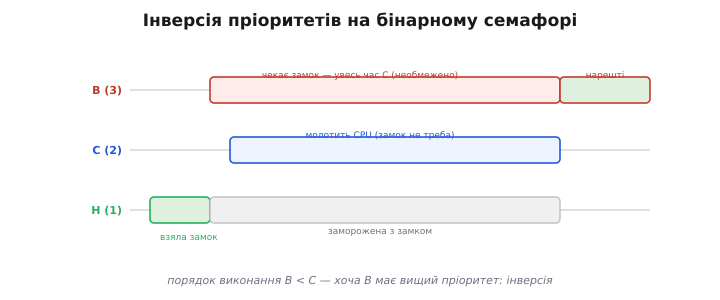
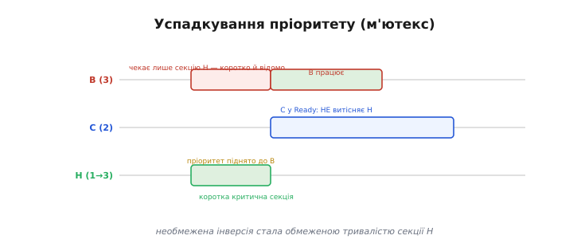

# ⚙️ Успадкування пріоритету: що насправді робить м'ютекс проти інверсії пріоритетів

## Сценарій-збій: три задачі, один замок — і де ховається біда

Уявімо типову прошивку з трьома задачами: **Низька Н** (пріоритет 1) раз на кілька секунд записує лог у спільну шину SPI, **Середня С** (пріоритет 2) обробляє дані давача, **Висока В** (пріоритет 3) реагує на критичні події і має жорсткий дедлайн. Шина SPI — спільний ресурс, і щоб захистити її від одночасного доступу, хтось справедливо запропонував: «поставимо бінарний семафор». Правильно? Технічно — так, помилку компілятор не покаже. Але поведінка в часі стане непередбачуваною: найвища задача може **проґавити свій дедлайн**, хоча ні вона, ні Н не написали жодного рядка «неправильного» коду.

Питання гостре: чому задача з найвищим пріоритетом застряє, поки виконується С — яка навіть не торкається тієї шини? Саме це і є **інверсія пріоритетів** — і лікує її не «оптимізація коду», а **правильний тип замка**.

---

## Механіка інверсії без успадкування

Розкладімо сценарій по кроках.

1. **Н бере замок** (`xSemaphoreTake`) і заходить у критичну секцію: вона пише щось у шину SPI.
2. **В прокидається** і також хоче той самий замок — але він зайнятий. Відповідно до правил блокування [задач](book:programming/tasks), В **поступливо чекає**: переходить у стан Blocked і звільняє CPU.
3. Поки Н тримає замок, **прокидається С**. Їй той замок не потрібен — вона просто обробляє свій давач. Але С > Н, тож [планувальник](book:programming/scheduler) **витісняє** Н: Н зупиняється посередині критичної секції.
4. Н не може завершити роботу і викликати `xSemaphoreGive` — вона зупинена. В усе ще чекає замку, який тримає заморожена Н.
5. В фактично чекає **стільки, скільки виконуватиметься С**. Тривалість блокування В стала **необмеженою**: вона залежить не від тривалості критичної секції Н, а від того, скільки виконуватиметься С — або навіть кількох таких «середніх» задач поспіль. Фактичний порядок виконання: В < С, хоча В має вищий пріоритет. Це і є аномалія — і саме вона б'є по [дедлайнах реального часу](book:programming/realtime-determinism).



*Інверсія пріоритетів на бінарному семафорі: Н тримає замок, В чекає на нього, а С (їй замок не потрібен) витісняє Н — і найвища В голодує через середню С. Затримка В розтягується на весь час роботи С: необмежена.*

> 🔧 **Навіщо це.** Бінарний семафор **не знає, хто його тримає** — у нього немає поняття «власник». Тому він і не вміє підняти пріоритет власника: просто немає про кого думати. М'ютекс, навпаки, завжди знає свого власника. Саме тому для захисту ресурсу беріть `xSemaphoreCreateMutex`, а не `xSemaphoreCreateBinary` — лише м'ютекс несе в собі механіку успадкування. Про Mars Pathfinder, де ця помилка ледь не поховала місію в 1997 році, читайте в [📜 історії про Pathfinder](book:programming/task-ipc/hist-pathfinder.md).

---

## Що робить успадкування пріоритету

Тепер замінімо семафор м'ютексом. Ядро FreeRTOS знає власника кожного м'ютекса — і коли вища задача блокується на ньому, воно діє активно.

1. **Н бере м'ютекс** і входить у критичну секцію.
2. **В прокидається, блокується** на м'ютексі власника Н. Ядро бачить: «В має пріоритет 3, а власник (Н) — пріоритет 1». Воно **тимчасово піднімає пріоритет Н до 3**.
3. Тепер С (пріоритет 2) **вже не може витіснити Н** — з погляду планувальника Н тимчасово «висока». С залишається в черзі Ready.
4. Н **швидко завершує** критичну секцію: ніхто не заважає.
5. На `xSemaphoreGive` ядро **повертає Н її початковий пріоритет 1**, замок переходить до В, і В нарешті виконується.

Ключова думка: успадкування не усуває очікування В зовсім — В усе одно чекає, поки Н завершить критичну секцію. Але це очікування тепер **обмежене тривалістю критичної секції Н**, а не довільним часом С. Необмежене перетворилося на відоме й коротке. Якщо критична секція займає мікросекунди або кілька мілісекунд, В знає свій «найгірший випадок» — саме це і потрібно [реальному часу](book:programming/realtime-determinism).



*Успадкування пріоритету (м'ютекс): поки Н тримає замок, потрібний В, її пріоритет тимчасово піднімають до В — тож С не витісняє Н. Н швидко віддає замок, повертає свій пріоритет, і В чекала лише тривалість критичної секції — інверсії немає.*

Звідси природне правило дисципліни: **критичну секцію під м'ютексом тримають якомога коротшою**. Успадкування рятує лише якщо власник швидко віддає замок — довга секція під м'ютексом і В усе одно чекатиме довго, просто вже не через С, а через саму Н.

---

## Робочий код: побачити різницю на власні очі

**Демонстрація інверсії та її усунення — перемикаємо один рядок**

```cpp
// ESP32 / Arduino-FreeRTOS
// Перемкніть один рядок у setup(), щоб побачити різницю в поведінці:
//   lock = xSemaphoreCreateBinary(); xSemaphoreGive(lock);   // ✗ інверсія
//   lock = xSemaphoreCreateMutex();                           // ✓ успадкування

#include <Arduino.h>

SemaphoreHandle_t lock;

// Низька Н (prio 1): бере замок, «довго» в критичній секції (~5 мс)
void lowTask(void*) {
    for (;;) {
        xSemaphoreTake(lock, portMAX_DELAY);
        // --- критична секція (моделюємо роботу з ресурсом) ---
        uint32_t end = millis() + 5;
        while (millis() < end) { /* busy-work */ }
        xSemaphoreGive(lock);
        vTaskDelay(pdMS_TO_TICKS(100));
    }
}

// Середня С (prio 2): молотить CPU без замка — моделює «іншу роботу»
void midTask(void*) {
    for (;;) {
        volatile uint32_t x = 0;
        for (uint32_t i = 0; i < 200000; ++i) x += i; // ~2–4 мс
        vTaskDelay(pdMS_TO_TICKS(10));
    }
}

// Висока В (prio 3): заміряє, скільки чекала замку
void highTask(void*) {
    for (;;) {
        uint32_t t0 = millis();
        xSemaphoreTake(lock, portMAX_DELAY);   // <-- скільки чекали?
        uint32_t waited = millis() - t0;
        xSemaphoreGive(lock);
        Serial.printf("В чекала %lu мс\n", waited);
        vTaskDelay(pdMS_TO_TICKS(200));
    }
}

void setup() {
    Serial.begin(115200);

    // ✗ Бінарний семафор — НЕМАЄ успадкування → інверсія:
    lock = xSemaphoreCreateBinary();
    xSemaphoreGive(lock);

    // ✓ М'ютекс — Є успадкування → інверсії немає (розкоментуйте):
    // lock = xSemaphoreCreateMutex();

    // Всі на одному ядрі — щоб витіснення було чітко видиме
    xTaskCreatePinnedToCore(lowTask,  "Low",  2048, NULL, 1, NULL, 1);
    xTaskCreatePinnedToCore(midTask,  "Mid",  2048, NULL, 2, NULL, 1);
    xTaskCreatePinnedToCore(highTask, "High", 2048, NULL, 3, NULL, 1);
}

void loop() { vTaskDelay(pdMS_TO_TICKS(1000)); }
```

На **бінарному семафорі** В регулярно звітує про очікування 2–4 мс і більше — стільки, скільки виконувалась С. Замінивши один рядок на `xSemaphoreCreateMutex()`, В чекатиме лише ~5 мс критичної секції Н, і число стане стабільним та передбачуваним. Та сама програма, один рядок змінено — і поведінка в часі стала керованою.

---

## Складності й пастки на МК

- **Успадкування ≠ безкоштовне й ≠ панацея.** Воно лише обмежує інверсію тривалістю критичної секції. Якщо ви тримаєте м'ютекс кілька десятків мілісекунд, В усе одно чекатиме стільки ж — просто вже не через С, а через саму Н. Тримайте секцію короткою — це не «оптимізація», це дисципліна [реального часу](book:programming/realtime-determinism).

- **Лише пряме (single-level) успадкування у FreeRTOS.** FreeRTOS реалізує базове успадкування: один замок, один власник. При ланцюжку вкладених м'ютексів (Н тримає M1, чекає M2, а M2 тримає хтось інший) ядро покриває ситуацію не ідеально — не покладайтесь на складні сценарії з кількома замками.

- **Семафор для ресурсу — класична тиха помилка.** `xSemaphoreCreateBinary` і `xSemaphoreCreateMutex` мають однаковий API — `Take`/`Give`. Але тільки м'ютекс несе власника й успадкування. Якщо ви колись скопіювали «замок на ресурс» через бінарний семафор — перевірте: саме там найчастіше ховається інверсія, яку «ніхто не бачить» роками.

- **ISR і м'ютекс несумісні.** З обробника переривань м'ютекс брати не можна: `...FromISR`-варіанту для м'ютекса у FreeRTOS немає. Успадкування не має сенсу в ISR — переривання не є «задачею-власником». Для синхронізації з ISR беруть бінарний семафор або нотифікацію задачі.

- **Два ядра ESP32 маскують проблему.** Якщо Н і С закріплені на різних ядрах, С не витісняє Н безпосередньо — і на ESP32 легко «не побачити» інверсію під час тестування. Саме тому в прикладі всі три задачі закріплені на одному ядрі (`xTaskCreatePinnedToCore(..., 1)`). На реальному двоядерному коді інверсія все одно виникає через спільні ресурси між ядрами — просто менш очевидно.

- **`vTaskPrioritySet` руками + успадкування = плутанина.** Якщо ручна зміна пріоритету власника відбувається, поки діє успадкування, ядро й програміст починають конкурувати за «правильний пріоритет». Результат — непередбачуваний ефективний пріоритет. Не змішуйте `vTaskPrioritySet` з активними м'ютексами.

- **Вимірюйте, а не вірте.** Найгіршу затримку В найпростіше виявити саме під навантаженням, а не в тестових умовах: інверсія на бінарному семафорі може траплятися «раз на день», коли всі три задачі натикаються одна на одну в несприятливий момент. Вимірюйте `waited` під реальним навантаженням (як [watermark стека](book:programming/task-stacks)) — і побачите різницю між семафором і м'ютексом на власні очі.

---

## Підсумок

М'ютекс — це не «семафор для одного»: його дві відмінності — власник і успадкування пріоритету — існують саме для того, щоб найвища задача не голодувала через середню. Успадкування перетворює необмежену інверсію на обмежену тривалістю короткої критичної секції — рівно те, чого вимагає [реальний час](book:programming/realtime-determinism).

Практичне правило не змінюється: **ресурс → `xSemaphoreCreateMutex`**, секцію тримайте короткою, а різницю — переконайтесь самі, перемкнувши один рядок у прикладі вище.
