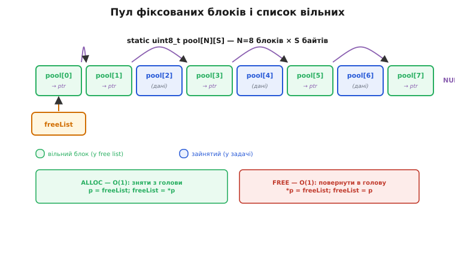
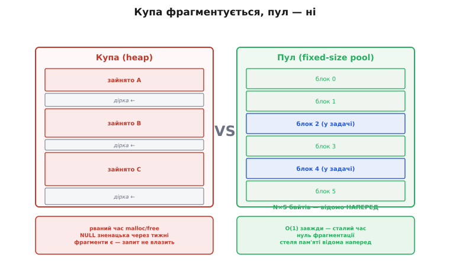

# ⚙️ Жити без free(): статичні пули замість динамічної купи

У вбудованих системах люблять [статичне виділення](topic:programming/task-stacks) — створити все на старті й більше не чіпати купу. Причина — відоме застереження: `malloc/free` за тижні безперервної роботи фрагментує купу так, що великий запит раптово не знаходить місця, хоча вільних байтів начебто вдосталь. Але чи означає «статичне виділення», що об'єкти взагалі не можуть з'являтися й зникати? Ні. На практиці пакети надходять і відправляються, події кнопок живуть мить і зникають, відліки давачів летять у чергу й повертаються назад. Питання в іншому: як роздавати й повертати ці буфери, якщо `malloc/free` — під забороною? Відповідь — **пул фіксованих блоків** (*block pool* / *fixed-size pool*): наперед виділений масив плюс список вільних. «Виділити» означає взяти блок з голови списку; «звільнити» — повернути назад. Жодного `free()`, жодного звернення до купи.

---

## Задача

Уявіть типовий потік на ESP32: мережевий інтерфейс приймає пакети, кожен розміром до 256 байтів, і кидає їх у чергу обробника. Обробник читає, аналізує й повертає буфер. Водночас натискання кнопок породжують невеликі події-структури, що живуть кілька мілісекунд. Розмір кожного об'єкта відомий і однаковий; максимум «живих» одночасно — теж обмежений.

Наївний `malloc/free` тут — пастка одразу на трьох фронтах. По-перше, фрагментація (*fragmentation*): кожне виділення й повернення різного розміру з часом перетворює купу на мозаїку, де вільне є, але суцільного шматка бракує — і великий запит повертає NULL. Найгірше, що в пристрої, який працює тижнями, цей збій виникає зненацька, через дні безперервної роботи. По-друге, недетермінованість: час виконання `malloc` залежить від стану купи й може коливатися від одиниць тактів до сотень — а для задач, яким потрібна [передбачуваність у реальному часі](topic:programming/realtime-determinism), це ворог. По-третє, тихі витоки: якщо хоч раз забути `free` — байти йдуть назавжди.

Нам потрібне рішення, де alloc і free — O(1), без купи, з відомою стелею споживання пам'яті.

> 🔧 **Навіщо це**
>
> Щойно у прошивці з'являється «потік однотипних об'єктів» — пакети, події, відліки — не тягни `malloc/free`. Заведи пул фіксованих блоків: отримаєш передбачуваний сталий час виділення, нуль фрагментації та заздалегідь відому стелю RAM. Це стандарт надійних МК-систем: саме так працюють мережеві стеки, RTOS-пули і промислові планувальники.

---

## Ідея: масив блоків + список вільних (free list)

Механізм потребує двох елементів. Перший — **статичний масив** на N блоків розміру S байтів: `static uint8_t pool[N][S]`. Слово `static` тут ключове: пам'ять живе в секції даних (*data segment*), а не в купі — ніхто її не «виділяє» і не «повертає» операційній системі. Ще на старті прошивки ця пам'ять зарезервована й завжди доступна — той самий прийом, що й винесення великих буферів [зі стека](topic:programming/task-stacks) у статичну пам'ять.

Другий елемент — **список вільних** (*free list*): однозв'язний ланцюг незайнятих блоків. Ключовий трюк: кожен вільний блок сам тримає в собі вказівник на наступний вільний. Поки блок нікому не належить, у перших байтах його пам'яті просто лежить адреса наступного кандидата. Як тільки блок видають задачі — ці байти перекриваються справжніми даними, і вказівника там уже немає. Голова списку — змінна `freeList`: адреса першого вільного блоку.

«Виділити» (alloc) = зняти блок з голови: запам'ятати поточну голову, зсунути `freeList` на те, що він показував, повернути блок. Одне переприєднання вказівника — O(1). «Звільнити» (free) = причепити блок назад у голову: записати в перші байти блоку поточну `freeList`, після чого зробити цей блок новою головою. Знову одне переприєднання — O(1). Жодного звернення до купи, жодного сканування.



*Пул фіксованих блоків і список вільних: статичний масив N×S; незайняті блоки зшиті в ланцюг (кожен вільний блок тримає у своїх перших байтах вказівник на наступний вільний); голова freeList. «Виділити» — зняти блок з голови (O(1)); «звільнити» — причепити назад у голову (O(1)).*

Уся «динаміка» зведена до двох переприєднань вказівника — звідси і сталий час, і відсутність звернень до купи. Подивімося, як це виглядає в реальному C.

---

## Робочий код (C/C++ для ESP32/FreeRTOS)

Нижче — повний, компільований пул; коментарі українською.

**Блок 1 — оголошення пулу й ініціалізація free list**

```c
#include <stdint.h>
#include <stddef.h>

#define POOL_N   16          /* кількість блоків                    */
#define BLOCK_SZ 64          /* розмір кожного блоку, байт          */

static uint8_t pool[POOL_N][BLOCK_SZ];  /* статична пам'ять — НЕ купа */
static void   *freeList;                /* голова списку вільних       */

void pool_init(void)
{
    /* Зшиваємо всі блоки в ланцюг:
       у перших sizeof(void*) байтах кожного вільного блоку
       зберігаємо вказівник на наступний вільний блок.       */
    for (int i = 0; i < POOL_N - 1; i++)
        *(void **)pool[i] = pool[i + 1];   /* pool[i] → pool[i+1] */
    *(void **)pool[POOL_N - 1] = NULL;     /* останній → NULL     */
    freeList = pool[0];                    /* голова = pool[0]    */
}
```

Трюк `*(void **)pool[i]` виглядає незвично, але безпечний: поки блок вільний, у ньому нічиїх даних немає — ми просто позичаємо його перші байти під вказівник. Як тільки блок видано, ці байти перекриються справжніми даними записувача — і вказівник там уже не читається. Коли блок повертають назад, ті самі байти знову стають нашими.

**Блок 2 — alloc і free за O(1)**

```c
void *pool_alloc(void)
{
    if (freeList == NULL)
        return NULL;              /* пул вичерпано — штатна ситуація */

    void *blk  = freeList;       /* знімаємо голову                 */
    freeList   = *(void **)blk;  /* голова → наступний вільний      */
    return blk;
}

void pool_free(void *p)
{
    if (p == NULL) return;

    *(void **)p = freeList;      /* у блок пишемо стару голову      */
    freeList    = p;             /* блок стає новою головою         */
}
```

Жодного `malloc`, жодного `free()` з libC. Обидві функції — кілька машинних інструкцій, час сталий. «Звільнення» — це повернення в пул, а не повернення операційній системі: пам'ять нікуди не йде, вона лишається в тому самому статичному масиві.

**Блок 3 — потокобезпечність (ESP32/FreeRTOS)**

Якщо `pool_alloc`/`pool_free` викликаються з кількох задач, `freeList` — спільний ресурс, і його треба захистити. Операція коротка — два-три рядки — тому критична секція доречніша за повноцінний м'ютекс.

```c
#include "freertos/FreeRTOS.h"
#include "freertos/portmacro.h"

static portMUX_TYPE pool_mux = portMUX_INITIALIZER_UNLOCKED;

void *pool_alloc_safe(void)
{
    void *blk;
    portENTER_CRITICAL(&pool_mux);
    blk = pool_alloc();
    portEXIT_CRITICAL(&pool_mux);
    return blk;
}

void pool_free_safe(void *p)
{
    portENTER_CRITICAL(&pool_mux);
    pool_free(p);
    portEXIT_CRITICAL(&pool_mux);
}

/* З обробника переривань (ISR) — варіанти ...FromISR():       */
/* portENTER_CRITICAL_ISR / portEXIT_CRITICAL_ISR(&pool_mux)  */
```

Це той самий [захист спільного ресурсу](topic:programming/task-ipc), лише навколо двох рядків; коротка операція — короткий замок.



*Купа проти пулу на МК. Купа: блоки різного розміру, з часом фрагментується (вільне є, та розкидане — великий запит не вміщується), час malloc/free нерівномірний, збій може виникнути зненацька. Пул: однакові блоки в суцільному масиві, нуль фрагментації, час сталий, стеля пам'яті відома наперед (N×S).*

---

## Складність і пастки на МК

**1. Складність операцій.** `pool_alloc` і `pool_free` — O(1), детерміновані. Споживання пам'яті — рівно `N × BLOCK_SZ` байтів, відоме на етапі компіляції. Це прямий виграш для бюджету RAM: пік відомий ще до першого запуску — на відміну від [водяного знаку стека](topic:programming/task-stacks), який доводиться вимірювати.

**2. Пул вичерпано (NULL).** Повернення NULL — штатна, а не аварійна ситуація. Її треба обробити обов'язково: відкинути пакет, залишити подію в черзі, збільшити лічильник переповнень — будь-що, але не ігнорувати. Розмір N підбирають за виміряним піком одночасно живих об'єктів: замалий — частий NULL, завеликий — марна витрата RAM.

**3. Двічі звільнити / використати після звільнення.** Double-free і use-after-free у пулі так само небезпечні, як і в купі: псують `freeList`, і наступний `alloc` поверне непередбачуваний вказівник. На час налагодження корисно позначати вільний блок магічним числом у перших байтах і перевіряти його на вході `pool_free` — якщо магічне число вже є, блок повертають удруге. У релізі цю перевірку прибирають.

**4. Один пул — один розмір.** Блоки фіксовані: великий об'єкт туди не влізе, маленький — займе більше місця, ніж потрібно. Під різні класи об'єктів тримають кілька незалежних пулів: один для пакетів, другий для подій, третій для відліків. Саме так побудовані реальні мережеві стеки — lwIP, наприклад, підтримує пул `pbuf`-буферів різних розмірів.

**5. Вирівнювання (alignment).** Блок зберігатиме структури з `uint32_t` або вказівниками, а значить, початок кожного блоку мусить бути вирівняний на 4 або 8 байтів. Оголошення `static uint8_t pool[N][S]` вирівнює масив на вирівнювання `uint8_t` — тобто на 1 байт. Безпечніше: `static uint32_t pool[POOL_N][BLOCK_SZ / 4]` або `__attribute__((aligned(8)))`. Тримайте `BLOCK_SZ` кратним 8, і питання вирівнювання закриється автоматично.

**6. Потокобезпека.** Спільний пул = обов'язковий [захист від гонок](topic:programming/task-ipc). З ISR використовують `portENTER_CRITICAL_ISR/portEXIT_CRITICAL_ISR`; з задачі — `portENTER_CRITICAL/portEXIT_CRITICAL`, як у наведеному вище блоці.

---

Пул фіксованих блоків дає саме те, чого вимагає [статичне виділення](topic:programming/task-stacks): динаміку об'єктів без купи, зі сталим O(1)-часом і заздалегідь відомою стелею пам'яті. Саме ця передбачуваність — «ніколи не фрагментує, завжди O(1)» — те, що цінує [реальний час](topic:programming/realtime-determinism). І наостанок: для рідко виділюваних одиничних об'єктів проста статична змінна або глобальний буфер ще простіші — пул варто заводити тоді, коли об'єктів багато й вони течуть потоком.
