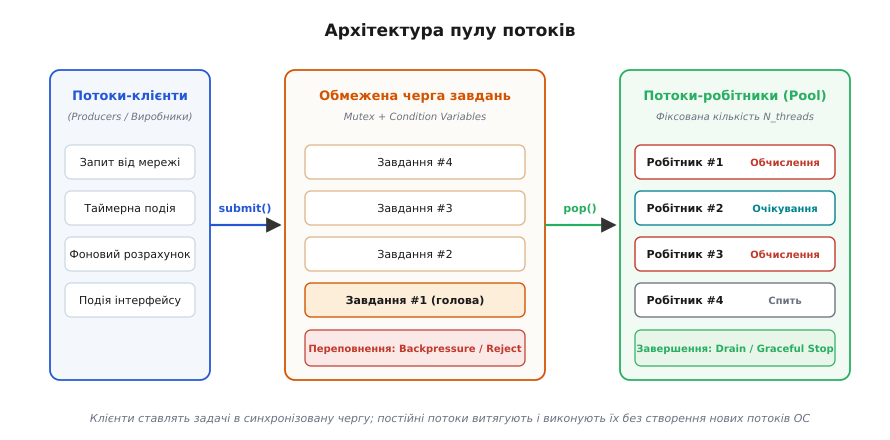
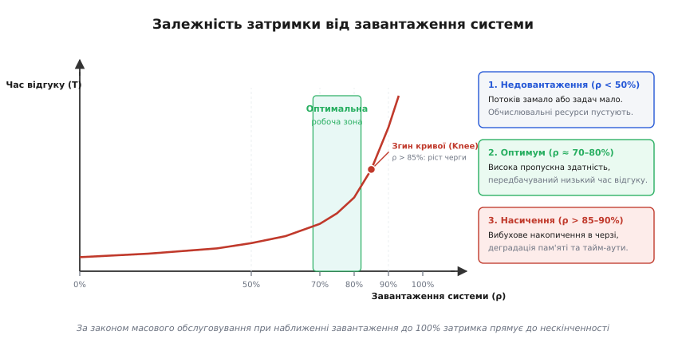
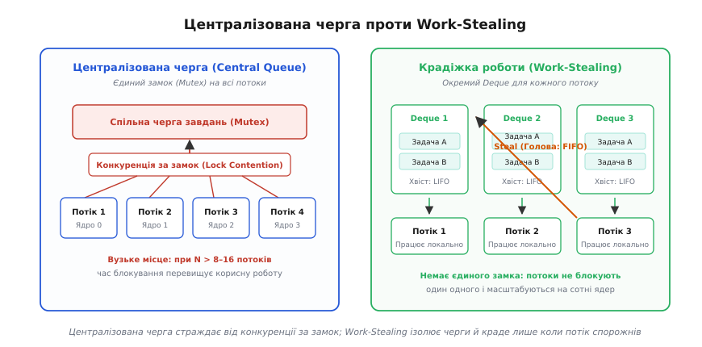

# Пул потоків і розрахунок його розміру

<preknowlist>
- [Процеси й потоки](topic:programming/process-vs-thread) — чим потік відрізняється від процесу: спільний адресний простір, власний стек і регістри.
- [Перемикання контексту](topic:programming/context-switch) — збереження й відновлення регістрів ядра, ціна перемикання та скидання кешів.
- [Перегони даних і замки](topic:programming/data-races-locks) — синхронізація через м'ютекси для захисту спільного стану.
- [Виробник–споживач](topic:programming/producer-consumer) — патерн черги з умовними змінними між потоками.
</preknowlist>

Уявіть мережевий сервер або фоновий обробник подій, на який щосекунди надходить 10 000 клієнтських запитів. Якщо для кожного нового запиту створювати окремий потік операційної системи за допомогою виклику `pthread_create()` або конструктора `std::thread`, система зіткнеться з миттєвою деградацією за трьома напрямками. По-перше, пам'ять: кожен системний потік у 64-розрядній ОС Linux за замовчуванням резервує від 2 до 8 МБ віртуального адресного простору під власний стек. Десять тисяч одночасних потоків зажадають від 20 до 80 ГБ адресного простору і сотні мегабайтів фізичної пам'яті лише на таблиці сторінок ядра, що швидко призведе до аварійного завершення процесу через вичерпання пам'яті (Out-Of-Memory). По-друге, затримка: створення потоку вимагає від ядра системного виклику `clone()`, виділення структур `task_struct`, налаштування локальної пам'яті потоку (TLS) та встановлення охоронних сторінок стека (guard pages), що забирає від 15 до 50 мікросекунд на кожен запит. По-третє, планувальник: коли 10 000 потоків конкурують за 8 або 16 фізичних процесорних ядер, планувальник ядра витрачає майже весь бюджет процесорного часу на перемикання контекстів, збереження регістрів і скидання апаратних кешів, замість виконання корисної бізнес-логіки.

Виходом із цієї пастки є фундаментальне розділення понять: **що** має бути виконано (окреме завдання чи запит), та **хто** це виконує (потік операційної системи). Механізм, що забезпечує таке розділення, називається **пулом потоків** (англ. *thread pool*).

```
Наївний підхід (Thread-per-Request):
10 000 запитів ──► 10 000 системних потоків ──► 80 ГБ пам'яті, колапс планувальника ОС

Пул потоків (Worker Pool):
10 000 запитів ──► [ Черга завдань ] ──► Фіксовані 8–16 потоків-робітників (100% корисної роботи)
```

### Архітектура пулу потоків: три базові сутності

Пул потоків — це набір заздалегідь створених і постійно діючих потоків операційної системи (їх називають **потоками-робітниками**, англ. *worker threads*), які очікують на надходження завдань у спільній черзі, витягують їх по черзі, виконують і знову повертаються в стан очікування без знищення системного дескриптора потоку.

Архітектура будь-якого пулу потоків спирається на три складові частини:

1. **Клієнтський інтерфейс постановки задач (`submit` / `execute`):** точка входу, через яку зовнішні потоки (виробники, *producers*) загортають код у компактний об'єкт завдання (покажчик на функцію з аргументами або замикання) і поміщають його в чергу.
2. **Потокобезпечна черга завдань (Task Queue):** проміжний буфер типу FIFO (First-In, First-Out), захищений м'ютексом для запобігання гонкам даних при одночасному додаванні та вилученні елементів.
3. **Група потоків-робітників (Worker Pool):** фіксована або динамічно керована кількість системних потоків, закріплених за пулом на весь час його життя.


*Архітектура пулу потоків: відокремлення клієнтів (виробників) від потоків-робітників (споживачів) через потокобезпечну чергу завдань.*

Завдяки такій побудові вартість запуску завдання скорочується з кількох десятків мікросекунд до кількох десятків наносекунд: замість взаємодії з ядром операційної системи програма просто записує покажчик у масив у просторі користувача й сигналізує умовній змінній.

### Життєвий цикл потоку-робітника

Кожен потік-робітник у момент запуску пулу входить у циклічний стан автомата, який виконується до моменту повної зупинки системи:

```
Життєвий цикл Worker Thread:
[ Старт ] ──► [ Захопити Mutex черги ]
                     │
                     ▼
          [ Черга порожня? ] ───(Так)───► [ Заснути на cond_var (чекає задачі) ]
                     │                                   ▲
                    (Ні)                                 │
                     ▼                                   │
          [ Витягти задачу з черги ]                     │
                     │                                   │
                     ▼                                   │
          [ Звільнити Mutex черги ]                      │
                     │                                   │
                     ▼                                   │
          [ Виконати функцію задачі ] ───────────────────┘
```

Головний інженерний нюанс робочого циклу полягає у **своєчасному звільненні м'ютекса**. Потік-робітник повинен утримувати блокування черги рівно на той мінімальний проміжок часу, який потрібен для модифікації покажчиків черги й вилучення задачі в локальну змінну. Сама функція задачі має виконуватися виключно поза замком. Якщо початківець забуває відпустити м'ютекс перед викликом задачі, паралелізм повністю втрачається: уся система зводиться до одного активного потоку, тоді як решта ядер простоюють в очікуванні звільнення замка.

> 🔧 **Навіщо це.** Повторне використання системних потоків рятує не лише процесорний час, а й кеш-пам'ять. Потік, що постійно живе на певному ядрі процесора, утримує у своїх локальних кешах L1/L2 інструкції та структури даних середовища виконання. При постійному створенні й знищенні потоків ядра безперервно очищують і заново заповнюють кеш-лінії, що знижує реальну швидкість обчислень у рази.

Детальний аналіз реалізації такого робочого циклу мовами C і C++, а також виміри прискорення наведені в матеріалі [Практична реалізація пулу потоків із чергою завдань](topic:programming/thread-pool/proj-thread-pool.md).

### Обмежені черги та механізм зворотного тиску (Backpressure)

Найнебезпечніша помилка під час проектування пулу потоків — використання **необмеженої черги** (англ. *unbounded queue*), місткість якої обмежена лише обсягом доступної оперативної пам'яті.

Уявімо сервіс, який стабільно обробляє 1000 запитів за секунду. Якщо через раптовий сплеск навантаження швидкість надходження запитів підскочить до 1500 req/s, пул потоків фізично зможе виконувати лише 1000. Кожної секунди 500 нових завдань залишатимуться в пам'яті. За кілька хвилин такої роботи черга розростеться до сотень тисяч об'єктів. Це породжує два руйнівні наслідки:
1. **Катастрофічне зростання пам'яті:** об'єкти задач утримують у купі замикання, буфери запитів і дескриптори, що неминуче завершується падінням процесу за сигналом `SIGKILL` від ядра (OOM Killer).
2. **Марна робота (Stale Processing):** клієнти, які чекають відповіді, скинуть з'єднання за тайм-аутом (наприклад, через 2 секунди). Проте їхні задачі залишаться в черзі. Через хвилину потік-робітник дістане з черги «протухле» завдання, сумлінно витратить 10 мс процесорного часу на його розрахунок, спробує відправити результат у закритий мережевий сокет і викине його. Система витрачає 100% ресурсів на виконання роботи, результат якої вже нікому не потрібен.

Тому промислові пули потоків **завжди використовують обмежені черги** (англ. *bounded queues*) фіксованої місткості `Q_max`. Коли черга заповнюється до краю, система переходить у режим регулювання навантаження, застосовуючи одну зі стандартних **політик відхилення завдань** (англ. *rejection policies*):

```
Політики реакції на переповнення черги (Queue Overflow):
1. Abort / Fast Fail   ──► Миттєво повернути помилку / кинути виняток
2. Caller-Runs         ──► Потік-клієнт виконує задачу САМ (Backpressure!)
3. Discard             ──► Тихо відкинути нову задачу (для метрик/телеметрії)
4. Discard-Oldest      ──► Викинути найстарішу задачу з голови черги
```

Розглянемо механіку кожної політики:

* **Швидка відмова (Abort / Fast Fail):** метод постановки задачі `submit()` негайно повертає помилку або викидає виняток (наприклад, `RejectedExecutionException`). Клієнт одразу дізнається, що сервер перевантажений, і отримує статус HTTP 429 (Too Many Requests) або 503 (Service Unavailable), замість того щоб висіти в очікуванні тайм-ауту.
* **Виконання клієнтом (Caller-Runs):** завдання не додається в чергу, а виконується безпосередньо тим самим потоком, який викликав `submit()`. Це найелегантніший спосіб організації **локального зворотного тиску** (англ. *backpressure*): поки потік-виробник (наприклад, мережевий приймач або генератор завдань) сам зайнятий виконанням важкої задачі, він фізично не може зчитувати нові запити з мережі. Швидкість надходження нових завдань автоматично знижується до швидкості їх обробки пулом.
* **Тихе відкидання (Discard):** нове завдання просто ігнорується і знищується. Така політика є прийнятною лише для другорядних завдань, втрата яких не впливає на цілісність системи — наприклад, скидання періодичних лічильників телеметрії, аналітики або оновлення кешу статистики.
* **Викидання найстарішого (Discard-Oldest):** пул видаляє з голови черги завдання, яке чекає довше за всіх, і на його місце ставить свіжу задачу. Це ідеально підходить для потокових даних реального часу (наприклад, кадрів відеотрансляції або координат давачів телеметрії): застарілий кадр уже не має цінності, тоді як найновіший кадр потрібно обробити якомога швидше.

### Розрахунок оптимального розміру пулу потоків

Як визначити точну кількість потоків-робітників `N` для конкретної системи? Якщо призначити замало потоків, апаратні ядра будуть недовантажені, а пропускна здатність впаде. Якщо призначити забагато потоків, система захлинеться від перемикання контекстів, а боротьба за лінії кешу збільшить час виконання кожної окремої задачі.

Оптимальний розмір пулу залежить від профілю роботи завдань, який поділяють на два чисті типи та один змішаний.

```
Класифікація навантаження:
1. CPU-bound (Обчислення)   ──► N = N_cpu  або  N = N_cpu + 1
2. I/O-bound (Ввід-вивід)   ──► N = N_cpu · U_cpu · (1 + W / C)
```

#### 1. Завдання, обмежені обчисленнями (CPU-bound)

До CPU-bound належать задачі, які протягом усього часу виконання безперервно завантажують процесор математичними розрахунками, не виконуючи операцій очікування диска, мережі чи синхронізаційних замків: обробка зображень, кодування відео, розрахунок криптографічних гешів, стиснення даних, матричні алгоритми.

Для таких задач наявність кількості потоків, що перевищує кількість фізичних ядер процесора `N_cpu`, є шкідливою: ядра й так завантажені на 100%, а додаткові потоки лише породжують накладні витрати на витіснення та перемикання контексту.

Золоте правило для CPU-bound навантаження:

```
N = N_cpu + 1
```

Чому саме `N_cpu + 1`, а не рівно `N_cpu`? Додатковий один потік слугує «страховкою»: якщо один із потоків-робітників випадково зазнає короткочасної затримки через незначний сторінковий збій пам'яті (minor page fault), операцію виділення сторінки пам'яті в ядрі або апаратне переривання, додатковий потік миттєво займає звільнене процесорне ядро, утримуючи конвеєр завантаженим без мікропауз.

#### 2. Завдання, обмежені вводом-виводом (I/O-bound)

До I/O-bound належать типові задачі серверних застосунків: запити до бази даних, читання файлів із накопичувача, звернення до зовнішніх мікросервісів через HTTP або gRPC, очікування відповідей від черг повідомлень.

У таких задачах потік проводить більшу частину часу в заблокованому стані: ядро переводить його в режим сну, поки контролер диска чи мережева карта передає дані через DMA. Якщо виділити для таких задач лише `N_cpu` потоків, більшість процесорних ядер будуть простоювати: 8 потоків заблокуються на мережевих сокетах, а всі 8 ядер залишаться вільними.

Щоб ядра працювали з бажаним цільовим завантаженням `U_cpu` (де `0.0 < U_cpu ≤ 1.0`), кількість потоків розраховують за формулою Брайана Ґетца, яка враховує відношення часу очікування `W` (Wait time) до часу корисного обчислення на процесорі `C` (Compute time):

```
N = N_cpu · U_cpu · (1 + W / C)
```

#### Покроковий приклад розрахунку для сервера

Розглянемо типовий виробничий бекенд-сервіс:
* Сервер має 16 фізичних ядер (`N_cpu = 16`);
* Цільовий коефіцієнт завантаження процесора встановлено на рівні 75% (`U_cpu = 0.75`), щоб залишити 25% потужності як запас на піки навантаження та обслуговування мережевого стека ядра;
* Профілювання коду показало, що середня обробка запиту триває 50 мс, з яких лише 5 мс потік реально виконує код на процесорі (`C = 5` мс), а решту 45 мс чекає на виконання SQL-запиту в базі даних (`W = 45` мс).

Розрахуємо розмір пулу потоків:

```
W / C
= 45 / 5                           [коефіцієнт очікування I/O]
= 9

1 + W / C
= 1 + 9
= 10                               [множник паралелізму]

N
= N_cpu · U_cpu · (1 + W / C)      [формула Ґетца]
= 16 · 0.75 · 10                   [підстановка параметрів]
= 12 · 10
= 120                              [потоків-робітників]
```

Таким чином, для повноцінного завантаження 16 ядер на рівні 75% сервер повинен підтримувати в пулі рівно 120 потоків-робітників.

Повне математичне виведення цієї формули, а також застосування закону Літтла для розрахунку черг наведено у вставці [Математичний аналіз пулу потоків: від закону Літтла до розміру черги](topic:programming/thread-pool/math-pool-sizing.md).

### Теорія черг: ефект насичення та «хокейна ключка»

Чому не можна проектувати систему з розрахунком на 100% завантаження процесора (`U_cpu = 1.0`)? Відповідь дає теорія масового обслуговування (теорія черг).

У реальних системах запити надходять не з фіксованими інтервалами, а випадковими сплесками (Пуассонівський потік подій). Час обробки кожного запиту також коливається залежно від складності даних. Якщо змоделювати пул потоків як систему масового обслуговування, залежність середнього часу відгуку `T` від коефіцієнта завантаження системи `ρ` має вигляд гіперболічної кривої, пропорційної значенню `1 / (1 - ρ)`:


*Крива затримки системи: при завантаженні понад 80–85% час відгуку різко зростає через черги, тому робочу точку пулу обирають у зоні 70–80%.*

На графіку чітко виділяються три функціональні зони:
1. **Зона низького навантаження (`ρ < 50%`):** потоків достатньо із надлишком, черга майже завжди порожня, час відгуку мінімальний і дорівнює власному часу обробки задачі `C + W`. Проте обчислювальне обладнання суттєво недовантажене.
2. **Оптимальна робоча зона (`ρ ≈ 70–80%`):** висока пропускна здатність обладнання поєднується з передбачувано низькою затримкою. Завдання проводять у черзі незначний час, а система має достатній буфер потужності, щоб проковтнути короткочасні випадкові сплески трафіку.
3. **Зона колапсу затримки (`ρ > 85–90%`):** так звана «точка перегину» або «згин хокейної ключки» (Knee of the curve). При наближенні завантаження до 100% знаменник `(1 - ρ)` прямує до нуля, довжина черги зростає експоненційно, а час очікування стрімко злітає до нескінченності.

> 🔧 **Навіщо це.** Сто відсотків завантаження системи — це не ознака ідеальної ефективності, а ознака наближення аварії. Якщо ваш сервіс працює на 95% утилізації пулу, будь-яке секундне коливання трафіку на 10% викличе лавиноподібне зростання черги, вичерпання лімітів очікування на клієнтах і масові помилки таймаутів. Надійні сервіси завжди калібрують розмір пулу так, щоб утримувати пікове завантаження в межах 75–80%.

### Багатоядерні системи: централізована черга проти Work-Stealing

Класична схема пулу потоків із єдиною спільною чергою бездоганно працює на серверах із 2, 4 або 8 процесорними ядрами. Проте на сучасних багатоядерних серверах із 32, 64 чи 128 ядрами централізована черга перетворюється на головне вузьке місце продуктивності через **конкуренцію за спільний замок** (Lock Contention).

Коли 64 потоки-робітники одночасно завершують короткі задачі (тривалістю кілька мікросекунд), вони починають безперервно боротися за один і той самий м'ютекс черги. Потоки проводять більше часу в очікуванні блокування та інвалідації ліній кешу між сокетами процесора, ніж у виконанні корисного коду.


*Порівняння черг: централізований м'ютекс блокує масштабування на багатьох ядрах; деки з крадіжкою роботи ізолюють потоки й мінімізують блокування.*

Для подолання цього бар'єра було створено архітектуру **крадіжки роботи** (англ. *work-stealing*):

1. Замість єдиної черги кожен потік-робітник отримує власну локальну чергу з двома кінцями — **дек** (англ. *deque*, double-ended queue).
2. Коли потік генерує нові підзадачі, він додає їх у **хвіст** власного дека й забирає наступні задачі на виконання також із **хвоста** за принципом LIFO (Last-In, First-Out). Це забезпечує ідеальну кеш-локальність: остання додана задача ще знаходиться в гарячому кеші L1/L2 цього самого процесорного ядра.
3. Якщо локальний дек потоку спорожнів, він переходить у режим «злодія»: обирає випадковий дек іншого робітника й «краде» завдання з його **голови** за принципом FIFO (First-In, First-Out).

Оскільки потік-власник працює з хвостом свого дека (LIFO), а злодії крадуть із голови (FIFO), вони звертаються до протилежних кінців структури даних, що зводить взаємні блокування майже до нуля.

Історію розвитку пулів потоків від Unix-процесів до сучасних алгоритмів work-stealing розкрито у вставці [Історія появи пулів потоків: від fork до C10K та work-stealing](topic:programming/thread-pool/hist-thread-pool.md).

### Апаратна спорідненість та топологія NUMA

На сучасних серверах продуктивність пулу потоків визначається не лише алгоритмом черги, а й тим, як потоки розташовані відносно апаратної топології процесора та оперативної пам'яті.

#### Прив'язка до ядер (CPU Affinity) та міграція потоків

За замовчуванням планувальник операційної системи може переміщати потік-робітник з одного ядра на інше заради балансування тепла або завантаження. Така міграція (англ. *thread migration*) має високу приховану ціну:
* **Втрата кешу L1/L2:** дані, з якими працював потік, залишаються в кеші старого ядра. На новому ядрі потік зазнає серії обов'язкових кеш-промахів (cold cache misses);
* **Міжпроцесорні переривання (IPI):** планувальник змушений надсилати апаратні переривання іншим ядрам для узгодження стану потоку.

Для усунення цих витрат у високонавантажених рушіях застосовують **апаратну прив'язку потоків** (англ. *CPU affinity* або *thread pinning*) за допомогою системного виклику `pthread_setaffinity_np()` у Linux або `SetThreadAffinityMask()` у Windows. Кожен потік-робітник жорстко закріплюється за своїм фізичним ядром:

```
Прив'язка потоків до ядер (CPU Affinity):
Потік-робітник #0  ──(pinned)──►  Фізичне Ядро 0 [ L1/L2 Кеш постійно гарячий ]
Потік-робітник #1  ──(pinned)──►  Фізичне Ядро 1 [ L1/L2 Кеш постійно гарячий ]
Потік-робітник #2  ──(pinned)──►  Фізичне Ядро 2 [ L1/L2 Кеш постійно гарячий ]
Потік-робітник #3  ──(pinned)──►  Фізичне Ядро 3 [ L1/L2 Кеш постійно гарячий ]
```

#### Нерівномірний доступ до пам'яті (NUMA)

Багатопроцесорні сервери (наприклад, системи з двома сокетами Intel Xeon або процесорами AMD EPYC із кількома кристалами chiplets) побудовані за архітектурою **NUMA** (англ. *Non-Uniform Memory Access*). Фізична пам'ять сервера розділена між процесорними вузлами: звернення до своєї локальної пам'яті (Local Node) триває ~60–80 наносекунд, тоді як звернення до пам'яті чужого вузла через міжпроцесорну шину (Intel UPI або AMD Infinity Fabric) триває ~150–220 наносекунд, додатково навантажуючи шину когерентності.

Якщо на такій системі створити єдиний глобальний пул потоків, пам'ять спільної черги буде виділена на одному випадковому вузлі NUMA (наприклад, Node 0). Половина потоків пулу, що працюють на ядрах сокета Node 1, будуть при кожному зверненні до черги виконувати дорогі міжсокетні транзакції.

Архітектурне вирішення: **NUMA-орієнтований пул потоків (NUMA-Aware Thread Pool)**. Замість одного загального пулу система створює окремий незалежний суб-пул на кожен NUMA-вузол. Пам'ять черги кожного суб-пулу виділяється локально на відповідному вузлі через функцію `numa_alloc_onnode()` (бібліотека `libnuma`), а потоки прив'язуються виключно до ядер свого сокета.

```
NUMA-Aware архітектура пулів:
Вузол NUMA 0: [ Суб-пул 0 ] ──► [ Локальна черга 0 ] ──► Ядра 0..31  (Швидкий доступ 60 нс)
Вузол NUMA 1: [ Суб-пул 1 ] ──► [ Локальна черга 1 ] ──► Ядра 32..63 (Швидкий доступ 60 нс)
```

### Адаптивне очікування: спінінг проти системного сну

Для надшвидких завдань (тривалістю 1–5 мікросекунд) класичний механізм очікування на умовній змінній через `futex` виявляється занадто повільним. Сам перехід потоку в стан сну в ядрі та його подальше пробудження займають від 1 до 3 мікросекунд накладних витрат.

Щоб оптимізувати цей інтервал, у продуктивних рушіях використовують **гібридне адаптивне очікування (Spin-then-Wait)**:

1. Коли потік-робітник бачить, що черга спорожніла, він не засинає миттєво в ядрі.
2. Протягом короткого фіксованого числа ітерацій (наприклад, 200–1000 циклів) потік виконує легкий спін-луп у просторі користувача, використовуючи інструкцію `PAUSE` на архітектурі x86 (або `YIELD` на ARM). Інструкція `PAUSE` сповіщає конвеєр процесора про очікування на спінлоку, знижуючи енергоспоживання ядра та запобігаючи хибним спекулятивним конвеєрним скиданням.
3. Якщо за цей короткий час інший потік додає нову задачу в чергу, робітник миттєво підхоплює її без єдиного системного виклику та без перемикання контексту ядра.
4. Якщо ж ліміт спінінгу вичерпано, а нових задач не з'явилося, потік чесно викликає `futex()` і засинає в ядрі, вивільняючи ресурси процесора.

> 🔧 **Навіщо це.** Де спінінг ламається: у віртуалізованих середовищах (AWS EC2, KVM) або контейнерах із розділенням часток процесора (cgroups CPU limits) тривалий спінінг є шкідливим. Гіпервізор бачить, що віртуальний процесор (vCPU) на 100% завантажений інструкціями `PAUSE`, витрачає квоту часу й відбирає фізичне ядро. Тому в хмарних середовищах ліміти адаптивного спінінгу зменшують до мінімуму або повністю відключають.

### Пріоритетні черги та проблема голодування (Starvation)

У багатьох практичних системах завдання мають різний ступінь терміновості: наприклад, системна команда скасування транзакції або перевірка працездатності (Healthcheck) має виконатися раніше, ніж фоновий розрахунок звіту.

Для цього стандартну FIFO-чергу замінюють на **пріоритетну чергу** (на базі бінарної купи або масиву багаторівневих черг під кожен рівень пріоритету). Проте пріоритетні черги несуть фундаментальну загрозу — **голодування низькопріоритетних завдань** (англ. *task starvation*):

```
Голодування в пріоритетній черзі:
Потік High-Priority завдань ──► [ Високий пріоритет ] ──► Виконуються миттєво
                                [ Низький пріоритет ] ──► Задача чекає годинами (Starvation!)
```

Якщо потік високорівневих задач надходить безперервно, завдання з низьким пріоритетом можуть ніколи не отримати квант часу.

Для захисту від голодування застосовують механізм **старіння завдань** (англ. *task aging*): кожна секунда очікування в черзі додає до динамічного пріоритету задачі ваговий коефіцієнт. З часом навіть фонове завдання накопичує достатній пріоритет, щоб випередити свіжі високорівневі задачі й гарантовано виконатися за передбачуваний максимальний інтервал часу.

### Діагностика та спостереження за пулом у середовищі Linux

Як зрозуміти, що пул потоків у вашому сервісі налаштовано неправильно або він став вузьким місцем? Операційна система Linux надає точні інструменти діагностики через файлову систему `/proc` та інструментарій `perf`.

#### 1. Моніторинг перемикань контексту через procfs

Для будь-якого процесу або його окремого потоку можна переглянути статистику планувальника у файлі `/proc/[pid]/task/[tid]/status`:

```bash
grep ctxt /proc/12345/task/12346/status
voluntary_ctxt_switches:    15204
nonvoluntary_ctxt_switches: 48
```

Розрізняють два типи перемикань:
* `voluntary_ctxt_switches` (добровільні): потік сам віддав процесор, заснувши на м'ютексі, умовній змінній або системному виклику вводу-виводу. Це нормальна поведінка робітника в очікуванні задач;
* `nonvoluntary_ctxt_switches` (примусові): планувальник ядра CFS примусово витіснив потік, оскільки вичерпався його квант часу, а на виконання чекають інші потоки.

**Діагностичне правило:** якщо кількість `nonvoluntary_ctxt_switches` перевищує 5–10% від загальної кількості перемикань, ваш пул потоків **суттєво перерозмірений** (забагато потоків конкурують за ядра). Необхідно зменшити кількість робітників, щоб позбутися зайвих витіснень.

#### 2. Профілювання затримок планувальника через perf sched

Інструмент `perf sched` дозволяє зафіксувати точну хронологію подій планувальника й виміряти затримку від моменту сигналу умовній змінній до моменту фактичного старту виконання задачі на ядрі:

```bash
# Запис подій планувальника протягом 5 секунд
perf sched record -- sleep 5

# Аналіз затримок пробудження потоків
perf sched latency
```

У звіті параметр `Delay ms` (затримка очікування ядра) показує, скільки мілісекунд прокинутий потік-робітник стоїть у черзі `runqueue` ядра Linux, перш ніж отримати доступ до апаратних регістрів процесора. Якщо цей час перевищує 1–2 мс, це свідчить про системне перевантаження планувальника або некоректне налаштування пріоритетів (nice values).

### Пастки та типові помилки при роботі з пулами

Навіть ідеально розрахований пул потоків може вивести систему з ладу, якщо розробники не враховують взаємний вплив завдань усередині пулу.

#### 1. Дедлок взаємного блокування задач (Task-Induced Deadlock / Pool Starvation)

Найпідступніша проблема виникає тоді, коли задачі, що виконуються в пулі, самі ставлять підзадачі в **той самий** пул і синхронно очікують на їхній результат через блокуючий виклик `future.get()`:

```
Сценарій дедлоку пулу (Pool Starvation Deadlock):
Пул має розмір N = 4 потоки.
1. У пул надходить 4 великі задачі (Батьки: A1, A2, A3, A4).
2. Усі 4 потоки-робітники займаються виконанням цих батьківських задач.
3. Кожна батьківська задача генерує підзадачу (Діти: B1, B2, B3, B4) і викликає future.get().
4. Підзадачі B1..B4 стають у чергу пулу, оскільки вільних потоків немає.
5. Задачі A1..A4 заблоковані в очікуванні B1..B4.
6. Підзадачі B1..B4 ніколи не почнуть виконуватися, бо всі потоки зайняті задачами A1..A4.
РЕЗУЛЬТАТ: Мертве взаємне блокування всього пулу.
```

Розв'язання цієї проблеми досягається двома шляхами:
* **Архітектурне розділення пулів (патерн Bulkheads / Перебірки):** створення окремих, ізольованих пулів потоків під різні рівні або типи завдань (наприклад, окремий пул для швидких HTTP-обробників і окремий пул для фонових підзадач).
* **Асинхронні неблокуючі ланцюжки (Continuations):** заборона синхронних блокуючих викликів типу `future.get()` всередині робітників; перехід на асинхронні продовження (`thenApply()`, корутини, проміси), які звільняють потік ядра на час очікування результату.

#### 2. Витік локальної пам'яті потоку (Thread-Local Leakage)

Оскільки потоки-робітники в пулі не знищуються після завершення завдання, будь-які змінні, збережені в пам'яті `thread_local`, залишаються прив'язаними до системного потоку назавжди.

Якщо в коді задачі записати в `thread_local` великий об'єкт (наприклад, контекст сесії користувача чи буфер пам'яті) і не очистити його у блоці завершення (`try...finally`), цей об'єкт висітиме в пам'яті весь час життя пулу, викликаючи прихований витік пам'яті. Крім того, наступне абсолютно чуже завдання, яке потрапить на виконання в цей самий потік, може випадково прочитати дані попереднього користувача, що створить критичну діру в безпеці.

Правило: будь-який стан `thread_local` всередині пулу потоків повинен обов'язково очищуватися перед виходом із функції завдання.

#### 3. Неперехоплені винятки та «тиха смерть» потоків

Якщо код завдання викине виняток, який не буде перехоплений всередині робочого циклу робітника, системний потік виконає аварійний вихід і завершиться.

Якщо пул потоків не має механізму автоматичного відновлення (створення нового робітника замість загиблого), кількість робочих потоків поступово зменшуватиметься з кожним новим збоєм, доки в пулі не залишиться жодного живого потоку. Програма залишається запущеною в пам'яті, але черга перестає оброблятися назавжди.

### Чекліст інженера при проєктуванні пулу потоків

Підсумуємо принципи проектування надійних систем із пулами потоків у вигляді практичного чеклиста:

1. **Типізація задач:** чітко розділяйте CPU-bound задачі (пул розміром `N_cpu + 1`) та I/O-bound задачі (розрахунок за формулою Ґетца `N_cpu · U_cpu · (1 + W/C)`).
2. **Обов'язкове обмеження черги:** ніколи не використовуйте необмежені черги у виробничих системах; розраховуйте граничну місткість черги `Q_max = λ_peak · T_wait_sla`.
3. **Усвідомлена політика відхилення:** обирайте `CallerRunsPolicy` для автоматичного регулювання зворотного тиску (Backpressure) або `AbortPolicy` для сигналізації клієнтам про перевантаження.
4. **Ізоляція доменів (Bulkheads):** не змішуйте в одному пулі швидкі запити та важкі дискові чи мережеві операції; тримайте незалежні пули для незалежних підсистем.
5. **Врахування топології NUMA:** на багатосокетних серверах будуйте окремі пули на кожен NUMA-вузол із локальною алокацією пам'яті черг.
6. **Неблокуючі цикли:** уникайте викликів `get()` або блокуючих замків на підзадачі того самого пулу, щоб унеможливити взаємне блокування пулу.
7. **Моніторинг:** відстежуйте чотири критичні метрики пулу в реальному часі: кількість активних потоків, глибину черги, кількість відхилених завдань за секунду та співвідношення добровільних і примусових перемикань контексту.
