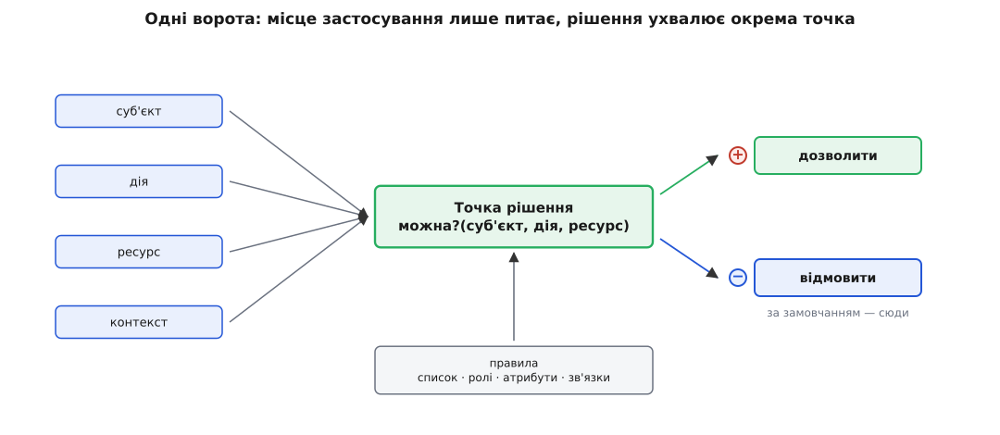
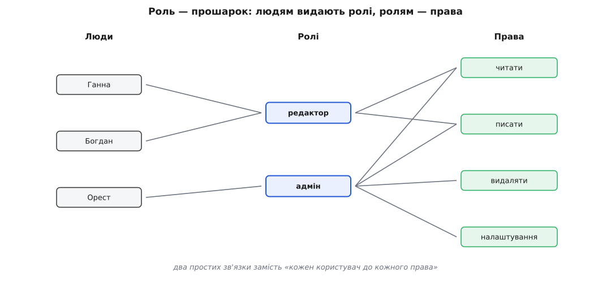
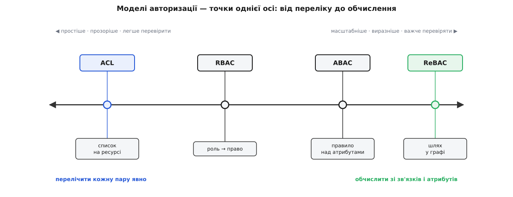

# Моделі авторизації

<preknowlist>
- [Автентифікація](topic:programming/authentication) — як сервер встановлює, ХТО зробив запит (пароль, жетон сесії). Авторизація починається там, де автентифікація вже назвала особу.
</preknowlist>

Автентифікація назвала ім'я того, хто постукав. Але знати ім'я — ще не пустити всередину: воротар мусить окремо вирішити, чи можна цій людині саме в цю кімнату. Це рішення й є авторизацією (від лат. *auctor* — той, хто надає право). Кожен бекенд на кожному запиті відповідає на одне питання: чи можна **цьому** суб'єктові виконати **цю** дію над **цим** ресурсом? Видалити клієнта #42, прочитати чужий рахунок, залити файл у чужу теку — усе це те саме питання з різними підставленими значеннями.

Наївна відповідь напрошується сама: розкидати перевірки просто там, де дія відбувається. `if (user.role === 'admin')` перед видаленням, ще один такий самий перед редагуванням, третій — у звіті. Спершу працює. Та коли правило «видаляти клієнтів може лише керівник відділу» треба поставити у двадцяти місцях, воно у двадцяти місцях і розійдеться: десь забули, десь написали інакше, а на питання «хто взагалі може видалити клієнта?» відповіді немає — лише grep по всьому коді. Дозвіл, розсіяний по місцях застосування, неможливо ні перевірити, ні змінити цілісно.

Звідси перший крок, спільний для всіх моделей: винести рішення в **одне** місце — функцію `можна?(суб'єкт, дія, ресурс)`, що повертає «так» або «ні». Тепер є одна точка правди. Місце застосування — той код, що збирається видалити клієнта, — лише питає цю функцію й кориться відповіді; саме рішення живе окремо.



*Кожен запит проходить крізь одні ворота: місце застосування лише питає, а рішення ухвалює окрема точка, звіряючись із правилами.*

Тепер справжнє питання: на що ця функція дивиться і де лежать її правила? Різні відповіді — це й є моделі авторизації. Вони не ворожі табори, а точки на одній осі: від «перелічити кожну пару» до «обчислити відповідь». І кожна народилася з болю свого часу — від матриці доступу початку 1970-х до системи Google для мільярдів перевірок; [коротка історія](topic:programming/authorization-models/hist-access-models.md) показує, який саме затор кожна з них розчищала.

**Список на ресурсі.** Найпряміший спосіб — почепити на кожен ресурс список: хто і що з ним може. Документ #42: Анна — читати й писати, Богдан — лише читати. Це список доступу (англ. *access control list*, ACL). Він очевидний і не бреше. Але має два болючі місця. Коли користувачів мільйон, а файлів мільйон, списки розростаються до неосяжного. І питання з іншого боку — «що взагалі може Анна?» — вимагає обійти геть усі ресурси й у кожному її пошукати. ACL добре працює в малому й тоне з масштабом.

**Прошарок ролей.** Полагодити це можна одним ходом — вставити прошарок. Користувач не отримує права напряму; він отримує роль (редактор, модератор, адміністратор), а вже роль несе набір прав. «Усе, що може редактор» описано один раз; прийняв людину — видав роль, а не п'ятдесят галочок; знялася потреба — забрав роль, і права зникли всі разом. Це рольова модель (англ. *role-based access control*, RBAC) — та сама, на якій тримається переважна більшість застосунків, і на ній вони й спиняються.

```ts
// одні ворота: рішення тут, а не розсіяне по місцях застосування
type Perm = `${string}:${string}`;                 // "client:delete"

const rolePerms: Record<string, Perm[]> = {
  manager:  ["client:delete", "client:read"],
  operator: ["client:read"],
};

function can(user: { roles: string[] }, perm: Perm): boolean {
  // deny-by-default: доки жодна роль не дала право — «ні»
  return user.roles.some(r => (rolePerms[r] ?? []).includes(perm));
}

// місце застосування лише питає й кориться:
if (!can(current, "client:delete")) throw new Forbidden();
```



*Прошарок ролей згортає зв'язок «кожен користувач до кожного права» у два простих: людям — ролі, ролям — права.*

Пастка ролей — їх розмноження: щойно знадобиться «редактор, але лише маркетингу, лише в робочі дні», починають плодити ролі на кшталт `editor-marketing-weekday`, і кількість вибухає.

**Правило над атрибутами.** Коли відповідь залежить від обставин, переліком уже не обійтися — її треба обчислювати. Правило пишуть над атрибутами суб'єкта, ресурсу й середовища: «керівник бачить документ, якщо `документ.відділ == користувач.відділ` і зараз робочий час». Це атрибутна модель (англ. *attribute-based access control*, ABAC). Одне правило накриває тисячу випадків, які переліком не задаси. Плата — питання «хто це може бачити?» стає важким (щоб відповісти, треба прогнати правило проти всіх), і про саму систему складніше міркувати.

**Шлях у графі.** Буває, дозвіл тягнеться за зв'язком: «ти можеш редагувати документ, якщо ти редактор теки, що його містить». Тоді відповідь — це прохід графом зв'язків: користувач → редактор теки → тека містить документ. Це модель на зв'язках (англ. *relationship-based access control*, ReBAC). Саме так влаштоване спільне користування у Google Drive — через систему Zanzibar, яку Google описав окремо 2019 року. Вона природна для вкладеного володіння й ділення доступом; плата — граф зв'язків, який треба зберігати й обходити на кожній перевірці. Сама перевірка зводиться до досяжності у графі — [як це виглядає в коді](topic:programming/authorization-models/proj-rebac-check.md), з обходом, циклами й межею глибини.



*Моделі — точки однієї осі: ліворуч кожну пару перелічують явно (просто, легко перевірити, погано масштабується), праворуч відповідь обчислюють з атрибутів і зв'язків (масштабно й виразно, але важче перевірити).*

Отже вибір — не «яка модель правильна», а де на цій осі стати. Ліворуч перелічуєш кожну пару явно: просто, і легко відповісти «хто що може», але масштабу не тягне. Праворуч обчислюєш відповідь з атрибутів і зв'язків: тягне масштаб і виражає багаті правила, та важче перевіряється й гірше піддається міркуванню. RBAC сидить усередині — дешевий прошарок, що накриває більшість потреб. І це не вибір навіки: реальна система зазвичай має RBAC у серці, а обставинні умови в дусі ABAC докручує зверху там, де без них не обійтися.

> 🔧 **Навіщо це.** Обрана модель визначає, чи буде питання «хто може видалити клієнта?» п'ятихвилинним запитом до однієї таблиці — чи grep-ом по всій кодовій базі. Це рішення ухвалюють рано, і воно формує, як росте вся система дозволів: почавши з розкиданих ACL-перевірок, до ролей і атрибутів потім доводиться мігрувати боляче, наживо.

Що б ти не обрав, дві речі переживають будь-яку модель. Перша — відмова за замовчанням: функція повертає «ні», доки якесь правило явно не сказало «так» ([найменші привілеї й deny-by-default](topic:programming/least-privilege)). Дозвіл за замовчанням — це діра, яку врешті знайдуть. Друга — рішення мусить ухвалюватися в одних воротах і лишати слід: [запис в аудит](topic:programming/audit-logging), що дає згодом відповісти «чому доступ дали о 14:03». Рішення, яке не можна відтворити, — це рішення, якому не можна довіряти.
