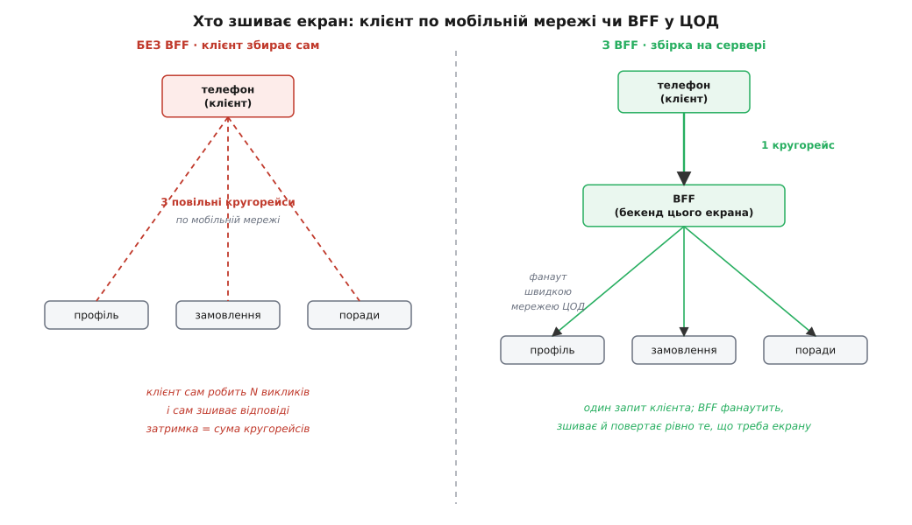
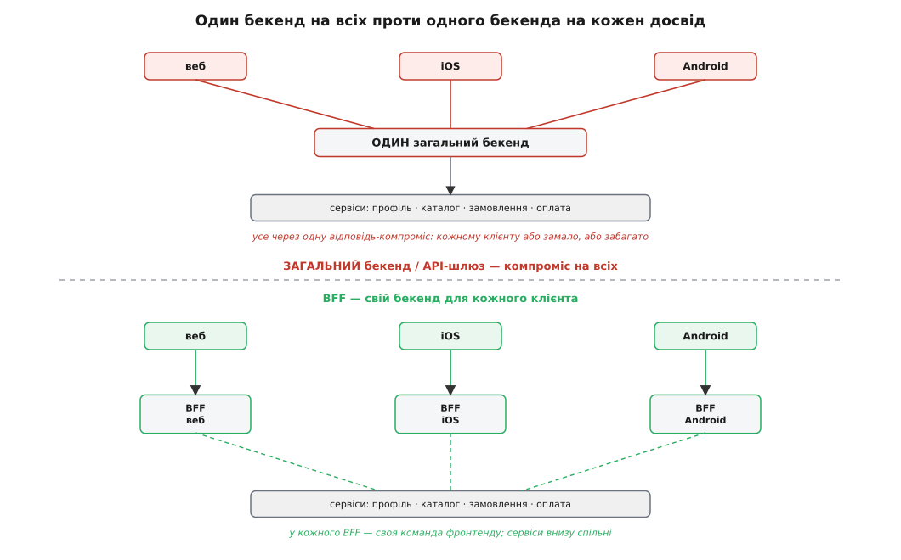
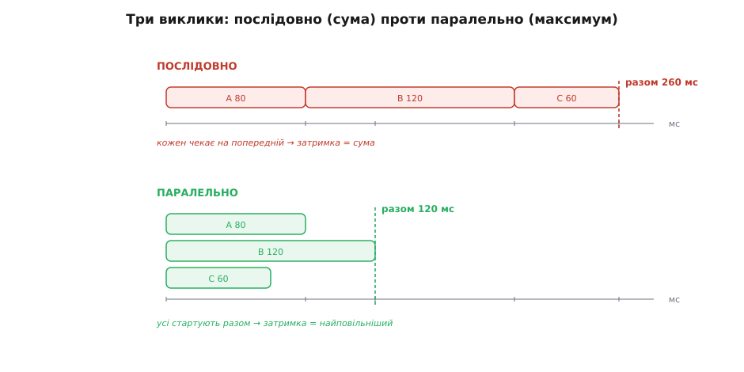

# BFF (backend-for-frontend)

<preknowlist>
- [REST](topic:programming/rest-api) — що таке HTTP-API: клієнт шле запит на адресу-ресурс, сервер відповідає даними (зазвичай JSON); саме через такі виклики фронтенд дістає все, що показує.
- [Мікросервіси](topic:programming/microservices) — коли систему розрізано на багато окремих сервісів (профіль, каталог, оплата), кожен зі своєю базою й своїм API; BFF з'являється саме тоді, коли даних для екрана доводиться збирати з кількох таких сервісів.
</preknowlist>

Уяви головний екран музичного застосунку на телефоні. Щоб намалювати його, треба зібрати докупи семеро різних речей: ім'я і аватар користувача, його плейлисти, останні прослухані треки, добірку порад на сьогодні, лічильник нових сповіщень, статус підписки. У великій системі кожна з цих речей живе у своєму сервісі: профіль в одному, плейлисти в другому, рекомендації в третьому. І телефон опиняється в незручному становищі — щоб зібрати один-єдиний екран, він мусить сходити по мережі до п'яти-шести різних місць.

Це болить одразу з двох боків. По-перше, **кожен виклик — окремий кругорейс** до сервера й назад, а мобільна мережа повільна й ненадійна: п'ять послідовних кругорейсів по кепському 4G — це вже помітна пауза, поки екран стоїть порожній. По-друге, сервіс профілю віддає **все, що знає** про користувача — сотню полів, — а екрану треба лише ім'я і аватар. Телефон качає через дорогий мобільний трафік купу зайвого, а тоді сам, на слабенькому процесорі, зшиває сім відповідей в одну картинку. Логіка «як саме виглядає головний екран» розмазана по клієнту, і на кожній платформі — iOS, Android, вебі — вона написана заново, трохи по-своєму.

Напрошується проста думка: а що, як поставити **між клієнтом і сервісами окремий сервер**, єдина робота якого — обслуговувати рівно цей застосунок? Клієнт зробить **один** виклик до нього; той сервер уже сам, сидячи в дата-центрі на швидкій внутрішній мережі, збігає до всіх потрібних сервісів, візьме з кожного лише те, що треба екрану, зшиє відповіді докупи й поверне телефону одну акуратну відповідь, скроєну точно під цей екран. Ось цей проміжний сервер і називають **BFF**.

**BFF** (англ. *backend-for-frontend* — «бекенд для фронтенду») — це серверний застосунок, зроблений на службу **одному конкретному фронтенду** (одному клієнтові — вебу, застосунку під iOS, застосунку під Android) і нікому іншому. *Фронтенд* (англ. *front end* — «передній край») — це те, що бачить і чіпає користувач: сторінка в браузері, екран мобільного застосунку. *Бекенд* (англ. *back end* — «задній край») — серверна частина за лаштунками. Звідси й назва: бекенд, приставлений до одного фронтенду й скроєний рівно під його потреби.

> 🔧 **Навіщо це.** Головна цінність, яку купують за BFF, — **фронтенд-команда дістає власний бекенд, який може міняти сама**. Раніше, щоб додати на екран новий блок, треба було просити чужу бекенд-команду переробити спільне API, ставати в чергу, узгоджувати. Тепер API головного екрана — це і є BFF цього застосунку, і його пише та сама команда, що малює екран. Змінюєш екран — тут-таки змінюєш його бекенд, в одному релізі, нікого не питаючи. За цю автономію все й затівається.

## Дві біди, які лікує BFF

Придивімося, що саме розв'язує ця проста ідея, бо бід тут рівно дві, і плутати їх не варто.

Перша — **балакучість** (chattiness). Без BFF клієнт сам оббігає багато сервісів, і кожен оббіг — повільний кругорейс по поганій мережі. Загальна затримка складається з усіх цих кругорейсів. BFF прибирає їх з очей клієнта: той робить один кругорейс до BFF, а всі решта походеньки — уже **всередині дата-центру**, де мережа в тисячі разів швидша й надійніша за мобільну. П'ять повільних кругорейсів клієнта перетворюються на один повільний (клієнт→BFF) плюс п'ять дешевих (BFF→сервіси).

Друга — **компроміс універсального API**. Одне спільне API, яке обслуговує всіх одразу, приречене бути ні для кого не ідеальним. Просторий екран у браузері радо бере багато даних за раз; ощадливий мобільний застосунок на слабкій мережі хоче якнайменше. Одне API не вгодить обом: зробиш щедрим — мобільний качає зайве; зробиш ощадливим — веб довантажує решту докликами. BFF знімає це протиріччя, бо він **не універсальний**: він скроєний під один клієнт і віддає йому рівно ту форму даних, яку той хоче, — не більше й не менше.



*Без BFF затримка екрана — це сума багатьох кругорейсів клієнта по повільній мережі. З BFF клієнт платить за один кругорейс, а збірку з багатьох сервісів BFF робить у себе, на швидкій внутрішній мережі, і повертає рівно те, що потрібно екрану.*

## BFF — це не API-шлюз

Тут легко сплутати BFF із сусідньою штукою, тож розберімо різницю прямо, бо вона — суть патерну. [API-шлюз](topic:programming/api-gateway) — це теж єдина точка входу перед купою сервісів, теж посередник. Але шлюз **один на всіх**: усі клієнти — і веб, і мобільний, і сторонні партнери — ходять крізь той самий шлюз, і його робота узагальнена й спільна: перевірити токен, полічити ліміти запитів, залогувати, спрямувати виклик у потрібний сервіс. Він навмисне **не знає** про конкретні екрани — він нейтральний трубопровід для всіх.

BFF — навпаки, **свій для кожного досвіду**. Не один бекенд на всіх, а **один бекенд на кожен фронтенд**: окремий BFF для вебу, окремий для iOS, окремий для Android. І він якраз **знає** про свої екрани все — знає, що головний екран мобільного застосунку хоче саме ці шість полів у саме такій формі, — бо для того й існує. Сформулювати можна одним гаслом, під яким цей патерн і розійшовся: *один досвід — один бекенд*.



*Загальний бекенд чи API-шлюз (угорі) — один на всіх, тож його відповідь завжди компроміс: комусь у ній забагато, комусь замало. BFF (унизу) заводиться по одному на кожен клієнт, і кожен віддає своєму фронтенду рівно потрібну форму; спільні бізнес-сервіси при цьому одні на всіх.*

Ці двоє не конкурують, а часто стоять поряд: спільний шлюз бере на себе загальне (автентифікацію, ліміти), а за ним у кожного клієнта — свій BFF, що ліпить дані під його екрани. Одне про спільну сантехніку, друге — про форму даних для конкретного фронтенду.

## Хто володіє BFF

Найважливіше в цьому патерні — навіть не техніка, а **межа відповідальності**, і саме вона робить BFF тим, чим він є. BFF належить **тій самій команді, що робить фронтенд**, а не окремій бекенд-команді. Це не дрібниця розподілу праці, а серце ідеї.

Причина проста. Екран і його BFF змінюються **синхронно**: додаєш на екран новий блок — тобі одразу треба, щоб BFF почав віддавати для нього дані. Якщо екран пише одна команда, а його бекенд — інша, кожна така зміна перетворюється на переговори між двома командами і два узгоджені релізи. А коли і екран, і його BFF в одних руках, зміна робиться в одному місці, в один захід: команда сама вирішує, яка форма даних їй зручна, сама її й реалізує. Зчеплення між екраном і його даними нікуди не зникло — але воно **замкнулося всередині однієї команди**, де його легко тримати в голові, замість того щоб тягтися через межу між командами, де воно найдорожче.

Звідси й головне обмеження здорового BFF: він служить **вузькому колу** клієнтів — в ідеалі одному. Щойно один BFF починають ділити між вебом і мобільним «щоб не дублювати», у нього знову два господарі з різними бажаннями, і він знову сповзає в універсальний компроміс, від якого тікали. Ціна такого сповзання — тихе повернення старої біди, тому межу «один досвід — один BFF» бережуть свідомо.

Народився цей патерн не за столом теоретика, а з конкретного болю — команда SoundCloud виповзала з моноліту до мобільного застосунку по кепських мережах; звідти й назва, і саме гасло. Ця історія — [як BFF з'явився в SoundCloud](topic:programming/bff-pattern/hist-soundcloud-bff.md) — коротка й повчальна: видно, що патерн виріс із реальної потреби, а не з бажання додати ще один шар.

## Серце BFF: зібрати з багатьох, віддати одне

Уся робота BFF — це **збірка** (aggregation): сходити до кількох сервісів, узяти з кожного потрібне й скласти одну відповідь. І тут ховається головна тонкість, від якої залежить, буде BFF швидким чи повільним.

Викликати сервіси можна двома способами. **Послідовно**: спитати профіль, дочекатися відповіді, тоді спитати замовлення, дочекатися, тоді поради. Затримка складеться в **суму** всіх трьох. **Паралельно**: пустити всі три запити одночасно і чекати, доки повернеться найповільніший. Затримка дорівнюватиме **максимуму** — часу однієї найдовшої відповіді, а не сумі. Оскільки виклики незалежні (поради не залежать від профілю), паралельний спосіб — єдиний розумний: він перетворює суму на максимум.



*Послідовно затримка — сума викликів (80 + 120 + 60 = 260 мс). Паралельно всі стартують разом, і загальний час — це найповільніший із них (120 мс). Незалежні виклики BFF завжди пускає паралельно.*

Ось як цей паралельний фанаут (англ. *fan-out* — «розсил віялом», коли один запит розгалужується на багато паралельних) виглядає в коді BFF головного екрана. BFF найчастіше пишуть на Node.js — тією самою мовою, що й фронтенд, тож ним і володіє фронтенд-команда:

```ts
// BFF-ендпоінт головного екрана: усе за один запит клієнта
app.get("/home", async (req, res) => {
  const uid = req.user.id;

  // три виклики СТАРТУЮТЬ ОДНОЧАСНО, а не один за одним;
  // allSettled — щоб один провал не зірвав решту
  const [profile, orders, recs] = await Promise.allSettled([
    fetch(`http://profile/users/${uid}`).then(r => r.json()),
    fetch(`http://orders/users/${uid}/recent`).then(r => r.json()),
    fetch(`http://recs/users/${uid}/today`).then(r => r.json()),
  ]);

  // BFF віддає екрану рівно його форму — не сирі відповіді сервісів
  res.json({
    name:   profile.status === "fulfilled" ? profile.value.name  : "друже",
    orders: orders.status  === "fulfilled" ? orders.value.items  : [],
    recs:   recs.status    === "fulfilled" ? recs.value.list     : null,
  });
});
```

> 🔧 **Навіщо це.** `Promise.allSettled` замість послідовних `await` — це не стильова примха, а прямий виграш у затримці: три виклики по 80, 120 і 60 мс послідовно дадуть 260 мс порожнього екрана, а паралельно — 120 мс. Для мобільного застосунку ця різниця відчутна на дотик. Але паралельний фанаут має і зворотний бік: що ширше BFF розсипає виклики, то вища ймовірність, що бодай один із них цього разу відповість повільно, — і чекати доведеться саме на нього. Чому широкий фанаут **підсилює** повільний хвіст і скільки насправді можна фанаутити, розібрано в [математиці хвостової затримки](topic:programming/bff-pattern/math-tail-latency-fanout.md).

Друга половина цього коду — не менш важлива за паралельність. `allSettled` (на відміну від `all`) **не зривається**, коли один із викликів упав: він дочекається всіх і про кожен скаже, вдався той чи ні. Це дає BFF змогу **деградувати з гідністю** — зібрати екран із того, що є, замість показати порожнечу. Профіль відповів, а сервіс порад лежить? Покажемо ім'я, плейлисти й замовлення, а блок порад просто сховаємо — користувач майже не помітить. Це загальний принцип стійкості, [деградація з гідністю](topic:programming/graceful-degradation): втратити другорядне, але вціліти головним. BFF — природне місце, де ця деградація живе, бо саме він вирішує, що на екрані критичне, а що — окраса.

Щоб один млявий сервіс не тримав увесь екран заручником, кожному викликові BFF ставить **дедлайн**: не відповів за умовлений час — вважаємо, що даних немає, і йдемо далі з тим, що встигло прийти. Без такого [бюджету часу](topic:programming/timeouts-deadlines) один завислий виклик підвісив би весь екран — рівно те, від чого BFF мав би рятувати. Дедлайн перетворює «зависання» на звичайну відсутність необов'язкових даних.

Повний робочий BFF — з паралельним фанаутом, дедлайнами, деградацією й скроюванням відповіді під екран, на кількох мовах — розібрано покроково у вставці-проєкті: [збірний BFF головного екрана](topic:programming/bff-pattern/proj-aggregation-bff.md).

## BFF і безпека: тримати таємниці подалі від браузера

Є ще одна робота, заради якої BFF заводять навіть тоді, коли збирати особливо нема чого, — **безпека токенів**. Односторінковий застосунок у браузері, який сам ходить до API, мусить десь тримати [токен доступу](topic:programming/authentication) — перепустку, якою він доводить сервісам, хто він; а все, що лежить у браузері, дістає ворожий скрипт, якщо на сторінку пролізе чужий код. Викравши токен, зловмисник діє від імені користувача.

BFF розриває це коло. Токени тримає **він**, на сервері, куди браузерний скрипт не дотягнеться. Браузерові дістається лише звичайна серверна [сесія — httpOnly-кука](topic:programming/session-management), яку сам JavaScript навіть не може прочитати. Клієнт шле запити на свій BFF із цією кукою; BFF упізнає сесію, підставляє схований у себе токен і йде до сервісів уже від імені користувача. Секрет ніколи не потрапляє в браузер — а отже, його звідти й не вкрасти. Цей спосіб так і звуть — BFF-патерн автентифікації, і для сучасних вебзастосунків це одна з головних причин завести BFF навіть без жодної збірки.

## Ціна й межа: коли BFF зайвий

BFF — це обмін, а не безумовне добро, і чесно назвати ціну обов'язково.

Найперше — **це ще один застосунок**, який хтось пише, розгортає, стежить за ним, лагодить о третій ночі. На кожен клієнт — свій BFF, тож замість одного бекенда їх стає три-чотири, і кожен додає роботи. Друге — **дублювання**: логіка, спільна для всіх клієнтів («що взагалі означає активна підписка»), норовить розповзтися копіями по всіх BFF. Лінія оборони проста, але її треба свідомо тримати: у BFF живе **лише скроювання під конкретний екран**, а спільні бізнес-правила лишаються глибше, у самих сервісах, куди всі BFF по них ходять. BFF, що переріс своє й почав вирішувати бізнес-логіку, — це вже не BFF, а другий прихований бекенд.

Найгірший різновид — **BFF-пустушка**, який нічого не збирає й нічого не кроїть, а лише переспрямовує кожен виклик один-в-один далі. Такий шар додає ще один кругорейс і ще одне місце для поломки, не даючи натомість нічого. Якщо клієнт розмовляє з єдиним сервісом і бере рівно те, що той віддає, — BFF йому ні до чого.

Є й інша відповідь на ту саму біду балакучості й компромісу — [GraphQL](topic:programming/graphql), де клієнт сам одним запитом описує, яку форму даних він хоче, і сервер точно її повертає. Там форму даних кроїть сам клієнт своїм запитом, а не окремий бекенд під нього; у BFF же її кроїть сервер. Обидва шляхи ведуть до однієї мети — віддати екрану рівно потрібне за один виклик, — і вибір між ними залежить від того, чи хоче фронтенд-команда володіти власним сервером-збирачем, чи їй зручніше описувати запити на боці клієнта.

Звідси й простий орієнтир, коли BFF доречний. Він виправдовує себе, коли **один екран збирається з багатьох сервісів**, або коли **різні клієнти хочуть помітно різну форму даних**, або коли **фронтенд-команда хоче володіти своїм API** й котити його синхронно з екранами, або коли **токени треба тримати подалі від браузера**. Немає жодного з цих чотирьох — немає й приводу заводити зайвий шар. BFF — не ознака зрілої архітектури, а точкова відповідь на конкретну незручність між фронтендом і роздробленим бекендом.
