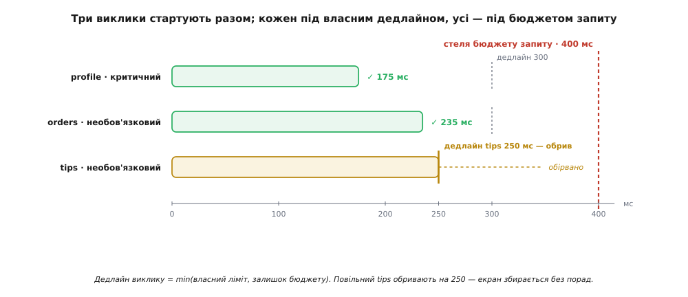
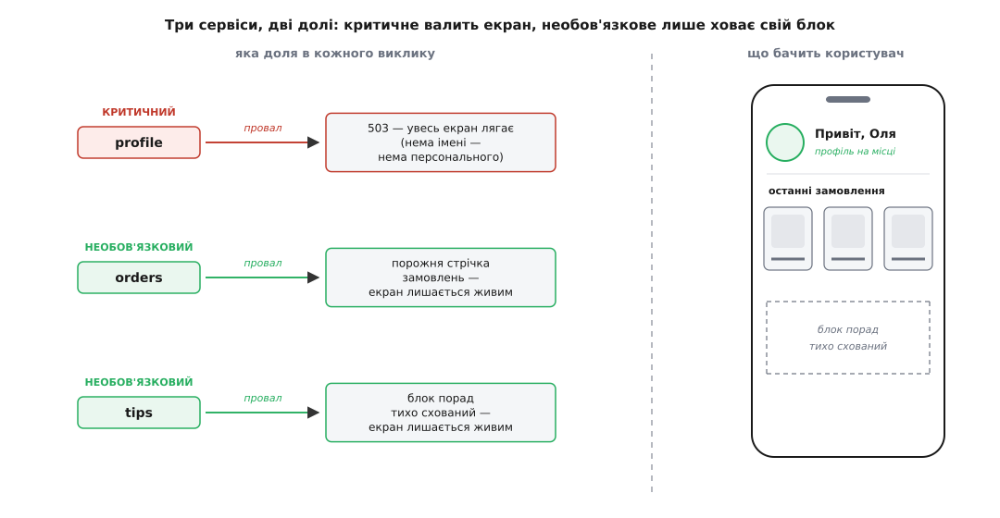

# 🧩 Збірний BFF головного екрана: повний код

Одна річ — сказати «BFF паралельно збігає до сервісів, деградує з гідністю й кроїть відповідь під екран». Зовсім інша — написати цей ендпоінт так, щоб він не завис від одного млявого сервіса, не задушив сам себе відкриттям тисячі сокетів і не показав користувачеві порожній екран через те, що впав другорядний блок порад. Тут ми зберемо такий ендпоінт цілком, рядок за рядком, двома мовами, а тоді розберемо шість пасток, у які на цьому шляху падають чи не всі.

## Що саме будуємо

Головний екран застосунку показує три речі. Угорі — **шапка**: ім'я користувача й аватар. Нижче — стрічка **останніх замовлень** (три картки). Ще нижче — блок **порад на сьогодні**. Кожна річ живе у своєму сервісі: `profile`, `orders`, `tips`. Клієнт робить один виклик `GET /home`, а весь клопіт збірки — наш.

Ключове рішення, яке визначає всю поведінку ендпоінта, — поділ на **критичне** й **необов'язкове**. Без імені та аватара персонального головного екрана просто немає: якщо `profile` не відповів, показувати нічого, і чесна відповідь — «спробуй за мить» (503). А от замовлення й поради — це блоки: впав `orders` — покажемо шапку без стрічки; впав `tips` — сховаємо блок порад. Екран лишається живим, просто трохи біднішим. Цей поділ — не технічна дрібниця, а бізнес-рішення про те, що на екрані каркас, а що оздоба; робить його та сама команда, що малює екран, і саме тому він живе тут, у BFF.

Отже, контракт ендпоінта:

```
GET /home  →  200 { greeting, avatarUrl, orders[], tips|null, degraded }
              503 { error: "home_unavailable" }   // впав profile
```

Три обмеження, які треба втримати одночасно: виклики йдуть **паралельно** (затримка = найповільніший, а не сума); у кожного свій **дедлайн**, щоб один завислий сервіс не тримав екран заручником; і над усім — **спільний бюджет** на весь запит, бо клієнтові байдуже, чому саме він чекає, — йому важлива тільки повна пауза.

## Кістяк рішення

Перш ніж занурюватися в код, варто побачити його форму — чотири рухи, і жоден не зайвий.

Перший — **спільний HTTP-клієнт із пулом з'єднань**, заведений один раз на весь процес, а не на кожен запит. Кожне нове TCP-з'єднання до сервіса — це рукостискання (а з TLS — ще й криптографічне), десятки мілісекунд на порожньому місці. Пул тримає з'єднання теплими й позичає їх наступним викликам.

Другий — **фанаут із дедлайном на кожен виклик**. Три запити стартують одночасно; кожному дано власний ліміт часу, після якого ми вважаємо, що даних немає, і йдемо далі.

Третій — **збірка, що переживає часткові провали**. У TypeScript це `Promise.allSettled` (дочекатися всіх, про кожен сказати «вдався/впав»), у Go — `errgroup`, але з хитрістю: провал необов'язкового виклику мусимо проковтнути, щоб він не скасував братів.

Четвертий — **скроювання під екран**. Ми не віддаємо сирі відповіді сервісів; ми будуємо рівно ту форму, яку малює екран, і вставляємо заглушки там, де необов'язкове не прийшло.

## Повний код

Нижче — той самий ендпоінт двома мовами. **TypeScript/Node** — найприродніша для BFF: та сама мова, що й фронтенд, а `async/await` + `Promise.allSettled` + `AbortSignal` лягають на задачу як улиті. **Go** бере те саме через `errgroup` і `context.WithTimeout` — це варіант, коли BFF хочуть тримати на компільованій мові з дешевими горутинами.

:::tabs
```ts
import express from "express";
import { Agent, setGlobalDispatcher } from "undici";

// ── Пул з'єднань: ОДИН на весь процес, а не сокет на кожен виклик ──
setGlobalDispatcher(new Agent({
  connections: 128,           // стеля одночасних сокетів НА КОЖЕН хост
  keepAliveTimeout: 60_000,   // тримати з'єднання теплим між викликами
  keepAliveMaxTimeout: 600_000,
}));

const OVERALL = 400;   // весь запит клієнта має вкластися в 400 мс
const PER_PROFILE = 300, PER_ORDERS = 300, PER_TIPS = 250;

// Один крок фанауту: GET-JSON з дедлайном. Кидає, якщо не встиг чи не 2xx.
async function getJSON<T>(url: string, signal: AbortSignal): Promise<T> {
  const r = await fetch(url, { signal, headers: { accept: "application/json" } });
  if (!r.ok) throw new Error(`${url} → ${r.status}`);
  return r.json() as Promise<T>;
}

const app = express();

app.get("/home", async (req, res) => {
  const uid = (req as any).user.id;

  // спільний бюджет на ВЕСЬ запит — стеля, під якою живуть усі виклики
  const budget = AbortSignal.timeout(OVERALL);        // Node 17.3+
  // дедлайн виклику = min(власний ліміт, залишок бюджету запиту)
  const dl = (ms: number) =>
    AbortSignal.any([budget, AbortSignal.timeout(ms)]); // Node 20+

  // три виклики СТАРТУЮТЬ РАЗОМ; allSettled не зірветься від одного провалу
  const [profile, orders, tips] = await Promise.allSettled([
    getJSON<Profile>(`http://profile/users/${uid}`,              dl(PER_PROFILE)),
    getJSON<Order[]>(`http://orders/users/${uid}/recent?limit=3`, dl(PER_ORDERS)),
    getJSON<Tip[]>(`http://tips/users/${uid}/today`,             dl(PER_TIPS)),
  ]);

  // profile — КРИТИЧНИЙ: без нього персонального екрана немає
  if (profile.status === "rejected") {
    return res.status(503).json({ error: "home_unavailable" });
  }

  // orders і tips — НЕОБОВ'ЯЗКОВІ: провал ховає блок, екран лишається
  res.json(shapeHome(profile.value, orders, tips));
});

// ── Скроювання: будуємо РІВНО форму екрана, не сирі відповіді сервісів ──
function shapeHome(
  p: Profile,
  orders: PromiseSettledResult<Order[]>,
  tips: PromiseSettledResult<Tip[]>,
) {
  const ok = <T>(r: PromiseSettledResult<T>) => r.status === "fulfilled";
  return {
    greeting:  p.displayName,               // рівно те, що малює шапка
    avatarUrl: p.avatar?.small ?? null,
    orders: ok(orders)
      ? orders.value.map(o => ({ id: o.id, title: o.title, thumb: o.image }))
      : [],                                  // впав — порожня стрічка
    tips: ok(tips)
      ? tips.value.slice(0, 5).map(t => ({ id: t.id, text: t.text }))
      : null,                                // null → клієнт ховає секцію
    degraded: !ok(orders) || !ok(tips),      // натяк клієнту: щось не догрузилось
  };
}
```
```go
package main

import (
	"context"
	"encoding/json"
	"fmt"
	"net/http"
	"time"

	"golang.org/x/sync/errgroup"
)

// ── Пул з'єднань: ОДИН клієнт на весь процес → спільний keep-alive ──
var httpClient = &http.Client{
	Transport: &http.Transport{
		MaxIdleConns:        256,
		MaxIdleConnsPerHost: 64, // за замовчуванням лише 2 — задушить фанаут!
		IdleConnTimeout:     90 * time.Second,
	},
}

const overall = 400 * time.Millisecond // бюджет на весь запит

// Один крок фанауту: GET-JSON у наданому контексті (з нього ж і дедлайн).
func getJSON[T any](ctx context.Context, url string) (T, error) {
	var out T
	req, _ := http.NewRequestWithContext(ctx, http.MethodGet, url, nil)
	req.Header.Set("Accept", "application/json")
	resp, err := httpClient.Do(req)
	if err != nil {
		return out, err
	}
	defer resp.Body.Close()
	if resp.StatusCode/100 != 2 {
		return out, fmt.Errorf("%s → %d", url, resp.StatusCode)
	}
	return out, json.NewDecoder(resp.Body).Decode(&out)
}

func homeHandler(w http.ResponseWriter, r *http.Request) {
	uid := userID(r)

	// спільний бюджет на весь запит; cancel звільняє ресурси при виході
	ctx, cancel := context.WithTimeout(r.Context(), overall)
	defer cancel()

	// кожна горутина пише у СВОЮ змінну (різні комірки → без гонитви),
	// читаємо їх ПІСЛЯ g.Wait() — він дає бар'єр «сталося-до»
	var (
		profile            Profile
		orders             []Order
		tips               []Tip
		ordersErr, tipsErr error
	)

	g, gctx := errgroup.WithContext(ctx)

	// КРИТИЧНИЙ виклик: його помилка йде В ГРУПУ → скасує решту й дасть 503
	g.Go(func() error {
		cctx, c := context.WithTimeout(gctx, 300*time.Millisecond) // min(бюджет, 300)
		defer c()
		p, err := getJSON[Profile](cctx, profileURL(uid))
		profile = p
		return err
	})

	// НЕОБОВ'ЯЗКОВІ: помилку КОВТАЄМО (return nil), щоб не скасувати братів
	g.Go(func() error {
		cctx, c := context.WithTimeout(gctx, 300*time.Millisecond)
		defer c()
		orders, ordersErr = getJSON[[]Order](cctx, ordersURL(uid, 3))
		return nil
	})
	g.Go(func() error {
		cctx, c := context.WithTimeout(gctx, 250*time.Millisecond)
		defer c()
		tips, tipsErr = getJSON[[]Tip](cctx, tipsURL(uid))
		return nil
	})

	// Wait поверне лише помилку КРИТИЧНОГО виклику (або nil)
	if err := g.Wait(); err != nil {
		http.Error(w, `{"error":"home_unavailable"}`, http.StatusServiceUnavailable)
		return
	}

	writeJSON(w, shapeHome(profile, orders, ordersErr, tips, tipsErr))
}

// ── Скроювання: будуємо РІВНО форму екрана ──
func shapeHome(p Profile, orders []Order, oErr error, tips []Tip, tErr error) Home {
	h := Home{Greeting: p.DisplayName, AvatarURL: p.Avatar.Small}
	if oErr == nil {
		for _, o := range orders { // впав — стрічка лишиться порожньою
			h.Orders = append(h.Orders, Card{ID: o.ID, Title: o.Title, Thumb: o.Image})
		}
	}
	if tErr == nil {
		h.Tips = &[]TipView{} // непорожній вказівник → секція є навіть без порад
		for _, t := range tips {
			*h.Tips = append(*h.Tips, TipView{ID: t.ID, Text: t.Text})
		}
	} // tErr != nil → h.Tips лишається nil → клієнт ховає секцію
	h.Degraded = oErr != nil || tErr != nil
	return h
}
```
:::

Прочитаймо, що тут насправді відбувається, бо кожен рядок — рішення.

**Бюджет над викликами.** У TypeScript `budget` — це один сигнал на 400 мс, створений на самому початку. Кожен виклик дістає свій дедлайн через `AbortSignal.any([budget, timeout(ms)])` — сигнал, що спрацює, щойно спрацює **будь-який** із двох. Виходить рівно `min(власний ліміт, залишок бюджету)`: жоден виклик не проживе довше за свій ліміт і водночас жоден не переживе спільну стелю. У Go те саме дає деривація контекстів: `cctx` росте з `gctx`, а той — з `ctx` на 400 мс, тож скасування батька миттю доходить до дитини, і дедлайн кожного виклику виходить тим самим мінімумом.

**Чому саме `allSettled`, а не `all`.** `Promise.all` зривається на першому ж провалі й викидає решту результатів — рівно те, чого нам не треба: впав `tips`, а ми втратили ще й готові `profile` та `orders`. `allSettled` дочікує всіх і про кожен чесно каже, вдався чи ні. Тільки так можна ухвалити зважене рішення «критичне впало — 503; необов'язкове впало — заглушка».



*Виклики стартують одночасно, кожен під власним дедлайном, і всі — під спільною стелею бюджету запиту (400 мс). Повільний необов'язковий `tips` обривають на його ліміті 250 мс; це не валить екран — блок порад просто ховається. Дедлайн кожного виклику — це min(власний ліміт, залишок бюджету).*

**Пастка братовбивства в Go.** `errgroup.WithContext` дає групі спільний контекст, який **скасовується на першій же горутині, що повернула не-nil помилку**. Це чудово для критичного `profile`: впав — решту негайно скасовано (все одно йдемо в 503, нема чого чекати). Але для необов'язкових це була б катастрофа: провал `tips` скасував би `profile` й `orders`, і замість деградації ми дістали б повний обвал. Тому необов'язкові горутини **завжди повертають `nil`**, а свою помилку ховають у локальну `ordersErr`/`tipsErr`. У групу йде лише помилка критичного виклику — і `g.Wait()` повертає саме її.

## Скроювання під форму екрана

`shapeHome` — то не косметика, а половина сенсу BFF. Сервіс `profile` знає про користувача сотню полів: дату народження, налаштування приватності, історію змін пароля. Екранові з усього цього треба двоє: `displayName` і маленький аватар. Якби BFF віддав сиру відповідь `profile`, ми б протягли крізь мобільну мережу купу зайвого, розкрили клієнтові внутрішню форму сервіса (і прив'язали б її до екрана: змінить `profile` схему — зламається застосунок) і змусили б слабенький телефон вибирати потрібне самому.

Тому BFF будує **власний DTO** рівно під екран: `greeting`, `avatarUrl`, три вкорочені картки замовлень, до п'яти порад. Форма відповіді — це і є API головного екрана, і володіє ним команда екрана. Тут-таки живе й **мова деградації**: порожня стрічка `orders: []` проти відсутнього блоку `tips: null` — це домовленість між BFF і клієнтом про те, як виглядає «даних нема». Прапорець `degraded` дозволяє показати делікатний натяк «частина не догрузилась», не ламаючи екран.

Загальний принцип, окрема стаття — [деградація з гідністю](topic:programming/graceful-degradation): вціліти головним, пожертвувавши другорядним. BFF — природний дім цього принципу, бо саме він, і ніхто інший, знає, що на цьому екрані каркас, а що оздоба.



*Провал критичного `profile` валить увесь екран у 503 — персонального головного без імені не буває. Провал необов'язкових `orders`/`tips` лише прибирає свій блок; екран лишається живим. Праворуч — саме такий деградований екран: шапка й замовлення на місці, блок порад тихо схований.*

## Складність і пастки

Робочий каркас у нас є. Тепер — шість місць, де цей каркас найчастіше тріщить, бо кожне з них коштувало комусь нічного інциденту.

**N+1 усередині BFF.** Найпідступніша пастка, бо ховається за фасадом «швидкої внутрішньої мережі». Спокуса така: взяти список замовлень, а тоді в циклі сходити по деталі кожного:

```ts
const list = await getJSON<Order[]>(`http://orders/users/${uid}/recent`, dl(300));
// ПАСТКА: N окремих кругорейсів у циклі
const full = await Promise.all(
  list.map(o => getJSON<OrderDetail>(`http://orders/${o.id}`, dl(300)))
);
```

Один виклик обернувся на 1 + N. Хай навіть внутрішня мережа швидка — сто послідовних (чи навіть паралельних, але сотнями) дрібних викликів топлять і BFF, і сервіс замовлень. Ліки — **питати гуртом**: щоб сервіс віддавав достатньо вже в списковому виклику (`?limit=3` з потрібними полями) або мав пакетний ендпоінт `GET /orders?ids=1,2,3`. Саме тому в нашому коді стоїть `recent?limit=3` — деталі приходять одразу, циклу докликів немає. Загальна дисципліна «збери запити у пакет замість розсипу дрібних» — [стратегії фанауту](topic:programming/fan-out-strategies).

**Спільний клієнт і пул з'єднань.** Створювати новий HTTP-клієнт (а з ним — нове з'єднання) на кожен виклик — значить платити рукостисканням TCP і TLS щоразу, а під навантаженням ще й засипати систему сокетами в стані `TIME_WAIT`, аж поки не скінчаться порти. Тому клієнт — **один на процес**, зі спільним пулом теплих keep-alive-з'єднань. І тут чигає тихий убивця продуктивності Go: у стандартного `http.Transport` межа `MaxIdleConnsPerHost` за замовчуванням дорівнює **2**. Тобто хоч загалом можна тримати сотню теплих з'єднань, до одного хоста — лише два; решта фанауту щоразу відкриває з'єднання наново, і ти дивуєшся, чому «швидка внутрішня мережа» раптом гальмує. Ось чому в коді Go ми піднімаємо `MaxIdleConnsPerHost` явно.

За цим ховається й глибша думка: один спільний пул на всі сервіси означає, що повільний сервіс, який тримає з'єднання довго, здатен **вичерпати пул** і поголодоморити виклики до решти сервісів. Захист — окремі межі (чи окремі пули) на кожну залежність, щоб біда одного сусіда не перекидалася на інших; це той самий принцип [ізоляції відсіками](topic:programming/bulkhead-isolation), що й водонепроникні перебірки в корпусі корабля.

**Бюджет: на весь запит проти на виклик.** Дедлайн на кожен виклик окремо — необхідний, але не достатній. Уяви: три виклики по 300 мс, і кожен вклався — та якщо між ними є залежність (другий виклик потребує відповіді першого), сумарно набіжить 600 мс, а клієнт уже давно втратив терпець. Тому над окремими дедлайнами мусить стояти **стеля на весь запит**, і дедлайн кожного виклику — це `min(власний ліміт, залишок спільного бюджету)`. У нашому коді це виходить само собою: усі per-call дедлайни зроблено з одного `budget`-сигналу (TS) чи одного `ctx` на 400 мс (Go), тож виклик, пущений пізніше за інших, автоматично дістане лише **залишок** часу, а не свіжі повні 300 мс. Ця арифметика часу — окрема тема: [таймаути і бюджет часу](topic:programming/timeouts-deadlines).

**Кеш зібраної відповіді.** Спокусливо кешувати готову відповідь `/home` — і іноді слушно, та обережність тут коштовна з двох причин. По-перше, відповідь **персональна**: ключ кешу мусить містити `uid`, інакше один користувач побачить чужий екран — найгірший різновид витоку. По-друге, у зібраному блобі змішано дані з **різною свіжістю**: замовлення міняються рідко, поради — раз на день, а лічильник сповіщень мусить бути свіжим завжди. Кешувати все гамузом означає або показувати черстві сповіщення, або марно викидати кеш щохвилини. Часто мудріше кешувати **фрагменти по сервісах** із власним TTL у кожного, а не весь склеєний екран. І пам'ятай про [навалу на кеш](topic:programming/cache-stampede): коли популярний ключ протухає, сотні запитів разом промахуються й гуртом б'ють по сервісах — рятує коалесування (один похід за даними на всіх, хто чекає) або короткий TTL із фоновим оновленням. Ширше про підходи — [стратегії кешування](topic:programming/caching-strategies).

**Ретраї лише ідемпотентних GET.** Коли виклик відпав через мережеве гикання чи таймаут, кортить повторити — і для наших трьох викликів це безпечно, бо всі троє — `GET`, тобто [ідемпотентні за контрактом](topic:programming/api-idempotency): повтори читання нічого не псують. Але сліпо навісити ретрай на все — прямий шлях до біди: повторити `POST «оформити замовлення»`, який насправді дійшов, а просто відповідь загубилась, — значить оформити двічі й списати гроші двічі. Правило залізне: **автоматично повторюємо лише ідемпотентні читання**; будь-який запис, що його BFF пересилає далі, або несе ключ ідемпотентності, або не повторюється зовсім. І ще двоє застережень до ретраїв: повтор мусить уміститися в **залишок бюджету** (немає сенсу починати другу спробу, коли на весь запит лишилось 20 мс), а самі повтори — розкидувати випадковою затримкою (джитером), щоб тисяча клієнтів не кинулася повторювати синхронно й не влаштувала лавину. Механіка — [повтори з відступом](topic:programming/retries-backoff).

**Ширина фанауту й хвіст затримки.** Остання, найтонша. Що ширше BFF розсипає паралельні виклики, то вища ймовірність, що бодай **один** цього разу відповість повільно, — а чекати доведеться саме на нього, бо загальний час дорівнює найповільнішому. Три виклики це ще прощають; двадцять — уже майже гарантований повільний хвіст на кожному запиті. Тому фанаут тримають вузьким, повільним необов'язковим дають коротший дедлайн (у нас `tips` — 250 мс проти 300 у решти), а критичний шлях роблять якомога тоншим. Коли ж фанаут широкий за потребою, повільний хвіст приборкують хеджованими запитами — пускають дублікат до повільної репліки й беруть, хто перший.

Оце і є збірний BFF у повний зріст: один клієнтський виклик, паралельний фанаут під спільним бюджетом, критичне проти необов'язкового, відповідь, скроєна рівно під екран, — і шестеро вартових, що стережуть його від N+1, голодомору пулу, розповзання таймаутів, отруйного кешу, небезпечних ретраїв і повільного хвоста. Прибери бодай одного вартового — і тихого інциденту чекати недовго.
