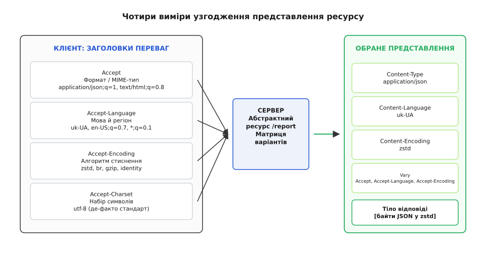
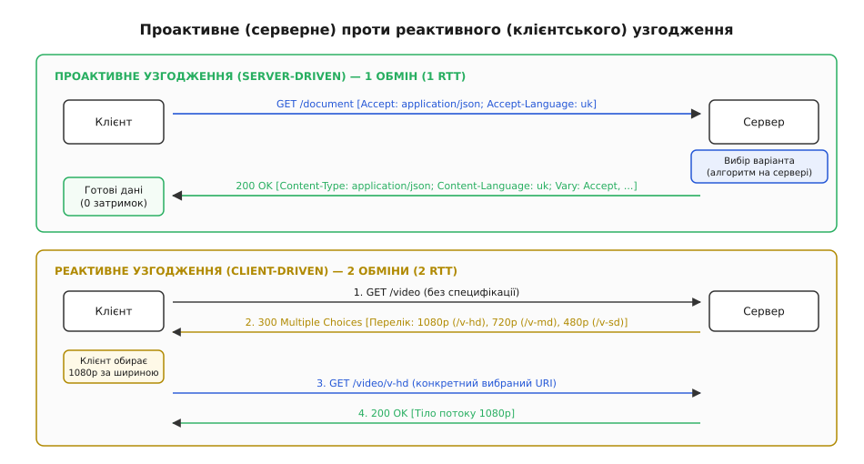
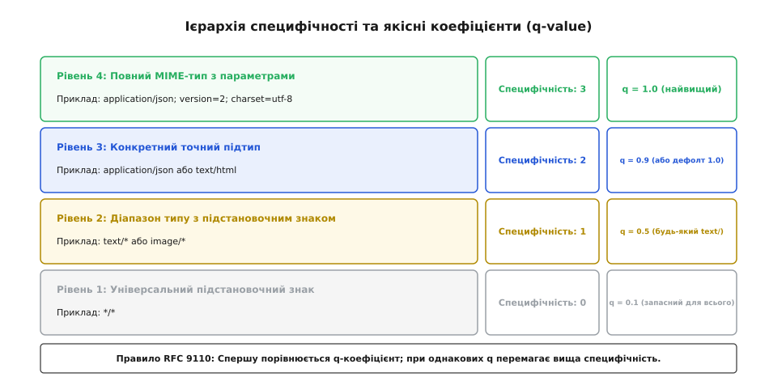
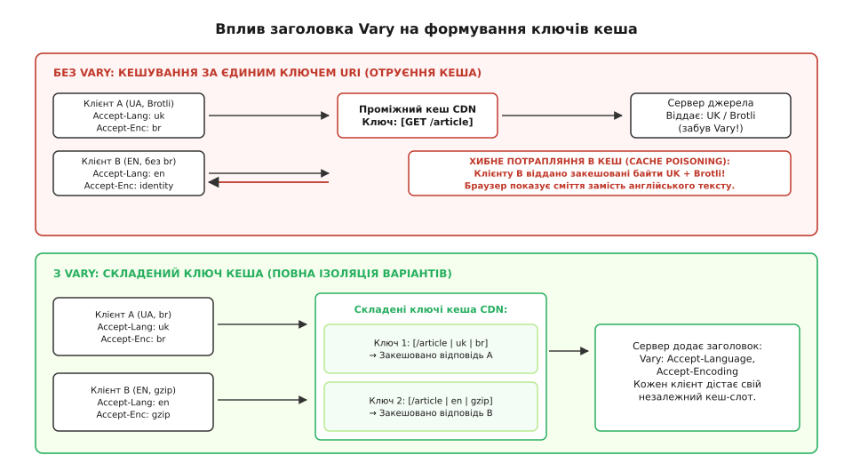

# Узгодження вмісту (content negotiation): представлення, заголовки та Vary

<preknowlist>
- [HTTP](book:programming/http) — модель «запит → відповідь», заголовки, методи, коди станів.
- [REST](book:programming/rest-api) — ресурс і представлення; URI як ідентифікатор абстрактної сутності.
- [HTTP-кешування](book:programming/http-caching) — Cache-Control, ETag, кеш-ключі та небезпека розходження копій.
- [ASCII і UTF-8](book:programming/ascii-utf8) — кодування тексту, набори символів і байти в мережі.
</preknowlist>

Користувач у Києві відкриває у мобільному браузері сторінку річного звіту за адресою `/reports/2026`. Браузер надсилає запит і очікує отримати адаптивну верстку мовою HTML з українським текстом, упаковану сучасним алгоритмом стиснення Brotli для економії мобільного трафіку. Одночасно автоматизований скрипт бекенду з Франкфурта робить запит на ту саму адресу `/reports/2026`, але йому потрібні структуровані сирі дані у форматі JSON зі стисненням Gzip для імпорту в базу даних. Аналітичний сервіс із Токіо надсилає запит на ту саму адресу, очікуючи табличний файл CSV.

Адреса ресурсу залишається незмінною: вона вказує на одну й ту саму концептуальну сутність — звіт компанії за 2026 рік. Якби розробники жорстко прив'язали формат, мову та метод компресії безпосередньо до шляху в URL (наприклад, створивши окремі адреси `/ua/reports/2026.html.br` та `/en/reports/2026.json.gz`), клієнти мусили б заздалегідь знати внутрішню файлову структуру сервера, будь-яка зміна формату ламала б збережені закладки та зовнішні посилання, а головна ідея вебу — єдиний ідентифікатор ресурсу (URI) — деградувала б до покажчика на фізичний файл на жорсткому диску.

Механізм, завдяки якому за однією незмінною адресою різні клієнти отримують принципово різні бінарні дані, адаптовані під їхні технічні можливості та мовні налаштування, називається **узгодженням вмісту** (англ. *content negotiation*, від латинського *negotiari* — обговорювати умови, домовлятися).

## Ресурс і представлення: поділ сутності та форми

Щоб зрозуміти логіку протоколу HTTP, необхідно розділити два поняття, які часто помилково ототожнюють: **ресурс** (англ. *resource*) та **представлення** (англ. *representation*, від латинського *repraesentare* — унаочнювати, робити присутнім).

У дисертації Роя Філдінга (2000 рік), де було вперше формалізовано архітектурний стиль REST, підкреслюється: ресурс — це абстрактне концептуальне відображення сутності або джерела інформації, якому надано стійкий ідентифікатор URI. Ресурс не має жорстко зафіксованої бінарної форми: він моделює стан, який змінюється в часі («поточна погода в Одесі», «профіль користувача № 42», «актуальний баланс рахунку» або «квартальний звіт компанії»).

Представлення — це конкретний моментальний знімок стану ресурсу, матеріалізований у вигляді послідовності байтів у визначеному форматі, з певною мовною локалізацією та методом стиснення.

```
Ресурс: https://api.example.com/users/42
  ├── Представлення 1: HTML-розмітка українською мовою у UTF-8 зі стисненням Brotli
  ├── Представлення 2: JSON-документ англійською мовою зі стисненням Gzip
  ├── Представлення 3: Бінарний серіалізований Protocol Buffers без стиснення
  └── Представлення 4: Зображення візитівки у форматі AVIF
```

Клієнт у розподіленій системі ніколи не взаємодіє з абстрактним ресурсом безпосередньо: він надсилає запит на ідентифікатор і отримує у відповідь одне з можливих **представлень**, яке супроводжується набором метаданих для однозначної інтерпретації отриманих байтів.

## Чотири виміри узгодження

Стандарт RFC 9110 (розділ 12) визначає чотири незалежні осі, за якими клієнт і сервер домовляються про передачу даних:

1. **Формат медіа (Media Type)**: керується заголовком запиту `Accept`. Клієнт визначає перелік прийнятних MIME-типів (`application/json`, `text/html`, `image/avif`, `application/pdf`).
2. **Природна мова (Language)**: керується заголовком `Accept-Language`. Клієнт задає мовні переваги за стандартом BCP 47 (`uk-UA`, `en-US`, `de-DE`).
3. **Алгоритм стиснення (Content Coding)**: керується заголовком `Accept-Encoding`. Клієнт повідомляє про підтримувані алгоритми трансформації та компресії (`zstd`, `br`, `gzip`, `identity`).
4. **Кодова сторінка (Character Set)**: історично визначалася заголовком `Accept-Charset`. У сучасній інженерній практиці веб повністю перейшов на кодування UTF-8, тому цей заголовок визнано застарілим і клієнти його не надсилають.



*Чотири незалежні заголовки клієнтських уподобань перетинаються на сервері, де маршрутизатор вибирає оптимальний бінарний потік і супроводжує його відповідними заголовками Content-* та Vary.*

Сервер зіставляє матрицю клієнтських вимог зі списком своїх можливостей і повертає корисне навантаження разом із заголовками-відповідниками: `Content-Type` (який формат передано), `Content-Language` (якою мовою складено текст) та `Content-Encoding` (яким алгоритмом стиснуто байти).

## Проактивне проти реактивного узгодження

Протокол HTTP підтримує дві архітектурні схеми узгодження залежно від того, де саме ухвалюється остаточне рішення.

### Проактивне (серверне) узгодження

У проактивній моделі (англ. *proactive / server-driven negotiation*) клієнт надсилає всі свої параметри та вагові коефіцієнти в першому ж HTTP-запиті.

Сервер аналізує заголовки, виконує алгоритм зіставлення за внутрішніми правилами пріоритетів і негайно повертає обране представлення зі статусом `200 OK`.

- **Перевага**: Мінімальна затримка — рівно один мережевий обмін (1 RTT, англ. *round-trip time*).
- **Недолік**: Сервер змушений обирати за клієнта при рівнозначних варіантах, а розмір заголовків кожного запиту зростає.

### Реактивне (клієнтське) узгодження

У реактивній моделі (англ. *reactive / agent-driven negotiation*) сервер не вгадує за клієнта. Отримавши загальний запит, він повертає статус `300 Multiple Choices` разом із каталогом доступних варіантів (розміри, бітрейти, кодеки, мови) та прямими посиланнями на них. Клієнт самостійно вивчає каталог, обирає найкращий пункт і надсилає другий запит на конкретний URI.



*Проактивне узгодження виконує вибір на сервері за один обмін (1 RTT). Реактивне узгодження вимагає двох обмінів (2 RTT): спершу отримання каталогу варіантів (300 Multiple Choices), потім запит конкретного файлу.*

У звичайному веб-серфінгу реактивна модель не прижилася: додатковий обмін мережею додавав 50–200 мілісекунд затримки на кожен файл, а стандартизованого машиночитаного формату для тіла `300 Multiple Choices` тривалий час не існувало. Проте реактивне узгодження стало домінуючим у спеціалізованих нішах — зокрема в адаптивному потоковому відео (протоколи HLS та MPEG-DASH), де відеоплеєр спершу завантажує маніфест-каталог (перелік бітрейтів 1080p, 720p, 480p), а потім динамічно обирає якість кожного фрагмента залежно від поточної швидкості з'єднання.

Детальний аналіз того, як формувалися ці дві моделі та чому робоча група IETF обрала проактивне узгодження основним стандартом вебу, наведено у [історичному нарисі про еволюцію представлень і MIME](book:programming/content-negotiation/hist-representation-evolution.md).

## Математика пріоритетів і якісні коефіцієнти (q-value)

Коли клієнт надсилає список побажань, він рідко обмежується одним значенням. Наприклад, сучасний браузер може одночасно приймати HTML, XML, сучасні графічні формати AVIF/WebP та будь-які інші типи даних як запасний варіант.

Для вираження відносних переваг протокол HTTP використовує **якісні коефіцієнти** (англ. *quality values*, або *q-values*). Значення `q` записується як параметр після крапки з комою і є десятковим дробом від `0.000` до `1.000`:

```http
Accept: text/html, application/xhtml+xml, application/xml;q=0.9, image/webp, */*;q=0.8
```

Якщо параметр `q` не вказано явно, він вважається рівним `1.0` (найвища можлива перевага). Значення `q=0` має особливий статус: воно означає категоричну заборону на відправку цього типу даних («клієнт не здатний обробити цей формат за жодних умов»).

### Ієрархія специфічності (Specificity Hierarchy)

Часто виникає ситуація, коли кілька правил у заголовку клієнта покривають один і той самий доступний формат сервера, причому мають однаковий коефіцієнт якості. Наприклад, сервер має представлення `text/html`, а клієнт надіслав:

```http
Accept: text/*;q=0.8, text/html;q=0.8, */*;q=0.8
```

Усі три шаблони збігаються з форматом `text/html`, і всі мають `q=0.8`. Як сервер має вирішити конфлікт?

Стандарт RFC 9110 визначає **правило специфічності**: більш конкретний шаблон завжди має перевагу над менш конкретним за однакових значень `q`.



*Сходинки специфічності правил узгодження: від найбільш точного типу з явними параметрами до глобального підстановочного знака.*

Ієрархія специфічності будується за чотирма рівнями:

1. **Рівень 4 (Специфічність = 3)**: Точний тип і підтип із додатковими параметрами:
   `application/json; version=2; charset=utf-8`
2. **Рівень 3 (Специфічність = 2)**: Точний тип і підтип без параметрів:
   `application/json` або `text/html`
3. **Рівень 2 (Специфічність = 1)**: Родина підтипів із символом зірочки:
   `text/*` або `image/*`
4. **Рівень 1 (Специфічність = 0)**: Універсальний підстановочний знак:
   `*/*`

### Покроковий алгоритм вирішення (Resolution Algorithm)

Коли запит надходить до сервера, обробник виконує такі кроки:

1. **Парсинг діапазонів**: Заголовок розбивається на окремі елементи, витягуються параметри, коефіцієнт `q` та обчислюється числова специфічність кожного елемента.
2. **Фільтрація заборонених форматів**: Усі правила з `q=0` видаляють відповідні серверні формати зі списку кандидатів.
3. **Зіставлення з можливостями сервера**: Для кожного доступного на сервері представлення шукається найкраще правило клієнта, яке його покриває.
4. **Сортування кандидатів**: Знайдені варіанти ранжуються за формулою:
   
   ```
   Пріоритет = ( q_value DESC,  specificity DESC,  server_preference DESC )
   ```

5. **Ухвалення рішення**:
   - Якщо знайдено хоча б одного кандидата — повертається `200 OK` з обраним форматом.
   - Якщо жоден підтримуваний формат сервера не покривається клієнтським заголовком (і клієнт не дозволив `*/*`), сервер повертає статус помилки **`406 Not Acceptable`**.

Детальний формальний синтаксис ABNF для кожного заголовка та повну матрицю статус-кодів зібрано у [довіднику заголовків і статус-кодів узгодження вмісту](book:programming/content-negotiation/api-negotiation-headers.md), а завершену реалізацію цього алгоритму мовами TypeScript та C++20 наведено у [проєкті розробки рушія узгодження](book:programming/content-negotiation/proj-content-matcher.md).

## Мовне узгодження та стандарт BCP 47

Узгодження мови через заголовок `Accept-Language` працює за схожим принципом зважування, але має специфіку через ієрархічну будову мовних тегів стандарту BCP 47 (RFC 5646).

Мовний тег складається з первинного мовного коду (наприклад, `uk`, `en`, `de`) та опціональних субтегів писемності, регіону або діалекту (наприклад, `uk-UA`, `en-US`, `en-GB`, `zh-Hant-TW`).

```http
Accept-Language: uk-UA, uk;q=0.9, en-US;q=0.8, en;q=0.7, *;q=0.1
```

### Алгоритм префіксного відкату (Prefix Fallback)

Якщо клієнт запитує конкретний регіональний діалект `uk-UA` (українська мова, регіон Україна), а на сервері доступний лише загальний переклад `uk`, узгоджувач виконує пошук за префіксом: точний збіг субтегу `uk-UA` має вищий пріоритет, але якщо його немає, сервер безпечно віддає базову версію `uk`.

Навпаки це правило не діє: якщо клієнт попросив загальну англійську `en`, а сервер має лише австралійський діалект `en-AU` та британський `en-GB`, сервер обирає першу доступну варіацію `en-*`, якщо інше не заборонено якісними коефіцієнтами.

## Катастрофа кешування та порятунок через заголовок Vary

Узгодження вмісту створює найпідступнішу пастку для систем проміжного кешування (проксі-серверів провайдерів, корпоративних шлюзів та глобальних мереж доставки вмісту CDN).

За замовчуванням будь-який HTTP-кеш будує таблицю збережених відповідей, використовуючи як ключ комбінацію методу запиту та адреси URI:

```
Ключ кеша за замовчуванням = ( Method, Request-URI )
```

Уявімо, що відбувається без спеціальних інструкцій:

1. **Користувач A** (з України) відвідує сторінку `https://example.com/article`. Його браузер надсилає заголовок `Accept-Language: uk` та `Accept-Encoding: br`. Сервер генерує український текст, стискає його алгоритмом Brotli і віддає відповідь із заголовком `Cache-Control: max-age=3600`.
2. **Проміжний кеш CDN** бачить адресу `GET /article` і зберігає стиснені українські байти у своїй пам'яті під ключем `(GET, https://example.com/article)`.
3. **Користувач B** (із США) за дві хвилини звертається до тієї самої сторінки `https://example.com/article`. Його браузер надсилає `Accept-Language: en` та взагалі не підтримує Brotli (старий клієнт, що вміє лише `Accept-Encoding: identity`).
4. **Кеш CDN** перевіряє свій ключ: адреса збіглася, строк придатності 3600 секунд ще не вичерпано. Кеш повертає збережені байти.
5. **Результат**: Американський користувач отримує незрозумілий український текст, до того ж зашифрований невідомим бінарним алгоритмом Brotli. Браузер аварійно показує екран помилки декодування або сміття на екрані.

Це явище називається **отруєнням кеша** (англ. *cache poisoning*) внаслідок відсутності розділення варіантів.



*Без заголовка Vary кеш повертає першу збережену копію всім наступним клієнтам незалежно від їхніх заголовків. Із заголовком Vary кеш ізолює відповіді за складеними ключами.*

### Механізм роботи Vary

Щоб запобігти змішуванню несумісних відповідей, сервер, який виконує узгодження вмісту, **зобов'язаний** повідомити всім кешам, які саме поля запиту вплинули на його рішення. Для цього використовується заголовок **`Vary`**:

```http
HTTP/1.1 200 OK
Content-Type: text/html; charset=utf-8
Content-Language: uk
Content-Encoding: br
Vary: Accept-Language, Accept-Encoding
Cache-Control: max-age=3600
```

Отримавши таку відповідь, кеш змінює алгоритм формування ключа: він стає **складеним ключем** (composite key), що містить URI та точні значення всіх перелічених заголовків запиту:

```
Складений ключ кеша = ( URI,  Accept-Language_value,  Accept-Encoding_value )
```

Тепер для користувача A ключ матиме вигляд `(/article, "uk", "br")`, а для користувача B — `(/article, "en", "identity")`. Кеш бачить промах для користувача B, звертається до сервера-джерела, отримує англійську нестиснену версію та зберігає її в окремій ізольованій комірці.

### Взаємодія з валідаторами ETag

Особливу обережність слід проявляти при генерації валідаторів свіжості `ETag` для узгоджених ресурсів.

Якщо сервер використовує сильний валідатор (Strong ETag), він гарантує побайтову ідентичність тіла відповіді. Отже, різні представлення одного ресурсу (наприклад, JSON і XML або версія Brotli та версія без стиснення) **зобов'язані мати різні ETag**:

```http
GET /users/42  [Accept: application/json; Accept-Encoding: br]
→ 200 OK, ETag: "u42-json-br", Content-Type: application/json, Content-Encoding: br

GET /users/42  [Accept: text/html; Accept-Encoding: gzip]
→ 200 OK, ETag: "u42-html-gz", Content-Type: text/html, Content-Encoding: gzip
```

Якщо бекенд помилково призначить однаковий ETag `"u42"` обом варіантам, виникне критична помилка умовного запиту: клієнт, що закешував HTML, надішле умовний запит `If-None-Match: "u42"` із заголовком `Accept: application/json`. Сервер побачить збіг ETag і відповість `304 Not Modified`, змусивши клієнта спробувати відобразити збережений HTML як JSON.

### Небезпека фрагментації кеша та нормалізація на CDN

Хоча заголовок `Vary` повністю вирішує проблему коректності, він породжує проблему ефективності — **фрагментацію кеша** (англ. *cache fragmentation*).

Якщо сервер необачно вкаже заголовок `Vary: User-Agent`, кеш буде створювати окрему копію документа для кожного унікального рядка браузера. Оскільки у світі існують десятки тисяч комбінацій версій браузерів, операційних систем і розширень, коефіцієнт влучання в кеш (cache hit ratio) впаде майже до нуля: кожен користувач провокуватиме новий запит до бекенду.

Навіть зі стандартним `Accept-Encoding` виникає схожа проблема: різні клієнти можуть надсилати заголовки в різному порядку та з різними пропусками:

```http
Клієнт 1: Accept-Encoding: gzip, deflate, br
Клієнт 2: Accept-Encoding: br;q=1.0, gzip;q=0.8
Клієнт 3: Accept-Encoding: gzip, br
```

Для простого кеша це три абсолютно різні рядки, тому він збереже три однакові копії Brotli-відповіді.

Сучасні CDN-мережі (Cloudflare, Akamai, Fastly) вирішують це за допомогою **нормалізації заголовків на межі мережі** (Edge Normalization). До того, як запит досягне логіки кешування або сервера-джерела, CDN перетворює сирий рядок `Accept-Encoding` на канонічний токен найсильнішого підтримуваного стиснення:

```
"gzip, deflate, br, zstd"  →  "zstd"
"gzip, deflate, br"        →  "br"
"gzip, deflate"            →  "gzip"
""                         →  "identity"
```

Завдяки нормалізації кількість слотів у кеші скорочується рівно до трьох-чотирьох канонічних варіантів, що забезпечує максимальну швидкість віддачі даних при 100 % збереженні ізоляції.

## Налаштування зворотних проксі-серверів (NGINX і Varnish)

У промисловій експлуатації узгодження вмісту часто делегується зворотному проксі-серверу або прискорювачу HTTP для зняття обчислювального навантаження з прикладного коду бекенду.

### Конфігурація NGINX

У конфігурації NGINX директиви `gzip_vary on` та `brotli_static` автоматично додають заголовок `Vary: Accept-Encoding`, коли веб-сервер віддає попередньо скомпільовані стиснені статичні файли:

```nginx
http {
    gzip on;
    gzip_vary on;
    gzip_types text/plain text/css application/json application/javascript;

    brotli on;
    brotli_static on;
    brotli_types text/plain text/css application/json application/javascript;

    # Маршрутизація формату за заголовком Accept
    map $http_accept $variant_suffix {
        default                 ".html";
        "~*application/json"   ".json";
        "~*application/xml"    ".xml";
    }

    server {
        listen 443 ssl http2;
        server_name api.example.com;

        location /data {
            try_files /static/data$variant_suffix =404;
            add_header Vary "Accept, Accept-Encoding";
        }
    }
}
```

### Нормалізація у Varnish (VCL)

Високопродуктивний кеш Varnish дозволяє виконувати явну нормалізацію заголовків у процедурі `vcl_recv` перед обчисленням геш-ключа:

```vcl
sub vcl_recv {
    # Нормалізація Accept-Encoding до єдиного канонічного значення
    if (req.http.Accept-Encoding) {
        if (req.http.Accept-Encoding ~ "br") {
            set req.http.Accept-Encoding = "br";
        } elsif (req.http.Accept-Encoding ~ "gzip") {
            set req.http.Accept-Encoding = "gzip";
        } else {
            unset req.http.Accept-Encoding;
        }
    }

    # Нормалізація мови до базового коду
    if (req.http.Accept-Language) {
        if (req.http.Accept-Language ~ "^uk") {
            set req.http.Accept-Language = "uk";
        } elsif (req.http.Accept-Language ~ "^en") {
            set req.http.Accept-Language = "en";
        } else {
            set req.http.Accept-Language = "uk"; # мова за замовчуванням
        }
    }
}

sub vcl_hash {
    hash_data(req.url);
    if (req.http.Accept-Encoding) {
        hash_data(req.http.Accept-Encoding);
    }
    if (req.http.Accept-Language) {
        hash_data(req.http.Accept-Language);
    }
    return (lookup);
}
```

## Узгодження у сучасних API: REST, GraphQL та gRPC

Розвиток веб-технологій породив альтернативні парадигми взаємодії, кожна з яких по-різному ставиться до механізмів HTTP-узгодження.

### REST та гіпермедіа (JSON-LD, HAL, JSON:API)

У класичному REST узгодження через заголовок `Accept` є центральним інструментом гіпермедіа-навігації (HATEOAS). Клієнт може запитувати один і той самий ресурс різними схемами серіалізації:

```http
Accept: application/vnd.api+json
Accept: application/ld+json
Accept: application/hal+json
```

Сервер розпізнає профіль структури та повертає відповідні зв'язки та метадані, не змінюючи URL ресурсу.

### Чому GraphQL відмовився від HTTP-узгодження

На відміну від REST, архітектура GraphQL перенесла відповідальність за вибір полів і структури відповіді з HTTP-заголовків безпосередньо у тіло запиту:

- **Механізм**: Клієнт надсилає документ запиту у форматі JSON у тілі `POST /graphql`.
- **Ціна рішення**: GraphQL повністю втрачає можливість використання стандартного HTTP-кешування на рівні проміжних проксі та CDN-мереж за заголовком `Vary`, оскільки всі запити йдуть на єдину адресу через метод `POST`.

### gRPC та бінарні потоки

У фреймворку gRPC протокол HTTP/2 використовується суто як транспорт. Узгодження форматів відсутнє на рівні сеансу: заголовок `Content-Type` жорстко зафіксований як `application/grpc` або `application/grpc+proto`, а стиснення контролюється спеціалізованими заголовками `grpc-encoding` та `grpc-accept-encoding`.

## Багаточастинне узгодження та діапазонні запити (Multipart Ranges)

Особливим випадком узгодження вмісту є комбінація заголовків `Accept: multipart/byteranges` та `Range: bytes=...`.

Коли клієнт (наприклад, менеджер завантажень або відеоплеєр) запитує кілька розрізнених фрагментів одного файлу, сервер повертає статус `206 Partial Content` зі спеціальним типом вмісту `multipart/byteranges`:

```http
HTTP/1.1 206 Partial Content
Content-Type: multipart/byteranges; boundary=THIS_STRING_SEPARATES
Content-Length: 1240

--THIS_STRING_SEPARATES
Content-Type: application/pdf
Content-Range: bytes 500-999/8000

...байти фрагмента 1...
--THIS_STRING_SEPARATES
Content-Type: application/pdf
Content-Range: bytes 7000-7499/8000

...байти фрагмента 2...
--THIS_STRING_SEPARATES--
```

Тут кожна окрема частина всередині одного TCP-пакета отримує власні метадані представлення, що дозволяє клієнту надійно склеїти фрагменти без повторного запиту всього файлу.

## Практичні шаблони та альтернативні підходи

У реальній розробці веб-застосунків та REST API узгодження через HTTP-заголовки іноді комбінують із явними параметрами в адресі запиту або замінюють ними.

### 1. Розширення файлів у URL (Path Extensions)

Багато публічних API дозволяють клієнтам явно вказувати бажаний формат прямо в адресі:

```http
GET /api/v1/users/42.json
GET /api/v1/users/42.xml
GET /api/v1/users/42.csv
```

- **Чому це зручно**: Розробник може протестувати відповідь у звичайному браузері без необхідності налаштовувати заголовок `Accept`; статичні файли простіше маршрутизувати на рівні веб-сервера NGINX.
- **Як це працює з погляду архітектури**: Сервер інтерпретує розширення `.json` як найвищий пріоритет, що перезаписує будь-яке значення заголовка `Accept`.

### 2. Запити через параметри (Query Parameters)

Інший поширений шаблон — використання параметра запиту:

```http
GET /api/v1/reports/summary?format=pdf&lang=uk
```

Цей підхід ідеально підходить для генерації посилань, які можна надіслати електронною поштою або вставити у звичайний HTML-тег `<a href="...">`, де клієнт не має можливості змінити системні HTTP-заголовки браузера.

### 3. Версіонування API через кастомні MIME-типи

У великих сервіс-орієнтованих архітектурах заголовок `Accept` використовують для безшовного переходу між версіями структур даних за допомогою вендорних MIME-типів:

```http
Accept: application/vnd.company.user.v2+json
```

Такий підхід дозволяє зберігати стабільну канонічну адресу сутності `/users/42` для всіх клієнтів незалежно від версії їхньої кодової бази: старі клієнти запитують версію `v1`, нові — `v2`, а сервер маршрутизує запит до відповідного DTO-серіалізатора.

## Простеження та діагностика узгодження через curl

Під час налагодження поведінки узгоджувача та перевірки налаштувань CDN незамінним інструментом є консольна утиліта `curl`. Передача прапорця `-v` (verbose) дозволяє побачити повний обмін заголовками:

```bash
curl -v -H "Accept: application/json" \
        -H "Accept-Language: uk-UA, uk;q=0.9, en;q=0.5" \
        -H "Accept-Encoding: br, gzip" \
        https://api.example.com/reports/2026
```

Під час аналізу відповіді слід перевірити чотири критичні рядки:
1. `Content-Type: application/json; charset=utf-8` — чи збігся формат із найбільш пріоритетним правилом.
2. `Content-Language: uk-UA` — чи спрацював алгоритм мовної селекції.
3. `Content-Encoding: br` — чи застосовано очікуваний алгоритм компресії.
4. `Vary: Accept, Accept-Language, Accept-Encoding` — чи присутні всі фактори вибору у списку інваріантів кешування.

## Безпека в узгодженні вмісту

Узгодження представлень безпосередньо впливає на безпеку веб-додатків у трьох критичних аспектах:

1. **Атаки через стиснення побічними каналами (BREACH / CRIME)**:
   Якщо сторінка одночасно містить секретний токен автентифікації (CSRF-токен) та відображає дані, введені користувачем, стиснення `gzip`/`br` дозволяє зловмиснику підібрати секрет за зміною розміру відповіді. Для таких чутливих ендпоінтів рекомендується вимикати динамічне стиснення або маскувати токени випадковим шумом.
2. **Атаки підміни MIME-типів (MIME Confusion / Sniffing)**:
   Деякі браузери намагаються ігнорувати заголовок `Content-Type` і вгадувати формат за першими байтами файлу (MIME sniffing). Це дозволяє зловмисникам завантажити файл зображення зі схованим JavaScript-кодом і змусити браузер виконати його як скрипт. Щоб запобігти цьому, сервер зобов'язаний супроводжувати кожну відповідь заголовком `X-Content-Type-Options: nosniff`.
3. **Атаки на відмову в обслуговуванні (ReDoS у заголовках)**:
   Ненадійні регулярні вирази для парсингу заголовків `Accept` із сотнями параметрів можуть призвести до катастрофічного зворотного ходу (catastrophic backtracking) і зависання потоків Node.js або Python. Використовуйте детерміновані кінцеві автомати або оптимізовані парсери на базі покажчиків.

> 🔧 **Навіщо це.** Узгодження вмісту — це архітектурний міст між довговічністю адресації та мінливістю форматів. Дотримання правил узгодження дозволяє змінювати схеми стиснення (перехід з gzip на zstd), додавати нові графічні формати (AVIF замість JPEG) та локалізувати сервіси на десятки мов без переписування клієнтських додатків і без зміни єдиної точки входу до ваших ресурсів.
