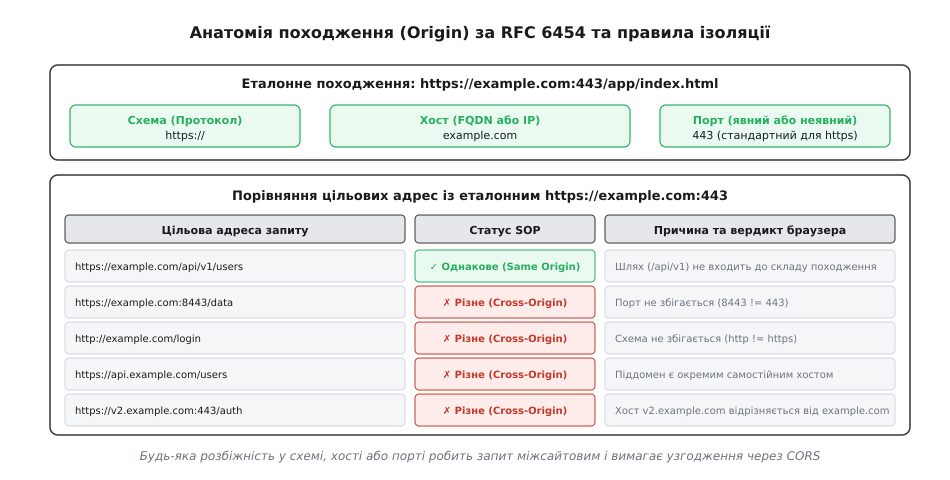
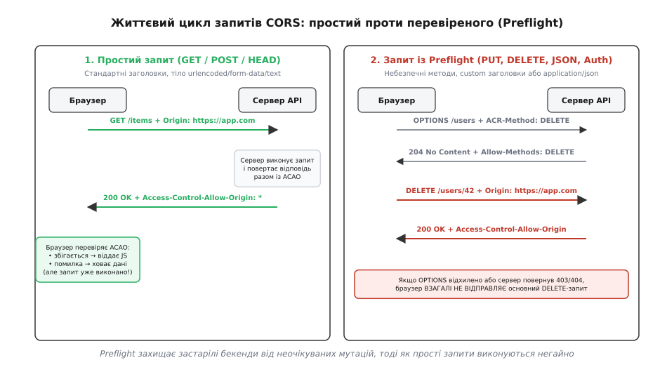
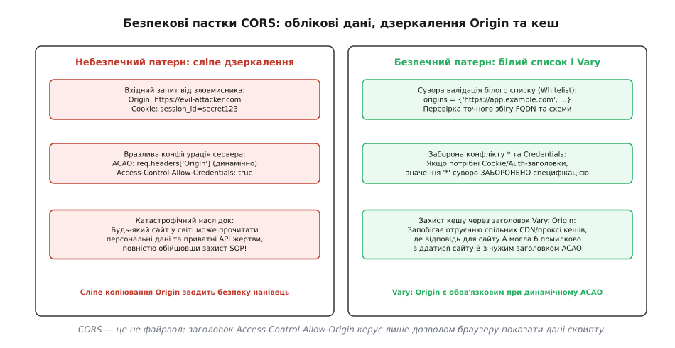

# CORS і політика однакового походження

<preknowlist>
- [HTTP](topic:programming/http) — модель «запит → відповідь», структура заголовків, методи запиту та безпам'ятна природа протоколу.
- [HTTP-cookie](topic:programming/http-cookies) — збереження сесійного стану на клієнті, область видимості доменів та прапорці безпеки.
- [REST](topic:programming/rest-api) — ресурси, клієнт-серверна архітектура та семантика HTTP-методів.
- [Автентифікація](topic:programming/authentication) — способи підтвердження особи клієнта та передача облікових даних.
- [CSRF (міжсайтова підробка запиту)](topic:programming/csrf) — механізм експлуатації довіри браузера до збережених сесій сторонніми сайтами.
</preknowlist>

Користувач відкриває у браузері дві вкладки: на одній завантажено особистий кабінет інтернет-банку `https://bank.example.com`, а на сусідній — довільний новинний сайт або форум `https://news.example.org`. Обидва веб-додатки одночасно виконують JavaScript-код у єдиному середовищі браузера на комп'ютері користувача. Скрипт із вкладки новин ініціює асинхронний мережевий виклик `fetch('https://bank.example.com/api/account/balance')`. Браузер автоматично має у своєму сховищі активні сесійні куки для банку. Якби браузер беззастережно передав відповідь банківського сервера сторонньому коду, зловмисники могли б непомітно викрасти конфіденційний фінансовий баланс, персональні дані або історію транзакцій будь-якого користувача, який просто перейшов за посиланням в інтернеті.

Щоб унеможливити подібні витоки, веб-платформа реалізує фундаментальний механізм пісочниці — **політику однакового походження (Same-Origin Policy, SOP)**. Вона забороняє коду з одного джерела читати дані, стан або структуру сторінок іншого джерела. Проте в сучасній веб-розробці виникає протилежна інженерна потреба: інтерфейс інтернет-магазину на `https://shop.com` повинен легально викликати мікросервіс платежів на `https://pay.shop.com` або запитувати аналітику з `https://api.metrics.io`. Для керованого, безпечного та стандартизованого відкриття доступу між різними джерелами було створено протокол **Cross-Origin Resource Sharing (CORS)** (від англ. *cross* — «перехресний», *origin* та лат. *origo* — «походження, джерело, корінь», спільне використання ресурсів між різними походженнями).

## Фундамент ізоляції: анатомія походження та механізм SOP

Усі правила безпеки браузера базуються на концепції **походження (Origin)**, суворо стандартизованій у специфікації RFC 6454. Походження документа чи мережевого запиту визначається кортежем із трьох компонентів:

```
Origin = (Схема, Хост, Порт)
```

Два URL вважаються такими, що мають **однакове походження (Same Origin)**, якщо і тільки якщо всі три компоненти кортежу є абсолютно ідентичними при посимвольному порівнянні. Будь-яка розбіжність хоча б в одному елементі автоматично класифікує взаємодію як **міжсайтову (Cross-Origin)**.

```
Еталонний URL: https://example.com:443/app/index.html
  ├─ Схема:   https
  ├─ Хост:    example.com
  └─ Порт:    443 (стандартний порт для HTTPS)
```



*Складові походження: протокол, доменне ім'я та порт; зміна будь-якого компонента перетворює запит на міжсайтовий і підпорядковує його правилам обмеження SOP.*

Розглянемо практичні випадки зіставлення різних адрес із еталонним `https://example.com/app/index.html`:
1. `https://example.com/api/v1/users` — **Same Origin**: схема `https`, хост `example.com` та неявний порт `443` повністю збігаються. Шлях до ресурсу (`/api/v1/...`) та параметри запиту не входять до складу походження і на політику ізоляції не впливають.
2. `http://example.com/app/index.html` — **Cross-Origin**: розбіжність у схемі (`http` замість `https`) та порті (`80` замість `443`). Нешифрований протокол не має довіри з боку захищеного контексту.
3. `https://api.example.com/app/index.html` — **Cross-Origin**: піддомен `api.example.com` є самостійним вузлом у системі доменних імен (FQDN) і вважається цілком окремим хостом.
4. `https://example.com:8443/app/index.html` — **Cross-Origin**: розбіжність у номері мережевого порту (`8443` замість `443`).
5. `https://example.com.evil.com/data` — **Cross-Origin**: домен другого рівня належить іншій організації (`evil.com`), попри наявність префікса `example.com`.

### Область дії обмежень SOP

Політика однакового походження контролює клієнтський додаток на кількох незалежних рівнях:
- **Об'єктна модель документа (DOM):** сценарій у вкладці або фреймі `<iframe>` не може отримати доступ до об'єктів `window.parent`, `window.opener`, читати `document.cookie` чи маніпулювати DOM-деревом сторінки іншого походження.
- **Локальні сховища даних:** браузер фізично розділяє бази даних `IndexedDB`, ключі `localStorage`, `sessionStorage` та сховища сервіс-воркерів `Cache API` за кортежем походження. Скрипт із `api.example.com` не бачить записів `example.com`.
- **Мережеві відповіді:** програмні інтерфейси `fetch()` та `XMLHttpRequest` можуть надіслати мережевий запит на чуже походження, але браузер категорично блокує надання тіла відповіді, статусів та заголовків JavaScript-коду, якщо сервер явно не дозволив цю операцію через CORS.
- **Мультимедіа та полотна (Canvas):** якщо на елемент `<canvas>` малюється зображення з чужого походження без заголовків CORS, полотно переходить у захищений стан *tainted* (від англ. *taint* — «забруднювати»). Браузер назавжди забороняє виклики `canvas.toDataURL()` або `getImageData()`, щоб запобігти зчитуванню пікселів чужих картинок.

### Асиметрія SOP: вбудовування проти читання

Історично всесвітня павутина розвивалася на основі вільного посилання на зовнішні документи. Через це політика SOP містить фундаментальну асиметрію: **міжсайтове вбудовування ресурсів (Cross-Origin Embedding) дозволено, але міжсайтове читання сирих даних (Cross-Origin Reading) суворо заборонено**.

Браузер вільно дозволяє такі операції без жодних заголовків CORS:
- Відображення картинок через ``.
- Виконання скриптів через `<script src="https://analytics.other.com/tracker.js">`.
- Підключення стилів через `<link rel="stylesheet" href="https://fonts.other.com/style.css">`.
- Відтворення медіа через `<video>` та `<audio>`.
- Вбудовування сторонніх сторінок через `<iframe src="https://partner.com">`.
- Відправлення HTML-форм методом `<form action="https://bank.com/transfer" method="POST">`.

Браузер самостійно візуалізує ці ресурси на екрані, проте закриває прямий програмний доступ до їхнього байтового вмісту з боку JavaScript. Детальніше про те, чому творці перших браузерів заклали саме таку модель та які небезпечні хаки (на кшталт JSONP чи плагінів Flash) розробники використовували до появи єдиного консорціумного стандарту, висвітлено у матеріалі про те, [як виникла політика SOP у Netscape Navigator 2.0 та чому індустрія відмовилася від JSONP і Flash crossdomain.xml](topic:programming/cors/hist-same-origin.md).

## Архітектурний конфлікт: розподілений веб і потреба у CORS

На світанку розвитку вебу сайти були монолітами: сервери віддавали HTML, CSS і обробляли форми на одному й тому самому домені. Проте поява односторінкових додатків (Single Page Applications, SPA) на базі React, Vue чи Angular докорінно змінила топологію систем.

Типова сучасна архітектура розділяє систему на автономні вузли:
- Клієнтський SPA-бандл (HTML, JS, WASM) роздається через георозподілену мережу доставки статичного контенту (CDN) за адресою `https://app.company.com`.
- Основний API-шлюз бізнес-логіки розміщено на `https://api.company.com`.
- Сервіс авторизації та видачі токенів працює на `https://auth.company.com`.
- Сховище користувацьких файлів та картинок розташовано в об'єктному сховищі S3 на `https://company-media.s3.amazonaws.com`.

Коли клієнтський JavaScript завантажується з `https://app.company.com` і викликає `fetch('https://api.company.com/v1/orders')`, браузер виявляє розбіжність хостів і фіксує спробу міжсайтового доступу. Без спеціального протоколу узгодження браузер заблокує відповідь.

Спроби обійти це через єдиний домен — наприклад, проксувати всі запити через монолітний Reverse Proxy за схемою `https://app.company.com/api/...` — створюють вузьке місце в інфраструктурі, ускладнюють інвалідацію кешу, розмивають межі відповідальності команд і збільшують затримку мережевих пакетів (Network Latency).

Розв'язанням став протокол CORS: він дозволяє серверу `api.company.com` передати браузеру набір HTTP-заголовків, які явно декларують: *«Я довіряю клієнтам із домену `https://app.company.com` і дозволяю їм читати мої відповіді»*.

## Ментальна модель CORS: захист клієнта, а не серверний файрвол

Найпоширеніша помилка серед бекенд-інженерів — сприймати CORS як засіб захисту сервера від несанкціонованих запитів.

> 🔧 **Навіщо це.** CORS не є брандмауером, системою авторизації чи захистом API від зловмисників. CORS створено виключно для **захисту користувача в браузері**.

Розглянемо фундаментальну різницю між клієнтами:
1. **Браузер (User Agent):** виконує сторонній недовірений JavaScript у спільній пісочниці, зберігає сесійні куки, дотримується стандарту W3C/WHATWG Fetch і суворо забезпечує виконання політики SOP та CORS.
2. **Сторонні клієнти (curl, Postman, Python `requests`, ботнет):** не мають жодного відношення до SOP. Вони ігнорують заголовки `Access-Control-*`, можуть підставити будь-який заголовок `Origin` або не надсилати його зовсім.

Якщо бекенд повертає помилку `403 Forbidden` лише через те, що заголовок `Origin` відсутній або не збігається з білим списком, це захищає сервер лише від браузерів добропорядних користувачів, але абсолютно безпорадно проти реальної хакерської атаки чи парсерів даних. Сервер зобов'язаний захищати свої кінцеві точки за допомогою надійних протоколів [автентифікації](topic:programming/authentication) (JWT, сесії, API-ключі), а не сподіватися на заголовки CORS.

Браузер бере на себе роль арбітра: він гарантує, що значення заголовка `Origin` встановлюється на рівні мережевого стека операційної системи й не може бути підроблено клієнтським кодом JavaScript (заголовок `Origin` належить до системного списку *Forbidden Header Names*).

## Класифікація запитів: прості та з попередньою перевіркою (Preflight)

Стандарт Fetch поділяє всі міжсайтові HTTP-запити на дві фундаментальні категорії: **прості запити (Simple Requests)** та **запити з попередньою перевіркою (Preflighted Requests)**. Цей поділ зумовлено вимогами зворотної сумісності з веб-серверами, створеними до появи стандарту CORS.



*Порівняння двох сценаріїв: простий запит надсилається негайно та виконується на сервері до перевірки ACAO; складний запит блокується браузером до успішного проходження перевірки через метод OPTIONS.*

### 1. Прості запити (Simple Requests)

Запит класифікується як простий, якщо він відповідає критеріям, які звичайні HTML-сторінки могли генерувати ще у 1990-х роках через стандартні форми `<form>` та картинки ``.

Запит є простим, якщо виконуються **всі три умови одночасно**:
1. **Метод запиту** належить до безпечного списку: `GET`, `HEAD` або `POST`.
2. **Заголовки запиту**, встановлені вручну, містять лише дозволені специфікацією: `Accept`, `Accept-Language`, `Content-Language`, `Content-Type` та `Range` (з простими діапазонами).
3. **Заголовок Content-Type** має одне з трьох класичних значень:
   - `application/x-www-form-urlencoded` (стандартне надсилання форми);
   - `multipart/form-data` (надсилання файлів через форму);
   - `text/plain` (простий неструктурований текст).

#### Життєвий цикл простого запиту:
1. Клієнтський скрипт викликає `fetch('https://api.example.com/items', { method: 'GET' })`.
2. Браузер **негайно відправляє запит по мережі**, автоматично додаючи заголовок `Origin: https://app.example.com`.
3. Сервер обробляє запит, виконує бізнес-логіку (читає базу даних або вносить зміни) і повертає HTTP-відповідь із заголовком `Access-Control-Allow-Origin: https://app.example.com` (або `*`).
4. Браузер аналізує заголовок відповіді:
   - Якщо значення збігається з поточним Origin або встановлено `*` — дані передаються в JavaScript (проміс `fetch()` успішно резолвиться).
   - Якщо заголовок відсутній або містить чужий домен — браузер **блокує доступ до тіла відповіді**, генерує помилку мережі в консолі DevTools, але **серверна дія вже безповоротно виконана**.

> ⚠️ **Критичний нюанс безпеки.** Якщо простий запит `POST` змінює баланс чи видаляє запис, сервер **виконає цю мутацію**, навіть якщо в нього зовсім не налаштовано CORS! Браузер лише приховає відповідь від зловмисного скрипту. Саме тому захист від несанкціонованих мутацій повинен забезпечуватися механізмами протидії [міжсайтовій підробці запиту (CSRF)](topic:programming/csrf), а не сподіваннями на CORS.

### 2. Запити з попередньою перевіркою (Preflighted Requests)

Якщо запит виходить за рамки простих операцій 1990-х років, він становить потенційну загрозу для застарілих серверів. Наприклад, якщо клієнт намагається надіслати запит `DELETE /user/42` або передати `Content-Type: application/json`, старий бекенд без захисту від CORS міг би випадково видалити запис у базі даних, вважаючи запит внутрішньодоменним.

Щоб захистити сервер від виконання небезпечних мутацій, браузер зобов'язаний виконати **попередню перевірку (Preflight Request)** через спеціальний HTTP-метод `OPTIONS`.

Запит автоматично стає попередньо перевіреним, якщо має місце **хоча б одна з умов**:
- Метод запиту: `PUT`, `DELETE`, `PATCH`, `CONNECT`, `TRACE` тощо.
- Використовується тип вмісту `Content-Type: application/json`, `application/xml` або бінарні потоки.
- Запит містить нестандартні заголовки: `Authorization`, `X-Api-Key`, `X-Request-Id`, `X-Correlation-ID`.
- До запиту прикріплено кастомні обробники подій завантаження через `XMLHttpRequestUpload`.
- У запиті використовується об'єкт потокового зчитування `ReadableStream`.

#### Протокол взаємодії Preflight:

```http
Крок 1: Браузер надсилає OPTIONS-запит (Preflight)
OPTIONS /api/v1/users/42 HTTP/1.1
Host: api.example.com
Origin: https://app.example.com
Access-Control-Request-Method: DELETE
Access-Control-Request-Headers: authorization, content-type
```

Сервер перевіряє свої правила безпеки. Якщо джерело, метод і заголовки дозволені, він повертає легку відповідь без тіла:

```http
Крок 2: Відповідь сервера на Preflight
HTTP/1.1 204 No Content
Access-Control-Allow-Origin: https://app.example.com
Access-Control-Allow-Methods: GET, POST, PUT, DELETE, OPTIONS
Access-Control-Allow-Headers: Authorization, Content-Type
Access-Control-Max-Age: 86400
Vary: Origin
Content-Length: 0
```

Отримавши такий дозвіл, браузер виконує фактичний запит:

```http
Крок 3: Фактичний запит від клієнта
DELETE /api/v1/users/42 HTTP/1.1
Host: api.example.com
Origin: https://app.example.com
Authorization: Bearer eyJhbGciOi...
Content-Type: application/json

{"reason": "account_closure"}
```

```http
Крок 4: Фактична відповідь сервера
HTTP/1.1 200 OK
Access-Control-Allow-Origin: https://app.example.com
Content-Type: application/json

{"status": "deleted"}
```

Якщо на кроці 1 сервер відхилив запит `OPTIONS` (повернув помилку `403 Forbidden`, `404 Not Found` або не додав відповідних заголовків `Access-Control-Allow-*`), браузер **взагалі не відправляє фактичний запит `DELETE` по мережі**. Мутація на сервері гарантовано не відбувається.

Повний синтаксис кожного з цих заголовків, їхні граничні обмеження та стандартизовану матрицю параметрів детально описано у [довіднику заголовків CORS: запити, відповіді та правила взаємодії](topic:programming/cors/api-cors-headers.md).

## Продуктивність та оптимізація: заголовок Access-Control-Max-Age

Надсилання попереднього запиту `OPTIONS` подвоює кількість мережевих викликів (RTT, Round Trip Time). Для клієнтів на мобільних телефонах або в умовах високого пінгу (200–300 мс) кожен клік, що вимагає виклику API, зазнаватиме затримки у пів секунди лише на службове погодження CORS.

Для оптимізації трафіку сервер передає директиву `Access-Control-Max-Age`, яка вказує час кешування дозволу `OPTIONS` у внутрішньому сховищі браузера (у секундах):

```http
Access-Control-Max-Age: 86400
```

Протягом наступних 24 годин (86400 с) браузер не відправлятиме повторних запитів `OPTIONS` для тієї самої комбінації URL та методу, а відразу виконуватиме основний запит.

### Браузерні обмеження (Clamping Limits)

Розробник не може встановити нескінченний час кешування. Кожен браузер застосовує власну внутрішню стелю з міркувань безпеки:
- **Chromium (Google Chrome, Microsoft Edge, Brave, Opera):** максимум **7200 секунд (2 години)**. Будь-яке значення, вище за 7200, примусово зменшується до 2 годин.
- **Gecko (Mozilla Firefox):** максимум **86400 секунд (24 години)**.
- **WebKit (Apple Safari):** максимум **600 секунд (10 хвилин)**.

У промислових системах рекомендується встановлювати `Access-Control-Max-Age: 86400`. Це забезпечить максимальне допустиме кешування для кожного конкретного рушія.

## Запити з обліковими даними: куки, авторизація та пастка Wildcard

За замовчуванням міжсайтові асинхронні запити через `fetch()` виконуються в режимі ізоляції облікових даних: браузер **не додає** сесійні куки (`Cookie`), не надсилає заголовки HTTP Basic Auth і не передає клієнтські TLS-сертифікати.

Якщо бекенд автентифікує користувачів через [HTTP-cookie](topic:programming/http-cookies), клієнтський JavaScript повинен явно увімкнути режим передачі облікових даних:

```javascript
// Клієнтський запит із передачею сесійних кук
const response = await fetch('https://api.example.com/v1/profile', {
  method: 'GET',
  credentials: 'include' // обов'язковий прапорець для відправлення Cookie
});
```

Коли сервер отримує такий запит, він зобов'язаний повернути спеціальний заголовок дозволу:

```http
Access-Control-Allow-Credentials: true
```

### Залізне правило специфікації: заборона зірочки (*)

Якщо запит надіслано з прапорцем `credentials: 'include'`, заголовок `Access-Control-Allow-Origin` **ні за яких обставин не може містити підстановочний символ `*`**.

```http
НЕВАЛІДНА ВІДПОВІДЬ (Блокується браузером):
Access-Control-Allow-Origin: *
Access-Control-Allow-Credentials: true
```

Якщо сервер повертає таку комбінацію, браузер фіксує критичне порушення специфікації, відхиляє запит і генерує фатальну помилку в консолі: *«The value of the 'Access-Control-Allow-Origin' header in the response must not be the wildcard '*' when the request's credentials mode is 'include'»*.

Сервер зобов'язаний повернути **точний рядковий збіг** походження клієнта:

```http
ВАЛІДНА ВІДПОВІДЬ:
Access-Control-Allow-Origin: https://app.example.com
Access-Control-Allow-Credentials: true
Vary: Origin
```

Це правило запобігає масовому витоку персональних даних: розробник API не може одним махом відкрити аутентифіковані ресурси всьому світу.

## Видимість заголовків відповіді: Access-Control-Expose-Headers

Коли клієнтський JavaScript робить виклик `fetch()`, браузер з міркувань конфіденційності приховує більшість отриманих заголовків відповіді.

За замовчуванням методи `response.headers.get()` та `xhr.getResponseHeader()` повертають значення лише для шести **безпечних заголовків (CORS-safelisted response headers)**:
- `Cache-Control`
- `Content-Language`
- `Content-Length`
- `Content-Type`
- `Expires`
- `Last-Modified`
- `Pragma`

Якщо ваш REST API повертає важливі метадані в кастомних заголовках — наприклад, загальну кількість записів пагінації (`X-Total-Count`), залишок ліміту запитів (`X-RateLimit-Remaining`) або токен трасування (`X-Request-Id`), спроба прочитати їх у JavaScript поверне `null`:

```javascript
const res = await fetch('https://api.example.com/items');
console.log(res.headers.get('X-Total-Count')); // поверне null, якщо заголовок не експортовано!
```

Щоб зробити ці заголовки видимими для клієнтського скрипту, сервер зобов'язаний додати заголовок `Access-Control-Expose-Headers`:

```http
Access-Control-Expose-Headers: X-Total-Count, X-RateLimit-Remaining, X-Request-Id
```

## Непрозорі відповіді та режим no-cors у клієнтському Fetch

У специфікації Fetch API існує спеціальний режим виконання запитів:

```javascript
// Запит у режимі no-cors
const res = await fetch('https://other-domain.com/data.json', {
  mode: 'no-cors'
});
```

Режим `no-cors` часто сприймають як «спосіб вимкнути CORS на клієнті». Це фундаментальна помилка. Режим `no-cors` не вимикає політику SOP і не дозволяє обійти обмеження сервера. Він призначений для виконання запитів, відповідь на які буде використана виключно внутрішніми підсистемами платформи без доступу з боку JavaScript (наприклад, кешування сторонніх шрифтів чи картинок у сервіс-воркері `CacheStorage`).

Коли запит виконується в режимі `no-cors`:
1. Браузер обмежує метод запиту лише простими (`GET`, `HEAD`, `POST`) та забороняє встановлення будь-яких кастомних заголовків.
2. Відповідь повертається у спеціальному типі **Opaque Response (непрозора відповідь)**.
3. Код статусу `res.status` примусово встановлюється в `0`, статус `res.ok` дорівнює `false`, список заголовків `res.headers` є повністю порожнім, а спроба прочитати тіло через `res.json()` або `res.text()` завершується винятком `TypeError`.

Непрозора відповідь є «чорною скринькою»: браузер може завантажити її у відеопрогравач або зберегти у дисковий кеш сервіс-воркера, але сценарій сторінки не отримає жодного байта інформації про її вміст.

## Поведінка CORS при HTTP-перенаправленнях (Redirects)

Обробка HTTP-перенаправлень (статуси `301 Moved Permanently`, `302 Found`, `307 Temporary Redirect`, `308 Permanent Redirect`) у міжсайтовому контексті має два жорстких правила специфікації:

1. **Заборона редиректів на запити OPTIONS:** якщо сервер намагається перенаправити попередній запит `OPTIONS` (наприклад, з `http://` на `https://` або з `/users` на `/users/`), браузер **негайно перериває виклик із помилкою CORS**. Стандарт забороняє слідувати редиректам під час виконання preflight. Обробник `OPTIONS` повинен повертати фінальну відповідь `204 No Content` безпосередньо з початкового URL.
2. **Ланцюжок міжсайтових редиректів:** якщо фактичний запит перенаправляється з домену `https://a.com` на домен `https://b.com`, браузер вимагає, щоб **обидва сервери** повернули валідні заголовки `Access-Control-Allow-Origin`. Якщо початковий запит містив конфіденційні облікові дані, при переході на інший домен браузер з міркувань безпеки скидає заголовок `Origin` у значення `null` або очищає куки, запобігаючи витоку сесії на проміжні ресурси.

## Взаємодія з WebSockets, Server-Sent Events та WebTransport

Різні протоколи зв'язку в реальному часі взаємодіють із політикою однакового походження за відмінними правилами:

- **Server-Sent Events (SSE / `EventSource`):** працюють поверх стандартного HTTP-з'єднання і повністю підпорядковуються правилам CORS. Якщо клієнт викликає `new EventSource('https://stream.example.com/events', { withCredentials: true })`, сервер зобов'язаний повертати заголовки `Access-Control-Allow-Origin` та `Access-Control-Allow-Credentials: true`.
- **WebSockets (`ws://`, `wss://`):** **НЕ використовують CORS**. Протокол WebSocket не підтримує попередніх перевірок `OPTIONS` та не аналізує заголовки `Access-Control-*`. Натомість під час встановлення з'єднання (HTTP 101 Switching Protocols) браузер передає стандартний заголовок `Origin`. Валідація походження повністю покладається на серверний додаток: бекенд зобов'язаний самостійно перевірити заголовок `Origin` у хендшейку та відхилити з'єднання, якщо джерело не є довіреним. Нехтування цією перевіркою призводить до вразливості **Cross-Site WebSocket Hijacking (CSWSH)**.
- **WebTransport:** новий транспортний протокол поверх HTTP/3 та QUIC. Використовує механізм узгодження походження під час відкриття сесії WebTransport, що базується на правилах, аналогічних до CORS, із суворою верифікацією джерела на етапі ініціалізації з'єднання.

## Захист приватних мереж: Private Network Access (PNA)

Історично зловмисники могли розмістити на публічному сайті скрипт, який у фоновому режимі сканував внутрішню мережу користувача через запити до `http://localhost:8080`, `http://192.168.1.1` (роутер) або локальних IoT-пристроїв. Оскільки браузер користувача знаходиться всередині домашньої або корпоративної мережі, він міг відправляти команди до вразливих принтерів, баз даних або внутрішніх панелей адміністрування, недоступних з інтернету.

Для ліквідації цього вектора атак консорціум W3C ввів розширення **Private Network Access (PNA)** (раніше відоме як CORS-RFC1918):

1. Якщо публічний веб-домен (`https://public-site.com`) намагається надіслати запит до локальної адреси (`localhost`, `127.0.0.1`) або приватної підмережі (діапазони RFC 1918: `10.0.0.0/8`, `172.16.0.0/12`, `192.168.0.0/16`), браузер ініціює обов'язковий спеціальний preflight-запит.
2. До запиту `OPTIONS` додається службовий заголовок:
   ```http
   Access-Control-Request-Private-Network: true
   ```
3. Локальний сервер зобов'язаний явно дозволити цей доступ у відповіді:
   ```http
   Access-Control-Allow-Private-Network: true
   ```
4. Додатково PNA вимагає, щоб публічна сторінка, яка ініціює виклик, працювала виключно в захищеному контексті (HTTPS). Без цього браузер заблокує будь-яку спробу доступу до локальних адрес.

## Апаратна ізоляція процесів: зв'язок CORS із Spectre та Cross-Origin Isolation

Відкриття процесорних вразливостей класу Spectre та Meltdown показало, що виконання коду з різних джерел у межах одного процесу операційної системи створює загрозу зчитування пам'яті через сторонні канали мікроархітектурного кешу (Microarchitectural Side-Channel Attacks).

Щоб унеможливити витік даних, сучасні браузери запровадили концепцію **Site Isolation (ізоляція сайтів)** та режим **Cross-Origin Isolation (міжсайтова ізоляція)**:

1. **Cross-Origin Read Blocking (CORB):** мережевий стек браузера аналізує MIME-тип отриманої міжсайтової відповіді. Якщо скрипт намагається завантажити JSON або HTML через тег `` чи `<script>` без заголовків CORS, браузер блокує передачу байтів у процес рендерингу ще до виконання спекулятивних інструкцій процесора, замінюючи тіло порожнім буфером.
2. **Заголовки COOP та COEP:** для використання багатопотокового WebAssembly та високоточних таймерів `SharedArrayBuffer` сторінка зобов'язана оголосити заголовки `Cross-Origin-Opener-Policy: same-origin` (COOP) та `Cross-Origin-Embedder-Policy: require-corp` (COEP). У цьому режимі браузер повністю забороняє вбудовування будь-яких сторонніх підресурсів (картинок, аудіо, скриптів), якщо вони не дозволені явно за допомогою заголовка `Cross-Origin-Resource-Policy: cross-origin` (CORP) або стандартного механізму CORS.

У такий спосіб CORS еволюціонував із суто прикладного протоколу узгодження в ключовий елемент апаратно-програмної безпеки сучасних операційних систем.

## Безпекові вразливості та типові конфігураційні пастки

Нерозуміння механізмів CORS перетворює його на джерело найнебезпечніших веб-вразливостей класу High та Critical.



*Анатомія критичних помилок: сліпе копіювання заголовка Origin відкриває сесії користувачів зловмисникам; безпечна схема вимагає білих списків і директиви Vary: Origin.*

### 1. Пастка «сліпого дзеркалення» Origin (Origin Reflection)

Коли недосвідчений розробник стикається з помилкою несумісності `Access-Control-Allow-Origin: *` та `credentials: 'include'`, він часто знаходить «просте рішення» на форумах: динамічно зчитувати заголовок `Origin` із вхідного запиту та повертати його значення назад:

```javascript
// ВРАЗЛИВИЙ КОД НА СЕРВЕРІ:
app.use((req, res, next) => {
  res.setHeader('Access-Control-Allow-Origin', req.headers.origin); // Дзеркалення будь-якого Origin!
  res.setHeader('Access-Control-Allow-Credentials', 'true');
  next();
});
```

Цей антипатерн є катастрофічною дірою в безпеці:
1. Зловмисник створює сайт `https://evil.com` і розміщує скрипт, що робить `fetch('https://your-bank.com/api/user/data', { credentials: 'include' })`.
2. Браузер жертви відправляє запит із сесійними куками банку та заголовком `Origin: https://evil.com`.
3. Вразливий бекенд бачить `Origin: https://evil.com`, слухняно повертає `Access-Control-Allow-Origin: https://evil.com` та `Access-Control-Allow-Credentials: true`.
4. Браузер вважає, що банк довіряє сайту `evil.com`, і відкриває скрипту зловмисника повний доступ до конфіденційних даних жертви.

Політика SOP у цьому випадку повністю нівелюється. Сервер зобов'язаний перевіряти вхідний `Origin` за **суворим білим списком (Whitelist)** дозволених доменів перед відправленням заголовків.

### 2. Пастка походження null (The null Origin Trap)

Браузер встановлює значення `Origin: null` у специфічних сценаріях:
- Відкриття сторінки з локальної файлової системи (`file:///C:/index.html`).
- Виконання скриптів усередині пісочниці `<iframe sandbox="...">` без прапорця `allow-same-origin`.
- Мережеві запити, що виконуються після ланцюжка міжсайтових редиректів (302/301).
- Дані, згенеровані через схеми `data:` або `blob:`.

Якщо бекенд містить конфігурацію:
```http
ВРАЗЛИВА КОНФІГУРАЦІЯ:
Access-Control-Allow-Origin: null
Access-Control-Allow-Credentials: true
```

Зловмиснику достатньо загорнути свій шкідливий скрипт у пісочницю `<iframe sandbox="allow-scripts">`. Браузер надішле запит із заголовком `Origin: null`, сервер підтвердить доступ, і зловмисник успішно прочитає приватні дані жертви. Використання значення `null` у виробничому коді категорично неприпустиме.

### 3. Помилки регулярних виразів під час перевірки піддоменів

Коли компанія має динамічні піддомени (наприклад, середовища тестування pull-реквестів `https://pr-123.dev.example.com`), розробники використовують регулярні вирази для перевірки `Origin`.

Типова вразливість виникає через пропуск символів закріплення початку `^` та кінця `$` рядка або неекрановану крапку:

```javascript
// ВРАЗЛИВИЙ РЕГУЛЯРНИЙ ВИРАЗ:
const isAllowed = /example.com/.test(origin);
```

Крапка в регулярних виразах позначає будь-який символ, а відсутність якірного закріплення дозволяє підстроці знаходитися в будь-якому місці. Зловмисник реєструє домени:
- `https://example-com.attacker.com` (крапка як дефіс);
- `https://example.com.attacker.com` (піддомен на власному сервері);
- `https://attacker-example.com`.

Усі ці домени успішно пройдуть перевірку вразливим виразом.

Безпечний вираз вимагає жорсткої прив'язки меж та екранування спеціальних символів:
```javascript
// БЕЗПЕЧНИЙ ВИРАЗ:
const isAllowed = /^https:\/\/(?:[a-z0-9-]+\.)*example\.com$/.test(origin);
```

### 4. Отруєння кешу та відсутність заголовка Vary: Origin

Якщо сервер динамічно генерує значення `Access-Control-Allow-Origin` зі списку дозволених клієнтів (`app1.com`, `app2.com`), він **зобов'язаний** повертати заголовок:

```http
Vary: Origin
```

Проміжні кешувальні сервери (CDN, зворотні проксі Nginx, Varnish або браузерний дисковий кеш) використовують URL як стандартний ключ кешування. Якщо перший користувач зайшов із `https://app1.com`, проксі закешує відповідь із заголовком `Access-Control-Allow-Origin: https://app1.com`.

Коли наступний користувач звернеться до цього ж ресурсу з дозволеного домену `https://app2.com`, кешувальний сервер віддасть збережену копію із заголовком для `app1.com`. Браузер користувача `app2.com` побачить невідповідність заголовка ACAO і заблокує роботу інтерфейсу. Директива `Vary: Origin` примушує кеш враховувати джерело запиту під час збереження та видачі копій.

## Інженерний контрольний список для бекенда

Щоб побудувати надійний, високопродуктивний та захищений CORS-шар, дотримуйтесь шести обов'язкових інженерних правил:
1. **Суворий білий список:** перевіряйте заголовок `Origin` на точну рівність дозволеним FQDN. Ніколи не використовуйте сліпе копіювання вхідного значення.
2. **Обов'язковий Vary: Origin:** додавайте заголовок `Vary: Origin` до кожної відповіді, де значення `Access-Control-Allow-Origin` визначається динамічно.
3. **Правильний порядок посередників (Middleware Order):** розміщуйте CORS-посередник на самому початку конвеєра HTTP-обробників — до перевірки автентифікації, парсингу сесій та виклику контролерів бізнес-логіки.
4. **Коректний статус для OPTIONS:** завершуйте обробку запитів `OPTIONS` статусом `204 No Content` без тіла відповіді (`Content-Length: 0`).
5. **Явний експорт заголовків:** оголошуйте всі нестандартні службові заголовки бекенду в `Access-Control-Expose-Headers`.
6. **Оптимізація кешування перевірки:** встановлюйте `Access-Control-Max-Age` (рекомендовано `86400`), щоб зменшити зайві RTT-затримки клієнтів.

Практичний приклад проєктування такого модуля на виробничих мовах програмування із захистом від пасток та нульовим виділенням пам'яті на гарячому шляху наведено у статті про [практичну реалізацію високопродуктивного посередника CORS на TypeScript, Go та C++](topic:programming/cors/proj-cors-middleware.md).
