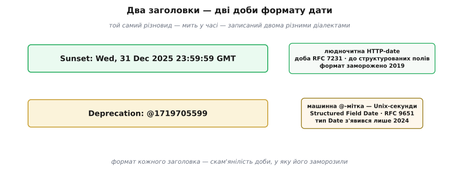

# 📜 Як навчили машину чути «це відходить»

Програма, що о третій ночі викликає ваш endpoint, глуха до людських слів. Запис у changelog, допис у блозі, лист інтеграторам — усе це долітає до **людини**, за дні чи тижні, якщо взагалі долітає. А код по той бік читає рівно одне: байти вашої HTTP-відповіді. Тому справжнє питання керованого прибирання ніколи не було «як оголосити» — оголошувати люди навчилися задовго до вебу. Воно вужче й важче: як сказати «це відходить» так, щоб почула **машина** — тієї ж миті, коли вона робить виклик?

Ця вставка — історія про те, як веб поволі домовився про це одне речення. І про те, чому домовитися забрало майже десятиліття, два окремі заголовки й два різні способи записати дату. Бо кінцевий результат — два рядки у відповіді, `Deprecation` і `Sunset`, — виглядає так очевидно, що легко проґавити, скільки суперечок і глухих кутів у ньому спресовано.

## До-стандартної доби кожен кричав по-своєму

Спершу заголовка не було зовсім, і кожен провайдер викручувався сам. Хто ставив власний `X-API-Deprecated: true`, хто `X-Deprecated`, хто `X-Sunset-Date` з датою в довільному вигляді — стільки варіантів, скільки команд. Решта каналів була людська: банер у документації, допис у блозі, розсилка на пошту зареєстрованих інтеграторів, рядок у changelog. Для людини це сяк-так працювало; для машини це був зоопарк.

І тут ховається пастка, яку легко недобачити. Сигнал, на який має **діяти програма**, вартий чогось лише тоді, коли скрізь означає те саме. Клієнт, що інтегрувався з п'ятьма API, мусив би розпізнавати п'ять різних позначок застарілості — власний заголовок у кожного, свій формат дати, свої слова. На практиці ніхто цього не робив: простіше було зігнорувати всі п'ять і дізнатися про поломку зі свіжого `500` у проді. Роздробленість — природний ворог машинного сигналу: коли кожен винаходить свою мітку, жодна з них не варта того, щоб клієнт узагалі її читав. Потрібен був **один** заголовок, спільний для всього вебу. Те, як довго й важко він народжувався, і є ця історія.

## Заголовок, що вже був, — і чому не підійшов

Найдивніше, що придатний на вигляд заголовок у HTTP **уже існував**. Специфікація кешування (RFC 7234, червень 2014 — усталений факт) визначала заголовок `Warning`, а в ньому — код **299 «Miscellaneous Persistent Warning»**, тобто «різне стійке попередження». «Стійке» означало, що воно не прив'язане до одного обміну й може висіти на відповіді довго; текст усередині — довільний, для показу людині або для логу. Виглядало як готова домівка для сигналу застарілості, і дехто справді болтом прикрутив деприкейшн саме сюди. Трапляється, наприклад, отаке (задокументована практика окремих провайдерів, як-от кадрові API UKG/UltiPro — звірено):

```http
Warning: 299 "https://api.example.com/v1/employees"
  "The API is deprecated and will be removed on Sat, 25 Aug 2012 00:00:00 GMT"
```

Систему керування кластерами Kubernetes теж свого часу навчили слати попередження саме через заголовок `Warning` з кодом 299 (звірено) — доказ, що технічно він **міг** нести такі сигнали.

Але позначкою застарілості для всього вебу він так і не став, і причини вросли в саму його специфікацію. Текст `Warning` — **дорадчий**, для ока людини або для логу, і стандарт прямо каже: отримувач **не повинен** робити з нього жодної автоматичної дії. Це рівно протилежне тому, чого треба від машинного сигналу. Далі — та сама роздробленість, лише під спільним ім'ям: текст довільний, тож у кожного провайдера `Warning` казав щось своє — хтось клав URL, хтось дату, хтось саму лише прозу, — і клієнт однаково не міг одноманітно вичитати «чи це застаріле й коли зникне». А наостанок — заголовок був заплутаний у семантику кешування, ним мали опікуватися кеші й проміжні вузли, які на практиці його просто не додавали.

Вирок виніс сам стандарт. Оновлена специфікація кешування (RFC 9111, червень 2022, що заступила RFC 7234 — звірено) **прибрала заголовок `Warning` цілком**, з формулюванням «його не генерують широко й не показують користувачам» (§5.5), а на практиці «кеші та проміжні вузли його не додавали» (Додаток B — звірено). Тобто найближчий наявний інструмент не просто не прижився для деприкейшну — його зняли з ужитку взагалі. Порожнечу треба було заповнити чимось, зробленим **під цю задачу навмисне**.

## Sunset: перша тверда позначка

Першу половину відповіді дав **Ерік Вільде** (Erik Wilde), давній учасник стандартів вебу й API. Його чернетка `draft-wilde-sunset-header-00` з'явилася **3 серпня 2015 року** (звірено за історією документа), пройшла чотири роки й одинадцять редакцій і стала **RFC 8594 у травні 2019-го** — зі статусом Informational, тобто «інформаційний», а не обов'язковий стандарт (звірено).

Заголовок `Sunset` (англ. «захід сонця») каже рівно одну річ — **позначку часу, коли ресурс, за очікуванням, стане недоступним**:

```http
Sunset: Sat, 31 Dec 2018 23:59:59 GMT
```

Формат — HTTP-date, класична мітка часу зі специфікації HTTP (RFC 7231), точнісінько такої форми, як давні `Date`, `Expires`, `Last-Modified`. Стандарт чесно попереджає: це **підказка**, а не гарантія — ресурс не зобов'язаний дожити рівно до цієї миті й не зобов'язаний зникнути одразу по ній. Разом із заголовком Вільде визначив і зв'язок-посилання `sunset`, щоб від відповіді можна було вказати на людську сторінку з подробицями.

Свідома вузькість `Sunset` — і є його суть. Він позначає **дату кінця** і мовчить про довгу середину: місяці, коли ресурс уже оголошено застарілим, а він ще працює точно як раніше. Саме в цій прогалині — між «оголосили» і «зникне» — і мав стати другий заголовок.

## Чому знадобився другий заголовок — і чому свідомо

Тут — головне проєктне рішення, на якому тримається вся практика: **застаріле й знято — це дві різні події**, тож їх розвели у два різні заголовки. `Sunset` — мить зникнення. `Deprecation` — мить оголошення, після якої ресурс ще живий.

Що це рішення свідоме, видно за самими датами. Чернетка `draft-dalal-deprecation-header-00` **Санджая Далала** (Sanjay Dalal) вийшла **27 лютого 2019 року** (звірено) — саме тоді, коли `Sunset` доходив до фінішу (остаточне обговорення наприкінці 2018-го, RFC у травні 2019-го). Тобто `Deprecation` замислювався не як заміна `Sunset`, а як його **напарник**: один заголовок називає дату зникнення, другий — момент, коли статус змінився на «застаріле».

Могло б здатися простішим не плодити сутностей, а дописати в `Sunset` якийсь прапорець «до речі, це вже застаріле». Але це стерло б саме те розрізнення, заради якого практика й існує. «Оголошення, що ще працює» і «дата, коли перестане відповідати» — різні за природою: перше вже настало й нічого не змінює в поведінці, друге лежить у майбутньому й обіцяє поломку. Злити їх в один заголовок — знову сплутати застаріле зі знятим, лише на рівні протоколу. Тому — дві події, два заголовки, кожен **необов'язковий** окремо: ресурс можна оголосити застарілим, ще не знаючи дати зняття; можна дати йому дату `Sunset`; а фінальний стандарт закріплює єдине правило, що їх пов'язує, — мітка в `Sunset` **не сміє** бути ранішою за мітку в `Deprecation` (звірено з тексту RFC 9745). Розділення — не незграбність, а модель, доведена до літери протоколу: якщо застаріле й знято — це два стани, то й сигналів має бути два.

## Майже десятиліття чернетки

Дорога `Deprecation` від чернетки до стандарту виявилася довгою навіть за мірками IETF. Ось її віхи (усі звірено за трекером документів):

```
Дорога заголовка Deprecation:
  2019-02-27  →  draft-dalal-deprecation-header-00 (перша чернетка, Далал)
  2020-12-24  →  прийнято робочою групою httpapi як
                 draft-ietf-httpapi-deprecation-header-00
  2024-09-27  →  остання редакція чернетки (-09)
  2025-03      →  RFC 9745, Standards Track; автори S. Dalal, E. Wilde
```

Шість років на сам лише `Deprecation`. А якщо взяти всю дугу машинного сигналу — від першої чернетки `Sunset` (серпень 2015) до готового RFC на `Deprecation` (березень 2025), — виходить майже рівно десятиліття. І крізь усю цю дугу тягнеться одна нитка: ім'я **Вільде стоїть під обома заголовками**. Ідею машинної позначки застарілості пронесла, по суті, та сама рука через десять років — спершу наодинці в `Sunset`, потім у парі з Далалом у `Deprecation`.


*Дві доріжки одного задуму. Угорі — Sunset (дата зникнення), унизу — Deprecation (мить застарілості); вони перетинаються близько 2019-го, де одна чернетка фінішує, а друга стартує. Посередині — поява типу Date у структурованих полях HTTP: без неї (RFC 8941) машинний формат був неможливий, з нею (RFC 9651) — став очевидним вибором для Deprecation.*

Чому один HTTP-заголовок їде десять років? Бо стандарт сумісності рухається зі швидкістю **згоди**, а не коду. Свій заголовок можна виставити за пообіддя; змусити його означати те саме для кожного клієнта, кеша й фреймворка на планеті — означає пересперечати кожен закуток. Що, як дати зняття ще нема? Як він в'яжеться з `Sunset`? З приреченим `Warning`? Які зв'язки-посилання ведуть на інструкцію з переходу? Яким статусом його випускати? `Sunset` вийшов Informational — «до відома», а `Deprecation` дотиснули аж до Standards Track — «стандарт, якого тримаються» (звірено). Десятиліття тут — не марнування, а ціна сигналу, вартого довіри саме тому, що про нього домовилися всі, а не хтось один.

## Чому в них різні формати дат — і що це виказує

І ось видимий шов усієї історії. Придивіться до двох заголовків, які вас закликають слати **разом**:

```http
Deprecation: @1719705599
Sunset: Wed, 31 Dec 2025 23:59:59 GMT
```

Обидва несуть той самий різновид відомостей — мить у часі. Але записані двома геть різними способами: `Deprecation` — Unix-міткою з символом `@` попереду, `Sunset` — людночитною HTTP-датою. Чому одне й те саме пишуть по-різному в двох сусідніх рядках?



*Формат кожного заголовка — скам'янілість доби, у яку його заморозили. Sunset говорить старим людночитним діалектом, бо 2019-го іншого просто не було; Deprecation говорить новим машинним, бо на 2025-й той нарешті з'явився.*

Причина — чистий збіг у часі; формати тут **скам'янілості** двох різних епох проєктування HTTP-полів.

`Sunset` (2015–2019) старший за структуровані поля HTTP узагалі. Єдиною сумісною міткою часу тоді була HTTP-date з RFC 7231 — її він і взяв: людночитну, тієї самої форми, якою HTTP писав `Date` й `Expires` споконвіку.

Найпоказовіше, що чернетка `Deprecation` **починалася так само**. Редакція `-01` визначала значення як `HTTP-date / "true"`, редакція `-02` — як `IMF-fixdate / "true"` (звірено): або людночитна дата, або голе слово `true`, коли дати зняття ще не знають. Тобто первісно вона дзеркалила те, що вже було.

А потім ґрунт зсунувся. Специфікація «Structured Field Values for HTTP» (RFC 8941, лютий 2021 — звірено) дала HTTP нарешті машинну граматику для значень полів. Та ось заковика: **типу дати в ній не було**. Тип Date додали лише в її наступниці — RFC 9651, вересень 2024 (звірено: тип Date новий саме в 9651, і поле, що посилається на старий 8941, ним скористатися не може). RFC 9745 замерз у березні 2025-го — за кілька місяців по тому, як тип дати нарешті з'явився на світ, — і потягся по найсвіжіший інструмент на полиці: **Structured Field Date**, той самий `@` плюс Unix-секунди. Машинний за самою будовою.

Отже, два формати — не недогляд і не примха. `Sunset` говорить старим людночитним діалектом, бо 2019-го іншого не існувало; `Deprecation` говорить новим машинним, бо до 2025-го той нарешті з'явився. Оте `@1719705599` — стільки ж мітка **моменту, коли писали специфікацію**, скільки й мітка будь-чого іншого: за самою формою значення можна прочитати історію того, як у HTTP навчилися проєктувати заголовки.

## Що лишає ця історія

Зберімо в одну думку. Машинний сигнал застарілості визрівав десятиліття не тому, що важко надіслати заголовок, — надіслати його можна за пообіддя. Важко було інше: щоб «це відходить» стало чимось, на що **діє програма**, весь веб мусив спершу домовитися, які взагалі бувають дві різні події, а тоді ще двічі домовитися, як записати дату.

Тому два заголовки й два формати — не безлад, який комусь колись «варто причесати». Це шви, на яких видно ту згоду. `Sunset` окремо від `Deprecation` — бо знято окремо від застарілого. `@`-мітка поруч із людночитною датою — бо один заголовок застав стару добу, а другий нову. Коли ваша відповідь несе `Deprecation: @…` і `Sunset: …GMT` пліч-о-пліч, вона несе десять років суперечок, наполегливість одного дослідника крізь обидва заголовки — і проєктне рішення, доведене до літери: **застаріле — це не знято**, і найкращий доказ тому, що сказати це вимагало аж двох окремих заголовків.
