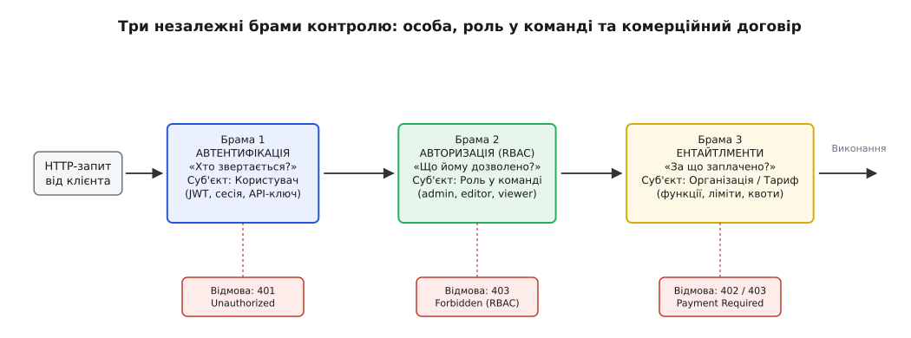
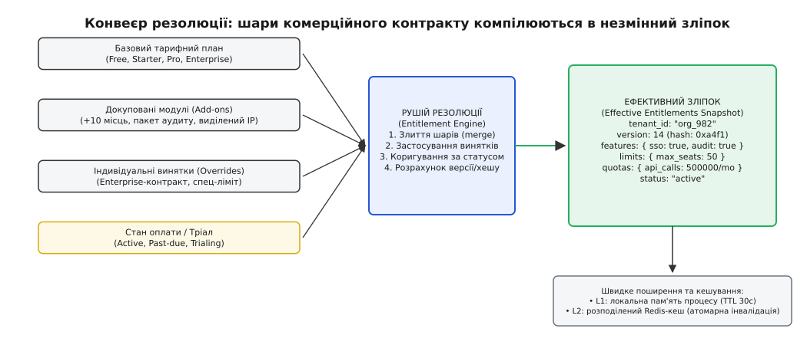
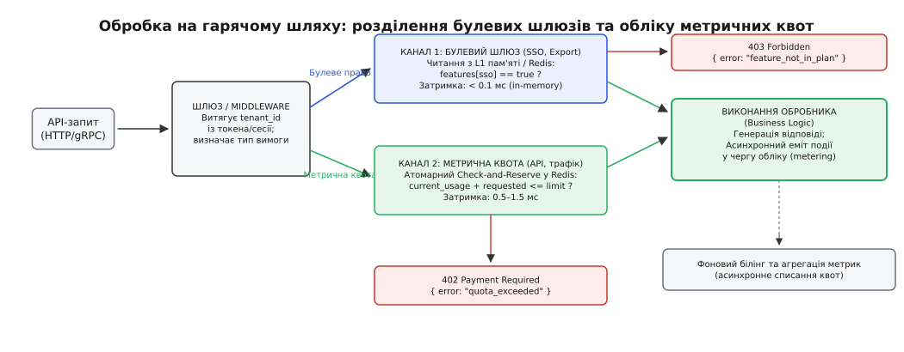
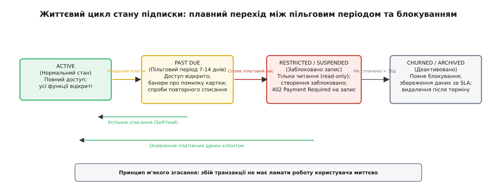

# Ентайтлменти і feature-gating за планом

<preknowlist>
- [Моделі авторизації](topic:programming/authorization-models) — автентифікація та авторизація (RBAC, ABAC) визначають, хто користувач і які дії йому дозволені всередині організації, але не знають комерційних умов її контракту.
- [REST](topic:programming/rest-api) — структура HTTP-запитів, семантика кодів 402 Payment Required і 403 Forbidden та машинночитні формати помилок.
- [Прапорці функцій](topic:programming/feature-flags) — динамічне перемикання коду в рантаймі для релізів чи експериментів; ентайтлменти використовують подібну техніку замикання, але прив'язують її до платіжного плану.
- [Metering і billing як вузол](topic:programming/metering-and-billing) — як працює облік використання ресурсів, тарифікація та агрегація спожитих одиниць.
- [Сесія автентифікації](topic:programming/session-management) — збереження контексту користувача та ідентифікатора організації (tenant_id) між HTTP-запитами.
</preknowlist>

Компанія Acme підписує річний контракт на використання корпоративної платформи. Умови індивідуальні: 50 робочих місць, 500 000 викликів API на місяць, протокол SAML SSO для входу та збереження журналів аудиту протягом 90 днів. Розробники бекенду поспішають і вставляють перевірку тарифу прямо в обробник створення користувача: `if (tenant.plan == 'pro')`. За три місяці відділ маркетингу перейменовує тариф `pro` на `growth`, комерційний відділ продає клієнту додатковий пакет на 20 місць як окреме доповнення, у частини клієнтів завершується термін дії банківської картки й платіж зависає, а для великого корпоративного замовника інженери додають спеціальний дозвіл на вивантаження звітів.

Код системи миттєво перетворюється на клубок розгалужень `if/else`, де перевіряються назви тарифів, комбінації прапорців у базі даних і статуси рахунків у сторонньому платіжному шлюзі. Щойно зовнішній платіжний сервіс зазнає збою чи збільшує час відповіді, кожен HTTP-запит клієнта зависає на сотні мілісекунд або падає з помилкою. Коли ж користувач вирішує перейти на нижчий тариф, сервіс ламається, бо 30 наявних проєктів більше не вміщаються в новий ліміт із 10 дозволених, і система не знає, які з них слід заблокувати, а які залишити доступними.

Цей хаос виникає через змішування трьох різних понять: хто користувач, що йому дозволено в команді та за які саме можливості й обсяги ресурсів заплатила його організація. Відокремлення комерційного права від коду бізнес-логіки та білінгової інфраструктури — це задача системи **ентайтлментів** (англ. *entitlement* — право, повноваження, від ст.-фр. *entiteler* — надавати законне право чи титул; англ. *feature-gating* — замикання функціональності через контрольні шлюзи).

## Три різні брами: автентифікація, авторизація та ентайтлменти

Щоб зрозуміти місце ентайтлментів в архітектурі бекенду, слід чітко розмежувати три послідовні перевірки, через які проходить кожен вхідний запит.


*Три незалежні перевірки в суворому порядку: спершу встановлюється особа (автентифікація), потім перевіряються повноваження користувача в організації (авторизація), і лише на третьому кроці з'ясовується, чи оплатила організація доступ до цієї можливості або обсягу ресурсів (ентайтлменти).*

Перша брама — **автентифікація** (гр. *authentikós* — справжній). Вона відповідає на питання «хто ти?» і перевіряє криптографічний доказ особи: пароль, сесійну куку, підпис [JWT-токена](topic:programming/jwt-tokens) чи API-ключ. Суб'єктом перевірки тут є конкретний користувач або сервісний обліковий запис. Якщо доказ недійсний або термін його дії минув, запит негайно відхиляється зі статусним кодом `401 Unauthorized`.

Друга брама — **авторизація** (лат. *auctoritas* — влада, вплив). Вона відповідає на питання «що тобі дозволено робити в цій команді?». Суб'єктом перевірки є роль або набір прав користувача всередині простору організації: наприклад, адміністратор, редактор чи спостерігач у моделях [RBAC або ReBAC](topic:programming/authorization-models). Адміністратор має право створювати нові API-ключі або змінювати налаштування інтеграцій, тоді як спостерігач може лише читати наявні документи. Якщо користувач не має потрібних повноважень для цієї дії, запит повертає `403 Forbidden`.

Третя брама — **ентайтлменти**. Вона відповідає на суто комерційне договірне питання: «чи придбала ця організація право на використання цієї конкретної можливості або чи не вичерпала вона оплачену квоту використання?». Суб'єктом перевірки тут виступає не окрема людина, а **організація в цілому** (*tenant*) або її активний комерційний договір (*subscription contract*).

Змішування другої та третьої брами — найпоширеніша помилка проєктування корпоративних систем. Якщо головний інженер організації намагається налаштувати корпоративний SAML SSO на безкоштовному тарифі `free`, авторизація (RBAC) відповідає «так», оскільки він є повноправним адміністратором і має повноваження керувати безпекою організації. Проте перевірка ентайтлментів відповідає «ні», оскільки поточний тарифний договір компанії не містить ліцензії на функціонал SSO.

Розділення цих трьох контурів забезпечує незалежність і масштабованість архітектури:
1. **Ізоляція організаційної структури:** зміна ролей, звільнення співробітників чи передача прав власності всередині компанії не зачіпають комерційний договір і діючі ліміти платформи.
2. **Гнучкість продуктової упаковки:** зміна тарифних планів, цін, запуск промо-акцій чи створення нових пакетів розширень не вимагає переписування правил доступу користувачів і не вносить змін у бізнес-код сервісів.
3. **Абстракція можливостей:** бізнес-логіка застосунку оперує чистими системними можливостями (`can_use_sso`, `max_seats`, `api_rate_limit`), залишаючись повністю ізольованою від комерційних назв на кшталт «Тариф Enterprise Plus 2026».

## Анатомія комерційного права: три типи обмежень

Комерційне право організації в системі ніколи не зводиться до одного єдиного прапорця. У сучасному веб-бекенді ентайтлменти поділяються на три принципово різні категорії, кожна з яких має власну семантику перевірки, місце зберігання та ціну обчислення на гарячому шляху.

```
┌────────────────────────────────────────────────────────────────────────┐
│                        ТИПИ ЕНТАЙТЛМЕНТІВ                              │
├───────────────────┬──────────────────────────┬─────────────────────────┤
│ 1. Булеві шлюзи   │ 2. Статичні ліміти       │ 3. Метричні квоти       │
│ (Feature Gates)   │ (Static Limits)          │ (Metered Quotas)        │
├───────────────────┼──────────────────────────┼─────────────────────────┤
│ • SAML SSO        │ • Макс. кількість місць  │ • Запити API на місяць  │
│ • Власні домени   │ • Макс. кількість проєктів│ • Обсяг сховища (GB)   │
│ • Журнали аудиту  │ • Кількість середовищ    │ • Згенеровані звіти     │
│                   │                          │                         │
│ Перевірка:        │ Перевірка:               │ Перевірка:              │
│ In-memory O(1)    │ Під час створення об'єкта│ Атомарний лічильник     │
│ true / false      │ count(items) < limit     │ usage + req <= quota    │
└───────────────────┴──────────────────────────┴─────────────────────────┘
```

### 1. Булеві функціональні шлюзи (Feature Gates)

Булевий шлюз регулює доступ до конкретної якісної можливості продукту за принципом увімкнено або вимкнено. Наприклад: експорт аналітичних звітів у формат CSV, інтеграція з корпоративним каталогом Active Directory, створення вебхуків чи надання виділеної IP-адреси.

Булеве право не залежить від кількості створених сутностей чи обсягу трафіку. Воно перевіряється в оперативній пам'яті за константний час `O(1)`: якщо прапорець `features.custom_domains == true`, шлюз пропускає запит; якщо `false` — повертає помилку про відсутність функції в поточному плані. Булеві шлюзи не мають лічильників і не скидаються з часом.

### 2. Статичні структурні ліміти (Static / Quantity Limits)

Статичний ліміт визначає максимальну дозволену кількість постійних сутностей, які організація може створити й утримувати одночасно. Наприклад: до 5 учасників у команді на тарифі Starter і до 50 на тарифі Pro; не більше 3 активних проєктів; максимум 2 виробничих середовища.

Статичний ліміт перевіряється **виключно в момент спроби створення нового об'єкта** (наприклад, під час відправки інвайту новому користувачеві або створення проєкту через `POST /api/v1/projects`). Перевірка зводиться до транзакційного інваріанта:

```
поточна_кількість_активних_сутностей < дозволений_статичний_ліміт
```

Після створення об'єкта ліміт більше не перевіряється на кожному читанні чи редагуванні. Статичний ліміт не скидається на початку календарного місяця — він діє постійно, доки сутність існує в базі даних. Якщо користувач видаляє старий проєкт, лічильник зменшується, і звільняється місце для створення нового.

### 3. Метричні часові квоти (Metered / Consumption Quotas)

Метрична квота (лат. *quota* — яка частина, частка) обмежує обсяг споживання динамічних ресурсів за фіксований проміжок часу або в абсолютному вимірі. Наприклад: 100 000 викликів API за календарний місяць, 50 гігабайтів дискового простору, 1 000 відправлених SMS-сповіщень або 200 годин роботи відеосервера.

На відміну від статичних лімітів, метрична квота має період дії (вікно скидання) та вимагає високошвидкісного обліку. Щоразу, коли клієнт виконує операцію, система повинна:
1. Перевірити, чи не перевищує накопичене споживання поточний ліміт.
2. Атомарно збільшити лічильник споживання на обсяг виконаної роботи.
3. Обнулити або зсунути лічильник, коли настає новий розрахунковий період (наприклад, 1-ше число кожного місяця).

Ця категорія прав створює найбільше інженерне навантаження, оскільки вимагає швидкого узгодженого лічильника на гарячому шляху виконання запитів без блокування основної бази даних.

## Конвеєр резолюції: від тарифного плану до незмінного зліпка

Чому не можна просто зберігати фінальні права прямо в таблиці організації в базі даних? Тому що комерційні умови в реальному бізнесі динамічні й багатошарові.

У будь-який момент часу права клієнта формуються під впливом кількох незалежних джерел:
- **Базовий тариф (Base Plan):** визначає стандартний набір прав за замовчуванням.
- **Докуповані модулі (Add-ons):** клієнт може бути на тарифі Pro (де ліміт 10 користувачів) і докупити два додаткових пакети `+5 seats`, отримавши сумарний ліміт 20 місць.
- **Індивідуальні винятки контракту (Enterprise Overrides):** відділ продажів підписав договір із великим банком, надавши йому безлімітний аудит-лог на тарифі Pro без переведення на дорожчий план.
- **Промо-акції та тріали (Trials & Feature Grants):** клієнту на 14 днів безкоштовно ввімкнули модуль аналітики для ознайомлення.
- **Платіжний статус (Subscription State & Dunning):** картка клієнта не спрацювала, розпочався пільговий період.

Якщо записувати всі ці зміни прямо в одну спільну таблицю, будь-яка зміна умов базового плану (наприклад, збільшення базової квоти для всіх клієнтів Pro) вимагатиме важкої міграції мільйонів рядків у базі даних, під час якої легко затерти індивідуальні знижки чи куплені аддони.

Замість цього застосовують **конвеєр резолюції** (англ. *resolution pipeline*). Це чиста детермінована функція, яка збирає всі комерційні шари за визначеними правилами пріоритету й компілює їх у компактний незмінний об'єкт — **ефективний зліпок прав** (*Effective Entitlements Snapshot*).


*Конвеєр резолюції бере базовий план, додає куплені модулі, накладає індивідуальні винятки контракту та враховує статус оплати. Результат компілюється в один незмінний версіонований зліпок, який кешується в пам'яті для швидких перевірок.*

Правила накладання рівнів у конвеєрі підпорядковуються чіткій ієрархії:

```
[Базовий план] ──► + [Куплені Add-ons] ──► + [Контрактні Overrides] ──► [Фільтр статусу] ──► [Ефективний зліпок]
```

1. **Ініціалізація:** за основу беруться значення за замовчуванням із базового плану організації (`plan.features`, `plan.limits`, `plan.quotas`).
2. **Агрегація доповнень (Add-ons):** для кожного активного доповнення булеві прапорці об'єднуються через логічне «АБО» (`feature = feature || addon.feature`), а числові ліміти та квоти сумуються (`limit = limit + addon.increment`).
3. **Застосування винятків (Overrides):** індивідуальні налаштування клієнта мають найвищий пріоритет і примусово перезаписують будь-які попередні значення.
4. **Модифікація за платіжним статусом:** якщо підписка скасована або пільговий період після невдалої оплати вичерпано, конвеєр встановлює прапорець `is_read_only = true` або вимикає всі платні функції.
5. **Генерація версії та хешу:** зліпок отримує монотонний номер версії або хеш вмісту, що дозволяє інстансам веб-серверів миттєво перевіряти свіжість кешу.

Детальний приклад реалізації такого конвеєра наведено у вставці [рушій резолюції та перевірки прав](topic:programming/entitlements/proj-entitlement-engine.md).

Головна властивість скомпільованого зліпка — **незмінність** (*immutability*). Після створення зліпок не модифікується в пам'яті. Коли клієнт змінює тариф чи докуповує послугу, конвеєр генерує новий зліпок із новою версією, а старий просто витісняється з кешу.

## Перевірка на гарячому шляху: швидкість і дворівневе кешування

HTTP-запити до веб-бекенду надходять тисячами на секунду. Якщо кожна перевірка права вимагатиме запиту до SQL-бази даних або розрахунку всього конвеєра резолюції, затримка сервісу (*latency*) зросте в рази.

Щоб перевірка тривала менше 0.1 мілісекунди, систему будують за схемою дворівневого кешування з розподілом на два незалежні канали перевірки:


*Розділення обробки на гарячому шляху: булеві шлюзи перевіряються з локальної пам'яті процесу за частки мікросекунди, а метричні квоти проходять через атомарний лічильник Redis. Успішний запит виконує бізнес-логіку та асинхронно відправляє подію в чергу обліку.*

### Дворівневий кеш зліпків (L1 / L2)

- **L1 (In-Process Memory):** кожен окремий процес веб-сервера тримає недавні зліпки активних організацій у локальній оперативній пам'яті (наприклад, у LRU-кеші). Час звернення становить менше 1 мікросекунди й не потребує жодних мережевих викликів. Час життя запису (*TTL*) становить від 15 до 60 секунд.
- **L2 (Distributed Redis Cache):** спільний для всіх інстансів розподілений кеш у Redis. Тут зберігаються серіалізовані зліпки всіх організацій. Коли платіжний сервіс оновлює тариф, він відправляє команду `DEL entitlement:snapshot:{tenant_id}` або публікує повідомлення в Redis Pub/Sub, змушуючи всі інстанси скинути локальний L1-кеш.

### Канал 1: Швидкий шлях для булевих прав (Fast Path)

Для перевірки булевих можливостей (наприклад, чи доступний експорт аудиту) проміжний шар (*middleware*) витягує `tenant_id` із сесії або токена, бере зліпок із L1-кешу й перевіряє потрібний прапорець:

```
if (!snapshot.features["audit_logs"]) {
    return 403 Forbidden;
}
```

Жодного блокування чи звернення до зовнішніх служб не відбувається. Якщо прапорець увімкнено, запит негайно передається наступному обробнику бізнес-логіки.

### Канал 2: Метричний облік та атомарне резервування (Metered Quota Path)

Для операцій, обмежених періодичними квотами (наприклад, відправка повідомлення або запуск обчислювальної задачі), самої перевірки зліпка замало: треба перевірити поточний стан накопичувального лічильника.

Тут криється небезпека стану гонитви (*race condition*). Якщо два паралельні запити одночасно прочитають, що залишився 1 доступний запит, обидва вирішать, що ліміт не вичерпано, і виконають операцію, перевищивши оплачену квоту.

Цю проблему розв'язують за допомогою патерну **Check-and-Reserve** через атомарний Lua-скрипт у Redis:
1. Скрипт в одній неподільній транзакції читає поточний лічильник за поточний місяць.
2. Якщо `поточне_споживання + запит <= квота`, збільшує лічильник на запитану кількість одиниць і повертає успіх разом з унікальним `reservation_id`.
3. Якщо квоту вичерпано, повертає відмову без збільшення лічильника.

Якщо після успішного резервування бізнес-операція зазнає аварії всередині сервісу (наприклад, упав зовнішній провайдер розсилки), застосунок викликає операцію повернення квоти (*release*), яка повертає зарезервовані одиниці назад у лічильник.

### Асинхронний облік проти синхронної перевірки

Чи потрібно кожну операцію проводити через синхронний лічильник? Ні. Якщо сервіс обробляє мільйони дрібних аналітичних подій, синхронне звернення до Redis на кожну подію стане вузьким місцем інфраструктури.

У таких системах застосовують комбінований підхід:
- **Попередня перевірка грубих лімітів:** запит перевіряє зліпок і наближений стан лічильника з кешу.
- **Асинхронний облік споживання:** після успішного виконання обробник публікує подію `usage.recorded` у [чергу задач](topic:programming/background-jobs) або Kafka. Фоновий воркер підсистеми [метрингу та білінгу](topic:programming/metering-and-billing) вичитує події пачками й оновлює агреговані лічильники в базі даних.

## Прокидання контексту прав у мікросервісній архітектурі

У розподілених системах, де запит проходить крізь ланцюжок із кількох внутрішніх мікросервісів (API Gateway → Auth Service → Orders Service → Notification Service), виникає питання: як передавати інформацію про права між сервісами?

Існують два підходи:

1. **Централізована перевірка на шлюзі (Gateway Enforcement):** API Gateway виконує перевірку ентайтлментів на вході в периметр і блокує несанкціоновані запити до того, як вони досягнуть внутрішніх сервісів. Внутрішні сервіси отримують запит як гарантовано дозволений.
2. **Контекстне прокидання заголовків (Header Propagation):** шлюз додає до внутрішніх gRPC/HTTP-запитів службові заголовки:
   - `X-Tenant-Id: org_982bca10`
   - `X-Entitlement-Version: 1724112000`
   - `X-Entitlement-Features: sso,audit_logs,export_csv`

Внутрішній мікросервіс розбирає цей заголовок і миттєво перевіряє право без звернення до бази даних. Якщо ж сервісу потрібна свіжа перевірка динамічної квоти, він звертається до локального клієнта служби ентайтлментів.

## Вікна скидання квот: календарний місяць проти ковзного вікна

Метричні квоти мають періодичність. Вибір типу часового вікна суттєво впливає на інфраструктуру та користувацький досвід.

```
А. Календарний місяць (Фіксоване вікно):
|── Травень ─── 99k / 100k ──► Скидання 1 червня ──► 0k / 100k ──|
Проблема: сплеск навантаження 31 травня та 1 червня о 00:00.

Б. Розрахунковий період підписки (Billing Anniversary):
|── 14 травня ───► Скидання 14 червня ───► Скидання 14 липня ──|
Перевага: розмазує моменти скидання лічильників рівномірно по днях місяця.
```

1. **Фіксований календарний місяць (Fixed Calendar Month):** лічильник скидається 1-го числа о 00:00:00 UTC. Недолік — явище «першого числа», коли мільйони лічильників обнуляються одночасно, а черги генерації звітів зазнають сплеску навантаження.
2. **Розрахунковий цикл підписки (Billing Cycle Anniversary):** лічильник прив'язаний до дня оформлення підписки (наприклад, з 17-го числа одного місяця по 17-те число наступного). Це рівномірно розподіляє навантаження на систему обліку протягом усього місяця.

## Ієрархія корпоративних акаунтів і пули ресурсів

У сегменті корпоративних продажів (B2B Enterprise) клієнт рідко є монолітною організацією. Зазвичай замовник має багаторівневу структуру: материнська компанія (*Parent Org*), дочірні філії (*Subsidiaries*), регіональні робочі простори (*Workspaces*) та окремі інженерні проєкти.

У такій структурі виникає задача розподілу ресурсів (*Resource Pooling*). Наприклад, материнська компанія купує загальний контракт на 1 000 робочих місць і 10 000 000 викликів API на рік.

Рушій ентайтлментів підтримує два способи організації прав у такій ієрархії:
- **Спільний глобальний пул (Shared Org Pool):** усі дочірні простори черпають ресурси з єдиного лічильника материнської організації. Перевага — максимальна утилізація оплаченого обсягу; недолік — один ненажерливий підрозділ може вичерпати квоту всієї корпорації.
- **Виділені суб-ліміти (Allocated Sub-Quotas):** адміністратор головної компанії виділяє фіксовані квоти для кожного дочірнього простору (наприклад, 200 місць для відділу Європи, 300 для США). Рушій резолюції розглядає дочірній простір як окремого споживача з власним зліпком прав, валідуючи суму виділених лімітів проти контракту материнської компанії.

## Версіонування тарифних планів та «дідусеві» умови

З часом бізнес-модель компанії еволюціонує: змінюються ціни, з'являються нові тарифи, а старі пакети закриваються для нових підписок. Проте клієнти, які підписалися три роки тому, мають зберегти свої початкові умови за контрактом. Це явище в продуктовій інженерії називають **дідусевими умовами** (англ. *grandfathering*).

Щоб підтримувати паралельне існування сотень старих і нових комерційних пакетів без дублювання коду, застосовують **каталог незмінних версій тарифів**:

```
plan_pro_v2023 ──► features: { sso: false, audit: true }, limits: { seats: 10 }
plan_pro_v2025 ──► features: { sso: true,  audit: true }, limits: { seats: 15 }
plan_pro_v2026 ──► features: { sso: true,  audit: true }, limits: { seats: 20 }
```

Контракт організації зберігає посилання не на абстрактний `plan_pro`, а на конкретну зафіксовану версію `plan_pro_v2023`. Нові клієнти автоматично отримують актуальну версію `plan_pro_v2026`, тоді як старі користувачі продовжують працювати за умовами свого підписаного договору. Конвеєр резолюції однаково швидко компілює зліпок як для старих, так і для нових версій без потреби створювати окремі гілки в коді бізнес-логіки.

## Реакція на обмеження: жорсткі ворота, м'який ліміт та овердрафт

Коли організація досягає межі тарифного плану або намагається використати недоступну функцію, система має відреагувати передбачувано як для користувача, так і для клієнтських програм.

У веб-архітектурі застосовують три стратегії обмеження доступу:

### 1. Жорсткі ворота (Hard Gating)

Запит негайно блокується з відповідним HTTP-кодом:
- `403 Forbidden` — для функцій, які в принципі не входять до поточного тарифного плану (наприклад, спроба викликати API управління SSO на базовому тарифі).
- `402 Payment Required` — для вичерпаних періодичних квот або заблокованих через несплату акаунтів.

Відповідь обов'язково повинна містити структурований машиночитний контракт помилки (за стандартом RFC 7807), щоб клієнтський фронтенд або сторонній інтегратор розуміли причину відмови й могли показати користувачеві кнопку переходу на вищий тариф. Специфікація цих форматів описана у вставці [інтерфейс служби ентайтлментів та схеми помилок](topic:programming/entitlements/api-entitlements.md).

### 2. М'які ворота та понаднормове споживання (Soft Gating & Overage Billing)

Для критично важливих бізнес-сервісів (наприклад, платіжні транзакції в інтернет-магазині або прийом замовлень) раптове жорстке блокування API посеред робочого дня неприпустиме. Якщо клієнт перевищив місячний ліміт у 100 000 запитів, зупинка його бізнесу викличе конфлікт і відтік клієнта (*churn*).

У таких випадках налаштовують режим м'якого обмеження:
- Сервіс продовжує приймати й обслуговувати запити понад ліміт.
- Усі понаднормові запити тарифікуються за окремою ставкою (*overage rate*, наприклад $5 за кожні додаткові 1 000 запитів), яка додається до наступного рахунку.
- У відповідях клієнту повертаються інформаційні HTTP-заголовки `X-Entitlement-Warning: Quota exceeded, overage charges apply`.
- Адміністраторам надсилається автоматичне сповіщення про перевищення порогу.

### 3. Розділення операцій читання та запису (Read vs Write Gating)

Коли компанія перевищує ліміт місць або статичний ліміт проєктів, система блокує **лише операції запису та створення нових ресурсів** (`POST`, `PUT`, `DELETE`).

Усі операції читання (`GET`) залишаються повністю працездатними: користувачі можуть переглядати свої існуючі проєкти, експортувати дані й читати звіти. Це захищає користувача від втрати доступу до власної інформації та дає час на спокійне оновлення тарифу.

## Життєвий цикл підписки: несплата, пільговий період і даунгрейд

Комерційний договір у SaaS — це не статичний стан, а безперервний життєвий цикл із переходом між різними фінансовими фазами.


*Життєвий цикл стану підписки: помилка оплати переводить клієнта в пільговий період, під час якого сервіс продовжує працювати. Лише після вичерпання пільгового часу вмикається обмеження функціоналу.*

### Процес повернення заборгованості (Dunning & Grace Period)

У підписному бізнесі банківські картки регулярно втрачають чинність, змінюються або тимчасово блокуються банком. Процес взаємодії з клієнтом щодо оновлення платіжних даних і повторних спроб списання коштів називають **даннінгом** (англ. *dunning*, від *to dun* — наполегливо вимагати сплати боргу).

Якщо чергове щомісячне списання зазнало невдачі, сервіс не повинен миттєво вимикати клієнту доступ. Замість цього система переводить організацію в стан **пільгового періоду** (*Grace period*, зазвичай від 7 до 14 днів):
1. Конвеєр резолюції встановлює статус `past_due`, але зберігає повний функціональний доступ відкритим.
2. В інтерфейсі користувача з'являються інформаційні банери з проханням оновити реквізити картки.
3. Платіжна система за розкладом повторює спроби списання (наприклад, на 1-й, 3-й і 7-й день).
4. Якщо платіж успішно проходить, статус автоматично повертається в `active` без жодного втручання інженерів.
5. Якщо після закінчення пільгового терміну рахунок лишається неоплаченим, конвеєр переводить організацію в статус `restricted` або `suspended`, вимикаючи всі операції запису та платні функції.

### Проблема зниження тарифу (Downgrade Invariants)

Одна з найважчих інженерних задач в управлінні правами — обробка переходу на нижчий тарифний план (*downgrade*).

Уявімо ситуацію: компанія перебувала на тарифі Pro і створила 45 активних проєктів при ліміті 50. Наприкінці місяця компанія вирішує перейти на тариф Starter, де дозволено лише 10 проєктів.

Що повинна зробити система з наявними 45 проєктами?
- **Руйнівне видалення 35 проєктів неприпустиме:** це призведе до безповоротної втрати даних клієнта та юридичних позовів.
- **Блокування випадкових 35 проєктів неприпустиме:** користувач не знатиме, які саме проєкти стануть недоступними.

Правильна архітектурна стратегія полягає в принципі **блокування надлишку на запис** (*soft-lock / read-only excess*):
1. Усі 45 створених раніше проєктів залишаються збереженими й доступними для читання та перегляду.
2. Спроба створити 46-й проєкт блокується статичним лімітом: `45 >= 10`.
3. Якщо клієнт самостійно видалить 5 проєктів (залишиться 40), спроба створити новий все одно блокуватиметься, оскільки `40 >= 10`.
4. Створення нових проєктів стане можливим лише тоді, коли кількість активних проєктів опуститься нижче нового ліміту (менше 10).

Такий підхід захищає дані користувача, не порушує цілісність системи й мотивує клієнта повернутися на вищий тариф, якщо йому знову знадобиться створювати нові ресурси.

## Синхронізація та події змін

Служба ентайтлментів тісно пов'язана з білінговою інфраструктурою, але повинна залишатися повністю автономною під час відмови сторонніх платіжних шлюзів (Stripe, Chargebee, Braintree).

Для цього зв'язок між білінгом та ентайтлментами організовують за подійно-орієнтованою моделлю (*event-driven architecture*):

```
[Платіжний шлюз] ──(Webhook)──► [Воркер білінгу] ──► [Оновлення БД] ──► [Шина подій] ──► [Інвалідація L1/L2]
```

1. **Отримання вебхука:** коли клієнт оплачує рахунок або змінює тариф, платіжний шлюз надсилає [вебхук](topic:programming/webhooks) (наприклад, `customer.subscription.updated`).
2. **Ідемпотентна обробка:** сервіс верифікує підпис вебхука, перевіряє [ідемпотентність](topic:programming/api-idempotency) за ідентифікатором події та оновлює стан контракту в базі даних.
3. **Рекомпіляція зліпка:** конвеєр резолюції перераховує новий ефективний зліпок прав для цієї організації та записує його в базу даних і Redis.
4. **Публікація події інвалідації:** у шину повідомлень емітиться подія `entitlement.snapshot_updated`.
5. **Очищення локальних кешів:** усі запущені інстанси веб-сервера вичитують цю подію та негайно видаляють застарілий зліпок зі своєї локальної пам'яті L1. Наступний же вхідний запит від клієнта читає свіжий зліпок з новими правами.

Така архітектура гарантує, що навіть повна недоступність зовнішнього платіжного провайдера не заважає системі обслуговувати мільйони запитів користувачів, оскільки всі рішення щодо доступу приймаються на основі локально збережених і кешованих зліпків.
