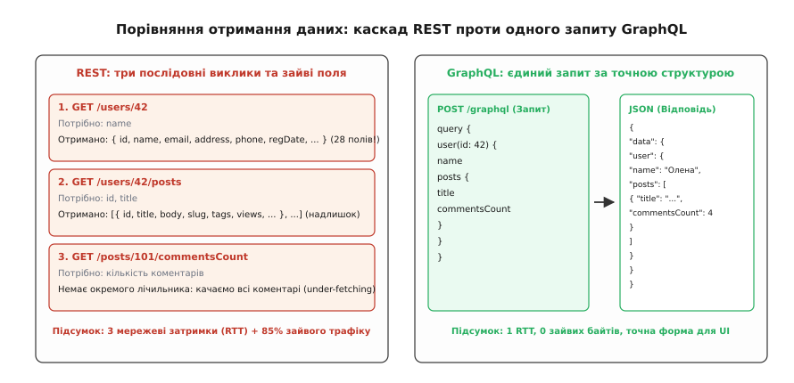
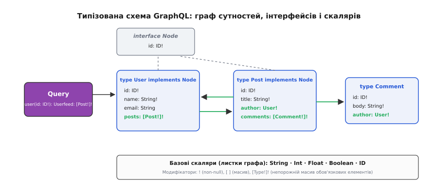
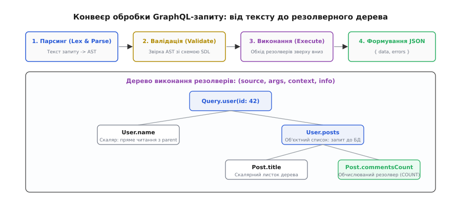
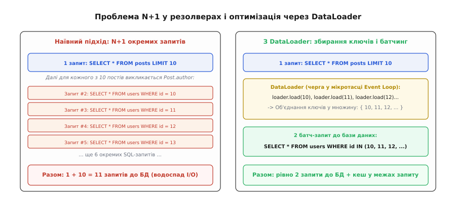

# GraphQL

<preknowlist>
- [HTTP](book:programming/http) — базовий транспортний протокол вебу: методи, заголовки, тіло запиту, коди стану відповіді та механізми з'єднання.
- [REST](book:programming/rest-api) — ресурсний стиль побудови серверних інтерфейсів із фіксованими кінцевими точками (endpoints) та однорідним набором дієслів HTTP.
- [JSON](book:programming/json-format) — текстовий формат серіалізації даних у вигляді деревоподібних об'єктів ключ-значення та списків.
- [BFF (backend-for-frontend)](book:programming/bff-pattern) — архітектурний патерн створення проміжних серверних прошарків під специфічні потреби конкретних клієнтських інтерфейсів.
</preknowlist>

Уявімо типову мобільну стрічку новин у смартфоні: на одному екрані користувач бачить список дописів, ім'я та аватар кожного автора, прев'ю прикріплених зображень, лічильники вподобань і гілки останніх коментарів. Коли мобільний клієнт підключається через нестабільну стільникову мережу із затримкою 300–600 мілісекунд на кожне TCP-з'єднання, спроба завантажити такий екран через класичний REST-інтерфейс перетворюється на каскад проблем: клієнту доводиться робити послідовний ланцюжок із 15–20 окремих HTTP-запитів до різних кінцевих точок (`/feed`, `/users/{id}`, `/posts/{id}/comments`), чекаючи завершення кожного перед початком наступного.

Спроба подолати цей каскад через створення спеціальних «великих» серверних ендпоінтів (`/mobile-feed-v1`) призводить до протилежної біди — надлишкового завантаження даних (over-fetching). Сервер віддає гігантський JSON-документ на сотні кілобайтів, що містить повні адреси користувачів, службові налаштування, геомітки та десятки інших полів, які маленький екран телефона навіть не відображає. Мобільний пристрій витрачає заряд акумулятора на передачу непотрібних байтів радіоканалом та парсинг зайвих структур у пам'яті, а будь-яка зміна дизайну кнопки чи списку вимагає нового релізу та узгодження бекенд-коду.

**GraphQL** (англ. *Graph Query Language* — «мова запитів до графів») докорінно змінює цю взаємодію: замість фіксованих серверних відповідей клієнт сам надсилає декларативний запит, у якому описує точну форму та набір полів, потрібних для поточного візуального компонента, а сервер повертає дзеркальну за формою JSON-відповідь за один мережевий обмін. Розберімо внутрішню механіку цього протоколу: від синтаксису схеми та конвеєра парсингу AST до алгоритмів обходу дерева резолверів, вирішення проблеми N+1, підходів Schema-First проти Code-First, колокації фрагментів, курсорної пагінації Relay, інкрементальної доставки `@defer`, спостережливості, розподіленої федерації, кешування та захисту від вичерпання ресурсів.

---

### Анатомія запиту: форма виходу за формою входу

Головна відмінність GraphQL від традиційного REST полягає в тому, хто саме диктує контракт даних. У REST форму відповіді визначає автор бекенду, закріплюючи її за конкретною URL-адресою. У GraphQL бекенд надає строго типізовану схему можливостей, а точну вибірку даних визначає клієнт.

Усі запити до GraphQL-сервера зазвичай надсилаються методом `POST` на єдину кінцеву точку (зазвичай `/graphql`). Тіло запиту містить текстовий документ мовою GraphQL.

Погляньмо на найпростіший приклад запиту на читання даних:

```graphql
query GetUserProfile {
  user(id: "42") {
    name
    avatarUrl(size: 64)
    posts(limit: 2) {
      title
      commentsCount
    }
  }
}
```

У відповідь сервер повертає JSON-документ, форма якого буквально повторює ієрархію надісланого запиту:

```json
{
  "data": {
    "user": {
      "name": "Олена",
      "avatarUrl": "https://cdn.example.com/avatars/42_64.png",
      "posts": [
        { "title": "Вступ до розподілених систем", "commentsCount": 12 },
        { "title": "Як працює пам'ять у C++", "commentsCount": 5 }
      ]
    }
  }
}
```

У цьому обміні реалізується принцип **дзеркальності форми**: клієнт бачить структуру результату ще до надсилання запиту. Клієнт не отримує жодного поля, якого він явно не попросив, що повністю виключає over-fetching. Водночас запит перетинає зв'язки між сутностями («користувач → його публікації → лічильник коментарів») у межах одного звернення, що усуває under-fetching і каскади мережевих очікувань.

Специфікація GraphQL виділяє три кореневі типи операцій:
1. **Query** (читання): операція отримання даних без побічних ефектів. Поля одного рівня всередині `Query` можуть обчислюватися сервером паралельно.
2. **Mutation** (зміна стану): операція створення, оновлення або видалення даних. На відміну від REST, де для отримання результату після `POST` інколи потрібен додатковий `GET`, мутація GraphQL одразу повертає оновлені поля сутності у бажаній формі. Кореневі поля мутації виконуються сервером суворо послідовно одне за одним.
3. **Subscription** (підписка): довготривале з'єднання (зазвичай через WebSocket або SSE), за якого клієнт підписується на потік подій, а сервер надсилає оновлення форми запиту щоразу, коли в системі виникає відповідна подія.

Цей підхід народився з реальної потреби мобільного застосунку впоратися з повільними стільниковими мережами; про деталі інженерного конфлікту та пошук рішень читайте в окремій статті про [історію постання GraphQL у мобільному застосунку Facebook](book:programming/graphql/hist-graphql-origin.md).


*Порівняння отримання даних: REST проти GraphQL. У REST для побудови одного екрана клієнт змушений виконувати серію послідовних запитів, отримуючи десятки зайвих полів. У GraphQL клієнт надсилає єдиний документ із переліком лише необхідних полів і отримує дзеркальне JSON-дерево за один мережевий обмін без надлишку трафіку.*

---

### Типізований контракт: мова визначення схеми (SDL)

GraphQL не є неструктурованим сховищем JSON. Увесь простір даних спирається на строгу систему типів, описану мовою **SDL** (англ. *Schema Definition Language* — «мова визначення схем»). Схема виступає непорушним контрактом між клієнтом і сервером.

#### Скаляри та модифікатори типів

Листками графа є скалярні типи (лат. *scalaris* — «ступінчастий», базове неподільне значення). Специфікація містить п'ять вбудованих скалярів:
- `Int`: 32-бітне ціле число зі знаком.
- `Float`: число з плаваючою комою подвійної точності (IEEE 754).
- `String`: текстовий рядок у кодуванні UTF-8.
- `Boolean`: логічне значення (`true` або `false`).
- `ID`: унікальний ідентифікатор (серіалізується в JSON як рядок, але оптимізований для машинної адресації).

За замовчуванням будь-яке поле чи аргумент у GraphQL може приймати значення `null` (є необов'язковим, nullable). Модифікатор `!` (знак оклику) встановлює сувору заборону на `null`, а квадратні дужки `[ ]` оголошують список:

```graphql
type User {
  id: ID!                     # Обов'язкове поле (не може бути null)
  nickname: String            # Може бути null
  tags: [String!]!            # Непорожній список, де кожен елемент є гарантовано рядком (не null)
}
```

#### Об'єкти, інтерфейси та об'єднання

Сутності моделюються за допомогою об'єктних типів, які можуть реалізовувати інтерфейси та входити до поліморфних об'єднань (Unions):

```graphql
interface Node {
  id: ID!
}

type Article implements Node {
  id: ID!
  title: String!
  content: String!
  author: User!
}

type Video implements Node {
  id: ID!
  title: String!
  durationSeconds: Int!
}

# Об'єднання сутностей без спільних полів
union FeedItem = Article | Video
```

Коли клієнт запитує поліморфне поле `feed: [FeedItem!]!`, він використовує **вбудовані фрагменти** (inline fragments) з оператором `... on Type`, щоб отримати специфічні поля для кожного конкретного типу в рантаймі:

```graphql
query GetMixedFeed {
  feed {
    __typename
    ... on Article {
      title
      content
    }
    ... on Video {
      title
      durationSeconds
    }
  }
}
```

Службове поле `__typename` автоматично повертає точну строкову назву фактичного типу (`"Article"` або `"Video"`), що дозволяє клієнтським бібліотекам денормалізувати отримані дані в пам'яті.

Повний синтаксичний довідник типів, директив та інваріантів мови SDL наведено в [довідці специфікації SDL та алгоритму виконання](book:programming/graphql/api-graphql-sdl-execution.md).


*Типізована схема GraphQL як граф сутностей. Точки входу схеми (Query, Mutation) ведуть до об'єктних типів, зв'язаних між собою та об'єднаних через інтерфейси. Клієнтський запит переміщується зв'язками графа від кореня до неподільних скалярних листків, отримуючи сувору перевірку типів ще до виконання.*

---

### Підходи до побудови схеми: Schema-First проти Code-First

При проектуванні бекенду розробники обирають між двома фундаментальними парадигмами створення схеми:

1. **Схема першою (Schema-First):** Схема пишеться як чистий `.graphql` файл мовою SDL. Потім за допомогою кодогенераторів із неї автоматично генеруються інтерфейси та типи мови програмування (TypeScript, Rust, Go, C++), до яких підключаються функції-резолвери.
   - *Переваги:* Схема є нейтральним, людиночитабельним контрактом, який можна проектувати спільно з фронтенд-командами до написання коду (Design-First API). Схема не залежить від особливостей конкретної мови бекенду.
   - *Виклики:* Ризик розсинхронізації між SDL-файлом та типами резолверів без налаштованого автоматичного конвеєра збірки (CI).
2. **Код першим (Code-First / Type-First):** Схема описується безпосередньо мовою програмування за допомогою класів, декораторів або конструкторів типів (Nexus, Pothos у TypeScript, Juniper / async-graphql у Rust, Strawberry у Python). SDL-файл генерується компілятором автоматично з коду.
   - *Переваги:* Стопроцентна узгодженість типів за побудовою (Single Source of Truth у мові). Будь-яка зміна типу поля автоматично змінює типи резолверів і перевіряється компілятором мови.
   - *Виклики:* Схема тісно прив'язується до конкретної мови програмування та бібліотеки, що ускладнює перенесення на інший технологічний стек.

Обидва підходи є рівноправними в індустрії: вибір залежить від того, чи проектується схема як міжкомандний контракт (Schema-First), чи як швидкий у розробці внутрішній моноліт (Code-First).

---

### Колокація фрагментів на клієнті (Colocated Data Requirements)

На клієнтському боці декларативна природа GraphQL кардинально спрощує архітектуру інтерфейсів завдяки патерну **колокації вимог до даних** (Colocated Fragments).

Замість того щоб головна сторінка знала про всі вкладені поля кожного маленького віджета (аватара, бейджа автора, лічильника лайків), кожен візуальний UI-компонент сам оголошує свій власний локальний GraphQL-фрагмент:

```typescript
// Компонент Avatar.tsx сам оголошує власні потреби
export const Avatar_user = gql`
  fragment Avatar_user on User {
    id
    name
    avatarUrl(size: 48)
  }
`;
```

Головний екран просто збирає оголошені фрагменти всіх дочірніх компонентів у єдиний кореневий запит `query FeedScreen`. Під час збірки компілятор (Relay Compiler або GraphQL Code Generator) зшиває їх в один оптимізований запит і генерує суворі типи TypeScript для пропсів кожного компонента. Якщо розробник змінює розмір аватара всередині `Avatar.tsx`, змінюється лише його локальний фрагмент — жоден інший компонент чи батьківський екран переписувати не потрібно.

---

### Механізм виконання: від тексту до дерева резолверів

Коли сервер отримує запит, обробка відбувається у чотири чіткі послідовні фази.

```
Текст документа ──► [ 1. Парсинг ] ──► AST-дерево
                          │
                          ▼
                    [ 2. Валідація ] ◄── Схема SDL
                          │
                          ▼
                    [ 3. Виконання ] ──► Резолвери ──► JSON-відповідь
```

1. **Лексичний аналіз і парсинг (Lexing & Parsing):** Текст запиту розбивається на токени та перетворюється в абстрактне синтаксичне дерево (AST, англ. *Abstract Syntax Tree*). Якщо в запиті є синтаксична помилка (наприклад, незакрита дужка), сервер миттєво повертає помилку парсингу без виклику бізнес-коду.
2. **Статична валідація (Validation):** Рушій перевіряє AST відносно схеми SDL: чи існують запитані поля, чи правильні типи аргументів передано, чи немає циклічних фрагментів. Якщо валідація не пройшла, запит відхиляється. Жоден рядок бази даних не опитується даремно.
3. **Виконання (Execution):** Рушій здійснює рекурсивний обхід дерева AST зверху вниз, викликаючи функції-резолвери для кожного поля.
4. **Формування відповіді:** Значення збираються у підсумкову JSON-структуру `{ data, errors, extensions }`.

#### Сигнатура та контракт резолвера

Резолвер (англ. *resolver*, від *resolve* — «розв'язувати, обчислювати») — це атомарна функція, яка відповідає за обчислення значення конкретного поля конкретного типу.

Кожен резолвер приймає чотири стандартні позиційні аргументи:

```typescript
function resolveField(source, args, context, info) {
  // повертає значення або Promise зі значенням
}
```

- **`source` (або `parent`):** Результат обчислення батьківського поля. Наприклад, у резолвері `Post.author` параметр `source` містить об'єкт `post`, для якого треба знайти автора. Для кореневих полів `Query` параметр `source` є початковим об'єктом `rootValue`.
- **`args`:** Словник аргументів, переданих полю безпосередньо у запиті (наприклад, `{ limit: 10 }`).
- **`context`:** Глобальний контекстний об'єкт, спільний для всіх резолверів у межах поточного HTTP-запиту. Контекст ініціалізується на початку запиту і містить дані поточної сесії (`currentUser`), екземпляри `DataLoader`, підключення до БД та таймери трейсингу.
- **`info`:** Службові метадані виконання: поточний AST-вузол поля, шлях у дереві відповіді, посилання на схему.

#### Алгоритм виконання дерева (Tree Walking) та спливання Null

Рушій виконує обхід дерева від кореневого типу `Query`. Коли резолвер повертає значення:
- Якщо значення є скаляром (`String`, `Int`), воно серіалізується у JSON і стає листком відповіді.
- Якщо значення є об'єктом, рушій паралельно запускає резолвери для всіх дочірніх полів, вибраних у запиті, передаючи цей об'єкт як `source`.
- Якщо значення є списком, рушій запускає обчислення для кожного елемента списку.

**Правило спливання Null (Null-Bubbling):**
Якщо резолвер викидає помилку або повертає `null`:
- Якщо поле позначене як nullable (`author: User`), у JSON записується `null`, опис помилки додається у масив `errors`, а решта полів дерева продовжують обчислюватися штатно (часткове виконання, partial execution).
- Якщо поле позначене як Non-Null (`author: User!`), значення `null` порушує контракт. Рушій знищує весь батьківський об'єкт і передає `null` на рівень вище. `null` спливає по дереву до найближчого nullable-предка. Якщо всі поля аж до кореня були Non-Null — ключ `data` у фінальній відповіді стає `null`.


*Конвеєр обробки та дерево виконання GraphQL. Запит парситься в AST, валідується проти схеми й обчислюється рекурсивним обходом дерева резолверів зверху вниз. Поля одного рівня обчислюються паралельно, збираючи фінальне JSON-дерево.*

---

### Проблема N+1 і патерн DataLoader

Оскільки резолвери в GraphQL є повністю незалежними функціями, вони за замовчуванням нічого не знають про сусідні виклики. Ця ізоляція породжує класичну проблему продуктивності — **N+1 запитів до бази даних**.

Уявімо запит списку з 50 публікацій, де для кожного поста запитується його автор:
1. Кореневий резолвер `Query.posts` робить 1 SQL-запит: `SELECT * FROM posts LIMIT 50`.
2. Отримавши 50 постів, рушій викликає резолвер `Post.author` окремо для кожного поста.
3. Кожен із 50 резолверів робить власний незалежний запит: `SELECT * FROM users WHERE id = ?`.
4. Разом: `1 + 50 = 51` запит до бази даних.

Якщо 10 постів належать одному автору, однаковий SQL-запит виконується 10 разів. База даних зазнає непотрібного навантаження, вичерпуючи з'єднання в пулі.

Патерн **DataLoader** розв'язує цю проблему за допомогою двох концепцій:
1. **Коалесценція та батчинг (Batching):** Метод `loader.load(id)` не робить запит негайно, а складає ідентифікатор у чергу поточного мікротакту циклу подій (Microtask Queue / Event Loop Tick). Коли синхронний прохід рушія по 50 постах завершується, DataLoader об'єднує всі накопичені ідентифікатори в один масив унікальних ключів і робить **єдиний пакетний запит**:
   ```sql
   SELECT * FROM users WHERE id IN (10, 12, 42, 99);
   ```
2. **Мемоізація в межах запиту (Per-Request Caching):** DataLoader кешує проміси результатів у локальній пам'яті запиту. Повторний виклик `load(42)` миттєво повертає вже наявний результат без повторного звернення до сховища.

Детальний аналіз алгоритму, покроковий таймінг черги мікротасок та повну робочу реалізацію наведено у [проєкті розв'язання проблеми N+1 через патерн DataLoader](book:programming/graphql/proj-dataloader-batching.md).


*Усунення проблеми N+1 за допомогою DataLoader. Наївні резолвери виконують окремий SQL-запит для кожного знайденого елемента, перевантажуючи базу даних. DataLoader накопичує ключі в черзі мікротасок і об'єднує їх в один пакетний запит, скорочуючи кількість звернень до сховища у десятки разів.*

---

### Специфікація Relay: стандартизація пагінації та мутацій

Коли фронтенд-команда будує складні інтерфейси (нескінченні стрічки, динамічні списки з підвантаженням), виникає потреба в єдиній структурі пагінації та ідентифікації сутностей. Для цього розроблено стандарт **Relay Specification**, що складається з трьох правил:

#### 1. Курсорна пагінація (Connections Pattern)

Традиційна пагінація на основі зміщення (`offset/limit` або `page/pageSize`) ламається в динамічних стрічках: якщо під час читання користувачем другої сторінки хтось додає новий пост, зміщення `OFFSET 10` зсувається, і користувач бачить один і той самий пост двічі (Duplicate Item Bug).

Патерн Relay Connection використовує непрозорі **курсори** (статичні мітки позиції конкретного елемента):

```graphql
type PostConnection {
  edges: [PostEdge!]!
  pageInfo: PageInfo!
  totalCount: Int!
}

type PostEdge {
  cursor: String!
  node: Post!
}

type PageInfo {
  hasNextPage: Boolean!
  hasPreviousPage: Boolean!
  startCursor: String
  endCursor: String
}

type Query {
  posts(first: Int, after: String, last: Int, before: String): PostConnection!
}
```

Клієнт запитує `posts(first: 10, after: "cursor_abc123")` і отримує масив ребер `edges`, де кожне ребро містить сам об'єкт `node` та його позицію `cursor`. Об'єкт `pageInfo` повідомляє клієнту, чи є наступні сторінки (`hasNextPage`), усуваючи дублікати та пропуски навіть під час постійної появи нових записів.

#### 2. Глобальна ідентифікація об'єктів (Global Object Identification)

Інтерфейс `Node` з обов'язковим полем `id: ID!` та кореневе поле `node(id: ID!): Node` гарантують, що будь-яку сутність у системі можна перезавантажити за її глобальним унікальним ідентифікатором:

```graphql
query RefetchSpecificEntity {
  node(id: "VXNlcjo0Mg==") {
    ... on User {
      name
      avatarUrl
    }
    ... on Article {
      title
    }
  }
}
```

#### 3. Структуровані мутації з ідентифікатором клієнта

Мутації Relay вимагають передачі єдиного вхідного аргументу `input` та повернення структурного об'єкта зі збереженням поля `clientMutationId`:

```graphql
mutation AddComment($input: AddCommentInput!) {
  addComment(input: $input) {
    commentEdge {
      cursor
      node {
        id
        content
      }
    }
    post {
      id
      commentsCount
    }
    clientMutationId
  }
}
```

Це дозволяє клієнтському кешу Relay автоматично вставити нове ребро `commentEdge` у відповідний список постів без повного перезавантаження сторінки (Optimistic Updates).

---

### Інкрементальна доставка: директиви @defer та @stream

У складних сторінках окремі блоки даних обчислюються значно довше за основний контент (наприклад, важкий блок персональних рекомендацій або аналітичний звіт вимагають 800 мс, тоді як шапка сторінки та профіль користувача готові за 20 мс).

У класичному HTTP-запиті клієнт був змушений чекати повного обчислення найповільнішого поля перед отриманням хоча б одного байта відповіді (блокування за найповільнішим вузлом, Head-of-Line Blocking).

Директиви `@defer` та `@stream` дозволяють розділити доставку відповіді в часі через єдине з'єднання:

```graphql
query ProductDetails($id: ID!) {
  product(id: $id) {
    id
    title
    price
    ... on Product @defer(label: "HeavyReviews") {
      reviews {
        id
        author
        comment
        rating
      }
    }
  }
}
```

1. Сервер негайно повертає перший HTTP-чанк зі статусом `200 OK` та заголовком `Content-Type: multipart/mixed; boundary="-"`, що містить дані `id`, `title`, `price` та прапорець `"hasNext": true`.
2. Браузер миттєво відмальовує картку товару для покупця.
3. Коли резолвер важких відгуків завершує запит до сховища, сервер досилає наступний чанк у той самий потік TCP із заповненим масивом `reviews` та прапорцем `"hasNext": false`.

Це поєднує швидкість першого відмальовування (First Contentful Paint) зі зручністю єдиного декларативного контракту.

---

### Авторизація та розмежування прав: архітектурний кордон

Поширена помилка початківців — розміщення перевірок прав доступу безпосередньо всередині функцій-резолверів:

```typescript
// АНТИПАТЕРН: авторизація всередині резолвера
const resolvers = {
  Post: {
    secretNotes: (post, args, context) => {
      if (!context.currentUser.isAdmin) {
        throw new Error("Доступ заборонено");
      }
      return post.secretNotes;
    }
  }
};
```

Цей підхід стає небезпечним, щойно граф розростається: те саме поле чи сутність `Post` може бути доступне через десятки різних шляхів (`user.posts`, `feed.items`, `search.results`, `node(id)`). Якщо розробник забуде додати перевірку хоча б в одному новому резолвері, виникає вразливість витоку приватних даних (BOLA / IDOR).

**Правильне архітектурне правило:** Резолвер GraphQL є виключно тонким транспортним адаптером (Presentation Layer). Уся логіка авторизації, бізнес-правил та перевірки прав доступу повинна жити у **внутрішньому доменному сервісному шарі** (Domain / Business Logic Layer):

```typescript
// ПРАВИЛЬНО: резолвер делегує запит сервісному шару
const resolvers = {
  Post: {
    secretNotes: (post, args, context) => {
      // Сервіс сам перевіряє права context.currentUser і повертає помилку або дані
      return context.postService.getSecretNotes(context.currentUser, post.id);
    }
  }
};
```

---

### Кешування: чому GraphQL ламає стандартний HTTP-кеш і як це лікують

У світі REST кешування побудоване на фундаменті протоколу HTTP: кожен ресурс має свій унікальний URI, операції читання виконуються методом `GET`, а проміжні вузли (CDN, проксі, шлюзи) кешують відповіді за стандартними заголовками `Cache-Control`, `ETag` та `Age`.

У GraphQL ця модель руйнується:
- Усі запити надсилаються методом `POST` на одну адресу `/graphql`. За специфікацією HTTP, `POST`-запити не кешуються проміжними вузлами мережі.
- Тіло кожного запиту формується клієнтом динамічно, тому дві різні сторінки можуть запитувати той самий об'єкт `User` з різним набором полів.
- Код відповіді майже завжди дорівнює `200 OK`, навіть якщо окремі поля містять помилки.

Індустрія розробила ефективні рішення для кешування GraphQL на трьох різних рівнях:

```
[ Клієнт: Нормалізований кеш (__typename:id) ]
                     │
                     ▼
[ Мережа: APQ через GET /graphql?hash=... (CDN Edge Cache) ]
                     │
                     ▼
[ Сервер: Обчислення мінімального max-age полів ]
```

#### 1. Клієнтський нормалізований кеш (Normalized Store)

Клієнтські бібліотеки (Apollo Client, Relay, Urql) розбирають дерево відповіді на пласкі сутності за комбінованим ключем `__typename:id` (наприклад, `User:42`).

Якщо запит стрічки завантажив користувача `User:42` з ім'ям «Олена», а згодом мутація змінила її ім'я на «Олена Коваль», клієнтський кеш оновлює єдиний запис у пам'яті. Усі візуальні компоненти на екрані, які посилаються на `User:42`, миттєво перемальовуються без повторного опитування сервера.

#### 2. Автоматичні збережені запити (APQ — Automated Persisted Queries)

Щоб повернути переваги мережевого кешування на CDN, застосовують протокол APQ:
1. Клієнт обчислює криптографічний хеш тексту запиту (`SHA-256`).
2. Замість важкого тексту запиту клієнт надсилає легкий `HTTP GET`:
   ```http
   GET /graphql?extensions={"persistedQuery":{"version":1,"sha256Hash":"a1b2c3..."}}
   ```
3. Проміжний CDN-сервер розпізнає `GET`-запит і перевіряє свій кеш за URL-адресою. Якщо відповідь є — віддає її за 5 мілісекунд з краю мережі (Edge Cache Hit).
4. Якщо запит прийшов на сервер уперше (APQ Miss), сервер повідомляє про відсутність хешу, клієнт надсилає повний текст запиту один раз для реєстрації, і наступні виклики кешуються штатно.

#### 3. Серверне кешування на рівні полів (Field-Level Cache Control)

Схема розмічається директивами часу життя:

```graphql
type User {
  id: ID!
  name: String! @cacheControl(maxAge: 3600)        # Змінюється рідко (1 година)
  onlineStatus: Boolean! @cacheControl(maxAge: 10) # Змінюється часто (10 секунд)
}
```

Рушій аналізує всі поля, що увійшли в конкретний запит, знаходить мінімальний `maxAge` серед них (у прикладі — 10 секунд) і встановлює фінальний заголовок `Cache-Control: public, max-age=10` для всієї HTTP-відповіді.

---

### Безпека та захист від вичерпання ресурсів

Гнучкість GraphQL створює серйозний вектор атак на відмову в обслуговуванні (DoS, Denial of Service). Оскільки клієнт може надсилати довільні документи, зловмисник може сформувати шкідливий запит, здатний миттєво покласти сервер і базу даних.

#### 1. Рекурсивні та циклічні запити (Nested Query Attack)

Оскільки граф сутностей має двосторонні зв'язки (`User -> Post -> Author -> Post -> Author`), клієнт може надіслати запит нескінченної глибини:

```graphql
query MaliciousQuery {
  user(id: "1") {
    posts {
      author {
        posts {
          author {
            posts {
              # 100 рівнів вкладеності
            }
          }
        }
      }
    }
  }
}
```

*Захист:* **Обмеження глибини запиту (Query Depth Limiting)**. Серверний валідатор аналізує AST до початку виконання і відхиляє будь-який документ, глибина вкладеності якого перевищує встановлений ліміт (зазвичай 6–10 рівнів).

#### 2. Атака на вичерпання ресурсів через псевдоніми (Aliasing Attack)

Зловмисник може надіслати один запит, який містить 10 000 псевдонімів важкого поля:

```graphql
query HeavyQuery {
  a1: expensiveSearch(query: "a") { id }
  a2: expensiveSearch(query: "b") { id }
  # ... ще 5000 викликів
}
```

*Захист:* **Аналіз складності та вартості запиту (Query Complexity / Cost Analysis)**. Кожному полю призначається базова вартість (наприклад, скаляр = 1 бал, список = 10 балів × ліміт). До виконання резолверів рушій підсумовує вартість AST-дерева. Якщо сумарний бал перевищує поріг (наприклад, 1000 балів на запит), запит блокується.

#### 3. Закриття інтроспекції та білі списки (Allowlisting)

У продуктивному середовищі (Production):
- **Вимкнення інтроспекції:** Поле `__schema` вимикається для зовнішніх користувачів, щоб зловмисники не могли автоматично просканувати повну структуру сутностей та прихованих полів API.
- **Білий список збережених запитів (Query Allowlisting / Strict Persisted Queries):** Найсуворіший рівень захисту: сервер приймає виключно ті запити, чиї хеші були згенеровані під час збірки офіційних клієнтських застосунків. Будь-який сторонній динамічний запит відхиляється.

---

### Спостережливість та профілювання графа (Observability)

Оскільки всі операції проходять через одну кінцеву точку `/graphql`, класичні HTTP-метрики (наприклад, графік середнього часу відповіді `POST /graphql`) стають малоінформативними: повільний запит великої аналітики змішується зі швидким запитом лічильника повідомлень.

Для спостережливості GraphQL застосовують спеціалізовані інструменти:
1. **Полезалежний трейсинг (Field-Level Tracing / OpenTelemetry):** Рушій фіксує точний час початку та завершення виконання кожного резолвера у мікросекундах. Це дозволяє будувати теплові карти (Flame Graphs) запиту і миттєво знаходити резолвери, що спричиняють затримку.
2. **Аудит використання полів (Field Usage Reporting):** Система реєструє кожен виклик конкретного поля схеми реальними клієнтами. Це дає змогу безпечно проводити деприкейшн: розробники точно знають, коли стара версія мобільного додатка перестала запитувати застаріле поле, і його можна видалити без ризику падіння старих клієнтів.

---

### Архітектурні компроміси: REST, GraphQL та gRPC

GraphQL не є універсальною заміною для всіх видів комунікації. Вибір між REST, GraphQL та gRPC визначається архітектурним контекстом:

| Критерій | REST | GraphQL | gRPC / Protobuf |
|---|---|---|---|
| **Формат передачі** | JSON / XML (текстовий) | JSON (текстовий) | Protobuf (бінарний) |
| **Хто визначає форму** | Сервер (фіксовані endpoints) | Клієнт (декларативна вибірка) | Контракт `.proto` |
| **Ефективність трафіку** | Середня (over/under-fetching) | Висока (точна вибірка полів) | Максимальна (бінарне стиснення) |
| **HTTP-кешування** | Вбудоване (URL + заголовки) | Потребує APQ або клієнтського сховища | Не підтримується мережею (POST / RPC) |
| **Складність бекенду** | Низька / середня | Висока (парсинг, N+1, безпека) | Низька (строга кодогенерація) |
| **Основне застосування** | Публічні API, прості CRUD | Мобільні/вебклієнти, BFF, агрегація | Міжсервісна взаємодія (Service-to-Service) |

#### Еволюція схеми без версіонування

У REST поява нових вимог часто призводить до версіонування URL-адрес (`/v1/users` -> `/v2/users`), що фрагментує клієнтів і змушує підтримувати паралельні версії кодової бази.

GraphQL використовує **безверсійну еволюцію схеми**:
- Нові поля та типи просто додаються до графа (Additive Changes). Старі клієнти їх не запитують і не ламаються.
- Поля, які планується вилучити, позначаються директивою `@deprecated(reason: "Використовуйте поле newName")`.
- Логи використання полів показують точну статистику: коли кількість звернень до застарілого поля падає до нуля, його безпечно видаляють зі схеми.

#### GraphQL у мікросервісах: Федерація (Apollo Federation)

У масштабних системах єдиний бекенд-моноліт розділяється на десятки незалежних мікросервісів. **Федерація схем (Federation)** дозволяє кожному мікросервісу володіти власною частиною схеми (Subgraph), а проміжному шлюзу (Gateway / Router) — автоматично об'єднувати їх у єдиний цілісний суперграф (Supergraph) для клієнтів:

```graphql
# Мікросервіс акаунтів (Users Subgraph)
type User @key(fields: "id") {
  id: ID!
  name: String!
}

# Мікросервіс замовлень (Orders Subgraph)
extend type User @key(fields: "id") {
  id: ID! @external
  orders: [Order!]!
}
```

Шлюз приймає єдиний клієнтський запит, будує план виконання через внутрішні підграфи, паралельно опитує мікросервіси та зшиває відповідь у фінальне JSON-дерево.

---

### Підсумок

GraphQL перетворив підхід до побудови клієнт-серверних інтерфейсів:
1. **Клієнт отримує точні дані:** ліквідовано надлишкове завантаження (over-fetching) та каскади повторних запитів (under-fetching).
2. **Типізований контракт SDL:** гарантує надійність інтеграції, усуває рутинне написання документації та автоматизує генерацію клієнтського коду через інтроспекцію.
3. **Резолвери вимагають системної дисципліни:** обов'язкове використання патерну DataLoader усуває проблему N+1, захищаючи сховища від вичерпання ресурсів.
4. **Кешування та безпека:** вимагають усвідомленої інфраструктури (APQ на рівні CDN, аналіз складності запитів та обмеження глибини на рівні рушія).

GraphQL є ідеальним вибором для шару агрегації даних (BFF), мобільних і вебзастосунків зі складними інтерфейсами, де швидкість розробки та продуктивність клієнта мають вирішальне значення.
