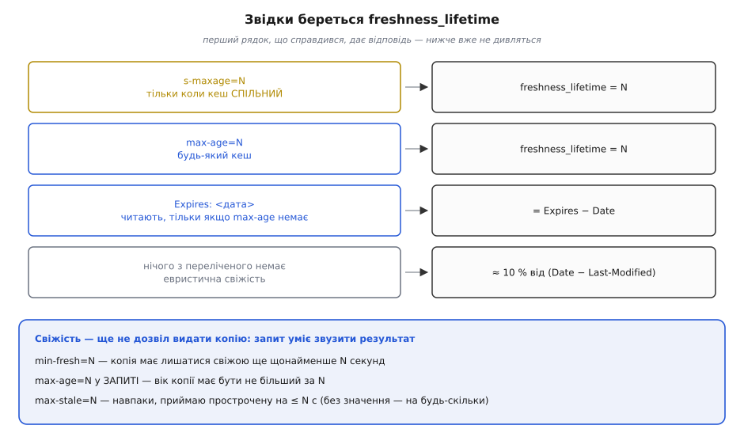
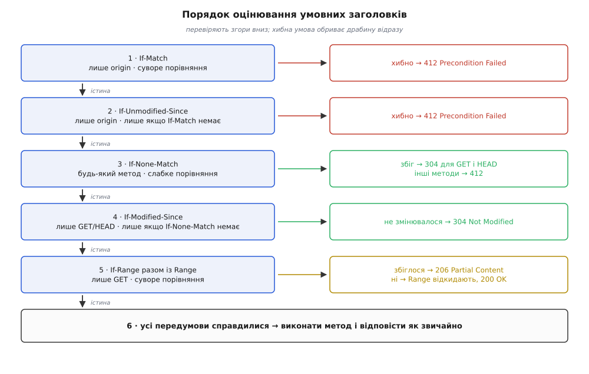

# 📋 Контракт кешування: усі директиви, заголовки й коди

Довідник ставить до кожного імені в протоколі три однакові питання: **кому** воно адресоване, **що зобов'язує** зробити кеш і **за яким правилом** порівнюється. Пам'ятати весь перелік не треба — половина рядків трапляється раз на рік, — але коли трапляється, вгадувати дорого: різниця між `must-revalidate` і `proxy-revalidate` або між суворим і слабким порівнянням вирішує, що саме побачить чужий читач.

<preknowlist>
- [HTTP](book:programming/http) — запит і відповідь, заголовки, методи, коди станів.
</preknowlist>

## Документи, за якими це чинне

| документ | що визначає | вийшов |
| --- | --- | --- |
| RFC 9110 «HTTP Semantics» | валідатори, умовні заголовки, коди станів | червень 2022 |
| RFC 9111 «HTTP Caching» (STD 98) | `Cache-Control`, вік, свіжість, ключ, інвалідація | червень 2022 |
| RFC 5861 (Informational) | `stale-while-revalidate`, `stale-if-error` | травень 2010 |
| RFC 8246 (Standards Track) | `immutable` | вересень 2017 |
| RFC 6585 (Standards Track) | код `428 Precondition Required` | квітень 2012 |

RFC 9110 і RFC 9111 замінили попередню редакцію (RFC 7230–7235 від червня 2014), а та — RFC 2616 від червня 1999. Розділи в таблицях нижче — за чинними документами.

## Нотація значень

```
delta-seconds = 1*DIGIT               ; невід'ємне ціле число секунд, напр. 300
HTTP-date     = "Sun, 06 Nov 1994 08:49:37 GMT"   ; IMF-fixdate, завжди GMT
entity-tag    = [ "W/" ] DQUOTE *etagc DQUOTE     ; лапки обов'язкові, "W/" — з великої
etagc         = будь-який видимий знак, окрім самої подвійної лапки
```

Чотири правила розбору, які діють на все далі:

- імена директив нечутливі до регістру, значення `delta-seconds` — завжди невід'ємні;
- **невідому директиву кеш зобов'язаний проігнорувати**, а не відкинути всю відповідь; саме тому старі кеші мирно живуть поряд із `stale-while-revalidate`;
- проксі мусить передавати `Cache-Control` далі незмінним, навіть якщо сам кеша не має;
- `delta-seconds`, більше за те, що кеш уміє подати числом, трактується як 2147483648 (2³¹) — «дуже довго», а не як переповнення.

## `Cache-Control` у відповіді

| директива | RFC 9111 | кому адресована | що зобов'язує |
| --- | --- | --- | --- |
| `max-age=N` | §5.2.2.1 | усім кешам | строк довіри — N секунд від породження відповіді |
| `s-maxage=N` | §5.2.2.10 | лише спільним | перекриває `max-age` і `Expires`; додатково несе сенс `proxy-revalidate` |
| `no-cache` | §5.2.2.4 | усім | зберігати можна, видавати без успішної валідації — ні |
| `no-store` | §5.2.2.5 | усім | не зберігати жодної частини ні запиту, ні відповіді |
| `private` | §5.2.2.7 | забороняє спільним | зберігає тільки приватний кеш |
| `public` | §5.2.2.9 | дозволяє спільним | зберігати можна навіть там, де за замовчуванням не можна |
| `must-revalidate` | §5.2.2.2 | усім | прострочену не видавати **за жодних обставин** |
| `proxy-revalidate` | §5.2.2.8 | лише спільним | те саме, але приватного кеша не стосується |
| `must-understand` | §5.2.2.3 | усім | зберігати, лише якщо кеш знає правила саме для цього коду стану |
| `no-transform` | §5.2.2.6 | посередникам | не перекодовувати тіло й не міняти тип вмісту |
| `immutable` | RFC 8246 | клієнтам | усередині строку не слати умовний запит навіть на «оновити» |
| `stale-while-revalidate=N` | RFC 5861 | усім | ще N секунд після кінця строку видавати прострочену, перевіряючи у фоні |
| `stale-if-error=N` | RFC 5861 | усім | при помилці джерела видавати прострочену ще N секунд |

Що саме RFC 5861 вважає помилкою, варто знати точно: це відповідь `500`, `502`, `503` або `504`, а також випадок, коли з'єднання з джерелом не вдалося взагалі. Помилка `404` чи `403` під `stale-if-error` не підпадає — вона нормальна відповідь.

**Кваліфікована форма.** `no-cache` і `private` можуть нести аргумент — перелік імен полів: `no-cache="Set-Cookie"` означає «віддавати збережену відповідь можна, але саме це поле спершу прибери», `private="X-Debug"` — «спільний кеш не має права зберігати саме це поле, решту може». RFC 9111 в обох розділах прямо застерігає: кеші здебільшого обробляють кваліфіковану форму так, наче аргументу немає, тобто суворіше, ніж написано. Покладатися на неї в дизайні не варто.

**`public` і `Authorization`.** Спільний кеш не має права використати збережену відповідь на запит, що ніс `Authorization`, для задоволення іншого запиту, якщо у відповіді немає `public`, `s-maxage` або `must-revalidate` (RFC 9111 §3.5). Це єдина директива, чия головна робота — саме **дозволяти**, а не забороняти.

**`must-understand`.** Директива для нових кодів станів із власними правилами кешування. Її ставлять у парі з `no-store`, і пара працює так: старий кеш бачить `no-store` і нічого не зберігає, а кеш, який `must-understand` реалізує, `no-store` навмисно ігнорує — якщо розуміє правила для цього коду. Тобто це спосіб сказати «кешуй, тільки якщо справді знаєш як».

> 🔧 **Навіщо це.** Директиви конфліктують, і перемагає завжди сувора. `no-store` б'є все — зберігати нічого. `no-cache`, `must-revalidate`, `s-maxage` і `proxy-revalidate` забороняють видавати прострочену копію, а отже, **вимикають** `stale-while-revalidate` і `stale-if-error` (RFC 9111 §4.2.4). Зв'язка `must-revalidate, stale-if-error=86400` — не «страховка з обох боків», а мовчазне ніщо: перша директива викреслює другу. Обирати доводиться один раз і свідомо: краще застаріле чи краще ніякого.

## `Cache-Control` у запиті

Ті самі слова в запиті означають інше — не політику зберігання, а вимогу конкретного клієнта до конкретної відповіді.

| директива | RFC 9111 | що просить клієнт |
| --- | --- | --- |
| `max-age=N` | §5.2.1.1 | вік копії має бути не більший за N; без `max-stale` прострочена не годиться |
| `max-stale[=N]` | §5.2.1.2 | приймаю прострочену на ≤ N секунд; без значення — на будь-скільки |
| `min-fresh=N` | §5.2.1.3 | копія має лишатися свіжою ще щонайменше N секунд |
| `no-cache` | §5.2.1.4 | жодної збереженої без успішної валідації; аргументу тут не буває |
| `no-store` | §5.2.1.5 | не зберігати ні цього запиту, ні відповіді на нього |
| `no-transform` | §5.2.1.6 | не перекодовувати нічого дорогою |
| `only-if-cached` | §5.2.1.7 | до джерела не ходити: або збережена копія, або `504 Gateway Timeout` |
| `stale-if-error=N` | RFC 5861 | приймаю прострочену, якщо джерело віддало помилку |

Дві тонкощі. `no-store` у запиті **не стирає** те, що вже лежить у кеші: якщо запит задовольнили зі сховища, директива до збереженої відповіді не застосовується. А `only-if-cached` — єдина директива, яка вміє гарантовано не породити мережевого обміну; на ній будують роботу без зв'язку.

## Заголовки, з яких кеш складає рішення

| заголовок | хто пише | значення | роль |
| --- | --- | --- | --- |
| `Date` | origin | HTTP-date | коли відповідь **породжено**; від нього рахують вік і `Expires − Date`. Якщо його немає (вузол без годинника), кеш підставляє час отримання |
| `Age` | кеш | delta-seconds | оцінка віку відповіді; кеш дописує його, віддаючи збережену копію |
| `Expires` | origin | HTTP-date | абсолютний строк. За наявності `max-age` **ігнорується**; будь-яке невалідне значення (зокрема `0`) означає «вже прострочено» |
| `Last-Modified` | origin | HTTP-date | час останньої зміни представлення; роздільність — одна секунда |
| `ETag` | origin | entity-tag | непрозора мітка вмісту; префікс `W/` робить її слабкою |
| `Vary` | origin | перелік імен полів або `*` | які заголовки запиту входять у ключ запису |

`Vary: *` — окремий випадок: такий запис **ніколи** не збігається з жодним запитом, тобто зберегти його можна, а використати — ні. Заголовки у `Vary` порівнюють без огляду на регістр імені, а значення — після нормалізації, властивої кожному конкретному полю; ключ запису — це метод плюс повна адреса плюс значення перелічених полів. Звідки взагалі береться потреба у `Vary`, показує [узгодження вмісту](book:programming/content-negotiation).

## Вік: повна формула

```
age_value             — прочитаний Age (0, якщо заголовка немає)
date_value            — Date відповіді
request_time          — коли кеш ВІДПРАВИВ запит
response_time         — коли кеш ОТРИМАВ відповідь
now                   — поточний годинник кеша

apparent_age          = max(0, response_time − date_value)
response_delay        = response_time − request_time
corrected_age_value   = age_value + response_delay
corrected_initial_age = max(apparent_age, corrected_age_value)
resident_time         = now − response_time
current_age           = corrected_initial_age + resident_time

response_is_fresh     = (freshness_lifetime > current_age)
```

Доданок, який губиться найчастіше, — `response_delay`. Поки відповідь їхала до кеша, вона старішала, і `Age`, отриманий у заголовку, описує вік на момент **відправлення**, а не отримання. Кеш, який цього не додасть, вважатиме копію молодшою, ніж вона є, і на повільному каналі видаватиме прострочене як свіже.

`corrected_initial_age` бере **більше** з двох оцінок — власної та чужої. Помилитися в бік «копія старша» безпечно (буде зайва перевірка), у зворотний — означає збрехати.

## Строк: чотири джерела з жорстким пріоритетом



*Порядок у RFC 9111 §4.2.1 задано як «перший збіг», а не як сума правил: знайшовши джерело, кеш решту не читає.*

Евристику (останній рядок) дозволено вмикати не завжди, а лише для кодів, які RFC 9110 §15.1 називає **евристично кешовними**:

```
200  203  204  206  300  301  308  404  405  410  414  501
```

Решта кодів без явного строку евристичної свіжості не дістає. Для тих, що дістає, RFC 9111 §4.2.2 радить брати частку від часу, який минув після `Last-Modified`, і називає 10 % типовим значенням цієї частки.

## Умовні заголовки

| заголовок | правило порівняння | методи | хто оцінює | умова хибна → |
| --- | --- | --- | --- | --- |
| `If-Match` | суворе | будь-які (сенс — на записі) | лише origin | `412 Precondition Failed` |
| `If-Unmodified-Since` | за датою | будь-які | лише origin | `412 Precondition Failed` |
| `If-None-Match` | слабке | будь-які | origin і кеш | `304` для GET/HEAD, `412` для решти |
| `If-Modified-Since` | за датою | лише GET/HEAD | origin і кеш | `304 Not Modified` |
| `If-Range` | суворе (мітка) або точний збіг (дата) | GET разом із `Range` | лише origin | `Range` відкидають, іде повне `200 OK` |

Зірочка замість мітки означає наявність: `If-Match: *` справджується, коли поточне представлення взагалі існує, `If-None-Match: *` — коли його немає. Друга форма й дає безпечне створення: `PUT` із `If-None-Match: *` запише ресурс, лише якщо місце порожнє.

Правила порівняння міток різняться рівно в одному:

```
суворе:  збіг ⟺ обидві мітки НЕ слабкі І тіла лапок збігаються знак у знак
слабке:  збіг ⟺ тіла лапок збігаються знак у знак; слабкість не заважає

"a3f9"    vs "a3f9"      суворе: збіг       слабке: збіг
W/"a3f9"  vs "a3f9"      суворе: НЕ збіг    слабке: збіг
W/"a3f9"  vs W/"a3f9"    суворе: НЕ збіг    слабке: збіг
"a3f9"    vs "b100"      суворе: НЕ збіг    слабке: НЕ збіг
```

Звідси практичний висновок: слабка мітка цілком годиться для перевірки свіжості (`If-None-Match`), але робить неможливими запис під умовою (`If-Match`) і докачування ([часткові запити з `Range`](book:programming/http-range-requests)).

`Last-Modified` як валідатор **за замовчуванням слабкий** — дві правки в межах однієї секунди дадуть однакову дату. RFC 9110 §8.8.2.2 дозволяє вважати його сильним лише у вузьких випадках; найкорисніший із них такий: клієнт або кеш має запис із заголовком `Date`, і подана `Last-Modified` щонайменше **на 60 секунд** давніша за цей `Date`. Логіка проста — якби протягом тієї секунди сервер віддав дві різні відповіді, у щонайменше однієї `Date` збігся б із `Last-Modified`; шістдесят секунд узято із запасом на розбіжність двох годинників усередині самої машини. Реалізація має право взяти й більше за 60 секунд, якщо їй цього мало.

### Порядок оцінювання



*RFC 9110 §13.2.2. Кроки 2 і 4 виконуються, тільки якщо відповідного «сильнішого» заголовка в запиті немає: `If-Unmodified-Since` мовчить за наявності `If-Match`, `If-Modified-Since` — за наявності `If-None-Match`.*

Два наслідки, через які плутанина найдорожча. Перший: `If-Match` і `If-Unmodified-Since` оцінює **тільки джерело** — проміжний кеш такий запит зобов'язаний передати далі, бо про поточний стан ресурсу він не знає. Другий: `If-None-Match` витісняє `If-Modified-Since` цілком. Надіслати обидва не шкідливо (так робить браузер, у якого є і мітка, і дата), але дата в такому запиті ні на що не впливає.

## Коди станів

| код | назва | коли | що в ньому обов'язково |
| --- | --- | --- | --- |
| `304` | Not Modified | умова читання показала, що копія чинна | тіла **немає ніколи**; сервер мусить надіслати ті з полів `Content-Location`, `Date`, `ETag`, `Vary`, `Cache-Control`, `Expires`, які були б у `200` |
| `412` | Precondition Failed | умова запису не справдилася | сервер не змінив нічого |
| `428` | Precondition Required | сервер відмовляється приймати сліпий запис | тіло має пояснити, як повторити (зазвичай — додати `If-Match`); відповідь **не зберігається** кешем |
| `206` | Partial Content | `If-Range` справдився і діапазон досяжний | те, що просив `Range` |
| `504` | Gateway Timeout | `only-if-cached` без копії, або `must-revalidate` без зв'язку з джерелом | — |

`428` (RFC 6585) перетворює захист від втраченого оновлення з доброї волі клієнта на вимогу контракту — це серверний бік [оптимістичного блокування](book:programming/optimistic-locking).

Заголовки з `304` **вписуються** у збережений запис (RFC 9111 §4.3.4): кеш замінює наявні поля тими, що прийшли, окрім `Content-Length` і полів, які не зберігаються взагалі. Саме тому успішна валідація не лише підтверджує копію, а й перезапускає їй лічильник віку.

## Інвалідація, вбудована в протокол

Кеш зобов'язаний визнати запис недійсним, коли крізь нього проходить **небезпечний метод** (`POST`, `PUT`, `DELETE`, `PATCH`…) і сервер відповідає не помилкою (RFC 9111 §4.4). Скасовується запис за адресою запиту; додатково кеш може скасувати адреси з `Location` і `Content-Location` відповіді — але **лише** якщо їхнє походження збігається з походженням адреси запиту. Обмеження стоїть навмисне: без нього чужий сервер міг би однією відповіддю змусити спільний кеш викинути записи будь-якого сайту.

## Мінімальний обмін від початку до кінця

Читання, два кола:

```
GET /api/orders/42 HTTP/1.1
Host: shop.example
Accept-Encoding: gzip

HTTP/1.1 200 OK
Date: Sun, 02 Aug 2026 09:00:00 GMT
Cache-Control: private, no-cache
ETag: "order-42-v17"
Vary: Accept-Encoding
Content-Encoding: gzip
Content-Type: application/json
```

```
GET /api/orders/42 HTTP/1.1
Host: shop.example
Accept-Encoding: gzip
If-None-Match: "order-42-v17"

HTTP/1.1 304 Not Modified
Date: Sun, 02 Aug 2026 09:14:03 GMT
Cache-Control: private, no-cache
ETag: "order-42-v17"
Vary: Accept-Encoding
```

Запис під умовою, невдалий:

```
PUT /api/orders/42 HTTP/1.1
Host: shop.example
If-Match: "order-42-v17"
Content-Type: application/json

{ "status": "shipped" }

HTTP/1.1 412 Precondition Failed
Date: Sun, 02 Aug 2026 09:14:20 GMT
ETag: "order-42-v18"
```

Мітка у відповіді `412` — не формальність: вона повідомляє клієнтові поточну версію, і той може перечитати ресурс і повторити запис уже від неї.
