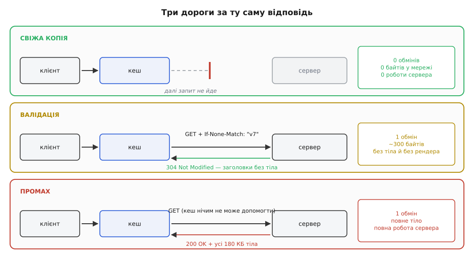

# HTTP-кешування: Cache-Control, ETag й умовні запити

<preknowlist>
- [HTTP](topic:programming/http) — обмін «запит → відповідь», заголовки, коди станів (200, 304, 412).
- [Кеш вводить друге джерело правди](topic:programming/cache-invalidation-intro) — щойно з'явилася копія, з'явився ризик, що вона розійшлася з оригіналом.
</preknowlist>

Відкрий сторінку крамниці — у мережу полетить близько сотні запитів: розмітка, стилі, шрифти, скрипти, картинки, кілька викликів API. Назавтра ти відкриваєш ту саму сторінку. За ніч змінилися дві ціни й банер, решта відповідей — ті самі байт у байт. Сервер виготовляє їх наново.

Кожен зайвий запит коштує трьох різних речей. Перша — очікування: сигнал мусить збігати до сервера й назад, а це десятки мілісекунд, бо світло долає відстань, і швидший процесор тут не поможе. Друга — трафік: за байти хтось платить, а на мобільному зв'язку ще й чекає. Третя — робота сервера: за кожним викликом стоїть звертання до бази й збирання відповіді.

Оптимізація самої відповіді не прибирає жодної з трьох: усі три беруться від того, що запит взагалі відбувся. Прибрати їх разом уміє одна річ — не робити запиту. А щоб не робити, відповідь має вже лежати ближче до того, хто питає, — у кеші (фр. *cacher* — ховати).

Ось де починається справжня складність. Копія мовчазна. Вона не знає, що оригінал змінився, і сама дізнатися не може: у HTTP немає каналу від сервера до кеша. Розмову завжди починає клієнт. Сервер не знає навіть, у скількох браузерах лежить його вчорашня відповідь.

Тому все HTTP-кешування — відповідь на одне питання: **як користуватися копією, не збрехавши читачеві?** Протокол дає дві різні відповіді, і майже кожен заголовок цієї теми — деталь однієї з двох.

## Строк, виданий наперед

Перша відповідь: сервер разом із вмістом видає строк довіри — «цьому можна вірити 300 секунд». Поки строк не минув, кеш віддає копію мовчки, нікого не питаючи. Мережі немає взагалі: ні очікування, ні трафіку, ні роботи сервера. Такий стан копії називають свіжістю, а строк пишуть у головному заголовку теми:

```
HTTP/1.1 200 OK
Cache-Control: max-age=300
```

Відлік іде не від миті, коли копія потрапила в цей конкретний кеш, а від миті, коли сервер відповідь створив. Інакше строк розтягувався б наново на кожному кеші дорогою, і сервер утратив би владу над власною обіцянкою. Щоб вік копії було видно всім, кеш дописує заголовок `Age` — скільки секунд цій відповіді вже виповнилося.

Ціна свіжості видна одразу: усередині строку кеш віддає копію навіть тоді, коли оригінал уже змінився, і ніхто цього не помітить. Свіжість платить точністю.

Окрема пастка — мовчання сервера. Якщо про кешування не сказано нічого, це не означає «не кешуй»: кешу дозволено вигадати строк самому, виходячи з того, коли вміст востаннє змінювався. Документ, незмінний три місяці, може пролежати свіжим кілька днів. Тому на кожній відповіді, доля якої тобі не байдужа, `Cache-Control` має стояти явно.

## Питання, на яке дешево відповісти

Друга відповідь: кеш зберігає разом із відповіддю коротку прикмету її вмісту й потім питає про неї сервер. Прикмету називають валідатором, і найчастіше це `ETag` (англ. *entity tag* — мітка сутности) — рядок, який сервер обирає сам:

```
ETag: "a3f9c2e1"
```

Для кеша цей рядок непрозорий: розбирати його чи витягати з нього зміст заборонено. Дозволено рівно одне — порівняти з тим, що прийшов раніше.

Маючи мітку, кеш перетворює важкий запит на легке питання: «віддай тіло, **але лише за умови**, що моя копія застаріла».

```
GET /api/orders/42 HTTP/1.1
If-None-Match: "a3f9c2e1"
```

Якщо поточна мітка ресурсу така сама, сервер відповідає `304 Not Modified` — самі заголовки, кількасот байтів, без тіла. Такий запит і називають умовним. Тіла немає, отже, немає ні трафіку, ні збирання відповіді наново; лишається один обмін мережею. Валідація платить очікуванням, зате не бреше ніколи.

Тут є ще одна річ, яку часто проминають: заголовки з `304` вписуються в збережену копію. Приходить новий строк — і лічильник віку стартує з нуля. Тому валідація не просто перевірка перед видачею, а спосіб **продовжити життя** копії, витративши один обмін замість повного завантаження.



*Свіжа копія коштує нуль. Валідація прибирає тіло й роботу сервера, лишаючи один обмін. Промах платить за все відразу.*

Звідси практичний вибір: строк — для того, що не страшно побачити трохи застарілим (картинка, стиль, публічний перелік); валідатор — для того, де застаріла відповідь є брехнею (баланс рахунку, стан замовлення). Одне одному не суперечить: короткий строк плюс мітка на випадок, коли строк минув, — звичайна зв'язка в одній відповіді.

Та сама мітка розв'язує ще й задачу, зовсім не пов'язану зі швидкістю. Запит `PUT` із заголовком `If-Match: "v7"` означає «запиши, лише якщо поточна версія досі "v7"»; якщо хтось устиг зберегти раніше, мітка вже інша, і сервер відповідає `412 Precondition Failed`, нічого не змінивши. Так двоє редакторів не затирають правки одне одного мовчки — це той самий механізм, що в базах даних називають [оптимістичним блокуванням](topic:programming/optimistic-locking).

## Хто має право тримати копію

Кешів між браузером і сервером зазвичай кілька, і вони діляться на два види, різниця між якими стосується не швидкости, а безпеки.

**Приватний** обслуговує одну людину: кеш усередині браузера, кеш мобільного застосунку. Що там лежить, те й так належить власникові пристрою.

**Спільний** обслуговує всіх одразу: [CDN](topic:programming/cdn), проксі перед застосунком, кеш корпоративної мережі. Відповідь, покладена туди, дістанеться наступному, хто попросить ту саму адресу, — а це вже інша людина.

Звідси набір директив, що керують зберіганням: `private` — тримати копію вільно лише приватному кешу; `public` — дозволено всім; `s-maxage=N` — строк лише для спільних кешів (приватні живуть за `max-age`); `no-store` — не записувати нікуди, ні на диск, ні в пам'ять.

> 🔧 **Навіщо це.** Найдорожчі аварії кешування — не повільність, а видача чужих даних. Схема завжди однакова: персональну відповідь віддали без `private`, спільний кеш поклав її під ключем «адреса», наступний відвідувач отримав чужий кабінет. Правило коротке: якщо відповідь залежить від того, **хто** питає, вона або `private`, або взагалі `no-store`.

## Дві директиви, які плутають щодня

Назва `no-cache` — найгірша в усьому протоколі, і плутанина коштує людям годин.

- `no-store` — **не зберігай**. Копії не існує, наступний запит іде до сервера повністю.
- `no-cache` — **зберігай, але не віддавай без перевірки**. Копія лежить, проте перед кожною видачею кеш зобов'язаний спитати сервер, чи вона ще чинна.

`no-cache` — це не заборона, а вимкнена свіжість при ввімкненій валідації. І режим цей дуже вигідний: відповідь на 200 кілобайтів, позначена `no-cache` й наділена міткою, у більшості випадків коштуватиме порожній `304`. Тому правильна відповідь на «дані мають бути завжди актуальні» — майже завжди `no-cache` з `ETag`, а не `no-store`.

## Ключем є не сама адреса

Здається природним, що адреса однозначно визначає відповідь. Це неправда, щойно вмикається [узгодження вмісту](topic:programming/content-negotiation): та сама `/report` віддає стиснене тіло тому, хто стиснення розуміє, і нестиснене — старому клієнтові.

Кеш поклав би стиснений варіант під ключем «GET /report» і віддав його всім, зокрема й тим, хто побачить кашу з байтів. Тому відповідь зобов'язана назвати, від чого саме вона залежала:

```
Vary: Accept-Encoding
```

`Vary` добудовує ключ: запис адресується вже не самою адресою, а адресою разом зі значеннями перелічених заголовків, і під однією `/report` спокійно живуть два записи. Заголовок, від якого відповідь залежить, але який у `Vary` не названий, змішує різні відповіді в одну — і спільний кеш роздає першу-ліпшу всім.

## Обіцянку не можна відкликати

Тепер найнеприємніше. `max-age=3600` — це обіцянка, яку не відкликають. Копія лежить у чужому браузері, каналу до неї немає, і хоч би що ти робив із сервером, наступну годину той браузер має повне право нічого не питати. Примусове скидання на CDN миттєве й дієве, але сягає лише того кеша, яким ти володієш; чужі браузери тобі не належать.

Звідси єдиний по-справжньому надійний хід: **не скасовувати обіцянку, а міняти адресу**. Якщо вміст файла зашити в його ім'я, будь-яка зміна вмісту породжує нове ім'я — і скасовувати стає нічого:

```
old:  /static/app.a3f9c2.js     ← лежить у браузерів, max-age=31536000
new:  /static/app.7b1e04.js     ← інша адреса, інший запис у кеші
```

На цьому тримається вся сучасна роздача статики — [незмінна статика з відбитком вмісту в адресі](topic:programming/content-addressed-assets). Незмінні файли віддають із максимальним строком, а документ, який на них посилається, не кешують наперед узагалі:

```
/static/app.a3f9c2.js    Cache-Control: public, max-age=31536000, immutable
/index.html              Cache-Control: no-cache   + ETag
```

Обов'язки розділилися: змінний документ перевіряється завжди, і це один дешевий `304`, а незмінні шматки не перевіряються ніколи. Оновлення застосунку зводиться до однієї зміни в документі, який усі й так щоразу перепитують.

Кожен заголовок цієї теми відповідає рівно на одне з трьох питань: **хто** має право тримати копію, **доки** їй можна вірити без запитання і **як** спитати дешево. Свіжість без валідатора — швидкість, куплена за ризик збрехати. Валідатор без строку — чесність, куплена за обмін мережею. Разом вони дають те, заради чого все це й будувалося.
