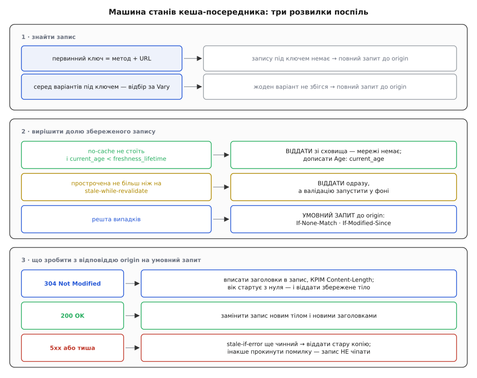
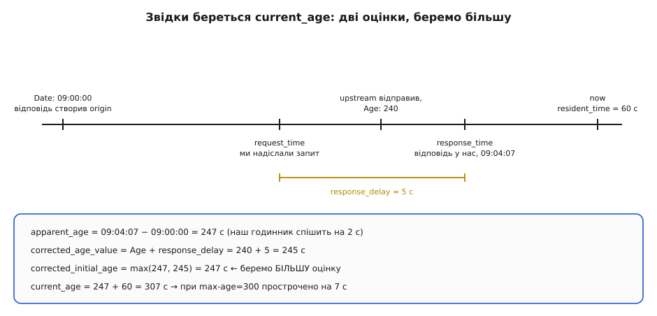

# ⚙️ Кеш-посередник: машина станів, що вирішує долю копії

Напишімо той вузол, який стоїть між клієнтом і origin: він зберігає відповіді, рахує їхній вік і сам вирішує, коли віддати копію мовчки, коли перепитати умовним запитом, а коли зізнатися, що допомогти нічим. RFC 9111 читається як перелік директив, але в коді він перетворюється на одну впорядковану послідовність розвилок — і майже кожна аварія справжніх кешів береться не з незнання директиви, а з переставленої розвилки.

## Задача

Один вхід — `handle(request)`, один вихід — відповідь клієнтові. Між ними сховище на кілька гігабайтів і з'єднання з origin. Вузол спільний: він обслуговує всіх відвідувачів, тож помилка в ньому коштує не повільности, а чужих даних у чужих руках.

Що він мусить робити:

- розібрати `Cache-Control`, `Date`, `Age`, `Expires` — і в запиті, і у відповіді;
- знайти запис під ключем, який складається не лише з адреси;
- порахувати поточний вік копії й порівняти зі строком;
- вибрати одну з чотирьох дій: віддати, віддати й оновити у фоні, перепитати умовним запитом, піти по все;
- увібрати відповідь origin — злити заголовки з `304` у наявний запис або замінити його цілком;
- триматися в межах заданого обсягу пам'яті.

Чого ми свідомо не робимо: не обслуговуємо часткові відповіді (`Range`, `206`), не зберігаємо нічого на диск, не оновлюємо збережений `GET` із відповіді на `HEAD`. Кожна з цих речей — окремий шматок роботи, і жодна не змінює кістяка.



*Три панелі — три послідовні питання. Перше з них узагалі не про кешування, а про пошук; друге вирішує долю копії, третє — долю запису.*

## Ідея: чотири чисті функції й одне брудне сховище

Спокуса тут одна — писати все просто в обробнику запиту, бо кожне рішення дрібне. Наслідок відомий: логіка перемішується з мережею, і перевірити її можна лише піднявши справжній сервер.

Тому ділимо вузол по лінії «є побічні дії чи ні». Чисті шматки не знають ні про сокети, ні про час у системі — час і заголовки приходять до них аргументами:

- `parse_cache_control(text) → CacheControl` — текст у структуру;
- `current_age(entry, now) → секунди` — сама арифметика;
- `decide(entry, request_directives, now, shared) → Act` — одна з чотирьох дій;
- `absorb(entry, upstream_response) → Outcome` — що зробити з відповіддю origin.

Брудна частина одна — сховище: воно тримає пам'ять, витісняє записи й потребує замка. Розділення не косметичне: увесь RFC живе в чистих функціях, а їхні тести — це таблиця «заголовки + момент часу → очікувана дія», без жодного байта мережі.

## Розбір `Cache-Control`

Почнімо з розбору, бо решта на нього спирається. Заголовок виглядає простим переліком через кому — і саме тому його зазвичай розбирають `split(",")`. Це ламається на першому ж значенні в лапках:

```
Cache-Control: max-age=600, no-cache="Set-Cookie, X-Session", public
```

Кома всередині лапок належить значенню, а не переліку. Наївний розбір дасть директиву `X-Session"` і втратить `public`. Тому пишемо звичайний посимвольний прохід, який знає про `quoted-string`:

```cpp
#include <algorithm>
#include <chrono>
#include <optional>
#include <string>
#include <string_view>

using Wall   = std::chrono::system_clock;   // стінний час: лише для Date / Expires
using Steady = std::chrono::steady_clock;   // монотонний: лише для тривалостей
using Secs   = std::chrono::seconds;

struct CacheControl {
    bool no_store = false, no_cache = false, must_revalidate = false;
    bool proxy_revalidate = false, is_private = false, is_public = false;
    bool only_if_cached = false, max_stale_any = false;
    std::optional<long> max_age, s_maxage, min_fresh, max_stale, swr, sie;
};

// delta-seconds: самі цифри. Переповнення — не помилка розбору, а 2³¹ (RFC 9111 §1.2.2)
static std::optional<long> delta_seconds(std::string_view s) {
    if (s.empty()) return std::nullopt;
    long n = 0;
    for (char c : s) {
        if (c < '0' || c > '9') return std::nullopt;
        if (n > (2147483648L - (c - '0')) / 10) return 2147483648L;
        n = n * 10 + (c - '0');
    }
    return n;
}

static std::string_view trim(std::string_view s) {
    while (!s.empty() && (s.front() == ' ' || s.front() == '\t')) s.remove_prefix(1);
    while (!s.empty() && (s.back()  == ' ' || s.back()  == '\t')) s.remove_suffix(1);
    return s;
}

static bool ieq(std::string_view a, std::string_view b) {      // без огляду на регістр
    return a.size() == b.size() &&
           std::equal(a.begin(), a.end(), b.begin(),
                      [](char x, char y) { return (x | 0x20) == (y | 0x20); });
}

CacheControl parse_cache_control(std::string_view v) {
    CacheControl cc;
    size_t i = 0;
    while (i < v.size()) {
        while (i < v.size() && (v[i] == ',' || v[i] == ' ' || v[i] == '\t')) ++i;

        size_t nb = i;
        while (i < v.size() && v[i] != '=' && v[i] != ',') ++i;
        const std::string_view name = trim(v.substr(nb, i - nb));

        std::string_view val;
        if (i < v.size() && v[i] == '=') {
            ++i;
            if (i < v.size() && v[i] == '"') {                 // quoted-string
                const size_t vb = ++i;
                while (i < v.size() && v[i] != '"') i += (v[i] == '\\' ? 2 : 1);
                val = v.substr(vb, i - vb);
                if (i < v.size()) ++i;                         // закривальна лапка
            } else {
                const size_t vb = i;
                while (i < v.size() && v[i] != ',') ++i;
                val = trim(v.substr(vb, i - vb));
            }
        }
        if (name.empty()) continue;

        if      (ieq(name, "no-store"))         cc.no_store         = true;
        // кваліфіковану форму no-cache="…" трактуємо як звичайний no-cache:
        // суворіше за дозволене, а суворіше кешу завжди можна
        else if (ieq(name, "no-cache"))         cc.no_cache         = true;
        else if (ieq(name, "must-revalidate"))  cc.must_revalidate  = true;
        else if (ieq(name, "proxy-revalidate")) cc.proxy_revalidate = true;
        else if (ieq(name, "private"))          cc.is_private       = true;
        else if (ieq(name, "public"))           cc.is_public        = true;
        else if (ieq(name, "only-if-cached"))   cc.only_if_cached   = true;
        else if (ieq(name, "max-age"))          cc.max_age   = delta_seconds(val);
        else if (ieq(name, "s-maxage"))         cc.s_maxage  = delta_seconds(val);
        else if (ieq(name, "min-fresh"))        cc.min_fresh = delta_seconds(val);
        else if (ieq(name, "stale-while-revalidate")) cc.swr = delta_seconds(val);
        else if (ieq(name, "stale-if-error"))         cc.sie = delta_seconds(val);
        else if (ieq(name, "max-stale")) {
            if (val.empty()) cc.max_stale_any = true;
            else             cc.max_stale     = delta_seconds(val);
        }
        // невідомі директиви мовчки минаємо — розширення протоколу законні
    }
    return cc;
}
```

Дві дрібниці варті окремої уваги. Переповнення `delta-seconds` — не привід відкинути заголовок: RFC 9111 §1.2.2 прямо вимагає вважати завелике число за 2³¹ секунд, тобто «дуже довго». І `max-stale` без значення — це не помилка синтаксису, а окремий смисл: «згоден на прострочене будь-якого віку».

## Вік копії: у підрахунку два різні годинники

Тепер найтонше місце всієї реалізації. Щоб порівняти вік зі строком, вік треба виміряти — а міряти доводиться двома різними годинниками, і плутати їх не можна.

`Date` у відповіді — це показ **чужого** годинника, годинника origin. Порівняти з ним можна лише свій стінний годинник, той самий, що показує дату. А от скільки копія пролежала **в нас**, стінним годинником міряти не можна взагалі: одне підправлення часу службою синхронізації — і різниця двох стінних міток стрибне на пів години в будь-який бік. Тривалість на своїй машині міряють монотонним годинником, який лише росте й ніколи не переставляється. Різницю між цими двома джерелами часу докладно розібрано окремо — [монотонний час проти стінного](topic:programming/monotonic-vs-wall-time).

Тому запис зберігає **обидві** мітки моменту отримання:

```cpp
struct Entry {
    std::string method, url;
    Fields      headers;                   // заголовки збереженої відповіді
    Body        body;                      // тіло, спільне за підрахунком посилань
    std::vector<std::pair<std::string, std::string>> selecting;   // значення за Vary

    Wall::time_point   date_value{};       // Date, як його дав origin
    Wall::time_point   response_time_wall; // наш СТІННИЙ час у мить отримання
    Steady::time_point response_time_mono; // наш МОНОТОННИЙ час у ту саму мить
    Secs               response_delay{0};  // response_time − request_time
    Secs               age_value{0};       // Age, як його прислали
    CacheControl       cc;                 // розібраний Cache-Control відповіді
    int                status = 200;
};

// RFC 9111 §4.2.3
Secs current_age(const Entry& e, Steady::time_point now) {
    using std::chrono::duration_cast;
    const Secs apparent = std::max(Secs(0),
        duration_cast<Secs>(e.response_time_wall - e.date_value));
    const Secs corrected_age_value = e.age_value + e.response_delay;
    const Secs corrected_initial   = std::max(apparent, corrected_age_value);
    const Secs resident            = duration_cast<Secs>(now - e.response_time_mono);
    return corrected_initial + resident;
}
```

Звідки береться `response_delay` і навіщо його додавати до `Age`. Заголовок `Age` upstream виставив у мить, коли **відправляв** відповідь. Поки вона їхала до нас, копія старішала далі, а число в заголовку — ні. Тому до присланого віку додають увесь час від нашого запиту до нашого отримання: це надійна верхня оцінка того, скільки відповідь була в дорозі.

Двох оцінок віку виходить дві, і алгоритм бере **більшу**. Причина асиметрична: помилитися в бік «копія старша, ніж є» означає зайву перевірку, помилитися в другий бік — віддати прострочене як свіже.



*Коли наш стінний годинник спішить, `apparent_age` завищений — і саме він перемагає в `max()`. Розсинхронізація годинників робить кеш обережнішим, а не брехливішим.*

## Строк і рішення

Строк рахують за першим збігом із чотирьох правил (RFC 9111 §4.2.1): для спільного кеша спершу `s-maxage`, тоді `max-age`, тоді різниця `Expires` і `Date`, а як нічого немає — евристика:

```cpp
bool heuristically_cacheable(int status) {          // RFC 9110 §9.1
    switch (status) {
        case 200: case 203: case 204: case 206: case 300:
        case 301: case 404: case 405: case 410: case 414: case 501: return true;
        default: return false;
    }
}

std::optional<Secs> explicit_lifetime(const Entry& e, bool shared) {
    if (shared && e.cc.s_maxage) return Secs(*e.cc.s_maxage);
    if (e.cc.max_age)            return Secs(*e.cc.max_age);
    if (const std::string* exp = e.headers.find("expires")) {
        const auto t = parse_http_date(*exp);
        // «0» і будь-яка нерозбірна дата означають «вже прострочено» (RFC 9111 §5.3)
        if (!t) return Secs(0);
        return std::max(Secs(0), std::chrono::duration_cast<Secs>(*t - e.date_value));
    }
    return std::nullopt;                            // явного строку немає
}

Secs heuristic_lifetime(const Entry& e) {
    if (!heuristically_cacheable(e.status)) return Secs(0);
    if (const std::string* lm = e.headers.find("last-modified")) {
        if (const auto t = parse_http_date(*lm)) {
            const Secs since = std::chrono::duration_cast<Secs>(e.date_value - *t);
            // 10 % від часу, що минув від зміни, — частка, яку RFC 9111 §4.2.2 називає
            // типовою; стеля в добу — уже наш власний запобіжник
            return std::clamp(since / 10, Secs(0), Secs(24 * 3600));
        }
    }
    return Secs(0);
}
```

Тепер саме рішення. Воно й є та машина станів, заради якої все писалося, і кожен рядок тут стоїть на своєму місці не випадково:

```cpp
enum class Act {
    Serve,            // віддати збережене; мережі не буде взагалі
    ServeStaleAsync,  // віддати збережене, валідацію запустити у фоні
    Validate,         // умовний запит; його результат вирішить долю запису
    Fetch             // придатної копії немає — повний запит
};

Act decide(const Entry& e, const CacheControl& req, Steady::time_point now, bool shared) {
    // ПЕРЕД строком: no-cache вимикає свіжість цілком, хоч би що казав max-age
    if (e.cc.no_cache || req.no_cache) return Act::Validate;

    const Secs age  = current_age(e, now);
    const auto expl = explicit_lifetime(e, shared);
    const Secs life = expl ? *expl : heuristic_lifetime(e);

    // клієнт має право звузити свіжість: саме це шле браузер після «оновити»
    if (req.max_age && age >= Secs(*req.max_age)) return Act::Validate;

    if (age < life) {
        if (req.min_fresh && (life - age) < Secs(*req.min_fresh)) return Act::Validate;
        return Act::Serve;
    }

    const Secs over = age - life;                   // на скільки прострочено
    // must-revalidate забороняє прострочене беззастережно — і клієнтський дозвіл,
    // і серверний stale-while-revalidate після нього вже не діють
    if (e.cc.must_revalidate || (shared && e.cc.proxy_revalidate)) return Act::Validate;

    if (req.max_stale_any || (req.max_stale && over <= Secs(*req.max_stale)))
        return Act::Serve;                          // прострочене дозволив КЛІЄНТ
    if (e.cc.swr && over <= Secs(*e.cc.swr))
        return Act::ServeStaleAsync;                // прострочене дозволив СЕРВЕР

    return Act::Validate;
}
```

> 🔧 **Навіщо це.** Порядок перевірок тут — не стиль, а сама відповідність протоколу. RFC 9111 §4.2.4 забороняє видавати прострочене, «якщо цього явно не дозволив клієнт або origin»: клієнтський дозвіл — це `max-stale`, серверний — `stale-while-revalidate` і `stale-if-error`. Варто підняти рядок про `swr` вище перевірки `must-revalidate` — і кеш почне видавати застаріле там, де сервер це заборонив найсуворішим словом, яке в нього є. Помилка на один рядок, наслідок — застарілий баланс на екрані.

## Умовний запит і те, що з нього повертається

Мати валідатор мало — його треба надіслати незміненим:

```cpp
Fields conditional_headers(const Entry& e) {
    Fields h;
    if (const std::string* et = e.headers.find("etag"))
        h.set("if-none-match", *et);        // разом із префіксом W/, якщо він там був
    if (const std::string* lm = e.headers.find("last-modified"))
        h.set("if-modified-since", *lm);    // байт у байт, без переформатування дати
    return h;
}
```

Обидва рядки віддаються дослівно, і обидва — з причини. `If-None-Match` порівнюють **слабко** (RFC 9110 §8.8.3.2), тобто префікс `W/` тут нікому не заважає; а от зрізати його не можна, бо тоді сховище втратить знання про те, що мітка слабка, і хтось пізніше візьме її для `If-Range`, де порівняння вже суворе. `If-Modified-Since` не переформатовуємо з тієї ж причини, з якої не переписуємо чужий підпис: сервер має право звіряти рядок, а не розібрану дату.

Відповідь origin увібрати теж треба обережно:

```cpp
enum class Outcome { Refreshed, Replaced, StaleOnError, PassThrough };

// RFC 9111 §3.2: оновлення заголовків збереженої відповіді
void update_stored_headers(Entry& e, const Fields& fresh) {
    for (const auto& [name, value] : fresh.all()) {
        if (name == "content-length") continue;   // §3.2 називає його прямим винятком
        if (is_hop_by_hop(name))       continue;  // Connection, TE, Upgrade, Keep-Alive…
        e.headers.set(name, value);
    }
}

Outcome absorb(Entry& e, const Response& up,
               Steady::time_point sent, Steady::time_point got, Wall::time_point got_wall) {
    if (up.status == 304) {
        const std::string* fresh_tag  = up.headers.find("etag");
        const std::string* stored_tag = e.headers.find("etag");
        if (fresh_tag && stored_tag && !weak_equal(*fresh_tag, *stored_tag))
            return Outcome::PassThrough;          // 304 не про НАШ варіант — не чіпаємо

        update_stored_headers(e, up.headers);
        e.date_value         = parse_http_date(value_of(up.headers, "date")).value_or(got_wall);
        e.response_time_wall = got_wall;
        e.response_time_mono = got;
        e.response_delay     = std::chrono::duration_cast<Secs>(got - sent);
        e.age_value          = Secs(delta_seconds(value_of(up.headers, "age")).value_or(0));
        e.cc                 = parse_cache_control(value_of(e.headers, "cache-control"));
        return Outcome::Refreshed;                // вік із нуля, тіло нікуди не їхало
    }

    if (up.status >= 500) {
        if (!e.cc.must_revalidate && e.cc.sie && staleness(e) <= Secs(*e.cc.sie))
            return Outcome::StaleOnError;
        return Outcome::PassThrough;              // запис лишається цілим і незайманим
    }

    return Outcome::Replaced;                     // 200 та інші — новий запис поверх старого
}
```

У цій функції головне те, чого в ній **немає**: жодна гілка з помилкою не торкається `e`. Запис або освіжається, або замінюється, або лишається таким, яким був. Перезапис `e.cc` після злиття заголовків теж обов'язковий: `304` має право принести інший `Cache-Control`, і далі жити треба вже за новим.

## Ключ: метод, адреса й те, що назвав `Vary`

Перш ніж класти, треба вирішити, чи взагалі можна класти:

```cpp
// RFC 9111 §3
bool may_store(const Request& rq, const Response& rs, const CacheControl& cc, bool shared) {
    if (rq.method != "GET" && rq.method != "HEAD")            return false;
    if (cc.no_store)                                          return false;
    if (parse_cache_control(value_of(rq.headers, "cache-control")).no_store) return false;
    if (shared && cc.is_private)                              return false;

    // §3.5: відповідь на запит з Authorization спільний кеш зберігає лише
    // з явного дозволу — public, s-maxage або must-revalidate
    if (shared && rq.headers.find("authorization") &&
        !(cc.is_public || cc.s_maxage || cc.must_revalidate)) return false;

    const std::string vary = value_of(rs.headers, "vary");
    if (vary.find('*') != std::string::npos)                  return false;  // ніколи не збіжиться

    const bool has_explicit = cc.is_public || cc.max_age || (shared && cc.s_maxage) ||
                              rs.headers.find("expires");
    return has_explicit || heuristically_cacheable(rs.status);
}
```

Тепер сам ключ. Первинна частина — метод плюс повна адреса. Вторинна — значення тих заголовків **запиту**, які відповідь назвала у `Vary`; їх знімають у мить збереження й кладуть поруч із записом:

```cpp
// знімається із ЗАПИТУ в мить збереження, за переліком із Vary у ВІДПОВІДІ
std::vector<std::pair<std::string, std::string>>
selecting_values(const Fields& response, const Fields& request) {
    std::vector<std::pair<std::string, std::string>> out;
    for (std::string name : split_list(value_of(response, "vary"))) {
        lower_inplace(name);
        const std::string* v = request.find(name);
        // відсутність заголовка — теж значення, і воно має збігатися з відсутністю
        out.emplace_back(name, v ? normalize(name, *v) : std::string());
    }
    return out;
}

bool variant_matches(const Entry& e, const Fields& request) {
    for (const auto& [name, stored] : e.selecting) {
        const std::string* now = request.find(name);
        const std::string  cur = now ? normalize(name, *now) : std::string();
        if (cur != stored) return false;
    }
    return true;
}
```

`normalize` — місце, де кеш заробляє свої влучання. Порівнювати сирі рядки дозволено, але тоді `gzip, deflate` і `deflate, gzip` стануть двома різними записами, хоч означають те саме. RFC 9111 §4.1 прямо дозволяє нормалізацію, якщо вона не міняє змісту: для `Accept-Encoding` це нижній регістр, відкидання пробілів і впорядкування переліку. Далі цієї межі йти не можна: нормалізація, що зливає різні значення в одне, — це вже роздача чужого варіанта.

## Сховище: витіснення за обсягом

Останній шматок — пам'ять. Ключ веде до кількох варіантів, варіанти витісняються за обсягом, а витіснення не має права висмикнути запис з-під того, хто його зараз віддає:

```cpp
class Store {
public:
    explicit Store(size_t capacity_bytes) : cap_(capacity_bytes) {}

    // повертає ЗНІМОК: поки виклик тримає shared_ptr, витіснення не звільнить тіла
    std::shared_ptr<const Entry> lookup(const std::string& method, const std::string& url,
                                        const Fields& request) {
        std::lock_guard<std::mutex> g(mu_);
        const auto it = index_.find(primary(method, url));
        if (it == index_.end()) return nullptr;
        for (auto node : it->second) {
            if (variant_matches(**node, request)) {
                lru_.splice(lru_.begin(), lru_, node);   // ітератори лишаються чинними
                return *node;
            }
        }
        return nullptr;
    }

    void put(std::shared_ptr<Entry> e) {
        std::lock_guard<std::mutex> g(mu_);
        auto& bucket = index_[primary(e->method, e->url)];
        for (auto node : bucket)
            if ((*node)->selecting == e->selecting) {     // той самий варіант — заміна
                bytes_ -= footprint(**node);
                *node   = std::move(e);
                bytes_ += footprint(**node);
                lru_.splice(lru_.begin(), lru_, node);
                evict_locked();
                return;
            }
        lru_.push_front(std::move(e));
        bucket.push_back(lru_.begin());
        bytes_ += footprint(*lru_.front());
        evict_locked();
    }

private:
    using Node = std::list<std::shared_ptr<Entry>>::iterator;

    void evict_locked() {
        while (bytes_ > cap_ && !lru_.empty()) {
            const Node victim = std::prev(lru_.end());
            const std::string key = primary((*victim)->method, (*victim)->url);
            auto& bucket = index_[key];
            bucket.erase(std::find(bucket.begin(), bucket.end(), victim));
            bytes_ -= footprint(**victim);
            const bool drained = bucket.empty();
            lru_.erase(victim);        // якщо хтось читає запис, його shared_ptr тримає тіло
            if (drained) index_.erase(key);
        }
    }

    static size_t footprint(const Entry& e) {
        // тіло, заголовки й сам ключ; без останніх двох злива дрібних 404
        // з довгими адресами переповнить пам'ять при цілком «здоровому» bytes_
        return e.body.size() + e.headers.bytes() + e.url.size() + 256;
    }
    static std::string primary(const std::string& m, const std::string& u) { return m + " " + u; }

    std::mutex mu_;
    std::list<std::shared_ptr<Entry>> lru_;                 // спереду — щойно вжите
    std::unordered_map<std::string, std::vector<Node>> index_;
    size_t bytes_ = 0, cap_;
};
```

Дві опори цієї конструкції варто назвати вголос. Перша: `std::list::splice` переставляє вузол, не зачіпаючи ітераторів на нього, — тому індекс може зберігати саме ітератори, і підйом запису у вершину черги коштує кількох присвоєнь замість пошуку. Друга: сховище віддає `shared_ptr`, а не сирий вказівник. Витіснення в іншому потоці лише скидає одне посилання; тіло, яке зараз тече в сокет, доживе до кінця відправки. Із сирим вказівником це був би класичний доступ до звільненої пам'яті під навантаженням — тобто рівно тоді, коли витіснення взагалі відбувається.

LRU тут — найпростіший розумний вибір, а не єдиний: [політики витіснення](topic:programming/cache-eviction-policies) розрізняються тим, що саме вони вважають цінністю запису, і для кеша HTTP розмір тіла важить не менше за давність.

## Складання

Тепер усі шматки з'єднуються в один обробник. Він короткий — і саме це ознака того, що логіку винесено правильно:

:::tabs
```cpp
Response Proxy::handle(const Request& rq) {
    const CacheControl rcc = parse_cache_control(value_of(rq.headers, "cache-control"));

    if (rq.method != "GET" && rq.method != "HEAD") {          // небезпечний метод
        Response up = origin_.send(rq);
        if (up.status < 400) store_.invalidate(rq.url);       // RFC 9111 §4.4
        return up;
    }

    const auto now = Steady::now();
    std::shared_ptr<const Entry> e = store_.lookup(rq.method, rq.url, rq.headers);

    if (!e) {
        if (rcc.only_if_cached) return Response::of(504);     // клієнт заборонив мережу
        return fetch_and_store(rq);
    }

    switch (decide(*e, rcc, now, shared_)) {
        case Act::Serve:
            return serve(*e, current_age(*e, now));
        case Act::ServeStaleAsync:
            pool_.post([this, rq] { revalidate(rq); });       // одна фонова спроба на ключ
            return serve(*e, current_age(*e, now));
        default:
            if (rcc.only_if_cached) return Response::of(504);
            return revalidate_now(rq, e);
    }
}

Response Proxy::serve(const Entry& e, Secs age) {
    Response r = Response::from(e);
    // §5.1: віддаючи збережене без валідації, кеш ЗОБОВ'ЯЗАНИЙ виставити Age,
    // замінивши той, що прийшов від upstream
    r.headers.set("age", std::to_string(age.count()));
    return r;
}
```
```go
func (p *Proxy) ServeHTTP(w http.ResponseWriter, r *http.Request) {
	rcc := ParseCacheControl(r.Header.Get("Cache-Control"))

	if r.Method != http.MethodGet && r.Method != http.MethodHead {
		up, err := p.origin.RoundTrip(r)
		if err != nil {
			http.Error(w, "bad gateway", http.StatusBadGateway)
			return
		}
		if up.StatusCode < 400 {
			p.store.Invalidate(r.URL.String()) // RFC 9111 §4.4
		}
		copyResponse(w, up)
		return
	}

	e := p.store.Lookup(r.Method, r.URL.String(), r.Header)
	if e == nil {
		if rcc.OnlyIfCached {
			w.WriteHeader(http.StatusGatewayTimeout)
			return
		}
		p.fetchAndStore(w, r)
		return
	}

	now := time.Now() // time.Time несе монотонний відлік, тож Sub тут не боїться NTP
	switch Decide(e, rcc, now, p.shared) {
	case Serve:
		p.serve(w, e, CurrentAge(e, now))
	case ServeStaleAsync:
		// контекст запиту скасується, щойно ServeHTTP поверне керування,
		// тому фонова валідація йде з власним контекстом і копією запиту
		go p.revalidate(r.Clone(context.Background()))
		p.serve(w, e, CurrentAge(e, now))
	default:
		if rcc.OnlyIfCached {
			w.WriteHeader(http.StatusGatewayTimeout)
			return
		}
		p.revalidateNow(w, r, e)
	}
}

func (p *Proxy) serve(w http.ResponseWriter, e *Entry, age time.Duration) {
	h := w.Header()
	for k, v := range e.Header {
		h[k] = v
	}
	// §5.1: Age виставляє кеш, і саме current_age
	h.Set("Age", strconv.FormatInt(int64(age/time.Second), 10))
	w.WriteHeader(e.Status)
	w.Write(e.Body)
}
```
:::

Вкладка на Go тут не переклад, а інша вправа з тим самим кістяком. Два місця розходяться по суті. Перше: у Go `time.Time` уже несе всередині монотонний відлік, тож `t2.Sub(t1)` не боїться переставленого системного годинника — окремої пари полів, як у C++, не потрібно. Друге: `http.Request` прив'язаний до контексту, який скасовується, щойно обробник повернув керування, тому фонову валідацію запускають з копією запиту й власним контекстом — інакше `go p.revalidate(r)` тихо вмиратиме кожного разу, і `stale-while-revalidate` перетвориться на просто «видавати застаріле назавжди».

## Складність і ціна

Пошук — одне гешування первинного ключа плюс лінійний прохід по варіантах під ним: `O(1) + O(v)`. Мале `v` — це припущення, а не факт, і воно тримається рівно доти, доки `Vary` називає заголовки з кількома розумними значеннями. `Vary: User-Agent` перетворює `v` на тисячі: кожен промах тепер іще й проходить весь список, а влучань немає майже ніколи.

Рішення `decide` — цілочислова арифметика на десяток порівнянь, `O(1)`. Злиття заголовків із `304` — `O(k)` за їхньою кількістю. Витіснення — `O(1)` на жертву плюс той самий прохід по варіантах.

Гроші тут не в асимптотиці, а в двох інших місцях. Перше — замок: один `std::mutex` на все сховище шикує в чергу всі запити вузла, і на восьми ядрах це видно одразу. Промислові кеші ділять сховище на кільканадцять незалежних скриньок за гешем ключа, тож потоки б'ються лише за спільний шматок; там, де читань набагато більше за записи, допомагає й [замок читачів-письменника](topic:programming/readers-writer-lock). Друге — облік пам'яті: `footprint` має рахувати не тільки тіло, інакше сховище, повне дрібних відповідей із довгими адресами, з'їсть пам'яті вдвічі більше, ніж показує лічильник.

## Пастки

**Слабку мітку зрізали до сильної.** Спокуса викинути префікс `W/` при збереженні виглядає нешкідливою: `If-None-Match` усе одно порівнює слабко. Але сховище після цього більше не знає, що мітка слабка, — і коли той самий рядок піде в `If-Range` чи `If-Match`, де порівняння суворе, сервер відповість на нього як на сильну умову. Наслідок — дописаний шматок від іншого варіанта тіла, тобто побитий файл без жодної помилки в журналі.

**`Content-Length` із `304` перезаписав збережений.** Деякі сервери додають у `304` заголовок `Content-Length: 0` — тіла ж немає. Кеш, який зливає заголовки без винятків, після успішної валідації має запис зі 180 кілобайтами тіла й нулем у довжині. Клієнт отримає порожню відповідь або з'єднання, що зависло. Саме тому RFC 9111 §3.2 виносить `Content-Length` в окремий виняток.

**Помилка сервера перетерла добрий запис.** Найдорожча з усіх, бо спрацьовує рівно під час аварії. Загальна гілка «прийшла відповідь — заміни запис» ковтає й `500`; якщо сторінка помилки ще й несе `Cache-Control: max-age=60` від якогось проміжного шару, кеш щойно закріпив аварію на хвилину для всіх читачів одразу. Гілка з `5xx` не має права торкатися запису — ні тіла, ні заголовків, ні лічильників.

**`Vary`, якого не оголосили.** Кеш зберігає значення тих заголовків, що названі у `Vary`, і робить це правильно. Якщо застосунок вибирає вміст за заголовком, якого у `Vary` немає, кеш чесно вважає варіанти одним записом і роздає перший-ліпший. Дірка тут не в реалізації, а в контракті — але лагодити її доводиться саме на вузлі: типовий захід — примусовий `Vary` за маршрутом у налаштуваннях проксі й безумовна відмова зберігати відповідь на запит із `Authorization`.

**Мовчазне повернення до стінного годинника.** Спокуса замінити пару міток однією `system_clock` велика: код коротшає, тести проходять. Далі служба синхронізації переводить час на пів години назад — `resident_time` стає від'ємним, `current_age` падає, і всі записи в сховищі раптом молодшають на пів години. Прострочене видається як свіже, і жоден журнал цього не покаже.

**Витіснення розбудило стадо.** Популярний запис витіснили — і в ту саму мить на нього приходить сотня запитів, кожен з яких бачить порожньо й іде до origin. Кеш під навантаженням перетворюється на підсилювач навантаження. Ліки відомі й прості: одна спроба походу на ключ, решта чекають на її результат — [злиття однакових запитів](topic:programming/request-coalescing).
