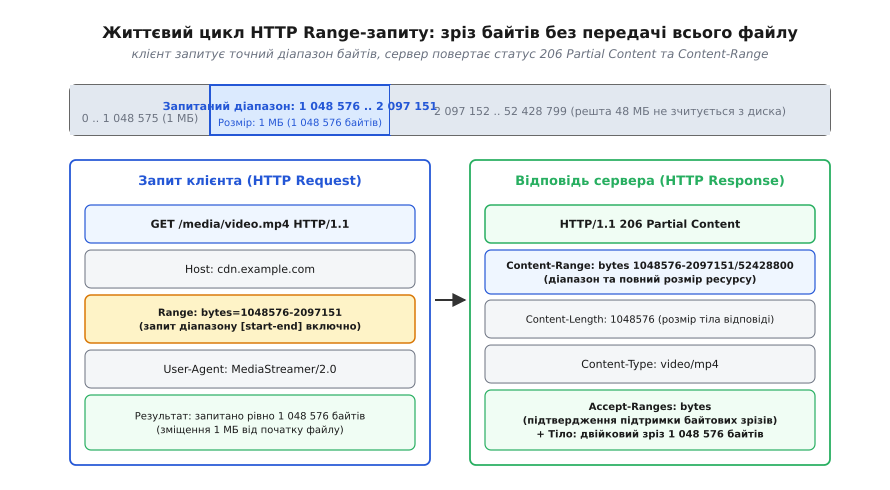
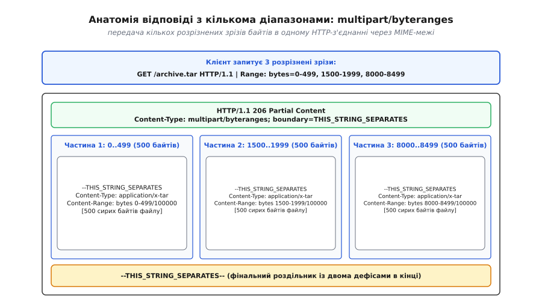
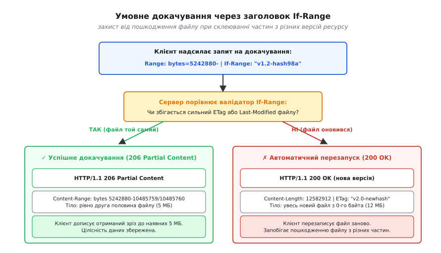
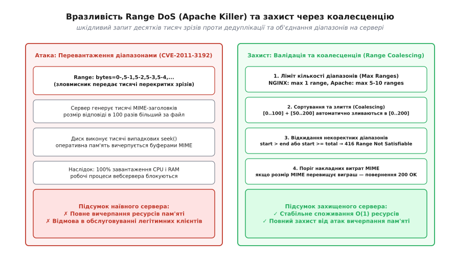
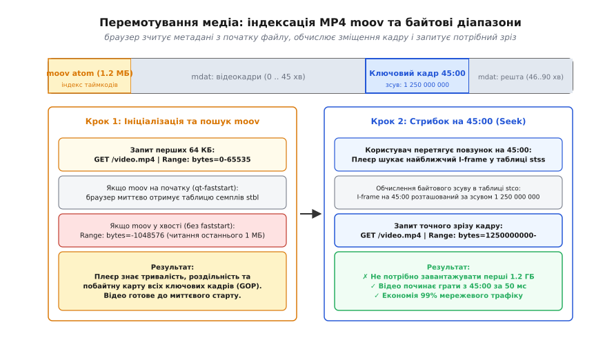

# ✂️ Часткові HTTP-запити (Range Requests)

Користувач завантажує інсталяційний образ операційної системи розміром 8,4 ГБ через мобільну мережу 4G. На позначці 8,1 ГБ (96% прогресу) смартфон перемикається між базовими станціями стільникового зв'язку: рівень сигналу падає до нуля, TCP-з'єднання скидається пакетом `RST`, а сокет у браузері аварійно закривається. Якщо веб-сервер та клієнт підтримують лише базовий протокол HTTP/1.0 без механізму вибіркового читання, браузер змушений відкинути вже завантажені 8100 мегабайтів і надіслати повторний запит `GET /os-image.iso` з нульового байта.

У масштабі дата-центру стрімінгового сервісу із 500 000 одночасних відеоплеєрів спроба передавати 4K-відеофайли (бітрейт 25 Мбіт/с) цілком призводить до миттєвого вичерпання вихідного мережевого каналу сервера та переповнення оперативної пам'яті клієнтських пристроїв. Коли глядач відкриває двогодинний фільм на 35 ГБ, щоб переглянути лише останні 5 хвилин, передача перших 33 ГБ є чистим марнуванням обчислювальних і мережевих ресурсів.

Розв'язанням обох інженерних викликів є механізм часткових запитів (HTTP Range Requests), стандартизований у специфікаціях IETF RFC 7233 та RFC 9110. Він перетворює статичний двійковий файл на адресовану послідовність байтів, дозволяючи клієнтам вичитувати довільні зрізи за константний час `O(1)`.

<preknowlist>
* [HTTP](topic:programming/http) — модель запит-відповідь, семантика методів та заголовки.
* [REST](topic:programming/rest-api) — ресурси, статус-коди та операції над представленнями.
* [HTTP-кешування](topic:programming/http-caching) — валідатори ETag, Last-Modified та умовні заголовки.
* [Архітектура завантаження файлів](topic:programming/file-uploads) — multipart-потоки, передача великих блоків та стійкість до розривів.
* [Об'єктне сховище](topic:programming/object-storage) — модель зберігання двійкових об'єктів (бакети, ключі, часткове читання).
</preknowlist>

Детальний аналіз еволюції технології від перших RFC 2068/2616 до сучасних хмарних CDN викладено в [історії стандарту та боротьбі із прискорювачами завантажень](topic:programming/http-range-requests/hist-range-requests.md).

## Виявлення підтримки часткових запитів (Range Discovery)

Перш ніж запитувати байтові інтервали, клієнт зобов'язаний з'ясувати, чи здатний сервер обробляти позиційне читання. Для цього клієнт надсилає легковикий метод `HEAD` або аналізує заголовки першої стандартної відповіді `GET`:

```http
HEAD /archive.tar.gz HTTP/1.1
Host: downloads.example.com

HTTP/1.1 200 OK
Content-Length: 104857600
Accept-Ranges: bytes
ETag: "f83a0-620e7a12"
Last-Modified: Fri, 15 Aug 2026 12:00:00 GMT
```

Ключовим маркером є заголовок відповіді `Accept-Ranges`:
1. `Accept-Ranges: bytes` — сервер офіційно декларує підтримку адресації в байтах. Клієнт має право надсилати запити з заголовком `Range`.
2. `Accept-Ranges: none` (або відсутність заголовка) — сервер не підтримує довільний доступ (наприклад, контент генерується динамічно на льоту через стиснення gzip, потоковий пайплайн або server-sent events). Будь-який заголовок `Range` буде проігноровано, а сервер поверне статус `200 OK` із повним тілом.


*Життєвий цикл HTTP Range-запиту та відповіді 206 Partial Content*

## Анатомія та арифметика байтових діапазонів

Заголовок `Range` використовує нульову індексацію (0-indexed) та **включні межі** (inclusive boundaries). Це означає, що діапазон `bytes=0-499` містить рівно 500 байтів: від байта 0 до байта 499 включно.

Специфікація стандарту підтримує три синтаксичні форми інтервалів:

```
1. Замкнений інтервал (start-end):
   Range: bytes=0-1023
   [Розмір: (1023 - 0 + 1) = 1024 байти]

2. Напіввідкритий інтервал (start-):
   Range: bytes=1048576-
   [Від 1 МБ до останнього байта (file_size - 1)]

3. Суфіксний інтервал (-suffix_length):
   Range: bytes=-512
   [Останні 512 байтів файлу: від (file_size - 512) до (file_size - 1)]
```

Для файлу загальним розміром `S` байтів формули обчислення довжини сегмента `L` та зміщень у двійковому файлі записуються так:

```
[Замкнений]  start <= end < S   => L = end - start + 1
[Відкритий]  start < S          => actual_end = S - 1,   L = S - start
[Суфіксний]  suffix <= S        => actual_start = S - suffix, L = suffix
```

Якщо суфікс перевищує загальний розмір файлу (`suffix > S`), сервер повертає весь файл повністю зі зміщенням `0-(S-1)`.

## Відповідь сервера: статус 206 Partial Content та Content-Range

Коли сервер успішно знаходить запитаний зріз, він відповідає кодом стану `206 Partial Content`. Відповідь містить заголовок `Content-Range`, який інформує клієнта про точне просторове розміщення переданого блоку в двійковому файлі:

```http
GET /video.mp4 HTTP/1.1
Host: cdn.example.com
Range: bytes=1048576-2097151

HTTP/1.1 206 Partial Content
Content-Type: video/mp4
Content-Range: bytes 1048576-2097151/104857600
Content-Length: 1048576
ETag: "vid-4k-hdr-2026"
Last-Modified: Sun, 10 Aug 2026 18:30:00 GMT

[1 МБ двійкових даних]
```

Заголовок `Content-Range: bytes 1048576-2097151/104857600` складається з трьох критичних компонентів:
* `bytes` — одиниця адресації.
* `1048576-2097151` — фактичні початковий і кінцевий індекси включно.
* `104857600` — повний розмір вихідного файлу в байтах (100 МБ). Якщо розмір ресурсу невідомий серверу заздалегідь (наприклад, живий аудіострім), замість числа ставиться зірочка: `bytes 0-4095/*`.

Заголовок `Content-Length` у відповіді 206 вказує **лише розмір переданого фрагмента** (тут рівно 1 048 576 байтів), а не розмір усього файлу.

### Помилка 416 Range Not Satisfiable

Якщо клієнт надсилає некоректний або недосяжний діапазон (наприклад, початкове зміщення `start` перевищує фактичний розмір файлу `S`), сервер зобов'язаний відхилити запит зі статусом `416 Range Not Satisfiable`:

```http
GET /image.iso HTTP/1.1
Host: downloads.example.com
Range: bytes=5000000000-6000000000

HTTP/1.1 416 Range Not Satisfiable
Content-Range: bytes */104857600
Content-Length: 0
```

У відповіді 416 поле `Content-Range` записується у форматі `bytes */<total_length>`, щоб клієнт міг дізнатися актуальний розмір ресурсу та скоригувати свої майбутні запити.

## Множинні діапазони та MIME-тип multipart/byteranges

Клієнт має можливість запросити кілька неперервних фрагментів в одному HTTP-запиті, перелічивши їх через кому:

```http
GET /book.pdf HTTP/1.1
Host: docs.example.com
Range: bytes=0-99, 500-599, 1200-1299
```

Оскільки HTTP-відповідь передає один потік байтів, сервер не може повернути звичайний плоский бінарний буфер. Замість цього сервер використовує спеціальний MIME-контейнер `Content-Type: multipart/byteranges; boundary=SEPARATOR`:

```http
HTTP/1.1 206 Partial Content
Content-Type: multipart/byteranges; boundary=3d92f57df30dec
Content-Length: 584

--3d92f57df30dec
Content-Type: application/pdf
Content-Range: bytes 0-99/10000

[100 байтів першого фрагмента]
--3d92f57df30dec
Content-Type: application/pdf
Content-Range: bytes 500-599/10000

[100 байтів другого фрагмента]
--3d92f57df30dec
Content-Type: application/pdf
Content-Range: bytes 1200-1299/10000

[100 байтів третього фрагмента]
--3d92f57df30dec--
```


*Анатомія відповіді з кількома діапазонами multipart/byteranges*

Кожна секція всередині `multipart/byteranges` має власні метадані: унікальний `Content-Range` та власний `Content-Type`. Тіло кожної секції відокремлюється символами нового рядка `\r\n`, префіксом `--` перед роздільником та фінальним постфіксом `--3d92f57df30dec--`.

Повний опис ABNF-граматики та заголовків зібрано в [довіднику заголовків, синтаксису BNF та статусів Range](topic:programming/http-range-requests/api-range-headers.md).

## Стан гонитви та умовний заголовок If-Range

Класична катастрофа докачування файлів виникає, коли файл змінюється на сервері безпосередньо під час паузи між завантаженнями.

Уявімо послідовність подій:
1. Клієнт завантажує перші 50 МБ файлу версії V1: `GET /installer.pkg` -> отримано байти 0..52428799.
2. З'єднання падає. Поки клієнт перебуває офлайн, розробники публікують нову версію файлу V2 (змінюється розмір, контент і ETag).
3. Клієнт відновлює з'єднання і наївно надсилає: `Range: bytes=52428800-`.
4. Сервер V2 повертає байти від 50 МБ версії V2.
5. Клієнт конкатенує початок від версії V1 і кінець від версії V2. У результаті файл отримує пошкоджену двійкову структуру та аварійно падає під час запуску (Data Corruption).


*Умовне докачування через заголовок If-Range*

Для атомарного розв'язання цієї проблеми введено умовний заголовок `If-Range`. Він приймає або **сильний ETag**, або дату `Last-Modified`:

```http
GET /installer.pkg HTTP/1.1
Host: updates.example.com
Range: bytes=52428800-
If-Range: "pkg-v1-hash-8a9f"
```

Логіка сервера є строго детермінованою:
* **Валідатор збігся:** Сервер гарантує, що файл не змінився, і повертає `206 Partial Content` з байтами `52428800-`.
* **Валідатор НЕ збігся:** Сервер бачить, що на диску вже версія V2. Замість повернення помилки `412 Precondition Failed` сервер ігнорує заголовок `Range` і **атомарно повертає повний новий файл V2 зі статусом 200 OK**.

Це дозволяє клієнту заощадити один повний мережевий круг (RTT), миттєво переходячи до завантаження свіжої версії без необхідності надсилати повторний запит.

### Чому слабкі ETag прямо заборонені в If-Range

Специфікація RFC 9110 §14.2 категорично забороняє використання слабких валідаторів (префікс `W/`, наприклад `W/"12345"`) у заголовку `If-Range`.

Слабкий ETag свідчить лише про те, що два представлення ресурсу є **семантично еквівалентними** (наприклад, однакова розмітка HTML з різними пробілами або однакові дані в різних кодуваннях). Проте механізм часткового докачування оперує сирими двійковими зміщеннями. Якщо в новому файлі з'явився хоча б один додатковий байт, усі наступні зміщення зміщуються, що призводить до повного руйнування бінарного файлу.

Тому будь-який валідатор `W/"..."` у заголовку `If-Range` розцінюється сервером як невідповідність (mismatch) і примусово повертає повну відповідь `200 OK`.

## Архітектура ядра: нуль-копіювальна передача (Zero-Copy)

Коли клієнт запитує байтовий зріз, традиційний веб-сервер виконує такі кроки:
1. `lseek(file_fd, start, SEEK_SET)` — переміщення вказівника файлу.
2. `read(file_fd, user_buffer, length)` — ядро копіює дані з блокового кешу файлової системи (Page Cache) у буфер процесу в просторі користувача (User Space).
3. `write(socket_fd, user_buffer, length)` — ядро копіює дані з пам'яті процесу в буфер мережевого сокета (Kernel TCP Buffer).
4. Мережева карта (NIC) зчитує TCP-буфер через DMA і відправляє пакети в Ethernet.

Цей конвеєр створює 4 перемикання контексту ядра (context switches) та 2 зайві операції копіювання оперативної пам'яті (`memcpy`) на кожний системний виклик.

```
Класичний підхід (User Buffer):
[ Диск ] ──DMA──► [ Page Cache ] ──memcpy──► [ User Buffer ] ──memcpy──► [ Socket Buffer ] ──DMA──► [ Мережева карта ]
                                  ▲                                ▲
                             User Space                       User Space

Zero-Copy підхід через sendfile(2):
[ Диск ] ──DMA──► [ Page Cache ] ────────────────────────────────────────► [ Socket Buffer ] ──DMA──► [ Мережева карта ]
                                         (Передача покажчиків у ядрі)
```

Сучасні високонавантажені сервери (NGINX, Envoy, Apache Traffic Server) використовують системний виклик `sendfile(2)` або `splice(2)`:

:::tabs
```c
#include <sys/sendfile.h>
#include <sys/types.h>

off_t offset = (off_t)start_byte;
size_t count = (size_t)(end_byte - start_byte + 1);
ssize_t sent = sendfile(client_socket_fd, file_fd, &offset, count);
```
```cpp
#include <sys/sendfile.h>
#include <cstdint>
#include <cstddef>
#include <expected>
#include <system_error>

inline std::expected<size_t, std::error_code> sendSlice(
    int socketFd, int fileFd, uint64_t start, uint64_t end) noexcept
{
    off_t offset = static_cast<off_t>(start);
    size_t count = static_cast<size_t>(end - start + 1);
    ssize_t sent = ::sendfile(socketFd, fileFd, &offset, count);
    if (sent < 0) {
        return std::unexpected(std::error_code(errno, std::generic_category()));
    }
    return static_cast<size_t>(sent);
}
```
:::

Системний виклик `sendfile(2)` виконує передачу безпосередньо між сторінковим кешем ядра та чергою дескрипторів DMA мережевого адаптера. Простір користувача взагалі не торкається байтів файлу, а навантаження на шину пам'яті CPU зменшується до нуля.

Практична реалізація повного неблокуючого сервера з парсером та zero-copy передачею детально розібрана в [робочому сервері часткових запитів на C та C++ з zero-copy передачею](topic:programming/http-range-requests/proj-range-server.md).

## Інженерні пастки, вразливості та Range DoS

### 1. Атака Apache Killer (CVE-2011-3192) та коалесценція діапазонів

У серпні 2011 року у веб-сервері Apache було знайдено критичну вразливість вичерпання пам'яті. Зловмисник надсилав один HTTP-запит із тисячами перекритих дрібних діапазонів:

```http
GET /large_file.pdf HTTP/1.1
Host: victim.example.com
Range: bytes=0-, 5-0, 5-1, 5-2, 5-3, 5-4, ... [ще 5000 діапазонів]
```

Для кожного діапазону сервер Apache виділяв окремий буфер пам'яті `multipart/byteranges` та викликав дорогі операції фрагментації. Один запит розміром 2 КБ спричиняв виділення сотень мегабайтів RAM та 100% завантаження CPU. Кілька таких паралельних запитів повністю заморожували багатоядерні сервери.


*Вразливість Range DoS та захист через коалесценцію*

Сучасний захист від Range DoS базується на двох правилах:
1. **Жорсткий ліміт кількості інтервалів:** Сервер приймає не більше `N` зрізів (зазвичай 5–16). Якщо запит містить більше, сервер або обрізає список, або повертає `200 OK` на весь файл.
2. **Алгоритм коалесценції (Range Coalescing):** Сервер сортує всі запитані діапазони за початковим зміщенням і зливає сусідні або перекриті відрізки в один: `[0..100]` + `[50..200]` перетворюються на монолітний `[0..200]`.

### 2. Конфлікт зі стисненням Content-Encoding (gzip/brotli)

Одна з найпоширеніших помилок архітектури — спроба динамічного gzip-стиснення відповідей з діапазонами.

Якщо веб-сервер виконує стиснення контенту на льоту, байтові зміщення у стисненому потоці кардинально відрізняються від зміщень у вихідному файлі. Якщо клієнт запитує `Range: bytes=0-1000`, а проксі-сервер стискає відповідь у gzip, клієнт отримає перші 1000 байтів gzip-архіву, які неможливо розпакувати окремо від решти файлу (помилка `CRC Checksum Mismatch` / `Decompression Failed`).

Правило побудови:
* Для файлів, що роздаються частинами, динамічне стиснення `Content-Encoding: gzip` має бути **вимкнено**.
* Якщо файл має зберігатися стисненим, його попередньо стискають повністю (pre-compressed), і клієнт запитує байтові діапазони вже безпосередньо від стисненого файлу `archive.tar.gz`.

## Взаємодія з проміжними проксі, кешами та CDN

Проміжні кешувальні сервери (Cloudflare, Fastly, AWS CloudFront, NGINX Proxy Cache) стикаються з дилемою при обробці часткових запитів: чи слід кешувати кожен отриманий зріз окремо, чи завантажувати повний файл у фоні?

### 1. Проблема фрагментації кешу (Cache Fragmentation)

Якщо проксі-сервер наївно включить заголовок `Range` у ключ кешування `proxy_cache_key $uri$is_args$args$http_range;`, кожен відеоплеєр створить унікальний запис у сховищі (наприклад, для `bytes=0-1048575`, `bytes=500000-1500000` тощо). Це призводить до катастрофічного падіння відсотка влучань у кеш (Cache Hit Ratio практично 0%) та швидкого вичерпання дискового простору вузла CDN дубльованими даними.

### 2. Архітектурне рішення: Слайсинг кешу (Slice Module)

Сучасні CDN-сервери використовують техніку **дискретного слайсингу** (наприклад, модуль `ngx_http_slice_module` в NGINX). Файл у сховищі віртуально ділиться на фіксовані блоки (наприклад, по 1 МБ або 4 МБ).

Конфігурація NGINX для слайсингу кешу:

```nginx
http {
    proxy_cache_path /var/cache/nginx levels=1:2 keys_zone=media_cache:100m max_size=50g;

    server {
        listen 80;
        server_name cdn.example.com;

        location /videos/ {
            slice             1m;
            proxy_cache       media_cache;
            proxy_cache_key   $uri$is_args$args$slice_range;
            proxy_set_header  Range $slice_range;
            proxy_http_version 1.1;
            proxy_pass        http://upstream_storage;
        }
    }
}
```

Механіка роботи модуля слайсингу:
1. Коли клієнт запитує довільний діапазон `Range: bytes=1500000-2500000`, NGINX розбиває його на два висхідних запити фіксованого розміру: `Range: bytes=1048576-2097151` (блок 1) та `Range: bytes=2097152-3145727` (блок 2).
2. Якщо ці блоки вже є в кеші CDN, вони миттєво віддаються клієнту з локального NVMe-диска.
3. Якщо блоків немає, NGINX завантажує рівно ці два 1-мегабайтні блоки з висхідного об'єктного сховища S3, зберігає їх у кеш під нормалізованими ключами та склеює точний запитаний зріз для клієнта.

Це гарантує максимальний Cache Hit Ratio незалежно від того, які саме зміщення запитують різні відеоплеєри.

## Семантика часткових запитів у HTTP/2 та HTTP/3

З появою мультиплексованих бінарних протоколів HTTP/2 та HTTP/3 обробка часткових запитів отримала додаткові оптимізації продуктивності:

### 1. Мультиплексування без відкриття додаткових TCP-з'єднань

В епоху HTTP/1.1 менеджери паралельного докачування були змушені відкривати 8–16 окремих TCP-з'єднань до сервера. Це створювало величезне навантаження на таблицю станів ядра `ip_conntrack` та спричиняло повільний старт TCP (Slow Start) на кожному підключенні.

У HTTP/2 та HTTP/3 клієнт відкриває **одне-єдине транспортне з'єднання**, всередині якого створює незалежні віртуальні потоки (Streams). Кожен потік передає власний Range-запит (`Stream 1: bytes=0-10M`, `Stream 3: bytes=10M-20M`, `Stream 5: bytes=20M-30M`).

### 2. Керування вікном потоку (Flow Control Backpressure)

Коли браузер відтворює важке 4K-відео, швидкість читання кадрів декодером може бути меншою за швидкість мережевого каналу. У HTTP/2 та HTTP/3 клієнт регулює швидкість надходження байтів за допомогою кадрів `WINDOW_UPDATE`. Якщо відеобуфер заповнено на 30 секунд уперед, плеєр призупиняє збільшення вікна потоку, і сервер автоматично призупиняє читання з диска через системний виклик `sendfile`, запобігаючи неконтрольованому споживанню RAM.

### 3. Усунення Head-of-Line Blocking у HTTP/3 (QUIC)

У мережах HTTP/2 над TCP втрата одного-єдиного IP-пакета призводить до зупинки передачі всіх паралельних потоків у з'єднанні (TCP Head-of-Line Blocking). Протокол HTTP/3, побудований поверх UDP та QUIC, забезпечує повну ізоляцію потоків на транспортному рівні: втрата пакета в потоці завантаження аудіодоріжки ніяк не затримує передачу відеокадрів в іншому потоці.

## Архітектура клієнтських відеоплеєрів: HTML5 Video та MSE

Взаємодія відеоплеєрів із частковими запитами зазнала фундаментальної еволюції: від нативного тегу `<video>` до програмно керованих буферів Media Source Extensions (MSE).

### 1. Нативне планування діапазонів у тезі video

Коли браузер завантажує простий тег `<video src="movie.mp4">`, мережевий стек браузера самостійно керує Range-запитами:
1. **Перший зондувальний запит:** Браузер відправляє `Range: bytes=0-1` або `Range: bytes=0-32767`. Мета цього виклику — перевірити підтримку `Accept-Ranges: bytes`, отримати загальний розмір файлу `Content-Range: bytes 0-1/36700160000` та вичитати перші заголовки MP4.
2. **Вичитування метаданих:** Якщо атом `moov` розташований на початку файлу, браузер вичитує його і переходить у стан готовності `canplaythrough`.
3. **Послідовне буферизаційне вікно:** Під час відтворення браузер запитує наступні блоки розміром від 512 КБ до 2 МБ (`bytes=1048576-3145727`), наповнюючи внутрішній буфер `TimeRanges` приблизно на 15–30 секунд вперед.

### 2. Чому монолітні MP4 поступилися HLS та DASH

Прямий Range-доступ до монолітного MP4 має суттєве обмеження: він не підтримує адаптивну зміну якості (Adaptive Bitrate Streaming, ABR). Якщо у користувача в метро просідає пропускна здатність мережі з 50 Мбіт/с до 2 Мбіт/с, плеєр із монолітним MP4 зупиняється на нескінченну буферизацію.

Сучасні платформи (YouTube, Netflix, Twitch) використовують протоколи HLS (HTTP Live Streaming) та MPEG-DASH. Проте механізм Range залишається критичним і в цих стандартах:
* **HLS з байтовими діапазонами:** Замість розрізання відео на мільйони дрібних файлів `.ts` на диску формується один великий файл трансляції, а маніфест плейлиста `playlist.m3u8` вказує точні зміщення через тег `#EXT-X-BYTERANGE:length@offset`:

```m3u8
#EXTM3U
#EXT-X-TARGETDURATION:6
#EXT-X-VERSION:4
#EXT-X-BYTERANGE:1520400@0
segment.mp4
#EXT-X-BYTERANGE:1489200@1520400
segment.mp4
#EXT-X-BYTERANGE:1601000@3009600
segment.mp4
```

Клієнтський плеєр на базі `hls.js` або `dash.js` парсить цей маніфест і через JavaScript Fetch API надсилає точні HTTP Range-запити, передаючи отримані байти в об'єкт `SourceBuffer` браузера.

## Безпека, авторизація та контроль цілісності (RFC 9530)

Використання часткових запитів створює додаткові виклики для систем безпеки та авторизації доступу:

### 1. Авторизація діапазонів через тимчасово підписані URL (Presigned URLs)

Коли приватний контент (наприклад, платний навчальний курс або архів корпоративних документів) зберігається в об'єктному сховищі S3, бекенд генерує підписаний URL із обмеженим часом життя (TTL).

Якщо сервіс надає безкоштовне 5-хвилинне прев'ю платного 2-годинного фільму, сервер не повинен дозволяти клієнту зчитувати байти за межами прев'ю. Якщо підписаний URL не фіксує дозволені межі зміщень, зловмисник може просто підставити заголовок `Range: bytes=500000000-` і завантажити весь платний контент. Для захисту токени авторизації підписують або допустимі межі зміщень у полі політики доступу (Policy Statements), або використовують спеціальний проксі-шлюз авторизації.

### 2. Заголовки CORS для браузерних веб-застосунків

Коли клієнтський JavaScript-застосунок (наприклад, плеєр на React або PDF-переглядач на WebAssembly) завантажує контент з іншого домену через `fetch()`, браузер за замовчуванням блокує доступ до службових заголовків відповіді відповідно до політики Cross-Origin Resource Sharing (CORS).

Щоб браузер дозволив JavaScript-коду прочитати параметри зрізу, сервер зобов'язаний явно експортувати заголовки часткового читання у конфігурації CORS:

```http
Access-Control-Allow-Origin: https://app.example.com
Access-Control-Allow-Methods: GET, HEAD, OPTIONS
Access-Control-Allow-Headers: Range, If-Range
Access-Control-Expose-Headers: Content-Range, Accept-Ranges, Content-Length, ETag
```

Без директиви `Access-Control-Expose-Headers` клієнтський код отримає бінарні байти, проте поле `response.headers.get('Content-Range')` поверне `null`, що унеможливить розрахунок позиції буфера у відеоплеєрі.

### 3. Валідація цілісності зрізів: RFC 9530 (Digest Fields)

Історичний заголовок `Content-MD5` був визнаний застарілим, оскільки він створював неоднозначність: чи обчислюється хеш для переданого фрагмента, чи для всього вихідного файлу?

Сучасний стандарт RFC 9530 розділяє поняття контрольної суми повного ресурсу та окремого повідомлення:
* `Repr-Digest: sha-256=:X48E9qUxLjnwTtw=:` — хеш-сума всього файлу (Representation Digest), яка залишається незмінною для всіх запитів 206.
* `Content-Digest: sha-256=:mZ3k8Y...=:` — хеш-сума переданого в даній конкретній відповіді байтового зрізу.

Це дозволяє клієнту надійно перевірити цілісність кожного завантаженого чанка одразу після отримання, не чекаючи завершення завантаження гігабайтного файлу цілком.

## Делегування роздачі через X-Accel-Redirect та Reverse Proxies

У класичній тришаровій веб-архітектурі динамічний бекенд (написаний на Node.js, Go, Python або Ruby) не повинен самостійно тримати відкриті сокети для передачі гігабайтних відеофайлів клієнтам. Якщо веб-додаток Node.js почне транслювати 10 000 паралельних відеопотоків, цикл подій (Event Loop) буде заблоковано чергами I/O.

Рішенням є патерн **внутрішнього перенаправлення** (Internal Redirection):
1. Клієнт надсилає `GET /api/v1/stream/lesson_4k.mp4` із заголовком `Range: bytes=0-1048575`.
2. Бекенд Node.js виконує перевірку JWT-токена, прав доступу користувача до курсу та лімітів підписки.
3. Якщо доступ підтверджено, бекенд повертає легку порожню відповідь із спеціальним службовим заголовком:
   ```http
   HTTP/1.1 200 OK
   X-Accel-Redirect: /internal-storage/lesson_4k.mp4
   X-Accel-Buffering: no
   Content-Type: video/mp4
   ```
4. Фронтенд-сервер NGINX перехоплює цей заголовок, приховує його від клієнта і самостійно обслуговує вхідний заголовок `Range: bytes=0-1048575`, передаючи байти безпосередньо з NVMe через системний виклик `sendfile(2)`.

Бекенд звільняє робочий потік за 2 мілісекунди, а важка роздача медіа повністю делегується оптимізованому рушію C/NGINX.

## Обробка помилок та таймаутів у розподілених мікросервісах

У високонавантажених хмарних шлюзах (S3 Proxy Gateways) передача часткових відповідей супроводжується специфічними крайовими станами:
1. **Таймаути клієнта (Slowloris / Mobile Drops):** Якщо мобільний клієнт читає сокет занадто повільно (наприклад, 1 байт на секунду), виклик `sendfile` блокується у буфері TCP. Сервер зобов'язаний встановлювати тайм-аут передачі зрізу (`send_timeout 30s` у NGINX) та примусово закривати сокет із внутрішнім кодом `499 Client Closed Request`, щоб звільнити системні дескриптори.
2. **Трансляція статусу 416:** Якщо висхідне сховище S3 повертає `416 Range Not Satisfiable`, мікросервісний шлюз не повинен обертати це в `500 Internal Server Error`. Він зобов'язаний прозоро прокинути заголовок `Content-Range: bytes */TOTAL` клієнту, дозволивши відеоплеєру дізнатися актуальний розмір оновленого файлу.

### 4. Робота у прогресивних веб-застосунках (PWA та Service Workers)

Сучасні офлайн-орієнтовані веб-застосунки використовують фонові перехоплювачі `Service Worker` та Cache API. Проте браузерний `CacheStorage` за стандартом W3C не підтримує нативне збереження відповідей 206 зі статусом `opaque`.

Якщо відеоплеєр надсилає Range-запит всередині Service Worker, обробник події `fetch` зобов'язаний або вичитати повну відповідь із локального IndexedDB/CacheStorage і вручну зрізати байтовий буфер через `ArrayBuffer.prototype.slice(start, end)`, сформувавши синтетичну відповідь `new Response(slicedBlob, { status: 206, headers: { 'Content-Range': ... } })`, або делегувати запит безпосередньо у мережу через `fetch(event.request)`. Бібліотека Google Workbox містить спеціальний модуль `workbox-range-requests`, який автоматизує цей слайсинг у пам'яті клієнта.

## Порівняння: завантаження через Range проти вивантаження через TUS

Механізм HTTP Range Requests оптимізований виключно для сценарію **вичитування з сервера** (Download / GET). Для протилежного завдання — відновлюваного вивантаження гігабайтних файлів від клієнта на сервер (Resumable Upload) — стандартного розширення на базі Range у RFC 9110 не передбачено (історичні спроби передавати `Content-Range` у методах `PUT` та `PATCH` призвели до несумісності між веб-серверами).

Для симетричного розв'язання задачі вивантаження індустрія стандартизувала відкритий протокол **TUS (tus.io)**:

| Характеристика | HTTP Range Requests | Протокол TUS (tus.io) |
| :--- | :--- | :--- |
| **Основний напрямок передачі** | Завантаження з сервера (Download / GET) | Вивантаження на сервер (Upload / PATCH) |
| **Стандарт IETF** | RFC 7233 / RFC 9110 §14 | IETF Draft Resumable Uploads |
| **Керування зміщенням** | Заголовок запиту `Range: bytes=S-E` | Заголовок запиту `Upload-Offset: N` |
| **Створення сесії** | Не потрібне (stateless GET) | Метод `POST` для створення ресурсу завантаження |
| **Одиниця адресації** | Довільні байти у випадковому порядку | Строго послідовні байти (append-only) |
| **Підтримка CDN / Кешів** | Повна нативна підтримка у всіх CDN | Потребує підтримки динамічного бекенду |

Поєднання HTTP Range для читання та протоколу TUS для запису утворює закінчену архітектуру стійкої роботи з великими бінарними об'єктами в умовах ненадійних мобільних каналів зв'язку.

## Низькорівневе тестування та діагностика через curl

Для перевірки коректності поведінки сервера, обчислення зміщень та діагностики помилок 416 використовуються утиліти командного рядка:

```bash
# 1. Запит першого мегабайта файлу з відображенням службових заголовків
curl -i -H "Range: bytes=0-1048575" https://cdn.example.com/video.mp4

# 2. Суфіксний запит останніх 512 байтів файлу (читання moov-атома або Parquet footer)
curl -i -H "Range: bytes=-512" https://cdn.example.com/data.parquet

# 3. Перевірка роботи умовного валідатора If-Range (має повернути 206)
curl -i -H "Range: bytes=1000-" -H 'If-Range: "pkg-v1-hash-8a9f"' https://cdn.example.com/archive.zip

# 4. Перевірка спрацьовування захисту від некоректного діапазону (очікується HTTP 416)
curl -i -H "Range: bytes=999999999999-" https://cdn.example.com/small.txt
```

## Реальні сценарії використання у виробничих системах

### 1. Перемотування медіафайлів (MP4 FastStart та moov-атом)

Контейнер MP4 складається з блоків даних (атомів/боксів):
* `mdat` (Media Data) — сирі аудіо- та відеофрейми (можуть займати 99% файлу).
* `moov` (Movie Atom) — таблиця індексації часових міток, ключових кадрів та зміщень байтів (займає кілька мегабайтів).


*Перемотування медіафайлу через індексацію MP4 moov та байтові діапазони*

Якщо атом `moov` записано наприкінці файлу після 10 ГБ блоку `mdat`, відеоплеєр не зможе почати відтворення, доки не прочитає `moov`. Механізм Range рятує ситуацію:
1. Плеєр робить суфіксний запит `Range: bytes=-65536` і зчитує останні 64 КБ файлу, знаходячи заголовок `moov`.
2. Вичитує весь блок `moov` через окремий Range-запит.
3. Коли глядач перемотує відео на 45-ту хвилину, плеєр дивиться у таблицю `moov`, миттєво знаходить точне зміщення байта відповідного ключового кадру (`byte 452981200`) і надсилає `Range: bytes=452981200-`.

### 2. Лінеаризовані документи PDF (Fast Web View)

Стандарт PDF Linearization (ISO 32000-1 Annex F) розміщує на початку PDF-файла спеціальну таблицю лінійних покажчиків сторінок (Linearization Dictionary). Коли користувач відкриває 1000-сторінковий звіт на 500 МБ, Adobe Acrobat або браузерний PDF-переглядач надсилає Range-запит на перші 16 КБ файлу, отримує таблицю зсувів і потім запитує виключно байти сторінки №1 (`Range: bytes=102400-143360`). Сторінка відображається за 50 мілісекунд без завантаження решти 499 МБ.

### 3. Хмарні об'єктні сховища (S3 / GCS Range GETs) та аналітика Parquet

Усі провідні хмарні платформи (AWS S3, Google Cloud Storage, Cloudflare R2) підтримують заголовок `Range` у своїх REST API. Це основа сучасних форматів аналітичних даних, таких як Apache Parquet, Apache ORC та DuckDB-over-HTTP.

Двійковий формат Parquet влаштовано так:
1. Початок і кінець файлу містять 4-байтову сигнатуру `PAR1`.
2. Перед кінцевою сигнатурою збережено 4-байтове число довжини метаданих схеми (`Length`) та самі метадані (`FileMetaData`), які містять точні зміщення кожної колонки у файлі.

```
Структура файлу Apache Parquet:
[ PAR1 (4B) ] [ Data Page (Col A) ] [ Data Page (Col B) ] ... [ FileMetaData ] [ Len (4B) ] [ PAR1 (4B) ]
```

Аналітичний двигун (ClickHouse, DuckDB або AWS Athena) виконує SQL-запит над 500-гігабайтним файлом у хмарі S3 наступним чином:
1. Виконує суфіксний запит `Range: bytes=-8` для отримання довжини `FileMetaData`.
2. Вичитує блок метаданих схеми через `Range: bytes=(S-8-Len)-(S-9)`.
3. Дізнавшись зміщення колонки `user_id` (`offset 4194304..8388607`), аналізатор надсилає один-єдиний Range GET на 4 МБ, повністю ігноруючи решту 499,99 ГБ файлу.

## Порівняння реалізацій парсера Range

Нижче наведено фрагмент виробничого парсера для аналізу заголовка `Range` мовами C та C++:

:::tabs
```c
#include <stdio.h>
#include <stdlib.h>
#include <string.h>
#include <stdint.h>
#include <stdbool.h>

typedef struct {
    uint64_t start;
    uint64_t end;
    bool is_valid;
} SingleByteRange;

SingleByteRange parse_single_range(const char *header, uint64_t file_size) {
    SingleByteRange range = {0, 0, false};
    if (!header || strncmp(header, "bytes=", 6) != 0 || file_size == 0) {
        return range;
    }
    const char *p = header + 6;
    char *dash = strchr(p, '-');
    if (!dash) return range;

    if (p == dash) {
        /* Формат -suffix: останні N байтів */
        char *end_ptr;
        uint64_t suffix = strtoull(dash + 1, &end_ptr, 10);
        if (end_ptr != dash + 1 && suffix > 0) {
            range.start = (suffix >= file_size) ? 0 : (file_size - suffix);
            range.end = file_size - 1;
            range.is_valid = true;
        }
    } else if (*(dash + 1) == '\0') {
        /* Формат start-: від start до кінця */
        char *end_ptr;
        uint64_t start = strtoull(p, &end_ptr, 10);
        if (end_ptr == dash && start < file_size) {
            range.start = start;
            range.end = file_size - 1;
            range.is_valid = true;
        }
    } else {
        /* Формат start-end */
        char *end_ptr1, *end_ptr2;
        uint64_t start = strtoull(p, &end_ptr1, 10);
        uint64_t end = strtoull(dash + 1, &end_ptr2, 10);
        if (end_ptr1 == dash && *end_ptr2 == '\0' && start <= end && start < file_size) {
            range.start = start;
            range.end = (end >= file_size) ? (file_size - 1) : end;
            range.is_valid = true;
        }
    }
    return range;
}
```
```cpp
#include <string_view>
#include <charconv>
#include <optional>
#include <cstdint>
#include <algorithm>

struct ByteRange {
    uint64_t start{0};
    uint64_t end{0};

    [[nodiscard]] constexpr uint64_t length() const noexcept {
        return end - start + 1;
    }
};

class RangeHeaderParser {
public:
    [[nodiscard]] static std::optional<ByteRange> parseSingle(
        std::string_view header,
        uint64_t fileSize) noexcept
    {
        if (fileSize == 0 || !header.starts_with("bytes=")) {
            return std::nullopt;
        }
        header.remove_prefix(6);

        auto dashPos = header.find('-');
        if (dashPos == std::string_view::npos) {
            return std::nullopt;
        }

        auto startStr = header.substr(0, dashPos);
        auto endStr = header.substr(dashPos + 1);

        if (startStr.empty()) {
            // Формат -suffix
            uint64_t suffix = 0;
            if (auto [p, ec] = std::from_chars(endStr.data(), endStr.data() + endStr.size(), suffix);
                ec == std::errc{} && suffix > 0) {
                uint64_t start = (suffix >= fileSize) ? 0 : (fileSize - suffix);
                return ByteRange{start, fileSize - 1};
            }
            return std::nullopt;
        }

        uint64_t start = 0;
        if (auto [p, ec] = std::from_chars(startStr.data(), startStr.data() + startStr.size(), start);
            ec != std::errc{} || start >= fileSize) {
            return std::nullopt;
        }

        if (endStr.empty()) {
            // Формат start-
            return ByteRange{start, fileSize - 1};
        }

        // Формат start-end
        uint64_t end = 0;
        if (auto [p, ec] = std::from_chars(endStr.data(), endStr.data() + endStr.size(), end);
            ec == std::errc{} && start <= end) {
            return ByteRange{start, std::min(end, fileSize - 1)};
        }

        return std::nullopt;
    }
};
```
:::

## Зведена таблиця поведінки статус-кодів

Нижче наведено матрицю прийняття рішень сервера при обробці запитів із частковим доступом:

| Вхідні умови | Заголовок Range | If-Range валідатор | Статус відповіді | Тіло відповіді |
| :--- | :--- | :--- | :--- | :--- |
| Ресурс існує, Range коректний | `bytes=0-499` | Відсутній або збігся | `206 Partial Content` | 500 байтів зрізу |
| Ресурс змінився | `bytes=0-499` | Не збігся (Mismatch) | `200 OK` | Весь новий файл |
| Слабкий валідатор | `bytes=0-499` | `W/"weak-etag"` | `200 OK` | Весь новий файл (Fallback) |
| Зміщення поза межами файлу | `bytes=999999-` | Не має значення | `416 Range Not Satisfiable` | Порожнє (`Content-Range: bytes */S`) |
| Одиниця не підтримується | `seconds=10-20`| Не має значення | `200 OK` | Весь файл повністю |

Часткові запити залишаються фундаментом надійності сучасного інтернету: вони перетворюють крихкий монолітний HTTP-трафік на еластичні, відновлювані потоки даних, здатні безвідмовно працювати в умовах нестабільних бездротових з'єднань і терабайтних обсягів інформації.
