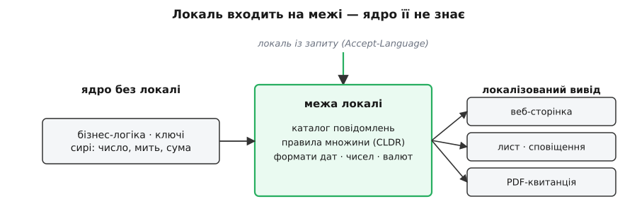
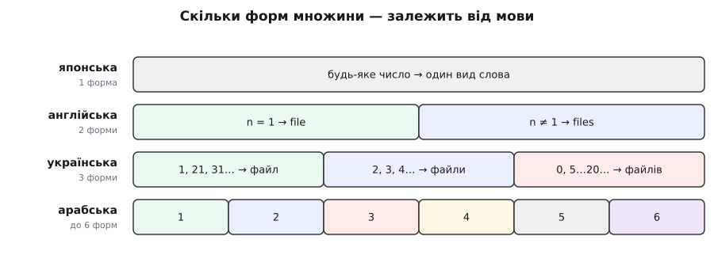

# i18n як архітектура (не переклад)

<preknowlist>
- [ASCII і UTF-8](topic:programming/ascii-utf8) — текст у машині це закодовані байти; єдиний універсальний набір символів (Unicode) — підмурок, на якому взагалі стає можливою багатомовність.
- [Узгодження вмісту](topic:programming/content-negotiation) — як сервер із запиту дізнається, якою мовою відповідати клієнтові (заголовок `Accept-Language`).
</preknowlist>

Найкоротший шлях зробити застосунок багатомовним здається очевидним: зібрати всі написи, віддати перекладачеві, підставити переклади назад. Спробуймо на одному рядку — і одразу впремося в стіну.

Фразу «У вас {count} нових повідомлень» програміст складає найприроднішим способом — вставляє число в готовий рядок:

```ts
const text = `У вас ${count} нових повідомлень`;
```

І дивиться, що виходить для різних значень:

```
count = 1  →  «У вас 1 нових повідомлень»   ← мало бути «1 нове повідомлення»
count = 2  →  «У вас 2 нових повідомлень»   ← мало бути «2 нові повідомлення»
count = 5  →  «У вас 5 нових повідомлень»   ← випадково влучили
```

Перекладачеві тут нема чого виправляти. Немає окремого хибного рядка: слово «повідомлення» саме́ мусить міняти форму залежно від числа, а програма про це не знає. Українська має три форми множини — «1 файл», «2 файли», «5 файлів», — і яку взяти, диктує число за граматичним правилом. Англійська обходиться двома, тож звичне для неї `count === 1 ? 'file' : 'files'` — це не переклад, а англійська граматика, вмурована в структуру коду. Замінити її на українську підстановкою рядків годі: саме́ правило інше, і живе воно в `if`, а не в тексті.

Отже, задач насправді дві, і вони різні за природою. Перша — один раз перебудувати програму так, щоб у ній не лишилося жодного припущення про конкретну мову чи країну: ні напису-літерала в коді, ні «одиниця → однина, решта → множина», ні формату дати `MM/DD`. Це **інтернаціоналізація** (від лат. *inter* — між, *natio* — народ): не переклад, а підготовка структури. Її скорочують до **i18n** — «i», далі вісімнадцять літер, далі «n». Друга задача — під кожну мову й регіон залити дані: переклади, правила множини, формати. Це **локалізація** (**l10n**, десять літер між «l» і «n»): її роблять багато разів, і кожна нова мова — уже не зміна коду, а новий набір даних. [Звідки взялися ці числові скорочення й перші каталоги перекладів](topic:programming/i18n-as-architecture/hist-i18n-numeronyms.md) — окрема історія інженерного побуту.

Різниця між цими двома задачами — і є вся суть. Локалізацію можна робити коли завгодно й скільки завгодно разів; вона дешева й пізня. Інтернаціоналізація — одне рішення на початку, і коштує воно дорого рівно тоді, коли ухвалене запізно. Формулюється це рішення в один рядок: **жодне звернене до людини значення не народжується літералом усередині логіки — кожне проходить крізь межу, яка знає локаль.** Число стає написом, дата — рядком, ключ повідомлення — фразою лише на цій межі, не раніше.

Тут виступає слово тонше за «мову». Формат дати, десятковий роздільник, знак валюти, порядок сортування слів, перший день тижня, напрям письма — усе це залежить не від мови, а від **локалі** (від лат. *locālis* — місцевий): пари «мова + регіон з його домовленостями». Англійська у США пише дату як `7/25/2026`, у Британії — `25/07/2026`; німецька в Німеччині ставить кому десятковим роздільником (`1.234,56`), а та сама німецька у Швейцарії — `1'234.56`. Мова одна, локаль різна — тому крізь програму несуть не «мову», а локаль. Вона входить на межі, де сервер читає бажану мову клієнта з запиту ([узгодження вмісту](topic:programming/content-negotiation)), лягає в контекст запиту й супроводжує кожне звернене до людини значення аж до виводу. А коли для локалі бракує перекладу, значення не зникає: діє запасний ланцюжок `uk-UA → uk → мова-основа проєкту`, тож користувач бачить хоч щось осмислене, а не порожнечу чи голий ключ.

Ця межа проступає не лише на веб-сторінці. Лист, [сповіщення](topic:programming/notification-templating), PDF-квитанція — кожен канал, що виходить до людини, мусить пройти крізь неї; натомість службовий лог лишають однією мовою, бо його читає інженер, а не користувач. Локаль — не глобальний стан програми, а параметр, що тече від входу до кожного виходу.


*Ядро тримає лише логіку, ключі й сирі значення; локаль входить на межі й лише там перетворює їх на текст для людини.*

> 🔧 **Навіщо це.** Зворотний шлях — «спершу зробимо англійською, мови додамо потім» — згодом обертається переписуванням тисяч місць, де рядок склеєно вручну, форму вибрано `if`-ом, а дату відформатовано як `MM/DD`. Дешевий шлях один: із першого дня проводити кожен напис через каталог повідомлень за ключем, а кожну дату, число й суму — через локале-залежний форматувальник. Тоді додати українську на п'ятдесятому тижні проєкту — це новий файл перекладу, а не міграція коду.

Механізм множини показує все це найгостріше. Скільки форм має мова і яку коли брати — це функція від числа, задана окремо для кожної мови. Unicode звів ці правила в один загальний звід — CLDR (Common Locale Data Repository) — і назвав можливі форми шістьма мітками: `zero`, `one`, `two`, `few`, `many`, `other`. Японській вистачає однієї (число не міняє слова), англійській — двох, українській — трьох, арабська сягає всіх шести. Тому код не має права вибирати форму сам: він передає на локале-залежну межу *число* і *ключ повідомлення*, а та за правилами локалі обирає форму й підставляє. [Робочий приклад такого вибору форми й складання фрази з іменованих місць](topic:programming/i18n-as-architecture/proj-plural-message-format.md) показує, як це працює всередині.


*Та сама кількість членує слово на різне число форм — і поділ цей у кожної мови свій; ось чому вибір форми не можна зашити в код.*

Тому i18n — це архітектура, а не переклад. Переклад — частина дешева, пізня й повторювана: рядки й правила доливають будь-коли. Архітектура — рішення, ухвалене раз: тримати структуру коду вільною від граматики будь-якої однієї мови й від домовленостей будь-якого одного регіону. Хто зробив це на початку, додає мову як дані; хто відклав — переписує програму.
