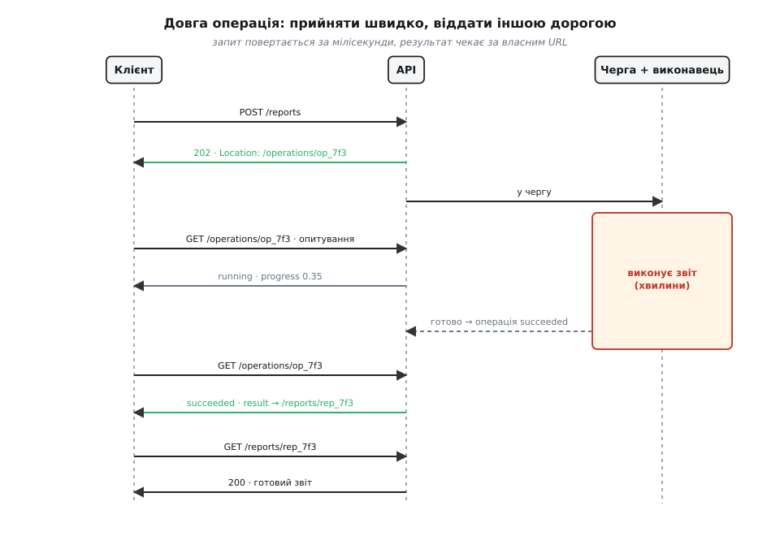
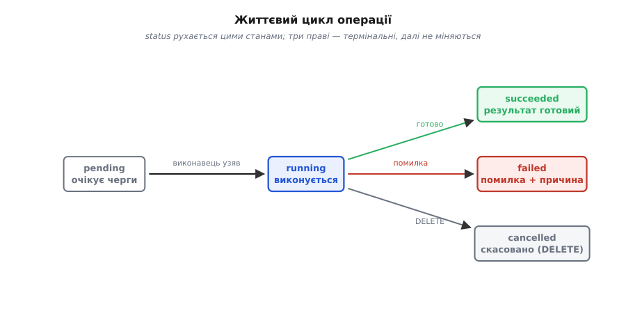

# Довга операція

<preknowlist>
- [HTTP](topic:programming/http) — модель «запит → відповідь», методи POST/GET/DELETE, коди відповіді (202, 200) і заголовки Location та Retry-After.
- [REST](topic:programming/rest-api) — річ на сервері як ресурс із власним URL, який створюють, читають і видаляють.
- [Черга задач](topic:programming/background-jobs) — робота, яку віддають фоновому виконавцю замість того, щоб робити її в потоці запиту.
</preknowlist>

Натисни в застосунку «Сформувати звіт за квартал» — і сервер має підняти сотні тисяч рядків, порахувати підсумки, зверстати PDF. Це хвилини, не мілісекунди. Найпростіша думка: хай запит висить відкритим, сервер тим часом усе зробить і поверне готовий файл у тій самій відповіді. Ця думка розбивається об те, як влаштований HTTP.

HTTP-обмін скроєно під короткі діалоги: запит пішов — відповідь швидко повернулася. Тримати з'єднання відкритим три хвилини не дає ніхто на шляху. У браузера, у зворотного проксі, у балансувальника, у шлюзу — у кожного свій таймаут, і типово це десятки секунд (nginx рве неактивне з'єднання за 60 секунд за замовчуванням). Десь на цьому шляху канал обірвуть раніше, ніж звіт буде готовий.

А коли канал обірвано, клієнт бачить саму лише помилку — і не знає головного: робота таки виконалася чи ні. Може, сервер дорахував звіт саме тоді, коли зв'язок згас. Повторити запит наосліп небезпечно: якщо перший таки пройшов, дістанеш другий нарахунок зарплати чи другий переказ. А поки триває чекання, потік-обробник на сервері прикутий до одного клієнта й нічого не робить, лиш чекає, — під навантаженням пул таких потоків вичерпається. І весь цей час клієнт дивиться на крутілку, не знаючи, це 10% чи 90%.

Висновок ставиться сам: результат довгої роботи не можна віддати тим самим з'єднанням, яким його попросили. Запит мусить повернутися швидко, а результат — прийти іншою дорогою.

## Операція стає ресурсом

Розв'язок — розчепити «прийняв» і «віддав». Замість того щоб повертати результат, сервер повертає посилання на саму роботу. `POST /reports` тепер не формує звіт, а створює **операцію** — маленький запис із власним ідентифікатором та URL, що означає «оцю роботу взято в роботу». Сервер відповідає негайно кодом `202 Accepted` («прийнято», але ще не виконано) і вказує, де стежити, заголовком `Location: /operations/op_7f3`. А важку роботу кладе в [чергу задач](topic:programming/background-jobs), звідки її підхопить фоновий виконавець.

Тут спрацьовує погляд [REST](topic:programming/rest-api): операція — така сама річ із URL, як користувач чи звіт. Її можна прочитати, і саме це дає клієнтові дорогу до результату.

> 🔧 **Навіщо це.** Так під капотом працює майже кожна кнопка «Експортувати», «Згенерувати звіт», «Імпортувати CSV», «Відрендерити відео» в серйозному продукті. Побачив у відповіді 202 і Location замість готового вмісту — це воно.



*Запит повертається за мілісекунди з посиланням на операцію; важка робота йде у фоні; клієнт спостерігає за операцією, поки не дізнається, що результат готовий, і забирає його з окремого URL.*

## Клієнт спостерігає за операцією

Тепер в операції є власне життя, і клієнт може в нього зазирати. `GET /operations/op_7f3` повертає її стан: `{"status":"running","progress":0.35}`. Клієнт опитує цей URL кожні кілька секунд — це й зветься **опитуванням** (англ. *polling* — «промацування»). Аж поки не прийде `{"status":"succeeded","result":"/reports/rep_7f3"}` — і клієнт піде за цим посиланням по готовий звіт. Або `{"status":"failed","error":{…}}` — і тоді клієнт **точно** знає, що робота провалилася і чому, без здогадів, які мучили його при обірваному з'єднанні.

**Повний обмін від замовлення до результату:**

```
→ POST /reports              {"period":"2026-Q2"}
← 202 Accepted
  Location: /operations/op_7f3
  Retry-After: 2

→ GET /operations/op_7f3
← 200 OK   {"status":"running","progress":0.35}

     (за 2 секунди)
→ GET /operations/op_7f3
← 200 OK   {"status":"succeeded","result":"/reports/rep_7f3"}

→ GET /reports/rep_7f3
← 200 OK   <готовий звіт>
```

Три URL — три ролі: `/reports` приймає замовлення, `/operations/op_7f3` показує поступ, `/reports/rep_7f3` віддає результат. [Робочу реалізацію цього обміну — приймач, фоновий виконавець і статус-ендпойнт](topic:programming/long-running-operations/proj-async-operation.md) розібрано окремо.

## Дрібниці, що роблять це надійним

Кілька деталей відрізняють іграшку від робочого вузла. Кожна закриває свою пробоїну.

**Retry-After** каже клієнтові, скільки секунд чекати перед наступним опитуванням. Без нього тисяча клієнтів гатитиме по статус-ендпойнту в циклі без пауз — сервер сам собі влаштує навалу. Тож темп задає сервер, а клієнт слухається.

**Ідемпотентність старту.** Перший же `POST` теж може обірватися в мережі; клієнт повторить — і без захисту запустить дві операції замість однієї (два нарахування зарплати). Ключ ідемпотентності на запиті робить так, що повтор повертає **ту саму** операцію, а не створює нову. Це та сама [обіцянка «зроби раз чи сто разів — результат один»](topic:programming/api-idempotency), винесена в заголовок запиту.

**Строк життя результату.** Запис операції та її результат не живуть вічно — їм дають строк (TTL, англ. *time to live*) і прибирають, інакше сховище забʼється старими експортами, яких уже ніхто не забере.

**Скасування.** `DELETE /operations/op_7f3` — прохання спинити роботу, якщо вона стала непотрібна.

Разом ці стани складаються в невеликий життєвий цикл, за яким і живе операція.



*Операція проходить кілька станів; три праві — термінальні, далі не міняються. Клієнт читає поточний стан і діє за ним.*

## Опитування — не єдиний шлях

Опитування просте й проходить крізь будь-який фаєрвол, але воно балакуче й запізнюється: про завершення клієнт дізнається аж за один інтервал опитування. Коли треба миттєво — результат не тягнуть, а **штовхають**: сервер сам сповіщає клієнта [через SSE чи WebSocket](topic:programming/streaming-push-transports), а серверу-партнерові шле [вебхук](topic:programming/webhooks) у мить завершення. Під сподом та сама операція-ресурс; змінюється лиш те, як клієнт дізнається, що готово.

Суть зсуву в цьому: довга операція перестає бути «запитом, що довго тягнеться», і стає **ресурсом із власним життєвим циклом**, за яким можна спостерігати. Прийняти швидко, зробити у фоні, дати стежити до кінця — і жоден обірваний канал уже нічого не ламає, бо результат чекає за своїм URL, а не в одному тендітному з'єднанні.
