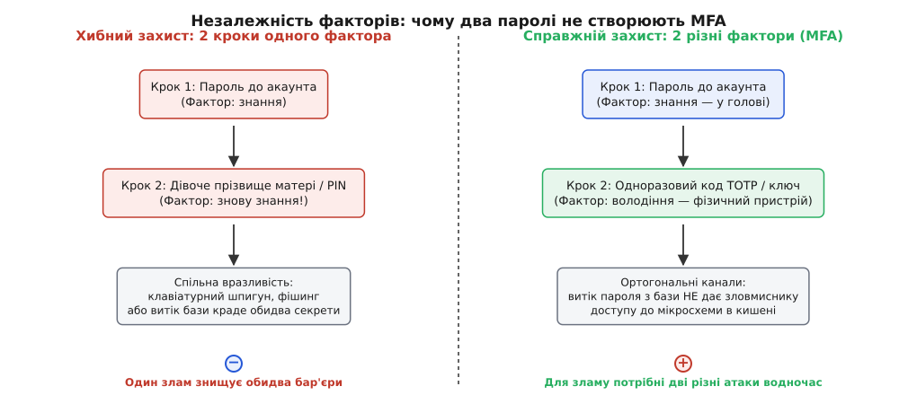
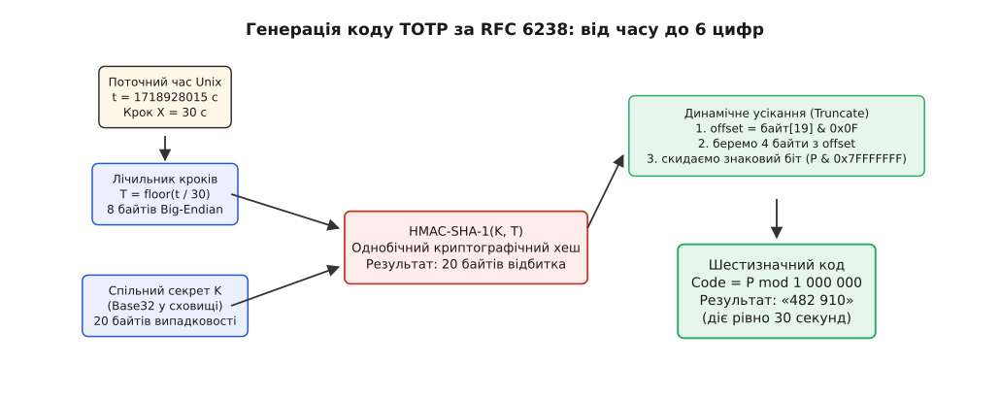
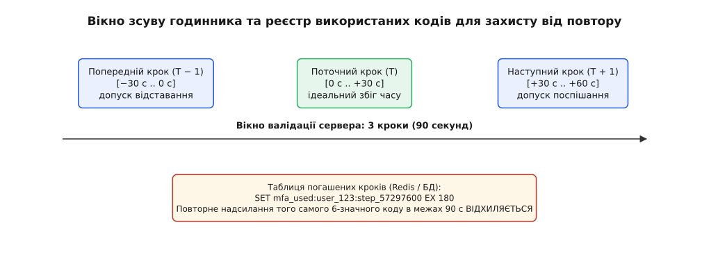
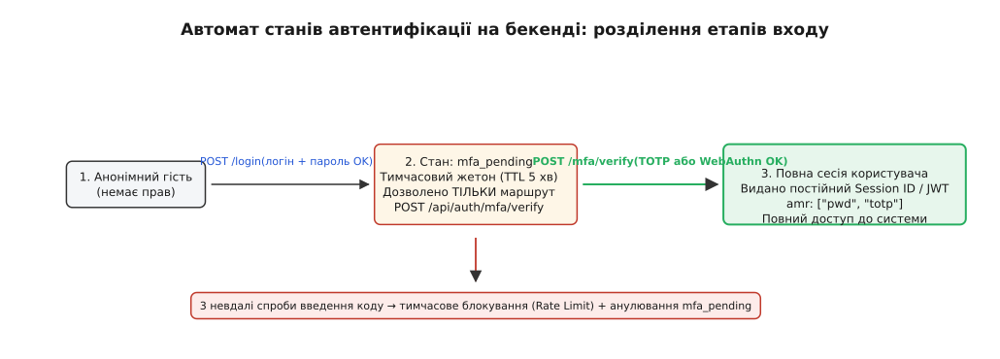

# Багатофакторна автентифікація (MFA)

<preknowlist>
- [Автентифікація](topic:programming/authentication) — встановлення особи («хто ти?») через доведення володіння секретом; три базові категорії факторів.
- [Зберігання паролів](topic:programming/password-hashing) — чому спільний секрет хешують однобічною функцією і чому людські паролі вразливі до витоків та перебору.
- [Управління сесіями](topic:programming/session-management) — як після перевірки облікових даних видається тимчасовий жетон сесії і як керувати його станами.
- [TLS](topic:communications/tls) — шифрування каналу передачі, без якого будь-які коди й жетони перехоплюються відкритим текстом у мережі.
</preknowlist>

О 03:14 ночі у вівторок автоматизований скрипт надіслав звичайний HTTP-запит до внутрішнього порталу компанії, вказавши логін та пароль провідного системного адміністратора. Пароль складався з 16 символів, містив великі літери, цифри та спецсимволи, а сервер чесно хешував його через argon2id з виділенням 64 мегабайтів пам'яті. Проте жодне з цих технічних досягнень не спрацювало: шість місяців тому співробітник використав той самий пароль на сторонньому технічному форумі, чию базу даних виклали у відкритий доступ. Скрипт просто підставив відому комбінацію, сервер підтвердив збіг хешу і видав сесійний жетон з правами суперкористувача.

Ця аварія сталася не через слабкість криптографії чи помилку в коді хешування. Вона сталася через фундаментальну ваду самої архітектури: **один фактор є єдиною точкою відмови**. Щойно єдиний секрет залишає голову власника — через фішинг, витік чужої бази, клавіатурного шпигуна чи підглядання через плече — система втрачає будь-яку здатність відрізнити справжнього користувача від зловмисника.

Багатофакторна автентифікація (MFA, англ. *Multi-Factor Authentication*) — це архітектурний підхід, який вимагає для підтвердження особи надати щонайменше два незалежні докази, що походять із принципово різних джерел. Автентифікація (гр. *authentikós* — справжній, достеменний) перестає спиратися на одне таємне слово і перетворюється на перевірку перетину кількох незалежних каналів.

## Аксіома незалежності: чому два паролі — це не два фактори

Найпоширеніша помилка в проєктуванні систем безпеки — плутати **багатокрокову перевірку** (англ. *Multi-Step Verification*) зі **справжньою багатофакторною автентифікацією**.

Усі способи доведення особи в комп'ютерних системах спираються на три класичні категорії факторів (лат. *factor* — той, що творить, чинить):
1. **Знання (Knowledge):** щось, що користувач знає (пароль, PIN-код, дівоче прізвище матері, графічний ключ пам'яті).
2. **Володіння (Possession):** щось, що користувач фізично має (апаратний криптографічний ключ, смартфон із генератором кодів, смарткарта, SIM-карта).
3. **Притаманність (Inherence):** щось, чим користувач біологічно є (відбиток пальця, геометрія обличчя, малюнок райдужної оболонки ока).

Якщо вебсервіс під час входу просить користувача ввести пароль від акаунта, а на наступному кроці запитує «PIN-код» або «відповідь на секретне питання», система виконала **два кроки одного й того самого фактора** — фактора знання.


*Два паролі мають спільну точку компрометації. Справжнє MFA вимагає доказів із фізично незалежних кошиків: компрометація одного фактора не дає зловмиснику контролю над іншим.*

Небезпека двох кроків однакового фактора полягає у **спільності векторів атаки**:
* Клавіатурний шпигун (Keylogger) на комп'ютері жертви перехопить і пароль, і відповідь на секретне питання однаково легко.
* Фішингова сторінка попросить користувача ввести обидва поля в одній формі.
* Злам бази даних сервісу видасть обидва секрети одночасно, якщо вони зберігалися на одному сервері.

Справжня сила MFA виникає лише тоді, коли фактори належать до **ортогональних категорій**. Якщо для входу потрібні пароль (знання) та апаратний токен (володіння), зловмиснику для успішного зламу недостатньо підслухати мережевий трафік чи знайти дамп бази. Йому необхідно фізично викрасти пристрій із кишені користувача або зламати мікроконтролер токена. Одночасне здійснення двох настільки різних за своєю природою атак на порядки дорожче й складніше.

## Спектр других факторів: від вразливих каналів до математики

За останні тридцять років індустрія випробувала безліч способів передачі другого фактора. Кожен із них намагався знайти баланс між зручністю для звичайної людини та надійністю криптографічного захисту.

### 1. Одноразові коди через SMS та Email: ілюзія безпеки

Найпростіший спосіб реалізації другого фактора для бізнесу — надіслати 6-значний код через SMS-повідомлення або електронну пошту. Користувачеві не потрібно встановлювати жодних додаткових програм: телефон є в кожного, а SMS працює навіть на найстаріших кнопкових апаратах.

Механіка роботи на бекенді виглядає оманливо просто:
```
1. Клієнт надсилає валідний пароль.
2. Сервер генерує випадкове число (наприклад, 839201).
3. Сервер зберігає його в Redis з TTL = 180 секунд.
4. Сервер викликає API SMS-шлюзу (Twilio, Vonage тощо).
5. Клієнт вводить отриманий з SMS код.
6. Сервер зіставляє рядок із Redis і відкриває сесію.
```

Проте з погляду безпеки SMS є найслабшим і найбільш скомпрометованим каналом передачі другого фактора. Національний інститут стандартів і технологій США (NIST) у спеціальній публікації SP 800-63B *«Digital Identity Guidelines»* офіційно надав SMS-автентифікації статус «обмеженої до використання» (restricted) через три критичні вразливості:

* **Перехоплення через протокол SS7 / Diameter:** Мобільний стільниковий зв'язок побудований на застарілих протоколах сигналізації, розроблених у 1970-х роках без урахування шифрування та взаємної автентифікації операторів. Зловмисник, що отримав доступ до вузла SS7 (через оренду шлюзу в країнах третього світу або підкуп персоналу), може перенаправити всі вхідні SMS жертви на свій телефон без відома абонента.
* **Атака заміною SIM-карти (SIM Swapping):** Зловмисник звертається до служби підтримки мобільного оператора від імені жертви (використовуючи підроблені документи або методи соціальної інженерії) і перевипускає SIM-карту на свій чип. Справжня SIM-карта користувача миттєво відключається, а всі одноразові коди починають надходити шахраю.
* **Шкідливе програмне забезпечення та перегляд на заблокованому екрані:** Мобільні трояни на базі Android перехоплюють системні сповіщення та читають SMS у фоновому режимі, відправляючи коди на командний сервер атакуючих.

Коди через електронну пошту страждають від аналогічної вади: якщо зловмисник зламав поштову скриньку жертви (або сесія пошти була вкрадена шкідливим ПЗ), він автоматично отримує доступ до всіх кодів підтвердження для решти сервісів.

### 2. HOTP (HMAC-based One-Time Password, RFC 4226): лічильник подій

Щоб позбутися залежності від операторів зв'язку та ненадійних мереж, консорціум OATH (Initiative for Open Authentication) у 2005 році стандартизував алгоритм **HOTP** ([RFC 4226](topic:programming/mfa/hist-mfa-evolution.md)).

В основі HOTP лежить відмова від передачі кодів через зовнішні канали. Натомість генератор (апаратний брелок із кнопкою) і сервер ділять між собою два значення:
1. **Спільний симетричний секрет `K`:** випадковий масив байтів, зашитий у брелок на заводі та збережений у базі даних сервера.
2. **Лічильник подій `C`:** 64-бітне ціле число, яке стартує з нуля і збільшується на одиницю при кожному натисканні кнопки на пристрої.

Коли користувач натискає кнопку на брелоку, пристрій обчислює криптографічний код:

```
OTP = Truncate( HMAC-SHA-1(K, C) ) mod 10⁶
```

Сервер робить точно таке саме обчислення над власним збереженим значенням `C`. Якщо коди збіглися, сервер пускає користувача і збільшує свій лічильник: `C = C + 1`.

#### Проблема розсинхронізації лічильників
Головний інженерний виклик HOTP — поведінка користувача. Якщо людина випадково натисне кнопку на брелоку 5 разів, перебуваючи в кишені (не здійснюючи входу), лічильник брелока стане `C + 5`, тоді як серверний лічильник залишиться `C`. Наступний згенерований код сервером буде відхилено.

Для вирішення цієї проблеми сервер реалізує **вікно випередження (Look-Ahead Window)** розміром `s` (зазвичай `s = 10..50`). При отриманні коду сервер не просто перевіряє поточне `C`, а прораховує кроки вперед:

```
C, C + 1, C + 2, ..., C + s
```

Якщо код збігся на кроці `C + k`, сервер не лише успішно автентифікує сесію, а й переставляє свій лічильник на нову позицію: `C_new = C + k + 1`. Якщо ж користувач натиснув кнопку більше ніж `s` разів поспіль, брелок остаточно розсинхронізується, і його повторна активація вимагатиме процедури скидання адміністратором.

### 3. TOTP (Time-based One-Time Password, RFC 6238): синхронізація за часом

Незручність із кнопками та розсинхронізацією лічильників усунув наступний стандарт — **TOTP** ([RFC 6238](topic:programming/mfa/hist-mfa-evolution.md)), розроблений у 2011 році.

TOTP замінив нестабільний лічильник фізичних натискань `C` на універсальну, доступну кожному комп'ютеру фізичну величину — **поточний світовий час**.

Лічильником `T` стає кількість цілих часових кроків тривалістю `X` секунд (за замовчуванням `X = 30` с), що минули від початку доби Unix Epoch (00:00:00 UTC 1 січня 1970 року):

```
T = ⌊ t / X ⌋
```

де `t` — поточний Unix timestamp у секундах.


*Кроки алгоритму TOTP: час перетворюється на 64-бітний лічильник T, підписується ключем K через HMAC, усікається за молодшим ніблом останнього байта і згортається за модулем мільйон.*

Математичний процес отримання 6 цифр із часу складається з чітких кроків:

1. **Формування лічильника:** Число `T` упаковується у фіксований 8-байтний масив у форматі **Big-Endian** (старші байти попереду).
2. **Обчислення HMAC:** Обчислюється криптографічний хеш `HS = HMAC-SHA-1(K, T_bytes)`. Довжина результату — 20 байтів: `HS[0 .. 19]`.
3. **Динамічне усікання (Dynamic Truncation):** Щоб не прив'язуватися до жорстко закодованих позицій у хеші, алгоритм бере останній байт відбитка `HS[19]` і витягує його молодші 4 біти за допомогою побітової маски:
```
offset = HS[19] & 0x0F
```
Це дає число `offset` від 0 до 15.
4. **Вилучення 4 байтів:** Починаючи з позиції `offset`, зчитуються 4 послідовні байти: `HS[offset .. offset+3]`.
5. **Очищення знакового біта:** Старший біт 32-бітного слова скидається в нуль (`P = Word & 0x7FFFFFFF`), усуваючи неоднозначність трактування знакових чисел на різних архітектурах процесорів.
6. **Редукція:** Отримане 31-бітне додатне ціле число ділиться за модулем `10⁶`:
```
OTP = P mod 1 000 000
```
Результат доповнюється провідними нулями до 6 знаків (наприклад, `049182`).

Повний робочий код двигунця TOTP з усіма математичними етапами, алгоритмом кодування Base32 та формуванням стандартизованого рядка `otpauth://totp/...` для QR-кодів мобільних сканерів реалізовано в [практичній вставці двигунця TOTP](topic:programming/mfa/proj-totp-engine.md).

Секретний ключ `K` кодують саме у форматі Base32 (алфавіт `A-Z` та `2-7`), щоб виключити неоднозначні символи `0/O` та `1/I`, коли користувач вводить секрет у мобільний додаток вручну без камери. Стандартний рядок експорту включає назву видавця (Issuer), обліковий запис користувача, алгоритм хешування, довжину коду (6 цифр) та крок часу (30 секунд).

## Інженерні пастки реалізації TOTP на бекенді

Незважаючи на простоту формули, реалізація перевірки TOTP у високонавантажених вебсистемах стикається з кількома підступними пастками, кожна з яких неодноразово призводила до вразливостей нульового дня.

### 1. Зсув годинника (Clock Skew) та вікно перевірки

Апаратні кварцові резонатори в смартфонах користувачів не є еталонами точності. Телефон, що тиждень провів у режимі польоту без зв'язку з базовими станціями, може поспішати чи відставати на 10–20 секунд. Крім того, кілька секунд витрачається на те, щоб людина прочитала цифри з екрана й натиснула кнопку «Увійти» у браузері.

Якщо сервер перевірятиме лише код поточного інтервалу `T`, значна частина користувачів стикатиметься з постійними помилками входу. Тому бекенд під час перевірки розраховує коди для **вікна зсуву** `window = 1`:

```
T - 1 (попередні 30 секунд),  T (поточний інтервал),  T + 1 (наступні 30 секунд)
```

Це забезпечує загальне вікно валідності у 90 секунд.


*Вікно розсинхронізації покриває 90 секунд. Щоб усунути загрозу Replay-атаки, використаний номер кроку негайно заноситься до реєстру погашених значень.*

### 2. Вразливість повторного використання (Replay Attack)

Вікно у 90 секунд породжує серйозну загрозу: якщо зловмисник підслухав трафік або підгледів 6-значний код жертви в перші секунди його появи, цей самий код залишається валідним ще протягом 30–80 секунд. Атакуючий може негайно надіслати його з паралельного пристрою й отримати доступ.

**Залізне правило безпеки TOTP:** Будь-який одноразовий пароль повинен бути використаний **рівно один раз**.

Для захисту від повторного входу бекенд зобов'язаний вести облік використаних часових кроків:
* **Водяний знак у базі даних (`last_verified_step`):** У профілі користувача зберігається ціле число — номер останнього успішно підтвердженого кроку `T`. Якщо вхідний запит містить код, що відповідає кроку `step <= last_verified_step`, сервер негайно відхиляє його, навіть якщо математично код правильний.
* **Кеш використаних кроків у Redis:** Після успішної перевірки сервер виконує атомарну команду:
```
SET mfa_used:user_42:step_57297600 "1" NX EX 180
```
Якщо ключ уже існує в Redis (команда повернула `nil`), запит відхиляється як спроба повторного входу.

### 3. Атаки за часом виконання (Timing Side-Channel Attacks)

Шестизначний код є рядком. Якщо перевіряти його за допомогою стандартного оператора порівняння мови програмування (`user_code === expected_code`), процесор почне звіряти байти зліва направо і перерве роботу на першому незбіглому символі.

Якщо перша цифра вгадана правильно, порівняння триває довше на частку мікросекунди. Зловмисник, надсилаючи тисячі запитів через локальну мережу й точно вимірюючи час повернення HTTP-відповіді, може визначити правильність кожної цифри послідовно:

```
Спроба «000000» → відмова за 12.1 мкс (перша цифра хибна)
Спроба «400000» → відмова за 14.8 мкс (перша цифра правильна!)
Спроба «410000» → відмова за 14.9 мкс...
```

Для повного викорінення цієї загрози порівняння кодів у пам'яті сервера повинно здійснюватися виключно функціями з **гарантованим сталим часом виконання** (`crypto.timingSafeEqual` у Node.js, `hmac.compare_digest` у Python, `subtle.ConstantTimeCompare` у Go).

## Push-сповіщення та криза «MFA Fatigue»

З появою мобільних застосунків банків та хмарних сервісів (Google Prompt, Apple 2FA, Microsoft Authenticator) набув популярності механізм **Push-підтверджень**. Замість того, щоб переписувати 6 цифр вручну, користувач отримує на телефон сповіщення «Ви намагаєтеся увійти?» з двома кнопками: «Так, це я» та «Ні».

Простота натискання однієї кнопки створила небезпечний психологічний вектор атаки — **MFA Fatigue** (бомбардування запитами / втома від сповіщень).

Сценарій атаки, який у вересні 2022 року призвів до гучного злому інфраструктури компанії Uber:
1. Зловмисник викрадає корпоративний логін та пароль співробітника.
2. О 2-й годині ночі автоматизований скрипт атакує форму входу і генерує Push-сповіщення на смартфон жертви кожні 30 секунд.
3. Телефон співробітника безперервно вібрує десятки разів поспіль.
4. Одночасно атакуючий пише жертві в корпоративний месенджер WhatsApp від імені служби підтримки: «Це системна перевірка, натисніть "Схвалити", щоб вимкнути сповіщення».
5. Сонний або роздратований користувач натискає кнопку «Так» просто для того, щоб телефон перестав вібрувати — і зловмисник отримує доступ до мережі компанії.

### Захист: зіставлення чисел (Number Matching)
Для боротьби з MFA Fatigue індустрія впровадила обов'язковий механізм **зіставлення чисел** (англ. *Number Matching*):
* Вебсервер під час входу виводить на екран комп'ютера випадкове двозначне число (наприклад, `42`).
* Мобільний додаток у Push-сповіщенні більше не має простої кнопки «Так». Натомість він пропонує користувачеві ввести те саме число, яке він бачить на екрані браузера, або обрати його з кількох запропонованих варіантів.
* Тепер зловмисник, що перебуває віддалено, не знає числа з екрана жертви, а випадкове натискання кнопки на телефоні стає неможливим.

## Межа надійності: стійкість до фішингу (FIDO2 та WebAuthn)

Незважаючи на всі вдосконалення, SMS, HOTP, TOTP та Push-сповіщення мають одну спільну фатальну слабкість: **вони вразливі до фішингових проксі-серверів посередника** (Adversary-in-the-Middle, AitM).

Інструменти на кшталт *Evilginx* або *Modlishka* працюють як прозорі зворотні проксі (Reverse Proxy). Зловмисник створює копію сайту банку на схожому домені (наприклад, `bank-secure-login.com` замість `bank.com`) і надсилає жертві посилання.

Процес зламу виглядає так:
1. Користувач заходить на фішинговий сайт і вводить логін та пароль.
2. Проксі-сервер хакера миттєво пересилає ці дані на справжній сайт `bank.com`.
3. Справжній сайт банку запитує другий фактор (код TOTP або SMS).
4. Фішинговий сайт транслює це поле жертві.
5. Жертва вводить правильний 6-значний код із телефона.
6. Фішинговий сервер негайно відправляє його справжньому банку.
7. Справжній банк перевіряє код, створює сесію і повертає **сесійний cookie (Set-Cookie)**.
8. Хакерський проксі перехоплює цей сесійний жетон, зберігає його в себе і пропускає жертву далі в кабінет.

Уся двофакторна перевірка TOTP була успішно пройдена, але сесія опинилася в руках хакера. Жодна складність коду й жодна швидкість його зміни не рятують від посередника, який копіює байти в реальному часі.


*TOTP ретранслюється фішинг-посередником без перешкод. FIDO2 / WebAuthn зупиняє атаку на апаратному рівні: браузер вшиває в підпис точний домен сайту, роблячи ретрансляцію підпису на інший домен математично неможливою.*

### Криптографічна відповідь: прив'язка до джерела (Origin Binding)

Єдиним класом захисту, повністю стійким до фішингу, є технології альянсу FIDO: **FIDO2, WebAuthn та [Passkeys](topic:programming/passkeys)**.

Їхній захист базується на трьох фундаментальних принципах:
1. **Асиметрична криптографія замість спільних секретів:** Апаратний ключ (YubiKey, мікросхема Apple Secure Enclave або чип TPM процесора) генерує пару ключів: відкритий ключ віддається серверу, а закритий **ніколи не залишає захищений чип**.
2. **Прив'язка до походження (Origin Binding):** Браузер самостійно визначає справжнє ім'я домену в адресному рядку (наприклад, `bank-secure-login.com`), обчислює його криптографічний хеш SHA-256 і передає апаратному ключу всередині структури `clientDataJSON`.
3. **Локальна верифікація користувача (User Verification):** Для розблокування закритого ключа всередині Secure Enclave пристрій вимагає локального біометричного жесту (Touch ID, Face ID, Windows Hello) або локального PIN-коду пристрою. Ця біометрія ніколи не передається мережею — вона залишається всередині чипа, забезпечуючи поєднання двох факторів (володіння мікросхемою + притаманність/знання) в один дотик.

Ключ підписує своїм закритим ключем випробування сервера разом із цим хешем домену. Коли зловмисник перехоплює цей підпис і відправляє його на справжній сервер `bank.com`, сервер порівнює ідентифікатор застосунку (Relying Party ID) у підписі з власним доменом:

```
RP ID у підписі: "bank-secure-login.com" ≠ "bank.com" → ВІДХИЛЕНО!
```

Справжній сервер миттєво відкидає підпис, оскільки він був згенерований для чужого домену. Перехоплені дані виявляються абсолютно марними.

## Автомат станів на бекенді: сесійний життєвий цикл MFA

Впровадження MFA кардинально змінює життєвий цикл сесії на бекенді. Найгрубіша архітектурна помилка — створити повну сесію користувача одразу після перевірки пароля, а потім «поставити прапорець у базі» і просто заблокувати інтерфейс на фронтенді. Якщо клієнт звернеться до REST API напряму повз фронтенд, він отримає повний доступ до даних без проходження другого фактора.

Правильна архітектура бекенду реалізує строгий **автомат станів** із розділенням сесійних рівнів:


*Жоден запит не має доступу до бізнес-логіки у стані mfa_pending. Повноправна сесія формується лише після успішної валідації другого фактора або резервного коду.*

### Етап 1. Перевірка первинних облікових даних (`POST /api/auth/login`)
Клієнт надсилає логін та пароль. Сервер перевіряє хеш пароля:
* Якщо 2FA вимкнено — видається стандартна повноправна сесія (Session Cookie або фінальний JWT).
* Якщо 2FA увімкнено — повна сесія **не створюється**. Натомість сервер випускає короткоживучий, криптографічно підписаний проміжний жетон `mfa_ticket` (наприклад, JWT з TTL = 300 секунд).

Цей проміжний жетон має суворо обмежену сферу дії:
```json
{
  "sub": "user_98124",
  "scope": "mfa_pending",
  "allowed_methods": ["totp", "webauthn", "backup_code"],
  "exp": 1718928315
}
```
Будь-який запит до захищених ресурсів API (`GET /api/user/profile`, `GET /api/orders`) із жетоном `mfa_pending` негайно повертає код помилки `401 Unauthorized` або `403 Forbidden`. Єдиний дозволений маршрут для цього жетона — ендпоінт підтвердження другого фактора.

### Етап 2. Валідація другого фактора (`POST /api/auth/mfa/verify`)
Клієнт надсилає `mfa_ticket` разом із введеним 6-значним кодом.
Сервер виконує такі операції:
1. Перевіряє підпис та термін дії `mfa_ticket`.
2. Перевіряє ліміт спроб для цієї сесії (Rate Limiting).
3. Звіряє код за алгоритмом TOTP із захистом від повтору (`last_verified_step`).
4. **Анулює використаний `mfa_ticket`**, щоб його не можна було надіслати вдруге.
5. Генерує постійну сесію користувача та додає до неї масив методів автентифікації за стандартом RFC 8176 (Authentication Method Reference):
```json
{
  "sub": "user_98124",
  "amr": ["pwd", "totp"],
  "auth_time": 1718928015
}
```

Стандартний реєстр RFC 8176 чітко визначає типи використаних методів: `pwd` (пароль), `otp` (одноразовий пароль TOTP/HOTP), `hwk` (апаратний ключ), `fido` (WebAuthn / Passkeys), `sms` (SMS-повідомлення).

### Ступінчаста автентифікація (Step-Up Authentication)
Наявність мітки `amr` дозволяє реалізувати **адаптивний ступінчастий захист (Step-Up Auth)**. Користувач може спокійно переглядати каталог товарів або читати статті в системі за звичайною сесією. Але якщо він намагається здійснити критичну дію:
* Змінити пароль акаунта;
* Додати новий номер банківської картки чи вивести кошти;
* Згенерувати новий API-ключ адміністратора;
* Підключити новий пристрій 2FA;

бекенд перевіряє не лише факт наявності сесії, а й параметри `amr` та `auth_time`. Наприклад, для перегляду балансу достатньо `amr: ["pwd"]`, але для виконання грошового переказу політика вимагає `amr: ["pwd", "totp"]` або `amr: ["pwd", "fido"]`. Якщо останній ввід 2FA відбувся більше ніж 10 хвилин тому, сервер вимагає повторного введення коду для виконання конкретної операції (re-authentication).

## Резервні коди відновлення (Emergency Backup Codes)

Невіддільною частиною будь-якої системи MFA є процедура дій у випадку, коли користувач втратив фізичний доступ до свого другого фактора (смартфон розбився, вкрадений або скинутий до заводських налаштувань).

Без надійного механізму порятунку користувач назавжди втрачає свій обліковий запис. Проте процедура відновлення не повинна створювати «чорний хід» для хакерів (якщо відновлення 2FA відбувається через звичайний лист на пошту, зловмисник, що зламав пошту, просто скине 2FA і знищить весь захист).

Стандартним вирішенням є **набір одноразових резервних кодів** (Backup / Recovery Codes):
* Під час первинного налаштування 2FA сервер генерує 8–10 криптографічно випадкових рядків (наприклад, `8f1a-c49b-7e02`).
* Користувачеві пропонується роздрукувати їх на папері або зберегти у захищеному сховищі паролів.
* **Сервер ніколи не зберігає відкриті резервні коди в базі даних!** Вони зберігаються у вигляді однобічних хешів (SHA-256 або bcrypt).
* Кожен код є суворо одноразовим. Його перевірка та списання в базі повинні виконуватися в одній атомарній транзакції, щоб уникнути стану перегонів (Race Condition) при одночасному надсиланні запитів.

> 🔧 **Навіщо це.** Впровадження 2FA без надійних резервних кодів неминуче призводить до перевантаження служби підтримки та блокування легітимних клієнтів. З іншого боку, зберігання резервних кодів відкритим текстом у базі нівелює захист другого фактора: перший же витік бази даних віддасть хакерам готові ключі для обходу 2FA. Хешування резервних кодів та їхнє атомарне списання — обов'язковий стандарт безпеки.

## Сухий залишок

Пароль — це статичний секрет із низькою ентропією, вразливий до витоків, перебору та фішингу. Спроба додати другий крок із того самого кошика (секретне питання або PIN) не створює нового захисту, оскільки обидва секрети мають спільні вектори компрометації.

Справжня багатофакторна автентифікація поєднує незалежні фізичні категорії:
* **Знання:** пароль у голові людини;
* **Володіння:** генератор TOTP або апаратний токен у кишені;
* **Притаманність:** біометричний сенсор на пристрої.

Протокол TOTP (RFC 6238) перетворив світовий час на спільний лічильник, дозволивши смартфонам генерувати узгоджені одноразові коди без підключення до мережі. Безпека його реалізації на бекенді тримається на трьох опорах: дотриманні вікна зсуву часу, обов'язковій фіксації використаних кроків для захисту від Replay-атак та константному за часом порівнянні рядків.

Найвищим ступенем еволюції MFA залишаються стандарти FIDO2 та WebAuthn: завдяки асиметричній криптографії та прив'язці відкритого ключа до доменного імені браузера (Origin Binding) вони роблять фішинг та перехоплення сесій математично неможливими.
