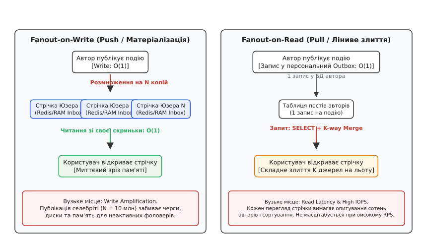
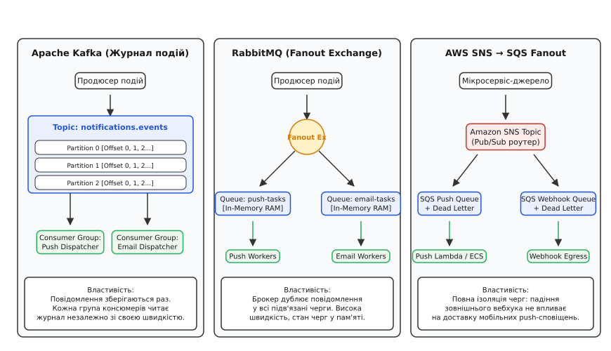
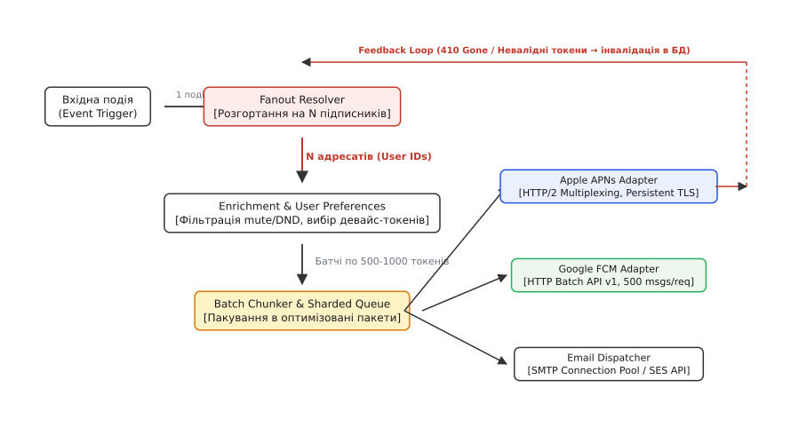
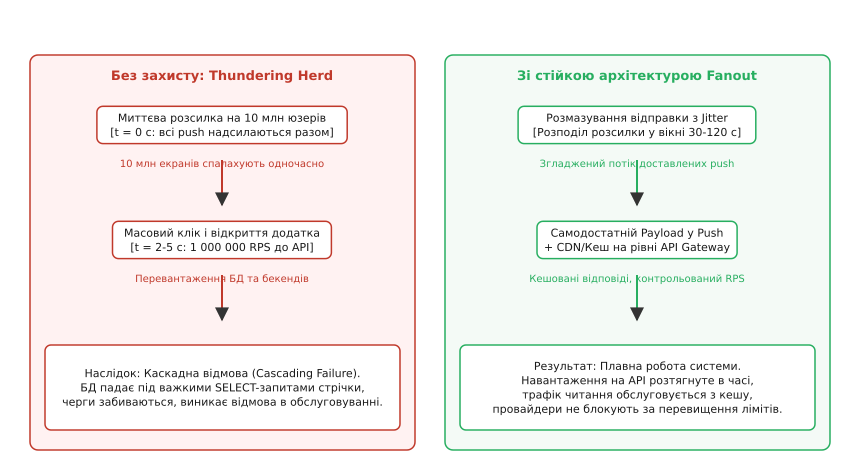

# Архітектура Fanout для розсилки повідомлень: pub/sub, черги та батчинг

<preknowlist>
- [Черга задач](topic:programming/background-jobs) — асинхронне фонове виконання важких операцій поза HTTP-циклом.
- [Pub/sub (тема)](topic:programming/publish-subscribe) — розсилка повідомлень багатьом підписникам без прямого зв'язку між компонентами.
- [Черга повідомлень (point-to-point)](topic:programming/message-queue) — буферизація завдань і конкурентна обробка між воркерами.
- [Шардинг](topic:programming/partitioning-sharding) — горизонтальне розділення даних та навантаження за ключем партиціонування.
- [Ідемпотентність](topic:programming/idempotency) — гарантія безпечного повторного виконання операцій без дублювання ефекту.
- [HTTP](topic:programming/http) — протокол передачі даних, заголовки, статус-коди та з'єднання.
</preknowlist>

Коли новинне агентство публікує термінове повідомлення про надзвичайну подію або популярний автор із 10 мільйонами підписників викладає новий допис, сервери платформи отримують одиничний вхідний HTTP-запит розміром менше одного кілобайта. Проте за наступні кілька секунд розподілена система зобов'язана згенерувати та доставити 10 мільйонів мобільних push-повідомлень через Apple APNs та Google FCM, оновити персональні матеріалізовані стрічки мільйонів активних користувачів, розіслати тисячі транзакційних листів і надіслати вебхуки партнерським сервісам. Якщо спробувати виконати цю роботу в синхронному потоці веб-сервера, пул з'єднань вичерпається за лічені мілісекунди, база даних зазнає блокування сотнями тисяч транзакцій, а клієнт отримає помилку 504 Gateway Timeout.

Для вирішення цього завдання застосовується архітектурний патерн **Fanout** (англ. *fan-out* — розгортання віялом, термін запозичено з мікроелектроніки, де він позначає навантажувальну здатність виходу одного логічного елемента керувати входами кількох інших). У розподілених високонавантажених системах Fanout позначає трансформацію одного вхідного бізнес-сигналу у множину паралельних завдань доставки, фільтрації, збагачення та оновлення стану для `N` незалежних отримувачів.


*Порівняння матеріалізованого запису (Push) та лінивого злиття під час читання (Pull).*

## 1. Протистояння моделей: Fanout-on-Write проти Fanout-on-Read

Будь-яка система розсилки сповіщень чи формування персоналізованих стрічок стикається з фундаментальною дилемою: коли саме виконувати обчислювальну роботу — у момент публікації події автором чи в момент відкриття додатку читачем.

### Модель Fanout-on-Write (Eager Push / Завчасна матеріалізація)

У моделі Fanout-on-Write (від латинського *materia* — речовина, тобто матеріалізація віртуального стану у фізичні записи) система створює персональну поштову скриньку (Inbox або Timeline) для кожного зареєстрованого користувача.

Коли автор публікує повідомлення, фоновий конвеєр виконує послідовність дій:
1. Зчитує з графа зв'язків повний список ідентифікаторів підписників автора (`user_id_1, user_id_2, ..., user_id_N`).
2. Для кожного підписника записує копію ідентифікатора повідомлення або повного об'єкта події у його персональний список у розподіленій пам'яті (наприклад, виконує команду `LPUSH timeline:user_id message_id` або `ZADD` у Redis чи RocksDB).
3. Обрізає хвіст списку до фіксованого ліміту (наприклад, `LTRIM timeline:user_id 0 799`), щоб обмежити споживання оперативної пам'яті 800 останніми записами на активного користувача.

```
[Автор публікує подію] 
        │
        ▼
[Fanout Workers] ── розгортання ──► [Inbox Користувача 1] -> O(1) читання
                                  ► [Inbox Користувача 2] -> O(1) читання
                                  ► [Inbox Користувача N] -> O(1) читання
```

**Переваги:** Читання стрічки стає надзвичайно швидкою та дешевою операцією складності `O(1)`. Серверу запитів достатньо зробити один зріз по масиву в пам'яті (`LRANGE timeline:user_id 0 20`), що займає менше 1 мілісекунди навіть при мільйонних навантаженнях. Реляційна або дискова база даних взагалі не бере участі в обслуговуванні запитів на читання.

**Недоліки:** Величезний коефіцієнт посилення запису (Write Amplification). Якщо у автора 5 мільйонів підписників, один клік створює 5 мільйонів мережевих операцій запису. Якщо 95% цих підписників є неактивними і не відкриють додаток цього тижня, процесорний час, мережевий трафік та пам'ять витрачаються марно на генерацію стрічок, які ніхто не побачить.

### Модель Fanout-on-Read (Lazy Pull / Ліниве злиття)

У моделі Fanout-on-Read робота з розмноження не виконується під час запису. Нове повідомлення зберігається лише один раз у персональній хроніці автора (Outbox).

Коли читач відкриває додаток:
1. Сервер визначає список авторів, за якими стежить цей читач (наприклад, 300 підписок).
2. Робить запит до сховища для вибірки останніх повідомлень кожного з цих 300 авторів (`SELECT message_id FROM posts WHERE author_id IN (...) ORDER BY created_at DESC LIMIT 20`).
3. Зливає ці списки в один хронологічний потік за алгоритмом k-way merge (сортування злиттям) у пам'яті за допомогою пріоритетної черги (Min-Heap).
4. Повертає 20 найсвіжіших записів клієнту.

```
[Автор публікує подію] ──► [1 запис у Outbox автора]
                                     ▲
[Читач відкриває стрічку] ───────────┴── Запит: SELECT + k-way merge 300 джерел
```

**Переваги:** Запис коштує `O(1)` і завершується миттєво. Нульові витрати ресурсів на неактивних користувачів: якщо підписник не заходить у систему, для нього не виконується жодної фонової операції.

**Недоліки:** Читання стає важким та обчислювально дорогим. Виконання запитів до сотень партицій із подальшим сортуванням створює гігантське навантаження на дискову підсистему та центральний процесор. При високому показнику Read RPS сервери баз даних зазнають деградації через вичерпання пулу з'єднань та черг введення-виведення.

> 🔧 **Навіщо це.**
> Прямий вибір між чистим Push та чистим Pull завжди є помилкою на масштабі: Push ламається на акаунтах із мільйонами підписників через перевантаження черг запису, а Pull руйнує базу даних при частих зверненнях користувачів до стрічки.

Детальний аналіз історичної боротьби з цією проблемою в інфраструктурі раннього Twitter викладено у вставці [Історичний огляд еволюції стрічок новин](topic:programming/notification-fanout/hist-fanout-evolution.md).

## 2. Внутрішні структури даних для матеріалізованих стрічок

Вибір структури даних в оперативній пам'яті безпосередньо визначає швидкість виконання операцій та обсяг споживаних ресурсів на один активний профіль.

### Зв'язні списки (Linked Lists) проти впорядкованих множин (Sorted Sets)

У сховищах типу Redis для матеріалізації стрічок розглядають дві структури:
1. **Списки (Lists / Quicklist):** спираються на двобічно зв'язаний список блоків пам'яті (ziplists). Додавання на початок списку (`LPUSH`) та видалення з кінця (`RPOP`) виконуються за час `O(1)`. Зріз діапазону (`LRANGE 0 19`) є швидким, оскільки елементи вже відсортовані за часом додавання. Проте видалення конкретного повідомлення (наприклад, якщо автор видалив твіт або коментар) вимагає повного лінійного сканування списку `O(N)`.
2. **Впорядковані множини (Sorted Sets / ZSet):** поєднують хеш-таблицю (Hash Table) та стрибаючий список (Skip List). Кожен елемент має числовий бал (Score), у ролі якого використовується мітка часу (Unix Epoch Timestamp) або 64-бітний унікальний ідентифікатор Snowflake ID, де час закодовано у старших бітах.
   - Вставка нового елемента: `ZADD timeline:user_id <timestamp> <post_id>` — складність `O(log N)`.
   - Вибірка свіжих повідомлень: `ZREVRANGEBYSCORE timeline:user_id +inf -inf LIMIT 0 20` — складність `O(log N + M)`.
   - Видалення конкретного повідомлення за ідентифікатором: `ZREM timeline:user_id <post_id>` — швидкість `O(1)` завдяки хеш-таблиці.
   - Обрізання хвостових записів: `ZREMRANGEBYRANK timeline:user_id 0 -801` — видалення найстаріших елементів за `O(log N + M)`.

### Проблема фрагментації пам'яті

При виконанні сотень мільйонів дрібних операцій вставки та видалення у Redis виникає висока фрагментація пам'яті на рівні алокатора (Jemalloc). Для оптимізації застосовують компактні бінарні структури на базі RocksDB з рушієм пам'яті MemTable та подальшим скиданням на SSD у вигляді SSTables, або пакування кількох ідентифікаторів у фіксовані 64-байтні кеш-рядки (Cache Lines).

## 3. Гібридний компроміс: селективний Fanout та межа селебріті

Розподіл кількості підписників у будь-якому соціальному чи новинному графі є важкохвостим (heavy-tailed) і підпорядковується закону Парето або Ципфа: 99% користувачів мають менше 500 підписників, тоді як 0.1% знаменитостей та новинних агенцій концентрують мільйони зв'язків.

У високонавантажених платформах застосовується **гібридна модель селективного розгортання** (Hybrid Selective Fanout).

```
Вхідний пост автора
         │
         ▼
Кількість підписників K?
   ├── K < k* (Звичайний юзер) ──► Fanout-on-Write (Push у Redis Inbox підписників)
   └── K ≥ k* (Селебріті)     ──► Outbox Only (Підмішування під час читання)
```

Система встановлює динамічний поріг кількості підписників `k*` (зазвичай від 5 000 до 25 000):
- **Для звичайних користувачів (`K < k*`):** застосовується класичний Fanout-on-Write. Повідомлення миттєво копіюється у скриньки підписників у пам'яті. Оскільки кількість отримувачів мала, операція завершується за лічені мілісекунди і не перевантажує черги.
- **Для авторів-суперзірок (`K ≥ k*`):** Fanout-on-Write повністю вимикається. Пост записується лише один раз у персональну таблицю автора (Outbox).
- **Під час формування стрічки читача:** сервіс Timeline Aggregator витягує вже матеріалізовану стрічку з Redis (де лежать пости його звичайних друзів), окремо опитує кеші тих кількох селебріті, на яких підписаний цей користувач, і зливає ці масиви в оперативній пам'яті за 0.5–1 мілісекунду.

Математичне виведення точки оптимального порогу `k*` на основі балансу вартості операцій читання і запису наведено у вставці [Математичний аналіз навантаження та закону Ципфа](topic:programming/notification-fanout/math-fanout-cost.md).


*Архітектурні патерни Pub/Sub: лог Apache Kafka, Fanout Exchange RabbitMQ та хмарний міст SNS-SQS.*

## 4. Інфраструктурний шар Pub/Sub: порівняння брокерів

Для передачі завдань розгортання від джерел подій до воркерів розсилки необхідний асинхронний брокер повідомлень. Вибір брокера визначає пропускну здатність, надійність зберігання та поведінку системи під час сплесків трафіку.

### 1. Apache Kafka / Redpanda (Log-centric, Pull-based)

Apache Kafka організована як шардований незмінний журнал подій на диску (Append-only Commit Log).
- **Механізм Fanout:** одне повідомлення публікується в топік (наприклад, `notifications.events`). Кожен сервіс-споживач (сервіс мобільних Push, сервіс Email-розсилок, сервіс оновлення стрічок у пам'яті) реєструється як окрема група споживачів (Consumer Group).
- **Зберігання стану:** брокер не видаляє повідомлення після вичитування і не веде облік отримання окремими воркерами в пам'яті. Кожен споживач самостійно зберігає свій числовий зсув (Offset).
- **Масштабування:** партиціонування за ключем (Partition Key, наприклад `hash(user_id) % num_partitions`) гарантує строгий порядок обробки подій одного користувача та дозволяє паралельно нарощувати кількість воркерів до кількості партицій.
- **Сфера застосування:** магістральні канали розсилки з навантаженням у сотні тисяч або мільйони подій на секунду, де потрібне довгострокове збереження повідомлень та повторне відтворення історії (Replay).

### 2. RabbitMQ (Broker-centric, Push-based, AMQP 0-9-1)

RabbitMQ реалізує парадигму розумного брокера та простих споживачів.
- **Механізм Fanout:** використання спеціалізованого типу обмінника — **Fanout Exchange**. Коли продюсер надсилає повідомлення у Fanout Exchange, брокер апаратно копіює його в усі прив'язані черги (`Queues`), ігноруючи ключі маршрутизації (Routing Keys).
- **Зберігання стану:** брокер відстежує підтвердження доставки (ACK/NACK) для кожного повідомлення в пам'яті. Після успішного підтвердження повідомлення видаляється.
- **Сфера застосування:** локальні конвеєри завдань із низькою затримкою (мікросекунди), складною динамічною маршрутизацією та потребою у миттєвій передачі завдань на вільні воркери (Competing Consumers).

### 3. Хмарні бекенд-топології (AWS SNS → SQS, GCP Pub/Sub)

У безсерверних та хмарних інфраструктурах стандартом є зв'язка теми публікації та множини черг доставки.
- **Механізм Fanout:** Amazon SNS (Simple Notification Service) виступає в ролі Pub/Sub роутера. До однієї SNS-теми підключаються кілька незалежних черг Amazon SQS (SQS for Push Workers, SQS for Email Workers, SQS for Webhook Dispatcher).
- **Ізоляція відмов (Fault Isolation):** якщо зовнішній SMTP-сервер уповільнює роботу, черга `SQS-Email` накопичує повідомлення, але це жодним чином не впливає на пропускну здатність та швидкість черги `SQS-Push`.
- **Фільтрація на рівні підписки (Subscription Filter Policies):** SNS дозволяє маршрутизувати в чергу лише ті події, які відповідають JSON-атрибутам (наприклад, тільки події з пріоритетом `HIGH`).

| Критерій | Apache Kafka | RabbitMQ (Fanout Ex) | AWS SNS → SQS |
| :--- | :--- | :--- | :--- |
| **Модель доставки** | Pull (Консюмер вичитує лог) | Push (Брокер виштовхує в сокет) | Pull (Опитування SQS воркерами) |
| **Пропускна здатність** | Мільйони подій/с (Zero-copy disk) | 50 000 – 100 000 подій/с | Практично необмежена (Auto-scale) |
| **Повторне читання** | Так (зміна Offset у минуле) | Ні (повідомлення видаляється після ACK) | Ні (переміщення в DLQ після помилок) |
| **Ізоляція підписників** | Повна (через окремі Consumer Groups) | Повна (через окремі черги) | Повна (через окремі черги SQS) |
| **Ціна обслуговування** | Потребує кластера та моніторингу | Потребує кластера Erlang | Повністю керована хмарна служба |

### Гарантії доставки та Transactional Outbox Pattern

У розподілених системах існує небезпека розсинхронізації між базою даних додатку та брокером повідомлень. Якщо бізнес-транзакція (наприклад, створення замовлення) успішно зафіксована в базі даних, але відправка події в Kafka впала через мережевий збій, сповіщення буде назавжди втрачено. Якщо ж спочатку відправити повідомлення в Kafka, а транзакція в базі даних відкотиться, користувачі отримають фантомне сповіщення про неіснуюче замовлення.

Для гарантії надійної генерації подій застосовується патерн **Transactional Outbox**:
1. У тій самій транзакції реляційної бази даних, де створюється бізнес-сутність, додається запис у спеціальну таблицю `outbox_events`:
   ```sql
   INSERT INTO orders (id, user_id, amount) VALUES (101, 42, 500.00);
   INSERT INTO outbox_events (id, aggregate_type, payload) 
   VALUES ('uuid', 'Order', '{"order_id": 101, "user_id": 42}');
   ```
2. Окремий фоновий процес (Debezium через Change Data Capture або періодичний опитувач) вичитує журнал транзакцій бази даних (WAL / binlog) і гарантовано публікує події в Kafka.
3. Лише після отримання підтвердження від Kafka запис позначається як відправлений.

Це гарантує доставку рівня **At-Least-Once** (щонайменше один раз) без ризику втрати бізнес-подій.


*Конвеєр від отримання події через резолвер і батчинг до адаптерів провайдерів та зворотного зв'язку.*

## 5. Конвеєр збагачення, фільтрації та батчингу

Шлях від генерації бізнес-події до відправлення байтів у мережевий сокет складається з кількох ізольованих фаз, об'єднаних у конвеєр (Pipeline).

### Фаза 1. Резолвінг підписників (Recipient Resolution)

Отримавши подію `{event_type: "new_post", author_id: 1042}`, диспетчер визначає кінцевих адресатів.
- При розсилці підписникам: запит до графової бази даних або шардованого кешу зв'язків для вивантаження масиву `user_id`.
- При розсилці на сегмент (наприклад, «усі користувачі з міста Києва»): виконання запиту до аналітичного сховища чи пошукового індексу.
- Для великих списків (понад 100 000 адресатів) резолвер не вивантажує всіх користувачів в один масив пам'яті, а генерує потік пакетів (пагінація за курсором або потокові генератори).

### Фаза 2. Збагачення та фільтрація (Enrichment & User Preferences)

Не кожен підписник повинен отримати повідомлення. На цьому етапі воркери паралельно перевіряють предикати:
1. **Налаштування сповіщень:** чи не вимкнув користувач цей тип сповіщень у профілі.
2. **Режим «Не турбувати» (Do Not Disturb, DND):** перевірка локального часу користувача за його часовим поясом (наприклад, заборона надсилання маркетингових push-повідомлень між 22:00 та 08:00).
3. **Обмеження частоти (Frequency Capping / Digest):** якщо користувач уже отримав 5 сповіщень за останню годину, нові повідомлення агрегуються в один підсумковий дайджест.
4. **Вибір токенів пристроїв:** витягування зі сховища сесій актуальних токенів зареєстрованих пристроїв користувача (iOS токени для APNs, Android токени для FCM, веб-підписки Web Push).

Для мінімізації навантаження на базу даних профілів усі перевірки налаштувань та вибірка токенів виконуються пакетними операціями (Batch Lookups через `MGET` у Redis або `IN (...)` запити в репліках бази даних).

### Фаза 3. Батчинг та розбиття на чанки (Chunking)

Отриманий плоский список токенів пристроїв групується за типами провайдерів і розбивається на пакети оптимального розміру:
- Для Google FCM: пакети по 500 токенів (максимальний розмір батча у FCM v1 API).
- Для Apple APNs: порції по 1000–2000 повідомлень, адаптовані під пропускну здатність одного пулу HTTP/2 з'єднань.
- Для Email: пакети одержувачів для передачі в SMTP-релеї або через REST API (Amazon SES, SendGrid, Postmark).

Практичну реалізацію такого конвеєра на мовах C++ та TypeScript представлено у вставці [Інженерна реалізація диспетчера розсилки](topic:programming/notification-fanout/proj-notification-dispatcher.md).

## 6. Шардування воркерів та керування протитиском (Backpressure)

Коли вхідний потік повідомлень перевищує пропускну здатність зовнішніх шлюзів, система повинна регулювати швидкість споживання завдань за допомогою механізму **протитиску** (Backpressure).

### Шардування за ключем та консистентне хешування

Щоб уникнути взаємних блокувань між воркерами, пул завдань шардується:
- Ідентифікатор користувача або пристрою хешується за допомогою алгоритму MurmurHash3 або xxHash: `shard_id = hash(device_token) % num_workers`.
- Кожен воркер обробляє лише свій виділений шард токенів, що усуває потребу в глобальних міжпроцесних м'ютексах та мінімізує перемикання контексту ядра ОС.
- Для динамічного масштабування кількості воркерів застосовується кільце консистентного хешування (Consistent Hash Ring) з віртуальними вузлами (Virtual Nodes), що гарантує перерозподіл лише мінімальної частки `1 / M` ключів при додаванні або падінні воркера.

### Керування потоком та запобігання переповненню черг

Якщо зовнішній провайдер (наприклад, FCM) починає повертати затримки або коди `429 Too Many Requests`, воркер не повинен накопичувати батчі в локальній пам'яті:
- Воркер тимчасово призупиняє вичитування нових повідомлень з Kafka (виклик `consumer.pause(partitions)`).
- Брокер Kafka утримує повідомлення на диску без ризику падіння воркера через брак оперативної пам'яті (OOM).
- Після розвантаження черги відправки та відновлення лімітів воркер поновлює читання (`consumer.resume(partitions)`).

## 7. Транспортний шар доставки: APNs, FCM та SMTP

Взаємодія із зовнішніми шлюзами доставки вимагає суворого дотримання їхніх мережевих протоколів та вимог до управління ресурсами.

```
[Диспетчер розсилки]
       │
       ├─── HTTP/2 (Persistent TLS, Streams) ──► Apple APNs
       ├─── HTTP/1.1 (JSON Batch Multipart)   ──► Google FCM
       └─── SMTP (Connection Pool, Pipelining) ──► Email Relays (SES / Postfix)
```

### Apple Push Notification service (APNs) поверх HTTP/2

Apple APNs використовує двійковий протокол HTTP/2 поверх TLS 1.3:
- **Мультиплексування:** замість відкриття окремого TCP-з'єднання на кожне сповіщення, клієнт встановлює одне стійке з'єднання і передає сотні запитів одночасно у незалежних потоках (HTTP/2 Streams).
- **Стиснення заголовків (HPACK):** таблиця HPACK кешує статичні заголовки (наприклад, `:method: POST`, `apns-topic`, `authorization`), скорочуючи розмір кожного заголовка з 500 байтів до кількох байтів.
- **Керування вікнами потоку (Flow Control Window):** протокол HTTP/2 підтримує фрейми `WINDOW_UPDATE` на рівні окремих стрімів та з'єднання в цілому. Якщо сервер Apple тимчасово зменшує розмір вікна прийому, диспетчер зобов'язаний пригальмувати відправку фреймів `DATA`, щоб уникнути розриву з'єднання фреймом `GOAWAY`.
- **Автентифікація через JWT:** використання токенів JSON Web Token, підписаних приватним ключем провайдера (алгоритм ES256). Один JWT валідний протягом однієї години і передається в заголовку `authorization: bearer <token>`, усуваючи необхідність частої повторної авторизації.
- **Заголовки керування:**
  - `apns-topic`: Bundle ID додатку.
  - `apns-priority`: пріоритет доставки (`10` — негайна доставка, пробудження пристрою; `5` — фонова доставка з урахуванням заряду акумулятора).
  - `apns-expiration`: мітка часу UNIX, після якої повідомлення видаляється, якщо пристрій був офлайн.
  - `apns-collapse-id`: ідентифікатор згортання — замінює попереднє непрочитане сповіщення новим (наприклад, рахунок у футбольному матчі).

### Google Firebase Cloud Messaging (FCM HTTP v1)

Google FCM надає REST API з можливістю пакетного відправлення:
- **Multipart Batch:** передача складеного HTTP-запиту, що містить до 500 окремих JSON-документів у форматі multipart/mixed.
- **Обробка часткових збоїв:** кожен елемент у відповіді має власний індекс та статус. Якщо окремий токен недійсний, статус усього HTTP-запиту залишається `200 OK`, що вимагає індивідуального аналізу кожного запису в тілі відповіді.
- **FCM Topics:** для публічних розсилок (наприклад, трансляція новин усім підписникам каналу) замість індивідуального Fanout на мільйони токенів доцільно відправити один запит у топік FCM (`/topics/breaking_news`), делегуючи фізичне розмноження інфраструктурі Google.

### Транзакційний Email (SMTP та API шлюзи)

Електронна пошта є найповільнішим каналом доставки через обмеження поштових серверів та спам-фільтрів:
- **Пайплайнінг ESMTP (Command Pipelining):** надсилання команд `MAIL FROM`, `RCPT TO`, `DATA` єдиним пакетом без очікування відповіді на кожну окрему команду.
- **Пул підігрітих з'єднань:** повторне використання відкритих TLS-сесій до поштових релеїв (Postfix, Amazon SES, SendGrid), що економить до 150 мс на кожному листі.
- **Підігрів IP-адрес (IP Warm-up):** поступове нарощування обсягів відправки з нових серверів для формування позитивної репутації у провайдерів (Gmail, Outlook).
- **DNS-верифікація:** обов'язкове налаштування записів SPF (Sender Policy Framework), DKIM (DomainKeys Identified Mail) та DMARC, без яких масова розсилка миттєво блокується поштовими фільтрами.


*Згладжування пікового навантаження за допомогою часового джиттеру, кешування та Feedback-інвалідації.*

## 8. Захист від перевантажень: Rate Limiting, Feedback Loop та Thundering Herd

Розсилка повідомлень на мільйони пристроїв несе в собі небезпеку зворотного удару по власній інфраструктурі.

### 1. Зворотний зв'язок та очищення невалідних токенів пристроїв (Feedback Loop)

Коли користувач видаляє мобільний додаток або змінює пристрій, його push-токен стає недійсним.
- При спробі відправки APNs повертає статус `410 Gone` або `400 BadDeviceToken`, а FCM повертає помилку `UNREGISTERED` або `INVALID_ARGUMENT`.
- Якщо ігнорувати ці помилки, з кожною наступною розсилкою частка «мертвих» токенів зростатиме, марнуючи до 30–50% мережевого трафіку та процесорного часу.
- **Feedback Service:** архітектурний компонент, який асинхронно вичитує помилки доставки з черги відповідей диспетчера і виконує пакетну деактивацію застарілих токенів у базі даних (`UPDATE device_tokens SET is_active = false WHERE token IN (...)`).

### 2. Матриця помилок та стратегія повторів (Retry Policy)

Помилки зовнішніх провайдерів поділяються на дві категорії:
1. **Фатальні помилки (Non-retryable):** невалідний формат токена (`400 BadDeviceToken`), відсутність реєстрації (`410 Gone`), некоректна тема (`400 BadTopic`). Такі повідомлення негайно передаються у Feedback Service для видалення токена або у Dead Letter Queue (DLQ) для аудиту розробниками. Повторні спроби суворо заборонені.
2. **Транзитні помилки (Retryable):** тимчасова перевантаженість шлюзу (`429 Too Many Requests`), внутрішні збої провайдера (`500 InternalServerError`, `503 ServiceUnavailable`), таймаути мережевого з'єднання.

Для транзитних помилок застосовується алгоритм експоненційного відступу з дескорельованим джиттером (Full Jitter Exponential Backoff):

```
sleep_time = random(0, min(max_backoff, base_backoff · 2^(attempt)))
```

Джиттер гарантує, що тисячі воркерів, які отримали помилку 429 одночасно, не виконають повторний запит в один і той самий мілісекундний інтервал, створюючи вторинну хвилю перевантаження.

### 3. Адаптивне керування конкурентністю (Adaptive Concurrency Limits)

Жорстко закодовані статичні ліміти (наприклад, константа 500 паралельних запитів) є вразливими: під час нічного затишшя вони недовантажують канал, а під час денних піків латентності спричиняють лавину таймаутів.

Сучасні диспетчери застосовують динамічні алгоритми адаптивного лімітування конкурентності на основі вимірювання кругової затримки (Round-Trip Time, RTT), такі як алгоритм Vegas або Gradient Limit:

```
new_limit = current_limit + alpha   [якщо поточний RTT близький до мінімального RTT_min]
new_limit = current_limit · beta    [якщо поточний RTT зростає внаслідок черги у шлюзі]
```

Це дозволяє диспетчеру автоматично підлаштовувати швидкість відправки під реальний стан мережевих каналів Apple та Google без втручання інженерів.

### 4. Запобігання ефекту Thundering Herd (Гримучої отари)

Коли система розсилає сповіщення про сенсаційну новину на 10 мільйонів користувачів, виникає небезпечний побічний ефект:
1. О 12:00:00 пуші одночасно надходять на 10 мільйонів смартфонів.
2. Протягом наступних 2–5 секунд сотні тисяч користувачів одночасно натискають на сповіщення і відкривають додаток.
3. Мільйони клієнтів одночасно виконують важкі HTTP-запити до API для завантаження повної статті або оновлення домашньої сторінки.
4. Бекенд зазнає нищівного пікового навантаження (Thundering Herd / Cache Stampede), що спричиняє падіння баз даних та відмову в обслуговуванні.

Для запобігання цьому ефекту застосовують комплекс інженерних заходів:
- **Часовий джиттер відправки (Dispatch Jitter):** штучне розмазування розсилки у часовому вікні (наприклад, рівномірний розподіл відправки 10 мільйонів пушів протягом 60–120 секунд за допомогою формули `delay = random(0, T_window)`). Це перетворює прямокутний пік трафіку на пласку пологу криву.
- **Самодостатній Payload (Self-contained Push):** включення короткого тексту та ключових даних безпосередньо в тіло push-повідомлення, щоб додатку не потрібно було робити терміновий API-запит при відкритті екрана.
- **Агресивне кешування цільового контенту:** перед стартом масової розсилки контент цільової сторінки завчасно прогрівається у розподіленому кеші Redis та на серверах CDN (Content Delivery Network).
- **Ідемпотентні ключі на клієнті (Client-side Deduplication):** включення унікального `notification_id` у заголовок сповіщення, що дозволяє клієнтській операційній системі ігнорувати дублікати при повторних відправках із черги повторів (Retry Queue).

## 9. Архітектурні висновки: принципи стійкого Fanout

Побудова надійної та масштабованої системи Fanout розсилки базується на чотирьох фундаментальних інженерних принципах:

1. **Асиметрія вимагає гібридності.** У будь-якій системі зі степеневим розподілом підписок чи активності не можна використовувати єдину монолітну модель. Поєднання Fanout-on-Write для масиву звичайних користувачів та Fanout-on-Read для суперзірок забезпечує мінімальні сукупні витрати апаратних ресурсів.
2. **Ізоляція черг за типами транспорту.** Повільні зовнішні шлюзи (SMTP, SMS) ніколи не повинні ділити черги або пули воркерів зі швидкими каналами мобільних push-повідомлень. Відмова одного каналу не повинна деградувати інші.
3. **Обов'язковість зворотного зв'язку.** Невалідні адресати та застарілі токени повинні видалятися з системи безперервно через асинхронний Feedback Service, запобігаючи деградації пропускної здатності.
4. **Контроль вихідного та вхідного темпу.** Захист від перевищення квот зовнішніх провайдерів за допомогою алгоритмів Token Bucket та захист власного API від ефекту Thundering Herd за допомогою джиттеру є обов'язковими умовами стабільності розподіленої системи.
