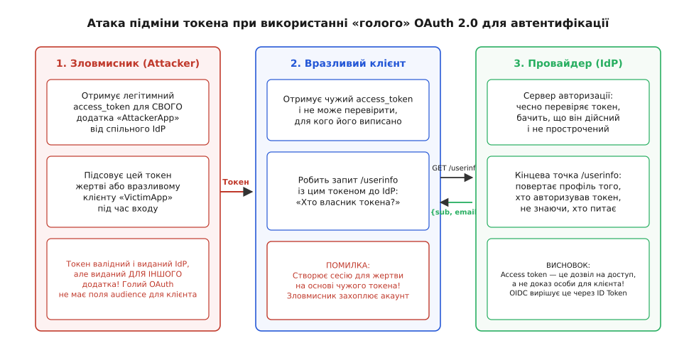
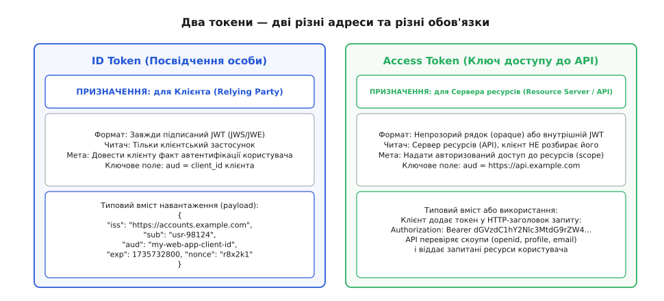
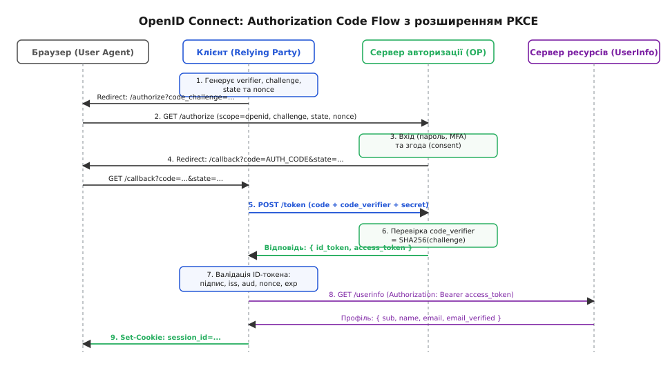
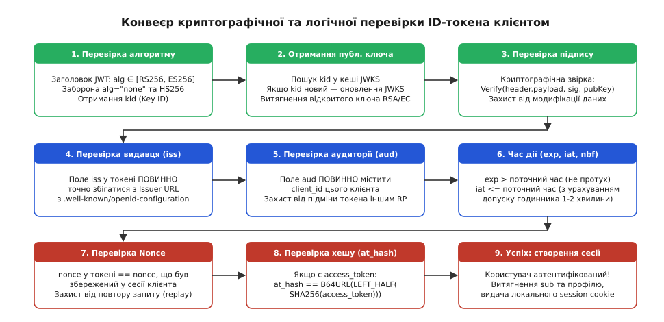
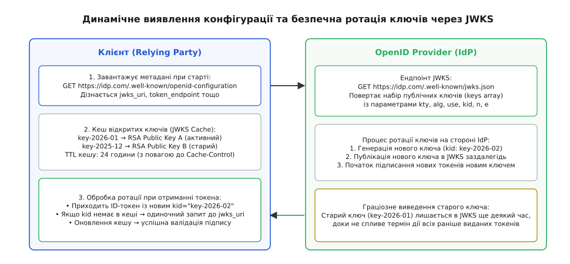
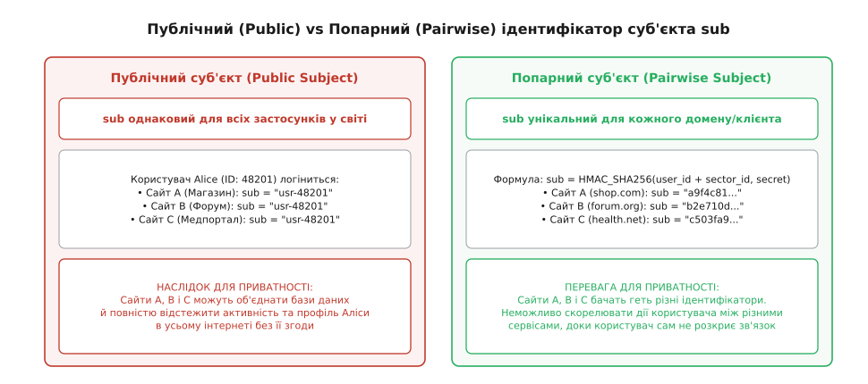

# OpenID Connect: єдиний вхід поверх OAuth 2.0

<preknowlist>
* [OAuth 2.0](topic:programming/oauth2)
* [JWT і сесії без стану](topic:programming/jwt-tokens)
* [Автентифікація](topic:programming/authentication)
* [TLS](topic:communications/tls)
</preknowlist>

Коли користувач натискає кнопку «Увійти через Google» на сторонньому сайті, сервіс має отримати беззаперечний доказ того, хто саме сидить перед монітором, не вимагаючи від людини введення її справжнього пароля. Якщо розробник спробує реалізувати цей механізм за допомогою чистого протоколу [OAuth 2.0](topic:programming/oauth2), система відкриє критичну вразливість підміни особи.

OAuth 2.0 створювався винятково для делегування авторизації до API: наприклад, щоб дозволити онлайн-редактору друкувати фотографії користувача з його хмарного сховища. У такій моделі клієнтський додаток отримує токен доступу (`access_token`) — непрозорий рядок символів, який пред'являється захищеному серверу ресурсів. Токен доступу відповідає на питання «які права має пред'явник?», але не містить жодної криптографічної інформації про те, **кому саме**, **коли** і **для якого додатка** його було видано.

## Криза псевдоавтентифікації на OAuth 2.0

У наївній схемі входу через чистий OAuth 2.0 клієнтський додаток (наприклад, інтернет-магазин «ShopApp») отримує `access_token` користувача, робить HTTP-запит до ендпоінту профілю `GET /userinfo` і, прочитавши з відповіді поле `user_id: "12345"`, вважає користувача з цим ідентифікатором автентифікованим.

Ця схема руйнується класичною атакою «заплутаного заступника» (Confused Deputy Attack):


*Атака підміни токена (Confused Deputy) у наївному використанні OAuth 2.0 для входу*

1. Зловмисник створює власний легітимний додаток-пастку (наприклад, безкоштовну гру «EvilGame») і реєструє його в того самого провайдера ідентифікації (IdP).
2. Жертва (Аліса) заходить у «EvilGame» і проходить стандартну авторизацію через IdP.
3. «EvilGame» отримує дійсний `access_token`, виписаний сервером авторизації для Аліси.
4. Зловмисник бере цей `access_token` і відправляє його на бекенд цільового сервісу «ShopApp», який також дозволяє вхід через цього провайдера.
5. Сервіс «ShopApp» звертається до точки `GET /userinfo` із надісланим токеном. Провайдер бачить валідний токен Аліси і повертає її профіль.
6. «ShopApp» створює сесію Аліси для зловмисника. Зловмисник отримує повний доступ до облікового запису Аліси в магазині, хоча Аліса ніколи не надавала згоди на вхід у «ShopApp».

Причина вразливості полягає в тому, що `access_token` є **мандатом на пред'явника** (bearer token) без зазначення цільової аудиторії (audience). Клієнт «ShopApp» не має можливості дізнатися, чи цей токен призначався саме йому, чи був викрадений з іншого додатку.

Щоб вирішити цю проблему без повернення до важких XML-протоколів корпоративного рівня, інженерна спільнота стандартизувала [OpenID Connect 1.0 (OIDC)](topic:programming/openid-connect/hist-openid-evolution.md) — тонкий, але суворий шар ідентичності, побудований безпосередньо поверх інфраструктури OAuth 2.0.

## Двотокенова архітектура: ID Token проти Access Token

OpenID Connect вирішує кризу псевдоавтентифікації фундаментальним розділенням понять: **підтвердження особи (автентифікація)** відокремлюється від **мандата доступу до API (авторизація)**.

У результаті успішного входу клієнтський додаток (Relying Party, RP) отримує від сервера ідентифікації (OpenID Provider, OP) два принципово різні артефакти:


*Розділення ролей: ID-токен для підтвердження особи клієнту та Access-токен для авторизації до API*

* **`id_token` (Посвідчення особи):** Структурований, підписаний цифровим підписом документ у форматі [JSON Web Token (JWT)](topic:programming/jwt-tokens). Цей токен призначений **винятково для клієнтського додатку**. Клієнт самостійно розбирає його, верифікує підпис за допомогою публічного ключа провайдера та зчитує обов'язкове поле аудиторії `aud`. Якщо `aud` не містить `client_id` цього клієнта, токен негайно відхиляється. ID-токен ніколи не відправляється до зовнішніх API як ключ доступу.
* **`access_token` (Ключ від дверей):** Непрозорий для клієнта мандат, призначений для пред'явлення на сервері ресурсів (Resource Server) або кінцевій точці `userinfo_endpoint`. Клієнт не зобов'язаний розбирати його вміст.

### Анатомія корисного навантаження ID-токена

ID-токен містить стандартизований набір тверджень (claims), що описують факт автентифікації:

```json
{
  "iss": "https://accounts.google.com",
  "sub": "109823409812039841209",
  "aud": "my-web-app.apps.googleusercontent.com",
  "exp": 1735736400,
  "iat": 1735732800,
  "auth_time": 1735732790,
  "nonce": "n-0S6_WzA2Mj",
  "acr": "0",
  "at_hash": "f9J_8wQZ1x9Lk2_1A09vwQ",
  "email": "alice@example.com",
  "email_verified": true,
  "name": "Alice Melnyk"
}
```

Кожне твердження гарантує окремий аспект безпеки:
* `iss` (Issuer) — URL емітента, що випустив токен. Клієнт зобов'язаний звіряти його з довіреним джерелом.
* `sub` (Subject Identifier) — локально незмінний і унікальний ідентифікатор користувача в межах цього провайдера. Використовується клієнтом як первинний ключ для прив'язки облікового запису в базі даних.
* `aud` (Audience) — ідентифікатор клієнта (`client_id`), якому видано токен. Це поле повністю нейтралізує атаку Confused Deputy: клієнт відхилить токен, виписаний для «EvilGame».
* `exp` (Expiration Time) — час закінчення дії токена (Unix Epoch). ID-токени зазвичай мають короткий час життя (від 5 до 60 хвилин).
* `iat` (Issued At) — час випуску токена сервером.
* `auth_time` (Authentication Time) — момент часу, коли користувач безпосередньо пройшов перевірку пароля або біометрії. Дозволяє клієнту вимагати повторного вводу пароля для критичних операцій (step-up authentication), якщо сесія застаріла.
* `nonce` (Number Used Once) — криптографічна сіль, згенерована клієнтом перед початком входу і дзеркально повернута сервером у токені. Захищає від атак повторного відтворення (replay attack).
* `at_hash` (Access Token Hash) — криптографічний відбиток зв'язування: ліва половина SHA-256 хешу від значення `access_token`. Запобігає підміні access-токена в гібридних потоках.

## Протокольний потік: Authorization Code Flow з PKCE

Сучасний канонічний спосіб виконання автентифікації в OpenID Connect для всіх типів клієнтів (серверних бекендів, Single Page Applications та мобільних додатків) — це потік коду авторизації з обов'язковим криптографічним розширенням **PKCE** (Proof Key for Code Exchange, RFC 7636).

Застарілий потік Implicit Flow, де токени поверталися безпосередньо в хеші URL (`#id_token=...`), офіційно визнаний небезпечним і заборонений стандартом безпеки OAuth 2.0 Security Best Current Practice через ризик перехоплення токенів з історії браузера та логів проксі-серверів.

Повний цикл взаємодії з PKCE складається з двох каналів зв'язку: ненадійного фронт-каналу (через браузер) та захищеного бек-каналу (прямий HTTPS між бекендами):


*Повний потік авторизаційного коду OIDC (Authorization Code Flow) із захистом PKCE*

### Фаза 1. Ініціалізація та захист параметрів

Клієнтський додаток генерує три одноразові випадкові послідовності з високою ентропією:
1. `code_verifier` — рядок із 43–128 символів із набору `[A-Z, a-z, 0-9, -, ., _, ~]`.
2. `code_challenge` — односторонній хеш від верифікатора:
```
code_challenge = Base64URL( SHA-256( code_verifier ) )
```
3. `state` — криптографічний токен для захисту від міжсайтової підробки запитів (CSRF).
4. `nonce` — криптографічна сіль для зв'язування запиту з майбутнім ID-токеном.

Клієнт зберігає `code_verifier`, `state` та `nonce` у локальній сесії або захищеній cookie та перенаправляє браузер користувача на кінцеву точку авторизації (`authorization_endpoint`):

```http
GET /oauth2/v1/authorize?
    client_id=my-web-app.apps.googleusercontent.com&
    response_type=code&
    scope=openid%20profile%20email&
    redirect_uri=https%3A%2F%2Fmy-app.com%2Fauth%2Fcallback&
    state=af0ifjsldkj&
    nonce=n-0S6_WzA2Mj&
    code_challenge=E9Melhoa2OwvFrGMTJguCH5rtx64Jquq6-hL2iaqRHER4&
    code_challenge_method=S256 HTTP/1.1
Host: accounts.example.com
```

### Фаза 2. Автентифікація користувача та видача коду

Сервер ідентифікації відображає інтерфейс входу, перевіряє пароль, запитує другий фактор (2FA/MFA) та збирає згоду користувача на передачу профілю. Після успішного входу провайдер генерує короткоживучий (30–60 секунд) одноразовий **код авторизації** (`authorization_code`), зв'язує його з отриманим `code_challenge` і перенаправляє браузер назад:

```http
HTTP/1.1 302 Found
Location: https://my-app.com/auth/callback?code=SplxlOBeZQQYbYS6WxSbIA&state=af0ifjsldkj
```

### Фаза 3. Звірка стану та бек-канал обмін

Отримавши відповідь, клієнтський бекенд:
1. Звіряє отриманий `state` зі збереженим у сесії значенням. Якщо вони не збігаються, запит негайно відхиляється (захист від CSRF).
2. Виконує прямий POST-запит до `token_endpoint` провайдера через зашифроване TLS-з'єднання, передаючи авторизаційний код та оригінальний `code_verifier`:

```http
POST /oauth2/v1/token HTTP/1.1
Host: accounts.example.com
Content-Type: application/x-www-form-urlencoded

grant_type=authorization_code&
code=SplxlOBeZQQYbYS6WxSbIA&
redirect_uri=https%3A%2F%2Fmy-app.com%2Fauth%2Fcallback&
client_id=my-web-app.apps.googleusercontent.com&
code_verifier=dBjftJeZ4CVP-mB92K27uhbUJU1p1r_wW1gFWFOEjXk
```

Провайдер самостійно обчислює `SHA-256(code_verifier)` і порівнює результат із `code_challenge`, який він запам'ятав на кроці 1. Навіть якщо зловмисник перехопив код авторизації в браузері, він не зможе обміняти його на токени, оскільки не знає сирого `code_verifier`.

У відповідь провайдер повертає JSON-об'єкт із токенами:

```json
{
  "access_token": "ya29.a0AfH6SM...",
  "token_type": "Bearer",
  "expires_in": 3599,
  "refresh_token": "1//04...",
  "id_token": "eyJhbGciOiJSUzI1NiIsImtpZCI6...",
  "scope": "openid profile email"
}
```

## Конвеєр криптографічної та семантичної валідації ID-токена

Отримання ID-токена від провайдера не дає клієнту права сліпо вірити його вмісту. Доки токен не пройшов повний цикл верифікації, він вважається ненадійними вхідними даними.

Клієнтський бекенд зобов'язаний виконати строго визначений конвеєр із восьми послідовних перевірок:


*Конвеєр покрокової криптографічної та семантичної валідації ID-токена клієнтом*

1. **Синтаксичний розбір JWT:** Токен перевіряється на наявність рівно трьох компонентів, розділених крапками: `Header`, `Payload` та `Signature`.
2. **Перевірка алгоритму (`alg`):** Заголовок токена декодується, і значення `alg` зіставляється з білим списком дозволених асиметричних алгоритмів (наприклад, `RS256` або `ES256`). Якщо токен містить `alg: "none"` або алгоритми, які клієнт не очікує, валідація негайно переривається.
3. **Верифікація цифрового підпису:** За ідентифікатором ключа `kid` із заголовка токена у провайдера витягується відповідний відкритий ключ із набору JWKS. За допомогою математичного алгоритму перевіряється, що цифровий підпис `Signature` дійсно створено закритим ключем провайдера над рядком `Header.Payload`.
4. **Звірка емітента (`iss`):** Значення `iss` у корисній частині токена має символ-у-символ збігатися з URL провайдера з документа Discovery.
5. **Звірка аудиторії (`aud`):** Поле `aud` зобов'язане містити зареєстрований `client_id` нашого додатку. Якщо в `aud` міститься масив із кількох клієнтів, токен зобов'язаний містити твердження `azp` (Authorized Party), рівне нашому `client_id`.
6. **Перевірка часових рамок (`exp` та `iat`):** Поточний системний час клієнта `now` має задовольняти умову:
```
iat - skew <= now < exp + skew
```
де `skew` — невеликий допустимий розсинхрон годинників (clock skew, зазвичай 60 секунд).
7. **Звірка Nonce:** Значення `nonce` з токена має точно збігатися зі значенням, згенерованим перед редиректом і збереженим у сесії. Це виключає атаку повторного використання перехопленого токена.
8. **Верифікація хешу токена доступу (`at_hash`):** Якщо разом з ID-токеном надійшов `access_token`, клієнт перевіряє криптографічну прив'язку: обчислює SHA-256 від `access_token`, бере ліві 128 біт, кодує в Base64URL і порівнює з полем `at_hash` токена.

Детальну покрокову реалізацію цього конвеєра різними мовами програмування можна знайти у [практичному проекті побудови OIDC Relying Party](topic:programming/openid-connect/proj-oidc-rp-auth.md).

## Динамічне виявлення Discovery та ротація ключів JWKS

Щоб інтеграція не вимагала ручного прописування десятків URL-адрес та статичних сертифікатів, OpenID Connect ввів стандартизовані протоколи виявлення конфігурації та динамічного управління відкритими ключами.

### Документ Discovery (`/.well-known/openid-configuration`)

Будь-який сумісний провайдер публікує JSON-документ метаданих за стандартизованою адресою:
`https://<issuer-domain>/.well-known/openid-configuration`

Клієнту достатньо знати лише базову адресу емітента (`issuer`). Виконавши єдиний запит до цього ендпоінту під час старту, сервіс автоматично отримує всі необхідні координати:

```json
{
  "issuer": "https://accounts.example.com",
  "authorization_endpoint": "https://accounts.example.com/oauth2/v1/authorize",
  "token_endpoint": "https://accounts.example.com/oauth2/v1/token",
  "userinfo_endpoint": "https://accounts.example.com/oauth2/v1/userinfo",
  "jwks_uri": "https://accounts.example.com/oauth2/v1/keys",
  "end_session_endpoint": "https://accounts.example.com/oauth2/v1/logout",
  "response_types_supported": ["code", "id_token", "token id_token"],
  "id_token_signing_alg_values_supported": ["RS256", "ES256"],
  "subject_types_supported": ["public", "pairwise"],
  "code_challenge_methods_supported": ["S256"]
}
```

Вичерпний опис усіх кінцевих точок, їхніх параметрів та форматів відповідей наведено в [довіднику специфікацій OpenID Connect Core](topic:programming/openid-connect/api-oidc-endpoints.md).

### Безшовна ротація ключів підпису (JWKS)

Провайдери регулярно оновлюють свої приватні ключі підпису для дотримання стандартів безпеки. Публічні частини ключів публікуються у форматі **JSON Web Key Set (JWKS)** за адресою `jwks_uri`:


*Динамічне виявлення конфігурації (Discovery) та ротація ключів підпису JWKS*

```json
{
  "keys": [
    {
      "kty": "RSA",
      "use": "sig",
      "alg": "RS256",
      "kid": "key-2026-v1",
      "n": "u1W_9QjZ12kM... (модуль RSA)",
      "e": "AQAB"
    },
    {
      "kty": "RSA",
      "use": "sig",
      "alg": "RS256",
      "kid": "key-2026-v2",
      "n": "v9X_4LkA88bN...",
      "e": "AQAB"
    }
  ]
}
```

Для досягнення максимальної продуктивності та надійності клієнтський вузол кешує набір JWKS у локальній пам'яті (TTL 12–24 години). Коли надходить ID-токен:
1. Клієнт зчитує `kid` із заголовка JWT і шукає ключ у локальному кеші.
2. Якщо ключ знайдено — виконується швидка перевірка підпису без звернення до мережі.
3. Якщо надходить токен із **новим, невідомим `kid`** (провайдер щойно виконав ротацію ключів), клієнт не викидає помилку одразу: він здійснює позачерговий запит до `jwks_uri`, оновлює кеш і повторює перевірку.
4. Щоб зловмисник не міг викликати відмову в обслуговуванні (DoS), надсилаючи запити з випадковими `kid`, клієнт обмежує частоту позачергових оновлень (rate limiting).

## Інженерія приватності: публічні та попарні ідентифікатори (`sub`)

У найпростішій моделі сервер ідентифікації видає кожному користувачеві глобально фіксований ідентифікатор суб'єкта `sub` (наприклад, `sub: "11823901"`). Цей режим називається **Public Subject Identifier**.

Проте публічні ідентифікатори створюють серйозну загрозу приватності: якщо користувач авторизується за допомогою одного облікового запису Google у десятках різних інтернет-магазинів, аналітичні та рекламні трекери можуть легко зіставити його дії на всіх цих сайтах, використовуючи спільне значення `sub` як універсальний міжсайтовий супер-ідентифікатор.

Для вирішення цієї проблеми специфікація OpenID Connect ввела механізм **попарних ідентифікаторів суб'єкта (Pairwise Subject Identifiers)**:


*Порівняння публічних (Public) та попарних (Pairwise) ідентифікаторів суб'єкта*

У режимі `pairwise` провайдер генерує унікальне псевдоанонімне значення `sub` окремо для кожного клієнтського сектору. Генерація обчислюється як криптографічна псевдовипадкова функція або keyed-hash (HMAC):

```
sub_pairwise = HMAC-SHA256( Sector_Identifier || User_Internal_ID, K_salt )
```

Де:
* `User Internal ID` — справжній внутрішній первинний ключ користувача в базі IdP;
* `Sector Identifier` — доменне ім'я сайту-клієнта (наприклад, `shop-a.com` або `forum-b.com`);
* `K_salt` — секретний майстер-ключ провайдера ідентифікації.

У результаті:
* Сайт «Shop-A» стабільно отримує `sub: "usr_991a"`;
* Сайт «Forum-B» для того самого користувача отримує `sub: "usr_774c"`.

Два сайти не мають математичної можливості довести, що за цими двома ідентифікаторами стоїть одна й та сама фізична особа, оскільки вони не знають секретної солі `K_salt`. Якщо ж компанія володіє кількома різними доменами (`shop.com` та `shop-mobile.com`) і хоче мати єдиний `sub` для своїх систем, вона публікує спільний JSON-файл сектора (`sector_identifier_uri`), що дозволяє провайдеру генерувати для них спільний попарний ідентифікатор.

## Життєвий цикл сесії та федеративний вихід (Federated Single Logout)

Автентифікація через OpenID Connect створює дві незалежні сесії:
1. **Сесія в клієнтському додатку (RP Session):** Зберігається за допомогою сесійних cookie у браузері або токенів у сховищі бекенду.
2. **Сесія у провайдера ідентифікації (OP Session):** Активна SSO-сесія в домені провайдера (`accounts.google.com`).

Якщо користувач натискає «Вийти» в додатку, просте видалення локальної сесійної кукі не завершує сесію у провайдера. При наступній спробі входу провайдер виявить активну сесію і миттєво авторизує користувача без запиту пароля. Це неприпустимо на спільних пристроях або в корпоративних системах безпеки.

OpenID Connect стандартизує три взаємодоповнюючі механізми федеративного виходу:

### 1. RP-Initiated Logout
Клієнт перенаправляє браузер на `end_session_endpoint` провайдера, передаючи два ключові параметри:
* `id_token_hint` — раніше виданий ID-токен користувача (підтверджує провайдеру, чию сесію запитують на закриття);
* `post_logout_redirect_uri` — адреса сайту, куди провайдер поверне браузер після завершення сесії.

### 2. Front-Channel Logout
Коли користувач виходить на стороні провайдера, провайдер відображає приховану сторінку з кількома HTML-тегами `<iframe>`, які надсилають запити на спеціальні точки `frontchannel_logout_uri` всіх додатків, у які заходив користувач у цьому браузері.

### 3. Back-Channel Logout
Найбільш надійний промисловий спосіб: сервер провайдера надсилає прямий HTTP POST-запит на бекенд кожного клієнта (`backchannel_logout_uri`), передаючи підписаний `logout_token` у форматі JWT. Отримавши такий токен, бекенд клієнта знаходить усі активні локальні сесії відповідного `sub` та миттєво інвалідує їх у сесійному сховищі (наприклад, у Redis).

## Вектори атак у фронт-каналі та чому Implicit Flow було скасовано

Розуміння архітектури OpenID Connect неможливе без аналізу загроз, які виникають під час проходження повідомлень через ненадійне середовище веб-браузера. 

У ранніх версіях стандарту для односторінкових застосунків (SPA) та мобільних додатків пропонувався спрощений сценарій — **Implicit Flow**. У ньому клієнт надсилав запит із параметром `response_type=id_token token`, і сервер авторизації повертав ID-токен та Access-токен безпосередньо у фрагменті URL-адреси редиректу (`https://app.com/callback#id_token=eyJ...&access_token=...`).

Цей підхід містив критичні вразливості, які призвели до його повної заборони в сучасному стандарті безпеки OAuth 2.0 Security Best Current Practice:

1. **Витік через історію перегляду та системні логи.** URL-адреси разом із фрагментами зберігаються в локальній історії браузера, кеші та логах мобільних операційних систем. Зловмисник, отримавши фізичний або програмний доступ до пристрою, міг прочитати дійсні токени.
2. **Витік через заголовок `Referer`.** Якщо сторінка зворотного виклику завантажувала зовнішні скрипти, стилі чи зображення зі сторонніх CDN або аналітичних платформ, повний URL разом із токенами передавався у відкритому вигляді в заголовку `Referer` на сторонні сервери.
3. **Маніпуляції через Cross-Site Scripting (XSS).** Токени, що зберігаються в пам'яті JavaScript або `localStorage` односторінкового застосунку, стають миттєвою здобиччю для будь-якої успішної XSS-ін'єкції.

### Атака перехоплення коду авторизації на мобільних пристроях

Перехід від Implicit Flow до звичайного Authorization Code Flow без додаткового захисту також виявився недостатнім для мобільних додатків. На операційних системах Android та iOS додатки реєструють власні кастомні схеми URI (наприклад, `myapp://oauth2/callback`) для прийому редиректів із системного браузера.

Якщо користувач встановлював шкідливий додаток, цей додаток міг зареєструвати у системі таку саму схему `myapp://`. Коли браузер повертав авторизаційний код, операційна система могла передати інтент (Intent) не легітимному додатку, а шкідливій програмі.

```
Легітимний додаток                  Браузер / IdP                 Шкідливий додаток
       |                                   |                              |
       |-- 1. Старт входу (без PKCE) ----->|                              |
       |                                   |                              |
       |                                   |-- 2. Редирект myapp://code ->| (Перехоплення!)
       |                                   |                              |
       |                                   |<-- 3. POST /token (code) ----|
       |                                   |                              |
       |                                   |--- 4. Видача токенів ------->| (Злам сесії!)
```

Саме для усунення цієї загрози було розроблено протокол **PKCE** (RFC 7636). Завдяки тому, що секретний `code_verifier` генерується легітимним додатком динамічно в оперативній пам'яті перед стартом, шкідливий додаток, перехопивши код авторизації, не може ним скористатися: спроба обміну коду на точці `/token` провалиться через неможливість надати відповідний `code_verifier`.

## Криптографічний вибір: порівняння алгоритмів підпису

Надійність та швидкість роботи вузла автентифікації безпосередньо залежать від обраного асиметричного криптографічного алгоритму цифрового підпису ID-токена:

### 1. RS256 (RSA PKCS#1 v1.5 з SHA-256)
* **Довжина ключа:** 2048–4096 біт.
* **Переваги:** Абсолютна універсальна підтримка в усіх мовах програмування, бібліотеках та апаратних модулях безпеки (HSM). Операція перевірки підпису відкритим ключем є надзвичайно швидкою завдяки малому значенню публічної експоненти (e = 65537).
* **Недоліки:** Великий розмір відкритого ключа у форматі JWKS (близько 400–800 байт) та значний розмір самого рядка токена. Схема набивання PKCS#1 v1.5 є детермінованою і менш стійкою до крайових атак на відмову, ніж сучасні альтернативи.

### 2. PS256 (RSA-PSS з SHA-256)
* **Довжина ключа:** 2048–4096 біт.
* **Переваги:** Використовує ймовірнісну схему набивання PSS (Probabilistic Signature Scheme), яка має строге математичне доведення криптографічної стійкості, зводячи підробку підпису безпосередньо до задачі факторизації великих чисел.
* **Недоліки:** Вимагає трохи більших обчислювальних витрат на етапі генерації та перевірки підпису; підтримується не всіма застарілими корпоративними системами.

### 3. ES256 (ECDSA на кривій NIST P-256 з SHA-256)
* **Довжина ключа:** 256 біт.
* **Переваги:** Компактність — ключ довжиною всього 32 байти забезпечує рівень криптостійкості, еквівалентний RSA-3072. Сам JWT виходить значно коротшим, що зменшує накладні витрати на трафік у HTTP-заголовках мобільних мереж.
* **Недоліки:** Операція верифікації ECDSA на стороні клієнта вимагає більшої кількості процесорних тактів, ніж верифікація RSA. Крім того, генерація підпису вимагає надійного генератора випадкових чисел: повторне використання або передбачуваність значення k (nonce підпису) веде до миттєвого розкриття закритого ключа сервера.

## Промислові профілі безпеки: FAPI та DPoP

Для систем із підвищеними вимогами до безпеки — інтернет-банкінгу, відкритих банківських API (Open Banking) та державних електронних реєстрів — базової специфікації OIDC Core недостатньо. Консорціум OpenID Foundation стандартизував профіль **FAPI (Financial-grade API)**, який встановлює максимальний рівень захисту:

1. **Заборона слабкої криптографії:** Повна відмова від алгоритмів RSA PKCS#1 v1.5 (`RS256`) на користь `PS256` або `ES256`.
2. **Криптографічна прив'язка відправника (Sender-Constrained Tokens):** Класичний `access_token` є токеном на пред'явника (bearer token) — будь-хто, хто перехопить його, може викликати API. У профілі FAPI вимагається прив'язка токена до криптографічного ключа клієнта.

Існує два основні стандарти прив'язки токенів:

### Mutual TLS (mTLS, RFC 8705)
Клієнт встановлює взаємне TLS-з'єднання з сервером, пред'являючи власний X.509-сертифікат. Сервер авторизації вшиває хеш сертифіката клієнта у твердження `cnf["x5t#S256"]` всередині токена доступу. Сервер ресурсів при кожному виклику звіряє пред'явлений TLS-сертифікат із відбитком у токені. Якщо зловмисник викраде токен, він не зможе ним скористатися без наявності закритого TLS-ключа клієнта.

### DPoP (Demonstrating Proof-of-Possession, RFC 9449)
Легковагова альтернатива mTLS на рівні додатків, яка ідеально підходить для веб-браузерів та мобільних пристроїв:
* Клієнт локально генерує пару ключів (наприклад, ECDSA P-256).
* При кожному зверненні до сервера ресурсів клієнт створює короткоживучий JWT-доказ (DPoP Proof), підписаний своїм закритим ключем, куди записує поточний HTTP-метод, URI запиту, позначку часу та випадковий `jti`.
* Захищений API верифікує цей доказ, гарантуючи, що запит надіслано саме тим клієнтом, який володіє прив'язаним до токена приватним ключем.

## Реалізація SSO у мультидоменних SaaS-екосистемах

Сучасні цифрові екосистеми складаються з десятків взаємопов'язаних сервісів, розташованих на різних доменах другого рівня (наприклад, `mail.company.com`, `crm.service.net`, `analytics.platform.io`). Організація безшовного єдиного входу (Single Sign-On, SSO) без повторного запиту пароля вимагає грамотної координації між сесіями.

### Патерн Backend-for-Frontend (BFF)

З посиленням політики захисту браузерів від міжсайтового стеження (блокування сторонніх cookies / Third-Party Cookie Deprecation) класичні рішення на базі прихованих iframe та `prompt=none` втратили працездатність у більшості сучасних браузерів.

Сучасним архітектурним стандартом для SPA став патерн [Backend-for-Frontend (BFF)](topic:programming/bff-pattern):

```
+-------------------------------------------------------------------------------+
|  Браузер (User Agent)                                                         |
|  [ Single Page App ]  -- (SameSite Secure Cookie) --> [ BFF Gateway ]         |
+-------------------------------------------------------------|-----------------+
                                                              | 
                                            Прямий HTTPS      | (OIDC Flow)
                                            із PKCE / mTLS    v
                                                        [ OpenID Provider ]
```

1. Односторінковий JavaScript-додаток більше ніколи не отримує і не зберігає `access_token` або `id_token` у власному сховищі браузера (`localStorage` / `IndexedDB`).
2. Усі протокольні операції OIDC виконує спеціалізований проміжний бекенд-шлюз (BFF Gateway).
3. Після завершення обміну коду на токени BFF зберігає токени у власному серверному сховищі сесій, а клієнту у браузер повертає виключно зашифрований сесійний cookie з прапорцями `HttpOnly`, `Secure` та `SameSite=Lax`.
4. Коли SPA звертається до внутрішнього API, BFF автоматично підставляє збережений `access_token` у заголовок `Authorization` вихідного запиту.

Така топологія повністю захищає токени від викрадення через XSS-атаки у фронтенді та забезпечує стабільну роботу SSO незалежно від браузерних обмежень на сторонні cookies.

## Розподілені та агреговані твердження (Claims Aggregation)

У складних корпоративних та державних екосистемах провайдер ідентифікації не завжди володіє всіма даними про користувача. Наприклад, IdP може перевірити логін і пароль, але дані про водійські права, медичну ліцензію чи кредитний рейтинг зберігаються у зовнішніх авторитетних реєстрах.

Специфікація OpenID Connect Core (§5.6.2) стандартизує два механізми делегованого отримання атрибутів:

1. **Агреговані твердження (Aggregated Claims):** IdP запитує дані у зовнішнього постачальника атрибутів (Claims Provider), отримує підписаний цим постачальником JWT і вкладає його у відповідь клієнту у спеціальному полі `_claim_sources`. Клієнт самостійно перевіряє підпис зовнішнього джерела.
2. **Розподілені твердження (Distributed Claims):** IdP повертає клієнту лише посилання (`endpoint`) та токен доступу (`access_token`) до зовнішнього джерела атрибутів. Клієнтський додаток самостійно робить прямий HTTP-запит до стороннього реєстру для отримання необхідного твердження:

```json
{
  "sub": "usr-98124",
  "name": "Оксана Коваленко",
  "_claim_names": {
    "driving_license_valid": "src1"
  },
  "_claim_sources": {
    "src1": {
      "endpoint": "https://gov-registry.example.org/claims/license",
      "access_token": "bearer-token-for-registry"
    }
  }
}
```

Цей механізм дозволяє будувати масштабовані децентралізовані федерації ідентичності без необхідності централізованого накопичення чутливих персональних даних на серверах одного провайдера.

## Покрокова автентифікація та контекстні класи (Step-Up Authentication)

У багатьох додатках різні дії вимагають різного рівня гарантії особи (Level of Assurance, LoA). Для звичайного перегляду каталогу достатньо простого входу за паролем, але для переказу коштів чи зміни пароля банківський сервіс вимагає підтвердження через другий фактор (MFA або апаратний ключ FIDO2/WebAuthn).

OpenID Connect вирішує це завдання за допомогою стандартизованих параметрів `acr_values` та тверджень `acr` / `amr`:

1. **Запит контексту (`acr_values`):** Клієнт при переході на критичну операцію ініціює новий потік авторизації, надсилаючи в запиті `GET /authorize` параметр:
```http
acr_values=urn:mace:incommon:iap:silver https://refeds.org/profile/mfa
```
2. **Виконання вимог сервером:** Провайдер бачить, що поточної сесії користувача недостатньо для запитаного рівня, і примусово запитує проходження другого фактора (біометрії або апаратного токена).
3. **Підтвердження у токені:** Виданий новий `id_token` містить:
   * `acr` (Authentication Context Class Reference) — досягнутий клас контексту (наприклад, `"https://refeds.org/profile/mfa"`);
   * `amr` (Authentication Methods References) — масив ідентифікаторів використаних факторів, наприклад `["pwd", "mfa", "fido"]`.

Клієнт перевіряє значення `acr` перед наданням доступу до критичної фінансової чи адміністративної операції.

## Архітектурний вибір: OIDC, SAML 2.0 чи сесії на Cookie

Обираючи протокол автентифікації для архітектури системи, слід враховувати характеристики платформи:

| Критерій | OpenID Connect 1.0 | SAML 2.0 | Власні сесії (Cookie / DB) |
| :--- | :--- | :--- | :--- |
| **Формат даних** | JSON / JWT | XML / XML-DSig | Внутрішній (SQL, Redis) |
| **Придатність для Mobile / SPA** | Ідеальна (нативна підтримка REST / JSON) | Погана (вимагає важких POST bindings та парсерів XML) | Добра |
| **Міждоменна федерація (SSO)** | Так (глобальна та публічна) | Так (корпоративна інтранет-федерація) | Ні (обмежено одним доменом) |
| **Підтримка авторизації до API** | Вбудована (через спадщину OAuth 2.0) | Складна (потребує надбудов WS-Trust) | Тільки для власного API |
| **Складність реалізації клієнта** | Низька (наявність легких бібліотек) | Висока (ризики атак парсерів XML) | Мінімальна |

OpenID Connect поєднав криптографічну надійність підписаних тверджень SAML із простотою та легкістю JSON-інфраструктури OAuth 2.0. Сьогодні OIDC є безальтернативним галузевим стандартом для створення систем єдиного входу (SSO), захисту мікросервісних бекендів, мобільних застосунків та публічних API.


