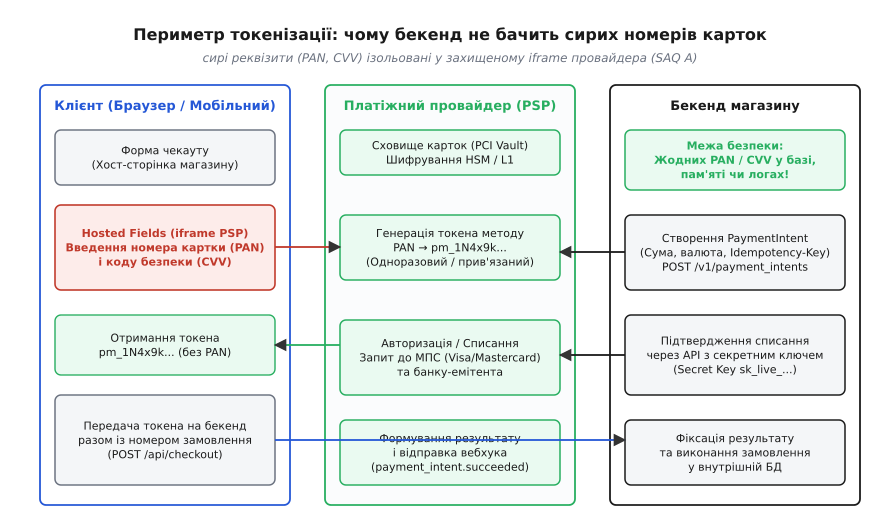
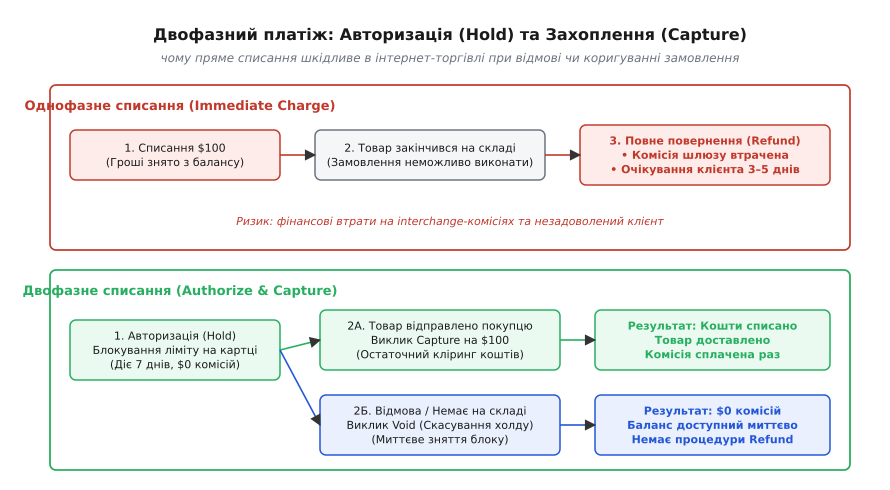
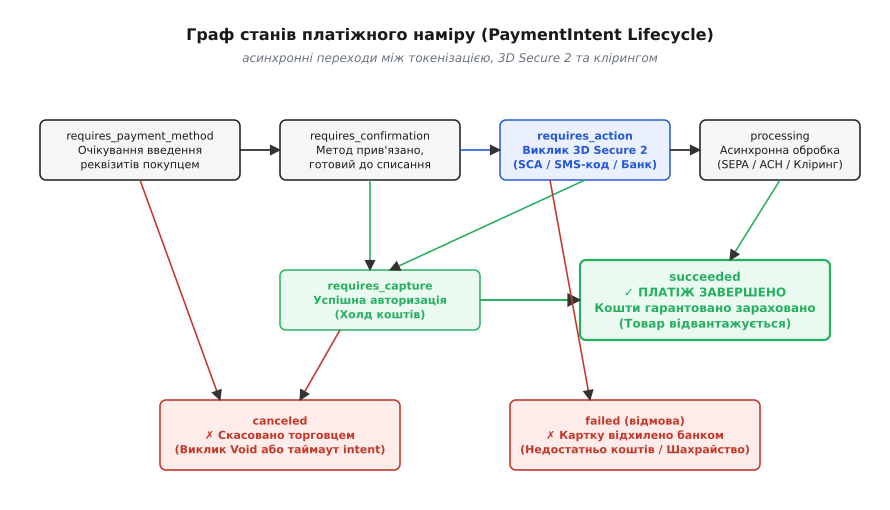
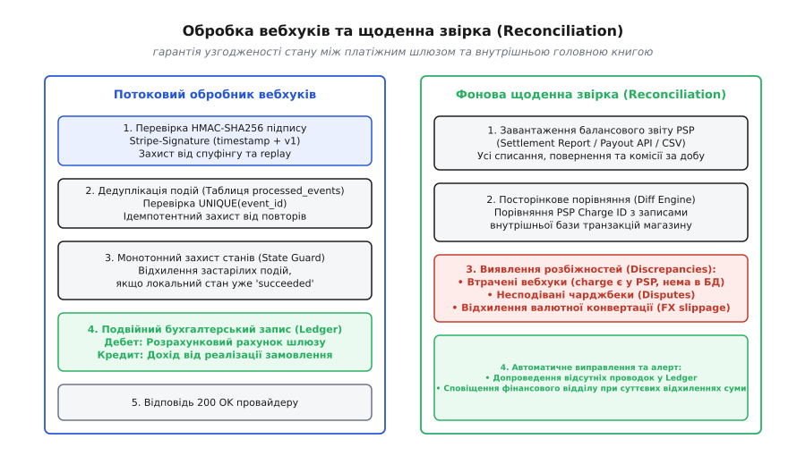

# Платіжний провайдер

<preknowlist>
- [REST-архітектура та HTTP-методи](topic:programming/rest-api) — модель ресурсів, методи запитів (POST, GET) та заголовки передачі даних.
- [Ідемпотентність методів як частина контракту](topic:programming/api-idempotency) — захист від подвійних списань та мережевих таймаутів за допомогою унікальних ключів операції.
- [Вебхуки (бік споживача)](topic:programming/webhooks) — прийом асинхронних подій, криптографічна перевірка підписів та дедуплікація повторних сповіщень.
</preknowlist>

Покупець оформлює замовлення в інтернет-магазині на суму 1200 гривень і натискає кнопку «Оплатити». Бекенд магазину приймає запит, звертається через мережу до API платіжного шлюзу, шлюз успішно зв'язується з банком-емітентом і списує 1200 гривень з картки клієнта. Але рівно в ту мить, коли шлюз формує позитивну відповідь, міжсерверне з'єднання обривається через мережевий таймаут або перезапуск вузла. Бекенд магазину не отримує підтвердження і повертає у браузер помилку з кодом 504 Gateway Timeout. Покупець бачить на екрані напис «Помилка оплати, спробуйте ще раз», натискає кнопку повторно — і з його картки списується ще 1200 гривень.

Ця аварія трапляється не через помилку в коді розрахунку кошика, а тому, що взаємодія з платіжним провайдером є типовою розподіленою транзакцією між двома незалежними організаціями. Між базою даних магазину та банківським процесингом не існує спільного ACID-контексту чи двофазної фіксації (Two-Phase Commit, 2PC) через публічний інтернет. Як тільки гроші залишають картку покупця, платіжний провайдер стає первинним джерелом фінансової правди, а бекенд магазину зобов'язаний узгодити свій внутрішній стан із цим фактом в умовах нестабільної мережі, затримок банківського клірингу та асинхронних перевірок безпеки.

## Периметр безпеки карткових даних: токенізація та стандарт PCI-DSS

Перше фундаментальне обмеження платіжної архітектури полягає в тому, що бекенд торговця ніколи не повинен приймати, обробляти, зберігати чи навіть пропускати крізь власну оперативну пам'ять сирі реквізити банківських карток. Це стосується шістнадцятизначного номера картки (англ. *Primary Account Number*, PAN), терміну її дії та тризначного коду безпеки (CVV2/CVC2).

Причина цього правила — міжнародний стандарт безпеки даних індустрії платіжних карток (англ. *Payment Card Industry Data Security Standard*, PCI-DSS). Якщо через вебсервер торговця проходить хоча б один сирий номер картки, вся інфраструктура компанії — балансувальники навантаження, сервери додатків, реляційні бази даних, журнали логування (Logstash, Elasticsearch) і резервні копії — потрапляє в максимальний периметр аудиту PCI Scope (анкета SAQ D). Це накладає вимоги обов'язкового щоквартального сканування вразливостей зовнішніми сертифікованими аудиторами, шифрування трафіку на кожному внутрішньому транзитному вузлі апаратними модулями безпеки (HSM) та фізичного контролю доступу до серверів. Для більшості компаній вартість такої сертифікації перевищує сотні тисяч доларів на рік.



*Сирі реквізити картки вводяться виключно в ізольованому iframe провайдера (Hosted Fields). Бекенд торговця оперує виключно непрозорими токенами.*

Для виведення інфраструктури з-під важкого аудиту PCI застосовується механізм токенізації (від лат. *tessera* / англ. *tokenization* — заміна цінного предмета умовним знаком-символом). Клієнтська сторінка чекауту вбудовує спеціальні поля введення номера картки та CVV у вигляді ізольованих фреймів (англ. *Hosted Fields* або *Stripe Elements*), які завантажуються безпосередньо з домену платіжного провайдера. Завдяки політиці одного джерела (Same-Origin Policy) у браузері JavaScript-код сайту магазину не має доступу до вмісту всередині iframe і не може перехопити введені цифри.

Коли покупець натискає «Оплатити», скрипт усередині iframe відправляє сирі реквізити картки напряму в захищене сховище платіжного шлюзу (PCI Vault). Шлюз зберігає картку в шифрованому вигляді, а клієнту повертає непрозорий рядок — токен платіжного методу (наприклад, `pm_1N4x9k2eZvKYlo2C0pRt5VwQ`). Цей токен має три критичні властивості:
1. **Незворотність:** з тексту токена неможливо математично розшифрувати чи відновити номер картки.
2. **Контекстна прив'язка:** токен валідний виключно для облікового запису конкретного торговця; якщо зловмисник викраде цей токен із бази магазину, він не зможе списати кошти в іншій системі.
3. **Мінімальний периметр PCI:** оскільки сервер торговця приймає від клієнта лише токен `pm_...`, аудит магазину скорочується до базової анкети самооцінки (SAQ A), яка підтверджує лише безпеку підключення скриптів чекауту.

Сучасні провайдери також підтримують мережеву токенізацію (англ. *Network Tokenization* за специфікацією EMVCo). При використанні Apple Pay, Google Pay або збереженні картки в провайдера фізичний номер картки (FPAN) замінюється на пристроєвий або мережевий токен (DPAN). Банк-емітент генерує динамічну криптограму на кожну транзакцію замість статичного CVV. Це дає дві відчутні переваги: по-перше, автоматичне оновлення токена при перевипуску фізичної картки банком (покупцю не потрібно повторно вводити реквізити після закінчення терміну дії картки), а по-друге — підвищення конверсії успішних списань на 2–3% та зниження міжбанківських комісій еквайрингу.

Детальний аналіз того, як індустрія перейшла від зберігання відкритих номерів карток у локальних реляційних базах даних до сучасного стандарту ізоляції, викладено в матеріалі про те, як розвивалася [історія появи платіжних шлюзів та токенізації](topic:programming/payments-integration/hist-payment-gateways.md).

## Двофазний платіж: авторизація проти миттєвого списання

Після отримання токена платіжного засобу бекенд повинен здійснити списання. У наївній реалізації розробники часто обирають однофазне пряме списання (Immediate Charge). Проте в реальній електронній комерції та сфері послуг пряме списання створює серйозні фінансові та операційні ризики.

Уявімо інтернет-магазин одягу. Покупець замовляє пальто за $200. Якщо магазин списує $200 миттєво, а під час комплектації на складі з'ясовується, що останній екземпляр має брак або був пошкоджений, замовлення доводиться скасовувати. Щоб повернути гроші клієнту, торговець викликає операцію повернення (Refund). У цей момент бізнес стикається з двома проблемами:
- **Втрата міжбанківської комісії:** платіжні шлюзи та міжнародні платіжні системи (Visa, Mastercard) стягують фіксовану комісію за транзакцію еквайрингу (наприклад, 2.9% + 30 центів). Під час виконання операції Refund ця комісія торговцю не повертається. Тобто магазин втрачає близько $6 на рівному місці через відсутність товару на складі.
- **Затримка для клієнта:** процедура повернення коштів (Refund) проходить повний міжбанківський розрахунковий цикл і займає від 3 до 5 робочих днів, що викликає роздратування покупця.

Для вирішення цієї проблеми застосовується модель двофазного платежу: **Авторизація (Authorize)** та **Захоплення (Capture)**.



*Двофазне списання блокує ліміт без стягнення комісій і дозволяє безкоштовно скасувати операцію у разі відсутності товару.*

### Механізм роботи двох фаз:

1. **Фаза 1: Авторизація (Pre-Authorization / Hold).** Бекенд надсилає запит до шлюзу з параметром `capture_method: manual`. Банк-емітент перевіряє наявність коштів на рахунку покупця і тимчасово блокує суму $200 на його кредитному ліміті. Гроші не переказуються на рахунок торговця, а міжбанківська комісія за кліринг не нараховується. Стандартне вікно дії авторизації становить 7 календарних днів (для деяких готельних і прокатних MCC-кодів — до 30 днів).
2. **Фаза 2А: Захоплення коштів (Capture).** Після того, як склад упакував пальто і передав його кур'єрській службі, бекенд викликає `POST /v1/payment_intents/:id/capture`. Тільки в цей момент гроші списуються остаточно, списується комісія еквайрингу, а транзакція стає завершеною. Ба більше, шлюзи дозволяють виконувати часткове захоплення (Partial Capture) — наприклад, списати $150, якщо однієї позиції з трьох не виявилося, а решту $50 розблокувати автоматично.
3. **Фаза 2Б: Скасування авторизації (Void).** Якщо товару немає на складі або покупець передумав до відправки, бекенд викликає `POST /v1/payment_intents/:id/cancel`. Банк-емітент миттєво знімає блокування з балансу покупця. Жодних комісій за еквайринг не стягується, а кошти стають доступними покупцю за кілька секунд без тривалої процедури повернення.

Правила платіжних систем суворо регулюють коригування сум під час захоплення:
- **Зменшення суми (Under-capture):** дозволено для більшості видів бізнесу без обмежень. Якщо було заблоковано $200, а захоплено $150, залишок у $50 негайно повертається на доступний баланс картки.
- **Збільшення суми (Over-capture):** суворо обмежене за категоріями торгових точок (MCC). Для ресторанів і служб доставки їжі Visa та Mastercard дозволяють захоплення до 120% від авторизованої суми для врахування чайових. Для звичайної електронної комерції перевищення суми списання понад авторизовану заборонено і призводить до відхилення операції банком.
- **Закінчення терміну авторизації:** якщо захоплення не відбулося протягом 7 днів, холд знімається емітентом автоматично. Спроба захопити кошти на 8-й день (Late Capture) або буде відхилена, або пройде з підвищеною комісією (downgrade) та високим ризиком невідворотного чарджбеку через відсутність активної авторизації.

> 🔧 **Навіщо це.** Двофазне списання є стандартом для будь-якого бізнесу, де між кліком «Купити» та фізичним наданням послуги є часовий проміжок: інтернет-магазини з фізичною доставкою, сервіси виклику таксі (де фінальна вартість залежить від тривалості поїздки та чайових), бронювання готелів та прокат автомобілів.

## Асинхронний життєвий цикл та протокол 3D Secure 2

Робота з платежами в сучасному вебі не може бути побудована як простий синхронний виклик функцій. Навіть списання з кредитної картки є за своєю суттю асинхронним скінченним автоматом через необхідність проходження обов'язкової автентифікації клієнта (англ. *Strong Customer Authentication*, SCA), запровадженої європейською директивою PSD2 та протоколом 3D Secure 2 (EMV 3DS).

Коли бекенд ініціює платіж, банк-емітент може вимагати від користувача підтвердити операцію у мобільному банківському додатку, за допомогою біометрії (TouchID/FaceID) або через одноразовий пароль з SMS. Це означає, що платіжний намір не переходить у фінальний стан миттєво, а зависає у стані очікування дій користувача.



*Скінченний автомат забезпечує детермінований перехід між токенізацією, 3D Secure 2 автентифікацією та клірингом.*

### Архітектура протоколу 3D Secure 2:

Протокол 3DS 2.0 оптимізує взаємодію між трьома доменами (торговець/еквайр, платіжна система, емітент) і підтримує дві гілки виконання:
1. **Безшовний потік (Frictionless Flow):** клієнтський SDK передає шлюзу понад 100 параметрів контексту сесії (IP-адреса, відбиток пристрою, історія попередніх успішних покупок, часовий пояс). Сервер контролю доступу емітента (Access Control Server, ACS) оцінює рівень ризику транзакції за допомогою алгоритмів машинного навчання. Якщо ризик низький, банк підтверджує списання миттєво без жодного діалогового вікна для користувача.
2. **Потік з викликом (Challenge Flow):** якщо транзакція кваліфікується як ризикована, сума перевищує ліміти безконтактних покупок або картка використовується на новому пристрої, ACS повертає вимогу проходження челенджу. Клієнтський SDK відкриває модальне вікно, де покупець підтверджує платіж через біометрію або код підтвердження.

### Зсув відповідальності (Liability Shift):

Найважливішим наслідком успішного проходження 3DS 2.0 є зсув фінансової відповідальності за шахрайські операції (Liability Shift). Якщо покупець згодом заявить у свій банк, що транзакцію було здійснено шахраями без його відома (код чарджбеку Visa 10.4 / Mastercard 4837), збитки покриває банк-емітент, який авторизував операцію, а не торговець. Якщо ж торговець не запросив 3DS автентифікацію для європейської картки, уся відповідальність за можливе шахрайство покладається на магазин.

### Стани скінченного автомата платіжного наміру (PaymentIntent Lifecycle):

1. **`requires_payment_method`:** початковий стан після створення наміру. Очікує введення покупцем реквізитів картки або вибору альтернативного методу (Apple Pay, Google Pay, SEPA).
2. **`requires_confirmation`:** платіжний засіб прив'язано до наміру. Об'єкт готовий до виклику підтвердження з боку бекенда або клієнтського SDK.
3. **`requires_action`:** критичний асинхронний стан. Банк-емітент вимагає проходження 3D Secure 2 перевірки. Об'єкт містить поле `next_action` із посиланням на фрейм автентифікації банку або інструкціями для виклику нативного банківського SDK. Бекенд повертає цей статус фронтенду, а клієнтський JavaScript відкриває модальне вікно підтвердження.
4. **`processing`:** платіж знаходиться на етапі клірингу. Цей стан типовий для асинхронних платіжних методів із відкладеним розрахунком (банківські перекази SEPA Direct Debit, клірингові чеки ACH, локальні системи типу iDEAL чи Boleto), де підтвердження списання може тривати від кількох годин до трьох банківських днів.
5. **`requires_capture`:** картку успішно верифіковано, 3DS челендж пройдено, кошти заблоковано на балансі покупця у режимі авторизації (Hold). Очікується явний виклик захоплення від бекенда торговця.
6. **`succeeded`:** фінальний стан успіху. Кошти остаточно списано та переведено у статус зарахування на баланс торговця. Тільки після досягнення цього стану замовлення переводиться в статус оплаченого.
7. **`canceled` / `failed`:** термінальні стани неуспіху. Намір скасовано торговцем або відхилено банком-емітентом через нестачу коштів (`insufficient_funds`), невірний CVV чи підозру на шахрайство.

Повний перелік параметрів об'єктів, форматів відповідей, кодів помилок та детальних переходів наведено у документі, де описано [контракт життєвого циклу платежу та специфікація вебхуків](topic:programming/payments-integration/api-payment-lifecycle.md).

## Контракт ідемпотентності для вихідних API-запитів

Оскільки мережевий збій може статися на будь-якому етапі міжсерверної розмови, кожен запит на модифікацію стану (створення наміру, списання, повернення коштів) зобов'язаний супроводжуватися унікальним ключем ідемпотентності у заголовку:

```http
POST /v1/payment_intents HTTP/1.1
Host: api.stripe.com
Authorization: Bearer sk_live_51Mz...
Idempotency-Key: checkout_ord_884920_120000_uah
Content-Type: application/x-www-form-urlencoded

amount=120000&currency=uah&payment_method=pm_1N4x9k...
```

### Як шлюз обробляє ключ ідемпотентності:

1. **Перший запит:** шлюз бачить новий ключ `checkout_ord_884920_120000_uah`, фіксує його в локальній таблиці блокувань зі статусом `PROCESSING`, виконує списання в банківській мережі, зберігає сформовану JSON-відповідь у сховищі ідемпотентності й повертає її бекенду.
2. **Повторний запит при таймауті:** якщо зв'язок обірвався і бекенд магазину надсилає той самий POST-запит із тим самим заголовком `Idempotency-Key`, шлюз знаходить збережений запис, **не викликає повторного списання в банку**, а миттєво повертає раніше збережену JSON-відповідь із HTTP-кодом 200 OK.
3. **Конкурентні повтори (In-Flight Requests):** якщо два запити з однаковим ключем надійшли практично одночасно (наприклад, через агресивний ретрай у фоновому воркері), другий запит блокується до завершення першого або отримує відповідь `409 Conflict / 429 Too Many Requests`, що унеможливлює стан гонитви.
4. **Конфлікт параметрів (Payload Mismatch):** якщо клієнт надішле той самий ключ ідемпотентності, але змінить тіло запиту (наприклад, передасть суму 1500 грн замість 1200 грн), шлюз розпізнає логічну помилку і поверне помилку `400 Bad Request / 409 Conflict`, запобігаючи маніпуляціям із сумами.

Ключ ідемпотентності повинен генеруватися детерміновано від бізнес-ідентифікатора операції (наприклад, комбінація ID замовлення та суми), а не як випадковий UUID на кожен новий HTTP-виклик у циклі повторів, інакше сенс ідемпотентного захисту втрачається.

## Вебхуки як єдине джерело правди про стан оплати

Класична помилка початківців в інтеграції платежів — зміна статусу замовлення на «Оплачено» в обробнику сторінки повернення користувача (`return_url` / redirect handler).

Покладатися на повернення користувача в браузері категорично заборонено:
- Покупець може закрити вкладку або браузер одразу після проходження 3DS челенджу у вікні банку, не чекаючи зворотного перенаправлення на сайт магазину.
- Мобільний телефон користувача може втратити інтернет-зв'язок під час редиректу.
- Зловмисник може вручну звернутися до URL вида `/checkout/success?order_id=884920` з підробленими параметрами, намагаючись отримати товар без фактичної оплати.

Єдиним надійним джерелом правди про зміну стану списання є **вебхуки (Webhooks)** — асинхронні HTTP POST-повідомлення, які платіжний шлюз надсилає безпосередньо на бекенд торговця за схемою Server-to-Server.



*Вебхуки забезпечують асинхронну доставку результату списання, а щоденна звірка усуває будь-які розбіжності між шлюзом та головною книгою.*

### Архітектура надійного обробника вебхуків вимагає вирішення чотирьох задач:

1. **Криптографічна валідація підпису (HMAC-SHA256):** кожен запит шлюзу супроводжується заголовком `Stripe-Signature` виду `t=timestamp,v1=hash`. Бекенд обчислює `HMAC_SHA256(t + "." + raw_body, webhook_secret)` і порівнює результат за сталий час за допомогою `crypto.timingSafeEqual`. Це гарантує, що повідомлення надіслав саме платіжний провайдер, а не сторонній зловмисник.
2. **Захист від атак повторного відтворення (Replay Attacks):** обробник перевіряє різницю між поточним системним часом і міткою `t` у заголовку. Якщо повідомлення має вік понад 300 секунд (5 хвилин), воно негайно відхиляється.
3. **Ідемпотентний прийом та дедуплікація:** оскільки шлюзи гарантують доставку за принципом «щонайменше один раз» (at-least-once) і повторюють відправку при затримці відповіді, один і той самий вебхук може прийти 5–10 разів. Бекенд зберігає унікальний ідентифікатор події (`event.id`) у таблиці `processed_events` з обмеженням `UNIQUE`. Якщо подія вже оброблялася, сервер миттєво повертає статус `200 OK`, не виконуючи повторної бізнес-логіки.
4. **Монотонний захист станів (State Guard / Out-of-Order Delivery):** через різну швидкість проходження пакетів у розподілених чергах подія `payment_intent.succeeded` може надійти на сервер раніше, ніж подія `payment_intent.created`. Обробник зобов'язаний перевіряти поточний статус замовлення під блокуванням рядка бази даних (`SELECT ... FOR UPDATE` у транзакції): якщо замовлення вже перейшло в статус `PAID`, старіші або проміжні події не повинні повертати його назад у стан обробки.
5. **Черга мертвих листів (Dead-Letter Queue, DLQ):** якщо обробка вебхука падає з невідомою внутрішньою помилкою бекенда (наприклад, недоступність бази даних чи збій стороннього складу), сервер повертає статус `500 Internal Server Error`, щоб шлюз повторив доставку пізніше з експоненційним відступом. Повідомлення, які не вдалося обробити після максимальної кількості спроб (зазвичай 3 дні), перенаправляються в DLQ для ручного аудиту інженерами.

Повний вихідний код виробничого сервісу для створення платіжних намірів, безпечної валідації вебхуків та дедуплікації наведено у практичній вставці, де реалізовано [наскрізний конвеєр обробки платежів та безпечних вебхуків](topic:programming/payments-integration/proj-payment-gateway-flow.md).

## Спори, чарджбеки та системи антифроду

Окрім штатних списань та повернень, кожен розробник платіжної інтеграції стикається з процедурою примусового оскарження операцій — **чарджбеком (Dispute / Chargeback)**.

Чарджбек — це механізм захисту прав споживача, коли власник картки звертається безпосередньо до банку, що випустив картку (банку-емітента), стверджуючи, що він не здійснював цю покупку (шахрайство), або що замовлений товар не було доставлено, а торговець відмовився повертати кошти добровільно.

### Фінансові наслідки та життєвий цикл спору:

1. **Миттєве безакцептне списання:** щойно покупець подає заяву на чарджбек, платіжна система автоматично списує оскаржувану суму з балансу торговця разом із безповоротною штрафною комісією за розгляд спору (англ. *Dispute Fee*, зазвичай від $15 до $25 за кожну оскаржену транзакцію).
2. **Отримання вебхука `charge.dispute.created`:** бекенд торговця фіксує факт спору, блокує надання цифрових послуг або відвантаження товару та повідомляє команду комплаєнсу про дедлайн подачі доказів (зазвичай 7–21 день).
3. **Подача доказів (Evidence Submission / Representment):** торговець надсилає через API або кабінет шлюзу пакет документів: логи авторизації, IP-адресу клієнта, підтвердження проходження 3D Secure 2, трек-номер кур'єрської доставки з підписом отримувача або журнали завантаження файлу.
4. **Рішення банку та арбітраж:** банк-емітент розглядає докази. Якщо торговець виграє спір (вебхук `charge.dispute.closed` зі статусом `won`), списана сума повертається на рахунок магазину (проте комісія за розгляд спору найчастіше не повертається). Якщо спір програно (`lost`), кошти остаточно перераховуються власнику картки. За бажання торговця справа може бути передана в офіційний арбітраж платіжної системи (Mastercard Arbitration / Visa Compliance), але вартість арбітражного збору становить $500 за розгляд.
5. **Загроза блокування еквайрингу:** якщо співвідношення чарджбеків до загальної кількості успішних транзакцій торговця (англ. *Dispute-to-Transaction Ratio*) перевищує поріг 0.9% – 1.0%, платіжні системи Visa та Mastercard вносять торговця у штрафні моніторингові програми (Visa VROL / VFMP, Mastercard ECP) з накладанням штрафів у десятки тисяч доларів та подальшим розірванням договору еквайрингу (внесення до чорного списку MATCH/TMF).

Для запобігання чарджбекам сучасні платіжні шлюзи інтегрують предиктивні системи машинного навчання протидії шахрайству (Stripe Radar, Adyen RevenueProtect). Антифрод-моделі оцінюють сотні факторів ризику в режимі реального часу: збіг країни IP-адреси з країною випуску картки, використання проксі/VPN, швидкість введення тексту, історію шахрайських дій на інших сайтах мережі провайдера. При високому ризику шлюз або примусово вимагає проходження 3DS 2.0 челенджу, або автоматично блокує транзакцію до її передачі в банк.

## Фінансова цілісність: головна книга та щоденна звірка (Reconciliation)

Останній і найважливіший рубіж платіжної архітектури — гарантія фінансової узгодженості між внутрішніми записами магазину та виписками платіжного шлюзу.

Зберігання грошового балансу клієнта або магазину у вигляді єдиного числового стовпчика в таблиці (наприклад, `UPDATE accounts SET balance = balance + 100`) є грубою архітектурною помилкою. Будь-який збій бази даних, невраховане повернення коштів або дубльований запис призводять до невідновлюваної втрати балансу без можливості з'ясувати, де саме зникли кошти.

Усі грошові операції повинні фіксуватися за правилами подвійного бухгалтерського запису (Double-Entry Bookkeeping) в незмінному фінансовому журналі (Ledger). Кожна операція складається щонайменше з двох проводок (дебет і кредит), а їхня сума завжди строго дорівнює нулю.

### Принцип обліку списання $100 через платіжний шлюз:
- **ДЕБЕТ:** Рахунок активів `1010-PSP-Clearing` (гроші, які шлюз утримує на нашому транзитному балансі) = +$100.00.
- **КРЕДИТ:** Рахунок доходів `4010-Sales-Revenue` (виручка від реалізації товару) = +$100.00.
- **ДЕБЕТ:** Рахунок витрат `5010-Processing-Fees` (комісія шлюзу 2.9% + 30¢) = +$3.20.
- **КРЕДИТ:** Рахунок активів `1010-PSP-Clearing` = -$3.20.

Чистий залишок коштів торговця на транзитному рахунку провайдера складає $96.80.

### Структура тарифів еквайрингу (Interchange-Plus vs Blended):

Під час фінансового обліку слід враховувати структуру комісій:
1. **Змішаний тариф (Blended / Flat-rate):** фіксована ставка (наприклад, 2.9% + $0.30), незалежно від типу картки. Проста для обліку, але дорожча для великих обсягів.
2. **Тариф Interchange++ (IC++):** платіж розбивається на три складові:
   - *Interchange Fee:* міжбанківська комісія, що йде банку-емітенту (0.2% для споживчих карток ЄС, до 2.5% для преміальних корпоративних карток США).
   - *Scheme Fee:* збір платіжної системи Visa/Mastercard (0.05% – 0.15%).
   - *Acquirer Markup:* фіксована маржа платіжного провайдера (0.1% – 0.5%).
   Облік за моделлю IC++ вимагає динамічного розрахунку комісії після отримання щоденного клірингового звіту від шлюзу.

### Щоденна фонова звірка (Reconciliation Job):

Навіть в ідеально спроектованій системі частина вебхуків може загубитися під час аварій мережі чи регламентних робіт. Крім того, шлюзи стягують щомісячні абонентські плати, комісії за конвертацію валют (FX markup) та штрафи за чарджбеки, які не завжди мають пряму прив'язку до окремих замовлень.

Для усунення цих розбіжностей щоночі запускається фоновий процес фінансової звірки:
1. Бекенд завантажує балансовий звіт або реєстр виплат провайдера за минулу добу через API (наприклад, Stripe Balance Transactions API / Settlement Report).
2. Двигун звірки зіставляє кожен `charge_id` та `dispute_id` у звіті провайдера з проводками у внутрішній таблиці `ledger_entries`.
3. Якщо виявляється транзакція, якої немає в локальній базі (наприклад, вебхук було втрачено через падіння сервера), система автоматично достворює необхідні проводки в журналі та переводить замовлення у відповідний статус.
4. Якщо виявляється розбіжність у сумах або комісіях (наприклад, через коливання курсів валют під час клірингу), генерується коригуюча проводка та сповіщення для фінансового відділу.

Поєднання клієнтської токенізації через ізольовані поля, скінченного автомата з підтримкою 3DS 2.0, ідемпотентних викликів, криптографічно захищених вебхуків та незмінного подвійного запису забезпечує бездоганну фінансову надійність платіжного вузла під будь-яким навантаженням.
