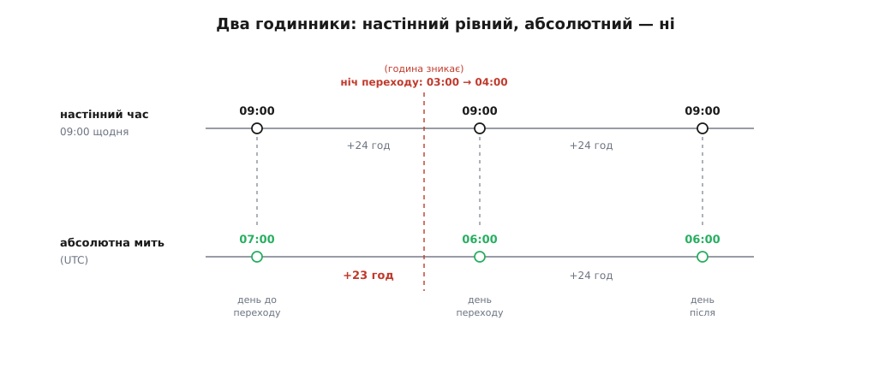
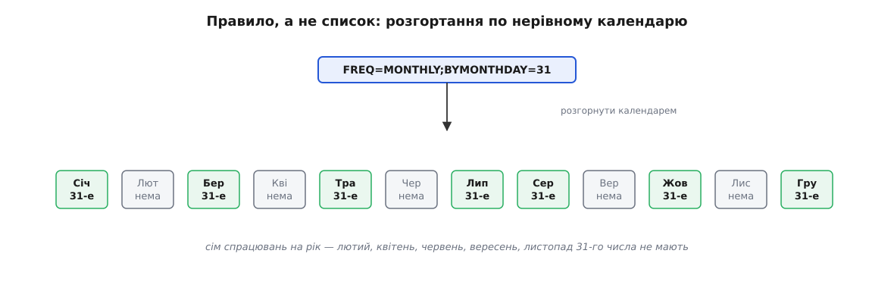
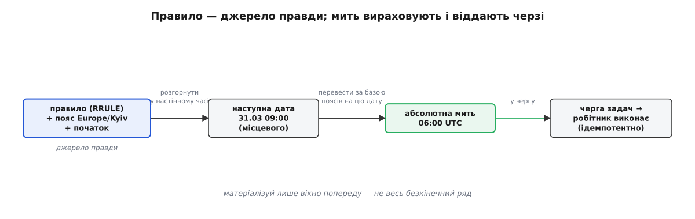

# Рекурентність і календарна математика

<preknowlist>
- [Прикладний час](book:programming/time-and-scheduling) — навіщо сервер тримає час у UTC, що таке часовий пояс і чим «настінний» місцевий час відрізняється від абсолютної миті на осі часу.
- [Черга задач](book:programming/background-jobs) — винести роботу окремому робітнику: кожне спрацювання розкладу зрештою стає задачею, яку хтось виконує.
</preknowlist>

Користувач просить просту річ: «нагадуй мені 31-го числа щомісяця о 9:00». Найочевидніший код тримає наступну дату й щоразу додає до неї інтервал — `наступна = поточна + один місяць`. Він ламається на першому ж кроці. 31 січня плюс місяць — це яке число? 31 лютого не існує. А «9:00» назавтра після весняного переведення годинників стане іншою миттю на осі часу, ніж було сьогодні. Додати сталий інтервал не виходить, бо **інтервалу сталої довжини тут немає**: ні «місяць», ні навіть «доба» не дорівнюють фіксованій кількості секунд.

Причина глибша за конкретний недогляд: **календар — не рівномірна сітка**. Рівномірна лише секунда, це фізична одиниця. А доба, місяць, рік — людські надбудови нерівної довжини: місяці по 28–31 день, високосний рік із зайвим днем, і найпідступніше — місцевий час двічі на рік зсувають на годину заради світлового дня. Рекурентність (лат. *recurrere* — «вертатися, бігти назад») означає повторюваність за правилом; а правило доводиться накладати саме на цю нерівну сітку, яку ми звемо календарем (лат. *calendarium* — «боргова книжка»: у Римі борги гасили в *calendae*, перше число місяця).

## Два годинники

Щоб не заплутатися, розділи дві речі, які побутова мова змішує в одному слові «час».

Перша — **абсолютна мить**: скільки секунд минуло на фізичній осі, байдуже до країни й пори року. Її сервер зберігає в UTC — одне монотонне, однозначне число.

Друга — **настінний час**: те, що показує годинник на стіні, «9:00 у Києві». Це не мить, а опис — пора доби в конкретному поясі за чинними там правилами. Одна й та сама «9:00 у Києві» — це різні абсолютні миті влітку й узимку, бо влітку пояс зсунуто на годину вперед.

Рекурентні правила люди задають у **настінному** часі («щодня о 9:00»), а зберігати й виконувати їх сервер мусить у **абсолютних** митях. Календарна математика — це і є переклад між цими двома, і саме він повний пасток, бо залежить від нерівної сітки й від правил поясу, які самі змінюються.



*Настінний час каже «рівно 24 години й та сама дев'ята», а абсолютна мить «9:00» цього дня настає на годину раніше — доба переходу коротша на годину.*

Візьмімо той самий приклад під час весняного переходу. У зоні Europe/Kyiv узимку діє UTC+2, улітку — UTC+3; перехід стається останньої неділі березня, коли о 03:00 стрілки стрибають на 04:00 і година просто зникає.

**Правило: щодня 09:00, зона Europe/Kyiv**
```
день до переходу   09:00  (UTC+2)  =  07:00 UTC
── ніч переходу: 03:00 → 04:00, годину пропущено ──
день переходу      09:00  (UTC+3)  =  06:00 UTC
```

Настінний крок — рівно 24 години («щодня о 9:00»). А на осі часу сусідні спрацювання розійшлися на **23 години**: абсолютна мить «9:00» цього дня настала на годину раніше. Восени, при зворотному переході, буде навпаки — 25. Ось чому не можна зберегти правило як фіксований відступ від UTC: щойно пора року чи уряд зсуне пояс, збережений відступ поїде, і «9:00» перетвориться на 8:00 чи 10:00.

> 🔧 **Навіщо це.** Зберігай при правилі **ідентифікатор поясу** (`Europe/Kyiv`), а не готовий відступ (`+02:00`). Відступ правильний лише сьогодні; ідентифікатор дає змогу щоразу перерахувати правильний відступ на потрібну дату за [живою базою часових поясів](book:programming/recurrence-scheduling/hist-tzdata.md). Самі правила переходів політичні: їх ухвалюють парламенти, і вони змінюються, тому база — не константа в коді, а окремо оновлюваний довідник.

## Правило, а не список

Тепер про саме повторення. Спокуса — під час створення події порахувати наперед усі дати й скласти в список: 31 січня, 28 лютого, 31 березня… Список здається простим, поки правило не змінять («перенеси на 15-те») або поки не спитають про наступний рік — тоді доведеться перелічувати наново й гнати міграцію по мільйону збережених рядків.

Тому зберігають **не список дат, а правило** й розгортають його в конкретні миті на вимогу. Галузевий стандарт такого правила — рядок RRULE з формату iCalendar (означений у RFC 5545, вересень 2009; усталений факт). Одним рядком він кодує частоту й уточнення: `FREQ=MONTHLY;BYMONTHDAY=31` — «щомісяця 31-го»; `FREQ=MONTHLY;BYDAY=-1FR` — «щоп'ятниці, але лише останньої в місяці». Поля й повну [граматику RRULE](book:programming/recurrence-scheduling/api-rrule.md) варто знати, коли доходиш до розбору рядка; тут важливий сам зсув мислення: правило компактне, переживає зміну (правиш один рядок), і завжди можна спитати «а коли наступні п'ять разів?», не зберігаючи їх заздалегідь.

Розгорнути правило — означає йти календарем період за періодом і для кожного перевіряти, чи справджується уточнення. Саме тут спливають крайові випадки нерівної сітки, на яких [алгоритм розгортання](book:programming/recurrence-scheduling/proj-expander.md) найлегше спіткнутися.

**Правило: щомісяця 31-го, 09:00**
```
Січ 31  → 31.01, є
Лют 31  → 31 лютого немає (28/29 днів) → місяць пропущено
Бер 31  → 31.03, є
Кві 31  → 31 квітня немає (30 днів)    → місяць пропущено
Тра 31  → 31.05, є
```

«31-го щомісяця» дає лише сім спрацювань на рік, а не дванадцять. RFC 5545 велить неіснуючу дату **пропускати**, а не підтягувати до 30-го чи 28-го — бо «підтягнути» кожна система робила б по-своєму, і сенс правила поплив би між реалізаціями. Хочеш «останній день місяця» без пропусків — це вже інше правило, `BYMONTHDAY=-1` (від'ємне число рахує з кінця). Так само 29 лютого як щорічна дата спрацьовує раз на чотири роки, а не щороку: логіка високосів — частина тієї самої [математики календаря](book:programming/recurrence-scheduling/math-calendar.md), де цілочислова арифметика дат через номер дня робить різницю й додавання днів точними.



*Одне компактне правило, розгорнуте по нерівному календарю, само собою лишає прогалини там, де 31-го числа немає.*

## Як це складається докупи

Робочий конвеєр виходить такий. Джерело правди — **правило** плюс **ідентифікатор поясу** й початок відліку. Щоб дізнатися наступне спрацювання, розгортаєш правило в настінному часі поясу, береш першу дату, що справджує уточнення і ще не минула, і аж тоді переводиш її в абсолютну мить за базою поясів на **цю** дату (не за сьогоднішнім відступом). Отриману мить віддаєш [черзі задач](book:programming/background-jobs): коли вона настане, робітник виконає дію.



*Правило з поясом — джерело правди; конкретну мить вираховують на вимогу й лише тоді ставлять у чергу на виконання.*

Дві осторóги роблять конвеєр надійним. Перша: спрацювання мусить бути **ідемпотентним** — та сама мить може дійти до робітника двічі (рестарт, дубль у черзі), тож повторний запуск не повинен слати два листи; ключем [ідемпотентності](book:programming/idempotency) слугує пара «правило + запланована мить». Друга: не матеріалізуй увесь безкінечний ряд наперед. Тримай правило, а конкретні миті вираховуй лише на вікно попереду — найближчі дні чи місяць, рівно стільки, скільки треба календарному показу й планувальнику; решту дорахуєш, коли вікно зсунеться. Коли таких розкладів багато й кожен мусить спрацювати по всьому кластеру рівно раз, це вже задача [розподіленого cron](book:programming/distributed-cron).

Розклад — це правило над кривим календарем, а не рядок дат: тримаєш правило й пояс, розгортаєш на вимогу й переводиш у мить на потрібну дату — і тоді «31-го щомісяця» саме собою пропускає лютий, а «9:00» лишається дев'ятою навіть того тижня, коли доба коротша за 24 години.
