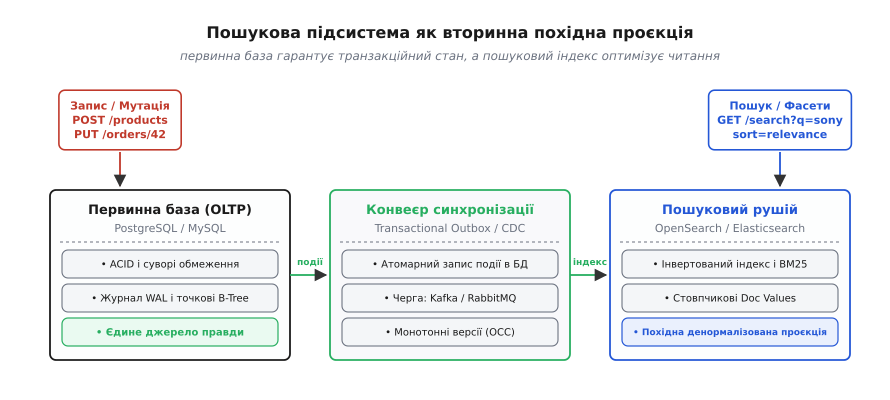
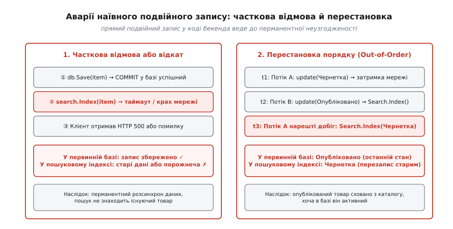
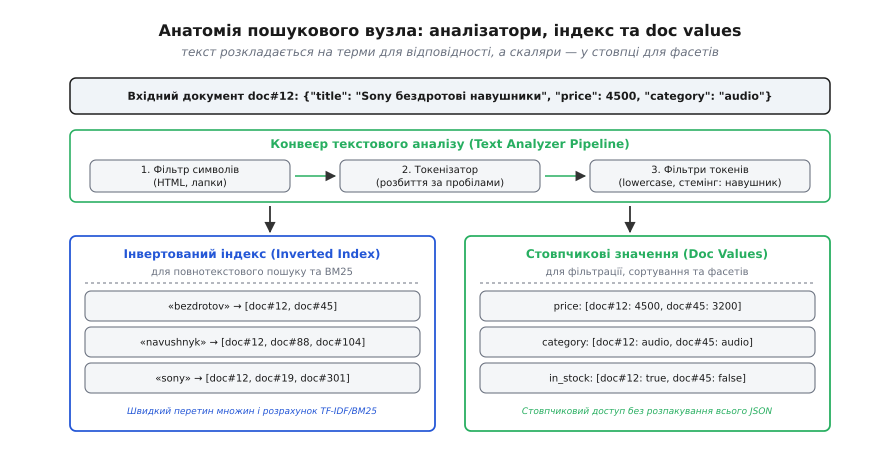
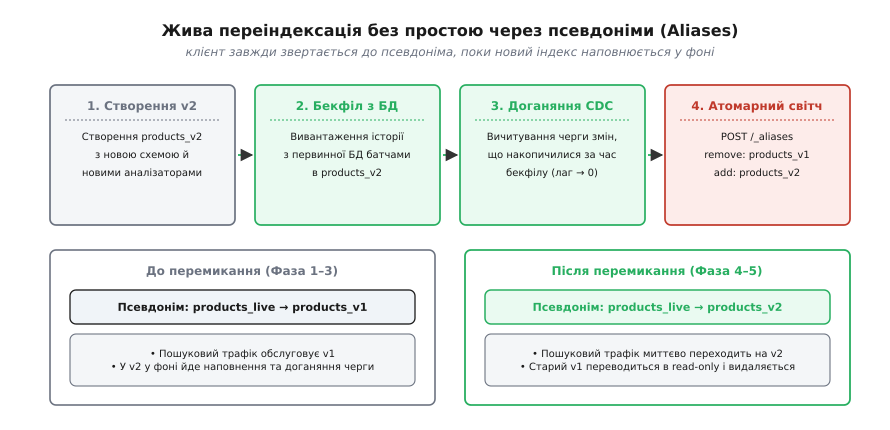

# Пошук як друга правда

<preknowlist>
- [Транзакції та ACID](topic:programming/transactions-acid) — як реляційні бази даних гарантують неподільність, узгодженість та довговічність записів через журнал попереднього запису (WAL) і блокування рядків.
- [Індекси](topic:programming/database-indexes) — деревоподібні структури (B-Tree) для точкового пошуку за ключем і діапазонів, їхня ціна на запис та обмеження для текстових запитів.
- [Інвертований індекс](topic:algorithms/inverted-index) — базова структура збереження термів і списків входжень (posting lists) для швидкого перетину множин слів.
- [Transactional outbox](topic:programming/outbox-pattern) — патерн атомарного збереження бізнес-сутності та події в єдиній транзакції реляційної бази даних.
- [CDC](topic:programming/change-data-capture) — вичитування журналу транзакцій первинної бази для надійної передачі змін без подвійного запису в коді додатку.
</preknowlist>

У каталозі інтернет-магазину чи корпоративної системи документів на 10 мільйонів записів користувач вводить у пошуковий рядок: «бездротові навушники з шумозаглушенням sony». Він очікує побачити товари, відфільтровані за ціною від 3000 до 6000 гривень, із прапорцем наявності на складі, згруповані за категоріями, відсортовані за релевантністю з урахуванням популярності, і щоб система пробачила йому одрук «навушнеки».

Якщо виконати цей запит у первинній реляційній базі даних (PostgreSQL або MySQL), сервер стикається з катастрофічною обчислювальною проблемою. Класичні B-Tree індекси оптимізовані для пошуку за точним збігом або префіксом (`sku = 'WH-1000XM5'` або `created_at >= '2026-01-01'`). Для пошуку слів усередині тексту база змушена або сканувати мільйони рядків таблиці (`WHERE description ILIKE '%навушники%'`), або використовувати повнотекстові індекси на базі GIN чи GiST. Проте реляційні таблиці не мають вбудованого ймовірнісного ранжування релевантності BM25, не здатні ефективно обчислювати десятки динамічних фасетів одночасно й захлинаються від навантаження: дисковий ввід-вивід блокується, буферний пул вимивається (англ. *buffer pool thrashing*), а час відповіді зростає з 10 мілісекунд до десятків секунд.

Щоб система залишалася швидкою, поруч із первинною базою ставлять спеціалізований пошуковий рушій — Elasticsearch, OpenSearch, Typesense, Meilisearch або Tantivy. Але в ту саму мить, коли пошуковий рушій з'являється в інфраструктурі, архітектура системи безповоротно змінюється: у ній виникає **друга правда**.



*Первинна база даних слугує єдиним джерелом істини для транзакцій, а пошуковий рушій виступає денормалізованою вторинною проєкцією, оптимізованою під повнотекстові запити й фасети.*

## Пастка первинної бази даних: чому транзакційне сховище не вміє шукати

Реляційні бази даних створювалися навколо принципів нормалізації (англ. *normalization*) та гарантій ACID. Їхнє головне завдання — надійно записати зміну, не допустити порушення обмежень цілісності (зовнішніх ключів, унікальності) та гарантувати, що зафіксована транзакція ніколи не зникне з диска навіть у разі раптового знеструмлення сервера.

Для цього реляційні рушії використовують B-Tree індекси. B-Tree зберігає ключі у відсортованому порядку й забезпечує пошук за логарифмічний час `O(log N)`. Це ідеально працює для числових ідентифікаторів, дат і коротких кодів. Але текстовий пошук влаштований інакше:

1. **Неефективність підрядкових запитів.** Пошук `LIKE '%навушники%'` не може використати B-Tree, тому що корінь дерева вимагає знання початку рядка. Рушій змушений виконувати послідовне сканування (англ. *sequential scan*) кожного рядка таблиці на диску.
2. **Відсутність морфології та толерантності до помилок.** Реляційне порівняння рядків є двійковим або посимвольним. Воно не знає, що слова «навушник», «навушники», «навушниками» — це граматичні форми однієї лексеми, і не вміє рахувати відстань Левенштейна (англ. *Levenshtein edit distance*) для виправлення одруків без повного перебору.
3. **Проблема розрахунку релевантності.** Реляційна алгебра бінарна: рядок або відповідає предикату `WHERE`, або ні. Вона не ранжує результати за тим, наскільки рідкісним є слово в загальному корпусі документів (англ. *Inverse Document Frequency*, IDF) і скільки разів воно зустрілося в конкретному описі товару (англ. *Term Frequency*, TF).
4. **Важкі фасетні агрегації.** Щоб показати користувачеві блок фільтрів («Категорія: Аудіо (1240), Виробник: Sony (310), Apple (140)»), реляційна база повинна виконати дорогі групування `GROUP BY` по кількох незв'язаних стовпцях над відфільтрованою вибіркою, що вимагає багаторазового читання тих самих сторінок пам'яті.

Вбудовані повнотекстові можливості сучасних реляційних баз (наприклад, тип `tsvector` та індекси GIN у PostgreSQL) частково вирішують проблему пошуку за окремими словами, проте створюють нові проблеми під час масштабування. GIN-індекс у PostgreSQL сильно сповільнює операції `INSERT` та `UPDATE`, оскільки зміна одного рядка вимагає модифікації сотень записів у дереві індексу. Крім того, оновлення індексу створює високе навантаження на журнал WAL, роздуває таблиці (англ. *table bloat*) і призводить до конкуренції за блокування рядків між користувачами, які оформлюють замовлення, та користувачами, які переглядають каталог.

Висновок стає очевидним: змішувати транзакційне навантаження запису (OLTP) та пошуково-аналітичне читання в одному дисковому рушії на великих масштабах неможливо.

## Пошук як друга правда: природа денормалізованої проєкції

Коли пошук виноситься в окрему систему (кластер Elasticsearch або OpenSearch), архітектура застосунку переходить до моделі розділення відповідальності на команди та запити (англ. *Command Query Responsibility Segregation*, CQRS):

```
┌─────────────────────────────────────────────────────────────┐
│  Первинна база (System of Record / OLTP)                    │
│  - Єдине джерело істини (Single Source of Truth)            │
│  - Сувора нормалізація, зовнішні ключі                      │
│  - Гарантії ACID, синхронний журнал WAL                     │
└─────────────────────────────────────────────────────────────┘
                              │
                    (Асинхронний конвеєр)
                              ▼
┌─────────────────────────────────────────────────────────────┐
│  Пошуковий рушій (Read-Optimized Projection)               │
│  - Вторинна правда (похідні дані)                           │
│  - Повна денормалізація (усі поля в одному JSON-документі)  │
│  - Незмінні сегменти Lucene, інвертовані списки             │
│  - Стовпчикові Doc Values для швидких фасетів               │
└─────────────────────────────────────────────────────────────┘
```

Пошуковий індекс не є самостійним сховищем даних. Він є **похідною проєкцією** первинної бази. Якщо пошуковий кластер згорить або втратить усі диски, бізнес не втратить жодної копійки грошей і жодного замовлення: стан системи повністю відновлюється перечитуванням первинної реляційної бази.

Ця похідна природа визначає внутрішню будову пошукового рушія. На відміну від реляційних баз, які оптимізовані під точкові зміни рядків на місці, ядро Lucene (на якому побудовані Solr, Elasticsearch та OpenSearch) використовує модель незмінних сегментів (англ. *immutable segments*).

### Структура зберігання: інвертований індекс та Doc Values

Кожен документ у пошуковому індексі зберігається у двох взаємодоповнюючих форматах:

1. **Інвертований індекс (Inverted Index):** Відображає кожне нормалізоване слово (терм) на впорядкований список ідентифікаторів документів, де це слово зустрічається (англ. *posting list*). Наприклад, терм `sony` посилається на масив `[12, 19, 45, 102]`, а терм `навушник` — на масив `[12, 45, 88]`. Щоб знайти товари за запитом «sony навушники», рушію достатньо виконати швидкий перетин двох відсортованих списків чисел.
2. **Стовпчикові значення документів (Doc Values):** Для операцій сортування, діапазонних фільтрів та обчислення фасетів інвертований індекс неефективний. Тому скалярні поля (ціна, категорія, залишок, дата) зберігаються у стовпчиковому форматі (англ. *columnar storage*). Замість розпакування всього JSON-документа для мільйона знайдених товарів рушій читає послідовний масив чисел із диска просто в кеш операційної системи.

### Чому оновлень на місці не існує

У пошуковому індексі не існує операції `UPDATE` у звичному реляційному розумінні. Оскільки сегменти Lucene є незмінними файлами, оновлення поля в документі відбувається за три етапи:
- Рушій знаходить існуючий документ і позначає його номер у спеціальній бітовій масці видалень (англ. *deletion bitset* / soft delete).
- Нова версія документа записується як абсолютно новий запис у новий відкритий сегмент.
- Під час фонового злиття сегментів (англ. *segment merge compaction*) старі сегменти переписуються, а позначені видаленими документи фізично видаляються з диска.

Ця архітектура забезпечує феноменальну швидкість пошукових запитів, але створює значний коефіцієнт посилення запису (англ. *write amplification*): часті точкові оновлення мільйонів документів навантажують підсистему вводу-виводу фоновими злиттями. Як розвивалися відкриті пошукові рушії від початкових ідей до сучасних систем, детально розібрано в історичному нарисі: [як виникла сучасна парадигма відкритих інвертованих індексів від Doug Cutting до Lucene та Elasticsearch](topic:programming/search-subsystem/hist-lucene-revolution.md).

## Небезпека наївного подвійного запису

Коли розробник уперше підключає пошуковий рушій до бекенда, найпростішим рішенням здається прямий подвійний запис у коді контролера:

```
// НАЇВНИЙ ПІДХІД: прямий подвійний запис
async function updateProduct(productId, data) {
    // Крок 1: Збереження в первинну базу даних
    await db.products.update(productId, data);
    
    // Крок 2: Відправка в пошуковий індекс
    await searchClient.index({
        index: 'products',
        id: productId,
        body: data
    });
}
```

У локальному середовищі розробки цей код працює бездоганно. Але у виробничому середовищі під навантаженням він гарантовано призводить до трьох класичних аварійних станів.



*Прямий подвійний запис із коду бекенда неминуче призводить до розсинхронізації: часткові відмови залишають пошук без даних, а мережеві затримки переставляють порядок оновлень.*

### 1. Часткова відмова (Partial Failure)
Крок 1 успішно фіксує транзакцію в PostgreSQL. Але на Кроці 2 мережевий запит до кластера Elasticsearch падає через таймаут або перезавантаження вузла. Клієнт отримує помилку HTTP 500, але товар у реляційній базі вже змінено. Пошуковий індекс залишається зі старими даними. Виникає перманентна розсинхронізація (англ. *data drift*), яку неможливо виявити без повного сканування обох сховищ.

### 2. Аномалія відкату транзакції (Rollback Inconsistency)
Якщо змінити порядок викликів і спочатку відправити документ у пошук, а потім виконувати збереження в базі:

```
await searchClient.index(...);
await db.products.update(...); // ВПАЛО через порушення обмеження CHECK або дедлок
```

Транзакція в базі відкочується, але пошуковий індекс уже зберіг новий документ. Тепер пошук видає користувачам товар, якого юридично й фізично не існує в системі.

### 3. Перегони та перестановка порядку оновлень (Out-of-Order Race)
Найпідступніша проблема виникає через паралелізм:

```
Потік A (t1): Користувач переводить товар у статус "Чернетка" (Draft)
Потік B (t2): Менеджер через 5 мс повертає товар у статус "Опубліковано" (Published)
```

Потік A успішно оновлює базу в момент `t1`. Потік B оновлює базу в момент `t2`. Але через мережеву затримку пакет оновлення від Потоку B добігає до пошукового рушія першим (записує "Published"), а за ним через 50 мілісекунд прибуває запізнілий пакет від Потоку A (записує "Draft"). 

Результат: у первинній базі товар активний ("Published"), а в пошуковому індексі назавжди застряг у стані "Чернетка", тому користувачі більше ніколи не знайдуть його в каталозі.

## Надійні конвеєри синхронізації: Outbox, CDC та монотонні версії

Щоб гарантувати 100% доставку змін із первинної бази до пошукового індексу без втрат і без гонок, у бекенд-архітектурі використовують спеціальні асинхронні конвеєри.

### Механізм 1: Transactional Outbox
У реляційній базі створюється таблиця `outbox_events`. Коли бізнес-логіка змінює товар, вона в межах **тієї самої ACID-транзакції** додає запис у таблицю вихідних подій:

```
BEGIN;
UPDATE products SET price = 14999.0, version = version + 1 WHERE id = 42;
INSERT INTO outbox_events (aggregate_id, event_type, payload, version, processed)
VALUES (42, 'PRODUCT_UPDATED', '{"title":"Sony XM5", "price": 14999.0}', 15, FALSE);
COMMIT;
```

Оскільки запис у таблицю `products` та запис у `outbox_events` відбуваються в одній транзакції, неможлива ситуація, коли товар оновився, а подія не створилася (або навпаки). Окремий фоновий процес (англ. *Outbox Relay*) вичитує невідправлені події за допомогою блокування `SELECT ... FOR UPDATE SKIP LOCKED`, пакує їх у батчі та відправляє в пошуковий індекс, позначаючи як оброблені лише після підтвердження від кластера.

### Механізм 2: Change Data Capture (CDC)
У високонавантажених системах, де зайвий `INSERT` у таблицю Outbox створює завелике навантаження на диск, застосовують захоплення змін даних (CDC). 

Спеціальний демон (наприклад, Debezium) підключається до слота логічної реплікації PostgreSQL і напряму читає бінарний журнал транзакцій (WAL). Кожна зафіксована зміна рядка автоматично перетворюється на подію в черзі Apache Kafka. Цей підхід дає нульовий оверхед на бізнес-транзакції, але вимагає підтримки окремого брокера повідомлень і конвеєрів трансформації даних.

### Механізм 3: Оптимістичний контроль монотонних версій
Ані Outbox, ані черги повідомлень самі по собі не рятують від проблеми перестановки повідомлень, якщо обробка подій ведеться в кілька паралельних потоків.

Для захисту від гонок кожне оновлення сутності в первинній базі зобов'язане збільшувати монотонний лічильник `version` (або використовувати системний номер послідовності транзакцій LSN / монотонний timestamp).

Під час відправки документа в пошуковий рушій передається параметр `version_type=external_gte` (або `external`):

```
PUT /products/_doc/42?version=15&version_type=external_gte
{
  "title": "Sony WH-1000XM5",
  "price": 14999.0
}
```

Пошуковий рушій звіряє вхідну версію з версією, збереженою всередині сегмента для цього `_id`:
- Якщо вхідна версія `15 >= 14` (поточна в індексі) — документ записується, а версія оновлюється до 15.
- Якщо через затримку мережі приходить запізнілий пакет із версією `13`, рушій відхиляє запис із помилкою HTTP 409 Conflict (`VersionConflictEngineException`).

Цей механізм перетворює пошукову підсистему на строго ідемпотентний приймач: повторні відправки чи перестановки подій у черзі більше ніколи не можуть пошкодити стан даних. Повний робочий код такого конвеєра з вибіркою, дедуплікацією та обробкою помилок наведено у вставці-проєкті: [практична реалізація надійного конвеєра синхронізації з Transactional Outbox, контролем монотонних версій та ротацією аліасів](topic:programming/search-subsystem/proj-search-sync-pipeline.md).

## Кінцева узгодженість і проблема свіжості (Read-Your-Own-Writes)

Оскільки синхронізація між первинною базою та пошуковим індексом є асинхронною, пошукова підсистема живе за законами **кінцевої узгодженості** (англ. *eventual consistency*). Між моментом, коли транзакція зафіксувалася в PostgreSQL, і моментом, коли новий стан з'явиться у видачі пошуку, завжди існує часовий лаг — зазвичай від 50 мілісекунд до 1–2 секунд.

Крім затримки передачі черги, у самому пошуковому рушії діє модель майже реального часу (англ. *Near-Real-Time*, NRT).

```
[ Документ ] ──> [ IndexWriter пам'ять ]
                       │
                       │ (Операція refresh: кожні 1 с)
                       ▼
                 [ Новий In-Memory Сегмент ] ──> Доступний для ПОШУКУ
                       │
                       │ (Операція flush / fsync: кожні 30 с)
                       ▼
                 [ Сегмент на ФІЗИЧНОМУ Диску ]
```

Коли документ надходить до Elasticsearch, він потрапляє в буфер оперативної пам'яті. Щоб документ став видимим для пошукових запитів, має відбутися операція **`refresh`**, яка створює новий сегмент у пам'яті. За замовчуванням `refresh` виконується автоматично один раз на секунду.

Це породжує класичну проблему взаємодії з користувачем — **«прочитай власний запис»** (англ. *Read-Your-Own-Writes dilemma*):
1. Користувач редагує назву свого оголошення або ціну товару й натискає «Зберегти».
2. Бекенд зберігає зміну в PostgreSQL і миттєво повертає клієнту відповідь HTTP 200 OK.
3. Браузер робить редирект на сторінку каталогу або списку товарів.
4. Сторінка каталогу формується пошуковим рушієм, де оновлення ще не пройшло фазу `refresh`.
5. Користувач бачить старі дані й думає, що система зламалася, натискаючи кнопку збереження повторно.

### Інженерні стратегії вирішення проблеми свіжості

Існує три перевірених підходи до подолання лагу кінцевої узгодженості:

- **Гідратація за первинним ключем (ID-Only Search + Hydration):** Пошуковий індекс використовується виключно для отримання списку ідентифікаторів (`SELECT id WHERE ... LIMIT 20`), а повні об'єкти вичитуються з первинної бази або швидкого key-value кешу (Redis) за один пакетний запит `WHERE id IN (...)`. Якщо користувач відкриває сторінку конкретного товару, запит завжди йде напряму в первинну базу.
- **Оптимістичне злиття на клієнті (Optimistic UI Overlay):** Клієнтський додаток зберігає щойно відправлені мутації в локальному стані (Redux, Pinia) і тимчасово накладає їх поверх результатів пошукової видачі, доки не мине гарантований інтервал синхронізації.
- **Цільове очікування індексації (`refresh=wait_for`):** Для поодиноких інтерактивних дій бекенд може викликати операцію індексації з прапорцем `?refresh=wait_for`. Пошуковий рушій затримує HTTP-відповідь до моменту, поки наступний плановий `refresh` не зробить документ видимим. Це збільшує час відповіді мутації на кількасот мілісекунд, але гарантує, що наступний запит пошуку від цього користувача гарантовано побачить зміни.

## Анатомія пошукового запиту: аналізатори, скоринг та фільтри

Щоб пошуковий рушій міг знаходити документи за неточними збігами, текст під час індексації та під час пошуку проходить крізь конвеєр текстового аналізу (англ. *Text Analyzer*).



*Конвеєр текстового аналізу розбиває вхідний документ на нормалізовані терми для інвертованого індексу, а скалярні поля зберігає у стовпчиковому форматі Doc Values для швидких сортувань і фасетів.*

Аналізатор складається з трьох послідовних стадій:

1. **Фільтри символів (Char Filters):** Очищають сирий текст від HTML-тегів (`<p>`, `&amp;`), нормалізують лапки та замінюють специфічні символи.
2. **Токенізатор (Tokenizer):** Розбиває суцільний потік символів на окремі токени за пробілами, дефісами та розділовими знаками.
3. **Фільтри токенів (Token Filters):** Перетворюють слова на базову форму. Фільтр `lowercase` приводить літери до нижнього регістру; фільтр `stop` викидає службові прийменники («і», «в», «на»); стемер (наприклад, Hunspell або Porter Stemmer) відкидає закінчення («навушниками» → «навушник»); фільтр синонімів додає альтернативні назви («тв» → «телевізор»).

### Контекст фільтра (Filter Context) проти Контексту запиту (Query Context)

У пошуковому запиті принципово важливо розділяти умови на два типи:

- **Контекст фільтра (`filter`, `must_not`):** Відповідає на бінарне питання: «Чи належить документ цій множині?». Результатом є булеве значення (так/ні). Оцінка релевантності (score) не обчислюється. Пошуковий рушій будує компактні бітові маски (Roaring Bitmaps) і кешує їх в оперативній пам'яті вузла. Фільтрація за категорією, наявністю та діапазоном цін завжди повинна розміщуватися в блоці `filter`.
- **Контекст запиту (`must`, `should`):** Відповідає на питання: «Наскільки добре документ відповідає пошуковому запиту?». Для кожного знайденого документа обчислюється числова оцінка релевантності за алгоритмом Okapi BM25.

Формула BM25 враховує насичення частоти терму в документі (TF) та рідкісність терму в усьому корпусі (IDF):

```
             (k₁ + 1) · TF
Score = IDF · ─────────────────────────
             TF + k₁ · (1 - b + b · (|D| / avgdl))
```

де `|D|` — довжина поточного документа, `avgdl` — середня довжина документів в індексі, а `k₁` і `b` — константи калібрування насичення (зазвичай `k₁ ≈ 1.2`, `b ≈ 0.75`). Завдяки цьому рідкісне слово «sony» дає більшу вагу, ніж часте слово «навушники», а повторення слова десять разів поспіль не піднімає спам-документ на перше місце.

### Семантичний і гібридний пошук (Dense Vectors та RRF)

Сучасні пошукові підсистеми все частіше доповнюють лексичний BM25 векторним пошуком за змістом (англ. *semantic search*).

Текст документа перетворюється нейромережевою моделлю на вектор чисел фіксованої розмірності (наприклад, 768 або 1536 float-значень). Пошуковий рушій будує спеціальний навігаційний граф (HNSW — *Hierarchical Navigable Small World*), який знаходить найближчі вектори за косинусною подібністю.

Це розширює роль конвеєра синхронізації: під час обробки події з Outbox воркер або окремий GPU-сервіс обчислює векторний ембеддінг перед записом документа в індекс. На етапі пошуку лексичний результат BM25 та векторний результат HNSW об'єднуються за алгоритмом Reciprocal Rank Fusion (RRF), що дає точність конкретних артикулів поруч із розумінням абстрактних запитів на кшталт «подарунок меломану для подорожей».

## Еволюція схем і переіндексація без простою (Zero-Downtime Reindexing)

У реляційній базі даних додавання або зміна стовпця зазвичай виконується командою `ALTER TABLE`. У пошуковому індексі змінити спосіб аналізу тексту (наприклад, підключити новий словник синонімів чи змінити токенізатор для поля) для вже збережених даних неможливо: інвертовані списки вже побудовані й зафіксовані в незмінних сегментах на диску.

Будь-яка зміна налаштувань мапінгу вимагає повної переіндексації (англ. *reindexing*). Щоб виконати цю операцію на працюючому сервісі без зупинки пошуку, застосовують патерн **індексних псевдонімів** (англ. *Index Aliases*).



*Клієнтський шар адресує запити виключно через псевдонім, поки новий індекс наповнюється історичним знімком і доганяє чергу дельти з Transactional Outbox.*

Протокол живої міграції складається з п'яти послідовних кроків:

1. **Створення нового цільового індексу:** Створюється фізичний індекс `products_v2` з оновленою схемою, оптимізованими типами полів і новими аналізаторами.
2. **Фіксація точки послідовності:** Конвеєр запам'ятовує поточний максимальний номер події `snapshot_seq` у таблиці Outbox (або номер позиції LSN у журналі WAL).
3. **Пакетний бекфіл (Bulk Backfill):** Історичні дані вивантажуються з первинної бази порціями по 5000 рядків і записуються в `products_v2`. Під час бекфілу вимикають реплікацію та `refresh_interval` для максимальної швидкості запису.
4. **Доганяння черги дельти (Catch-up phase):** Конвеєр зчитує всі події з таблиці Outbox, де `seq_id > snapshot_seq`, і застосовує їх до `products_v2`. Завдяки контролю версій `version_type=external_gte` стан документів у новому індексі наздоганяє поточний стан бази даних.
5. **Атомарне перемикання псевдоніма:** Однією командою до кластера псевдонім `products_live` відв'язується від `products_v1` і прив'язується до `products_v2`:

```
POST /_aliases
{
  "actions": [
    { "remove": { "index": "products_v1", "alias": "products_live" } },
    { "add":    { "index": "products_v2", "alias": "products_live" } }
  ]
}
```

Усі користувацькі пошукові запити миттєво починають обслуговуватися новим індексом без жодної секунди простою сервісу.

## Експлуатація та архітектурні пастки

Під час експлуатації пошукової підсистеми у виробничому середовищі інженери стикаються з чотирма критичними системними пастками.

### 1. Катастрофа глибокої пагінації (Deep Pagination)
Якщо користувач або пошуковий робот робить запит виду `GET /search?from=100000&size=20`, пошуковий кластер стикається з квадратичним зростанням навантаження. 

Якщо індекс розбитий на 5 шардингів, кожен шардинг повинен самостійно знайти, відсортувати й повернути координаційному вузлу 100 020 документів. Координаційний вузол зливає 500 100 документів у купу оперативної пам'яті, виконує глобальне сортування, відбирає 20 документів і викидає решту 500 080. Це призводить до вичерпання пам'яті JVM Heap, тривалих пауз збирача сміття та падіння вузлів кластера.

**Виробниче рішення:** Заборона глибокого зміщення через налаштування `index.max_result_window` (типово не більше 10 000). Для перегляду довгих списків та експорту даних застосовують курсорну пагінацію на базі `search_after` (Point-in-Time API), де кожен наступний запит спирається на значення сортування та `_id` останнього документа попередньої сторінки.

### 2. Споживання пам'яті глобальними ординалами (Global Ordinals)
Фасетний пошук за полями з високою кардинальністю (наприклад, унікальні артикули, назви вулиць чи ID користувачів) вимагає побудови структур Global Ordinals для мапінгу рядкових значень на цілі числа. При першому запиті після операції `refresh` побудова цих масивів може викликати сплеск латентності на кілька секунд і спожити гігабайти пам'яті в купі Java.

**Виробниче рішення:** Не будувати фасети за текстовими полями без крайньої потреби; обмежувати список полів для агрегацій і використовувати `eager_global_ordinals: true` лише на критичних полях, щоб структура прогрівалася у фоні під час `refresh`, а не під час запиту користувача.

### 3. Авторизація та мультиарендність (Multi-Tenancy)
У SaaS-системах пошук повинен повертати лише ті документи, до яких користувач має доступ (у межах своєї організації чи списку прав ACL).

Існує дві стратегії реалізації ізоляції:
- **Шардинг за клієнтом (Routing by Tenant):** Запити індексації та пошуку містять ключ маршрутизації `?routing=tenant_123`. Усі документи організації потрапляють на один шардинг, що виключає опитування всього кластера.
- **Фільтрація прав на рівні індексу:** Документ містить масив дозволених ідентифікаторів `{"acl_read": ["tenant_123", "group_managers", "user_42"]}`. Кожен користувацький запит примусово доповнюється фільтром `filter: { terms: { acl_read: user_roles } }` на рівні API-шлюзу.

### 4. Топологія кластера, ролі вузлів та захист від Split-Brain
У розподіленому пошуковому кластері вузли мають чітке розділення ролей:
- **Головні вузли (Master-eligible nodes):** Керують метаданими, розподілом шардингів і створенням індексів. Кількість цих вузлів обов'язково повинна бути непарною (3 або 5), а кворум для прийняття рішень налаштовується як `(N / 2) + 1`. Це унеможливлює розщеплення мозку (англ. *split-brain*), коли дві ізольовані частини кластера починають обирати двох різних лідерів і роздвоювати стан індексів.
- **Вузли даних (Data nodes):** Зберігають сегменти на SSD-накопичувачах, виконують дисковий ввід-вивід і обчислюють ранжування.
- **Координаційні вузли (Coordinating nodes):** Приймають вхідні HTTP-запити від бекенда, розсилають підзапити на вузли даних, збирають проміжні результати та агрегують фінальний JSON.

## Архітектурний синтез

Пошукова підсистема ніколи не замінює первинну базу даних, так само як реляційна база не здатна замінити інвертований індекс. Спроба об'єднати обидві ролі в одному вузлі неминуче призводить або до втрати транзакційної надійності, або до деградації швидкості пошуку.

Визнання пошуку «другою правдою» вимагає від архітектора чіткого системного контракту:
- Первинна база даних залишається непорушним джерелом істини, що контролює стан і транзакційні бізнес-правила.
- Пошуковий рушій є денормалізованою вторинною проєкцією, яка жертвує миттєвою узгодженістю заради мілісекундного ранжування та фасетного аналізу.
- Асинхронний конвеєр на базі Transactional Outbox, контролю монотонних версій та індексних псевдонімів перетворює кінцеву узгодженість на передбачувану, керовану та надійну інженерну характеристику вебсервісу.
