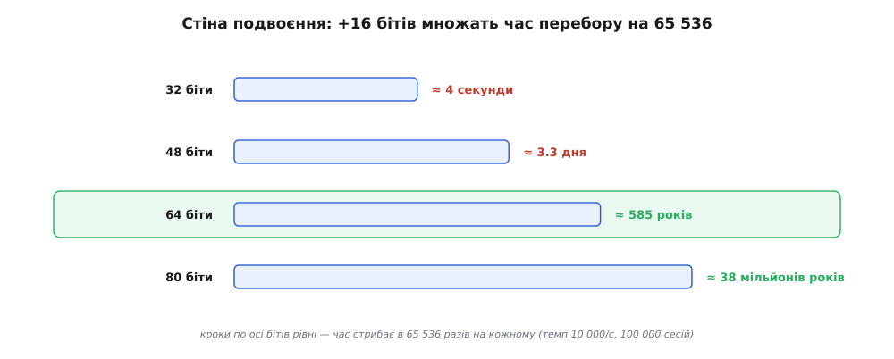

# 🧮 Математика невгадного номера: ентропія, вгадування, колізії

Уся робота номера сесії — бути таким, щоб його **не** можна було ні вгадати, ні відтворити випадково. Практика зводить це до двох чисел, які на слух звучать однаково — «128 біт довжини» і «64 біти ентропії», — ніби йдеться про той самий розмір, лише названий двічі. Насправді за ними ховаються **два різні питання**, і плутати їх — типова помилка, що коштує безпеки.

Гірше того, випадковий номер може провалитися **двома незалежними способами**, і кожним керує своя математика. Перший спосіб: хтось **угадає** чинний номер, наосліп перебираючи значення. Другий, підступніший: сервер сам, без жодного нападника, **видасть двом людям однаковий номер** — випадковий збіг двох незалежних тягнень. Перше — атака, друге — прикра випадковість; перше меряють одним числом, друге — зовсім іншим. Зберемо обидва від першопричини, бо тільки так стане видно, звідки беруться оті «128» і «64» і чому вони саме такі.

## Скільки важить один випадковий біт

Почнімо з питання, від якого залежить усе: **скільки невизначеності несе випадкове число?** Міра тут одна — **ентропія** (гр. *entropía* — «поворот, перетворення»), а точніше, її найпростіший різновид: кількість справді непередбачних бітів. Означення можна дати на пальцях. Один чесний підкидок монети — це один біт: два однаково ймовірні наслідки, і жодного способу знати наперед. Два підкидки — чотири рівноймовірні наслідки, два біти. Загалом **b бітів ентропії означає рівно 2^b однаково ймовірних значень**, серед яких заховане справжнє, і жодне з них не ймовірніше за інше.

```
1 біт   = 2  рівноймовірні значення   (монета)
8 бітів = 2⁸ = 256 значень            (один випадковий байт)
b бітів = 2^b значень
```

Чому саме логарифм, чому «біти», а не просто «кількість значень»? Бо злом іде **перебором**, а перебір відчуває не саме число значень, а скільки разів його треба **подвоїти**. Додати один біт — подвоїти простір, тобто подвоїти працю нападника. Ентропія меряє злом у тих одиницях, у яких він насправді дорожчає: кожен зайвий біт — це ще одне подвоєння зусиль. Саме тому безпеку номерів рахують у бітах, а не в «мільярдах варіантів»: біти складаються там, де варіанти множаться.

Ключове слово в означенні — **однаково ймовірні**. Ентропія сягає своїх повних b бітів лише тоді, коли всі 2^b значень рівноправні; щойно якесь значення стає ймовірнішим за інше — через зсув джерела, через передбачувану структуру, через слабкий генератор, — реальна ентропія падає **нижче** b, і саме на цю нерівність накидається нападник. «64 біти ентропії» — це обіцянка, що ярлика немає: жодне значення не виграшніше за сусіднє, і єдиний шлях — тупий перебір усіх. Це окремий, найпростіший випадок загальнішої [інформаційної ентропії Шеннона](book:math/information-entropy): та досягає максимуму рівно на рівномірному розподілі, а будь-яка передбачуваність її зменшує — тут нас цікавить саме цей максимум і те, наскільки від нього відступають.

І ще одне, без чого вся розмова марна: біти ентропії реальні лише тоді, коли число народжене **криптографічним генератором** — [CSPRNG](book:algorithms/csprng). Звичайний `Math.random()` видає значення, що *виглядають* рівноймовірними, але породжуються передбачуваним правилом; побачивши кілька, наступні обчислюють. Формально в такому виході може бути «64 біти», а фактична ентропія для того, хто розгадав правило, — майже нуль. Тож усюди далі, коли кажемо «b бітів ентропії», мовчазно припускаємо криптографічне джерело; без нього числа з цієї статті просто не про той генератор.

## Довжина — це ще не ентропія

Тепер розчепимо дві речі, які зливають в одну. **Довжина** — це скільки символів чи бітів займає номер, коли його записати. **Ентропія** — це скільки з них справді непередбачні. Вони розходяться, і то в обидва боки.

Перший бік — **кодування**. Номер народжується як набір випадкових байтів, але в cookie його треба покласти текстом, тож байти перекодовують у символи. Різні кодування пакують різну кількість бітів у символ. Шістнадцяткове (hex) має 16 символів-цифр (0–9, a–f) — це рівно 2⁴, тобто **4 біти на символ**. Base64 має 64 символи — 2⁶, тобто **6 бітів на символ**. Звідси проста арифметика: той самий 128-бітний випадок займе різну кількість символів залежно від кодування, але ентропія в ньому — та сама.

```
128 біт ентропії = 16 випадкових байтів
   → hex:     16 · 2  = 32 символи
   → base64:  ⌈16/3⌉·4 = 24 символи (22 значущі + доповнення)
   → сирі:    16 байтів
```

Три різні довжини — 32, 24, 16 — і **однакова** ентропія 128 бітів, бо це той самий випадковий випадок, лише записаний трьома абетками. Рахувати символи, щоб оцінити стійкість, — усе одно що міряти вагу в сантиметрах: величина не та.

Другий бік розходження ще підступніший: **довгий рядок може нести майже нуль ентропії**. Уявімо номер, зліплений «розумно»: `sess_user_10427_20260718_prod`. Двадцять дев'ять символів — на позір солідно. Але з чого вони? Стала префікса, ідентифікатор користувача (лічильник, вгадується перебором сотень значень), сьогоднішня дата (кілька тисяч варіантів на рік), назва середовища (жменя варіантів). Справжньої випадковості тут — може, десяток бітів, і весь «довгий» номер нападник відтворює на серветці. Довжина набрехала: символів багато, ентропії катма.


*Один і той самий випадок у трьох кодуваннях займає 16, 24 чи 32 символи — а ентропія скрізь та сама, 128 бітів: кодування переставляє біти в символи за сталим курсом і не додає ні краплі непередбачності. Знизу — зворотний бік: довгий, але складений із передбачуваних частин номер несе жменю справжніх бітів. Стійкість живе в ентропії, не в довжині.*

> 🔧 **Навіщо це.** Коли оцінюєш чужий номер сесії, не рахуй символи — питай, **скільки бітів прийшло з CSPRNG**. Сорокасимвольний ідентифікатор, зліплений із мітки часу, лічильника й хеша, — довгий і слабкий; двадцятидвосимвольний base64 із криптоджерела — короткий і надійний. Око, навчене бачити ентропію крізь довжину, ловить діру там, де полічений «розмір» заспокоює.

## Дві OWASP-цифри: 128 довжини, 64 ентропії

Тепер зрозуміло, чому [OWASP](book:programming/web-vulnerability-classes) називає **два** числа, а не одне. Рекомендація дослівно просить дві різні речі: видавати номер розміром **щонайменше 128 бітів** із криптографічного генератора — і покладатися щонайменше на **64 біти ентропії** проти вгадування. Перше — про **довжину тягнення** (скільки бітів ти витягнув із генератора), друге — про **дієву ентропію** (на скільки з них безпечно розраховувати).

Звідки взявся розрив рівно вдвічі — 128 витягнув, 64 полічив? Це навмисний **запас на недосконалість генератора**. У теорії 128 бітів із бездоганного CSPRNG дають майже 128 бітів ентропії. Але на практиці генератори «протікають»: внутрішній стан PRNG буває меншим за його вихід; у номер підмішують передбачувані поля; джерело буває трохи зсунуте. Не завжди можна бути певним, що **кожен** виданий біт — повний незалежний біт непередбачності. Тож правило просить видати **удвічі більше**, ніж потрібно, — щоб навіть дещо кульгавий генератор усе одно переступив 64-бітний поріг. «Половина довжини» — це не формула ентропії, а страховий коефіцієнт: емітуй 128, розраховуй на 64, спи спокійно.

А сам поріг у 64 біти звідки? З математики вгадування, до якої й переходимо, — це та точка, за якою наосліп угадати номер стає безнадійно навіть для цілого флоту нападників.

## Ймовірність угадати номер

Побудуймо стійкість до вгадування з нуля. Нападник не знає номера, тож єдине, що йому лишається, — **називати значення й перевіряти**, чи відмикає. Один-єдиний постріл у 64-бітний простір влучає в конкретний чинний номер із імовірністю

```
1 / 2⁶⁴  =  1 / 18 446 744 073 709 551 616  ≈  5.4 · 10⁻²⁰
```

— тобто практично нуль. Але наївно вважати, ніби нападник цілиться в **один** номер і стріляє **раз**. Йому допомагають дві речі, і обидві треба врахувати чесно.

Перша: чинних сесій водночас живе **багато**. Якщо на сервері зараз S відкритих сесій, то нападникові байдуже, у яку саме влучити, — підходить **будь-яка** з S. Це множить його шанс на постріл у S разів: мішень не одна цятка, а S цяток, розсипаних по простору. Друга: він стріляє **швидко** — A спроб за секунду. Складімо це в імовірність успіху одного пострілу:

```
p = S / 2^b        (S чинних цілей серед 2^b можливих значень)
```

Скільки пострілів до першого влучання? Тут працює проста й точна логіка **незалежних спроб**: якщо кожна вдається з імовірністю p незалежно від інших, то в середньому до першого успіху їх треба 1/p (це сподіване число спроб геометричного розподілу — інтуїтивно: рідкісну подію з шансом один на мільйон чекаєш у середньому мільйон разів). Значить, сподіване число пострілів до першого влучання — 2^b/S, а поділивши на темп A пострілів за секунду, дістаємо **час марного перебору**:

```
T  =  2^b / (A · S)
```

Це головна формула стійкості до вгадування. (OWASP записує її з двійкою в знаменнику, 2^b/(2·A·S), — консервативна домовленість, що подає «серединну» точку, за якою нападник має вже пів шансу, замість чистого сподіваного. Двійка лише ділить оцінку навпіл і жодного висновку не міняє.)

## Наскрізний приклад: 64 біти — це 585 років дарма

Підставмо у формулу числа, вибрані на користь нападникові, щоб побачити найгірший реалістичний випадок.

**Умова.** Ентропія номера b = 64 біти. Нападник шпарить A = 10 000 спроб за секунду — темп нахабної онлайн-атаки (справжній сервер обріже його на порядки нижче, але даймо волю). Живих сесій водночас S = 100 000 — велика популярна служба, тобто мішеней аж 100 тисяч.

```
простір значень:     2⁶⁴            = 1.845 · 10¹⁹
шанс одного пострілу: p = S / 2⁶⁴    = 10⁵ / 1.845·10¹⁹ = 5.4 · 10⁻¹⁵
сподівано пострілів:  1/p = 2⁶⁴ / S  = 1.845·10¹⁹ / 10⁵ = 1.845 · 10¹⁴
у секундах:           1.845·10¹⁴ / A = 1.845·10¹⁴ / 10⁴ = 1.845 · 10¹⁰ с
у роках:              1.845·10¹⁰ / 3.156·10⁷            ≈ 585 років
```

**Висновок.** Цілий флот нападників, який гатить по сто тисяч живих мішеней зі швидкістю десять тисяч спроб за секунду й **без** жодного обмеження темпу, у середньому спалить **585 років**, аби наткнутися бодай на один чинний номер. А реальний сервер ще й обрубає перебір десь до десяти спроб за секунду з однієї адреси — і ті 585 років перетворюються на **585 тисяч**. Ось що купує «64 біти ентропії»: не «важко», а геологічно безнадійно.

І тепер видно, **чому** поріг названо в бітах, а не «великим числом». Кожен доданий біт **подвоює** простір, тобто подвоює час перебору. Погляньмо на драбину, тримаючи темп і мішені сталими (10 000/с, 100 000 сесій):

```
32 біти  →  ~4 секунди          ← зламали, поки читаєш рядок
48 бітів →  ~3.3 дня            ← вихідних вистачить
64 біти  →  ~585 років          ← безнадійно
80 бітів →  ~38 мільйонів років ← смішно безнадійно
```

Кожні +16 бітів множать час на 2¹⁶ = 65 536. Кроки по осі бітів **однакові** — а час стрибає щоразу в 65 тисяч разів. Оце і є суть експоненти: лінійна ціна в бітах обертається вибуховою ціною в часі.



*Стіна подвоєння. Кроки по осі ентропії рівні — щоразу +16 бітів, — а час марного перебору при тих самих 10 000 спроб/с і 100 000 сесіях стрибає в 65 536 разів на кожному кроці: чотири секунди, три дні, п'ятсот вісімдесят п'ять років, тридцять вісім мільйонів років. Лінійна на осі бітів величина б'є експонентою в часі — тому додати один біт означає подвоїти працю нападника, і 64-бітний поріг стоїть там, де перебір остаточно програє.*

Ту саму формулу зручно тримати робочою функцією, що з ентропії, темпу й числа сесій одразу видає роки марного перебору:

```python
def years_to_guess(bits: int, guesses_per_sec: float, live_sessions: int) -> float:
    """Сподіваний час (у роках) наосліп угадати БУДЬ-ЯКУ з live_sessions
    чинних сесій, коли номер має `bits` бітів ентропії від CSPRNG."""
    space = 2 ** bits                       # 2^b рівноймовірних значень
    guesses = space / live_sessions         # сподівано спроб до першого влучання = 2^b / S
    seconds = guesses / guesses_per_sec
    return seconds / (365.25 * 24 * 3600)

years_to_guess(bits=64, guesses_per_sec=10_000, live_sessions=100_000)
# → 584.5  (≈ 585 років)
years_to_guess(bits=32, guesses_per_sec=10_000, live_sessions=100_000)
# → 1.36e-07  (≈ 4.3 секунди — ось чому 32 біти нікуди не годяться)
```

> 🔧 **Навіщо це.** Стійкість до вгадування росте **експонентою** від бітів, тож її не «підкручують» — обирають комфортну стелю раз (128 бітів тягнення) і забувають. Провал ніколи не звучить як «128 бітів виявилося замало»; він звучить як «номер брали не з CSPRNG» або «його зліпили з передбачуваних частин». Дірка — не в кількості бітів, а в тому, що біти виявилися несправжні.

## Інша межа: колізії й парадокс днів народжень

Досі йшлося про нападника. Але випадковий номер має **другий** спосіб провалитися, у якому взагалі немає зловмисника: сервер сам, генеруючи багато номерів, рано чи пізно **двічі витягне однаковий**. Дві незалежні сесії дістануть той самий номер — і одна людина мовчки провалиться в чужий обліковий запис. Навіть бездоганний CSPRNG від цього не рятує: він гарантує рівномірність кожного тягнення окремо, але не забороняє двом тягненням збігтися.

І ось несподіванка, від якої тремтить кожен, хто вперше її бачить: **колізії надходять набагато раніше, ніж вгадування**. Аби вгадати конкретний номер, треба перебрати порядку 2^b значень. А щоб серед виданих номерів **сам собою** трапився збіг, досить лише порядку **2^(b/2) = √(2^b)** — квадратного кореня з простору. Для 64 бітів це різниця між 2⁶⁴ (вісімнадцять квінтильйонів) і 2³² (чотири мільярди) — прірва.

Чому корінь? Бо збіг — це властивість **пари**, а не окремого номера. Візьмімо n виданих номерів. Пар серед них — приблизно n²/2 (кожен із кожним). Кожна окрема пара збігається з імовірністю 1/2^b. Сподіване число збігів — це число пар на ймовірність однієї пари:

```
сподівано колізій ≈ (n² / 2) · (1 / 2^b) = n² / (2 · 2^b)
```

Ця величина переступає одиницю (тобто збіг стає ймовірним, шанс під пів) приблизно тоді, коли n² ≈ 2^b, тобто **n ≈ √(2^b) = 2^(b/2)**. Уся хитрість у тому, що число пар росте **квадратично** від кількості номерів — тож небезпечна зона настає на квадратному корені з розміру простору, а не на самому просторі.

Це і є славетний **парадокс днів народжень**: у кімнаті всього з 23 людей уже понад половина шансу, що у двох збігається день народження, — хоч днів у році 365. Око чекає збігу біля ~180 людей (половина року), а він приходить на ~√365 ≈ 19–23, бо важать **пари**, яких серед 23 людей аж 253. Перше друковане опрацювання цієї задачі належить математикові Ріхардові фон Мізесу (Richard von Mises), народженому 1883 року в Лемберзі (нині Львів, тоді Австро-Угорщина) в єврейській родині; він оприлюднив її 1939 року вже в Стамбулі, куди втік від нацистського переслідування. Сам ефект незалежно помічали й раніше (зокрема Гарольд Девенпорт), але не публікували, вважаючи надто очевидним. *(Усталено: першопублікація — von Mises 1939; ранішні незаписані спостереження — за історичними оглядами задачі.)*

Порахуймо межу колізій для 64 бітів так само конкретно, як рахували вгадування:

```
2³² ≈ 4.29 млрд виданих ID   → шанс ЯКОГОСЬ збігу ≈ 39%
~5 млрд ID  (1.18·2³²)       → шанс ≈ 50%
2³¹ ≈ 2.15 млрд ID           → шанс ≈ 12%
```

Ось чому 64 біти — це поріг проти **вгадування**, але для довжини тягнення беруть 128. Служба, що видала мільярди 64-бітних номерів, уже фліртує з випадковим збігом, хоча вгадати номер лишається за 585 років. А 128-бітне тягнення відсуває горизонт колізій до 2⁶⁴ ≈ 1.8·10¹⁹ виданих номерів — стільки не видасть жодна служба до кінця світу. Одне тягнення на 128 бітів ховає **обидві** межі: і вгадування (геологічний час), і колізію (астрономічна кількість номерів).


*Дві різні межі того самого простору 2^b. Ліворуч — вгадування: нападник ззовні перебирає значення, і стійкість 2^b/(A·S) масштабується з **усім** простором; більше живих сесій йому на руку (ширша мішень). Праворуч — колізія: сервер сам зсередини видає номери, і збіг настає на **квадратному корені** 2^(b/2) з простору; тут більше виданих номерів шкодить **тобі** (більше пар). Різні важелі, різні пороги — а 128-бітне тягнення з CSPRNG ховає обидва з величезним запасом. Повна побудова кореневої межі — [парадокс днів народжень](book:math/birthday-paradox).*

## Що лишається в руках

Два числа, дві межі — і одна ясна порада. **Ентропія, а не довжина**, — ось безпекова величина: це log₂ від кількості однаково ймовірних наслідків, і вона реальна лише під криптографічним генератором; символи ж рахує кодування, а не стійкість. Проти **вгадування** стійкість дорівнює 2^b/(A·S) і росте експонентою від бітів — тому 64 біти вже дають 585 років марного перебору навіть для флоту нападників по сотні тисяч мішеней. Проти **колізій** межа інша, коренева, 2^(b/2) виданих номерів за парадоксом днів народжень — тому 64 біти починають фліртувати зі збігом уже на мільярдах ID. Витягнути 128 бітів із CSPRNG — і обидві криві провалюються за обрій: вгадати номер стане неможливо в геологічному часі, а зіштовхнути два — треба 2⁶⁴ тягнень, яких ніхто не зробить. Уся практична порада — «128 бітів із криптоджерела, щонайменше 64 полічені» — це просто ці дві криві, прочитані в безпечній точці.
