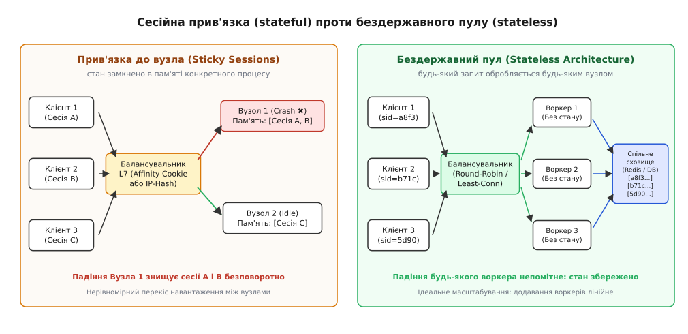
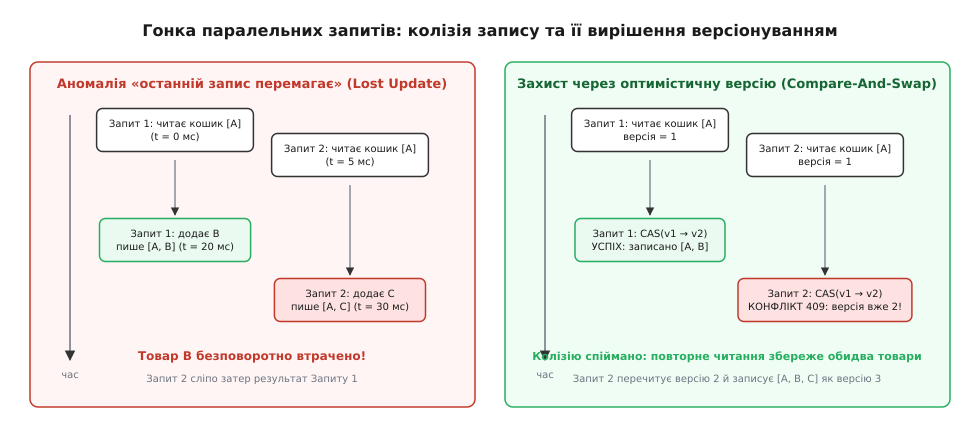
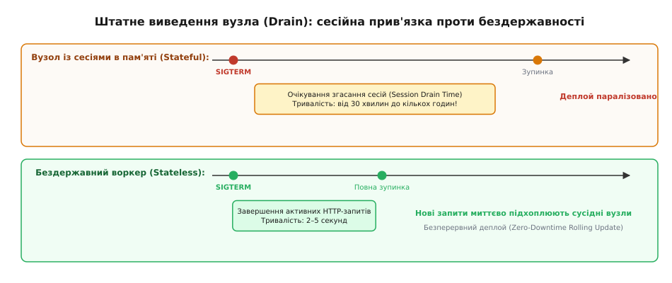

# Сесії і stateless як передумова горизонталі

<preknowlist>
- [Сесія автентифікації](book:programming/session-management) — що таке сесія користувача і як браузер пред'являє випадковий номер замість пароля на кожному запиті.
- [HTTP-cookie](book:programming/http-cookies) — механізм автоматичної передачі збережених заголовків між клієнтом і сервером.
- [Балансування L4 vs L7](book:programming/load-balancing) — як вхідний маршрутизатор розподіляє потік запитів між кількома однаковими бекенд-серверами.
- [Розподілений кеш](book:programming/distributed-cache) — спільне оперативне сховище ключ-значення зі швидким доступом по мережі.
</preknowlist>

Один сервер обслуговує інтернет-магазин, тримаючи сесії користувачів у звичайній оперативній пам'яті процесу (`Map<string, SessionData>`). Користувач входить у систему, сервер виділяє об'єкт у купі (heap), кладе туди ідентифікатор користувача та кошик, а в браузер повертає випадковий номер сесії. Доки відвідувачів кілька сотень, усе працює миттєво: пошук сесії в пам'яті триває частки мікросекунди. Але коли під час розпродажу навантаження зростає до 50 000 одночасних покупців, єдиний процесор нагрівається до 100%, пам'ять вичерпується, і запити починають ставати в чергу. Інженер ставить поруч другий такий самий сервер і розміщує перед ними балансувальник навантаження.

У цей момент система ламається на очах. Покупець вводить логін і пароль — запит потрапляє на Сервер 1, де створюється сесія `a8f3`. Наступний клік (перехід у кошик для оформлення замовлення) балансувальник за круговим алгоритмом (Round-Robin) відправляє на Сервер 2. Сервер 2 читає номер `a8f3`, перевіряє власну локальну пам'ять, нічого там не знаходить і повертає відповідь `401 Unauthorized` або показує порожній кошик. Ще один клік — запит знову на Сервері 1, і кошик раптово з'являється. Покупець виявляється викинутим із системи через кожні два кліки.

Ця криза розкриває головний конфлікт серверної архітектури: **HTTP є протоколом без збереження стану, але користувацький сценарій завжди вимагає тривалого стану**. Те, де саме розміщено цей стан — у пам'яті конкретного процесу, у спільному сховищі чи в зашифрованому конверті на клієнті, — вирішує, чи здатна система масштабуватися горизонтально.

---

## 1. Пастка сесійної прив'язки (Sticky Sessions)

Першою інтуїтивною спробою вирішити проблему розриву сесій без переписування коду стала **сесійна прив'язка** (лат. *affinitas* — спорідненість, близькість; в інженерній практиці — *session affinity* або *sticky sessions*, «липкі сесії»).

Ідея полягає в тому, щоб навчити балансувальник навантаження запам'ятовувати, який саме сервер створив сесію клієнта, і примусово відправляти всі наступні запити цієї людини на ту саму фізичну машину:
1. **Прив'язка за IP-адресою (L4 IP-Hash):** Балансувальник обчислює геш-функцію від вихідної IP-адреси клієнта та закріплює цей IP за фіксованим бекенд-сервером.
2. **Прив'язка за маршрутним cookie (L7 Cookie Insertion):** Балансувальник при першому запиті додає у відповідь власний cookie (наприклад, `ROUTEID=node-1` або `BIGipServer=...`). Браузер надсилає його в кожному запиті, і балансувальник читає мітку, направляючи пакет на відповідний вузол.

На перший погляд, це дозволяє зберегти сесії в пам'яті процесу. Проте в умовах високого навантаження сесійна прив'язка породжує чотири важкі архітектурні дефекти.

### 1. Катастрофічний перекіс навантаження (Load Skew)
Користувачі не генерують однаковий потік запитів: один відвідувач переглядає дві сторінки за пів години, інший — активний трейдер або пошуковий робот — надсилає сотні запитів щохвилини. За сесійної прив'язки балансувальник розподіляє не окремі незалежні запити, а цілі неподільні сесії з випадковою масою. Якщо на Сервер 1 випадково потрапляють кілька «важких» користувачів або сотні працівників корпорації, які виходять в інтернет через єдиний спільний NAT-шлюз із загальною IP-адресою, цей сервер захлинається від перевантаження. Сусідній Сервер 2 водночас може бути завантажений лише на 10%, але балансувальник не має права передати йому частину запитів.

### 2. Радіус руйнування відмови (Blast Radius)
Якщо кластер складається з 10 серверів і на кожному живе по 10 000 сесій у пам'яті, раптове апаратне падіння, перезавантаження ядра або помилка сегментації пам'яті на одному сервері миттєво і безповоротно знищує 10 000 активних користувацьких сесій (10% усієї аудиторії системи). Покупці, які перебували на етапі введення реквізитів оплати, втрачають свої кошики й викидаються на екран повторного входу.

### 3. Параліч еластичного масштабування (Autoscaling Failure)
Коли трафік стрімко зростає і система автоскейлу додає в кластер новий Сервер 3, він не здатний розвантажити наявні Сервери 1 і 2. Усі активні сесії залишаються прикутими до своїх старих машин, а новий вузол стоїть порожнім, отримуючи лише тих поодиноких клієнтів, які зайшли на сайт після масштабування.

### 4. Неможливість безперервного оновлення коду (Zero-Downtime Deployment)
Щоб оновити версію програми на Сервері 1, інженерам доводиться переводити його в режим очікування згасання сесій (*drain mode*) і чекати від 30 хвилин до кількох годин, доки всі прикріплені користувачі завершать роботу. Будь-яке примусове перезавантаження розриває тисячі активних транзакцій.

Чому спроби реплікувати сесії між пам'яттю вузлів через IP-мультикаст зайшли в глухий кут і спричинили мережевий колапс кластерів на початку 2000-х років, детально [розібрано в історичній довідці теми](book:programming/sessions-state/hist-sticky-sessions.md). Строге математичне виведення того, як важкі хвости розподілу Парето створюють небезпечний перекіс черг на вузлах, наведено у [математичному аналізі сесійної прив'язки](book:programming/sessions-state/math-load-skew-affinity.md).

---

## 2. Принцип бездержавності (Stateless Architecture)

Подолання кризи сесійної прив'язки вимагає радикальної зміни моделі: **обчислювальний шар бекенда робиться повністю бездержавним** (*stateless*).

Термін «бездержавний» (лат. *status* — стан, положення речей) не означає, що в системі немає даних. Він означає, що **окремий процес веб-сервера не зберігає клієнтського контексту в локальній пам'яті між HTTP-запитами**.

Кожен вхідний HTTP-запит несе в собі достатньо інформації (наприклад, криптографічно безпечний ідентифікатор сесії `sid`), щоб будь-який вільний воркер у кластері міг миттєво підняти потрібний стан, виконати бізнес-логіку та повернути відповідь, не залишаючи слідів у своїй локальній оперативній пам'яті.



*Порівняння архітектур: ліворуч — стан замкнено в пам'яті вузлів, що призводить до втрати сесій при збоях і перекосу навантаження; праворуч — бездержавні воркери використовують спільне зовнішнє сховище, завдяки чому падіння будь-якого вузла непомітне для користувачів.*

У бездержавній архітектурі балансувальник навантаження звільняється від необхідності аналізувати cookie чи прив'язуватися до IP-адрес. Він застосовує алгоритми рівномірного розподілу окремих запитів (`Round-Robin` або `Least-Connections`), скеровуючи кожен новий HTTP-пакет на найменш завантажений сервер у пулі.

Для управління станом у бездержавному середовищі існують дві фундаментальні архітектурні моделі:
1. **Зовнішнє спільне сховище сесій (External Shared State Store);**
2. **Клієнтські зашифровані токени (Client-Side Encrypted State).**

---

## 3. Модель 1: Зовнішнє спільне сховище сесій (Shared Store)

Найпоширеніший патерн побудови бездержавного бекенда полягає у винесенні сесійного стану у виділений спільний кластер оперативної пам'яті — зазвичай **Redis** або **Key-Value сховище** аналогічного класу.

### Як функціонує потік запиту (Request Lifecycle)
1. **Ідентифікація:** Клієнтський браузер надсилає HTTP-запит із cookie `__Host-sid=a8f3b2c1...`.
2. **Маршрутизація:** Балансувальник передає запит на випадковий вільний Воркер 4.
3. **Вичитування стану (State Hydration):** Воркер 4 бере значення `a8f3b2c1...` і робить швидкий мережевий запит `GET sess:a8f3b2c1...` до кластера Redis.
4. **Обробка бізнес-логіки:** Воркер десеріалізує отриманий JSON-конверт, монтує його в об'єкт запиту (`req.session`), перевіряє права доступу та виконує код контролера (наприклад, додає товар до кошика).
5. **Фіксація змін (State Persistence):** Якщо дані сесії було змінено, воркер надсилає оновлений стан назад у Redis.
6. **Відповідь:** Воркер формує HTTP-відповідь і повертає її клієнту. Його локальна оперативна пам'ять залишається чистою.

```
Клієнт (Браузер)
   │
   │  1. HTTP-запит (Cookie: __Host-sid=a8f3b2...)
   ▼
[Балансувальник L7] ──(Least-Conn)──► [Воркер 2 (Stateless)]
                                          │
                                          │  2. Читання стану: GET sess:a8f3b2...
                                          ▼
                                   [Кластер Redis]
                                          │
                                          │  3. Сесійний конверт JSON
                                          ▼
                                   [Воркер 2]
                                          │
                                          │  4. Модифікація кошика
                                          │  5. Атомарний запис: CAS v1 -> v2
                                          ▼
                                   [Кластер Redis]
                                          │
                                          │  6. Підтвердження OK
                                          ▼
                                   [Воркер 2]
                                          │
   ◄──────────────────────────────────────┘  7. HTTP 200 OK
```

### Ціна та накладні витрати зовнішнього сховища
Винесення сесій за межі процесу вимагає чесного інженерного обліку витрат. Якщо розіменування вказівника в локальній пам'яті процесу займає `~10 наносекунд`, то мережевий виклик до Redis у локальній мережі дата-центру (10GbE) займає `0.3–0.5 мілісекунди` (включаючи час проходження пакетів і десеріалізацію JSON).

Проте для типового веб-запиту з загальним часом виконання `30–60 мс` додаткова затримка у `0.4 мс` складає менше ніж 1% від загального бюджету часу. Натомість система отримує абсолютну відмовостійкість: падіння будь-якого веб-воркера не призводить до втрати жодної сесії.

### Забезпечення високої доступності сховища сесій
Оскільки Redis стає єдиним джерелом правди про сесії, сам кластер сховища проєктується з урахуванням відмовостійкості:
- **Реплікація (Master-Replica):** Кожен шард даних має як мінімум одну гарячу копію-репліку. При падінні основного вузла підсистема **Redis Sentinel** або механізм кластерної оркестрації за 2–3 секунди призначає репліку новим майстром.
- **Політика збереження пам'яті (Eviction Policy):** Для сесійного інстансу Redis суворо заборонено використовувати політику `allkeys-lru`. Якщо пам'ять вичерпується, Redis не має права самовільно викидати сесії авторизованих користувачів. Використовують політику `noeviction` (повернення явної помилки пам'яті, що викликає сповіщення моніторингу) або `volatile-lru` (витіснення лише ключів із явним тимчасовим TTL).

---

## 4. Оптимізація часу життя сесії: алгоритм дросельованого поновлення (Throttled Touch)

Традиційна поведінка веб-сесії передбачає плаваючий час життя (*Sliding Expiration*): кожен запит користувача подовжує дію сесії ще на 30 хвилин.

Якщо реалізувати це наївно — надсилати команду `EXPIRE sess:<id> 1800` на кожен вхідний HTTP-запит — виникає важка проблема **множення операцій запису** (*Write Amplification*). У типовому веб-додатку співвідношення операцій читання до запису становить 9:1. Виходить, що безпечні операції читання (перегляд сторінок, читання каталогу) змушують Redis виконувати безперервний потік команд модифікації, навантажуючи журнал випереджального запису (AOF) та канал міжрегіональної реплікації.

### Рішення: Дросельоване поновлення TTL (Throttled Touch)
Замість поновлення TTL на кожен запит воркер поновлює час у Redis лише тоді, коли від попереднього оновлення минуло більше ніж порогова частка часу (наприклад, 20% від загального інтервалу TTL):

```
TTL сесії = 30 хвилин (1800 секунд)
Пороговий інтервал = 20% від 30 хв = 6 хвилин (360 секунд)
```

1. Користувач робить запит на 1-й хвилині: воркер читає сесію. Від моменту створення минуло менше 6 хвилин, тому команда `EXPIRE` **не надсилається взагалі**.
2. Користувач робить 50 запитів протягом наступних 4 хвилин: усі запити залишаються чистими операціями читання з пам'яті Redis (`GET`).
3. На 7-й хвилині користувач надсилає черговий запит: воркер фіксує, що різниця `now − lastTouch` перевищила поріг у 6 хвилин, і атомарно продовжує TTL до 30 хвилин.

Цей алгоритм скорочує кількість команд запису в Redis на 80–90%, зберігаючи при цьому точну поведінку плаваючого таймауту для користувача.

Повний робочий код сесійного адаптера з пулом з'єднань, серіалізацією та алгоритмом дросельованого поновлення [наведено у практичному проєкті теми](book:programming/sessions-state/proj-stateless-session-store.md).

---

## 5. Розрахунок місткості та масштабування сесійного кластера

При переході на зовнішнє сховище інженери повинні заздалегідь оцінити апаратні потреби пам'яті та пропускної здатності мережі.

### Бюджет оперативної пам'яті
Загальний обсяг пам'яті Redis для зберігання сесій оцінюється за формулою:

```
M_total = N_active · S_session · (1 + Overhead) · R
```
де:
- `N_active` — кількість одночасних активних сесій у системі;
- `S_session` — середній розмір серіалізованого JSON-конверта (зазвичай `~1.5–2.5 КБ`);
- `Overhead` — коефіцієнт внутрішніх структур пам'яті Redis (геш-таблиці `dict`, заголовок `robj`, аллокатор jemalloc, приблизно `30–40%`);
- `R` — фактор реплікації (`R = 2` для пари Master-Replica).

#### Практичний числовий приклад:
Для високонавантаженого сервісу з `1 000 000` активних користувачів та середнім розміром сесії `2 КБ`:

```
Пам'ять на одну сесію з оверхедом = 2 КБ · 1.35 = 2.7 КБ
Пам'ять майстер-вузла = 1 000 000 · 2.7 КБ ≈ 2.7 ГБ
Повний кластер з реплікою = 2.7 ГБ · 2 = 5.4 ГБ
```

Обсяг `5.4 ГБ` є надзвичайно компактним: навіть мільйон користувацьких сесій легко розміщується у пам'яті одного невеликого хмарного інстансу Redis.

### Бюджет мережевого трафіку воркерів
Якщо сервіс обробляє потік у `20 000 запитів/с`, з яких 90% — читання сесії (`GET`, 2 КБ) і 10% — запис після модифікації (`SET`, 2 КБ):

```
Трафік читання = 20 000 · 0.90 · 2 КБ = 36 000 КБ/с = 36 МБ/с
Трафік запису = 20 000 · 0.10 · 2 КБ = 4 000 КБ/с = 4 МБ/с
Загальна смуга = 40 МБ/с = 320 Мбіт/с
```

Смуга у `320 Мбіт/с` завантажує стандартний серверний мережевий інтерфейс 10GbE лише на `3.2%`, підтверджуючи високу енергоефективність архітектури.

---

## 6. Модель 2: Клієнтські зашифровані токени (Client-Side State)

Другий спосіб побудови бездержавного бекенда — повністю відмовитися від централізованого сховища сесій і зберігати всі сесійні дані безпосередньо у клієнтському браузері у вигляді криптографічно підписаного та зашифрованого контейнера (наприклад, токена JWT або шифрованого cookie у фреймворках Ruby on Rails, Django чи Flask).

### Як працює клієнтський стан
1. Під час входу сервер пакує стан користувача (`{ userId: "9941", role: "admin", exp: 1700001800 }`) у бінарний блок.
2. Сервер шифрує цей блок за допомогою симетричного ключа (алгоритм автентифікованого шифрування AES-256-GCM або ChaCha20-Poly1305) і додає криптографічний підпис (HMAC-SHA256).
3. Зашифрований рядок передається в браузер через заголовок `Set-Cookie`.
4. При кожному наступному запиті браузер надсилає весь зашифрований стан назад на сервер.
5. Будь-який воркер, що має спільний симетричний секретний ключ, розшифровує токен, перевіряє цілісність підпису і миттєво отримує дані сесії без жодного звернення до бази даних чи Redis (`0 мс` мережевих витрат).

```
   ┌─────────────────────────────────────────────────────────────┐
   │             Клієнтський зашифрований cookie                 │
   ├───────────────┬──────────────────┬──────────────────────────┤
   │  IV (12 B)    │  Ciphertext      │  Auth Tag (16 B)         │
   │  Вектор       │  Зашифрований    │  Криптографічний підпис  │
   │  ініціалізації│  стан сесії      │  цілісності (HMAC/GCM)   │
   └───────────────┴──────────────────┴──────────────────────────┘
```

### Пастки та межі застосування клієнтського стану
Попри очевидну привабливість повної відсутності серверного сховища, клієнтський стан має чотири суворі обмеження:

1. **Жорсткий ліміт розміру (4 КБ):** Специфікація RFC 6265 обмежує максимальний розмір одного HTTP-cookie величиною 4096 байтів. Якщо кошик покупця містить десятки товарів або профіль несе розгалужені списки прав, дані фізично не помістяться в cookie.
2. **Паразитний мережевий трафік:** Зашифрований токен розміром 2–3 КБ передається туди й назад у кожному HTTP-запиті (включаючи завантаження картинок, скриптів та AJAX-виклики). Для системи з 10 000 запитів/с це генерує понад 20 МБ/с зайвого зовнішнього інтернет-трафіку (десятки терабайтів на місяць).
3. **Парадокс миттєвого відкликання (Revocation Problem):** Оскільки токен самодостатній, сервер не може «видалити» його до закінчення терміну дії `exp`. Якщо користувача заблоковано або його пристрій викрадено, його токен залишається валідним на всіх воркерах. Щоб заблокувати такий токен достроково, бекенд змушений вести чорний список відкликаних токенів у централізованому Redis — що повністю нівелює початкову ідею відсутності серверного стану.
4. **Неактуальність даних (Stale State):** Якщо права користувача було змінено в базі даних (наприклад, знято роль адміністратора), його клієнтський cookie стверджуватиме протилежне, доки не спливе термін його дії.

Клієнтські токени чудово підходять для короткоживучих (5–15 хвилин) компактних міток доступу в мікросервісних архітектурах ([детально про їхню будову — у статті про JWT](book:programming/jwt-tokens)), тоді як для повноцінних довготривалих сесій веб-сайтів стандартом лишається централізоване сховище Redis.

---

## 7. Гонки паралельних запитів та оптимістичне блокування (CAS)

У розподіленому бездержавному середовищі виникає фундаментальна проблема узгодженості: **одночасна модифікація сесії паралельними запитами одного користувача**.

Коли користувач відкриває одночасно три вкладки в браузері або мобільний додаток генерує фонові асинхронні запити під час завантаження сторінки, різні HTTP-запити від одного клієнта потрапляють на різні бездержавні воркери (Воркер 1 і Воркер 2) в один і той самий мікросекундний інтервал.



*Гонка паралельних запитів: ліворуч — аномалія Lost Update, коли Запит 2 сліпо затирає зміни Запиту 1; праворуч — оптимістичне версіонування CAS, що виявляє колізію та ініціює безпечний повтор.*

### Аномалія «Останній запис перемагає» (Lost Update)
Якщо сховище реалізує неконтрольований запис:
1. Запит 1 і Запит 2 одночасно зчитують сесію з Redis: стан кошика `["книга"]`.
2. Запит 1 додає «навушники» і записує в Redis `["книга", "навушники"]`.
3. Запит 2 (який працював трохи довше) додає «чохол» до свого початкового зліпка і записує в Redis `["книга", "чохол"]`.

Зміна Запиту 1 безповоротно втрачена. Товар «навушники» зник із бази даних.

### Рішення: Оптимістичне версіонування (Compare-And-Swap)
Для захисту від втрати оновлень сесійний конверт містить монотонний лічильник `version`:
1. Воркер 1 зчитує сесію з версією `v = 1`.
2. Воркер 2 одночасно зчитує ту саму сесію з версією `v = 1`.
3. Воркер 1 першим завершує роботу і виконує атомарну команду: *«Запиши новий стан і версію 2, якщо поточна версія в базі все ще дорівнює 1»*. Умова виконується — дані збережено, версія в Redis стає `2`.
4. Воркер 2 намагається виконати ту саму команду: *«Запиши новий стан і версію 2, якщо версія дорівнює 1»*. Redis бачить, що версія вже стала `2`, відхиляє запис і повертає помилку `VERSION_CONFLICT`.
5. Воркер 2 перехоплює виняток, робить мікропаузу (джиттер 5–15 мс), заново зчитує актуальний стан (`["книга", "навушники"]`, версія `2`), накладає свій товар і успішно зберігає версію `3` (`["книга", "навушники", "чохол"]`).

Усі товари збережено, а стан залишається повністю консистентним.

Повна специфікація схеми сесійного конверта, кодів помилок та правил повторних спроб [визначена в контракті сесійного сховища](book:programming/sessions-state/api-session-contract.md).

---

## 8. Безпека сесій у розподіленому середовищі: ротація та префікс `__Host-`

Бездержавна архітектура вимагає суворого дотримання протоколів криптографічної безпеки на стику «браузер — балансувальник»:

### 1. Захист від фіксації сесії (Session Fixation Defense)
Атака фіксації сесії полягає в тому, що зловмисник генерує анонімну сесію з ідентифікатором `sid = evil_123` і підкидає посилання з цим `sid` жертві. Якщо після успішної автентифікації сервер залишає той самий номер сесії, зловмисник отримує повний доступ до облікового запису жертви.

**Правило ротації ідентифікатора:** У момент будь-якої зміни привілеїв користувача (вхід у систему, вихід, зміна ролі з `user` на `admin`) сервер зобов'язаний згенерувати абсолютно новий ідентифікатор сесії (`sid = new_456`), атомарно перенести дані зі старого ключа на новий і видалити старий ключ `evil_123` у Redis.

### 2. Префікс cookie `__Host-` проти підміни з піддоменів (Cookie Tossing)
Якщо компанія володіє доменом `example.com` і дозволяє користувачам створювати блоги на піддоменах (`blog.example.com`), скомпрометований піддомен може встановити cookie `sid=fake` для всього батьківського домену `.example.com`. Браузер надішле обидва cookie, і бекенд може прочитати фальшивий номер.

Для повного усунення цієї вразливості cookie іменується з префіксом `__Host-sid`. Браузер прийме такий cookie лише у випадку, якщо:
- Він передається виключно через зашифрований канал HTTPS (`Secure`);
- Він має шлях доступу до всього сайту (`Path=/`);
- **Він не містить атрибута `Domain`**, тобто закріплений суворо за точним доменом `example.com` і недоступний жодному піддомену.

---

## 9. Довгоживучі з'єднання (WebSockets, SSE) у бездержавній системі

Поширене запитання інженерів: як бездержавний бекенд працює з двосторонніми протоколами реального часу (WebSockets, Server-Sent Events), де TCP-з'єднання між клієнтом і сервером утримується відкритим годинами?

З'єднання WebSocket є за своєю природою з'єднанням зі збереженням стану на транспортному рівні (TCP-сокет фізично прив'язаний до конкретного процесу Воркера 3). Проте на рівні бізнес-логіки архітектура залишається повністю бездержавною:

```
[Клієнт A] ──(WS Socket)──► [Воркер 1]
                                 │
                                 ├──► [Шина подій Redis Pub/Sub] ◄───┐
                                 │                                   │
[Клієнт B] ──(WS Socket)──► [Воркер 4]                               │
                                 │                                   │
[HTTP API Запит] ──────────► [Воркер 2 (Stateless)] ─────────────────┘
```

1. **Автентифікація при підключенні (Handshake):** Під час початкового HTTP Upgrade запиту Воркер 1 зчитує сесійний cookie `sid` і перевіряє права користувача в Redis.
2. **Розв'язка через розподілену шину (Pub/Sub Bus):** Воркери не намагаються знайти сокет адресата у власній пам'яті. Коли Воркер 2 обробляє HTTP-запит «надіслати повідомлення користувачу B», він просто публікує подію у спільний канал Redis `user_events:user_B`.
3. Воркер 4, на якому наразі висить відкритий сокет клієнта B, підписаний на цей канал, отримує повідомлення від Redis і відправляє його у фізичний сокет.

Обчислювальний шар зберігає всі властивості горизонтальної масштабованості: будь-який воркер може впасти або перезапуститися, не зачіпаючи логіку інших клієнтів.

---

## 10. Штатне виведення вузлів (Graceful Shutdown) та автоскейл

Головна перевага бездержавного бекенда розкривається під час експлуатації живої системи в хмарі: **можливість миттєвого додавання та видалення обчислювальних вузлів без ризику для користувачів**.



*Штатне виведення вузла (Drain): сесійна прив'язка блокує деплой на години в очікуванні згасання сесій; бездержавний воркер завершує активні запити за кілька секунд і зупиняється без жодного впливу на користувачів.*

### Як працює штатна зупинка бездержавного воркера
Коли система оркестрації (Kubernetes або AWS Auto Scaling) вирішує вивести вузол з експлуатації (для викачування нової версії програми або зменшення кількості машин після спаду пікового навантаження):
1. **Зняття з балансувальника:** Оркестратор виключає вузол зі списку активних цілей балансувальника. Нові HTTP-запити миттєво починають надходити на інші сервери кластера.
2. **Сигнал `SIGTERM`:** Процесу надсилається сигнал штатного завершення.
3. **Дренаж активних з'єднань (Connection Draining):** Воркер не обриває з'єднання миттєво, а чекає 2–5 секунд, доки завершаться ті нечисленні HTTP-запити, які вже почали виконуватися.
4. **Зупинка процесу:** Оскільки жодних сесій у пам'яті воркера немає, він завершує роботу.

Користувачі не помічають жодних збоїв: їхній наступний клік буде підхоплений сусіднім сервером, який вичитає той самий стан із Redis. Це забезпечує справжнє розгортання без простоїв (**Zero-Downtime Deployment**).

---

## 11. Покрокова міграція моноліту до бездержавної моделі

Переведення високонавантаженої системи від пам'яті вузлів до зовнішнього сховища виконується без зупинки сервісу у три етапи:

1. **Етап 1: Подвійний запис (Dual-Write Phase).**
   Мідлвар бекенда починає зберігати всі нові та модифіковані сесії одночасно в локальну пам'ять процесу і в новий кластер Redis. Читання на цьому етапі продовжує виконуватися з локальної пам'яті.
2. **Етап 2: Перемикання читання (Read Cutover).**
   Мідлвар перемикає читання на Redis. Якщо сесію не знайдено в Redis (створена до початку міграції), відбувається резервне вичитування з локальної пам'яті.
3. **Етап 3: Вимкнення прив'язки на балансувальнику (Affinity Tear-Down).**
   На балансувальнику навантаження деактивується правило sticky sessions. Потік запитів стає ідеально рівномірним, а локальні словники сесій у коді бекенда повністю видаляються.

---

## 12. Мультиорендна ізоляція просторів імен у спільних сховищах (Multi-Tenant Namespacing)

У великих корпоративних екосистемах або SaaS-платформах спільний кластер Redis обслуговує сесії багатьох незалежних організацій (тенантів) чи різних мікросервісів. 

Щоб уникнути випадкового перезапису ключів або витоку сесійних даних між різними доменами бізнесу, застосовується сувора префіксація ключів за схемою просторів імен:

```
sess:{tenant_id}:{env}:{session_id}
```
Наприклад: `sess:org_712:prod:a8f3b2c1...`.

Використання фіксованих префіксів дозволяє:
- Ізолювати права доступу на рівні користувачів Redis (Redis ACL);
- Виконувати миттєве масове скидання сесій конкретного орендаря без ризику зачепити сусідні компанії;
- Організувати коректний шардинг ключів у Redis Cluster за допомогою геш-тегів `{org_712}:sess:...`.

---

## 13. Порівняльна матриця архітектур стану

Підсумуємо компроміси розглянутих підходів до організації сесійного стану:

| Архітектурна властивість | Сесії в пам'яті + Sticky Sessions | Бездержавний пул + Redis | Клієнтські зашифровані Cookie |
|---|---|---|---|
| **Місце збереження стану** | Локальна RAM процесу | Спільний кластер Redis | Cookie у браузері клієнта |
| **Додаткова затримка на запит** | `0.00 мс` | `~0.40 мс` (network hop) | `0.00 мс` |
| **Втрата сесій при падінні вузла** | `1 / N` (втрата всіх сесій вузла) | `0%` (стан ізольовано) | `0%` (стан на клієнті) |
| **Рівномірність балансування** | Низька (перекоси через IP/NAT) | Ідеальна (Round-Robin / Least-Conn) | Ідеальна (Round-Robin) |
| **Миттєве відкликання сесії** | Миттєве (видалення з пам'яті) | Миттєве (DEL у Redis) | Неможливе без центрального чорного списку |
| **Граничний обсяг даних** | Обмежений пам'яттю вузла | Сотні гігабайтів у кластері | Суворо `< 4 КБ` на клієнта |
| **Накладні витрати на трафік** | Відсутні | Мінімальні в локальній мережі | Високі (передача 2–4 КБ у кожному запиті) |
| **Швидкість розгортання релізів** | Повільна (очікування годинами) | Миттєва (дренаж за 2–5 с) | Миттєва (дренаж за 2–5 с) |

---

## 14. Архітектурний висновок

Бездержавність обчислювального шару — це не просто стилістична рекомендація, а **обов'язкова інженерна передумова для побудови горизонтально масштабованих систем**. 

Відокремлення виконання бізнес-коду від зберігання стану:
- Перетворює сервери на легкі взаємозамінні вузли, знімаючи будь-які лінійні обмеження на кількість машин у кластері;
- Забезпечує абсолютну відмовостійкість користувацьких сесій при апаратних аваріях чи перезавантаженнях окремих воркерів;
- Дозволяє команді розробників проводити часті безпечні релізи коду за лічені секунди замість багатогодинного очікування згасання сесій.
