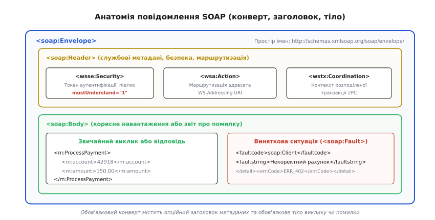
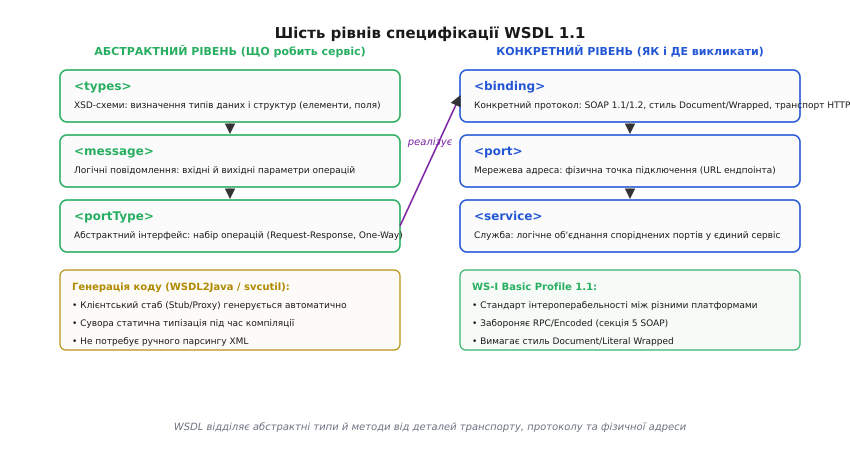
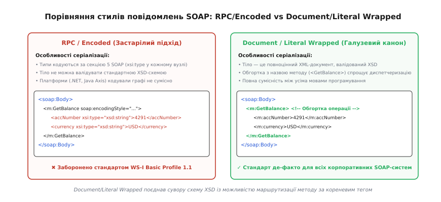
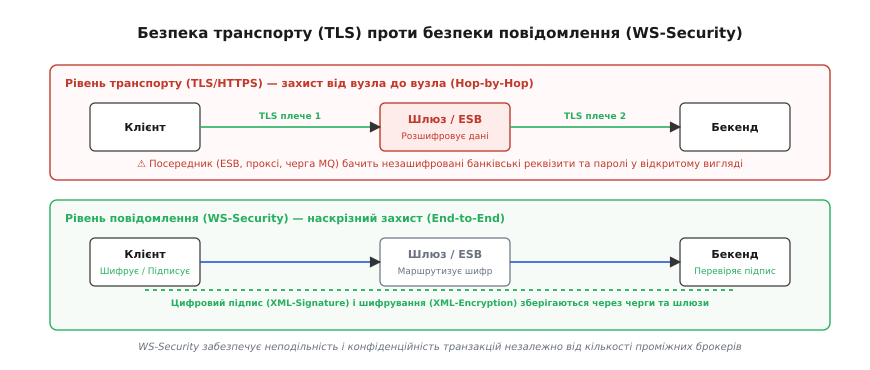
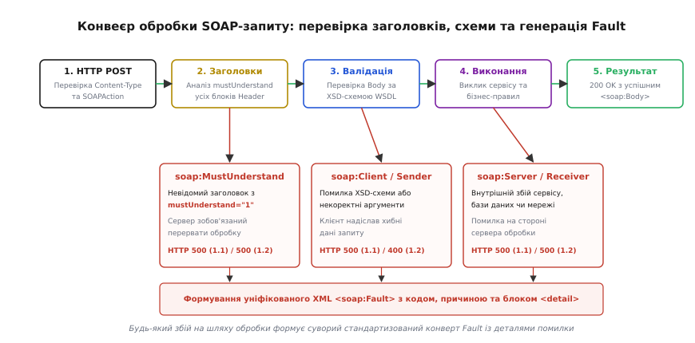

# SOAP і веб-сервіси

<preknowlist>
- [HTTP](book:programming/http) — протокол передачі гіпертексту: методи запиту, заголовки, коди стану, модель клієнт-сервер.
- [RPC і серіалізація](book:programming/rpc) — парадигма віддаленого виклику процедур, серіалізація структур даних та клієнт-серверні контракти.
</preknowlist>

Уявімо два банківські сервери наприкінці 1990-х років, розташовані у різних містах і підключені до інтернету. Перший сервер працює на платформі Windows під керуванням технології DCOM, другий — на сервері під керуванням Unix із брокером об'єктів [CORBA](book:programming/corba-object-broker). Обидві системи чудово виконують віддалені виклики методів усередині своїх локальних дата-центрів, але спроба провести міжбанківський платіж через зовнішню мережу зазнає повної невдачі.

Причина полягає в будові корпоративного мережевого захисту. Двійкові протоколи віддаленого виклику процедур відкривають прямі TCP-з'єднання на випадкових, динамічно виділених мережевих портах (наприклад, порти 1024–65535). Системні адміністратори та міжмережеві екрани (брандмауери) блокують будь-який вхідний і вихідний трафік на довільних портах, залишаючи відкритими лише порт 80 для вебперегляду (HTTP) та порт 443 для захищеного з'єднання (HTTPS). Спроба налаштувати фаєрвол під динамічні діапазони портів створює неприпустимі дірки в системі безпеки підприємства.

Рішення, яке назавжди змінило ландшафт корпоративного програмного забезпечення, виявилося простим: **передавати виклики процедур у вигляді звичайного тексту, упакованого в стандартні HTTP-запити методом POST**. Замість складного двійкового кодування параметри виклику записуються у форматі XML. Для мережевих екранів, маршрутизаторів і проксі-серверів такий пакет виглядає як звичайний вебтрафік, що безперешкодно проходить крізь порт 80. Те, що спочатку виникло як вимушений спосіб обходу брандмауерів, згодом оформилося у фундаментальну архітектурну екосистему — **вебсервіси** (англ. *Web Services*).

Головним протоколом цієї екосистеми став **SOAP** (англ. *Simple Object Access Protocol* — «простий протокол доступу до об'єктів»). Хоча з часом консорціум W3C відмовився від розшифрування назви (визнавши, що протокол не є простим і не обмежується об'єктами), абревіатура SOAP закріпилася за стандартом обміну структурованими XML-повідомленнями в розподілених комп'ютерних системах.

---

### Анатомія повідомлення: концепція конверта (Envelope)

На відміну від двійкових протоколів, де байти структури йдуть суцільним потоком за жорстким зміщенням пам'яті, повідомлення SOAP являє собою самодостатній текстовий XML-документ. Незалежно від того, яка бізнес-операція викликається (переказ коштів, бронювання квитка чи запит залишку на складі), повідомлення завжди вкладається в уніфікований трирівневий каркас.


*Анатомія повідомлення SOAP. Зовнішній елемент Envelope визначає простір імен і версію протоколу. Контейнер Header містить службові інструкції (безпека, маршрутизація, транзакції) з прапорцем mustUnderstand. Обов'язковий елемент Body несе або корисне навантаження виклику, або стандартизований блок помилки Fault.*

Кореневим елементом будь-якого повідомлення є **`<soap:Envelope>`**. Він оголошує простори імен XML, які визначають версію протоколу: для версії SOAP 1.1 використовується простір імен `http://schemas.xmlsoap.org/soap/envelope/`, а для версії SOAP 1.2 — `http://www.w3.org/2003/05/soap-envelope`. Усі наступні вузли документа інтерпретуються парсером строго за правилами оголошеного простору імен.

Усередині конверта розміщуються рівно два логічні блоки:
1. **`<soap:Header>` (заголовок):** необов'язковий контейнер для передачі наскрізних службових даних (метаданих), які не стосуються самої бізнес-логіки операції, але необхідні для її коректного виконання в мережі. Тут розміщуються цифрові сертифікати, токени автентифікації, ідентифікатори наскрізного трасування або координати розподілених транзакцій.
2. **`<soap:Body>` (тіло):** обов'язковий контейнер, який містить безпосереднє корисне навантаження — ім'я викликаного методу разом із вхідними параметрами, результат виконання або структурований звіт про помилку.

Повний огляд відмінностей у просторах імен, типах вмісту та службових тегах між версіями протоколу наведено в [довіднику структури конверта, помилок і WSDL](book:programming/soap-web-services/api-wsdl-and-soap.md).

#### Дисципліна обов'язкових заголовків: атрибут `mustUnderstand`

Найпотужнішим механізмом узгодження можливостей між клієнтом і сервером у SOAP є атрибут **`mustUnderstand`** (англ. *must understand* — «зобов'язаний зрозуміти»). 

У розподілених корпоративних мережах повідомлення часто проходять через ланцюжки посередників: балансувальники, шлюзи безпеки, аудиторські проксі. Якщо клієнт додає до будь-якого блоку заголовка атрибут `soap:mustUnderstand="1"` (або `"true"` у SOAP 1.2), він встановлює жорсткий контракт: приймальний вузол зобов'язаний повністю розпізнати семантику цього блоку й виконати закладені в ньому інструкції.

Якщо сервер або проміжний шлюз не має встановленого програмного модуля для обробки такого заголовка (наприклад, клієнт вимагає шифрування за новим криптографічним алгоритмом, який серверу невідомий), специфікація протоколу **забороняє часткове виконання запиту**. Сервер не має права просто проігнорувати заголовок і перейти до виконання бізнес-логіки в `<soap:Body>`. Він зобов'язаний негайно перервати роботу й повернути клієнту стандартизоване повідомлення про помилку з кодом `soap:MustUnderstand`.

> 🔧 **Навіщо це.** У фінансових транзакціях не можна припустити ситуацію, коли банк списав кошти з рахунку, але «проігнорував» заголовок цифрового підпису чи заголовок аудиторської фіксації лише тому, що на сервері не було оновлено бібліотеку безпеки. Прапорець `mustUnderstand` гарантує: транзакція або виконується з усіма вимогами безпеки, або не розпочинається взагалі.

#### Стандартизовані повідомлення про помилки: `<soap:Fault>`

Якщо під час отримання, розбору XML або виконання бізнес-методу стається виняткова ситуація, сервер не повертає довільну HTML-сторінку чи текстовий стек викликів. Замість цього всередині контейнера `<soap:Body>` формується єдиний стандартний елемент — **`<soap:Fault>`**.

У версії SOAP 1.1 блок помилки містить чотири фіксовані поля:
- **`<faultcode>`:** машиночитний код помилки з фіксованого набору стандартних категорій:
  - `soap:VersionMismatch` — простір імен конверта не підтримується сервером;
  - `soap:MustUnderstand` — не вдалося обробити обов'язковий блок заголовка;
  - `soap:Client` — клієнт надіслав некоректні дані (помилка у форматі, порушення схеми);
  - `soap:Server` — внутрішній збій на боці сервера (помилка бази даних, виключення коду).
- **`<faultstring>`:** текстовий опис проблеми зрозумілою для людини мовою.
- **`<faultactor>`:** адреса конкретного вузла в мережі, на якому стався збій.
- **`<detail>`:** прикладний XML-фрагмент із детальними відомостями про причину збою (наприклад, код внутрішньої банківської помилки та назва поля, що не пройшло перевірку).

У версії SOAP 1.2 цей механізм було вдосконалено: елементи `faultcode` і `faultstring` замінили на ієрархічний елемент `<soap12:Code>` (з підтримкою вкладених підкодів `<soap12:Subcode>`) та багатомовний контейнер `<soap12:Reason>`, де текст помилки може дублюватися різними мовами через атрибут `xml:lang`.

---

### WSDL: формальний контракт вебсервісу

Головна слабкість ранніх вебінтеграцій полягала у відсутності формального опису інтерфейсу. Розробникам доводилося вручну читати текстову документацію, писати парсери XML та вгадувати точні назви тегів і типи полів.

Для усунення цього хаосу було створено стандарт **WSDL** (англ. *Web Services Description Language* — «мова опису вебсервісів»). WSDL — це XML-документ, який містить повний машинно-орієнтований опис інтерфейсу: які методи надає сервіс, які типи даних приймає кожен параметр, який протокол зв'язку використовується і за якою фізичною адресою доступний сервер.


*Шість рівнів WSDL 1.1. Абстрактна частина (типи, повідомлення, інтерфейс portType) описує логіку взаємодії незалежно від платформи. Конкретна частина (binding, port, service) визначає протокол SOAP, стиль серіалізації та фізичну мережеву адресу ендпоінта.*

Специфікація WSDL 1.1 будується з шести взаємопов'язаних рівнів:

1. **`<types>` (рівень типів даних):** містить схеми XSD (XML Schema Definition), які суворо описують структури складних об'єктів, обмеження на довжину рядків, діапазони чисел і типи полів.
2. **`<message>` (рівень повідомлень):** визначає логічний склад вхідних і вихідних повідомлень. Кожне повідомлення складається з частин (`<part>`), що посилаються на типи з блоку `<types>`.
3. **`<portType>` (рівень абстрактного інтерфейсу):** описує набір операцій (методів), які підтримує вебсервіс. В операціях вказуються вхідні (`<input>`), вихідні (`<output>`) та аварійні (`<fault>`) повідомлення.
4. **`<binding>` (рівень прив'язування):** визначає, як абстрактні операції переводяться в конкретний мережевий протокол. Тут фіксується транспорт (зазвичай HTTP або черги повідомлень JMS), версія SOAP (1.1 чи 1.2) та стиль упаковки даних (Document чи RPC).
5. **`<port>` (точка доступу):** пов'язує конкретне прив'язування `<binding>` з фізичною мережевою адресою (URL).
6. **`<service>` (служба):** логічно об'єднує групу споріднених портів у єдиний сервіс.

#### Шаблони обміну повідомленнями (MEP)

Усередині абстрактного рівня `<portType>` операції можуть будуватися за різними патернами обміну повідомленнями (Message Exchange Patterns, MEP):
- **Синхронний виклик (Request-Response):** клієнт надсилає вхідне повідомлення `<input>` і блокує виконання до отримання відповіді `<output>` або помилки `<fault>`. Це домінантний патерн для транзакцій (переказ коштів, перевірка залишку).
- **Односпрямована подія (One-Way):** операція містить лише елемент `<input>`. Клієнт надсилає повідомлення і негайно звільняє потік, не очікуючи підтвердження від сервера. Патерн використовується для логування, надсилання метрик та асинхронних черг.
- **Опитування клієнта (Solicit-Response):** операція починається з вихідного повідомлення сервера `<output>`, на яке клієнт повертає вхідне `<input>`.
- **Широкомовне сповіщення (Notification):** сервер розсилає повідомлення підписаним вузлам без очікування відповіді.

#### Контрактний підхід (Contract-First) та автоматична генерація коду

Існування WSDL дозволило реалізувати підхід **Contract-First** (спочатку контракт). Замість того, щоб спочатку написати серверний код, а потім намагатися пояснити клієнтам його структуру, архітектори спочатку створюють файл WSDL.

Спеціальні утиліти компіляції (такі як `WSDL2Java` в екосистемі Java Apache CXF/Axis або `svcutil.exe` в платформі .NET) зчитують WSDL-файл і автоматично генерують:
- **Клієнтський стаб (Stub / Proxy):** строго типізовані класи з методами, сигнатури яких точно відповідають операціям WSDL. Розробник клієнта просто викликає звичайний метод у коді (наприклад, `client.processPayment(account, amount)`), а згенерований стаб самостійно бере на себе серіалізацію об'єктів у XML, формування конверта SOAP, відправку HTTP-запиту та розбір відповіді.
- **Серверний каркас (Skeleton):** інтерфейси, які розробник бекенду просто імплементує у своєму класі. Диспетчер фреймворку автоматично валідує вхідний XML за XSD-схемою перед тим, як передати керування бізнес-методу.

---

### Стилі зв'язування: RPC проти Document і стандарт Document/Literal Wrapped

На початку розвитку вебсервісів виникла серйозна проблема сумісності, викликана різними способами упаковки параметрів виклику в XML. Специфікація WSDL 1.1 пропонувала комбінацію двох параметрів: **стилю** (`style="rpc|document"`) та **використання** (`use="encoded|literal"`).


*Порівняння стилів SOAP. Застарілий RPC/Encoded використовував кодування за секцією 5 і не дозволяв валідувати XML за XSD-схемою. Стандарт Document/Literal Wrapped поєднав пряму валідацію за схемою з однозначною диспетчеризацією методу за кореневим тегом-обгорткою.*

Існувало чотири комбінації цих параметрів:

1. **RPC / Encoded (кодування за секцією 5 SOAP):** найстаріший підхід. Тіло повідомлення будувалося за назвою операції, а кожен дочірній елемент містив атрибут `xsi:type`, що вказував тип даних. Головна вада підходу полягала в тому, що правила кодування графів об'єктів у різних мовах (Java, C#, C++) відрізнялися. Сервер на Java не міг розібрати масив, сформований клієнтом на .NET. Крім того, тіло такого повідомлення неможливо було перевірити за стандартною схемою XSD.
2. **RPC / Literal:** параметри вказувалися без атрибутів `xsi:type`, але кореневий тег усе ще формувався динамічно за правилами RPC, що ускладнювало валідацію.
3. **Document / Literal:** тіло `<soap:Body>` містило валідний XML-документ, повністю описаний у схемі XSD. Проте виникла інша проблема: у чистому стилі Document кореневий тег тіла не обов'язково збігався з назвою операції, через що серверу було важко визначити, який саме метод коду викликати.
4. **Document / Literal Wrapped (галузевий канон):** геніальний компроміс, який став стандартом де-факто. За цим патерном створюється глобальний комплексний XSD-елемент, чия назва **точно збігається з назвою операції** (наприклад, `<ProcessPayment>`), а всередині нього описуються всі параметри.

#### Роль WS-I Basic Profile

Щоб покласти край війні форматів, провідні технологічні компанії створили організацію WS-I (Web Services Interoperability Organization). У 2004 році було випущено стандарт **WS-I Basic Profile 1.1**, який:
- **Повністю заборонив кодування RPC/Encoded**;
- Зобов'язав використовувати виключно стилі **Document/Literal** та **Document/Literal Wrapped**;
- Уніфікував вимоги до заголовка `SOAPAction` та кодів повернення помилок.

Детальний історичний огляд суперечок між вендорами та появи організації WS-I викладено в [історії народження SOAP і стандартизаційних війн WS-*](book:programming/soap-web-services/hist-soap-origin.md).

---

### Екосистема WS-*: безпека на рівні повідомлення

Одним із головних аргументів на користь SOAP у великих підприємствах є наявність розширеного стека протоколів **WS-*** (WS-Star), розробленого консорціумами W3C та OASIS. Найважливішим серед них є стандарт **WS-Security (WSS)**.

#### Безпека транспорту (TLS) проти безпеки повідомлення (WS-Security)

Більшість сучасних веброзробників звикли покладатися на захищений протокол HTTPS (TLS). Проте TLS забезпечує безпеку виключно **між двома сусідніми мережевими вузлами** (англ. *hop-by-hop*).

У складних корпоративних системах клієнтський запит рідко потрапляє відразу на цільовий сервер: він проходить через демілітаризовану зону (DMZ), шлюз безпеки, корпоративну шину даних (ESB) і черги повідомлень (наприклад, IBM MQ чи RabbitMQ).


*Безпека транспорту проти безпеки повідомлення. При використанні TLS проміжний вузол (ESB, черга) розшифровує повідомлення і бачить паролі та банківські реквізити у відкритому вигляді. WS-Security забезпечує наскрізний захист (End-to-End): цифровий підпис і шифрування зберігаються в самому XML-конверті незалежно від кількості проміжних вузлів.*

Якщо використовувати лише HTTPS:
- На першому плечі (Клієнт → ESB) трафік захищений.
- На самому вузлі ESB з'єднання TLS розривається, і XML-повідомлення опиняється в оперативній пам'яті посередника у **відкритому, незашифрованому вигляді**. Будь-який адміністратор шини даних або шкідливе ПЗ на проміжному сервері може підглянути номери кредитних карток, паролі або підмінити суму платежу.
- На другому плечі (ESB → Кінцевий бекенд) створюється нове з'єднання TLS, але цілісність даних від початкового клієнта вже втрачена.

**WS-Security реалізує захист на рівні самого повідомлення (Message-Level Security):**
1. **Автентифікація (`<wsse:UsernameToken>`):** передача облікових даних користувача з використанням криптографічних одноразових солей (Nonce) і часових міток (Timestamp), що захищає від атак повторного відтворення (Replay Attack).
2. **Цифровий підпис (XML-Signature, `<ds:Signature>`):** клієнт підписує своїм закритим ключем безпосередньо вміст `<soap:Body>`. Проміжні шлюзи можуть маршрутизувати конверт, але будь-яка спроба модифікувати хоча б одну цифру в сумі платежу призведе до недійсності цифрового підпису на кінцевому сервері. Це забезпечує юридичну невідмовність від авторства (non-repudiation).
3. **Шифрування елементів (XML-Encryption, `<xenc:EncryptedData>`):** клієнт може зашифрувати окремі критичні поля (наприклад, CVV-код або номер паспорта) відкритим ключем кінцевого сервера. Проміжні брокери бачать XML-структуру, можуть читати службові заголовки маршрутизації, але не мають доступу до конфіденційного вмісту.

#### Канонікалізація XML (C14N)

Під час підписання XML виникає фундаментальна технічна складність: один і той самий XML-документ може бути записаний у текстовому файлі з різною кількістю пробілів, різним порядком атрибутів або з перенесенням рядків у стилі Windows (`CRLF`) чи Unix (`LF`). Оскільки будь-який криптографічний геш чутливий до зміни хоча б одного біта, звичайна зміна відступів проміжним маршрутизатором зруйнувала б цифровий підпис.

Для розв'язання цієї проблеми стандарт XML-Signature вимагає попередньої **канонікалізації** (англ. *XML Canonicalization*, C14N). Алгоритм C14N приводить документ до єдиного строго визначеного двійкового вигляду:
- Атрибути в кожному тезі сортуються за абеткою просторів імен і назв;
- Усі символи перенесення рядків нормалізуються до байта `0x0A` (`LF`);
- Видаляються зайві пробіли між атрибутами та невикористані оголошення просторів імен;
- Текстові сутності нормалізуються (символи `&amp;`, `&lt;`, `&gt;`).

Лише після проходження C14N обчислюється контрольна сума, що гарантує стабільність підпису при проходженні через будь-які проміжні шлюзи.

#### Політики безпеки: стандарт WS-Policy та WS-SecurityPolicy

Щоб клієнту не доводилося вручну налаштовувати правила криптографії, у WSDL додають декларативні блоки **WS-Policy**. За допомогою тегів `<wsp:Policy>` сервер заявляє свої вимоги:
- Який саме алгоритм симетричного шифрування вимагається (наприклад, `Basic256` або `TripleDes`);
- Які саме частини конверта повинні бути підписані обов'язково (наприклад, весь `<soap:Body>` плюс заголовок `<wsa:To>`);
- Який тип сертифіката X.509 повинен надати клієнт.

Згенерований за таким WSDL клієнтський стаб автоматично вмикає необхідні криптографічні модулі та самостійно формує потрібні заголовки WS-Security без написання жодного рядка низькорівневого коду шифрування.

#### Інші ключові стандарти стека WS-*

- **WS-Addressing:** додає в заголовок повідомлення універсальні поля маршрутизації (`wsa:To`, `wsa:ReplyTo`, `wsa:Action`, `wsa:MessageID`). Це дозволяє організовувати складні асинхронні взаємодії через різні транспортні протоколи (наприклад, клієнт надсилає запит через HTTP, а сервер надсилає асинхронну відповідь через окремий канал SMTP чи чергу JMS).
- **WS-ReliableMessaging (WS-RM):** протокол гарантованої доставки на рівні прикладних повідомлень. Забезпечує доставку повідомлень у суворо визначеному порядку (`InOrder`) і рівно один раз (`ExactlyOnce`), навіть якщо фізичне TCP-з'єднання обривається під час передачі.
- **WS-AtomicTransaction / WS-Coordination:** протокол організації розподілених транзакцій за схемою двофазної фіксації (Two-Phase Commit, 2PC) між сервісами, написаними на різних мовах програмування і підключеними до різних баз даних. Координатор транзакції формує заголовок `<wstx:CoordinationContext>`, який передається в кожному SOAP-запиті. Якщо хоча б один вузол на фазі `Prepare` повідомляє про неможливість зафіксувати зміни, координатор розсилає команду відкату `Rollback` усім учасникам ланцюжка.

---

### Передача двійкових даних: від SwA до MTOM і XOP

Оскільки SOAP є текстовим форматом, передача великих двійкових файлів (сканів договорів, фотографій, звітів PDF) усередині звичайного XML-тегу вимагає перекодування в Base64. Це створює дві серйозні проблеми:
1. **Збільшення обсягу даних:** кодування Base64 збільшує розмір файлу рівно на 33% (кожні 3 байти перетворюються на 4 символи).
2. **Вичерпання пам'яті:** парсер XML змушений вичитувати весь велетенський Base64-рядок в оперативну пам'ять, створюючи колосальне навантаження на збирач сміття.

Для усунення цієї проблеми було розроблено дві технології:

1. **SOAP with Attachments (SwA):** повідомлення упаковується як складений MIME-пакет `multipart/related`. Перша частина містить XML-конверт, а двійковий файл прикріплюється як окрема частина MIME-пакета з власним `Content-ID`. Головний недолік SwA полягав у тому, що вкладення знаходилося повністю поза межами XML-документа, через що його неможливо було зашифрувати чи підписати засобами WS-Security.
2. **MTOM (Message Transmission Optimization Mechanism) та XOP (XML-binary Optimized Packaging):** сучасний стандарт W3C. Логічно двійкове поле залишається повноцінною частиною XML-схеми (елемент типу `xs:base64Binary`), проте фізично двійкові байти вилучаються з XML-дерева й передаються як окрема бінарна частина MIME-пакета. У самому XML залишається компактне посилання:
   ```xml
   <m:ContractScan>
     <xop:Include xmlns:xop="http://www.w3.org/2004/08/xop/include"
                  href="cid:contract_doc_part_1@bank.example.com" />
   </m:ContractScan>
   ```

Завдяки MTOM/XOP сервери зберігають можливість підписувати та валідувати XML-схему, уникаючи накладних витрат на перекодування Base64 та економлячи оперативну пам'ять.

---

### Корпоративна шина даних (ESB) та роль SOAP у SOA

На піку популярності концепції сервісно-орієнтованої архітектури (SOA) центральним елементом корпоративної IT-інфраструктури стала **корпоративна шина даних** (англ. *Enterprise Service Bus*, ESB).

Шина ESB діє як універсальний посередник між сотнями розрізнених систем підприємства. Завдяки стандарту SOAP та мові WSDL шина забезпечує:
- **Трансформацію повідомлень (Message Transformation):** автоматичне перетворення структури XML за допомогою декларативних таблиць стилів XSLT. Якщо старий сервер очікує формат даних 2005 року, а новий клієнт шле повідомлення версії 2026 року, ESB трансформує XML на льоту без переписування коду самих сервісів.
- **Протокольний міст (Protocol Bridging):** клієнт звертається до ESB через стандартний протокол HTTP SOAP, а шина перетворює виклик у повідомлення черги IBM MQ, бінарний виклик мейнфрейма або повідомлення JMS.
- **Маршрутизацію за вмістом (Content-Based Routing):** шина виконує швидкий розбір заголовка або кореневих тегів тіла за допомогою виразів XPath і направляє платіж на відповідний регіональний сервер банку без розбору всього важкого документа.

---

### Конвеєр обробки SOAP-запиту

Щоб зрозуміти, як усі компоненти працюють разом, простежимо шлях вхідного повідомлення крізь диспетчер вебсервісу.


*Конвеєр обробки SOAP-запиту. Послідовна перевірка HTTP-заголовків, обов'язкових блоків mustUnderstand та XSD-схеми аргументів. Будь-яке порушення правил контракту негайно повертає клієнту суворий XML-звіт про помилку Fault.*

Процес обробки складається з п'яти послідовних кроків:

1. **Транспортна валідація:** сервер перевіряє коректність методу HTTP POST, заголовка `Content-Type` та відповідність значення `SOAPAction`.
2. **Перевірка заголовків (`Header Processing`):** диспетчер сканує блоки `<soap:Header>` на наявність атрибута `mustUnderstand="1"`. Якщо виявлено невідомий або непідтримуваний блок, виконання негайно припиняється з генерацією помилки `soap:MustUnderstand`.
3. **Синтаксичний розбір і валідація за схемою:** вміст `<soap:Body>` десеріалізується і перевіряється на відповідність XSD-схемі з WSDL-контракту. Якщо в запиті відсутні обов'язкові поля або передано некоректні типи даних, сервер формує помилку клієнта `soap:Client` (або `soap12:Sender`) із детальним блоком `<detail>`.
4. **Виконання бізнес-методу:** валідовані параметри передаються у прикладний сервіс. Якщо під час обробки стається аварійний збій бази даних чи інтеграційного каналу, генерується помилка сервера `soap:Server` (або `soap12:Receiver`).
5. **Формування відповіді:** результат виконання упаковується у вихідний конверт `<soap:Envelope>` і повертається клієнту з HTTP-кодом 200 OK.

Повну робочу реалізацію такого диспетчера мовою C++ з розбором обов'язкових заголовків і формуванням звітів Fault наведено в [проєкті диспетчера SOAP-запитів із перевіркою заголовків](book:programming/soap-web-services/proj-soap-dispatcher.md).

---

### Архітектурне порівняння: SOAP, REST та gRPC

Еволюція розподілених систем пройшла повний цикл від суворих важких протоколів до ультралегких текстових форматів і знову повернулася до суворих бінарних контрактів.

| Критерій | SOAP (Web Services) | REST (Representational State) | gRPC (Protocol Buffers) |
| :--- | :--- | :--- | :--- |
| **Формат даних** | XML (багатослівний текст) | JSON (легкий текст) | Protocol Buffers (двійковий) |
| **Опис контракту** | WSDL (формальний XML/XSD) | OpenAPI / Swagger (опційний) | `.proto` файли (суворий двійковий) |
| **Транспорт** | HTTP, HTTPS, JMS, SMTP, TCP | HTTP / HTTPS | HTTP/2, HTTP/3 (мультиплексування) |
| **Стиль архітектури** | RPC / Обмін документами | Ресурси та дієслова HTTP | Віддалений виклик методів (RPC) |
| **Безпека** | WS-Security (на рівні повідомлення) | TLS / OAuth 2.0 (транспортна) | TLS / Токени (транспортна) |
| **Швидкодія** | Низька (важкий розбір DOM/XML) | Середня (текстовий JSON) | Дуже висока (двійкова серіалізація) |
| **Основна ніша** | Банки, державні системи, білінг | Публічні вебапі, мобільні бекенди | Внутрішні мікросервіси, високе навантаження |

#### Чому SOAP поступився масовому вебу:
1. **Надмірна багатослівність XML:** накладні витрати на передачу тегів, просторів імен і конвертів перевищують корисне навантаження в 5–10 разів порівняно з JSON і в 20 разів порівняно з Protocol Buffers.
2. **Високе навантаження на процесор і пам'ять:** розбір великих XML-документів вимагає побудови повного дерева DOM у пам'яті або складних потокових аналізаторів (StAX/SAX), що створює колосальне навантаження на сервери під високим трафіком.
3. **Складність для клієнтів у браузері:** виконати SOAP-виклик з JavaScript у браузері без громіздких сторонніх бібліотек надзвичайно важко, тоді як робота з JSON є нативною для веброзробки.
4. **Бюрократична складність WS-*:** стек із понад 50 взаємопов'язаних специфікацій створив занадто високий поріг входу для повсякденної розробки.

#### Чому SOAP залишається незамінним у корпоративному секторі:
Попри домінування [REST](book:programming/rest-api) і [gRPC](book:programming/rpc) у споживчих вебзастосунках, SOAP залишається основою світової фінансової та державної інфраструктури:
- **Міжбанківські мережі (SWIFT, ISO 20022):** де кожна транзакція вимагає обов'язкового цифрового підпису XML-Signature для юридичного підтвердження авторства та неможливості відмови від платежу.
- **Державні реєстри та документообіг:** де інтеграція між міністерствами й відомствами спирається на жорсткі, затверджені законом схеми WSDL/XSD, що не змінюються роками.
- **Телекомунікаційні білінгові системи та охорона здоров'я (HL7 v3):** де потрібна надійна передача транзакцій крізь гетерогенні корпоративні шини даних (ESB) за допомогою стандарту WS-Security.
