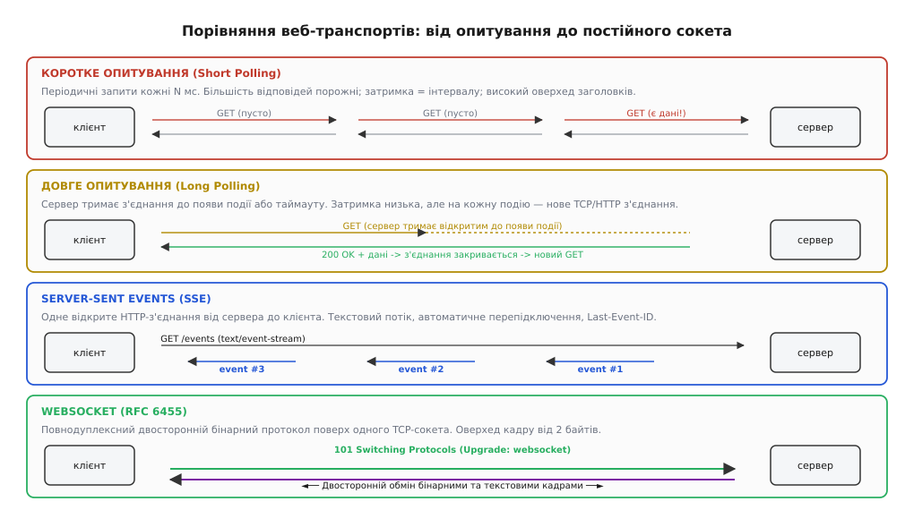
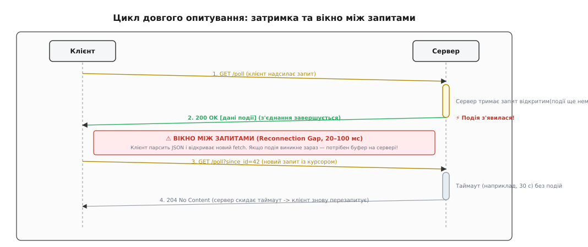
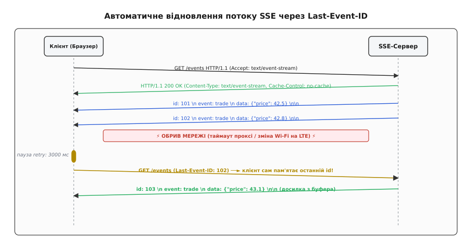
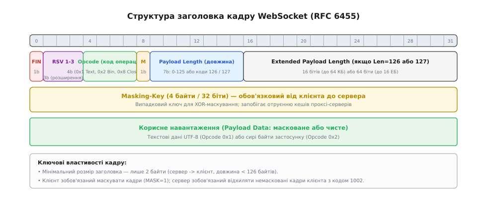
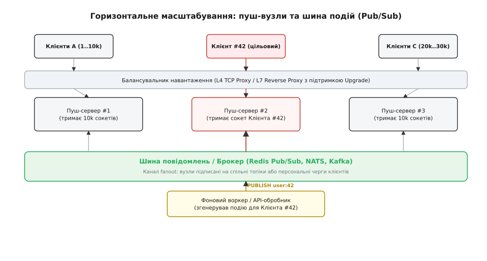

<preknowlist>
* [HTTP-протокол: структура запитів, відповідей та статусних кодів](book:programming/http)
* [REST-API: проектування ресурсів та моделі взаємодії](book:programming/rest-api)
* [Довгі операції: асинхронна обробка та опитування стану](book:programming/long-running-operations)
* [Фонові задачі: черги повідомлень та асинхронні воркери](book:programming/background-jobs)
* [Сесії і stateless: стан з'єднань та масштабування серверів](book:programming/sessions-state)
</preknowlist>

# Стрімінг результату: long-poll, SSE, WebSocket

У веб-сервісі з десятьма тисячами активних користувачів наївна перевірка нових повідомлень через звичайне періодичне опитування кожні дві секунди породжує п'ять тисяч HTTP-запитів на секунду. Кожен такий запит змушує браузер і сервер повторно передавати повний набір HTTP-заголовків, куки автентифікації та метадані клієнта обсягом близько 800 байтів, створюючи чотири мегабайти холостого мережевого трафіку щосекунди, навіть коли жодної нової події в системі не відбулося.

Більше того, користувач у такій схемі дізнається про зміну стану не миттєво, а в середньому через одну секунду після її появи на сервері. Якщо ж збільшити частоту запитів для зниження затримки до 100 мілісекунд, навантаження на процесор та стек TCP зросте у двадцять разів, перевантажуючи базу даних та шлюзи авторизації перевірками стану, який ще не змінився.


*Порівняння чотирьох транспортних моделей: періодичного опитування, довгого опитування, односпрямованого потоку SSE та повнодуплексного каналу WebSocket.*

Класична парадигма HTTP «запит — відповідь» (англ. *request-response*) є фундаментально напівдуплексною: сервер не має можливості ініціювати відправлення байтів до клієнта без попереднього запиту з боку браузера. Для подолання цього обмеження інженери розробили спеціалізовані протоколи та архітектурні шаблони потокової передачі даних у реальному часі: довге опитування (*Long-Polling*), односпрямовані серверні події (*Server-Sent Events*) та повнодуплексні сокети (*WebSocket*).

## Довге опитування (Long-Polling): емуляція проштовхування поверх HTTP

Найпростішим способом зменшити затримку сповіщення без відходу від традиційної інфраструктури HTTP є техніка довгого опитування (англ. *Long-Polling*). Клієнт надсилає звичайний HTTP-запит `GET` або `POST`, проте сервер не повертає негайну порожню відповідь, коли нових даних немає. Натомість обробник утримує відкрите TCP-з'єднання до того моменту, поки в системі не з'явиться нова бізнес-подія або поки не закінчиться встановлений внутрішній таймаут.

Щойно на бекенді публікується повідомлення, сервер формує повноцінну HTTP-відповідь із корисним навантаженням і закриває запит. Отримавши дані, клієнтський скрипт негайно обробляє їх і в той самий момент відкриває наступний запит, відновлюючи стан очікування.


*Послідовність утримання запиту та відновлення зв'язку при використанні довгого опитування (Long-Polling).*

### Механізм утримання та часова координація

Головна технічна вимога до бекенда при довгому опитуванні — здатність утримувати тисячі завислих з'єднань без виділення окремого системного потоку на кожен сокет (*thread-per-connection*). В операційних системах Linux стек одного системного потоку займає від 2 до 8 МБ пам'яті. Десять тисяч блокуючих потоків спожили б десятки гігабайтів оперативної пам'яті лише під стеки та паралізували б планувальник ядра перемиканнями контекстів.

Тому сервери довгого опитування будуються на базі асинхронного циклу подій (наприклад, `epoll` у Linux або `kqueue` у BSD). Коли надходить запит, обробник реєструє дескриптор сокета у внутрішньому реєстрі підписок і повертає керування в цикл подій. Потік процесора вивільняється для обслуговування інших запитів, а сокет залишається відкритим в очікуванні сигналу від шини подій.

Часові параметри довгого опитування вимагають узгодженого налаштування на всіх рівнях мережевого стека:
1. **Внутрішній таймаут сервера застосунку:** встановлюється в межах 20–25 секунд. Якщо за цей час подія не виникла, сервер повертає статус `204 No Content` або `304 Not Modified`, запобігаючи неконтрольованому обриву зв'язку.
2. **Таймаут проміжних проксі-серверів та балансувальників:** налаштування `proxy_read_timeout` у Nginx або таймаут неактивності у балансувальниках AWS ALB / Cloudflare мають перевищувати серверний інтервал (наприклад, 30–60 секунд), щоб проксі не генерував фальшиві помилки `504 Gateway Timeout`.
3. **Клієнтський таймаут таймера Fetch/XHR:** встановлюється трохи вище за таймаут проксі (наприклад, 35 секунд) для коректного перехоплення апаратних збоїв зв'язку.

### Втрати даних у вікні перепідключення та курсоризація

Між моментом, коли сервер завершує попередню HTTP-відповідь, і моментом, коли клієнтський браузер надсилає наступний запит, завжди існує часовий зазор — **вікно перепідключення** (англ. *reconnection gap*), що зазвичай триває від 10 до 150 мілісекунд через затримку проходження мережевих пакетів (RTT).

Якщо нова подія публікується саме в цей мілісекундний інтервал, на сервері немає активного сокета для цього користувача. Якщо сервер не зберігає історію, повідомлення буде безповоротно втрачено.

Для розв'язання проблеми втрат використовують **курсоризацію подій** (англ. *event cursoring*):
- Кожна подія на сервері отримує монотонно зростаючий числовий або часовий ідентифікатор `sequence_id` або `cursor`.
- Клієнт передає свій останній отриманий ідентифікатор у параметрах кожного нового запиту: `GET /poll?since_id=1042`.
- Приймаючи запит, сервер спершу перевіряє власне сховище або кеш: якщо в системі вже є події з номерами, більшими за `1042`, він не переходить у режим очікування, а негайно повертає наявний масив нових повідомлень.

Проте навіть із курсорами довге опитування залишається важким компромісом: кожне нове повідомлення змушує клієнт і сервер заново узгоджувати TCP-з'єднання (або повторно використовувати його через `Keep-Alive`) і заново парсити кілобайти текстових HTTP-заголовків. Детально про те, як веброзробники вигадували приховані фрейми й ActiveX-контроли до появи сучасних стандартів, можна дізнатися у статті про [історію переходу від трюків Comet до стандарту WebSocket](book:programming/streaming-push-transports/hist-comet-to-websocket.md).

## Server-Sent Events (SSE): односпрямований потік подій через HTTP

Для завдань, де дані рухаються виключно в один бік — від сервера до користувача (біржові котирування, стрічка сповіщень, прогрес тривалих генерацій штучного інтелекту, системні метрики), консорціум W3C та робоча група WHATWG стандартизували протокол **Server-Sent Events (SSE)**.

На відміну від довгого опитування, де кожен факт доставки розриває HTTP-відповідь, у протоколі SSE клієнт відкриває **одне-єдине довгоживуче HTTP-з'єднання**, яке залишається відкритим постійно. Сервер транслює повідомлення безперервним потоком, використовуючи стандартне блокове кодування (`Transfer-Encoding: chunked`).

### Мережевий контракт і протокольний формат

Клієнт ініціює з'єднання стандартним запитом `GET` із заголовком `Accept: text/event-stream`. Сервер підтверджує готовність передавати потік статусом `200 OK` із обов'язковими полями заголовків:

```http
HTTP/1.1 200 OK
Content-Type: text/event-stream; charset=utf-8
Cache-Control: no-cache
Connection: keep-alive
X-Accel-Buffering: no
```

Потік даних є простим текстовим форматом, закодованим у UTF-8. Кожна окрема подія складається з одного або кількох рядків формату `<поле>: <значення>` і **обов'язково завершується двома послідовними символами нового рядка** (`\n\n`).

Стандарт визначає чотири базові поля:
1. `data: <вміст>` — корисне навантаження повідомлення. Якщо повідомлення містить кілька рядків тексту або багаторядковий JSON, кожна лінія позначається префіксом `data:`, а клієнтський рушій автоматично склеює їх через символ `\n`.
2. `event: <назва>` — тип події. Дозволяє маршрутизувати повідомлення за конкретними іменованими слухачами в браузерному коді замість загального обробника.
3. `id: <значення>` — числовий або рядковий ідентифікатор події. Браузер запам'ятовує останній отриманий ідентифікатор для надійного відновлення зв'язку.
4. `retry: <мілісекунди>` — інтервал часу, який клієнт зобов'язаний зачекати перед спробою повторного підключення в разі обриву мережі.

Рядки, що починаються з двокрапки (`: keep-alive`), сприймаються як коментарі та ігноруються прикладним кодом. Сервер періодично надсилає їх у канал (наприклад, кожні 15 секунд), щоб запобігти закриттю сокета проміжними NAT-роутерами.


*Схема передачі та відновлення потоку подій за допомогою заголовка Last-Event-ID у протоколі Server-Sent Events.*

### Вбудована надійність і механіка Last-Event-ID

Головна перевага SSE над ручними реалізаціями поверх звичайного HTTP — наявність стандартизованого механізму відновлення з'єднання, вбудованого безпосередньо у браузерний рушій об'єкта `EventSource`.

Коли мережеве з'єднання обривається через перезавантаження проксі-сервера або короткочасну втрату сигналу Wi-Fi:
1. Об'єкт `EventSource` автоматично переходить у стан очікування на час, заданий останнім полем `retry` (за замовчуванням 3 секунди).
2. Браузер самостійно надсилає новий HTTP-запит `GET` до того самого URL, автоматично додаючи заголовок:
   ```http
   Last-Event-ID: 1042
   ```
3. Серверний бекенд зчитує заголовок `Last-Event-ID`, звертається до кільцевого буфера або журналу подій, знаходить усі повідомлення з номерами, більшими за `1042`, і миттєво відправляє їх у відкритий сокет, після чого продовжує передачу подій реального часу в прямому ефірі.

Увесь процес відновлення протікає прозоро для користувача без втрати жодного повідомлення.

### Вплив HTTP/1.1 проти HTTP/2 та HTTP/3

При використанні застарілого протоколу HTTP/1.1 у Server-Sent Events існує серйозне системне обмеження: усі сучасні браузери встановлюють жорсткий ліміт — **не більше 6 одночасних відкритих TCP-з'єднань до одного домену** (*per-domain connection limit*). Якщо користувач відкриє у браузері 6 вкладок веб-застосунку, кожна з яких тримає активний потік `EventSource`, сьома вкладка заблокує всі звичайні HTTP-запити на завантаження сторінок, картинок або виклики API.

Перехід на протокол **HTTP/2 або HTTP/3 повністю знімає цю проблему**. Завдяки вбудованому мультиплексуванню всі потоки SSE з різних вкладок або компонентів сторінки передаються як окремі логічні стріми всередині єдиного фізичного TCP- або QUIC-з'єднання. Детальні специфікації двійкових структур, заголовків та інтерфейсів доступні у статті про [повну довідку протоколів, двійкових фреймів та API](book:programming/streaming-push-transports/api-streaming-protocols.md).

## WebSocket: повнодуплексний двійковий протокол (RFC 6455)

Хоча Server-Sent Events ідеально підходить для доставки даних від сервера до клієнта, він залишається принципово односпрямованим. Якщо застосунок вимагає інтенсивного двостороннього обміну повідомленнями з мінімальною затримкою (інтерактивні чати, онлайн-ігри, спільне редагування документів, біржова торгівля з відправленням ордерів), SSE змушує клієнта надсилати зворотні дані окремими HTTP-запитами `POST`. Кожен такий запит створює додаткові 500–1000 байтів накладних витрат і вимагає обробки напівдуплексного циклу.

Протокол **WebSocket (RFC 6455)** створений спеціально для забезпечення повноцінного **повнодуплексного двостороннього каналу** (*full-duplex bidirectional communication*) поверх одного TCP-з'єднання.

### Рукостискання з оновленням протоколу (HTTP Upgrade Handshake)

З'єднання WebSocket починається зі стандартного HTTP/1.1-запиту, що дозволяє йому безперешкодно проходити крізь стандартні веб-порти 80 (HTTP) та 443 (HTTPS) і використовувати існуючу інфраструктуру маршрутизації:

```http
GET /chat HTTP/1.1
Host: api.example.com
Upgrade: websocket
Connection: Upgrade
Sec-WebSocket-Key: dGhlIHNhbXBsZSBub25jZQ==
Sec-WebSocket-Version: 13
Origin: https://app.example.com
```

Сервер перевіряє заголовки, домен у полі `Origin` та генерує криптографічну відповідь, що підтверджує готовність переключити протокол:

```http
HTTP/1.1 101 Switching Protocols
Upgrade: websocket
Connection: Upgrade
Sec-WebSocket-Accept: s3pPLMBiTxaQ1kYGzzhZRbK+xOo=
```

Значення заголовка `Sec-WebSocket-Accept` обчислюється шляхом конкатенації отриманого ключа `Sec-WebSocket-Key` зі стандартизованим рядком-GUID `258EAFA5-E914-47DA-95CA-C5AB0DC85B11`, взяття криптографічного гешу SHA-1 та його кодування у Base64. Після успішного обміну статусом `101` сторони припиняють використовувати HTTP-граматику і переходять на низькорівневе кадрування WebSocket.

### Бінарне кадрування (Framing Protocol)

На відміну від важких текстових HTTP-заголовків, кожен кадр WebSocket має мінімалістичний двійковий заголовок розміром від 2 до 14 байтів:


*Структура заголовка та бітові поля кадру протоколу WebSocket (RFC 6455).*

Ключові елементи структури кадру:
- **FIN (1 біт):** прапорець завершення повідомлення. Якщо повідомлення велике і розбите на кілька фрагментів, перший і проміжні кадри мають `FIN = 0`, а завершальний — `FIN = 1`.
- **Opcode (4 біти):** тип кадру. Розрізняють *інформаційні кадри* (`0x1` — текст UTF-8, `0x2` — сирі двійкові дані, `0x0` — кадр продовження) та *керівні кадри* (`0x8` — закриття з'єднання, `0x9` — Ping, `0xA` — Pong).
- **MASK (1 біт) та Masking-key (4 байти):** прапорець та ключ маскування. Згідно з RFC 6455, **усі кадри від клієнта до сервера обов'язково маскуються** операцією побайтового XOR із випадковим 4-байтовим ключем. Кадри від сервера до клієнта передаються без маски (`MASK = 0`).
- **Payload Length (7 бітів, 7+16 бітів або 7+64 біти):** змінна довжина тіла повідомлення, що дозволяє ефективно пакувати як крихітні повідомлення на кілька байтів, так і гігабайтні двійкові масиви.

Маскування клієнтських кадрів було введене для запобігання атакам на проміжні прозорі проксі-сервери (*Proxy Cache Poisoning*): випадковий XOR-ключ гарантує, що байти всередині TCP-потоку виглядають як білий шум і не можуть бути розпізнані старими кешуючими серверами як повторні HTTP-запити.

Детальну реалізацію низькорівневого розбору бітових полів, XOR-демаскування та кільцевого буфера розглянуто у матеріалі про [реалізацію брокера SSE та парсера кадрів WebSocket на C і C++](book:programming/streaming-push-transports/proj-streaming-server.md).

## Проходження крізь проксі-сервери, CDN та корпоративні фаєрволи

При розгортанні потокових сервісів у відкритому інтернеті головною перешкодою стають проміжні мережеві вузли (*middleboxes*): корпоративні фаєрволи з глибокою інспекцією пакетів (DPI), кешуючі проксі-сервери та мережі доставки контенту (CDN).

### Проблема проміжної буферизації

Класичні зворотні проксі (наприклад, Nginx або HAProxy) оптимізовані для традиційного веб-трафіку: вони намагаються прочитати з бекенда блок даних розміром 4–16 КБ і лише після цього відправити сформований TCP-пакет клієнту.

Якщо для потоку SSE або довгого опитування не вимкнути буферизацію, клієнт не отримуватиме події в реальному часі. Маленькі текстові повідомлення розміром по 100 байтів накопичуватимуться у внутрішньому буфері проксі хвилинами, поки сумарний обсяг не досягне розміру внутрішньої сторінки пам'яті.

Щоб гарантувати миттєве проштовхування байтів:
- Сервер зобов'язаний додавати заголовок `X-Accel-Buffering: no` (для Nginx).
- У конфігурації проксі встановлюють директиви `proxy_buffering off;` та `proxy_cache off;`.
- Вимикають проміжне стиснення Gzip для потокових ендпоінтів (`gzip off`), оскільки алгоритми компресії часто утримують байти у внутрішньому блоці до досягнення розміру словника.

### Критична роль TLS-шифрування (WSS та HTTPS)

Спроба використання нешифрованого протоколу WebSocket (`ws://` через порт 80) у мобільних мережах призводить до збою підключення у 15–25 % користувачів. Мобільні оператори часто встановлюють прозорі HTTP-проксі, які не підтримують заголовок `Upgrade` і намагаються інтерпретувати двійкові фрейми WebSocket як синтаксично некоректні HTTP-запити, негайно розриваючи TCP-з'єднання.

Використання захищеного протоколу **WSS (`wss://` через порт 443 із шифруванням TLS)** повністю усуває цю проблему. Для проміжних фаєрволів та проксі весь сеанс виглядає як непрозорий потік байтів стандарту TLS 1.3, завдяки чому кадри WebSocket проходять без перешкод і модифікацій.

## Механіка зворотного тиску (Backpressure) та повільні клієнти

У системах із високою інтенсивністю подій виникає проблема різної пропускної здатності учасників обміну. Якщо бізнес-сервіс генерує біржові котирування зі швидкістю 2000 повідомлень/с, а користувач підключений через перевантажену мобільну мережу 3G і вичитує сокет зі швидкістю 50 повідомлень/с, баланс швидкостей порушується.

Мережевий буфер операційної системи (`SO_SNDBUF`, типово 64–256 КБ) заповнюється за частки секунди. Щойно буфер переповнюється, неблокуючий системний виклик `send()` або `write()` повертає помилку `EAGAIN` / `EWOULDBLOCK`.

Якщо пуш-шлюз почне без обмежень акумулювати невідправлені події у чергах у пам'яті процесу, настане катастрофічне вичерпання оперативної пам'яті (*Out-Of-Memory Crash*).

Для керування зворотним тиском інженери застосовують три базові стратегії:
1. **Порогове скидання з'єднання (Disconnect Slow Consumer):** шлюз виділяє клієнту буфер фіксованого розміру (наприклад, 1000 повідомлень або 2 МБ). Якщо черга заповнюється повністю, клієнт вважається завислим, а сокет примусово розривається з кодом `1008 Policy Violation`.
2. **Згортання стану (Conflation / State Folding):** для даних, де важливе лише найсвіжіше значення (наприклад, поточна ціна акції або координати кур'єра на карті), шлюз не зберігає всі проміжні тіки, а перезаписує застаріле значення у черзі новим. Клієнт отримує меншу кількість повідомлень, але завжди актуальний зріз стану.
3. **Керування вікном на рівні клієнта:** у протоколі WebSocket браузерний об'єкт надає властивість `socket.bufferedAmount`. Якщо прикладний скрипт генерує дані швидше, ніж мережа здатна їх передати, `bufferedAmount` зростає. Клієнтський код повинен зупиняти нові виклики `send()`, поки `bufferedAmount` не впаде нижче безпечного порогу.

## Автентифікація та життєвий цикл авторизаційних сесій

У традиційній безстановій моделі HTTP кожен окремий запит супроводжується заголовком `Authorization: Bearer <JWT>`, який шлюз валідує за мікросекунди без збереження стану. У потокових з'єднаннях тривалість сесії може вимірюватися годинами або днями, що породжує специфічні інженерні проблеми безпеки:

1. **Термін придатності токенів (Token Expiration):** якщо клієнт підключився до WebSocket із JWT-токеном, термін дії якого закінчується через 15 хвилин, розривати з'єднання кожні 15 хвилин для повторного входу неприйнятно для користувача. Промислові шлюзи реалізують внутрішнє продовження сесії (*in-band token refresh*): клієнт надсилає керівний кадр із новим JWT до завершення старого, а шлюз оновлює внутрішній дескриптор авторизації без скидання TCP-сокета.
2. **Миттєве відкликання прав (Revocation & Ban):** якщо користувача заблоковано в системі або пароль скинуто, активний сокет не повинен залишатися відкритим до кінця доби. Для цього пуш-шлюзи підписуються на спеціальну системну шину подій безпеки (`security:revocations`). Отримавши сигнал про блокування `user_id`, шлюз знаходить локальний дескриптор і негайно закриває його з кодом `1008 Policy Violation`.

## Вплив на енергоспоживання мобільних пристроїв

Вибір транспорту для передачі даних суттєво впливає на час автономної роботи смартфонів. Радіомодуль мобільного зв'язку (LTE або 5G) не працює постійно на повну потужність. Він управляється кінцевим автоматом енергоспоживання ядра модема:
- **Active State (CONTINUOUS_TX/RX):** максимальне споживання енергії (сотні міліватів).
- **Short DRX (Discontinuous Reception):** проміжний режим очікування зі зниженим живленням.
- **Idle / RRC Inactive:** режим глибокого енергозбереження (кілька міліватів).

Коли пристрій надсилає або приймає хоча б один пакет, радіомодуль переходить у максимальний активний стан і залишається в ньому ще протягом 10–15 секунд після передачі останнього байта (*Radio Tail Time*) в очікуванні подальших даних.

Періодичне опитування (Polling) кожні 5–10 секунд постійно скидає таймер Tail Time, утримуючи радіомодуль у стані максимального струму нескінченно довго, що призводить до швидкого нагрівання та розряджання акумулятора.

Натомість постійні з'єднання SSE та WebSocket утримують сокет відкритим у стані повного мовчання. Радіомодуль мобільного пристрою переходить у режим глибокого сну і прокидається лише в момент, коли байти події фізично надходять від базової станції оператора.

## WebTransport: стрімінг нового покоління поверх QUIC (HTTP/3)

Незважаючи на високу ефективність WebSocket, у нього залишається фундаментальне обмеження, успадковане від транспорту TCP — **блокування початку черги** (англ. *Head-of-Line Blocking*).

Оскільки TCP гарантує сувору послідовність доставки байтів, втрата одного-єдиного IP-пакета на нестабільній мобільній мережі призводить до повної зупинки читання із сокета: операційна система відкладає видачу всіх наступних отриманих повідомлень доти, доки втрачений сегмент не буде повторно запрошений і доставлений.

Новий протокол **WebTransport (W3C / IETF)** працює поверх транспортного протоколу **QUIC** (UDP) у складі стека HTTP/3. Він надає веб-застосункам принципово нові можливості:
1. **Множинні незалежні стріми в одній сесії:** втрата пакета в одному стрімі не сповільнює доставку даних у сусідніх стрімах.
2. **Ненадійна передача датаграм (Datagrams):** можливість відправляти дані без гарантії доставки та без повторних відправлень (аналог сирого UDP для передачі відеокадрів або ігрових координат у реальному часі).
3. **Миттєве встановлення зв'язку:** 1-RTT або 0-RTT рукостискання завдяки суміщенню транспортного та TLS 1.3 рівнів.

WebTransport є перспективним стандартом для мультимедійних систем наступного покоління, тоді як для класичного веб-бекенда основними робочими інструментами залишаються SSE та WebSocket.

## Горизонтальне масштабування пуш-шлюзів

Головна архітектурна проблема систем реального часу при зростанні навантаження — **наявність стану з'єднань (Stateful Connections)**. У класичному безстановому (*stateless*) REST-API будь-який сервер кластера може обробити будь-який вхідний запит. У випадку ж довгоживучих з'єднань (SSE чи WebSocket) клієнт фізично прив'язаний до конкретного серверного вузла, на якому відкрито його TCP-дескриптор.

Якщо користувач А підключений до *Вузла 1*, а користувач Б — до *Вузла 2*, сервер *Вузол 1* не має прямого доступу до сокета користувача Б для доставки йому сповіщення.


*Горизонтальне масштабування пуш-шлюзів через розподілену шину повідомлень Redis або NATS.*

### Шаблон розподіленої шини публікацій (Pub/Sub Broker)

Для координації розрізнених серверних вузлів застосовують архітектурний шаблон **Publish/Subscribe через центральну шину повідомлень** (Redis Pub/Sub, NATS, RabbitMQ або Apache Kafka):

1. **Розділення ролей:**
   - **Пуш-шлюзи (Edge Push Gateways):** легковагові вузли, чиє єдине завдання — утримувати сотні тисяч відкритих клієнтських сокетів, перевіряти авторизацію та виконувати кадрування протоколу.
   - **Сервіси бізнес-логіки (Core Backend):** генерують бізнес-події (наприклад, зміну статусу замовлення) та публікують їх у відповідний топік брокера (наприклад, `channel:user_9812`).
2. **Маршрутизація доставки:**
   - Кожен пуш-шлюз підписується на події тих користувачів, які в даний момент фізично тримають відкриті з'єднання саме на цьому вузлі.
   - Коли в шину NATS чи Redis надходить повідомлення, брокер розсилає його лише тим шлюзам, де є активні підписники, а шлюз транслює байти у відповідні клієнтські сокети.

### Керування ресурсами ядра Linux та проблема C1000K

При масштабуванні кластера шлюзів до сотень тисяч і мільйонів одночасних підключень (*C1000K Problem*) критично важливими стають системні параметри операційної системи:

1. **Ліміти файлових дескрипторів ядра:** кожен відкритий сокет є файловим дескриптором. Системні обмеження `nofile` у `/etc/security/limits.conf` та `sysctl fs.file-max` мають бути збільшені до мільйонних значень (наприклад, `fs.file-max = 2097152`).
2. **Пам'ять буферів сокета:** параметри `sysctl net.ipv4.tcp_rmem` та `net.ipv4.tcp_wmem` оптимізують для мінімізації базового розміру буфера на неактивних каналах (наприклад, виділяючи 4 КБ замість типових 128 КБ), що дозволяє утримувати 100 000 з'єднань у межах кількох гігабайтів оперативної пам'яті.
3. **Запобігання лавиноподібним перепідключенням (Thundering Herd):** якщо один із серверних вузлів падає або перезавантажується, 50 000 клієнтів одночасно намагаються перепідключитися до вцілілих серверів. Без спеціального захисту кластер зазнає каскадного збою. Клієнтські бібліотеки зобов'язані реалізовувати алгоритм **експоненційного бекоффу з повним випадковим джитером (Full Jitter Backoff)**, розмазуючи навантаження перепідключення у часі.

## Інженерна матриця вибору технології

Вибір конкретного транспорту для передачі даних у реальному часі визначається вимогами бізнес-домену, напрямком потоку та наявною мережевою інфраструктурою:

| Критерій порівняння | Довге опитування (Long-Polling) | Server-Sent Events (SSE) | WebSocket (RFC 6455) | WebTransport (QUIC) |
| :--- | :--- | :--- | :--- | :--- |
| **Напрямок зв'язку** | Емуляція двостороннього через цикли запитів | Суворо односпрямований (Сервер -> Клієнт) | Повнодуплексний двосторонній | Повнодуплексний багатопотоковий |
| **Формат даних** | Текст або двійкові (Base64 / Multipart) | Текст UTF-8 (зазвичай JSON) | Текст UTF-8 або сирий Binary | Binary Streams або Datagrams |
| **Оверхед на повідомлення** | 500–1000 байтів (повні HTTP-заголовки) | 10–30 байтів (префікси `data:` та `\n\n`) | 2–14 байтів (двійковий фрейм) | 1–3 байти (QUIC frame overhead) |
| **Автоматичне перепідключення** | Вимагає ручного коду в клієнті | Вбудовано в браузер (`EventSource` + `Last-Event-ID`) | Вимагає сторонньої бібліотеки | Реалізується на рівні клієнта |
| **Сумісність із проксі та CDN** | 100% (звичайний HTTP) | Відмінна (працює через стандартний порт 443) | Добра (вимагає підтримки директиви `Upgrade`) | Обмежена (вимагає дозволу UDP-трафіку на 443) |
| **Підтримка HTTP/2 / HTTP/3** | Стандартні запити | Мультиплексування сотень потоків в один сокет | Не мультиплексується (окремий TCP-сокет) | Нативна робота поверх HTTP/3 |
| **Складність реалізації** | Низька | Низька (стандартний HTTP-стек) | Середня (власний протокол кадрування) | Висока (новий API, стек QUIC) |

### Рекомендовані сценарії застосування

- **Обирайте Server-Sent Events (SSE):** для генеративних відповідей LLM та чат-ботів, стрічок новин, системних сповіщень, біржових котирувань та панелей моніторингу метрик, де дані генеруються сервером, а клієнт лише відображає актуальний стан. Завдяки роботі поверх стандартного HTTP/2 це найбільш надійне, просте в налагодженні та енергоефективне рішення для веб-інтерфейсів.
- **Обирайте WebSocket:** для інтерактивних багатокористувацьких чатів, кооперативних графічних редакторів (наприклад, спільна робота над макетами), трейдингових терміналів з активним поданням заявок та браузерних онлайн-ігор, де критична мінімальна затримка в обидва боки та передача компактних двійкових структур даних.
- **Обирайте Long-Polling:** виключно як резервний аварійний канал (*fallback transport*) для застарілих корпоративних мереж або специфічних середовищ, де корпоративні фаєрволи блокують протокол WebSocket та розривають потокові з'єднання HTTP.
