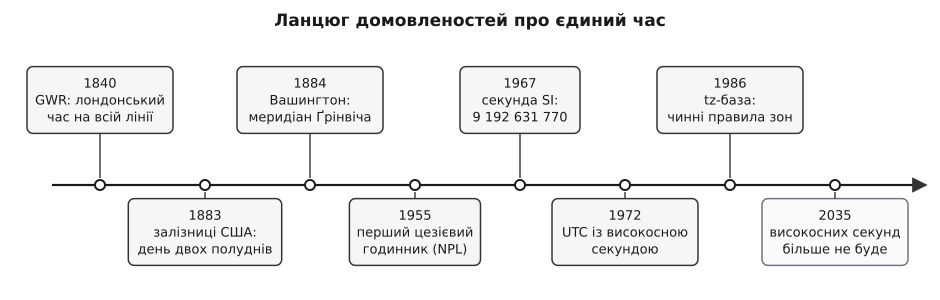
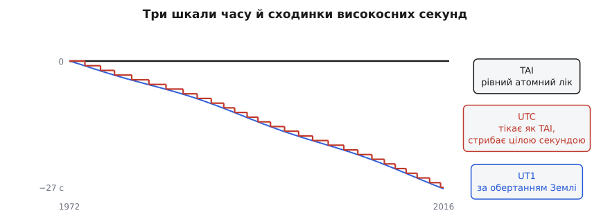

# 📜 Як людство домовилося про єдиний час

Рядок `Europe/Kyiv` у налаштуваннях сервера — остання ланка суперечки, що тривала півтора століття: чий полудень справжній, чим міряти секунду і хто взагалі має право це вирішувати. Історія тут не окраса: майже кожна дивина сучасного часу — і зона, названа містом, а не числом, і високосна секунда, і база правил, яку доводиться оновлювати кілька разів на рік, — з'явилася як відповідь на конкретну незручність конкретних людей. Без цього приводу вона виглядає примхою; з ним — єдиним можливим виходом.


*Ланцюг домовленостей: кожна ланка з'являлася тоді, коли попередня переставала витримувати нову швидкість.*

## Коли полудень у кожного був свій

Спершу час ні з ким не узгоджували, бо не було з ким. Полудень — це мить, коли Сонце стоїть найвище над **цим** місцем; за ним вивіряли міський годинник, і жодного іншого орієнтира не бракувало. Сонце йде небом зі сходу на захід, тож у місті за сотню кілометрів на захід полудень настає на кілька хвилин пізніше — і це не похибка годинника, а сама суть місцевого часу. У Британії розбіжність із ґрінвіцьким часом виглядала так: Оксфорд — п'ять хвилин позаду, Лідс — шість, Бристоль — десять, Карнфорт — одинадцять, Барроу — майже тринадцять.

Нікому це не заважало, поки новина рухалася зі швидкістю коня: доки лист із Бристоля доїде до Лондона, десять хвилин різниці нічого не важать. Розбіжність стає видимою лише тоді, коли щось починає долати відстань швидше, ніж набігає розходження годинників. Таких швидких речей з'явилося одразу дві й майже водночас — залізниця й телеграф.

## Залізниця, яка не могла жити з двома полуднями

Розклад — це стовпчик чисел, який мусить означати те саме на обох кінцях лінії. Але справжня біда була не в незручності пасажира, а в безпеці: на одноколійних дільницях потяги розводили **за часом** — черговий випускав наступний склад через стільки-то хвилин після попереднього. Якщо годинник на сусідній станції відстає на десять хвилин, увесь захисний проміжок з'їдено, і два потяги опиняються на одній колії. Тому залізниця не могла чекати, доки до згоди дійде держава.

Вона й не чекала. У листопаді 1840 року Great Western Railway перейшла на лондонський час по всій лінії. 22 вересня 1847-го Railway Clearing House ухвалила запровадити ґрінвіцький час на всіх станціях, щойно дозволить пошта, і вже з 1 грудня того ж року на нього перейшли London and North Western та Caledonian. До 1855-го за Ґрінвічем жили 98% британських міст. А закон наздогнав це аж 2 серпня 1880 року, коли королівську згоду дістав Statutes (Definition of Time) Act. Сорок років країна користувалася стандартом, якого не існувало в праві: його тримала не держава, а галузь, якій він був потрібен, щоб не вбивати людей.

Одразу постало питання, яке нікуди не поділося: як **доправити** цей час до кожного, кому він потрібен. Телеграф розсилав сигнал по станціях, у портах опівдні падала часова куля — та не в кожного під вікном була станція чи порт. Тому в Лондоні понад століття працювала служба, яка сьогодні звучить як анекдот, а тоді була нормальним бізнесом. 1836 року Джон Генрі Белвілл (англ. *John Henry Belville*) почав носити точний час клієнтам: щоранку звіряв кишеньковий хронометр роботи Джона Арнольда 1794 року за обсерваторією в Ґрінвічі й обходив підписників, щоб ті виставили свої годинники за його. Після його смерті справу вела вдова Марія, а з 1892-го — дочка Рут Белвілл (англ. *Ruth Belville*), яка називала хронометр «містером Арнольдом» і носила його клієнтам аж до 1940 року. Брала вона близько 4 фунтів на рік — майже вчетверо дешевше за поштову передплату на час, що коштувала 15.

Це і є вся служба часу до появи мереж: хтось один звіряється з еталоном, а потім розносить його копії, і кожна копія дорогою трохи псується. Та сама задача сьогодні розв'язується [протоколом мережевої синхронізації часу](topic:communications/ntp-sync) — машина періодично питає точніший годинник, за часом подорожі пакета оцінює затримку, а поправку вносить поступовим підкручуванням ходу, а не стрибком (перший опис NTP вийшов як RFC 958 у вересні 1985 року, автор — Девід Міллс, англ. *David L. Mills*). Рут Белвілл робила те саме пішки, і затримкою в неї була дорога від Ґрінвіча.

## День двох полуднів

В Америці та сама причина дала гостріший наслідок: відстані більші, залізничних компаній багато, і кожна тримала власний час — зазвичай той, що показував годинник у місті її управління. На вокзалі, куди заходило кілька компаній, висіло кілька годинників, і всі показували різне.

Готові проєкти лежали на столі не перший рік. 1870 року Чарлз Ф. Дауд (англ. *Charles F. Dowd*) виклав систему з чотирьох поясів, відлічених від меридіана Вашингтона, а 1872-го переробив її на ґрінвіцький. 8 лютого 1879 року Сендфорд Флемінг (англ. *Sandford Fleming*) — шотландець із Кірколді, що переїхав до Канади вісімнадцятирічним, — прочитав у Канадському інституті в Торонто дві доповіді про світову систему з 24 поясів по годині кожен, тобто по 15° довготи, позначених літерами від A до Y без J, де ґрінвіцький діставав літеру G. Біографії переповідають, що поштовхом став потяг, який Флемінг проґавив 1876 року в Ірландії через друкарську помилку в розкладі — там стояло p.m. замість a.m. Епізод правдоподібний і повторюваний, але вагу «причини всієї реформи» йому надала вже традиція переказу, а не документи; самі доповіді 1879 року — факт, що перевіряється.

Зрушив справу не проєкт, а страх регулювання. Вільям Ф. Аллен (англ. *William F. Allen*), секретар General Time Convention — об'єднання, у якому залізниці узгоджували розклади, — доводив колегам, що п'ятипоясну систему північноамериканським дорогам краще запровадити самим, бо інакше це зробить уряд. Аргумент подіяв. У неділю 18 листопада 1883 року за телеграфним сигналом з Аллеґенської обсерваторії в Піттсбурзі, поданим рівно опівдні за 90-м меридіаном, залізниці США й Канади перевели годинники на нову систему. У містах, що лежали східніше від опорного меридіана свого поясу, стрілки посунули назад — і полудень настав там двічі. Звідси й назва цього дня.

Держава підтягнулася через тридцять п'ять років: у США пояси стали законом лише зі Standard Time Act 1918 року, який заразом запровадив і переведення на літній час. Двічі поспіль, на двох континентах, послідовність була однакова: спочатку домовленість тих, кому вона потрібна щодня, потім її вимушене визнання.

## Меридіан, від якого рахують

Пояси всередині країни мають сенс лише тоді, коли є спільна точка відліку. Її обирали 1 жовтня 1884 року у Вашингтоні: 26 держав, 41 делегат. Ґрінвіцький меридіан ухвалили 22 голосами; проти був один (Сан-Домінго), утрималися два — Франція і Бразилія. Окрему пропозицію обрати «нейтральний» меридіан, який не належав би жодній державі, провалили: 3 голоси проти 21. Прийняли також всесвітню добу, що починається опівночі за початковим меридіаном, — 23 голоси за, 2 утрималися.

Франція трималася до останнього. Всесвітню добу за Ґрінвічем вона визнала аж 1911 року, та навіть тоді уникала самої назви: у законі писали не «ґрінвіцький час», а «середній паризький час, відсталий на 9 хвилин 21 секунду». Число те саме — ім'я інше. Це не дрібниця й не примха: коли стандарт водночас є чиїмось прапором, за його прийняття платять самолюбством, і ця плата може відкласти згоду на десятиліття.

А тепер найважливіше для всього подальшого. Конференція **відмовилася** запроваджувати часові пояси: вона постановила, що місцевий час — справа місцева й поза її повноваженнями. Тобто у світі немає й ніколи не було органу, який вирішує, о котрій у вас на стіні. Є спільний нуль, від якого всі рахують, — і є суверенне право кожної держави будь-коли пересунути свій зсув, запровадити чи скасувати літній час, перескочити лінію зміни дат. Із цієї відмови 1884 року й виросла згодом потреба в базі даних: те, що ніхто не централізував, доводиться комусь **записувати**.

## Секунда, що відірвалася від Землі

Паралельно точилася інша суперечка — не про те, звідки рахувати, а про те, чим міряти. Секунда була часткою доби: 1/86400 середньої сонячної доби. Це визначення спирається на мовчазне припущення, що планета обертається рівно.

Припущення трималося рівно доти, доки найкращий годинник людства був гіршим за планету. Щойно в лабораторії з'явився генератор, стабільніший за саме обертання, — спершу [кварцовий резонатор](topic:electronics/quartz-resonator) (пластинка кварцу, що коливається на власній частоті й тримає її незрівнянно краще за маятник), а потім атомний, — те, що раніше здавалося похибкою приладу, виявилося похибкою Землі. Планета обертається нерівно: припливи гальмують її, перерозподіл мас усередині й на поверхні змінює хід на частки мілісекунди за добу. Еталон, який сам хитається, більше не годився.

Секунду переселяли двічі. Спочатку — з обертання Землі на її обіг навколо Сонця: ефемеридна секунда була часткою року, а не доби, бо орбіта поводиться значно рівніше за дзиґу. Потім — з неба до атома. 1955 року в Національній фізичній лабораторії Британії Луїс Ессен (англ. *Louis Essen*) запустив перший цезієвий годинник; 1958-го він і Джек Перрі (англ. *Jack Parry*) разом з американськими астрономами Вільямом Марковіцем (англ. *William Markowitz*) і Голлом опублікували працю, де прив'язали частоту цезію до ефемеридної секунди. А 1967 року XIII Генеральна конференція з мір і ваг ухвалила означення, чинне й досі.

```
секунда за обертанням Землі:  1/86400 середньої сонячної доби   (планета крутиться нерівно)
секунда ефемеридна:           частка обігу Землі навколо Сонця   (рівніше, але міряти важко)
секунда SI (з 1967):          9 192 631 770 коливань цезію-133   (однакова в кожній лабораторії)
```

Число 9 192 631 770 виглядає випадковим — таким воно і є. Його не знайшли в природі: його **підібрали** так, щоб нова, атомна секунда збіглася зі старою, ефемеридною, у межах точності вимірювань кінця 1950-х. [Атомний годинник](topic:physics/atomic-clock) — прилад, що ловить не коливання маятника чи кварцу, а частоту переходу між надтонкими рівнями атома, ту саму в кожного атома цезію-133 у будь-якій точці світу, — один раз відкалібрували по планеті. І відпустили.

> 🔧 **Навіщо це.** З цієї миті існує дві незалежні шкали часу: атомна, яка тікає ідеально рівно, і астрономічна, прив'язана до реального положення Землі. Вони розходяться — повільно, але невпинно, і жодне визначення не може задовольнити обидві. Усе, що коїться з часом далі, — це способи латати ту щілину; а кожна латка колись вилазить у чиємусь коді.

## UTC: компроміс між атомом і планетою

1 січня 1960 року почалося узгодження світових передавань часу й частоти, а 1961-го цей процес почало координувати Міжнародне бюро часу. Спосіб узгодження був химерний: щоб трансльований час не відбігав від планети, підправляли **сам хід** — секунда в ефірі була трохи довшою або коротшою за атомну, і час від часу до цього додавали дрібні стрибки. Ті секунди так і прозвали гумовими: шкала розтягувалася й стискалася, аби лишатися схожою на небо.

Назву узгодили 1967 року, коли CCIR ухвалив англійське *Coordinated Universal Time* і французьке *Temps Universel Coordonné* зі скороченням UTC. Скорочення не відповідає жодній із двох мов: з англійської вийшло б CUT, із французької — TUC. UTC — це те, що однаково не влаштовує обидві сторони, і в цьому вся суть міжнародних стандартів.

Реформа настала 1 січня 1972 року й тримається донині. Гумові секунди скасували: хід UTC зробили точно таким, як в атомної шкали TAI, а різницю зафіксували цілим числом — 00:00:00 UTC того дня дорівнювало 00:00:10 TAI. Відтоді єдина дозволена поправка — ціла **високосна секунда**, яку вставляють, коли UTC відбігає від UT1 (часу за фактичним обертанням Землі) більш ніж на 0.9 секунди.

```
TAI — рівний атомний лік, жодних поправок
UT1 — час за фактичним обертанням Землі, хід нерівний
UTC — тікає точно як TAI, але цілими секундами тримається біля UT1

1972-01-01 00:00:00 UTC = 00:00:10 TAI   (стартова різниця)
+ 27 високосних секунд, остання 2016-12-31
= UTC нині на 37 секунд позаду TAI
```


*Схема ходу трьох шкал: UTC успадковує рівний хід від атома, а сходинками наздоганяє планету.*

Перша високосна секунда припала на 30 червня 1972 року; усього їх додали 27, останню — 31 грудня 2016-го. Кожна з них — це хвилина, у якій 61 секунда, і позначка `23:59:60`, якої не передбачає жодна наївна перевірка діапазону. 30 червня 2012 року, після чергової вставки, посипалися Reddit (на Cassandra), Mozilla (на Hadoop), Qantas і чимало серверів на Linux: код і ядро не чекали, що секунда може повторитися.

Найпопулярніший обхід придумали в Google: замість вставляти зайву секунду, її **розмазують** — протягом доби навколо вставки всі секунди роблять трішки довшими, тож повторюваної позначки часу не виникає взагалі. Ціна — годинник свідомо йде трохи неправильно цілу добу; виграш — він жодної миті не йде назад, а саме зворотний хід ламає програми найдужче.

Зрештою метрологи вирішили прибрати причину. 18 листопада 2022 року Генеральна конференція з мір і ваг ухвалила Резолюцію 4: збільшити дозволену розбіжність між UT1 і UTC у 2035 році або раніше, гарантувавши при цьому неперервність UTC щонайменше на століття. Простими словами — високосну секунду скасовують. Планеті дозволять відбігти від атомної шкали на скільки завгодно (за століття це порядок хвилин), бо виявилося, що синхронність із небом коштує людству дорожче, ніж кілька хвилин розбіжності з ним.

## База, яку веде не уряд

Тепер видно, чому «котра година в цьому місці» неможливо порахувати формулою. Спільний нуль є, рівна секунда є — а от зсув конкретного міста від цього нуля не виводиться нізвідки: це рішення парламенту або уряду, ухвалене з політичних, економічних чи енергетичних міркувань і скасовне будь-коли. Отже, програмі потрібна не формула, а **літопис** таких рішень.

Такий літопис почав вести Артур Девід Олсон (англ. *Arthur David Olson*): витоки проєкту сягають 1986 року або раніше, а найдавніший документований лист датований 16 грудня 1986-го. База, разом із довідковим кодом, від початку була в суспільному надбанні — свідомо, щоб її міг покласти в себе будь-хто без перемовин про ліцензію. Пол Еґґерт (англ. *Paul Eggert*) — редактор і супровідник із 2005 року; саме він спроєктував схему імен «область/місце» (`America/New_York`, `Europe/Paris`), де кожна частина не довша за 14 символів.

Наскільки крихкою була ця конструкція, стало видно 30 вересня 2011 року, коли фірма Astrolabe подала на супровідників позов про порушення авторських прав на історичні відомості про пояси. Реакція була швидка: 14 жовтня 2011 року ICANN узяла супровід бази на себе, а 22 лютого 2012-го позивач сам відкликав позов. У лютому 2012-го вийшов RFC 6557 «Procedures for Maintaining the Time Zone Database», який уперше записав процедуру: хто такий координатор бази, де лежить сховище IANA, як підписують випуски. Доти час усього світового софту тримався на кількох людях без жодної інституції за спиною — і одного позову вистачило, щоб це похитнути.

Далі — робочий ритм, який добре показують кілька випадків.

- **Самоа, 2011.** Наприкінці четверга 29 грудня в країні одразу настала субота 31-го: п'ятниці 30 грудня 2011 року там просто не було. Держава перескочила лінію зміни дат, перейшовши з UTC−11 на UTC+13, щоб робочий тиждень збігався з Новою Зеландією, Австралією й Китаєм. Жодна формула такого не передбачить — це можна лише записати.
- **Перейменування 2022 року.** У випуску 2022b, оголошеному 11 серпня 2022-го, `Europe/Kiev` став `Europe/Kyiv` — з поясненням, що в англійській тепер уживанішим є «Kyiv». Старі написання не викидають: їх лишають у файлі `backward`, тож застосунок зі старим ключем не ламається, а нові дані отримує ті самі.
- **Європейський Союз.** В опитуванні, що тривало з 4 липня до 16 серпня 2018 року, узяли участь 4.6 мільйона людей, більшість — за скасування сезонного переведення годинників. 26 березня 2019-го Європарламент схвалив відмову від нього з прицілом на 2021 рік. Станом на березень 2026-го Рада ЄС так і не ухвалила директиви — тож годинники в Європі переводять далі.
- **Україна.** 16 липня 2024 року Верховна Рада проголосувала за відмову від переведення годинників, але президент закону не підписав — і переведення лишилося чинним.

Два останні приклади варті окремої уваги, бо саме вони пояснюють, чому база оновлюється так часто й так пізно. Голосування ще не робить правило правилом: між наміром і чинною нормою стоять підпис, публікація й дата набрання чинності, і будь-яка з цих ланок може не спрацювати або зсунутися. Тому tz-база фіксує не оголошені плани, а те, що справді діяло й діє, — і кожна така новина спричиняє новий випуск.

> 🔧 **Навіщо це.** Версія tz-бази — частина ваших вхідних даних, а не деталь операційної системи. Той самий звіт, перерахований через рік на оновленому образі, може дати інші межі доби для тих самих користувачів — не через ваш код, а через те, що якийсь парламент ухвалив рішення. Тому версію бази фіксують разом із залежностями, оновлюють свідомо й пам'ятають, що старий образ у контейнері живе з часом позаминулого року.

## Наш власний нуль

Наостанок — про число, з якого починається час у більшості програм. Воно теж має історію, і теж не природну.

У першому виданні керівництва Unix (1971) виклик `time` повертав шістдесяті частки секунди, відлічені від 1 січня 1971 року. Тобто нуль спочатку був іншим, а такт — у шістдесят разів дрібнішим. Довго це прожити не могло: у 32 біти такий лік уміщався приблизно на 2.26 року, тож криза переповнення наставала б частіше, ніж виходило нове видання керівництва. Такт зробили цілою секундою, а нуль пересунули на 1 січня 1970 року — дату обрали просто як зручну, без жодного глибшого сенсу.

Так само й з усіма іншими ланками цього ланцюга. Ні початковий меридіан, ні довжина секунди, ні момент переведення стрілок, ні навіть нуль лічильника не були знайдені в природі — усі вони ухвалені, кожен зі своєї причини й у свій рік. Тому час у програмі й доводиться брати з бази, яку хтось веде, а не з формули, яку можна вивести.
