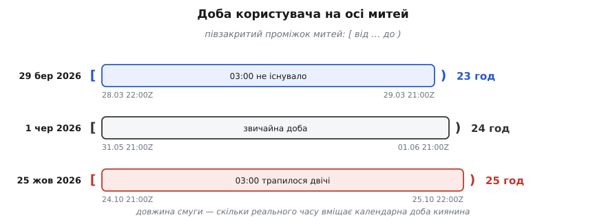

# ⚙️ Обіг через межу: настінний час → мить → база → напис назад

Ось повний код одного обігу часу в сервісі нагадувань — від поля форми до рядка в базі й назад до напису на екрані кожного читача, — і разом із ним два дні на рік, коли переклад «настінний час → мить» дає не одну відповідь, а жодної або дві.

---

## Що має працювати

Оксана в Києві створює нагадування на 25 жовтня 2026 року, 03:30. Ярема в Токіо доданий до цього нагадування спостерігачем: у своєму списку він має побачити ту саму подію, підписану своїм годинником. Наприкінці місяця Оксана відкриває звіт «що спрацювало 25 жовтня» — за свою добу, а не за добу сервера.

Сервер стоїть у Франкфурті, база — у Вірджинії, розробник відкриває ноутбук у Львові. Жоден із цих трьох поясів не має стосунку до жодної з трьох відповідей — і саме тому так легко не помітити, як вони туди потрапляють: пояс процесу бібліотеки підставляють мовчки, коли ви не сказали, який брати.

## Дві межі й чисте ядро

Усередині сервіс оперує лише миттями: `number` мілісекунд, `Instant`, `datetime` з `tzinfo=UTC`. Мить не має зони й не потребує її — це точка на світовій осі. Настінний час живе рівно у двох місцях: там, де розбирають ввід, і там, де малюють вивід. Між ними його немає взагалі.

Звідси інваріант, який варто вміти перевіряти оглядом коду: **у ядрі не існує настінного значення без зони поруч**. Якщо десь у сервісному шарі з'явився `LocalDateTime`, наївний `datetime` чи рядок `"2026-10-25 03:30"` без сусіднього поля зони, — це вже помилка, просто ще не спрацювала.

Далі три шматки коду по одному на ділянку обігу: вхідна межа, сховище, вихідна межа. Потім окремо звіт — бо «доба користувача» виявиться не одиницею часу, а проміжком митей, і не завжди двадцятичотиригодинним.

## Вхідна межа: рядок без зони — ще не час

Найкоротший шлях від форми до бази виглядає так: узяти рядок з тіла запиту й дати його конструкторові дати. Ось що з цього виходить.

**Пастка: рядок без зони мовчки бере пояс процесу.**

```
рядок із форми:   "2026-06-01T09:00"      (людина мала на увазі Київ)

у контейнері без змінної TZ (UTC):  → 2026-06-01T09:00Z
на сервері у Франкфурті (+02:00):   → 2026-06-01T07:00Z
на ноутбуці розробника (+03:00):    → 2026-06-01T06:00Z  ← випадково правильно
```

Один рядок дає три різні миті — розбіжність до трьох годин, залежно від того, де запустили процес. Найгірше тут не сама помилка, а те, що на машині розробника її не видно: його ноутбук стоїть у тому самому поясі, що й тестовий користувач, тож локально все сходиться. Розходитися воно починає рівно при переїзді в продакшн і виглядає як «нагадування приходять не тоді».

Ліки — сувора вимога до підпису функції: **переклад не має права дивитися на пояс процесу**. Зона приходить окремим аргументом і подорожує в парі з настінним часом, від браузера до бази. Тіло запиту виглядає так:

```json
{ "local": "2026-10-25T03:30", "zone": "Europe/Kyiv" }
```

Клієнт бере назву зони не з припущень, а з системи: у браузері це `Intl.DateTimeFormat().resolvedOptions().timeZone`. Зсув `+03:00` у тілі запиту не потрібен — він виводиться з пари «настінний час + зона», а от зворотний вивід неможливий: зі зсуву зони не дістати.

### Переклад — це не функція

Тепер головне про вхідну межу. Пара «настінний час + зона» не завжди дає одну мить.

```
Europe/Kyiv, 2026 (за правилами чинної tz-бази)

29 березня, 01:00 UTC:   03:00 (+02:00)  →  04:00 (+03:00)
    настінних 03:00…03:59 того дня не існує — жодної миті
25 жовтня,  01:00 UTC:   04:00 (+03:00)  →  03:00 (+02:00)
    настінні 03:00…03:59 трапляються двічі — дві миті
```

Оксанине нагадування на 03:30 впало рівно в друге вікно. Йому відповідають дві миті: `2026-10-25T00:30Z` і `2026-10-25T01:30Z`, між ними година реального часу, і обидві мають повне право називатися «25 жовтня, 03:30 за Києвом».

Ці вікна не завжди годинні й не завжди нічні. На острові Лорд-Гау (Lord Howe, зона `Australia/Lord_Howe`) стрілки переводять на пів години: 4 жовтня 2026 року настінних 02:00…02:29 не існує, а 5 квітня настінні 01:30…01:59 трапляються двічі. У Сантьяго (`America/Santiago`) стрибок припадає на північ: 6 вересня 2026 року місцевої 00:00 просто не буває — і код, що будує «початок доби» як 00:00, дістає неіснуючий час на рівному місці.

Отже, у функції перекладу три можливі відповіді, і разом із миттю вона мусить повертати, яка з трьох це була:

- **одна мить** — звичайний випадок;
- **діра**: жодної миті. Розумна політика — зсунути вперед на довжину діри, тобто взяти зсув, що діяв *до* переходу. Для 03:30 у Києві це дасть 04:30;
- **накладання**: дві миті. Розумна політика — узяти першу, тобто знову той зсув, що діяв *до* переходу.

Обидві політики — одне правило: **бери зсув, що діяв до переходу**. Це не збіг. У дірі зсув зростає, тож менший (доперехідний) зсув відносить мить далі вперед; у накладанні зсув спадає, тож більший (доперехідний) зсув дає раніше з двох входжень. Одна фраза покриває обидва дні на рік.

Лишається механіка: як узагалі дізнатися, який зсув діяв до переходу, не маючи доступу до таблиці переходів? Через саму зону. Візьміть зсув, що діє за добу *до* цього настінного часу, і зсув, що діє за добу *після*: між ними лежать усі зсуви, які тут узагалі можливі, бо двічі на добу правила не міняються. Кожен із них дає кандидата-мить. Кандидат дійсний тоді й лише тоді, коли зона на цій миті показує саме той зсув, з якого його порахували, — тобто напис повертається сам у себе. Дійсних кандидатів рівно стільки, скільки відповідей: нуль, один або два.

:::tabs
```ts
// Межа: настінний час ↔ мить. Тільки стандартний Intl, без залежностей.
type Wall = { y: number; mo: number; d: number; h: number; mi: number };
type Kind = "exact" | "gap" | "ambiguous";
type Resolved = { instant: number; kind: Kind };   // instant — мілісекунди епохи

const MINUTE = 60_000;
const DAY = 24 * 60 * MINUTE;

// Побудова форматувальника коштує на порядок дорожче за саме форматування — кешуємо.
const fmtCache = new Map<string, Intl.DateTimeFormat>();
function cachedFmt(key: string, make: () => Intl.DateTimeFormat): Intl.DateTimeFormat {
  let f = fmtCache.get(key);
  if (!f) { f = make(); fmtCache.set(key, f); }
  return f;
}

/** Зсув зони для КОНКРЕТНОЇ миті: читаємо мить у зоні й дивимось,
 *  наскільки цей напис розійшовся з написом у UTC. */
function zoneOffset(instant: number, zone: string): number {
  const p = cachedFmt("parts|" + zone, () => new Intl.DateTimeFormat("en-GB", {
    timeZone: zone, hourCycle: "h23",
    year: "numeric", month: "2-digit", day: "2-digit",
    hour: "2-digit", minute: "2-digit", second: "2-digit",
  })).formatToParts(new Date(instant));
  const g = (t: string) => Number(p.find((x) => x.type === t)!.value);
  const asUTC = Date.UTC(g("year"), g("month") - 1, g("day"),
                         g("hour"), g("minute"), g("second"));
  return asUTC - Math.floor(instant / 1000) * 1000;
}

/** Настінний час + зона → мить. Каже, скільки відповідей насправді було. */
function resolveLocal(w: Wall, zone: string): Resolved {
  const asIfUTC = Date.UTC(w.y, w.mo - 1, w.d, w.h, w.mi);
  // єдині два зсуви, які тут узагалі можуть діяти
  const before = zoneOffset(asIfUTC - DAY, zone);
  const after = zoneOffset(asIfUTC + DAY, zone);

  const valid: number[] = [];
  for (const off of before === after ? [before] : [before, after]) {
    const t = asIfUTC - off;
    if (zoneOffset(t, zone) === off) valid.push(t);   // напис повернувся сам у себе
  }
  if (valid.length === 1) return { instant: valid[0], kind: "exact" };
  if (valid.length === 2) return { instant: Math.min(...valid), kind: "ambiguous" };
  return { instant: asIfUTC - Math.min(before, after), kind: "gap" };
}

/** Мить → напис у зоні читача: «2026-10-25 03:30 GMT+03:00». */
function formatInZone(instant: number, zone: string): string {
  return cachedFmt("out|" + zone, () => new Intl.DateTimeFormat("sv-SE", {
    timeZone: zone, hourCycle: "h23",
    year: "numeric", month: "2-digit", day: "2-digit",
    hour: "2-digit", minute: "2-digit", timeZoneName: "longOffset",
  })).format(new Date(instant));
}

/** Півзакритий проміжок [від, до) — доба користувача на осі митей. */
function dayBounds(y: number, mo: number, d: number, zone: string): [number, number] {
  const next = new Date(Date.UTC(y, mo - 1, d + 1));   // межу місяця й року перескочить саме
  return [
    resolveLocal({ y, mo, d, h: 0, mi: 0 }, zone).instant,
    resolveLocal({ y: next.getUTCFullYear(), mo: next.getUTCMonth() + 1,
                   d: next.getUTCDate(), h: 0, mi: 0 }, zone).instant,
  ];
}
```
```python
# -*- coding: utf-8 -*-
"""Межа: настінний час ↔ мить. Стандартна бібліотека, Python 3.9+."""
from datetime import date, datetime, time, timedelta, timezone
from zoneinfo import ZoneInfo

UTC = timezone.utc


def resolve_local(wall: datetime, zone: str) -> tuple[datetime, str]:
    """wall — НАЇВНИЙ настінний час (без tzinfo). Мить у UTC і вид збігу."""
    tz = ZoneInfo(zone)
    before = wall.replace(tzinfo=tz, fold=0)   # зсув, що діяв ДО переходу
    after = wall.replace(tzinfo=tz, fold=1)    # зсув, що діє ПІСЛЯ
    instant = before.astimezone(UTC)

    if before.utcoffset() == after.utcoffset():
        return instant, "exact"
    if instant.astimezone(tz).replace(tzinfo=None) != wall:
        return instant, "gap"          # напис не повернувся сам у себе
    return instant, "ambiguous"        # обидва прочитання дійсні, узяли перше


def format_in_zone(instant: datetime, zone: str) -> str:
    """Мить → напис у зоні читача: «2026-10-25 03:30 +0300»."""
    return instant.astimezone(ZoneInfo(zone)).strftime("%Y-%m-%d %H:%M %z")


def day_bounds(day: date, zone: str) -> tuple[datetime, datetime]:
    """Півзакритий проміжок [від, до) — доба користувача на осі митей."""
    lo, _ = resolve_local(datetime.combine(day, time(0, 0)), zone)
    hi, _ = resolve_local(datetime.combine(day + timedelta(days=1), time(0, 0)), zone)
    return lo, hi
```
```java
// Межа: настінний час ↔ мить. java.time, без залежностей.
import java.time.*;
import java.time.format.DateTimeFormatter;
import java.time.zone.ZoneRules;
import java.util.List;

enum Kind { EXACT, GAP, AMBIGUOUS }

record Resolved(Instant instant, Kind kind) {}

final class Boundary {
    private static final DateTimeFormatter OUT =
        DateTimeFormatter.ofPattern("yyyy-MM-dd HH:mm XXX");

    /** wall — настінний час без зони. Каже, скільки митей йому відповідало. */
    static Resolved resolveLocal(LocalDateTime wall, String zone) {
        ZoneRules rules = ZoneId.of(zone).getRules();
        List<ZoneOffset> valid = rules.getValidOffsets(wall);
        if (valid.size() == 1)
            return new Resolved(wall.toInstant(valid.get(0)), Kind.EXACT);
        // два дійсні зсуви — перший у списку той, що діяв ДО переходу
        if (valid.size() == 2)
            return new Resolved(wall.toInstant(valid.get(0)), Kind.AMBIGUOUS);
        // порожньо — діра; ZonedDateTime.of сам зсуває вперед на її довжину
        return new Resolved(ZonedDateTime.of(wall, ZoneId.of(zone)).toInstant(), Kind.GAP);
    }

    /** Мить → напис у зоні читача: «2026-10-25 03:30 +03:00». */
    static String formatInZone(Instant instant, String zone) {
        return instant.atZone(ZoneId.of(zone)).format(OUT);
    }

    /** Півзакритий проміжок [від, до) — доба користувача на осі митей. */
    static Instant[] dayBounds(LocalDate day, String zone) {
        return new Instant[] {
            resolveLocal(day.atStartOfDay(), zone).instant(),
            resolveLocal(day.plusDays(1).atStartOfDay(), zone).instant()
        };
    }
}
```
:::

Усі три реалізації на однакових входах дають однакові відповіді — і саме такий набір входів варто закріпити тестами:

```
Europe/Kyiv         2026-06-01 09:00  →  2026-06-01T06:00:00Z   exact
Europe/Kyiv         2026-03-29 03:30  →  2026-03-29T01:30:00Z   gap
                       назад у зоні:      2026-03-29 04:30 +03:00
Europe/Kyiv         2026-10-25 03:30  →  2026-10-25T00:30:00Z   ambiguous
                       назад у зоні:      2026-10-25 03:30 +03:00
                       друге входження:   2026-10-25T01:30:00Z  (+02:00)
America/Santiago    2026-09-06 00:00  →  2026-09-06T04:00:00Z   gap
                       назад у зоні:      2026-09-06 01:00 −03:00
Australia/Lord_Howe 2026-10-04 02:00  →  2026-10-03T15:30:00Z   gap   (діра 30 хв)
Australia/Lord_Howe 2026-04-05 01:30  →  2026-04-04T14:30:00Z   ambiguous
```

> 🔧 **Навіщо це.** `kind` — не діагностика для журналу, а розвилка інтерфейсу. Коли людина ставить нагадування на 03:30 у ніч весняного переходу, чесна відповідь — не мовчазна здогадка сервера, а питання: «цієї години того дня не буде, перенести на 04:30?». Мовчазна політика потрібна лише там, де спитати нема кого: імпорт з файлу, міграція, машинний потік. Функція, яка повертає саму лише мить, забирає цей вибір у того, хто її викликав, — і забирає назавжди.

## Сховище: істина й похідне в одному рядку

```sql
CREATE TABLE reminder (
    id          bigint GENERATED ALWAYS AS IDENTITY PRIMARY KEY,
    user_id     bigint      NOT NULL,
    title       text        NOT NULL,

    -- ІСТИНА: те, що сказала людина
    local_wall  timestamp   NOT NULL,   -- без зони: «2026-10-25 03:30»
    zone        text        NOT NULL,   -- 'Europe/Kyiv' — назва зони, не зсув

    -- ПОХІДНЕ: те, за чим сканує планувальник
    fire_at     timestamptz NOT NULL,
    fired_at    timestamptz,            -- NULL, доки не спрацювало
    created_at  timestamptz NOT NULL DEFAULT now()
);

CREATE INDEX reminder_due  ON reminder (fire_at) WHERE fired_at IS NULL;
CREATE INDEX reminder_span ON reminder (user_id, fire_at);
```

Про `timestamptz` варто знати те, чого не видно з назви: **він не зберігає зону**. Вісім байтів, роздільність мікросекунда, всередині — мить, зведена до UTC. Зону в назві типу згадано лише тому, що вона бере участь у перетворенні на вході й на виході: вхідний літерал розуміють у зоні сеансу, вихідний рядок малюють у зоні сеансу. Сам рядок таблиці про Київ нічого не знає — саме тому зона живе окремою колонкою.

Наслідок практичний: два клієнти з різними `SET TIME ZONE` побачать з одного рядка різні написи, і жоден з них не буде «тим, що в базі». Тому з'єднання застосунку тримають на `UTC`, а форматуванням займається код виводу, де зона читача відома. Драйвер за такої дисципліни поводиться прозоро: `Instant`, `datetime` з `tzinfo=UTC` чи `Date` прив'язуються до `timestamptz` без жодних рядкових перетворень.

Другий тип — `timestamp` без зони — теж потрібен, але лише для `local_wall`: там справді лежить настінний напис, який без сусідньої колонки `zone` не означає жодної миті. Ця пара — істина; `fire_at` — похідне від неї, і чому саме так, стане ясно нижче.

Оператор `AT TIME ZONE`, яким спокусливо все це робити в SQL, працює в обидва боки, і напрямок задає тип аргументу: над `timestamptz` він дає `timestamp` (настінний напис у зоні), над `timestamp` — `timestamptz` (тлумачить напис як такий, що заданий у цій зоні). Один оператор, дві протилежні дії — сплутати їх легко, а помітити важко, бо обидва варіанти компілюються.

## Вихідна межа: у кожного свій напис

Зворотний бік коштує один виклик і не має жодних розгалужень: мить існує завжди й читається в будь-якій зоні однозначно.

```
мить у базі:                       2026-10-25T00:30:00Z

Оксана,  zone='Europe/Kyiv'   →  2026-10-25 03:30 +03:00
Ярема,   zone='Asia/Tokyo'    →  2026-10-25 09:30 +09:00
журнал,  zone='UTC'           →  2026-10-25 00:30 +00:00
```

Правило виводу єдине: зона береться з профілю читача, а не з рядка даних. Одне нагадування — стільки написів, скільки очей на нього дивиться. І жоден із цих написів не зберігають: збережений рядок «03:30» був би тим самим замерзлим настінним часом, від якого весь цей обіг і рятує.

## Звіт: доба — це проміжок митей

«Скільки нагадувань спрацювало 25 жовтня» звучить як питання про день, але база не знає днів — вона знає миті. Тому звіт має спершу перекласти день у пару меж, і зробити це тим самим `resolveLocal`, що й вхідну межу.

```
dayBounds(2026, 10, 25, "Europe/Kyiv")
    від:  2026-10-24T21:00:00Z     (місцева 00:00)
    до:   2026-10-25T22:00:00Z     (місцева 00:00 наступного дня)
    у проміжку 25 годин реального часу
```


*Календарна доба — проміжок митей, і його довжина залежить від дня; порівняння працює лише як півзакритий проміжок.*

Обидві межі рахують однаково — як місцеву північ відповідного дня, — і саме тому сусідні доби стикаються без дірок і накладань. Кінець доби — не «23:59:59.999», яке довелося б підбирати під роздільність типу, а рівно початок наступної, узятий строго менше. Півзакритий проміжок `[від, до)` тут не стильова забаганка: із `BETWEEN`, що включає обидва кінці, нагадування, поставлене рівно на місцеву північ, потрапить у два сусідні звіти водночас.

Так само не можна будувати вікно як «початок доби плюс 24 години». 25 жовтня 2026-го таке вікно обірветься за годину до кінця київської доби, і остання година зі звіту випаде; 29 березня, навпаки, воно захопить зайву годину наступного дня.

```sql
-- ✓ межі порахував застосунок; над колонкою немає жодного виразу
SELECT count(*) FROM reminder
 WHERE user_id = $1
   AND fire_at >= $2       -- 2026-10-24 21:00:00+00
   AND fire_at <  $3;      -- 2026-10-25 22:00:00+00

-- ✗ вираз над колонкою: значення треба порахувати для кожного рядка таблиці
SELECT count(*) FROM reminder
 WHERE user_id = $1
   AND (fire_at AT TIME ZONE 'Europe/Kyiv')::date = DATE '2026-10-25';
```

Різниця між цими двома запитами не в стилі, а в порядку складності. Перший — пошук діапазону по [індексу](book:programming/database-indexes) `(user_id, fire_at)`: планувальник спускається деревом до нижньої межі й читає поспіль до верхньої, тобто торкається стількох рядків, скільки поверне. Другий обчислює `AT TIME ZONE` над кожним рядком користувача, перш ніж вирішити, чи він підходить; звичайний індекс по `fire_at` для цього непридатний, бо впорядкований за іншим значенням. На тисячі нагадувань обидва здаються миттєвими, на мільйонах різниця стає різницею між звітом і таймаутом.

І остання дрібниця, на якій ловляться навіть акуратні: **різницю двох настінних часів не можна брати відніманням у їхній зоні**. Python тут поводиться підступно — віднімання двох дат з однаковою `tzinfo` рахує як для наївних, тобто за календарем:

```
a = 2026-10-25 00:00 Europe/Kyiv
b = 2026-10-26 00:00 Europe/Kyiv

b - a                                  →  1 day, 0:00:00     ← календарна різниця
b.astimezone(UTC) - a.astimezone(UTC)  →  1 day, 1:00:00     ← реальний час
```

Обидві відповіді правильні, просто на різні питання: перша — «скільки календарних діб», друга — «скільки часу насправді минуло». Правило те саме, що й скрізь: тривалість рахують на осі митей, тобто після переведення в UTC.

## Мить у майбутньому — це прогноз, а не факт

Тепер видно, навіщо в таблиці колонки `local_wall` і `zone`, коли `fire_at` уже все каже.

Мить, порахована для *минулої* події, — факт: вона сталася, її зсув відомий і незмінний. Мить, порахована для події через рік, — прогноз за чинним записом у tz-базі. Цей запис — не закон природи, а копія урядового рішення, і його міняють: країни пересувають дати переходу, скасовують перехід зовсім, змінюють базовий зсув. Кожен такий випуск tz-бази робить хибними всі збережені майбутні миті в тих зонах.

Якщо в таблиці лежить лише `fire_at`, полагодити нема з чого: назад із миті настінний час не відновити, бо для цього потрібен той самий зсув, який щойно змінився. Якщо лежить пара «настінний час + зона», лагодження — це перерахунок:

```sql
-- після оновлення tz-бази: усе, що ще не спрацювало й лежить у майбутньому
SELECT id, local_wall, zone
  FROM reminder
 WHERE fired_at IS NULL
   AND fire_at > now()
   AND zone = ANY($1);        -- лише зони, чиї правила змінив цей випуск

-- і назад, порахувавши resolveLocal(local_wall, zone) у застосунку
UPDATE reminder SET fire_at = $2 WHERE id = $1 AND fire_at <> $2;
```

Звідси й розподіл ролей у схемі. `local_wall` і `zone` — істина, її пишуть один раз при створенні. `fire_at` — кеш, і його можна перерахувати будь-коли з істини. Перевірка чесності схеми проста: викиньте похідну колонку й спробуйте відновити її з решти. Якщо не виходить — істину десь загубили.

Те саме міркування в чистішому вигляді стосується повторюваних правил: «щодня о 09:00» не має жодної миті, доки не названо день, тож зберігати там можна лише правило, а миті породжувати на льоту. Скільки в цьому тонкощів, показує [календарна математика повторюваних правил](book:programming/recurrence-scheduling). Разова подія — проміжний випадок: істина настінна, мить похідна, і тому обидві лежать в одному рядку поруч.

## Ціна й дрібниці, на яких ловляться

Один переклад `resolveLocal` — це три-чотири запити зсуву до зони, кожен усередині двійковий пошук по таблиці переходів (кількасот записів на зону). Мікросекунди, і на межі запиту їх не видно. Видно інше — вартість самого форматувальника: у Node v24 побудова `Intl.DateTimeFormat` під кожен виклик коштує близько 42 мкс, тоді як форматування вже готовим — близько 3 мкс. Кеш форматувальників по зоні дає тут приблизно тринадцятикратне прискорення й коштує п'ять рядків; без нього звіт на десять тисяч рядків втрачає майже чотири десятих секунди на порожньому місці. У Python та Java об'єкт зони кешує сам рушій, тож там гострої потреби немає.

Решта — короткий перелік місць, де обіг ламається тихо.

- **Бази зон може не бути під рукою.** Windows тримає власний реєстр поясів, а не IANA-базу: `ZoneInfo("Europe/Kyiv")` у Python там падає з `ZoneInfoNotFoundError`, доки не поставлено пакунок `tzdata`. У мінімальних образах Linux те саме — без пакунка `tzdata` контейнер знає лише UTC. Код, який працює локально й падає в образі, майже завжди про це.
- **Назви зон не порівнюють рядками.** `Europe/Kiev` і `Europe/Kyiv` — та сама зона, і рушії канонізують її по-різному: Node 24 у `resolvedOptions().timeZone` зводить обидві назви до `Europe/Kiev`, java.time лишає ту, яку дали. Рівність зон перевіряють бібліотекою, а не `==`.
- **Зсув не завжди кратний годині.** Катманду живе на `+05:45`, Лорд-Гау переводить стрілки на пів години. Код, що десь ділить на 3600 або додає рівно годину «бо літній час», у цих зонах помиляється.
- **Пояс процесу не має бути частиною поведінки.** Найпростіший захист — ганяти тести з `TZ`, виставленим у якусь вигадливу зону: на островах Чатем (`Pacific/Chatham`) зсув `+12:45`, а в пору тамтешнього літнього часу `+13:45`. Усе, що мовчки спиралося на пояс машини, посиплеться одразу, а не в продакшні.
