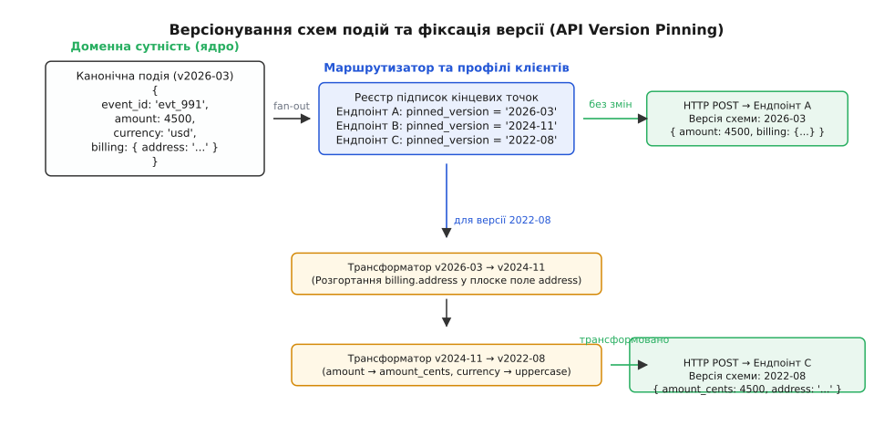
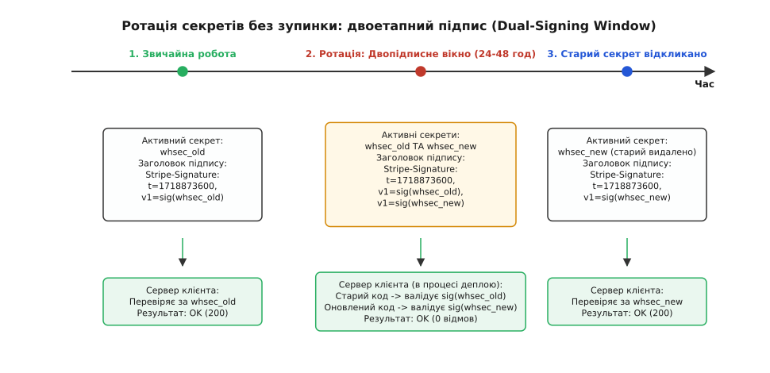
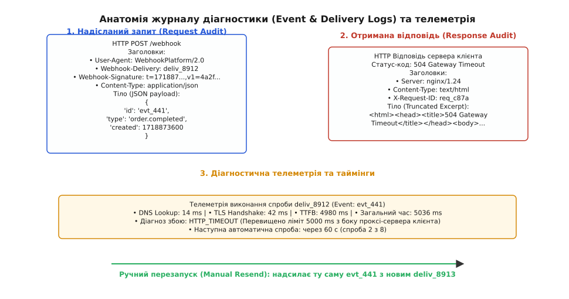
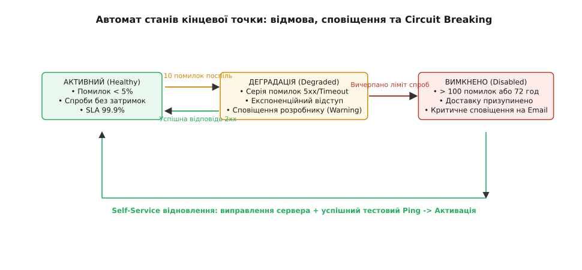
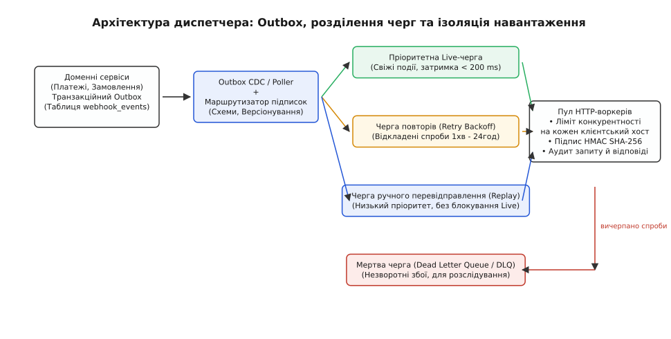

# Вебхуки як публічний продукт: версіонування подій, self-service логування

<preknowlist>
- [Webhooks (бік споживача)](topic:programming/webhooks) — модель HTTP-викликів за подіями, прийом сирого тіла, перевірка підпису HMAC та ідемпотентна обробка через черги.
- [Версіонування API](topic:programming/api-versioning) — семантика змін схем, зворотна сумісність та ланцюжки трансформацій (Stripe version ladder).
- [Фонові задачі та черги](topic:programming/background-jobs) — асинхронні обробники, повторні спроби з експоненційним відступом і мертві черги (DLQ).
- [Ідемпотентність API](topic:programming/api-idempotency) — унікальні ключі ідентифікації та усунення побічних ефектів від повторних запитів.
</preknowlist>

Коли платформа електронної комерції оновлює внутрішню схему бази даних і перейменовує стовпчик `amount_cents` на десяткове число `amount`, пряма трансляція цієї зміни у вихідні HTTP-повідомлення миттєво ламає п'ятнадцять тисяч інтеграцій зовнішніх магазинів. У ту саму секунду клієнтські сервери не знаходять звичного поля у вхідному JSON, падають з помилкою розбору структури й повертають HTTP 500, а тисячі оплачених замовлень зависають без відвантаження. Служба підтримки отримує шквал із чотирьох тисяч скарг за годину, а розробники платформи змушені гарячково відкочувати реліз, бо вихідні сповіщення були побудовані як прямий зліпок внутрішньої моделі даних, а не як стабільний публічний інтерфейс.

Корінь цієї катастрофи полягає в хибному ставленні до вебхуків як до «простих фонових HTTP POST запитів». У публічних платформах (рівня Stripe, GitHub, Twilio чи Shopify) вебхук — це повноцінний публічний програмний інтерфейс (API), вивернутий у зворотному напрямку. Платформа стає клієнтом, що ініціює виклики, а сервер стороннього розробника — сервером, який їх приймає. Але на відміну від класичного вхідного API, де клієнт сам контролює час виклику та очікує відповіді тут і зараз, у вебхуках платформа зобов'язана самостійно гарантувати доставку на довільні, часто нестабільні чужі сервери в інтернеті, зберігаючи незмінність контрактів роками.

Перетворення вихідних сповіщень на надійний продукт для розробників (Developer Experience, DX) тримається на чотирьох взаємопов'язаних підсистемах: детермінованому версіонуванні схем подій із фіксацією версії за клієнтом, порталі самообслуговування з ротацією ключів без простоїв, прозорому журналі аудиту кожного надісланого байта та інтелектуальному автоматі керування повторами з автоматичним вимкненням збійних адрес (Circuit Breaker).

---

## Версіонування подій: еволюція схем і фіксація версії (API Version Pinning)

Головна дилема еволюції публічного API — як покращувати структуру даних, не вимагаючи від тисяч клієнтів одночасного переписування їхнього коду. У звичайних вхідних REST-запитах клієнт сам передає бажану версію в заголовку (наприклад, `Stripe-Version: 2020-08-27`) або в URL (`/v1/charges`). Якщо клієнт не оновлює заголовок, сервер віддає йому стару структуру.

З вихідними вебхуками ситуація протилежна: ініціатором з'єднання є платформа. Розробник інтегрував платіжні вебхуки 2022 року, налаштував обробник під тодішню схему JSON і не торкався цього коду чотири роки. Коли 2026 року платформа змінює структуру події `payment_intent.succeeded` — наприклад, перетворює плоске поле `shipping_address` на вкладений об'єкт `shipping: { address: { line1, city, postal_code } }`, — надіслати новий формат на старий ендпоінт означає миттєво зламати виробничий контур клієнта.

```
Еволюція схеми події:
Версія 2022-08:  { "id": "evt_1", "amount_cents": 5000, "shipping_address": "вул. Хрещатик, 1" }
Версія 2026-03:  { "id": "evt_1", "amount": 50.00, "currency": "usd", "shipping": { "address": { "line1": "вул. Хрещатик, 1" } } }
```

Рішенням є патерн **фіксації версії API за кінцевою точкою** (API Version Pinning). Кожна зареєстрована адреса вебхука в системі має жорстко закріплену версію схеми (`pinned_version`), яка за замовчуванням дорівнює версії API платформи на момент створення підписки.

Внутрішні мікросервіси платформи завжди генерують канонічні події в найсвіжішій, актуальній схемі даних ядра. Диспетчер вебхуків перед серіалізацією корисного навантаження звіряє версію події з `pinned_version` цільового підписника. Якщо версії різняться, подія пропускається крізь ланцюжок зворотних трансформацій — послідовність детермінованих функцій переходу від новішої версії до старішої: `v_2026_03 → v_2025_01 → v_2024_06 → v_2022_08`.



*Канонічна подія формується в найсвіжішій схемі ядра, а перед відправкою розгалужується та деградує крізь ланцюжок трансформацій до версії, зафіксованої за кожним окремим ендпоінтом.*

Кожен трансформатор у ланцюжку виконує точкові зворотні мутації:
1. **Перейменування полів**: повернення старих ключів (наприклад, `amount` знову стає `amount_cents`).
2. **Згортання та розгортання структур**: відновлення пласких структур із новостворених вкладених об'єктів.
3. **Синтез дефолтних значень (Polyfills)**: якщо в новій версії певне поле було видалено або розбито на кілька, трансформатор генерує сумісне синтетичне значення для старого клієнта на основі наявних даних.
4. **Приведення типів**: конвертація рядкових міток часу ISO 8601 назад у цілочисельні секунди Unix Epoch.

### Анатомія метаданих конверта (Event Envelope)

Щоб сторонній розробник міг надійно обробляти події будь-якого типу єдиним уніфікованим кодом, структура JSON стандартизується у вигляді суворого конверта. Корисне навантаження ділиться на загальні системні метадані та специфічний доменний об'єкт:

```json
{
  "id": "evt_1Nx8Y2LkdIwHu7ix9901AB",
  "object": "event",
  "api_version": "2024-11-15",
  "created": 1718873600,
  "type": "payment_intent.succeeded",
  "data": {
    "object": {
      "id": "pi_3MtwBwLkdIwHu7ix28aBz1vC",
      "object": "payment_intent",
      "amount": 4500,
      "currency": "usd",
      "status": "succeeded",
      "customer": "cus_O6x4G1wV8qZ7Nm"
    },
    "previous_attributes": {
      "status": "processing"
    }
  },
  "livemode": true,
  "pending_webhooks": 1,
  "request": {
    "id": "req_8Zb3K9jL0mN2pQ",
    "idempotency_key": "9b1deb4d-3b7d-4bad-9bdd-2b0d7b3dcb6d"
  }
}
```

Кожне поле конверта виконує захисну функцію:
* `id` (`evt_...`) — глобально унікальний ідентифікатор самої події. Він генерується один раз у момент фіксації факту в базі даних платформи і ніколи не змінюється при повторних спробах доставки. За цим ідентифікатором споживач будує свою таблицю ідемпотентності ([вхідна скринька](topic:programming/webhooks)).
* `api_version` — точна версія контракту, за якою було серіалізовано вміст поля `data.object`. Це захищає клієнтський код від неоднозначностей під час міграцій.
* `created` — мітка часу створення події за стандартом Unix Epoch (секунди або мілісекунди UTC). Дозволяє споживачеві відкидати застарілі події при порушенні порядку доставки мережею.
* `type` — ієрархічний тип події, розділений крапками за принципом `<доменна_сутність>.<дія>` (`customer.subscription.created`, `invoice.payment_failed`).
* `data.previous_attributes` — критично важливий об'єкт для реактивних систем. Він містить значення полів об'єкта, які змінилися внаслідок цієї конкретної мутації. Без цього споживач був би змушений зберігати повний зліпок попереднього стану кожного ресурсу або робити додаткові синхронні HTTP-запити до API для обчислення різниці.
* `request` — ідентифікатор та ключ ідемпотентності вихідного API-запиту, що спричинив цю подію. Це дає наскрізне простеження: розробник бачить, який саме виклик його власного бекенду породив подію.

### Адитивні зміни проти порушення сумісності

Платформа повинна чітко розмежовувати два типи змін у схемах подій:
* **Адитивні (зворотно сумісні) зміни**: додавання нового необов'язкового поля у вкладений об'єкт або поява абсолютно нового типу події в каталозі. Платформа має право впроваджувати такі зміни без зміни `api_version`, за умови, що клієнтські бібліотеки (SDK) спроєктовані толерантними до невідомих полів (використовують нестрогий розбір JSON, ігноруючи нові ключі).
* **Ламаючі (breaking) зміни**: перейменування полів, зміна типів (наприклад, перетворення рядка з ідентифікатором на повноцінний вкладений об'єкт), зміна структури масивів, видалення полів або зміна логіки виникнення події. Такі зміни категорично заборонено відправляти клієнтам без зміни `api_version`. Вони вимагають обов'язкового написання трансформатора в ланцюжку версій.

Практичну реалізацію такого ланцюжка версій у диспетчері подій показано у вставці [Реалізація платформного диспетчера вебхуків](topic:programming/webhook-as-product/proj-webhook-dispatcher.md).

---

## Портал самообслуговування (Developer Portal): DX для налаштування та безпеки

Спроба обслуговувати налаштування вебхуків через листування з технічною підтримкою робить інтеграцію з платформою повільною та дратівливою. Розробникові потрібен інтерактивний портал керування (Developer Portal), де він може самостійно реєструвати адреси, обирати типи подій, тестувати доставку та керувати криптографічними ключами.

### Фільтрація підписок на події

У високонавантажених системах виникають сотні типів подій — від зміни статусу транзакції до внутрішніх логів аудиту доступу. Якщо надсилати на кожен зареєстрований URL абсолютно всі події платформи, споживач потоне в обробці непотрібного трафіку.

Портал надає три рівні гранулярності підписок:
* **Явний вибір типів**: масив конкретних назв (`["charge.succeeded", "charge.refunded"]`). Це найнадійніший варіант для виробничих контурів, що мінімізує обсяг мережевого трафіку та навантаження на черги клієнта.
* **Шаблони з груповими символами (Wildcards)**: маски на зразок `payment_intent.*` або `customer.subscription.*`. Це зручно на етапі прототипування та розробки мікросервісів, що відповідають за цілий доменний модуль.
* **Небезпека повної підписки (`*`)**: якщо дозволити клієнту підписатися на `*`, то реліз платформою нового високонавантаженого типу подій (наприклад, `telemetry.heartbeat`, що генерує 10 000 подій на секунду) миттєво покладе сервер клієнта шквалом запитів. Тому підписка на `*` або блокується, або вимагає підтвердження з попередженням про ризики.

### Валідація URL та захист від SSRF-атак

Реєстрація публічної адреси вебхука несе серйозний вектор вразливості: атаку на підміну сторони сервера (Server-Side Request Forgery, SSRF). Якщо зловмисник введе як адресу вебхука внутрішній хост `http://169.254.169.254/latest/meta-data/` (сервіс метаданих AWS EC2) або `http://10.0.0.1/admin`, диспетчер платформи почне надсилати внутрішні HTTP-запити у власну приватну інфраструктуру.

Тому під час збереження адреси портал та вихідні воркери застосовують сувору верифікацію:
1. Заборона незашифрованого протоколу `http://` для виробничих підписок (дозволяється виключно `https://` із валідним ланцюжком сертифікатів).
2. Обов'язкова перевірка DNS-резолвінгу (DNS Pinning): перед виконанням виклику доменне ім'я транслюється в IP-адресу, і якщо ця адреса потрапляє в діапазони приватних мереж RFC 1918 (`10.0.0.0/8`, `172.16.0.0/12`, `192.168.0.0/16`), локальних адрес `127.0.0.0/8`, або хмарних метаданих `169.254.169.254`, запит негайно блокується без генерації мережевого пакету.
3. Заборона слідування за редиректами (HTTP 301/302): якщо кінцева точка повертає статус перенаправлення, воркер вважає спробу невдалою, оскільки редирект може вести на внутрішній вразливий ресурс.

### Ротація секретів без простоїв: двопідписне вікно (Dual-Signing Window)

Автентичність кожного вебхука перевіряється через криптографічний підпис HMAC-SHA256, що генерується спільним секретним ключем (`whsec_...`). Проте в життєвому циклі будь-якої системи настає момент ротації секрету: планова зміна кожні 90 днів або екстрена зміна в разі витоку ключа (наприклад, випадкового коміту в публічний репозиторій).

Якщо платформа просто замінить старий секрет `whsec_old` на новий `whsec_new` в базі даних, виникне миттєвий розрив:
1. Платформа починає надсилати підписи, розраховані за `whsec_new`.
2. Сервер клієнта ще працює зі старим кодом і старим `whsec_old` у змінних середовища.
3. Усі вебхуки відхиляються клієнтом з помилкою 401 Unauthorized до моменту, поки розробник не оновить конфігурацію і не перезапустить свій застосунок.

Щоб забезпечити безперервну роботу без втрати жодної події, портал самообслуговування реалізує **двопідписне вікно переходу** (Dual-Signing Window):



*Під час ротації платформа генерує підписи обома ключами одночасно, дозволяючи клієнту оновити конфігурацію бекенду без жодної секунди простою або відхилених подій.*

Механізм працює так:
1. Розробник натискає «Розпочати ротацію ключа» в кабінеті. Платформа генерує новий ключ `whsec_new`, але залишає `whsec_old` активним на фіксований час переходу (наприклад, 24 години).
2. Під час надсилання кожної події диспетчер платформи обчислює два окремі HMAC-підписи (один від `whsec_old`, другий від `whsec_new`) і формує заголовок із двома мітками `v1`:
   ```http
   Stripe-Signature: t=1718873600,v1=4a2f8b...,v1=9c1e3d...
   ```
3. Стандартна клієнтська бібліотека (SDK) парсить заголовок, витягує всі наявні значення `v1` і порівнює їх із локальним секретом клієнта у циклі з постійним часом порівняння. Якщо *хоча б один* підпис зійшовся, запит вважається валідним.
4. Розробник спокійно оновлює змінні оточення на своєму сервері та виконує деплой. Старі інстанси перевіряють перший підпис, нові — другий. Жоден запит не падає.
5. Після завершення деплою розробник натискає «Відкликати старий секрет» (або він автоматично інвалідується через 24 години). Платформа повертається до генерації одного підпису за `whsec_new`.

### Інтерактивні тестові події (Synthetic Verification)

Розробка обробників вебхуків у локальному середовищі (за `localhost` або тунелями на зразок ngrok) ускладнюється тим, що для отримання реальної події треба виконати реальну дію: провести справжній платіж карткою або створити замовлення.

Портал самообслуговування вирішує це кнопкою **«Надіслати тестову подію»** (Send Test Event):
* Інтерфейс дозволяє вибрати довільний тип події (`invoice.paid`) та версію схеми.
* Генератор синтетичних даних створює валідне тіло події з префіксами `evt_test_...` та `livemode: false`.
* Диспетчер платформи виконує реальний HTTP-запит на кінцеву точку розробника з повним криптографічним підписом тестовим секретом.
* Результат запиту (статус-код, час відповіді, заголовки та тіло) негайно відображається в модальному вікні порталу, даючи розробникові миттєвий зворотний зв'язок щодо правильності налаштування його локального сервера.

---

## Журнал діагностики (Event & Delivery Logs): розкриття «чорної скриньки»

Найпоширеніша проблема в експлуатації вебхуків — взаємне звинувачення сторін у разі збою: «Платформа не надіслала нам сповіщення!» проти «Ми надіслали, але ваш сервер відповів помилкою!». Оскільки виклик відбувається через відкритий інтернет, без детального журналу кожна транзакція перетворюється на «чорну скриньку».

Вирішенням є відкритий журнал діагностики (Delivery Logs), доступний розробнику безпосередньо в кабінеті платформи або через спеціальний Management API.

### Розділення доменної події та спроби доставки

Архітектурно важливо чітко розмежувати дві різні сутності:
1. **Подія (`Event`, `evt_...`)** — незмінний бізнес-факт (наприклад, успішне списання коштів). Вона створюється один раз, має незмінний ідентифікатор, дату та дані.
2. **Спроба доставки (`Delivery Attempt`, `deliv_...`)** — одиничний факт мережевої взаємодії між платформою та конкретною URL-адресою клієнта в конкретний момент часу.

В однієї події `evt_100` може бути три різні підписники (три різні URL). Для першого підписника доставка відбулася успішно з першої спроби (`deliv_001`, статус 200). Для другого підписника сервер лежав, і система зробила п'ять спроб доставки протягом доби (`deliv_002` ... `deliv_006`), поки нарешті не отримала статус 200.



*Журнал діагностики фіксує сирі байти надісланого запиту, вичерпні заголовки, статус відповіді клієнта та точну мілісекундну телеметрію фаз з'єднання.*

### Анатомія запису журналу аудиту

Для кожної спроби доставки платформа фіксує вичерпний діагностичний зліпок:

1. **Ідентифікатори та контекст**:
   * `delivery_id`: унікальний ідентифікатор спроби (`deliv_...`), який також дублюється у вихідному HTTP-заголовку `Webhook-Delivery: deliv_...`. За цим значенням клієнт може знайти запит у своїх власних логах Nginx/Caddy.
   * `event_id`: посилання на батьківську подію `evt_...`.
   * `endpoint_id`: ідентифікатор налаштованої підписки.
   * `attempt_number`: порядковий номер спроби (наприклад, 3 із 8).

2. **Аудит надісланого HTTP-запиту**:
   * Точна URL-адреса, включно з портом і протоколом.
   * Метод (завжди `POST`).
   * Усі надіслані HTTP-заголовки (`User-Agent`, `Content-Type`, `Webhook-Signature`, `Webhook-Delivery`).
   * Повне вихідне тіло запиту (JSON-байти), від яких рахувався підпис.

3. **Мережева телеметрія та таймінги**:
   * `dns_duration_ms`: час резолвінгу доменного імені клієнта через DNS.
   * `tls_handshake_ms`: тривалість узгодження TLS-з'єднання та перевірки сертифіката.
   * `ttfb_ms` (Time to First Byte): час від завершення відправки тіла запиту до отримання першого байта відповіді від сервера клієнта.
   * `total_duration_ms`: загальний час життя HTTP-сесії.

4. **Аудит отриманої відповіді**:
   * HTTP статус-код (`200 OK`, `404 Not Found`, `500 Internal Server Error`, `504 Gateway Timeout`) або системний код відмови (`ERR_DNS_RESOLUTION_FAILED`, `ERR_TLS_CERT_EXPIRED`, `ERR_CONNECTION_TIMED_OUT`).
   * Заголовки відповіді клієнтського сервера (`Content-Type`, `Server`, `X-Request-Id`).
   * Фрагмент тіла відповіді (Truncated Response Body): перші 4–8 КБ отриманого тексту. Якщо клієнтський бекенд на базі Django або Express впав із друком стек-трейсу, розробник побачить цей стек-трейс прямо в кабінеті платформи, не відкриваючи SSH-сесію на свій сервер. Довші тіла обрізаються з міркувань захисту сховища від гігабайтних HTML-помилок.

### Захист приватності та маскування чутливих даних

У платіжних та медичних платформах корисне навантаження подій може містити конфіденційні персональні дані (PII, номери телефонів, часткові реквізити карток). Зберігання таких даних у відкритому журналі аудиту суперечить регламентам GDPR та PCI DSS.

Для вирішення цього протиріччя застосовують дворівневе сховище:
1. **Короткочасне оперативне сховище (Hot Storage)**: зберігає повні сирі байти запиту протягом 7–14 днів для оперативної діагностики та ручного перезапуску.
2. **Довготривалий архів (Cold Storage)**: після 14 днів тіло запиту проходить процедуру маскування (redaction), де конфіденційні поля замінюються на `[REDACTED]`, залишаючи лише системні ідентифікатори (`id`, `created`, `status`), статус-код відповіді та часові мітки для збереження статистики SLA.

### Функція ручного перезапуску (Manual Resend & Replay)

Автоматичні повтори відбуваються за експоненційним графіком і врешті-решт зупиняються, якщо сервер клієнта лежав довше, ніж триває вікно повторів (наприклад, 72 години). Після того як інженери клієнта полагодили свій сервер чи базу даних, їм потрібен спосіб повторно отримати всі втрачені події.

Портал самообслуговування надає функцію **ручного перевідправлення**:
* **Одиничний перезапуск (Manual Resend)**: кнопка біля конкретної події в журналі. Диспетчер створює нову спробу доставки (`deliv_new`), використовуючи *оригінальне* тіло події з тим самим `id: "evt_123"`. Завдяки збереженню `id` споживач, який частково обробив подію раніше, захищений своєю таблицею ідемпотентності.
* **Пакетний перезапуск (Bulk Replay)**: можливість вибрати фільтр за діапазоном часу та типами подій (наприклад, «усі події `payment_intent.*`, що завершилися з помилкою 5xx між 14:00 та 18:00 вчора») і запустити їхнє повторне відправлення у фоновому режимі.

---

## Моніторинг, SLA доставки та автоматичний захист (Circuit Breaking)

Найнебезпечніший сценарій для інфраструктури платформи та її клієнтів — це **шторм відмов** (Failure Storm). Уявімо, що великий клієнт отримує 500 подій на секунду. Його сервер виходить із ладу і починає повертати 500 Internal Server Error через переповнення пулу з'єднань з базою даних.

Якщо диспетчер платформи почне нескінченно й агресивно повторювати кожен невдалий запит:
1. Кількість викликів до мертвого сервера клієнта зросте в геометричній прогресії (свіжі події + лавина повторів). Коли клієнт спробує підняти свій сервер, стартовий трафік миттєво вб'є його повторно (ефект самовільного DDoS).
2. На боці платформи черги вихідних повідомлень заб'ються мільйонами завислих завдань, вичерпають доступні сокети та пам'ять воркерів, що спричинить деградацію доставки вебхуків іншим, здоровим клієнтам.

### Матриця експоненційного відступу з шумом (Exponential Backoff with Jitter)

Щоб уникнути перевантаження, повторні спроби виконуються за суворо розрахованим графіком зі зростаючими паузами та обов'язковим додаванням випадкового зсуву (jitter):

```
Графік повторних спроб (типове 72-годинне вікно):
Спроба 1:  Негайно (0 с)
Спроба 2:  через 15 секунд
Спроба 3:  через 1 хвилину
Спроба 4:  через 5 хвилин
Спроба 5:  через 30 хвилин
Спроба 6:  через 2 години
Спроба 7:  через 6 годин
Спроба 8:  через 12 годин
Спроба 9:  через 24 години
Спроба 10: через 24 години (фінальна спроба, після чого статус події стає failed)
```

Формула затримки для кожної спроби `n`:

```
затримка = випадкове_число(0, min(максимальна_пауза, базова_пауза · 2ⁿ))
```

Випадковий шум (jitter) гарантує, що якщо тисяча подій упала одночасно через короткочасне падіння комутатора клієнта, їхні повторні спроби розмажуться в часі, а не вдарять по серверу споживача одночасним піком через рівно 60 секунд.

### Автомат станів кінцевої точки (Endpoint Circuit Breaker)

Щоб захистити платформу та клієнта від нескінченного циклу збоїв, кожна підписка на вебхук керується автоматом станів:



*Автомат станів відстежує рівень помилок: при серійних збоях підписка переходить у стан деградації, а після вичерпання лімітів автоматично вимикається для захисту обох сторін.*

Автомат підтримує три ключові стани:
1. **Активний (Healthy / Active)**: нормальний режим роботи. Помилки доставки складають < 5%. Свіжі події відправляються негайно.
2. **Деградований (Degraded)**: ендпоінт повернув серію помилок 5xx або таймаутів (наприклад, 10 невдач поспіль). Платформа переводить виклики в режим відкладених повторів, знижує ліміт одночасних підключень (concurrency limit) до цього хосту, щоб не добивати сервер клієнта, і відправляє первинне попередження розробнику.
3. **Автоматично вимкнений (Disabled / Suspended)**: автоматичне спрацьовування запобіжника. Платформа повністю припиняє генерацію вихідних HTTP-викликів на цю адресу.

Критерії автоматичного вимкнення:
* Понад 100 помилок поспіль протягом 72 годин без жодної успішної відповіді 2xx.
* Загальний рівень успішності (success rate) < 2% за останні 500 спроб.
* Отримання незворотного HTTP-статусу `410 Gone` або `404 Not Found` (якщо URL зареєстровано як постійний ендпоінт, але сервіс клієнта видалено).
* Помилка валідації TLS (прострочений сертифікат або недійсний ланцюжок довіри), що триває понад 48 годин без виправлення.

### Каскадні сповіщення розробників (Developer Alerting Loop)

Вимкнення вебхука на боці платформи ніколи не повинно відбуватися мовчки. Система моніторингу реалізує трирівневий контур сповіщень:
1. **Рівень 1 (Попередження — Warning)**: надсилається на email розробників і в робочий чат (через Slack/Webhook інтеграцію) після 10 послідовних збоїв: «Доставка вебхуків на адресу `https://api.example.com/webhook` тимчасово зазнає труднощів (помилка 504 Gateway Timeout). Ми продовжуємо спроби».
2. **Рівень 2 (Критична загроза — Critical)**: надсилається за 24 години до запланованого автоматичного вимкнення: «Увага! Кінцева точка не відповідає понад 48 годин. Якщо проблему не буде усунуто, вебхуки буде вимкнено через 24 години».
3. **Рівень 3 (Вимкнення — Suspended Notification)**: фінальний лист із повним діагностичним звітом, останніми кодами помилок та прямим посиланням на портал самообслуговування з кнопкою «Перевірити та відновити роботу».

Після виправлення сервера розробник заходить на портал, надсилає успішну тестову пінг-подію, і система повертає ендпоінт у стан `Healthy`, пропонуючи в один клік запустити пакетний перезапуск (Bulk Replay) подій, накопичених за час простою.

---

## Архітектура диспетчера вебхуків: масштабування та ізоляція трафіку

Щоб забезпечити SLA доставки 99.99% на масштабах десятків мільйонів подій на добу, підсистема доставки вебхуків проектується як незалежний асинхронний конвеєр.



*Вихідна архітектура будується на надійній фіксації через Outbox, повному розділенні черг свіжого, повторного та пакетного трафіку, а також семафорах захисту клієнтських хостів.*

### Етапи конвеєра доставки

1. **Транзакційний Outbox (Transactional Outbox Pattern)**:
   Доменний сервіс (наприклад, сервіс білінгу) фіксує бізнес-транзакцію (списання коштів) та запис у таблицю `webhook_events` в межах **однієї атомарної транзакції** бази даних PostgreSQL/MySQL. Це на 100% гарантує, що подія не загубиться, навіть якщо брокер повідомлень у цей момент перезавантажується.

2. **Зчитування та маршрутизація (Outbox Relay / CDC)**:
   Фоновий процес (на базі Debezium/Change Data Capture або легковагового поллінгу з блокуванням рядків `FOR UPDATE SKIP LOCKED`) вичитує нові події з Outbox-таблиці та публікує їх у центральний брокер повідомлень (Apache Kafka, RabbitMQ або AWS SQS).

3. **Розгалуження та версіонування (Subscription Router)**:
   Маршрутизатор зіставляє тип події з активними підписками в базі даних. Для кожної знайденої підписки створюється окреме завдання доставки (`Delivery Job`), де корисне навантаження конвертується у зафіксовану версію схеми (`pinned_version`) та підписується актуальним секретним ключем.

4. **Ізоляція черг за пріоритетом**:
   Категорично заборонено змішувати всі вихідні виклики в одній черзі. Конвеєр ділиться на чотири ізольовані потоки:
   * **Live-черга (High Priority)**: свіжі події, щойно згенеровані системою. Обробляються пулом воркерів негайно із затримкою доставки < 200 мс.
   * **Черга повторів (Retry Queues)**: завдання повторних спроб, відкладені за розкладом експоненційного відступу (затримки від 15 секунд до 24 годин). Мають окремий пул воркерів.
   * **Черга ручного перевідправлення (Manual Replay Queue)**: пакетні завдання від розробників, які запустили перезапуск тисяч подій після відновлення свого сервера. Ця черга має найнижчий пріоритет і ніколи не відбирає процесорний час у свіжих Live-подій.
   * **Мертва черга (Dead Letter Queue / DLQ)**: події, які вичерпали всі спроби або містять критичні помилки серіалізації. Зберігаються для ручного аналізу інженерами платформи.

5. **Пул HTTP-воркерів та захист клієнтських хостів (Per-Host Rate Limiting)**:
   Воркери здійснюють безпосередні виклики через HTTP-клієнт. Щоб уникнути ненавмисного перевантаження клієнтського сервера, диспетчер підтримує розподілені семафори (на базі Redis або локальних token-bucket лімітерів), які обмежують максимальну кількість одночасних з'єднань до кожного унікального доменного імені клієнта (наприклад, не більше 20 паралельних HTTP-сесій на один хост).

6. **Асинхронний запис аудиту (Audit Stream)**:
   Після завершення кожного виклику зліпок телеметрії (заголовки, статус, час, обрізане тіло) скидається в чергу запису діагностичних логів і зберігається у швидкодійному аналітичному сховищі (наприклад, ClickHouse або ElasticSearch), звідки розробник бачить їх у своєму кабінеті.

Повний програмний код такого диспетчера — з механізмом версіонування, подвійним підписом HMAC та автоматом стану кінцевих точок — детально розібрано у вставці [Реалізація платформного диспетчера вебхуків](topic:programming/webhook-as-product/proj-webhook-dispatcher.md).

---

## Підсумок: вебхуки як зрілий контракт

Побудова вебхуків як публічного продукту змінює парадигму взаємодії з розподіленими системами. Відправляючи сповіщення у відкритий інтернет, платформа більше не сподівається на ідеальний стан мережі та безпомилковість чужих серверів. Натомість вона закладає нестабільність як базову умову функціонування:
* **Схеми еволюціонують без болю** завдяки фіксації версій (`pinned_version`) та ланцюжкам трансформацій.
* **Безпека залишається безперервною** завдяки двопідписному вікну ротації секретів.
* **Діагностика стає миттєвою** завдяки публічному журналу сирих HTTP-запитів, відповідей та мережевої телеметрії.
* **Інфраструктура захищена від штормів відмов** завдяки експоненційному відступу з шумом, автомату Circuit Breaker та суворому розділенню черг.

Такий підхід перетворює крихкі HTTP-виклики на передбачувану, масштабовану платформу для інтеграцій, якій довіряють розробники в усьому світі.
