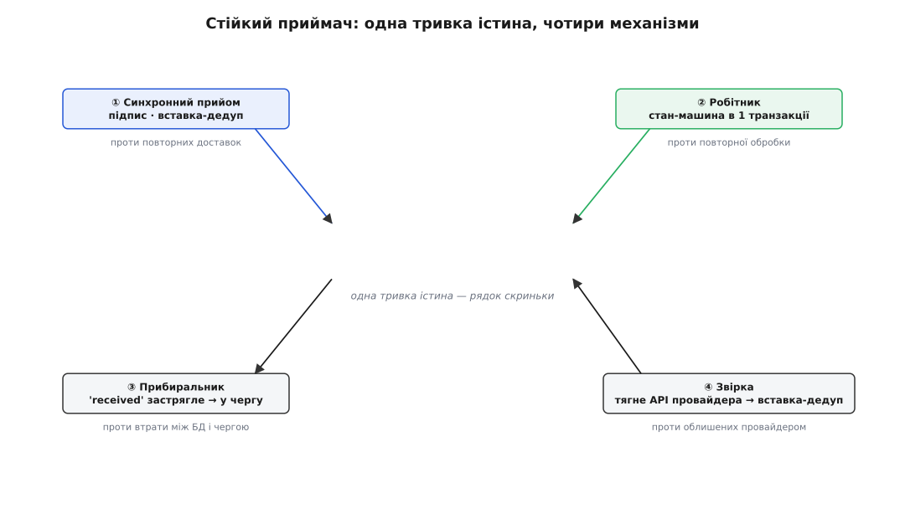
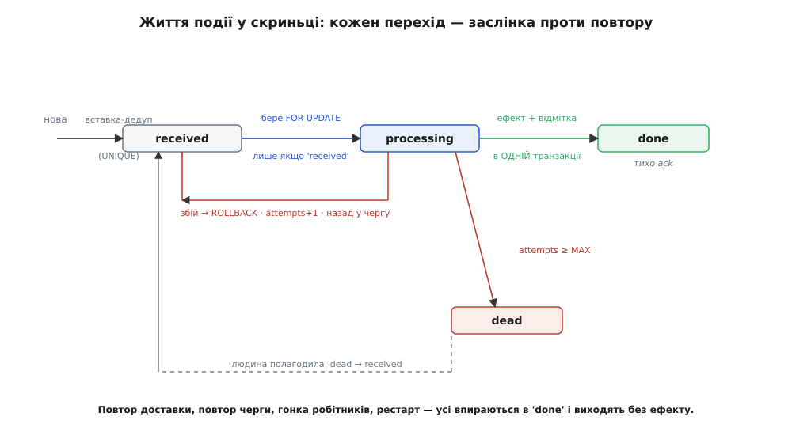

# ⚙️ Стійкий приймач вебхуків: код, що переживає збої

Множина в пам'яті, яка «пам'ятає» оброблені події, живе рівно до найближчого перезапуску процесу. Задеплоїв нову версію — і скринька порожня, кожен повтор від провайдера тепер новий. Це не приймач, це макет приймача. Справжній мусить пережити три речі, які трапляються не «як виняток», а щодня: підроблений запит, ту саму подію двічі й власний збій посеред обробки. І ще четверту, рідшу й найпідступнішу: подію, яку провайдер надіслав, а ти її так і не побачив.

Зберемо приймач, який тримає всі чотири удари. Не набір гарних порад, а рівно той код, що ти викотиш у продакшн — на трьох поширених стеках, кожен коректний і робочий.

## Задача: приймач, який не бреше й не втрачає

Сформулюймо строго, чого ми хочемо, — бо саме з вимог виростає кожен рядок коду.

- **Не приймати чужого.** Твій URL публічний; POSTити на нього може будь-хто. Кожен запит — перевірити на справжність, перш ніж хоч якось на нього зреагувати.
- **Не робити те саме двічі.** Доставку гарантовано [щонайменше раз](topic:programming/delivery-guarantees), а не рівно раз — повтори неминучі. Дві доставки `evt_123` мусять дати той самий стан, що й одна.
- **Не зникати при збої.** Впав процес між «записав» і «поклав у чергу»? Впав робітник посеред обробки? Стан бази лишається чистим і несуперечливим, а подія зрештою обробляється — рівно раз за ефектом.
- **Не втрачати мовчки.** Провайдер вичерпав спроби й облишив подію — має бути другий шлях її дістати, а не тиха діра в обліку.

Ключове слово, що зшиває все, — [ідемпотентність](topic:programming/idempotency): операція, повторена скільки завгодно разів, лишає той самий стан, що й виконана раз. Ми зробимо ідемпотентним увесь конвеєр — і прийом, і обробку.

## Ідея: одна тривка істина, решта — наслідки

Уся стійкість тримається на одному рішенні: **надійно записати сам факт «подія прийшла» окремо від її обробки.** Цей запис — єдине тривке, чому ми довіряємо. Усе інше — черга, робітник, побічний ефект — стає *повторюваним наслідком* цього запису. Загубилося повідомлення в черзі? Запис на місці — покладемо в чергу знову. Впав робітник? Запис каже, що подія ще не оброблена, — візьмемо ще раз. Нічого не пропаде, бо є тривка істина, до якої завжди можна повернутися.

Звідси конвеєр із чотирьох незалежних механізмів, і — важливо — **кожен закриває СВІЙ окремий тип збою**; жоден не дублює інший:

1. **Вставка-як-дедуп** гасить повторні *доставки* від провайдера.
2. **Стан-машина робітника** гасить повторну *обробку* однієї доставки (повтор черги, гонка двох робітників, рестарт).
3. **Прибиральник** рятує від неатомарності «записав-і-в-чергу»: запис ліг, а черга його не отримала.
4. **Звірка** дістає події, яких провайдер так і не доставив — їх у скриньці немає взагалі.



*Осердя — скринька в базі з унікальним `event_id`. Синхронний шлях лише кладе туди подію й підтверджує. Обробку, добір застряглих і звірку з провайдером ведуть три окремі петлі — кожна проти свого збою.*

Розберемо кожен, від схеми в базі до останньої пастки.

## Скринька: схема, з якої все починається

Осердя — одна таблиця. `event_id` тут — ідентифікатор *провайдера* (Stripe кладе його як `evt_…`, GitHub — у заголовок `X-GitHub-Delivery`), а не якийсь наш власний. Саме він — ключ ідемпотентності, тож він і первинний ключ: база сама не дасть двом рядкам із однаковим `event_id` існувати.

```sql
CREATE TABLE webhook_inbox (
    event_id     TEXT        PRIMARY KEY,        -- ідентифікатор ПРОВАЙДЕРА, не наш
    type         TEXT        NOT NULL,           -- payment.succeeded, push, …
    payload      JSONB       NOT NULL,           -- сире тіло, збережене як прийшло
    status       TEXT        NOT NULL DEFAULT 'received',  -- received→processing→done | dead
    attempts     INT         NOT NULL DEFAULT 0,
    received_at  TIMESTAMPTZ NOT NULL DEFAULT now(),
    processed_at TIMESTAMPTZ
);

-- Курсор звірки: доки ми дочитали чужий журнал подій.
CREATE TABLE reconciliation_cursor (
    source    TEXT        PRIMARY KEY,
    last_seen TIMESTAMPTZ NOT NULL
);
```

Поле `status` — не прикраса, а стан-машина, на якій тримається вся ідемпотентність обробки: подія живе `received → processing → done`, а безнадійна відходить у `dead`. `attempts` рахує невдалі підходи, щоб отруйна подія не крутилася вічно.

> 🔧 **Навіщо це.** Первинний ключ на `event_id` — не про акуратність схеми, а про єдину точку серіалізації в усій системі. Хоч би скільки паралельних доставок однієї події гналося одночасно, база пропустить *рівно один* `INSERT`. Ти не пишеш жодного замка вручну — його роль виконує обмеження унікальності.

## Ендпоінт: сирі байти, підпис, вставка

Синхронний шлях робить рівно три речі й негайно відповідає: перевіряє підпис над **сирими байтами**, кладе подію у скриньку однією вставкою-дедупом, ставить у чергу. Уся справжня робота — потім.

Перш ніж код — про пастку, на якій ловляться майже всі новачки.

### Пастка розбору-перед-перевіркою

Провайдер порахував підпис (HMAC) від **точних байтів**, які поклав у тіло. Ти маєш порахувати свій HMAC від **тих самих байтів** і звірити. Але майже кожен веб-фреймворк за замовчуванням перехоплює тіло, розбирає JSON і віддає тобі вже готовий об'єкт — а сирі байти викидає. Якщо ти тепер зробиш `JSON.stringify` назад, щоб порахувати підпис, ти майже напевно дістанеш *інші* байти: розбір-і-збирання переставляє пробіли, міняє порядок ключів, інакше екранує Unicode. Байти інші — чесний підпис «не збігається», і ти відхиляєш справжні події.

Тому правило залізне: **дістань сире тіло ДО будь-якого розбору, перевір підпис, і лише тоді розбирай.** У кожному стеку це окремий, свідомий крок — не дай фреймворку розібрати за тебе:

- **Express** — `express.raw({ type: "application/json" })` замість `express.json()` саме на цьому маршруті; тіло приходить як `Buffer`.
- **Flask** — `request.get_data()` (сирі байти) замість `request.get_json()`, який уже розібрав.
- **Go** — `io.ReadAll(r.Body)` перше, `json.Unmarshal` — потім із тих самих байтів.

Порівнювати підпис теж треба обережно — **порівнянням сталого часу** (`timingSafeEqual` / `hmac.compare_digest` / `hmac.Equal`). Звичайне `==` виходить із циклу на першому розбіжному байті, і за часом відповіді зловмисник може побайтово вгадати правильний підпис. Ось приймальний ендпоінт цілком:

:::tabs
```ts
import express from "express";
import crypto from "node:crypto";

const app = express();
const SECRET = process.env.WEBHOOK_SECRET!;

// express.raw, НЕ express.json: інакше сирі байти, над якими рахувався
// підпис, будуть уже недоступні — лишиться тільки розібраний об'єкт.
app.post("/webhooks", express.raw({ type: "application/json" }), async (req, res) => {
  const raw = req.body as Buffer;                       // сирі байти тіла
  if (!verify(raw, req.header("X-Signature") ?? "")) {
    return res.sendStatus(401);                         // підпис не збігся — геть
  }

  let event: { id: string; type: string };
  try {
    event = JSON.parse(raw.toString("utf8"));           // розбір ЛИШЕ після перевірки
  } catch {
    return res.sendStatus(400);                         // криве тіло — не наша подія
  }

  try {
    if (await inboxInsert(event.id, event.type, raw)) { // нова — false, якщо дубль
      await enqueue(event.id);                          // роботу знімемо з гарячого шляху
    }
    return res.sendStatus(200);                         // 200 і новій, і дублю
  } catch {
    return res.sendStatus(500);                         // не зберегли — хай ПОВТОРЯТЬ, не 200!
  }
});

function verify(raw: Buffer, sig: string): boolean {
  const expected = crypto.createHmac("sha256", SECRET).update(raw).digest("hex");
  const a = Buffer.from(sig), b = Buffer.from(expected);
  return a.length === b.length && crypto.timingSafeEqual(a, b);  // сталий час
}
```
```py
import hmac, hashlib, json, os
from flask import Flask, request, abort

app = Flask(__name__)
SECRET = os.environ["WEBHOOK_SECRET"].encode()

@app.post("/webhooks")
def receive():
    raw = request.get_data()                       # сирі байти, доки їх не чіпав розбір
    if not verify(raw, request.headers.get("X-Signature", "")):
        abort(401)                                 # підпис не збігся — геть

    try:
        event = json.loads(raw)                    # розбір ЛИШЕ після перевірки
    except ValueError:
        abort(400)                                 # криве тіло — не наша подія

    try:
        if inbox_insert(event["id"], event["type"], raw):   # нова — False, якщо дубль
            enqueue(event["id"])                   # роботу знімемо з гарячого шляху
        return "", 200                             # 200 і новій, і дублю
    except Exception:
        abort(500)                                 # не зберегли — хай ПОВТОРЯТЬ, не 200!

def verify(raw: bytes, sig: str) -> bool:
    expected = hmac.new(SECRET, raw, hashlib.sha256).hexdigest()
    return hmac.compare_digest(sig, expected)      # сталий час
```
```go
func receive(w http.ResponseWriter, r *http.Request) {
    raw, err := io.ReadAll(r.Body)                     // сирі байти ПЕРШЕ
    if err != nil {
        w.WriteHeader(http.StatusBadRequest)
        return
    }
    if !verify(raw, r.Header.Get("X-Signature")) {
        w.WriteHeader(http.StatusUnauthorized)         // підпис не збігся — геть
        return
    }

    var ev struct{ ID, Type string }
    if json.Unmarshal(raw, &ev) != nil {               // розбір ЛИШЕ після перевірки
        w.WriteHeader(http.StatusBadRequest)           // криве тіло — не наша подія
        return
    }

    isNew, err := inboxInsert(r.Context(), ev.ID, ev.Type, raw)
    if err != nil {
        w.WriteHeader(http.StatusInternalServerError)  // не зберегли — хай ПОВТОРЯТЬ, не 200!
        return
    }
    if isNew {
        enqueue(ev.ID)                                 // роботу знімемо з гарячого шляху
    }
    w.WriteHeader(http.StatusOK)                       // 200 і новій, і дублю
}

func verify(raw []byte, sig string) bool {
    mac := hmac.New(sha256.New, secret)
    mac.Write(raw)
    expected := hex.EncodeToString(mac.Sum(nil))
    return hmac.Equal([]byte(sig), []byte(expected))   // сталий час
}
```
:::

Заголовок `X-Signature` тут узагальнений. У житті провайдери називають його по-своєму й іноді загортають у нього мітку часу проти повторного відтворення старого перехопленого запиту: Stripe шле `Stripe-Signature: t=…,v1=…`, де HMAC-SHA256 рахується не від самого тіла, а від рядка `мітка.тіло`, і відхиляє підпис, старший за 5 хвилин; GitHub — `X-Hub-Signature-256: sha256=…` над сирим тілом (усталені факти з їхньої документації). Повну схему з міткою часу й вікном терпимості розбирає [підпис і верифікація вебхука](topic:programming/webhook-security) — тут нам досить того, що підпис рахується над сирими байтами й звіряється сталим часом.

Зверни увагу на два `catch`, що повертають **500, а не 200**. Це не дрібниця. `200` для провайдера означає «прийняв, більше не повторюй». Якщо база на мить лягла, а ти відповів `200`, провайдер викреслить подію — і вона зникне назавжди (аж поки її не добере звірка). Правило: `200` — лише коли подія *справді* надійно лягла у скриньку; будь-який збій запису — `5xx`, хай повторюють.

### Вставка-як-дедуп

`inbox_insert` — серце дедуплікації, і воно навдивовижу коротке. Не «спершу перевір, чи є, потім вставляй» — між перевіркою і вставкою два паралельні запити прослизнуть обидва. Натомість — одна вставка, що *сама* є перевіркою: `ON CONFLICT DO NOTHING`. Обмеження унікальності на `event_id` пропустить рівно один рядок; хто програв гонку — дістане «нуль вставлених» і зрозуміє, що подію вже взяли.

:::tabs
```ts
// Одна вставка = дедуп. rowCount каже, ми поклали нову подію чи наштовхнулися на дубль.
async function inboxInsert(id: string, type: string, raw: Buffer): Promise<boolean> {
  const r = await pool.query(
    `INSERT INTO webhook_inbox (event_id, type, payload)
     VALUES ($1, $2, $3)
     ON CONFLICT (event_id) DO NOTHING`,
    [id, type, raw.toString("utf8")],
  );
  return r.rowCount === 1;          // 1 — вставили нову; 0 — конфлікт, уже бачили
}
```
```py
def inbox_insert(event_id: str, type_: str, raw: bytes) -> bool:
    with pool.connection() as conn:
        cur = conn.execute(
            """INSERT INTO webhook_inbox (event_id, type, payload)
               VALUES (%s, %s, %s)
               ON CONFLICT (event_id) DO NOTHING""",
            (event_id, type_, raw.decode()),
        )
        return cur.rowcount == 1     # 1 — нова; 0 — дубль
```
```go
func inboxInsert(ctx context.Context, id, typ string, raw []byte) (bool, error) {
    res, err := db.ExecContext(ctx,
        `INSERT INTO webhook_inbox (event_id, type, payload)
         VALUES ($1, $2, $3)
         ON CONFLICT (event_id) DO NOTHING`,
        id, typ, string(raw))
    if err != nil {
        return false, err
    }
    n, _ := res.RowsAffected()
    return n == 1, nil               // 1 — нова; 0 — дубль
}
```
:::

Оце й усе, що робить синхронний шлях. Він тонкий навмисно: усе, що тут станеться, провайдер чекає в реальному часі, за лічені секунди. Записали факт, поставили в чергу, відповіли `200`. Товсту роботу — далі, поза запитом, [фоновим робітником](topic:programming/background-jobs).

## Чому робітник теж мусить бути ідемпотентним

Здавалося б, дедуп у скриньці вже все вирішив: одна подія — один рядок — одна обробка. Але це ілюзія, і вона коштує грошей. Розберемо, чому обробити подію рівно раз **неможливо гарантувати** самою лише вставкою, — саме тут ховається найтонше місце всього приймача.

Придивись до двох рядків синхронного шляху:

```
inbox_insert(...)   // 1) записали у скриньку (закомічено в БД)
enqueue(event.id)   // 2) поклали в чергу
```

Це **дві окремі дії у двох різних системах** — база й черга, — і між ними немає спільної транзакції. А отже, є вікно, у якому все ламається:

- Процес **упав** одразу після пункту 1. Рядок у скриньці є (`received`), але в черзі його немає. Робітник ніколи про нього не дізнається — подія застрягла.
- Черга на мить була **недоступна**, `enqueue` кинув виняток. Той самий застряглий рядок.
- `enqueue` **удався**, але процес упав, не встигнувши відповісти `200`. Провайдер не почув підтвердження — і **надішле подію знову**. Друга доставка: вставка цього разу віддасть «дубль» (рядок уже є), у чергу нічого не покладе... і подія знову застрягла б, якби не було страхування.

Спокуса — зробити «записати-і-в-чергу» однією атомарною дією. Але атомарності *між двома системами* просто так не буває. Класичний чесний вихід — [транзакційний вихідний журнал](topic:programming/outbox-pattern): у **тій самій** транзакції БД, що й вставку в скриньку, пиши рядок у таблицю-журнал намірів, а окремий передавач уже штовхає його в справжню чергу. Тоді «записати + намір покласти в чергу» атомарні. Ми ж підемо простішим шляхом — приймемо, що `enqueue` ненадійний, і додамо **прибиральника**, що добере застрягле (нижче). Але хай яким шляхом ти закриваєш це вікно — прибиральником, вихідним журналом чи просто покладаючись на повтори провайдера, — **усі вони можуть покласти в чергу ту саму подію вдруге.** Прибиральник не відрізнить «enqueue загубився» від «enqueue вдався, а я впав до відповіді». Тож він про всяк випадок покладе знову.

Ось звідси й висновок, який не обійти:

> 🔧 **Навіщо це.** Хоч би як ти лагодив неатомарність «записав-і-в-чергу», одна й та сама подія *опиниться в черзі більш ніж раз* — від повтору провайдера, від прибиральника, від самої черги (черги теж доставляють щонайменше раз: стандартна черга SQS відверто попереджає про дублікати). Скринька дедуплікує **доставки**, але не дедуплікує **обробки**. Виходить: робітник МУСИТЬ бути ідемпотентним сам — так само незалежно від того, скільки разів йому вручили ту саму подію. Інакше кожна загублена мережею відповідь стає подвійним списанням.

## Робітник: стан-машина в одній транзакції

Як зробити обробку ідемпотентною? Опертися на ту саму тривку істину — рядок скриньки — і провести його стан-машиною так, щоб *повторний* захід нічого не змінив. Три ідеї разом дають куленепробивність:

1. **Замок на рядок.** Робітник бере рядок `SELECT … FOR UPDATE` — [песимістичне блокування](topic:programming/pessimistic-locking). Другий робітник на ту саму подію тут зачекає, а не побіжить паралельно. (Легша альтернатива — [оптимістичне](topic:programming/optimistic-locking) умовне оновлення `UPDATE … SET status='processing' WHERE status='received'`: нуль оновлених рядків означає «хтось уже взяв».)
2. **Перевірка стану.** Взяв замок — глянь `status`. Уже `done` чи `dead`? Тоді нічого не роби, тихо прибери з черги. Це і є ідемпотентність: повторний захід упирається в `done` і виходить.
3. **Ефект і відмітку — в ОДНІЙ транзакції.** Побічний ефект (позначити рахунок оплаченим) і `UPDATE … SET status='done'` комітяться **разом**. Або лягло і те, і те, або — при збої — ні те, ні те. Ніколи не буває «ефект стався, а відмітки нема» (обробив би вдруге) чи навпаки. На цьому [атомарність транзакції](topic:programming/transactions-acid) і стоїть.

:::tabs
```ts
const MAX_ATTEMPTS = 8;
type Ack = "ack" | "retry";                            // прибрати з черги / повернути

async function handle(eventId: string): Promise<Ack> {
  const client = await pool.connect();
  try {
    await client.query("BEGIN");
    const { rows } = await client.query(
      `SELECT status, payload FROM webhook_inbox
       WHERE event_id = $1 FOR UPDATE`, [eventId]);     // замок на рядок
    const row = rows[0];
    if (!row || row.status === "done" || row.status === "dead") {
      await client.query("COMMIT");
      return "ack";                                     // уже зроблено/відкладено — тихо
    }

    await applySideEffect(client, row.payload);         // у ТІЙ САМІЙ транзакції
    await client.query(
      `UPDATE webhook_inbox SET status='done', processed_at=now()
       WHERE event_id = $1`, [eventId]);
    await client.query("COMMIT");                       // ефект і 'done' лягають РАЗОМ
    return "ack";
  } catch (err) {
    await client.query("ROLLBACK");                     // нічого не закомічено — стан чистий
    return onFailure(eventId, err);                     // attempts+1, можливо — в DLQ
  } finally {
    client.release();
  }
}

// Сам ефект теж ідемпотентний: умова paid=false робить повтор нічим.
async function applySideEffect(client: PoolClient, payload: any) {
  await client.query(
    `UPDATE invoices SET paid = true, paid_at = now()
     WHERE id = $1 AND paid = false`, [payload.data.invoice_id]);
}

async function onFailure(eventId: string, err: unknown): Promise<Ack> {
  const { rows } = await pool.query(
    `UPDATE webhook_inbox SET attempts = attempts + 1
     WHERE event_id = $1 RETURNING attempts`, [eventId]);
  if (rows[0].attempts >= MAX_ATTEMPTS) {
    await pool.query(`UPDATE webhook_inbox SET status='dead' WHERE event_id = $1`, [eventId]);
    alertHuman(eventId, err);                           // отруйна подія — хай гляне людина
    return "ack";                                       // прибрати з живої черги
  }
  return "retry";                                       // назад у чергу, з наростанням паузи
}
```
```py
MAX_ATTEMPTS = 8

def handle(event_id: str) -> str:                # "ack" — прибрати; "retry" — повернути
    try:
        with pool.connection() as conn:          # вихід без винятку → COMMIT; виняток → ROLLBACK
            row = conn.execute(
                "SELECT status, payload FROM webhook_inbox "
                "WHERE event_id = %s FOR UPDATE", (event_id,)).fetchone()   # замок на рядок
            if row is None or row["status"] in ("done", "dead"):
                return "ack"                     # уже зроблено/відкладено — тихо

            apply_side_effect(conn, row["payload"])      # у ТІЙ САМІЙ транзакції
            conn.execute(
                "UPDATE webhook_inbox SET status='done', processed_at=now() "
                "WHERE event_id = %s", (event_id,))
        return "ack"                             # дійшли сюди → ефект і 'done' закомічені РАЗОМ
    except Exception as err:
        return on_failure(event_id, err)         # виняток → with уже відкотив; окремо attempts+1

def apply_side_effect(conn, payload):
    # Умова paid=false робить повтор нічим — сам ефект теж ідемпотентний.
    conn.execute(
        "UPDATE invoices SET paid = true, paid_at = now() "
        "WHERE id = %s AND paid = false", (payload["data"]["invoice_id"],))

def on_failure(event_id: str, err: Exception) -> str:
    with pool.connection() as conn:
        attempts = conn.execute(
            "UPDATE webhook_inbox SET attempts = attempts + 1 "
            "WHERE event_id = %s RETURNING attempts", (event_id,)).fetchone()["attempts"]
        if attempts >= MAX_ATTEMPTS:
            conn.execute("UPDATE webhook_inbox SET status='dead' WHERE event_id = %s", (event_id,))
            alert_human(event_id, err)           # отруйна подія — хай гляне людина
            return "ack"                         # прибрати з живої черги
    return "retry"                               # назад у чергу, з наростанням паузи
```
```go
const maxAttempts = 8

// повертає true — прибрати з черги (ack); false — повернути в чергу (retry)
func handle(ctx context.Context, eventID string) bool {
    tx, err := db.BeginTx(ctx, nil)
    if err != nil {
        return false                                   // не почали — назад у чергу
    }
    defer tx.Rollback()                                // no-op після Commit; підстрахує будь-який вихід

    var status string
    var payload []byte
    err = tx.QueryRowContext(ctx,
        `SELECT status, payload FROM webhook_inbox
         WHERE event_id = $1 FOR UPDATE`, eventID).Scan(&status, &payload)  // замок на рядок
    switch {
    case err == sql.ErrNoRows:
        tx.Commit(); return true                       // рядка нема — нічого гасити
    case err != nil:
        return onFailure(ctx, eventID, err)
    case status == "done" || status == "dead":
        tx.Commit(); return true                       // уже зроблено/відкладено — тихо
    }

    if err := applySideEffect(ctx, tx, payload); err != nil {   // у ТІЙ САМІЙ транзакції
        return onFailure(ctx, eventID, err)
    }
    if _, err := tx.ExecContext(ctx,
        `UPDATE webhook_inbox SET status='done', processed_at=now()
         WHERE event_id = $1`, eventID); err != nil {
        return onFailure(ctx, eventID, err)
    }
    if err := tx.Commit(); err != nil {                // ефект і 'done' лягають РАЗОМ
        return onFailure(ctx, eventID, err)
    }
    return true
}

func applySideEffect(ctx context.Context, tx *sql.Tx, payload []byte) error {
    var ev struct{ Data struct{ InvoiceID string `json:"invoice_id"` } }
    if err := json.Unmarshal(payload, &ev); err != nil {
        return err
    }
    // Умова paid=false робить повтор нічим — сам ефект теж ідемпотентний.
    _, err := tx.ExecContext(ctx,
        `UPDATE invoices SET paid = true, paid_at = now()
         WHERE id = $1 AND paid = false`, ev.Data.InvoiceID)
    return err
}

func onFailure(ctx context.Context, eventID string, cause error) bool {
    var attempts int
    db.QueryRowContext(ctx,
        `UPDATE webhook_inbox SET attempts = attempts + 1
         WHERE event_id = $1 RETURNING attempts`, eventID).Scan(&attempts)
    if attempts >= maxAttempts {
        db.ExecContext(ctx, `UPDATE webhook_inbox SET status='dead' WHERE event_id = $1`, eventID)
        alertHuman(eventID, cause)                      // отруйна подія — хай гляне людина
        return true                                     // прибрати з живої черги
    }
    return false                                        // назад у чергу, з наростанням паузи
}
```
:::

Простеж три сценарії повтору по цьому коду — і побачиш, як стан-машина їх ковтає:

- **Черга принесла подію двічі.** Перший робітник довів її до `done`. Другий бере `FOR UPDATE`, бачить `done`, виходить — жодного повторного списання.
- **Два робітники схопили одне повідомлення разом.** Перший узяв замок; другий блокується на `FOR UPDATE`, чекає, і коли перший закомітив `done` — бачить `done` і виходить.
- **Робітник упав посеред обробки.** Транзакцію не закомічено — `ROLLBACK` відкотив усе. Стан чистий, ніби заходу й не було; повторна доставка обробить чисто.

Зверни увагу на подвійну ідемпотентність: зовнішня стан-машина (`status='done'` як заслінка) *і* внутрішня умова в самому ефекті (`AND paid = false`). Друга рятує навіть у тонкому випадку, коли ефект — в іншій системі, ніж скринька, і не входить у ту саму транзакцію: якщо побічний ефект — виклик чужого API, зроби його ідемпотентним ключем (тим самим `event_id`), бо тоді атомарності з відміткою вже не буде.



*Життя однієї події у скриньці. Вставка-дедуп впускає рядок у `received`; робітник під замком переводить його `processing → done` однією транзакцією. Повтор будь-якого штибу впирається в `done` і тихо виходить; після забагатьох невдач рядок відходить у `dead`.*

## Прибиральник: добрати застрягле у скриньці

Пам'ятаєш вікно між «записав» і «в чергу»? Рядок ліг як `received`, а `enqueue` загубився — і подія висить необробленою, бо в черзі її немає. Ліки прості: періодично шукай рядки, що застрягли в `received` довше за розумний строк, і клади в чергу знову.

```sql
-- Прибиральник (раз на хвилину): що застрягло в 'received' — покласти в чергу знову.
SELECT event_id FROM webhook_inbox
WHERE status = 'received'
  AND received_at < now() - interval '5 minutes'
ORDER BY received_at
LIMIT 500;
```

Кожен знайдений `event_id` — знову в чергу. Чому це безпечно навіть для рядка, який насправді *не* застряг, а вже мчить у робітнику? Бо робітник ідемпотентний. Повторне покладання в чергу — просто ще одна доставка, яку стан-машина проковтне без сліду. Прибиральник має право «перестрахуватися» саме тому, що ціна помилкового повтору — нуль.

## Звірка: дістати те, що провайдер облишив

Лишився останній, найтонший тип втрати. Твій ендпоінт лежав пів години під час деплою. Провайдер повторив кілька разів із наростаючими паузами — і **облишив** подію назавжди. Рядка у скриньці *ніколи не було* — тож ні дедуп, ні прибиральник тут не поможуть: вони працюють із тим, що вже записане. Прибиральник дивиться *всередину* скриньки; ця подія — *ззовні* неї.

Тому вебхуки самі по собі — доставка «як вийде»; вони ніколи не мусять бути єдиним шляхом для того, чого проґавити не можна. Страхувальна сітка — [звірка](topic:programming/reconciliation): періодично тягни журнал подій із API провайдера й прогонь кожну через ту саму вставку-дедуп. Ті, що ти вже бачив, відсіються самі (конфлікт → «не нова»); ті, яких провайдер не доніс, вставляться вперше й підуть у чергу.

:::tabs
```ts
const OVERLAP_MS = 10 * 60 * 1000;   // перекрити вікно на 10 хв — щоб не проґавити межу

async function reconcile() {
  const cursor = await loadCursor("payments");
  const since = cursor - OVERLAP_MS;                       // навмисно тягнемо ширше
  let maxSeen = cursor;

  for await (const event of provider.listEvents({ since })) {   // посторінково з чужого API
    const raw = Buffer.from(JSON.stringify(event));
    if (await inboxInsert(event.id, event.type, raw)) {
      await enqueue(event.id);          // цієї події ми не бачили — провайдер її облишив
    }                                   // бачили — insert віддав false, тихо пропускаємо
    maxSeen = Math.max(maxSeen, event.created * 1000);
  }
  await saveCursor("payments", maxSeen);                   // зрушуємо курсор уперед
}
```
```py
OVERLAP = timedelta(minutes=10)   # перекрити вікно — щоб не проґавити межу

def reconcile():
    cursor = load_cursor("payments")
    since = cursor - OVERLAP                                  # навмисно тягнемо ширше
    max_seen = cursor

    for event in provider.list_events(since=since):          # посторінково з чужого API
        raw = json.dumps(event).encode()
        if inbox_insert(event["id"], event["type"], raw):
            enqueue(event["id"])         # цієї події ми не бачили — провайдер її облишив
        # бачили — inbox_insert віддав False, тихо пропускаємо
        max_seen = max(max_seen, datetime.fromtimestamp(event["created"], tz=timezone.utc))
    save_cursor("payments", max_seen)                        # зрушуємо курсор уперед
```
```go
const overlap = 10 * time.Minute   // перекрити вікно — щоб не проґавити межу

func reconcile(ctx context.Context) error {
    cursor := loadCursor("payments")
    since := cursor.Add(-overlap)                            // навмисно тягнемо ширше
    maxSeen := cursor

    events, err := provider.ListEvents(ctx, since)           // посторінково з чужого API
    if err != nil {
        return err
    }
    for _, event := range events {
        raw, _ := json.Marshal(event)
        isNew, err := inboxInsert(ctx, event.ID, event.Type, raw)
        if err != nil {
            return err
        }
        if isNew {
            enqueue(event.ID)            // цієї події ми не бачили — провайдер її облишив
        }
        if t := time.Unix(event.Created, 0); t.After(maxSeen) {
            maxSeen = t
        }
    }
    saveCursor("payments", maxSeen)                          // зрушуємо курсор уперед
    return nil
}
```
:::

Дві тонкощі роблять звірку правильною. **Перше — перекриття вікна.** Ми тягнемо події не від точного курсора, а на десять хвилин раніше. Чужий «список від часу T» може проґавити подію, що сіла рівно на межу через розбіжність годинників чи затримку індексації в провайдера. Перекриття наздоганяє межу, а вставка-дедуп робить повторне вичитування *безкоштовним*: усе, що ти вже бачив, відсіється саме собою. Тому не бійся тягнути ширше — бійся тягнути вужче. **Друге — курсор рухаємо за найпізнішою *побаченою* подією**, а не за «зараз»: якщо звірка впаде посеред сторінки, наступний запуск почне з того, де насправді спинився, а не перестрибне непрочитане.

Поділ праці виходить чіткий: вебхуки роблять тебе *швидким* (дізнаєшся в мить події), звірка робить тебе *правильним* (рано чи пізно дізнаєшся про все). Частоту звірки обирай за ціною пропуску: критичні гроші — щохвилини, м'яка аналітика — раз на годину.

## Отруйні події й мертва черга

Одна подія раз за разом валить робітника — крива структура, поле, якого код не чекав, баг у гілці обробки саме цього типу. Якщо просто вертати її в чергу, вона крутитиметься вічно, палячи ресурс і — гірше — затуляючи собою здорові події позаду. Це [отруйне повідомлення](topic:programming/poison-message).

Саме тому в робітнику стоїть лічильник `attempts` і поріг `MAX_ATTEMPTS`. Перевищила поріг — рядок переходить у `dead`, ми прибираємо його з живої черги й кличемо людину. Це і є [мертва черга](topic:programming/dead-letter-queue) (dead-letter queue): не викидаємо отруйну подію (вона може бути важливою — просто зараз необроблюваною), а відкладаємо вбік, щоб одна крива структура не спинила решту. Людина гляне, полагодить код чи дані — і поверне `dead → received` для повторного заходу.

Поріг став із головою: доганяй його експоненційною паузою між спробами (перша — за секунди, восьма — за години), щоб тимчасовий збій (лягла сусідня служба) сам розсмоктався за ці вісім підходів, а по-справжньому отруйне за розумний час осіло в `dead`, а не крутилося тижнями.

## Складність і пастки, що коштують грошей

Зберемо в одне місце граблі, на які наступають найчастіше, — кожні з них коштували комусь реальних грошей або безсонної ночі.

- **Розбір перед перевіркою.** Найпоширеніша помилка взагалі: дати фреймворку розібрати JSON, а тоді рахувати підпис від пересеріалізованого тіла. Байти зміняться — справжні події почнуть відхилятися як фальшиві. Сирі байти — ДО розбору, завжди.
- **Порівняння підпису не сталим часом.** Звичайне `==` тече інформацією про час і теоретично дає побайтово підібрати підпис. Лише `timingSafeEqual` / `compare_digest` / `hmac.Equal`.
- **`200` при збої запису.** `200` — це обіцянка «прийняв назавжди». Відповів `200`, а база не зберегла — подія зникла, і ловитиме її аж звірка. Будь-який збій до надійного запису — `5xx`.
- **Дедуп через `SELECT` тоді `INSERT`.** Дві паралельні доставки прослизнуть між перевіркою і вставкою обидві. Дедуп — це *сама* вставка з унікальним ключем (`ON CONFLICT DO NOTHING`), а не перевірка перед нею.
- **Ключ дедупу — свій, а не провайдерів.** Дедуплікуй за `event_id` *провайдера*. Згенеруєш власний ідентифікатор при прийманні — і дві доставки однієї події дістануть два різні ключі, дедуп не спрацює.
- **Обробка на гарячому шляху.** Зробиш усю роботу в запиті — одного повільного дня не вкладешся в кількасекундний строк провайдера, він вважатиме доставку невдалою й повторить, а ти вже робиш ту саму роботу вдруге. Прийми тонко, обробляй окремо.
- **Робітник, що не ідемпотентний.** Найтонше. Дедуп у скриньці гасить дублі *доставок*, але не дублі *обробок* (неатомарність «записав-і-в-чергу», повтори черги, гонка робітників). Кожна обробка мусить бути безпечною до повтору — сама.
- **Ак черзі раніше за коміт.** Прибереш повідомлення з черги до того, як закомічено `status='done'`, — і збій у це вікно з'їсть обробку без сліду. Порядок незмінний: спершу закоміть результат у БД, тоді прибирай із черги.
- **Опора на порядок прибуття.** Повтори й паралельна доставка означають, що «оновлено» може прийти перед «створено». Не будуй логіку на черговості; дивись на версію/мітку всередині події або дочитуй свіжу правду з API.
- **Курсор звірки без перекриття.** Тягнеш рівно від останнього часу — і подія на межі, що сіла з розбіжністю годинників, випаде назавжди. Перекривай вікно; дедуп зробить надлишок безкоштовним.
- **Безмежні повтори отруйної події.** Без порогу `attempts` крива подія крутиться вічно й затуляє здорові. Поріг, експоненційна пауза, `dead` — і сигнал людині.
- **Сире тіло й персональні дані.** Зберігати сире тіло корисно (переперевірити підпис, розібрати збій), але воно часто несе персональні дані. Клади строк зберігання й чистку — не тримай payload вічно «про всяк випадок».

Зведімо суть в один рядок. Стійкий приймач — це **одна тривка істина** (рядок скриньки під унікальним ключем) і **три ідемпотентні наслідки** довкола неї: прийом, що дедуплікує доставки; робітник, що дедуплікує обробки; і дві петлі-страхувальниці — прибиральник для застряглого всередині й звірка для облишеного ззовні. Кожен шматок робить свою маленьку роботу так, що повтор його нічого не псує, — і саме з цієї дрібної, всюдисущої ідемпотентності складається система, яка не бреше про гроші й не втрачає подій, хоч би що падало.
