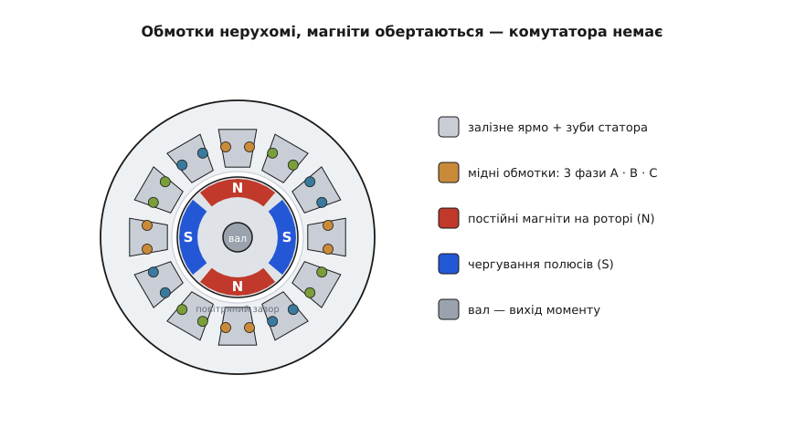
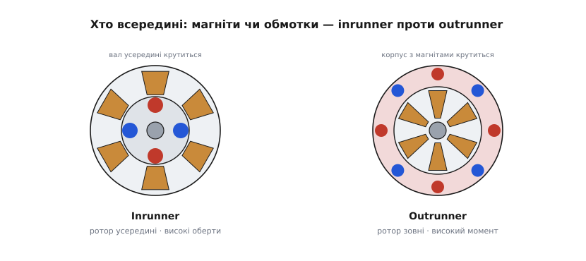
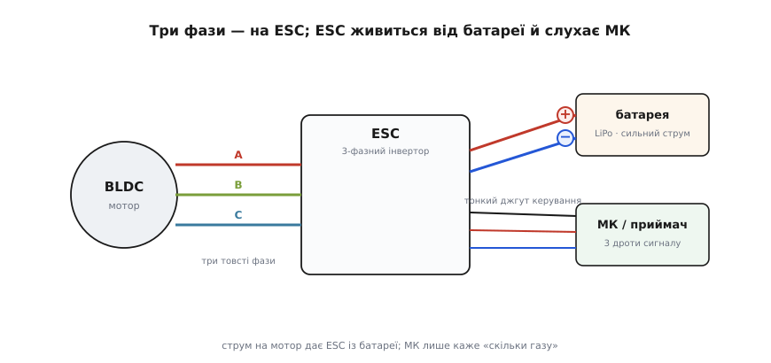

# Безколекторний мотор (BLDC)

<preknowlist>
- [DC-мотор (щітковий)](topic:electronics/brushed-dc-motor) — як обертається звичайний моторчик і що робить колектор зі щітками; BLDC — це той самий принцип, але з викинутими щітками, і без цього порівняння не зрозуміти, навіщо він узагалі з'явився.
- [Магнітне поле](topic:physics/magnetic-field) — що поле має напрям, що воно притягує/відштовхує полюси; уся робота мотора — гра двох полів, які женуться одне за одним.
- [Постійні магніти](topic:physics/permanent-magnets) — тіло зі сталим власним полем (тут — неодимові магніти ротора), яке нікуди не зникає, поки на нього не подіяти теплом чи іншим сильним полем.
- [Електромагнітна індукція](topic:physics/electromagnetic-induction) — струм у котушці робить із неї магніт, а рух магніту повз котушку наводить у ній напругу; обидва боки цього явища тут працюють одночасно.
- [ШІМ](topic:electronics/pwm) — як цифровий вивід «дозує» середню потужність швидким увімк/вимк; ним ESC регулює, скільки струму йде в мотор.
</preknowlist>

Візьміть у руки моторчик від квадрокоптера чи від електросамоката — і одразу відчуєте, що це щось інакше за звичний DC-моторчик із двома дротиками. По-перше, з нього стирчать **три** товсті дроти, а не два. По-друге, якщо крутнути вал пальцями, він не крутиться вільно й гладко, а йде **ривками**, з відчутними «сходинками», ніби чіпляється за невидимі зубчики. І по-третє — якщо покрутити швидше, на тих трьох дротах з'явиться напруга: мотор сам стає джерелом струму. Усе це — прямі наслідки того, як він влаштований усередині. Це **безколекторний мотор**, він же **BLDC** (англ. *brushless direct current* — постійний струм без щіток).

Назва звучить як заперечення: мотор, у якому **чогось немає**. І це точно передає суть. Щоб зрозуміти BLDC, треба спершу згадати, що саме викинули й чому за цим полюванням стояла ціла інженерна мрія.

## Навіщо взагалі позбуватися щіток

У звичайному [щітковому DC-моторі](topic:electronics/brushed-dc-motor) обмотки крутяться разом з валом, а магніти стоять нерухомо на корпусі. Але щоб обмотка тягла ротор далі й далі, струм у ній треба **перемикати** щоразу, коли вона проходить повз полюс магніту — інакше вона застрягне, притягнута, і зупиниться. Це перемикання робить хитра механічна деталь: **колектор** (лат. *collector* — збирач) — розрізане кільце на валу, до якого труться дві вугільні **щітки**. Кільце обертається, щітки стоять, контакт по черзі переходить із сегмента на сегмент — і струм у роторній обмотці сам собою міняє напрям у потрібну мить. Геніально просто: перемикач, що не потребує жодної електроніки.

Але щітки труться. А все, що треться, — **зношується, іскрить і гріється**. Вугільний пил осідає всередині, іскри в місці контакту породжують радіоперешкоди й потроху випалюють мідь колектора, тертя з'їдає частину потужності на марне тепло, а на великих обертах щітки починають «підстрибувати» й губити контакт. Мотор із щітками має обмежений ресурс просто тому, що в ньому є деталь, яка фізично стирається. Для іграшки це байдуже, а для дрона, жорсткого диска чи промислового привода, що має крутитися роками без обслуговування, — вирок.

Звідси мрія: **лишити перемикання, але прибрати щітки**. А раз перемикати струм тепер нема кому механічно — це має робити електроніка ззовні. Саме коли транзистори стали достатньо надійними, щоб узяти на себе роль щіток, безколекторний мотор із красивої ідеї перетворився на робочу річ. Перший практичний BLDC із твердотільною комутацією описали Т. Ґ. Вілсон і П. Г. Трікі 1962 року в доповіді «D-c machine with solid-state commutation» — вони ж указали три речі, без яких безщітковий мотор не працює: визначити, де зараз ротор; обрати, які котушки живити; і власне перемкнути на них струм. Ці три задачі й досі — весь зміст керування BLDC. *(Усталений факт: доповідь AIEE, жовтень 1962; ця дата — загальновизнаний орієнтир народження практичного BLDC, хоча патентні спроби замінити колектор транзисторами тривали й у 1950-х.)*

> 🔧 **Навіщо це.** «Безколекторний» — не маркетинг, а конкретна обіцянка: **нема чому стиратися й іскрити**. Тому BLDC ставлять там, де ресурс і чистота критичні: у кулерах комп'ютера, що крутяться цілодобово роками; у приводах дронів, де іскріння щіток забивало б радіоканал; у жорстких дисках і безлічі побутової техніки. Ціна за це — мотор більше не вмикається двома дротами від батарейки; йому **обов'язково** потрібен електронний драйвер. Ви купуєте не просто мотор, а мотор **у парі з ESC**.

## Що всередині: усе навпаки

Найпростіший спосіб зрозуміти BLDC — це побачити, що його **вивернули навиворіт** відносно щіткового. У щітковому обмотки крутяться, магніти стоять. У безколекторному — **навпаки**: обмотки нерухомо сидять на корпусі, а обертаються **постійні магніти**.


*Нерухома частина (статор) — залізне ярмо з зубами, на які намотано мідь трьох фаз A, B, C. Рухома частина (ротор) — постійні магніти з полюсами, що чергуються (N-S-N-S). Між ними — вузький повітряний зазор. Щіток і колектора немає взагалі: струм у котушки заводиться прямо ззовні через три фазні дроти.*

Розберімо дві головні частини.

**Статор** (лат. *stator* — той, що стоїть) — нерухома частина. Це кільце з електротехнічної сталі, зібране з тонких пластин, із зубами, спрямованими досередини. На зуби намотано мідний дріт — **обмотки**. Дроти згруповано у **три фази**, зазвичай названі **A, B, C** (або U, V, W). Кожна фаза — це своя незалежна котушка (точніше, кілька котушок, з'єднаних разом), і в неї заводять свій струм зі свого дроту. Ось звідки **три виводи**: по одному на фазу.

**Ротор** (лат. *rotor* — той, що крутиться) — рухома частина на валу. На ньому сидять **постійні магніти**, найчастіше сильні неодимові, розставлені так, що їхні полюси **чергуються** по колу: північ, південь, північ, південь. Ротор ніяк не з'єднаний з обмотками електрично — між ним і статором лише вузький повітряний зазор. Він просто «висить» у магнітному полі, яке створюють котушки, і женеться за ним.

І тепер уся механіка мотора зводиться до одного речення. Коли ми пускаємо струм у якусь фазу, її зуби стають електромагнітом із певним полюсом — і найближчий магніт ротора **притягується** до нього (різнойменні полюси тягнуться). Ротор повертається, щоб «прилипнути». Але щойно він майже долетів, ми **вимикаємо цю фазу й вмикаємо наступну** — і точка притягання перестрибує далі по колу. Ротор знову женеться. Вимикаємо, вмикаємо наступну — знову женеться. Магнітне поле статора біжить по колу, як вогники на новорічній гірлянді, а магніти ротора вічно доганяють його, не встигаючи вхопити. Оце безкінечне «майже наздогнав» і є обертання.

> 🔧 **Навіщо це.** Ті самі «сходинки», що ви відчуваєте, крутячи вал вимкненого мотора пальцями, — це і є магніти ротора, що клацають від зуба до зуба залізного статора (їх називають **зубцевими фіксаціями**, англ. *cogging*). Вони кажуть про важливе: мотор **не має природного напряму** й **не крутиться сам**. Він знає лише «до котушки, що зараз під струмом». Щоб він обертався рівно й в один бік, **хтось ззовні мусить у правильному ритмі перемикати фази** — і робити це синхронно з тим, де зараз ротор. Це і є задача драйвера.

## Ключ до всього: поле статора має бігти синхронно з ротором

Мотор крутиться, лише поки перемикання фаз **встигає** за ротором — не раніше, не пізніше. Увімкнули наступну фазу зарано, поки ротор ще не долетів, — тягнемо його назад. Спізнилися — ротор проскочив, і момент падає. Тобто драйверу постійно треба знати **одне число**: де зараз ротор, під яким кутом. Без цього перемикати наосліп — усе одно що штовхати гойдалку із заплющеними очима.

Звідси — два світи керування BLDC, за способом «підгляду» за ротором.

Перший — **з давачами**. У мотор вбудовують три [давачі Голла](topic:physics/hall-effect) — крихітні мікросхеми, що відчувають магнітне поле й видають «1» чи «0» залежно від того, який полюс магніту зараз навпроти них. Три таких давачі по колу дають шість комбінацій за оберт — цього досить, щоб драйвер завжди знав, у якому із шести секторів ротор, і вчасно перемикав фази. Такі мотори мають, крім трьох силових, ще й тонкий джгут сигнальних дротів. Їх ставлять там, де важливий певний старт із місця під навантаженням: у гіроскутерах, приводах коліс, промислових механізмах.

> 🔧 **Навіщо це.** [Давач Голла](topic:physics/hall-effect) — це «око» мотора. Він перетворює положення магнітного полюса на цифровий сигнал, який драйвер читає миттєво, навіть коли вал стоїть. Тому мотор із давачами впевнено рушає під вагою відразу, без «намацування», — критично для транспорту, де смикнути невпопад на старті небезпечно.

Другий світ — **без давачів** (англ. *sensorless*), і він хитріший та елегантніший. Коли ротор із магнітами крутиться повз котушки, він **сам наводить у них напругу** — це та сама [електромагнітна індукція](topic:physics/electromagnetic-induction), рух магніту повз провід. Ця напруга зветься **зворотною ЕРС** (англ. *back-EMF*), бо вона протидіє тій, що ми подаємо. І ось у чому фокус: у кожен момент драйвер живить лише дві фази з трьох, а **третя, вільна, у цей час працює як давач** — на ній драйвер міряє наведену роторм напругу й за нею вираховує, де ротор і коли перемикати. Мотору не потрібні жодні окремі давачі — він сам собі давач. Плата за це — на дуже малих обертах зворотна ЕРС ще заслабка, щоб її впевнено зчитати, тож рушає такий мотор наосліп, коротким «розгонним танцем», і лише набравши швидкість, переходить на точне керування по зворотній ЕРС. Саме тому дрон-мотори іноді ледь сіпаються перед плавним стартом. Про зворотну ЕРС як повноцінний давач варто знати окремо — це [фізична основа sensorless-керування](topic:electronics/back-emf).

Як саме драйвер вибирає, які фази й коли живити — чи то грубими шістьма кроками на оберт, чи то плавними синусоїдами, — це окрема велика тема; тут досить знати, що вибір є і від нього залежить, чи мотор гуде й смикається, чи крутиться шовково. Хто хоче в неї зануритися — дивіться [стратегії комутації BLDC](topic:electronics/bldc-commutation), де розкладено і простий шестикроковий метод, і плавне векторне керування.

## Форма зворотної ЕРС: BLDC чи насправді PMSM

Тут ховається тонкість, через яку плутаються навіть у крамницях. За формою наведеної роторм напруги ці мотори ділять на два роди:

- Якщо зворотна ЕРС має форму **трапеції** (наростає, тримається плато, спадає) — це «істинний» **BLDC**, і його зручно живити грубими прямокутними кроками струму.
- Якщо зворотна ЕРС **синусоїдна** (плавна хвиля) — це, строго кажучи, вже **PMSM** (англ. *permanent magnet synchronous motor* — синхронний мотор на постійних магнітах), і найгарніше він крутиться від плавного синусоїдного струму.

Різниця у формі йде від того, як намотано котушки: зосереджена обмотка дає трапецію, розподілена — синусоїду. Практичний бік — у плавності: трапецію простіше рахувати, але вона дає легке пульсування моменту й характерне гудіння; синусоїда крутиться шовково й тихо, ціною складнішого драйвера.

Варто чесно сказати: більшість того, що на ринку продають як «BLDC-мотори» для дронів і моделей, за формою зворотної ЕРС **насправді ближчі до PMSM** — у них синусоїдна характеристика. Але прижилася назва «BLDC» як загальний ярлик для всіх безщіткових моторів із магнітами на роторі, тож у побуті обидва роди звуть просто «безколекторними». *(Це усталене спостереження інженерів-практиків, а не помилка: межа BLDC/PMSM — не про сам мотор, а про форму його зворотної ЕРС і про те, яким струмом його вигідніше живити.)*

## Inrunner чи outrunner: хто крутиться зовні

Безколекторні мотори бувають двох будов, і від цього прямо залежить їхній характер — швидкий чи «тяговий».


*Inrunner: ротор із магнітами всередині, обмотки нерухомо зовні — крутиться вал у центрі; менше полюсів, вищі оберти, менший момент. Outrunner: обмотки в центрі нерухомі, а зовнішня «дзвіночок»-обичайка з магнітами обертається навколо них; більше полюсів, високий момент на малих обертах.*

**Inrunner** («той, що бігає всередині») — класична будова: магніти-ротор усередині, обмотки статора зовні. Крутиться внутрішній вал. Такі мотори — **швидкі**: розвивають десятки тисяч обертів, але момент дають скромний. Їх ставлять туди, де потрібна швидкість, а момент потім множать редуктором: у мотори RC-автомоделей, у деякий інструмент.

**Outrunner** («той, що бігає зовні») — вивернута будова: обмотки нерухомо в центрі, а обертається **зовнішній корпус** із магнітами, як дзвіночок, надітий на статор. Саме такий мотор ви бачите на дроні: гвинт кріпиться прямо до його рухомого корпусу-«дзвіночка». Outrunner-и мають **багато полюсів** і дають **великий момент на малих обертах** — рівно те, що треба гвинту, який можна крутити прямо, без редуктора. Тому дрони, гіробайки й прямоприводні механізми — це майже завжди outrunner-и.

## Kv — скільки обертів на вольт

Обираючи безколекторний мотор, ви обов'язково натрапите на його головну паспортну цифру — **Kv** (від англ. *velocity constant*, стала швидкості; пишуть саме «Kv», не плутати з кіловольтами). Це число каже, **скільки обертів на хвилину дасть мотор на кожен поданий вольт, без навантаження на валу**.

```
оберти (без навантаження) ≈ Kv × напруга

Приклад: мотор 920 KV на батареї 3S (≈ 11.1 В)
    920 об/хв/В × 11.1 В ≈ 10 200 об/хв (на холостому ходу)
```

Що більший Kv — то «швидший» мотор: багато обертів, менший момент, під менші гвинти. Що менший Kv — то «тяговіший»: менше обертів на той самий вольт, зате більший момент, під великі гвинти. Тому важкий вантажний дрон бере низько-Kv мотори з великими гвинтами, а маленький гоночний — високо-Kv з малими.

І тут з'являється красивий фізичний зв'язок. Kv — це, по суті, обернений бік **зворотної ЕРС**. Той самий магніт, що, крутячись, наводить у котушках напругу, визначає й те, скільки обертів мотор дасть на вольт. Мотор із високим Kv наводить малу зворотну ЕРС на оберт — тому й розганяється до багатьох обертів, поки та ЕРС нарешті зрівняється з поданою напругою. Мотор із низьким Kv наводить сильну ЕРС на оберт — тому впирається в неї рано, на менших обертах. Kv і сила зворотної ЕРС — це дві сторони однієї монети, дві цифри одного магніту.

> 🔧 **Навіщо це.** Kv — перше, за чим підбирають мотор під задачу. Помилитеся з ним — і система не полетить: високо-Kv мотор із важким гвинтом просто перевантажить ESC надмірним струмом і згорить, а низько-Kv з дрібним гвинтом не дасть тяги. Kv, напруга батареї й розмір гвинта — це трикутник, який добирають разом, а не поодинці.

## Як його під'єднати: три фази, ESC і батарея

Тепер найпрактичніше. Безколекторний мотор **не можна ввімкнути напряму** ні від батарейки, ні навіть від джерела постійної напруги — він на це просто не зреагує або смикнеться й застигне. Йому **обов'язково** потрібен посередник — **ESC** (англ. *electronic speed controller* — електронний регулятор швидкості). Це і є той «електронний колектор», що замінив щітки.


*Три фазні дроти мотора йдуть на три виходи ESC. ESC живиться напряму від батареї товстими силовими дротами («+» і «−»). Від мікроконтролера чи радіоприймача до ESC іде тонкий джгут керування: сигнал + живлення логіки (+5 В) + спільна земля. Струм на мотор дає сам ESC із батареї; мікроконтролер лише каже «скільки газу».*

Розкладімо всі з'єднання.

**Три фази мотор → ESC.** Три товсті дроти мотора йдуть на три силові виходи ESC. Порядок фаз задає **напрям обертання**: під'єднали як є — крутиться в один бік, поміняли будь-які **два** дроти місцями — крутиться в інший. Це найлегший спосіб розвернути мотор, і його не треба боятися: жодна перестановка фаз ESC не пошкодить.

**ESC → батарея.** ESC живиться напряму від батареї (найчастіше літій-полімерної, LiPo) двома товстими силовими дротами: «+» і «−». Саме через них тече весь потужний струм, що йде в мотор, — десятки ампер. Тому ці дроти товсті, а полярність тут **критична**: переплутаєте «+» і «−» — і ESC згорить миттєво, часто з димом. Це чи не найдорожча помилка новачка.

**ESC → мікроконтролер (чи приймач).** А ось керує ESC-ом тонкий джгут із трьох дротів: **сигнал**, **+5 В** і **земля**. Сигнал — це те саме керування, що й у сервомашинки: імпульси сталої частоти, де важлива їхня **ширина** (типово 1000 мкс = «стоп», 2000 мкс = «повний газ»); це [PWM-протокол сервокерування](topic:electronics/pwm-servo-protocol). Ширина імпульсу каже ESC-у, скільки «газу» дати мотору, а вже ESC сам вирішує, які фази й коли живити. Живлення +5 В у цьому джгуті часто дає сам ESC (вбудований стабілізатор, англ. *BEC*), щоб запитати приймач, — тож не завжди його треба подавати ззовні.

Ось де ховається важлива відмінність від щіткового мотора. Там ви подаєте живлення прямо на мотор і напругою регулюєте оберти. Тут мікроконтролер **не дає мотору ні краплі потужності** — він лише посилає слабкий сигнал «скільки газу», а всю силу бере й перемикає **ESC із батареї**. Тонкий сигнальний дріт і товсті силові дроти — два різні світи, які не можна плутати.

> 🔧 **Навіщо це.** Такий поділ рятує і мотор, і мозок системи. Мікроконтролер працює з мілі-, а мотор — із десятками ампер; поставити між ними ESC означає **не пускати силовий струм близько до логіки**. Тому в коді керувати безколекторним мотором так само просто, як сервою: ви лишень задаєте ширину імпульсу, а вся страшна силова частина — комутація фаз, сильні струми, зворотна ЕРС — лишається всередині ESC. Готовий приклад, як розганяти й гальмувати мотор через ESC із мікроконтролера — з обов'язковою процедурою «озброєння» (арм) і пастками — зібрано в [окремому описі API](topic:actuators/bldc-motor-module/api-esc-control.md).

## На що зважати на практиці

Зберімо разом те, на чому найчастіше спотикаються з безколекторними моторами.

**Мотор нізащо не крутиться без ESC.** Найперше й головне: два дроти на батарейку — і нічого. Безколекторному завжди потрібен драйвер. Це не той мотор, що «просто вмикається».

**Полярність живлення ESC — свята.** Переплутати «+» і «−» на силових дротах батареї — миттєво спалити ESC. Перевіряйте двічі перед першим увімкненням; багато хто підпалив регулятор саме тут.

**Напрям крутіння — перестановкою двох фаз.** Крутиться не в той бік — не шукайте налаштувань, просто поміняйте місцями будь-які два з трьох фазних дротів. Це штатний і безпечний спосіб.

**Kv, напруга й гвинт — разом.** Мотор під надто важкий гвинт або надто високу напругу тягне надмірний струм і перегріває себе та ESC. Підбирайте Kv, батарею й гвинт як одну зв'язку, звіряючись із таблицями виробника, а не навмання.

**«Озброєння» перед стартом.** Більшість ESC із міркувань безпеки не запустять мотор, поки на вході не побачать сигнал «стоп» (мінімальний газ) — це захист, щоб гвинт не рвонув, тільки-но подали живлення. Тому код завжди починає з мінімального газу й лише потім піднімає — інакше мотор «мовчить», і причина не в поломці.

**Гарячий — це тривожно.** Трохи теплий після роботи мотор — норма. Гарячий настільки, що не втримати пальця, — сигнал перевантаження: завеликий гвинт, заслабке охолодження чи неправильний Kv. Магніти ротора **бояться перегріву** — надто гарячий неодим частково втрачає магнітні властивості назавжди, і мотор уже не відновить колишню тягу.

**Зворотна ЕРС при гальмуванні.** Мотор, що крутиться за інерцією, — це генератор: він жене струм назад у ESC і батарею. Різко скидаючи газ із високих обертів, ви можете підкинути напругу на шині живлення. У малих системах це дрібниця, а у великих доводиться це передбачати. Це та сама зворотна ЕРС, лише з іншого боку.
