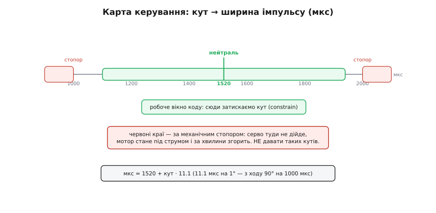
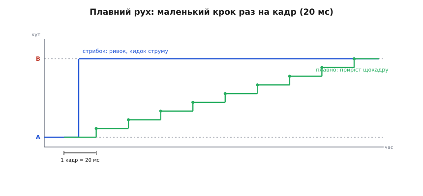

# ⚙️ Проєкт: керуємо HD-1370A з мікроконтролера

Серво припаяне, три дроти на місцях, окреме живлення 5 В гуде під столом. Лишається змусити цю крихітку слухатися коду — щоб кермо ставало точно туди, куди наказано, ходило плавно й не спалило себе об власний стопор. На перший погляд задача на три рядки: підключив бібліотеку, написав `write(90)` — і все. Але саме тут HD-1370A ставить кілька тихих пасток, на яких новачок губить або точність, або живе серво. Пройдемо весь шлях чесно: від найпростішого «поворухнись» до коду, який знає справжню нейтраль, не дає валу впертися й веде його між кутами без ривка.

Код тут — справжній, той, що компілюється й заливається. Основна мова — **C++ під Arduino** (ATmega328P на 16 МГц), бо це серце домену: керування піном у реальному часі, мікросекунди, кадри 50 Гц. Поряд, у вкладках, — **MicroPython під ESP32**, бо друга типова платформа під таке серво саме ESP, і на ній ідіома інша, але думка та сама. Обидва приклади роблять буквально одне й те саме, рядок у рядок; перемикайте вкладку під свою плату.

## Найперший рух: чому не «моторчик», а бібліотека

Спокуса — смикати сигнальний пін вручну: підняв, зачекав 1520 мікросекунд, опустив, зачекай до 20 мілісекунд, повтори. Це працює, але з'їдає весь процесор на цикли очікування й ламається, щойно в програмі з'явиться ще хоч одна справа. Тому для серв є готова бібліотека, і вона робить рівно те, що втомливо робити руками: тримає **50 імпульсів на секунду** потрібної ширини у фоні, апаратним таймером, поки ваш код зайнятий чимось іншим.

> 🔧 **Навіщо це.** Бібліотека серв — це не «щоб простіше», а щоб коректно. Вона вішає формування імпульсів на таймер чипа, і ті виходять рівні навіть коли `loop()` рахує щось важке. Спробуєте крутити 20-мілісекундний кадр власним `delay()` — і будь-яка інша дія (зчитати давач, відповісти по радіо) зсуне імпульс, серво смикнеться. Віддайте тайминг заліза залізу.

Мінімальний скетч, що ставить вал у центр і повертає на 30° в один бік раз на секунду:

:::tabs
```cpp
#include <Servo.h>

const uint8_t SERVO_PIN = 9;   // сигнальний (жовтий) дріт на ~D9
Servo servo;                   // об'єкт-керувач одним серво

void setup() {
    servo.attach(SERVO_PIN);   // почепити пін; бібліотека сама пускає 50 Гц
    servo.writeMicroseconds(1520);  // справжня нейтраль HD-1370A
    delay(500);
}

void loop() {
    servo.writeMicroseconds(1520);  // центр
    delay(1000);
    servo.writeMicroseconds(1520 + 333);  // ≈ +30° від центру (30° · 11.1 мкс/°)
    delay(1000);
}
```
```python
from machine import Pin, PWM
from time import sleep_ms

# ESP32: будь-який вихідний пін; тут GPIO 18
servo = PWM(Pin(18), freq=50)   # 50 Гц одразу, як і треба серву

def write_us(us):
    servo.duty_ns(int(us) * 1000)   # мкс → нс; duty_ns — прямий аналог writeMicroseconds

write_us(1520)                  # справжня нейтраль HD-1370A
sleep_ms(500)

while True:
    write_us(1520)              # центр
    sleep_ms(1000)
    write_us(1520 + 333)        # ≈ +30° від центру (30° · 11.1 мкс/°)
    sleep_ms(1000)
```
:::

Зверніть увагу на головне рішення вже тут: я **не** пишу `servo.write(30)` у градусах, а задаю ширину імпульсу прямо в мікросекундах через `writeMicroseconds`. Це навмисно, і причина того варта окремої розмови.

## Чому `write(кут)` бреше саме на цьому серво

Метод `write(angle)` виглядає найзручнішим: даєш градуси від 0 до 180, серво їх відпрацьовує. Але всередині бібліотека Arduino перераховує ці градуси у мікросекунди за **своїми** межами, і межі ці — не ті, що в HD-1370A. За замовчуванням `Servo` розтягує 0…180° на діапазон **544…2400 мкс** (це зашито константами `MIN_PULSE_WIDTH` і `MAX_PULSE_WIDTH` бібліотеки — можна звіритися з її вихідним кодом). А наше серво живе приблизно в **1000…2000 мкс** із центром 1520.

Порахуймо, що станеться, якщо наївно написати `servo.write(90)`, сподіваючись на центр:

**Умова.** Бібліотека мапить 0…180° на 544…2400 мкс лінійно. Питаємо, яка ширина вийде для 90°.

```
ширина(90°) = 544 + (2400 − 544) · 90/180
            = 544 + 1856 · 0.5
            = 544 + 928
            = 1472 мкс
```

Замість жаданих 1520 отримали 1472 — вал стане на пару градусів збоку від справжньої нейтралі. А `write(0)` попросить 544 мкс — це **далеко за** механічним стопором HD-1370A (край ходу коло 1000 мкс), тобто серво впреться й почне гріти застряглий мотор. Ось чому «просте» `write(кут)` на цьому серво водночас і промахується по центру, і небезпечне на краях.

Є два чесні виходи. Перший — сказати бібліотеці правду про межі при `attach`, тоді `write(кут)` почне мапити градуси на правильний діапазон. Другий — узагалі не покладатися на її градуси, а рахувати мікросекунди самому, бо тоді ти точно знаєш, що надсилаєш. Обидва варіанти нижче; я віддаю перевагу другому, бо він прозорий, але покажу й перший.


*Увесь код зводиться до життя всередині зеленого вікна. Центр — 1520 мкс (не 1500). За червоними краями — механічні стопори: туди вал не дійде, а мотор стане під струмом і за хвилини згорить. Тому кут завжди затискають усередину вікна, а точний центр підправляють калібруванням.*

## Точка відліку: калібруємо справжню нейтраль

Паспорт каже «нейтраль 1520 мкс», і це добра стартова точка, але не істина в останній інстанції. Кожен конкретний примірник трохи свій: ріг насаджений на шліци з дискретним кроком, важіль керма стоїть не строго рівно, сам потенціометр має розкид. Тому справжню нейтраль — ту ширину, за якої **ваше** кермо стоїть рівно, — знаходять руками, один раз, і зашивають у код константою.

Спосіб простий і надійний. Заливаємо скетч, що читає число з послідовного порту й одразу шле його як ширину імпульсу. Крутите значення туди-сюди, доки кермо не стане ідеально по центру, — оце знайдене число й є ваша нейтраль.

:::tabs
```cpp
#include <Servo.h>

const uint8_t SERVO_PIN = 9;
Servo servo;

void setup() {
    Serial.begin(115200);
    servo.attach(SERVO_PIN);
    servo.writeMicroseconds(1520);      // старт від паспортної нейтралі
    Serial.println(F("Введи ширину в мкс (напр. 1520) і Enter:"));
}

void loop() {
    if (Serial.available()) {
        int us = Serial.parseInt();     // прочитати число
        if (us >= 1000 && us <= 2000) { // не пускати за межі ходу
            servo.writeMicroseconds(us);
            Serial.print(F("-> ")); Serial.print(us); Serial.println(F(" мкс"));
        } else {
            Serial.println(F("поза 1000..2000 — пропущено"));
        }
    }
}
```
```python
from machine import Pin, PWM
import sys

servo = PWM(Pin(18), freq=50)

def write_us(us):
    servo.duty_ns(int(us) * 1000)

write_us(1520)                          # старт від паспортної нейтралі
print("Введи ширину в мкс (напр. 1520) і Enter:")

while True:
    line = sys.stdin.readline().strip() # прочитати рядок із REPL/порту
    if not line:
        continue
    try:
        us = int(line)
    except ValueError:
        continue
    if 1000 <= us <= 2000:              # не пускати за межі ходу
        write_us(us)
        print("->", us, "мкс")
    else:
        print("поза 1000..2000 — пропущено")
```
:::

Помітили запобіжник: код **не пускає** значення за межі 1000…2000 мкс навіть на етапі калібрування. Це не зайва обережність — саме на калібруванні найлегше з переляку вбити «2500» і залишити серво впертим у стопор, доки шукаєш, чому воно гуде. Знайшли рівне число (хай вийшло, скажімо, 1508) — записуєте його константою `NEUTRAL_US` і забуваєте про паспортні 1520.

> 🔧 **Навіщо це.** Калібрування — це різниця між «серво по центру» і «серво майже по центру». На кімнатному літачку невдала нейтраль означає, що модель весь час тягне вбік, і ви це компенсуєте триммером на пульті, гублячи хід керма. Пів хвилини калібрування знімають проблему в корені: кермо стоїть рівно апаратно, а весь хід лишається для керування.

## Обмеження ходу: як не спалити серво об стопор

Тепер найважливіша частина — та, що рятує залізо. Хід валу HD-1370A обмежений механічно, приблизно ±45° від центру. Якщо наказати кут за цією межею, серво впреться у внутрішній стопор, **а плата всередині цього не знає**: потенціометр доповідає, що фактичний кут усе одно не дотягує до наказаного, і плата чесно тримає мотор під струмом, намагаючись «дотиснути». Мотор стоїть, обмотка гріється, пластмасовий редуктор поряд плавиться. Кілька хвилин такого — і серво мертве.

Захист від цього — не апаратний, його треба зробити в коді, і він елементарний: **ніколи не надсилати ширину поза безпечним вікном**. Причому вікно затягують трохи всередину від самих стопорів, з запасом, щоб не жити на самій межі й не гріти серво навіть у краю ходу.

Зробимо крихітний шар-обгортку, через який проходитиме кожен наказ кута. Він приймає кут у градусах від центру, перераховує в мікросекунди й **затискає** результат у вікно. Далі весь код спілкується з серво лише через цю функцію — і промахнутися за межу стає фізично нікуди.

:::tabs
```cpp
#include <Servo.h>

const uint8_t SERVO_PIN = 9;

// --- калібрування конкретного примірника ---
const int NEUTRAL_US = 1520;   // знайдена нейтраль (див. калібрувальний скетч)
const float US_PER_DEG = 11.1; // 1000 мкс на 90° ходу ≈ 11.1 мкс/°

// --- безпечне вікно, підтягнуте ВСЕРЕДИНУ від стопорів ---
const int MIN_US = 1100;       // не 1000: лишаємо запас до стопора
const int MAX_US = 1940;       // не 2000: те саме з іншого боку

Servo servo;

// Затиснути число у [lo, hi] (Arduino має constrain(), але покажемо явно).
int clampInt(int v, int lo, int hi) {
    if (v < lo) return lo;
    if (v > hi) return hi;
    return v;
}

// Єдина точка входу: кут у градусах від центру -> безпечний імпульс.
void setAngle(float deg) {
    int us = NEUTRAL_US + (int)(deg * US_PER_DEG);
    us = clampInt(us, MIN_US, MAX_US);   // ГОЛОВНИЙ запобіжник
    servo.writeMicroseconds(us);
}

void setup() {
    servo.attach(SERVO_PIN);
    setAngle(0);                 // у центр
}

void loop() {
    setAngle(-30);  delay(800);  // ліворуч
    setAngle(+30);  delay(800);  // праворуч
    setAngle(+90);  delay(800);  // ПРОСИМО забагато — але clamp врятує серво
}
```
```python
from machine import Pin, PWM
from time import sleep_ms

SERVO_PIN = 18

# --- калібрування конкретного примірника ---
NEUTRAL_US = 1520      # знайдена нейтраль
US_PER_DEG = 11.1      # 1000 мкс на 90° ходу ≈ 11.1 мкс/°

# --- безпечне вікно, підтягнуте ВСЕРЕДИНУ від стопорів ---
MIN_US = 1100          # не 1000: запас до стопора
MAX_US = 1940          # не 2000: те саме з іншого боку

servo = PWM(Pin(SERVO_PIN), freq=50)

def write_us(us):
    servo.duty_ns(int(us) * 1000)

def clamp(v, lo, hi):
    return lo if v < lo else hi if v > hi else v

# Єдина точка входу: кут у градусах від центру -> безпечний імпульс.
def set_angle(deg):
    us = NEUTRAL_US + int(deg * US_PER_DEG)
    us = clamp(us, MIN_US, MAX_US)   # ГОЛОВНИЙ запобіжник
    write_us(us)

set_angle(0)                         # у центр

while True:
    set_angle(-30); sleep_ms(800)    # ліворуч
    set_angle(+30); sleep_ms(800)    # праворуч
    set_angle(+90); sleep_ms(800)    # ПРОСИМО забагато — але clamp врятує серво
```
:::

Останній рядок циклу навмисне просить `+90°`, яких у серва немає. Без затиску це був би смертний вирок: імпульс поїхав би до 2520 мкс, вал уперся б у стопор і мотор став би під струмом. Із затиском `+90°` тихо перетворюється на `MAX_US = 1940` — серво стане в дальню безпечну точку й **не грітиметься**. Це і є весь секрет довговічності: один `clamp` на шляху кожного наказу.

> 🔧 **Навіщо це.** Затиск ходу — найдешевша страховка в усій роботі з серво і найчастіше забута. Один заблуканий `write` за межу під час налагодження — і за обідом ви повертаєтеся до серва, що чверть години гріло застряглий мотор. Пропустіть **усі** кути через одну функцію із `clamp`, і хоч би що нагородила решта коду, серво лишається живим. Дешевше за нову деталь на порядок.

## Плавний рух: вести, а не жбурляти

Коли ви пишете `setAngle(-30)`, а потім одразу `setAngle(+30)`, серво кидається з кута в кут на повній швидкості — це різкий ривок і різкий кидок струму. Для перекладання керма іноді саме це й треба (швидка реакція), але часто хочеться, щоб рух був **плавний**: камера на підвісі повертається м'яко, механізм не смикається, піковий струм менший. Плавність не вбудована в серво — її роблять у коді, і думка проста до банальності: замість одного стрибка на весь кут ведіть вал **маленькими приростами**, по чуть-чуть раз на кадр.


*Наказ «стань у B» бібліотека відпрацьовує стрибком (синій) — ривок і кидок струму. Плавний рух (зелений) код будує сам: щокадру додає маленький крок до цілі, тож вал повзе рівно й керовано. Крок на кадр задає швидкість; менший крок — повільніше й м'якше.*

Природний ритм для приростів — той самий **кадр 20 мс**, з яким живе серво: немає сенсу оновлювати ціль частіше, ніж серво встигає прочитати новий імпульс. Тому робимо неблокуючий рух: функція `moveTo` тримає поточний кут і при кожному виклику підсуває його на маленький крок до цілі. Викликаємо її раз на 20 мс — і вал плавно пливе, а `loop()` тим часом вільний робити інше (у цьому й перевага перед наївним циклом із `delay`).

:::tabs
```cpp
#include <Servo.h>

const uint8_t SERVO_PIN = 9;
const int   NEUTRAL_US = 1520;
const float US_PER_DEG = 11.1;
const int   MIN_US = 1100, MAX_US = 1940;
const unsigned long FRAME_MS = 20;   // крок часу = кадр серва (50 Гц)

Servo servo;
float curDeg = 0;      // де вал зараз (у градусах від центру)
float tgtDeg = 0;      // куди хочемо
float stepDeg = 1.0;   // приріст на кадр -> задає швидкість
unsigned long lastFrame = 0;

int clampInt(int v, int lo, int hi) { return v < lo ? lo : v > hi ? hi : v; }

void applyDeg(float deg) {
    int us = clampInt(NEUTRAL_US + (int)(deg * US_PER_DEG), MIN_US, MAX_US);
    servo.writeMicroseconds(us);
}

// Викликати часто; сама рухає не частіше, ніж раз на кадр.
void serviceMove() {
    unsigned long now = millis();
    if (now - lastFrame < FRAME_MS) return;   // ще не час на новий крок
    lastFrame = now;

    float diff = tgtDeg - curDeg;
    if (fabs(diff) <= stepDeg) curDeg = tgtDeg;         // дійшли — сісти точно на ціль
    else curDeg += (diff > 0 ? stepDeg : -stepDeg);     // крок у бік цілі
    applyDeg(curDeg);
}

void moveTo(float deg) { tgtDeg = deg; }   // лише задати ціль, рух зробить serviceMove

void setup() {
    servo.attach(SERVO_PIN);
    applyDeg(0);
}

void loop() {
    // приклад: гойдати між −30 і +30, міняючи ціль по досягненні
    if (curDeg == tgtDeg) {
        moveTo(tgtDeg <= 0 ? +30 : -30);
    }
    serviceMove();     // саме тут відбувається плавний крок
    // ... тут loop() вільний робити будь-що інше ...
}
```
```python
from machine import Pin, PWM
from time import ticks_ms, ticks_diff

SERVO_PIN = 18
NEUTRAL_US = 1520
US_PER_DEG = 11.1
MIN_US, MAX_US = 1100, 1940
FRAME_MS = 20                  # крок часу = кадр серва (50 Гц)

servo = PWM(Pin(SERVO_PIN), freq=50)

cur_deg = 0.0                  # де вал зараз
tgt_deg = 0.0                  # куди хочемо
step_deg = 1.0                 # приріст на кадр -> швидкість
last_frame = ticks_ms()

def clamp(v, lo, hi):
    return lo if v < lo else hi if v > hi else v

def apply_deg(deg):
    us = clamp(NEUTRAL_US + int(deg * US_PER_DEG), MIN_US, MAX_US)
    servo.duty_ns(us * 1000)

def service_move():
    global cur_deg, last_frame
    now = ticks_ms()
    if ticks_diff(now, last_frame) < FRAME_MS:   # ще не час на новий крок
        return
    last_frame = now
    diff = tgt_deg - cur_deg
    if abs(diff) <= step_deg:
        cur_deg = tgt_deg                        # дійшли — сісти точно на ціль
    else:
        cur_deg += step_deg if diff > 0 else -step_deg
    apply_deg(cur_deg)

def move_to(deg):
    global tgt_deg
    tgt_deg = deg                                # лише задати ціль

apply_deg(0)

while True:
    if cur_deg == tgt_deg:                       # гойдати між −30 і +30
        move_to(+30 if tgt_deg <= 0 else -30)
    service_move()                               # тут відбувається плавний крок
    # ... цикл вільний робити будь-що інше ...
```
:::

Швидкість руху тут задається однією величиною — `stepDeg`, приростом на кадр. Хочете вдвічі повільніше й м'якше — зменшіть крок; хочете різкіше — збільшіть, аж до стрибка, коли крок більший за всю відстань. Зверніть увагу, що `moveTo` **лише ставить ціль** і миттєво повертається, а весь рух котиться у `serviceMove`, який ви кличете в кожному оберті `loop()`. Це той самий підхід, що і з таймером бібліотеки: важку роботу (рівний тайминг) віддаємо в фон, головний код лишаємо вільним.

**Порахуймо швидкість такого руху.** Хай крок 1° на кадр, кадр 20 мс, ідемо з −30° у +30° (усього 60°):

```
кроків    = 60° / 1° = 60
час       = 60 · 20 мс = 1200 мс = 1.2 с
```

Тобто повне перекладання зайняло б 1.2 секунди — плавно, спокійно. Порівняйте з паспортною «вільною» швидкістю HD-1370A близько 0.1 с на 60° (тобто стрибком): ми навмисно **сповільнили** серво вдесятеро заради м'якості. У цьому вся ідея — плавність купується часом, і скільки саме заплатити, вирішуєте ви одним числом.

## Економія: коли серво варто «відпустити»

Останній штрих. Поки серво тримає кут, воно постійно споживає струм — навіть стоячи, плата дрібно підправляє положення проти тертя й мертвої зони. Якщо кермо якийсь час не потрібно рухати й на нього нічого не тисне, серво можна **відчепити** (англ. *detach*) — бібліотека перестане слати імпульси, і серво «обм'якне», перейшовши в дрібне споживання. Наступний наказ його оживить.

На кімнатному літаку так робити **не можна** — кермо весь час під натиском повітря, відпустиш його і воно поїде. Але для завдань, де положення довго стале й не навантажене (заслінка, що стоїть годину; індикатор-стрілка), детач помітно економить батарею й не гріє серво даремно.

:::tabs
```cpp
// коли серво довго не потрібне і на вал нічого не тисне:
servo.detach();          // припинити імпульси — серво «відпущене»

// оживити перед наступним рухом:
servo.attach(SERVO_PIN);
servo.writeMicroseconds(NEUTRAL_US);
```
```python
# коли серво довго не потрібне і на вал нічого не тисне:
servo.deinit()           # припинити ШІМ — серво «відпущене»

# оживити перед наступним рухом:
servo = PWM(Pin(SERVO_PIN), freq=50)
servo.duty_ns(NEUTRAL_US * 1000)
```
:::

Тут добре видно, як гарно лягають одна на одну дві платформи: `detach()`/`attach()` в Arduino й `deinit()`/повторний `PWM(...)` у MicroPython — це буквально одне й те саме поняття «зняти й знову подати сигнал», лише названо різними словами.

## Складність і пастки

Код вище простий, і майже вся його «складність» — не в алгоритмі, а в дисципліні поводження з фізикою серва. Зберемо гачки, на яких ловляться найчастіше, у порядку того, як боляче вони б'ють.

- **Живлення тільки окреме, земля тільки спільна.** Червоний дріт серва — на окреме джерело 5 В (батарея через [BEC/UBEC](book:power/bec-ubec) або окремий стабілізатор), **не** на пін «5V» плати: пусковий струм серва в мить старту просаджує напругу, і мікроконтролер перезавантажується посеред роботи. А от коричневий (земля) серва **обов'язково** з'єднати із землею плати, інакше сигнальний імпульс не має відносно чого існувати — серво його «не побачить». Роздільне живлення, спільна земля. Це найперша помилка й найпідліша, бо код при ній виглядає правильним, а серво поводиться хаотично.

- **Не тримати серво в упорі під струмом.** Головна вбивця HD-1370A. Будь-який наказ за межею ходу лишає застряглий мотор під струмом — редуктор плавиться за хвилини. Захист єдиний: пропустити кожен кут через `clamp` у безпечне вікно, підтягнуте всередину від стопорів. Один заблуканий `write` під час налагодження коштує серва.

- **Кадр 50 Гц (20 мс) — не швидше й не тонше.** Серво читає ширину раз на кадр; оновлювати ціль частіше немає сенсу — воно однаково прочитає лише наступний імпульс. Звідси й природний ритм плавного руху — крок раз на 20 мс. Спроба «керувати частіше» нічого не дає, лише марно вантажить процесор.

- **Справжня нейтраль ≠ 1500.** У HD-1370A центр — **1520 мкс**, та й той треба уточнити калібруванням під конкретний примірник. Задасте центр як 1500 — кермо стане ледь збоку; покладетеся на `write(90)` бібліотеки — промахнетеся ще й сильніше (вона мапить свої 544…2400). Знайдіть нейтраль руками, зашийте константою.

- **Детач економить, але не всюди.** `detach()` знімає імпульси й гасить споживання — добре там, де положення довго стале й ненавантажене. Але під навантаженням (кермо в потоці) відпущене серво поїде: там тримайте сигнал завжди.

- **Пластмасовий редуктор не любить ударів.** Це не силове серво: різкий удар по рогу може зрізати зуб нейлонової шестерні, і серво почне «клацати», не доходячи до кута. Код тут не зарадить — це фізика легкого класу; тримайте кілька серв про запас, у кімнатному пілотажі вони витратний матеріал.

Зведімо це в одне речення характеру задачі. Керувати HD-1370A нескладно — бібліотека серв робить увесь тайминг за вас, а весь ваш код зводиться до трьох чесних звичок: слати мікросекунди від **справжньої** нейтралі, **затискати** кут усередину безпечного вікна й, де треба плавно, **вести** вал маленькими кроками замість кидка. Дотримайте цих трьох — і крихітне серво служитиме довго й точно; знехтуйте затиском бодай раз — і згорить за обід.
