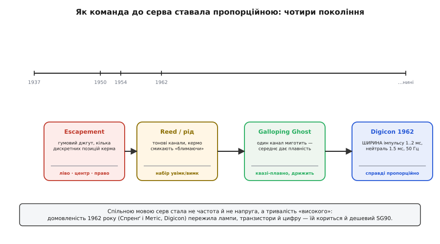

# 📜 Звідки взялися ці 1..2 мілісекунди

Візьміть будь-яке хобі-серво — копійчаний синій SG90, металевий MG996R, дороге цифрове серво з літака за тисячу доларів — і подайте на його сигнальний провід один і той самий імпульс завширшки 1.5 мілісекунди п'ятдесят разів на секунду. Усі троє стануть у середину. Подайте 1.0 мс — усі підуть в один край, 2.0 мс — усі в інший. Ці пристрої розділяють десятиліття, континенти, ціна в сто разів і геть різна начинка всередині, а мову вони розуміють однакову, аж до частки мілісекунди.

Так не буває само собою. USB, HDMI, різьба гвинтів, залізнична колія — за кожною «домовленістю, якої всі тримаються» стоїть історія: хтось перший її придумав, хтось нав'язав, а решта пристала, бо так виявилося зручніше, ніж кожному по-своєму. Сервостандарт 1..2 мс — не виняток. Він народився не в лабораторії стандартів і не в жодному комітеті, а в руках авіамоделістів початку 1960-х, і те, що дешевий SG90 сьогодні йому кориться, — прямий спадок одного конкретного рішення, ухваленого 1962 року й ніколи не запатентованого. Розберімо, що саме бентежило тих людей, як вони до цього дійшли й чому знайдене число пережило все, що мало б його поховати.


*Шлях до пропорційності. Кожне покоління додавало свободи керма: від кількох клацань escapement до справжнього «стань під будь-яким кутом» у Digicon. Виграла не частота й не напруга, а тривалість імпульсу — і саме її досі слухає SG90.*

## Проблема, якої в нас уже немає

Щоб зрозуміти, чому 1..2 мс — це перемога, треба спершу відчути, яким пеклом було керувати моделлю **до** цього. Сьогодні ми крутимо стик — і кермо літака стає рівно настільки, наскільки ми стик відхилили. Це здається таким природним, що важко уявити світ, де це неможливо. А він був, і тривав добрих двадцять років.

Найперші радіокеровані моделі 1930-х мали на борту приймач, що вмів розрізнити одне: є в ефірі несуча хвиля чи нема. Один біт інформації. Тим бітом смикали **електромагнітний защіпник** (англ. *escapement* — «випускач», механізм, що по черзі відпускає накручену пружину; те саме слово — про анкер годинника). Класична схема: гумовий джгут у фюзеляжі скручено в пружину, а защіпник дозволяє йому провернутися на чверть оберту за кожне натискання кнопки передавача. Натиснув раз — кермо пішло праворуч. Відпустив, натиснув ще — кермо в нейтраль. Ще раз — ліворуч. Ще — знову нейтраль. Керма було три положення, і перемикалися вони строго по колу, як стрілки в старому будильнику.

> 🔧 **Навіщо це.** Уся драма наступних тридцяти років — це боротьба за те, чого escapement дати не міг: **проміжні** положення. Він давав дискретні клацання — «ліво, центр, право», і не «на третину ліворуч». Модель або летіла прямо, або закладала повний поворот; тонко підрулити було нічим. Кожне наступне покоління техніки, аж до 1..2 мс, — це крок до того, щоб кермо слухалося **пропорційно**, а не стрибало між кількома засічками.

Наступний крок був радше кількісний, ніж якісний, і звався **реєдними** системами (англ. *reed* — тонкий металевий язичок, що резонує на своїй частоті; той самий язичок, що в губній гармоніці). Передавач слав не просто несучу, а несучу, промодульовану звуковим тоном; на борту стояла гребінка з кількох язичків, кожен налаштований на свою ноту, і потрібний тон змушував відповідний язичок затремтіти й замкнути свій контакт. Так з'явилися **канали**: один тон — кермо праворуч, інший — ліворуч, третій — газ додати, четвертий — газ прибрати. Перший комерційний багатоканальний реєдний набір продавав американець Ед Роквуд (Ed Rockwood) наприкінці 1940-х; 1953 року Френк Шмідт (Frank Schmidt) уже випускав повний п'ятиканальний комплект за схемою Роквуда *(усталене; за історією AMA)*. Каналів побільшало, свободи — ні: кожен канал і далі був простим «увімкнено/вимкнено». Досвідчені пілоти навчилися **швидко клацати** тим самим каналом туди-сюди, щоб кермо, не встигаючи дійти до краю, трималося десь посередині; цей трюк напівжартома звали «нервовою пропорційністю» (*nervous proportional*, «скільки-небудь пропорційне сіпання»). Керувати так означало безперервно молотити по перемикачах усі кілька хвилин польоту.

Найдотепнішу спробу вичавити плавність із простого «увімк/вимк» звали **Galloping Ghost** — «скакливий привид». Замість набору каналів тут один-єдиний канал безперервно **миготів**, і хитрість була в тому, що кермо не встигало за миготінням: воно займало положення, яке відповідало **середньому** за період — тобто співвідношенню часу «увімкнено» до часу «вимкнено». Змінюєш це співвідношення й частоту — зміщується середнє, зміщується кермо, і то вже майже плавно. Дон Браун (Don Brown) перейшов від одноканального escapement до саморобного механічного пульсатора 1953 року, а 1954-го зібрав систему Galloping Ghost — імовірно, першу в цьому роді *(правдоподібне; кілька джерел називають саме його й ці роки)*. Це вже дуже близько до ідеї «команду несе тривалість», але кермо в такій системі помітно дрижало, бо саме миготіння й було керуванням: механіка не могла і плавно тримати кут, і водночас гнатися за пульсом.

Ось у якому світі жили моделісти на межі 1950–60-х: escapement давав кілька клацань, реєд давав канали-вимикачі, Galloping Ghost давав дрижаку замість плавності. Усі відчували, чого бракує, — **справжньої пропорційності, та ще й без дрижання**, — але ніхто не мав чистого способу її закодувати. Бракувало однієї ідеї.

## Ідея: нехай усе вирішує тривалість

Ідея, коли вона нарешті визріла, виявилася майже до образливого простою — як це часто буває з речами, що потім стають стандартом. Що, як команду нестиме не наявність сигналу (escapement), не його частота-тон (реєд) і не миготіння (Galloping Ghost), а **тривалість одного короткого імпульсу**? Шлеш на борт імпульс: коротший — кермо в один бік, довший — у інший, середній — рівно посередині. А на самій моделі ставиш пристрій, що вимірює цю тривалість і жене кермо, аж поки те не стане під кут, який тривалості відповідає. Оце вимірювання-й-доведення і є **серво** в сучасному сенсі — не просто моторчик, а моторчик із зворотним зв'язком, що ловить задану ширину імпульсу.

Тривалість як носій команди має рідкісно приємні властивості, і саме вони прирекли її на перемогу.

Насамперед, тривалість **аналогова за суттю, але цифрова за формою**. Сам імпульс — це чистий «є/нема», рівень високий чи низький, і його легко й дешево зробити навіть на транзисторах тих років, без жодних тонких аналогових тонкощів. А от **скільки часу** він тримається високим — величина неперервна: можна 1.0 мс, можна 1.5, можна 1.5001. Виходить, простими цифровими засобами кодуєш неперервну, справді пропорційну команду. Escapement був цифровий, але дискретний; аналогова плавність реєду вимагала б крихких точних тонів; а тривалість імпульсу дала обидва світи одразу — просту схему й плавний вихід.

По-друге, тривалість **байдужа до всього, що псує радіосигнал по дорозі**. Амплітуда імпульсу згасне на віддалі, просяде від слабкої батареї, потоне в шумах — а тривалість не зміниться: імпульс на 1.5 мс лишається імпульсом на 1.5 мс, хай який він високий. Це те саме, чому ширина імпульсу взагалі така живуча в техніці: виміряти «скільки часу тривало» надійніше, ніж «наскільки було високо».

По-третє — і це вирішило долю саме **радіо**моделей, — кілька таких імпульсів легко зшити в чергу й переслати одним каналом. Слеш підряд імпульс керма, тоді газу, тоді елеронів, і приймач за паузами розбере, де чий; величина кожного каналу — це просто ширина його імпульсу в загальній черзі. Так один радіоканал везе одразу кермо, газ і елерони — і кожен пропорційно. (Цю зшиту чергу згодом назвуть *pulse-position modulation*, PPM, а окремий вихід на одне серво — те, що ми міряємо як «ширину імпульсу».)

> 🔧 **Навіщо це.** Ось чому SG90 і сьогодні слухає **ширину**, а не напругу чи частоту. Ті самі три причини нікуди не поділися: цифровий за формою імпульс дешево зробити будь-яким мікроконтролером; тривалість не пливе від просідань живлення й шумів по дроту; а стандарт, придатний возити багато каналів одним радіоканалом, заразом виявився й найпростішим для однієї сервомашинки. SG90 не «застряг у минулому» — він користується рішенням, яке й на новому залізі лишається найдешевшим і найнадійнішим.

## 1962-й: Digicon і число, що лишилося

Ідею «команду несе ширина імпульсу, а серво її вимірює» довели до робочого, продаваного виробу двоє американців — **Даг Спренґ (Doug Spreng)** і **Дон Метіс (Don Mathes)**. Вони заснували фірму Digital Control Systems і назвали свою систему **Digicon**; новинку оголосили в грудневому числі журналу *American Modeler* за 1962 рік *(усталене; дату й імена дають кілька незалежних історичних оглядів, зокрема матеріали Зали слави радіокерування)*. Це була **перша комерційна цифрова пропорційна** радіосистема: приймач-громадина в чорному пластиковому корпусі, набитий кількома платами — одна радіочастина, одна логіка, ще по одній підсилювачу на кожне серво. За розподілом праці Спренґові приписують саму ідею серва, що відпрацьовує ширину імпульсу зі зворотним зв'язком, а Метісові — радіочастину й механіку *(правдоподібне; так подають ролі історичні джерела)*.

Тут варто розрізнити, що саме сталося 1962-го, бо «винайшов» — слово слизьке. Пропорційне керування як **ідею** носили в повітрі й пробували до Спренґа (той-таки Galloping Ghost — уже майже воно). Окремі **вузли** теж існували: релейлесне серво Transmite Говарда Боннера (Howard Bonner) продавалося комерційно ще 1961 року для реєдних приймачів *(усталене)*. Заслуга Спренґа й Метіса — не в тому, що вони перші про це подумали, а в тому, що вони перші зібрали **цілу працездатну систему**, де ширина імпульсу наскрізно, від стика на землі до кута на кермі, була носієм пропорційної команди, і **продали** її. Ідея → вузол → система → товар: це різні рівні, і саме останні два — за Digicon.

І тоді ж усталилося те число, заради якого весь цей нарис. Спренґ вибрав, що імпульс гулятиме **від 1 до 2 мілісекунд**, а нейтраль — рівно посередині, **1.5 мс** *(усталене; ці межі й нейтраль незмінні досі)*. Чому саме так? Причин кілька, і всі практичні, без жодної містики.

Симетрія навколо середини — найприродніше, що можна вигадати для керма, яке відхиляється в обидва боки однаково. Береш центр і відкладаєш **однакову** відстань уліво й управо: 1.5 мс — нуль, 1.0 — повний ліворуч, 2.0 — повний праворуч. Кермо в нейтралі точно тоді, коли імпульс рівно посередині діапазону; ніякого «нуль — це край», де половина ходу пропадає.

```
    1.0 мс        1.5 мс        2.0 мс
  ────┼─────────────┼─────────────┼────
   край ліворуч  НЕЙТРАЛЬ    край праворуч
      │◄─── 0.5 мс ──►│◄─── 0.5 мс ──►│
        однакове плече в обидва боки
```

Самі ж числа — 1 і 2 мс — зручні для тодішньої схемотехніки. Тривалість імпульсу в ті роки задавали **одновібратором** (англ. *one-shot* — схема, що на поштовх видає один імпульс наперед заданої довжини, здебільшого RC-ланкою: конденсатор через резистор). Робити такою схемою імпульси в діапазоні одна-дві мілісекунди — акурат зручно: досить малі, щоб кілька каналів улізли в кадр і кермо оновлювалося швидко, і досить великі, щоб їх легко й точно виміряти простими засобами, не потонувши в наводках. А період між кадрами взяли близько **20 мс** (50 разів на секунду) — знову компроміс: рідше — кермо запізнюватиметься за пілотом, частіше — не влізуть усі канали й марно навантажиться схема. У кадрі 20 мс кілька імпульсів по 1..2 мс уміщаються вільно, з паузами між ними; п'ятдесят кадрів на секунду людське око й рука сприймають як миттєвий відгук.

```
Кадр 20 мс (50 Гц):
│ канал1 │ пауза │ канал2 │ пауза │ канал3 │ ......... │  наступний кадр →
│ 1..2мс │       │ 1..2мс │       │ 1..2мс │           │
└─── кожен імпульс: його ширина = положення цього керма ──┘
```

Чи були ці конкретні цифри єдино можливими? Ні. Симетричний діапазон можна було зробити 0.8..2.2 мс з нейтраллю 1.5, або 1.0..3.0 з нейтраллю 2.0 — фізика б не заперечила. Виграла версія Спренґа не тому, що вона єдино правильна, а тому, що вона перша дісталася ринку в готовому товарі — і за нею пристали всі. Це класична **path dependency**: раз обране й розтиражоване рішення стає стандартом не через свою досконалість, а через те, що ним уже користуються, і зламати сумісність дорожче, ніж дотримати.

> 🔧 **Навіщо це.** Ось чому SG90 в нейтралі саме на 1.5 мс, а не на «нулі» чи «половині періоду», і чому його робоче вікно 1..2 мс. Це не властивість пластику чи мотора — це **успадкована домовленість** 1962 року, вбудована в те, як серво влаштоване всередині. І ось чому даташит того ж SG90 інколи обіцяє ширший хід (0.5..2.4 мс): це вже пізніше розтягування навколо тієї самої історичної осі 1..2 мс, а не інший стандарт. Нейтраль лишилась на 1.5 — бо симетрія навколо середини нікуди не поділася.

## Чому домовленість не патентували — і саме тому вона всіх

Найважливіша, як не парадоксально, деталь усієї історії — юридична, а не технічна. **Спренґ свій винахід не запатентував.** Ані саму ідею серва зі зворотним зв'язком по ширині імпульсу, ані діапазон 1..2 мс. Тож коли Digicon показав, що це працює й продається, кожен інший виробник радіокерування **вільно скопіював** підхід — і копіювати мусив саме так, як у Спренґа, щоб серва й приймачі різних фірм лишалися сумісні *(усталене; історичні огляди прямо зазначають, що Спренґ не патентував і не отримав із цього роялті)*.

Це і є механізм, яким приватне рішення стає всесвітнім стандартом. Якби Спренґ узяв патент, кожен конкурент мусив би або платити йому, або вигадувати **свій** несумісний діапазон, аби обійти патент, — і ринок роздробився б на десяток взаємно глухих «діалектів», де серво фірми A не розуміє приймача фірми B. Без патенту ж усім було найдешевше говорити **однією** мовою — мовою Digicon. Уже за рік по Digicon цифрові пропорційні системи випустили одразу кілька фірм — Боннер зі своїм Digimite, і далі Kraft, Orbit, EK, Citizen-Ship та інші *(правдоподібне; так подають хроніку історичні джерела)* — і всі вони, копіюючи, закріплювали ті самі 1..2 мс. Стандарт народився не з наказу згори, а з того, що ним **вигідно** було користуватися всім, і ніщо не заважало.

Спренґ, до речі, не заробив на своєму винаході нічого — ні патентних грошей, ні роялті, — хоча ним досі користується вся індустрія. Він помер 19 квітня 2010 року *(усталене)*. Домовленість, яку він пустив у світ безоплатно, пережила його — і живе в кожному хобі-серві, зокрема в тому синьому брусочку за долар.

## Як стандарт пережив лампи, транзистори й цифру

Тепер найдивовижніше: цій домовленості вже за шістдесят років, а вона не змінилася **ані на йоту**, попри те, що начинка серв за цей час змінилася повністю. Логіка, що мала б давно зробити старий формат непотрібним, натомість щоразу його **відтворювала**, — і ось чому.

Перші серва Digicon були на **лампах і дискретних транзисторах**; вимір ширини й порівняння робили аналогові кола. Далі прийшли **інтегральні мікросхеми** — і в дешевих аналогових серв, як-от SG90, донині стоїть саме крихітна спеціалізована аналогова керувалка, що демодулює ширину імпульсу в напругу й жене мотор через зворотний зв'язок. Потім настала черга **цифрових серв**: усередині вже мікроконтролер, що ловить той самий вхідний імпульс, оцифровує ширину й керує мотором власним внутрішнім контуром на кількасот герц — крутіше тримає кут, різкіше рушає. Три різні епохи електроніки, три різні способи **зробити** серво — а мова на вході в усіх однакова: імпульс 1..2 мс кожні ~20 мс.

Ключова тонкість, яку тут легко проґавити: **аналогове й цифрове серва відрізняються тим, що всередині, а не тим, що ззовні.** Аналогове SG90 оновлює мотор приблизно з тим самим темпом, з яким приходять команди, — десятки разів на секунду. Цифрове серво всередині ганяє свій контур куди частіше, сотні разів на секунду, тому й тримає кут чіткіше й рушає жвавіше. Але **приймає** команду цифрове серво тим самим стандартним імпульсом 1..2 мс, що й аналогове. Внутрішня частота — приватна справа кожного серва; **вхідна мова** — спільна для всіх *(усталене; сучасні джерела прямо зазначають, що цифрове серво керується тими самими стандартними імпульсами, а різниться внутрішнім темпом)*.

Тримало формат не сентименти, а знову ж таки чиста вигода **сумісності**. За шістдесят років навколо цих 1..2 мс наросла ціла екосистема: мільярди серв, тисячі приймачів, польотні контролери, сервотестери, бібліотеки в кожному середовищі, роз'єми, документація, звички кількох поколінь інженерів. Зламати сумісність означало б викинути все це на смітник заради виграшу, який легко здобути й **не ламаючи** нічого — просто зробивши серво розумнішим усередині. Тож щоразу, коли з'являлася нова технологія, її запихали всередину коробочки, лишаючи вхід недоторканим. Стандарт виявився таким живучим не всупереч прогресу, а завдяки тому, що прогрес було вигідніше ховати під ним, ніж об нього ламати.

І ось чому копійчаний SG90, спроєктований у XXI столітті на дешевій інтегральній схемі, слухняно стає в нейтраль від імпульсу 1.5 мс — того самого, який Даг Спренґ відміряв своїм одновібратором 1962 року для громіздкого лампового ящика. Не тому, що SG90 старомодний, а тому, що ця мова виявилася настільки вдалою й настільки поширеною, що дешевше й розумніше було її **дотримати**, ніж вигадувати свою. Домовленість, яку ніхто не запатентував і всі скопіювали, стала однією зі спільних мов техніки — і SG90 говорить нею рівно тому, що нею говорять усі.
