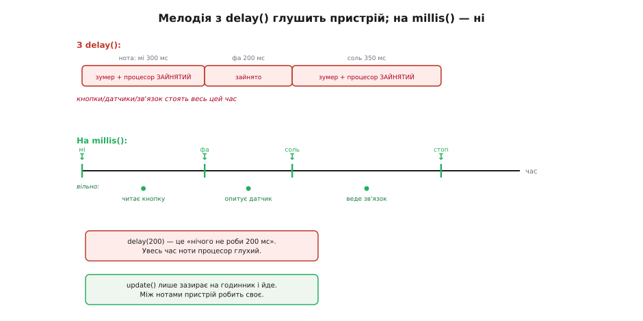

# ⚙️ Керування зумером у коді: від «пік» до мелодії без затримок

Звести зумер до одного `digitalWrite` — це половина правди. Половина, якої вистачить, поки пристрій уміє лише одне: пискнути й забути. Щойно ви хочете, **щоб зумер грав мелодію, а пристрій тим часом жив** — читав кнопки, крутив мотор, тримав зв'язок, — простий підхід розсипається, і треба зовсім інша механіка. Ця замітка проводить від найтупішого «увімкнув/вимкнув» до неблокувального програвача мелодій, розбирає популярний формат рінгтонів, яким ті мелодії задають, і закінчує тим, як завести гучний електромагнітний зумер через транзистор так, щоб не спалити ні вивід, ні сам ключ.

Уся розвилка коду тримається на тому самому питанні, що й уся апаратна частина: **активний зумер чи пасивний**. Активний — це вимикач, з ним нема про що писати статтю. Пасивний — це генератор частоти, і саме навколо нього народжується весь цікавий код: ноти, ритм, мелодія, автомат станів. Тому левова частка нижче — про пасивний. Мова тут суто заліза — таймери, регістри, точний час у мілісекундах, — тож увесь код природно лягає на C/C++, і жодна інша мова тут нічого не додасть (ноти на пасивному зумері не програють ані Python-ом, ані TypeScript-ом — це робота апаратного таймера мікроконтролера). Приклади нижче йдуть трьома доріжками — Arduino, ESP-IDF і STM32 HAL: задача на всіх мікроконтролерах та сама (вивід, апаратний таймер, лічильник мілісекунд), різняться лише імена, якими її звуть у кожному середовищі.

## Активний зумер: рівно вимикач

Почнімо з простого, щоб відбити його раз і назавжди. Активний зумер має власний генератор усередині; ваша справа — подати або зняти живлення. У коді це не відрізняється від світлодіода: один вивід у режимі виходу, одиниця на ньому — виє, нуль — мовчить. Як цей вивід смикати, кожне середовище зве по-своєму, але дія скрізь одна.

:::tabs
```arduino
const uint8_t BUZ = 8;           // активний зумер висить прямо на виводі

void setup() {
  pinMode(BUZ, OUTPUT);
  digitalWrite(BUZ, LOW);        // на старті тиша
}

void loop() {
  digitalWrite(BUZ, HIGH);       // подали «плюс» → внутрішній генератор завив
  delay(120);
  digitalWrite(BUZ, LOW);        // зняли → замовк
  delay(3000);
}
```
```esp-idf
#include "driver/gpio.h"
#include "freertos/FreeRTOS.h"
#include "freertos/task.h"

#define BUZ GPIO_NUM_18          // активний зумер висить прямо на виводі

void app_main(void) {
  gpio_config_t io = {
    .pin_bit_mask = 1ULL << BUZ,
    .mode         = GPIO_MODE_OUTPUT,
    .pull_up_en   = GPIO_PULLUP_DISABLE,
    .pull_down_en = GPIO_PULLDOWN_DISABLE,
    .intr_type    = GPIO_INTR_DISABLE,
  };
  gpio_config(&io);
  gpio_set_level(BUZ, 0);                 // на старті тиша

  while (1) {
    gpio_set_level(BUZ, 1);               // подали «плюс» → генератор завив
    vTaskDelay(pdMS_TO_TICKS(120));
    gpio_set_level(BUZ, 0);               // зняли → замовк
    vTaskDelay(pdMS_TO_TICKS(3000));
  }
}
```
```stm32
#include "main.h"                // BUZ_GPIO_Port / BUZ_Pin завів CubeMX

int main(void) {
  HAL_Init();
  SystemClock_Config();
  MX_GPIO_Init();                // вивід зумера — GPIO_Output, push-pull
  HAL_GPIO_WritePin(BUZ_GPIO_Port, BUZ_Pin, GPIO_PIN_RESET);   // тиша

  while (1) {
    HAL_GPIO_WritePin(BUZ_GPIO_Port, BUZ_Pin, GPIO_PIN_SET);   // завив
    HAL_Delay(120);
    HAL_GPIO_WritePin(BUZ_GPIO_Port, BUZ_Pin, GPIO_PIN_RESET); // замовк
    HAL_Delay(3000);
  }
}
```
:::

І тут причаїлася перша класична пастка, через яку люди годинами шукають неіснуючий баг. **Активний зумер не грає мелодій.** Якщо подати на нього меандр 440 Гц, а потім 880 Гц — чим би ви той меандр не робили, `tone()` в Arduino чи каналом таймера деінде, — ви почуєте **ту саму ноту** обидва рази, його зашиту резонансну. Причина проста: генератор жене на вивід прямокутну хвилю потрібної частоти, але активному зумеру байдужа ваша частота — його генератор бачить лише «є живлення / нема живлення» і гуде своєю. Ваш меандр він фактично випрямляє й ігнорує. Тому правило залізне: **хочете різні тони — беріть пасивний зумер**; на активному застрягнете на одній ноті назавжди.

> 🔧 **Навіщо це.** Вибір активний/пасивний робиться **до** паяння й пишеться в перший рядок коду. Плутанина тут — найчастіша причина скарги «зумер не працює» або «tone() грає одну ноту». Якщо ваша задача — просто сигнал події (пік на натиск, писк на помилку), активний ідеальний: тривіальний код, нуль таймерів, гучно й надійно. Якщо ж у вимогах є слово «мелодія» чи «різні звуки на різні події» — активний фізично не впорається, і жоден код це не полагодить.

## Пасивний зумер: генератор частоти в руці

Пасивний зумер сам мовчить — це гола коливальна система. Щоб він задзвенів, вивід мусить **гойдати його прямокутною хвилею**: скільки герц подасте, таку ноту й почуєте. Хвилю робить **апаратний таймер**: він сам, у фоні, смикає вивід із заданою частотою й тримає її, поки ви не спините, — процесор у цьому не бере участі. Ручка до цього таймера в кожному середовищі своя: в Arduino це готова пара `tone(pin, freq)` / `noTone(pin)`, в ESP-IDF — модуль LEDC (частота таймера плюс шпаруватість 50 % на каналі), у STM32 — канал таймера в режимі ШІМ, де частоту задає регістр перезавантаження `ARR`, а шпаруватість — `CCR`.

Ноти — це просто частоти. Рівномірно темперований стрій прив'язаний до `ля` першої октави = 440 Гц, а кожен наступний півтон вищий у ¹²√2 ≈ 1.05946 раза. Звідси й таблиця частот, яку зазвичай виносять у заголовок:

:::tabs
```arduino
// Частоти нот у герцах (рівномірний стрій; A4 = 440 Гц як опорна)
#define NOTE_C4  262
#define NOTE_D4  294
#define NOTE_E4  330
#define NOTE_F4  349
#define NOTE_G4  392
#define NOTE_A4  440
#define NOTE_B4  494
#define NOTE_C5  523
#define NOTE_REST  0            // 0 Гц = пауза (noTone)

const uint8_t BUZ = 8;

void setup() {
  pinMode(BUZ, OUTPUT);
}

// Одна нота: увімкнути частоту, витримати, вимкнути
void playNote(uint16_t freq, uint16_t ms) {
  if (freq == NOTE_REST) noTone(BUZ);   // пауза — просто тиша
  else                   tone(BUZ, freq);
  delay(ms);
  noTone(BUZ);
}

void loop() {
  playNote(NOTE_C4, 200);
  playNote(NOTE_E4, 200);
  playNote(NOTE_G4, 200);
  playNote(NOTE_C5, 400);
  delay(2000);
}
```
```esp-idf
#include "driver/ledc.h"
#include "freertos/FreeRTOS.h"
#include "freertos/task.h"
// NOTE_C4…NOTE_C5, NOTE_REST — та сама таблиця частот, що у вкладці Arduino

#define BUZ      GPIO_NUM_18
#define DUTY_50  512            // 50 % при 10-бітній роздільній здатності

static void buzzer_init(void) {
  ledc_timer_config_t t = {
    .speed_mode      = LEDC_LOW_SPEED_MODE,
    .duty_resolution = LEDC_TIMER_10_BIT,
    .timer_num       = LEDC_TIMER_0,
    .freq_hz         = 1000,    // стартова, далі переб'ється нотою
    .clk_cfg         = LEDC_AUTO_CLK,
  };
  ledc_timer_config(&t);
  ledc_channel_config_t c = {
    .gpio_num   = BUZ,
    .speed_mode = LEDC_LOW_SPEED_MODE,
    .channel    = LEDC_CHANNEL_0,
    .timer_sel  = LEDC_TIMER_0,
    .duty       = 0,            // старт із тиші
    .hpoint     = 0,
  };
  ledc_channel_config(&c);
}

// Увімкнути меандр заданої частоти; 0 Гц → тиша
static void buzzer_tone(uint32_t freq) {
  if (freq == NOTE_REST) {
    ledc_set_duty(LEDC_LOW_SPEED_MODE, LEDC_CHANNEL_0, 0);
  } else {
    ledc_set_freq(LEDC_LOW_SPEED_MODE, LEDC_TIMER_0, freq);
    ledc_set_duty(LEDC_LOW_SPEED_MODE, LEDC_CHANNEL_0, DUTY_50);
  }
  ledc_update_duty(LEDC_LOW_SPEED_MODE, LEDC_CHANNEL_0);
}

// Одна нота: увімкнути частоту, витримати, вимкнути
static void play_note(uint32_t freq, uint32_t ms) {
  buzzer_tone(freq);
  vTaskDelay(pdMS_TO_TICKS(ms));
  buzzer_tone(NOTE_REST);
}

void app_main(void) {
  buzzer_init();
  while (1) {
    play_note(NOTE_C4, 200);
    play_note(NOTE_E4, 200);
    play_note(NOTE_G4, 200);
    play_note(NOTE_C5, 400);
    vTaskDelay(pdMS_TO_TICKS(2000));
  }
}
```
```stm32
#include "main.h"               // CubeMX: TIM3_CH1 у режимі PWM Generation → зумер
// NOTE_C4…NOTE_C5, NOTE_REST — та сама таблиця частот, що у вкладці Arduino

extern TIM_HandleTypeDef htim3;

// Частоту меандру задає ARR, шпаруватість 50 % — CCR = (ARR+1)/2
static void tone_hz(uint32_t hz) {
  if (hz == NOTE_REST) { HAL_TIM_PWM_Stop(&htim3, TIM_CHANNEL_1); return; }
  uint32_t tim_clk = HAL_RCC_GetPCLK1Freq() * 2;      // такт таймерів APB1
  uint32_t arr = tim_clk / ((htim3.Init.Prescaler + 1) * hz) - 1;
  __HAL_TIM_SET_AUTORELOAD(&htim3, arr);
  __HAL_TIM_SET_COMPARE(&htim3, TIM_CHANNEL_1, (arr + 1) / 2);
  HAL_TIM_PWM_Start(&htim3, TIM_CHANNEL_1);
}

// Одна нота: увімкнути частоту, витримати, вимкнути
static void play_note(uint32_t freq, uint32_t ms) {
  tone_hz(freq);
  HAL_Delay(ms);
  tone_hz(NOTE_REST);
}

int main(void) {
  HAL_Init();
  SystemClock_Config();
  MX_GPIO_Init();
  MX_TIM3_Init();

  while (1) {
    play_note(NOTE_C4, 200);
    play_note(NOTE_E4, 200);
    play_note(NOTE_G4, 200);
    play_note(NOTE_C5, 400);
    HAL_Delay(2000);
  }
}
```
:::

Це працює, звучить — і водночас містить **другу велику пастку**, найпідступнішу з усіх. Придивіться до `delay(ms)` усередині `playNote`. Поки грає нота, `delay` **замерзає всю програму**: 200 мілісекунд процесор не робить нічого, крім чекання. Зіграти чотири ноти — це майже секунда повної глухоти пристрою: кнопки не читаються, датчики не опитуються, зв'язок стоїть. Для іграшки, де крім зумера нічого немає, це терпимо. Для будь-якого справжнього приладу — вирок.

> 🔧 **Навіщо це.** `delay()` — не пауза для зумера, це пауза для **всього мікроконтролера**. Він однопотоковий: поки крутиться `delay`, жоден інший рядок не виконується. Мелодія з `delay` перетворює пристрій на цеглину рівно на час програвання. Якщо десь у вашому коді паралельно має щось відбуватися — а воно майже завжди має, — мелодію треба вести **без блокування**. Це не оздоба, а різниця між прошивкою-демкою і прошивкою, що працює в реальному пристрої.

## Неблокувальна мелодія: годинник замість затримки

Ідея, що ламає закляття `delay()`, обманливо проста. Замість «зіграй ноту й **чекай** 200 мс» ми кажемо: «зіграй ноту, **запам'ятай, о котрій годині** її пора змінити, і йди займайся своїм». А в головному циклі щоразу лише **зазираємо на годинник**: якщо час ноти вийшов — перемикаємо на наступну; якщо ні — нічого не робимо й повертаємось до інших справ. Годинник тут — вільно біжучий лічильник мілісекунд від старту, який є на кожному мікроконтролері: `millis()` в Arduino, `HAL_GetTick()` у STM32 HAL, `esp_timer_get_time()` (мікросекунди) в ESP-IDF.

Різниця між двома підходами найкраще видно на осі часу.


*Угорі: під час кожної ноти `delay` тримає процесор у глухому очікуванні — уся смуга «зайнято», інші справи не встигають. Унизу: `millis()`-підхід витрачає на ноту лише коротку мить перемикання, а весь проміжок між нотами процесор вільний і встигає обслужити кнопку, датчик, зв'язок. Звук той самий; різниця — у тому, живий пристрій чи заморожений.*

Формально це **скінченний автомат**: стан — «яку ноту зараз граємо» (індекс у партитурі) плюс «коли її пора змінити» (мітка часу). Подія, що рухає автомат, — настання цього часу. Обгорнімо все у клас, щоб мати змогу тримати кілька мелодій і вмикати їх подіями.

:::tabs
```arduino
struct Note { uint16_t freq; uint16_t ms; };   // частота (0 = пауза) і тривалість

class BuzzerPlayer {
  uint8_t        pin;
  const Note*    song = nullptr;   // масив нот поточної мелодії
  uint16_t       len  = 0;         // скільки нот у ній
  uint16_t       idx  = 0;         // яку ноту граємо просто зараз
  unsigned long  noteEndsAt = 0;   // мить (millis), коли поточна нота скінчиться
  bool           active = false;

public:
  explicit BuzzerPlayer(uint8_t p) : pin(p) { pinMode(pin, OUTPUT); }

  // Запустити мелодію з початку (перериває попередню, якщо грала)
  void play(const Note* s, uint16_t n) {
    song = s; len = n; idx = 0; active = true;
    startNote();                   // одразу вмикаємо першу ноту
  }

  void stop() { noTone(pin); active = false; }
  bool isPlaying() const { return active; }

  // Викликати ЩОРАЗУ в loop(). Нічого не блокує: лише дивиться на годинник.
  void update() {
    if (!active) return;
    if (millis() < noteEndsAt) return;         // ще рано — виходимо миттєво

    idx++;                                      // час ноти вийшов → наступна
    if (idx >= len) { stop(); return; }         // мелодія скінчилась
    startNote();
  }

private:
  void startNote() {
    const Note& n = song[idx];
    if (n.freq == 0) noTone(pin);               // 0 Гц → пауза (тиша)
    else             tone(pin, n.freq);
    noteEndsAt = millis() + n.ms;               // ось коли її знімати
  }
};
```
```esp-idf
#include "esp_timer.h"
#include <stdbool.h>
// buzzer_init() / buzzer_tone() — ті самі, що у вкладці ESP-IDF вище

typedef struct { uint16_t freq; uint16_t ms; } note_t;  // 0 Гц = пауза

typedef struct {
  const note_t *song;        // масив нот поточної мелодії
  uint16_t      len, idx;    // скільки нот у ній і яку граємо просто зараз
  int64_t       ends_at_ms;  // мить, коли поточна нота скінчиться
  bool          active;
} player_t;

// millis() тут нема — годинник дає монотонний лічильник мікросекунд
static inline int64_t now_ms(void) { return esp_timer_get_time() / 1000; }

static void start_note(player_t *p) {
  const note_t *n = &p->song[p->idx];
  buzzer_tone(n->freq);                    // 0 Гц → duty = 0, тобто тиша
  p->ends_at_ms = now_ms() + n->ms;        // ось коли її знімати
}

// Запустити мелодію з початку (перериває попередню, якщо грала)
void player_play(player_t *p, const note_t *s, uint16_t n) {
  p->song = s; p->len = n; p->idx = 0; p->active = true;
  start_note(p);                           // одразу вмикаємо першу ноту
}

void player_stop(player_t *p) { buzzer_tone(0); p->active = false; }

// Викликати ЩОРАЗУ в циклі задачі. Нічого не блокує: лише дивиться на годинник.
void player_update(player_t *p) {
  if (!p->active) return;
  if (now_ms() < p->ends_at_ms) return;    // ще рано — виходимо миттєво
  if (++p->idx >= p->len) { player_stop(p); return; }   // мелодія скінчилась
  start_note(p);
}
```
```stm32
#include "main.h"
#include <stdbool.h>
// tone_hz() — та сама, що у вкладці STM32 вище (ARR задає частоту)

typedef struct { uint16_t freq; uint16_t ms; } Note;    // 0 Гц = пауза

typedef struct {
  const Note *song;          // масив нот поточної мелодії
  uint16_t    len, idx;      // скільки нот у ній і яку граємо просто зараз
  uint32_t    ends_at;       // мить (HAL_GetTick), коли нота скінчиться
  bool        active;
} Player;

static void start_note(Player *p) {
  const Note *n = &p->song[p->idx];
  tone_hz(n->freq);                        // 0 Гц → зупинити ШІМ, тобто пауза
  p->ends_at = HAL_GetTick() + n->ms;      // ось коли її знімати
}

// Запустити мелодію з початку (перериває попередню, якщо грала)
void player_play(Player *p, const Note *s, uint16_t n) {
  p->song = s; p->len = n; p->idx = 0; p->active = true;
  start_note(p);                           // одразу вмикаємо першу ноту
}

void player_stop(Player *p) { tone_hz(0); p->active = false; }

// Викликати ЩОРАЗУ в while(1). Нічого не блокує: лише дивиться на годинник.
void player_update(Player *p) {
  if (!p->active) return;
  // різниця, а не абсолют, — тому перехід лічильника через нуль не страшний
  if ((int32_t)(HAL_GetTick() - p->ends_at) < 0) return;
  if (++p->idx >= p->len) { player_stop(p); return; }   // мелодія скінчилась
  start_note(p);
}
```
:::

Партитуру задаємо масивом, а `loop()` тепер вільний як птах:

:::tabs
```arduino
// «Ода до радості», перші такти (частоти в Гц, тривалості в мс)
const Note ODE[] = {
  {330,300},{330,300},{349,300},{392,300},   // мі мі фа соль
  {392,300},{349,300},{330,300},{294,300},   // соль фа мі ре
  {262,300},{262,300},{294,300},{330,300},   // до до ре мі
  {330,450},{294,150},{294,600},             // мі. ре ре(довга)
};

BuzzerPlayer buzzer(8);

void setup() {
  buzzer.play(ODE, sizeof(ODE) / sizeof(ODE[0]));
}

void loop() {
  buzzer.update();               // рухає мелодію, НІЧОГО не блокує

  // …а тут паралельно живе решта пристрою — і воно справді працює:
  if (digitalRead(BUTTON) == LOW && !buzzer.isPlaying())
    buzzer.play(ODE, sizeof(ODE) / sizeof(ODE[0]));   // повтор на кнопку
  // readSensors(); updateDisplay(); handleRadio();   // усе встигає
}
```
```esp-idf
// «Ода до радості», перші такти (частоти в Гц, тривалості в мс)
static const note_t ODE[] = {
  {330,300},{330,300},{349,300},{392,300},   // мі мі фа соль
  {392,300},{349,300},{330,300},{294,300},   // соль фа мі ре
  {262,300},{262,300},{294,300},{330,300},   // до до ре мі
  {330,450},{294,150},{294,600},             // мі. ре ре(довга)
};

static player_t buzzer;

void app_main(void) {
  buzzer_init();
  player_play(&buzzer, ODE, sizeof(ODE) / sizeof(ODE[0]));

  while (1) {
    player_update(&buzzer);          // рухає мелодію, НІЧОГО не блокує

    // …а тут паралельно живе решта пристрою — і воно справді працює:
    if (gpio_get_level(BUTTON) == 0 && !buzzer.active)
      player_play(&buzzer, ODE, sizeof(ODE) / sizeof(ODE[0]));  // на кнопку
    vTaskDelay(pdMS_TO_TICKS(1));    // віддати такт іншим задачам
  }
}
```
```stm32
// «Ода до радості», перші такти (частоти в Гц, тривалості в мс)
static const Note ODE[] = {
  {330,300},{330,300},{349,300},{392,300},   // мі мі фа соль
  {392,300},{349,300},{330,300},{294,300},   // соль фа мі ре
  {262,300},{262,300},{294,300},{330,300},   // до до ре мі
  {330,450},{294,150},{294,600},             // мі. ре ре(довга)
};

static Player buzzer;

int main(void) {
  HAL_Init(); SystemClock_Config(); MX_GPIO_Init(); MX_TIM3_Init();
  player_play(&buzzer, ODE, sizeof(ODE) / sizeof(ODE[0]));

  while (1) {
    player_update(&buzzer);          // рухає мелодію, НІЧОГО не блокує

    // …а тут паралельно живе решта пристрою — і воно справді працює:
    if (HAL_GPIO_ReadPin(BTN_GPIO_Port, BTN_Pin) == GPIO_PIN_RESET
        && !buzzer.active)
      player_play(&buzzer, ODE, sizeof(ODE) / sizeof(ODE[0]));  // на кнопку
    // read_sensors(); update_display(); handle_radio();  // усе встигає
  }
}
```
:::

Розберімо, **чому** ця конструкція неблокувальна, бо тут криється вся суть. Ключ — рядок `if (millis() < noteEndsAt) return;`. Він перетворює «чекати» на «перевірити й піти». `update()` не витрачає час — він або миттєво повертається (нота ще грає), або за наносекунди перемикає ноту й знову повертається. Проміжок між викликами `update()` цілком належить решті програми. Зумер грає «сам собою» на апаратному таймері (і `tone()`, і LEDC, і канал ШІМ уже фонові!), а наш автомат лише вчасно каже йому, коли міняти частоту. Пристрій жодної миті не стоїть.

Є одна тонкість, про яку треба знати заздалегідь, бо вона колись вкусить: будь-який 32-бітний лічильник мілісекунд (`millis()`, `HAL_GetTick()`) **переповнюється** приблизно через 49.7 доби й скидається в нуль. Наше порівняння `millis() < noteEndsAt` цей момент переживає болісно — на межі переповнення нота може обірватися чи зависнути. Рятунок — **завжди рахувати різницю**, а не порівнювати абсолютні значення: тримати не «коли скінчиться», а «коли почалася», і питати `millis() - noteStartedAt >= n.ms`. Віднімання беззнакових чисел коректне навіть на переході через нуль (переповнення «згортається» саме так, як треба) — у вкладці STM32 вище перевірка написана саме через різницю. Для мелодії, що грає секунди, ви майже певно не влучите в ту межу — але звичка рахувати різницю, а не порівнювати абсолют, рятує в тисячі інших місць, тож варто закладати її одразу.

> 🔧 **Навіщо це.** Автомат станів на `millis()` — це не спеціальний трюк для зумера, а **основний спосіб робити на мікроконтролері кілька справ «одночасно»** без операційної системи. Той самий кістяк («запам'ятай мить події → у циклі перевіряй, чи настала») веде миготіння світлодіода, антидребезг кнопки, тайм-аути зв'язку, періодичне опитування датчиків. Освоївши його на мелодії зумера — а це вдячний, чутний на вухо приклад, — ви отримуєте шаблон, який далі копіюватимете всюди. І навпаки: доки в коді сидить `delay()`, паралельність неможлива в принципі.

## RTTTL: мелодія як рядок тексту

Забивати партитуру масивом `{частота, тривалість}` руками — марудно й нечитабельно. Куди зручніше записати мелодію **людською нотацією**, а програму навчити її грати. Саме для цього колись і придумали **RTTTL** (англ. *Ring Tone Text Transfer Language* — мова передавання рінгтонів). Формат розробила Nokia наприкінці 1990-х як частину системи Smart Messaging, щоб пересилати рінгтони есемескою; ним рясніли всі тогочасні телефони, і донині в мережі лежать тисячі готових мелодій одним рядком (авторство Nokia в довідниках зазвичай подають без первинного документа — статус: усталене, але слабко задокументоване).

Виглядає RTTTL так:

```
Ode:d=4,o=5,b=125:8e,8e,8f,8g,8g,8f,8e,8d,8c,8c,8d,8e,4e.,8d,2d
```

Рядок ділиться двокрапками на **три частини**:

- **Назва** — до двокрапки (`Ode`). До 10 символів, двокрапки в ній бути не може. На звук не впливає — просто підпис.
- **Умовчання** — набір `ключ=значення` через кому. Три параметри: `d` — тривалість ноти за замовчуванням (4 = чвертка), `o` — октава за замовчуванням, `b` — темп у ударах за хвилину (BPM).
- **Ноти** — через кому. Кожна нота: **тривалість** (число-дільник цілої ноти), потім **буква** (`c d e f g a b`, а `p` — пауза), далі за потреби **октава** й **крапка** (подовжує на половину). Будь-який із цих трьох хвостиків можна пропустити — тоді береться умовчання. Так `8e` = восьма нота `мі` в октаві за замовчуванням, `4e.` = чвертка з крапкою (ціла × ³⁄₈), `2p` = півнотна пауза.

Ключ до програвання — **як тривалість-дільник перетворити на мілісекунди**. Домовленість музична й проста: **чвертка = один удар**. При темпі `b` ударів за хвилину один удар триває `60000 / b` мілісекунд. Ціла нота — це чотири удари, тобто `240000 / b` мс. А нота з дільником `d` (де `d` ∈ {1,2,4,8,16,32}) — це `(240000 / b) / d` мс. Крапка домножує на 1.5.

**Тривалість ноти в мілісекундах (темп b = 125, дільник d).**
```
Ціла нота (4 удари):      240000 / 125          = 1920 мс
Чвертка   (d = 4):       (240000 / 125) / 4     =  480 мс
Восьма    (d = 8):       (240000 / 125) / 8     =  240 мс
Чвертка з крапкою:       480 · 1.5              =  720 мс
```

Тепер напишемо **мінімальний парсер**, що читає такий рядок і зводить його до тих самих увімкнень частоти. Щоб не тягти купу пам'яті, тримаємо мелодію у флеші й читаємо посимвольно. Тут вилазить різниця архітектур: на 8-бітному AVR флеш — окремий адресний простір, тому Arduino вимагає `PROGMEM` і читання через `pgm_read_*`; на 32-бітних МК (ESP32, STM32) флеш відображений у спільний простір, і звичайного `const` досить — таблиця й так лежить у флеші й читається як звичайна пам'ять. Наведу спершу серце парсера — розбір **однієї ноти**, бо саме тут вся логіка формату:

:::tabs
```arduino
#include <Arduino.h>

// Частоти нот c..b для октав 4..7. Індекс: (октава-4)*12 + півтон_від_C.
// Півтони в межах октави: c c# d d# e f f# g g# a a# b  (0..11)
static const uint16_t NOTE_FREQ[] PROGMEM = {
  // октава 4
  262,277,294,311,330,349,370,392,415,440,466,494,
  // октава 5
  523,554,587,622,659,698,740,784,831,880,932,988,
  // октава 6
 1047,1109,1175,1245,1319,1397,1480,1568,1661,1760,1865,1976,
  // октава 7
 2093,2217,2349,2489,2637,2794,2960,3136,3322,3520,3729,3951,
};

// Півтон-зсув літери від C у межах октави (a..g). -1 = нема такої.
static int8_t noteOffset(char c) {
  switch (c) {
    case 'c': return 0;  case 'd': return 2;  case 'e': return 4;
    case 'f': return 5;  case 'g': return 7;  case 'a': return 9;
    case 'b': return 11; default:  return -1;         // 'p' або сміття
  }
}

// Обчислити частоту ноти (0 = пауза/поза діапазоном)
static uint16_t noteToFreq(char letter, bool sharp, int octave) {
  int off = noteOffset(letter);
  if (off < 0) return 0;                     // пауза
  if (sharp)  off += 1;                       // дієз — на півтона вище
  int idx = (octave - 4) * 12 + off;
  if (idx < 0 || idx >= (int)(sizeof(NOTE_FREQ)/sizeof(NOTE_FREQ[0])))
    return 0;                                 // поза таблицею
  return pgm_read_word(&NOTE_FREQ[idx]);
}
```
```esp-idf
#include <stdint.h>
#include <stdbool.h>
// На 32-бітному МК (тут ESP-IDF, у STM32 те саме) таблиця — звичайний const:
// вона лежить у флеші, читається прямим індексуванням, без pgm_read_*.
static const uint16_t NOTE_FREQ[] = {
  // октави 4..7, у кожній 12 півтонів: c c# d d# e f f# g g# a a# b
   262, 277, 294, 311, 330, 349, 370, 392, 415, 440, 466, 494,
   523, 554, 587, 622, 659, 698, 740, 784, 831, 880, 932, 988,
  1047,1109,1175,1245,1319,1397,1480,1568,1661,1760,1865,1976,
  2093,2217,2349,2489,2637,2794,2960,3136,3322,3520,3729,3951,
};

// Півтон-зсув літери від C у межах октави (a..g). -1 = нема такої.
static int8_t note_offset(char c) {
  switch (c) {
    case 'c': return 0;  case 'd': return 2;  case 'e': return 4;
    case 'f': return 5;  case 'g': return 7;  case 'a': return 9;
    case 'b': return 11; default:  return -1;         // 'p' або сміття
  }
}

// Обчислити частоту ноти (0 = пауза/поза діапазоном)
static uint16_t note_to_freq(char letter, bool sharp, int octave) {
  int off = note_offset(letter);
  if (off < 0) return 0;                     // пауза
  if (sharp)  off += 1;                      // дієз — на півтона вище
  int idx = (octave - 4) * 12 + off;
  if (idx < 0 || idx >= (int)(sizeof(NOTE_FREQ) / sizeof(NOTE_FREQ[0])))
    return 0;                                // поза таблицею
  return NOTE_FREQ[idx];
}
```
:::

А тепер сам прохід по рядку. Логіка одна на кожну ноту: прочитати число-тривалість (якщо є) → літеру → необов'язковий `#` → необов'язкову цифру-октаву → необов'язкову крапку → порахувати частоту й тривалість → зіграти:

:::tabs
```arduino
class RtttlPlayer {
  const char*   p;              // курсор у рядку RTTTL (PROGMEM)
  int           defDur = 4;     // d=
  int           defOct = 6;     // o=
  long          wholeMs = 0;    // тривалість цілої ноти в мс (з b=)
  bool          active = false;
  unsigned long noteEndsAt = 0;
  uint8_t       pin;

  char peek() { return pgm_read_byte(p); }         // глянути символ
  char take() { return pgm_read_byte(p++); }        // взяти й посунутись

  // Прочитати ціле число під курсором (0, якщо цифр нема)
  int number() {
    int n = 0;
    while (isdigit(peek())) n = n * 10 + (take() - '0');
    return n;
  }

public:
  explicit RtttlPlayer(uint8_t pin_) : pin(pin_) { pinMode(pin, OUTPUT); }

  // Розібрати заголовок і стати на перший символ нот
  void begin(const char* song) {
    p = song;
    while (peek() && take() != ':') { }             // пропустити назву до ':'
    // блок умовчань: пари ключ=значення через кому, до ':'
    while (peek() && peek() != ':') {
      char key = take();
      if (take() == '=') {
        int v = number();
        if      (key == 'd') defDur = v;
        else if (key == 'o') defOct = v;
        else if (key == 'b') wholeMs = 240000L / v; // ціла нота = 4 удари
      }
      if (peek() == ',') take();
    }
    if (peek() == ':') take();                        // з'їсти другу ':'
    active = true;
    nextNote();                                       // одразу першу
  }

  bool isPlaying() const { return active; }

  // Викликати в loop() — неблокувально, як у BuzzerPlayer
  void update() {
    if (!active) return;
    if (millis() < noteEndsAt) return;
    nextNote();
  }

private:
  void nextNote() {
    // пропустити коми/пробіли між нотами
    while (peek() == ',' || peek() == ' ') take();
    if (!peek()) { noTone(pin); active = false; return; }   // кінець рядка

    // 1) тривалість: число або умовчання
    int dur = number();
    if (dur == 0) dur = defDur;

    // 2) літера ноти (або 'p' — пауза)
    char letter = take();

    // 3) необов'язковий дієз
    bool sharp = false;
    if (peek() == '#') { sharp = true; take(); }

    // 4) необов'язкова октава
    int oct = defOct;
    if (isdigit(peek())) oct = number();

    // 5) необов'язкова крапка — подовжує на половину
    bool dotted = false;
    if (peek() == '.') { dotted = true; take(); }

    // тривалість у мс: ціла нота / дільник, з урахуванням крапки
    long ms = wholeMs / dur;
    if (dotted) ms += ms / 2;

    uint16_t f = noteToFreq(letter, sharp, oct);
    if (f == 0) noTone(pin);                // пауза або поза діапазоном
    else        tone(pin, f);
    noteEndsAt = millis() + ms;
  }
};
```
```esp-idf
#include "freertos/FreeRTOS.h"
#include "freertos/task.h"
#include <ctype.h>
#include <stdbool.h>
// buzzer_init() / buzzer_tone() / note_to_freq() — з прикладів вище

// Рядок RTTTL — звичайний const char* у флеші, курсор іде по ньому як по RAM.
// Пристрій тут не завмирає з іншої причини, ніж в Arduino: мелодія живе у
// ВЛАСНІЙ задачі, а vTaskDelay віддає процесор іншим задачам, а не крутить його.
static void rtttl_task(void *arg) {
  const char *p = (const char *)arg;
  int def_dur = 4, def_oct = 6;
  long whole_ms = 0;

  while (*p && *p++ != ':') { }                    // пропустити назву до ':'
  while (*p && *p != ':') {                        // умовчання: ключ=значення
    char key = *p++;
    if (*p++ == '=') {
      int v = 0;
      while (isdigit((unsigned char)*p)) v = v * 10 + (*p++ - '0');
      if      (key == 'd') def_dur  = v;
      else if (key == 'o') def_oct  = v;
      else if (key == 'b') whole_ms = 240000L / v; // ціла нота = 4 удари
    }
    if (*p == ',') p++;
  }
  if (*p == ':') p++;                              // з'їсти другу ':'

  while (*p) {
    while (*p == ',' || *p == ' ') p++;            // коми/пробіли між нотами
    if (!*p) break;

    int dur = 0;                                   // 1) тривалість або умовчання
    while (isdigit((unsigned char)*p)) dur = dur * 10 + (*p++ - '0');
    if (!dur) dur = def_dur;

    char letter = *p++;                            // 2) літера ноти ('p' — пауза)
    bool sharp = (*p == '#');                      // 3) необов'язковий дієз
    if (sharp) p++;

    int oct = def_oct;                             // 4) необов'язкова октава
    if (isdigit((unsigned char)*p)) {
      oct = 0;
      while (isdigit((unsigned char)*p)) oct = oct * 10 + (*p++ - '0');
    }

    long ms = whole_ms / dur;                      // 5) крапка — плюс половина
    if (*p == '.') { ms += ms / 2; p++; }

    buzzer_tone(note_to_freq(letter, sharp, oct)); // 0 Гц → пауза
    vTaskDelay(pdMS_TO_TICKS(ms));
  }

  buzzer_tone(0);                                  // кінець рядка — тиша
  vTaskDelete(NULL);                               // задача знімає сама себе
}
```
:::

Ужити його — три рядки:

:::tabs
```arduino
const char ODE_RTTTL[] PROGMEM =
  "Ode:d=4,o=5,b=125:8e,8e,8f,8g,8g,8f,8e,8d,8c,8c,8d,8e,4e.,8d,2d";

RtttlPlayer player(8);

void setup() { player.begin(ODE_RTTTL); }
void loop()  { player.update(); /* решта пристрою тут вільно живе */ }
```
```esp-idf
static const char ODE_RTTTL[] =
  "Ode:d=4,o=5,b=125:8e,8e,8f,8g,8g,8f,8e,8d,8c,8c,8d,8e,4e.,8d,2d";

void app_main(void) {
  buzzer_init();
  xTaskCreate(rtttl_task, "rtttl", 3072, (void *)ODE_RTTTL, 4, NULL);
  // решта пристрою живе у своїх задачах і мелодії не помічає
}
```
:::

Зверніть увагу, що парсер збудований на **тому самому неблокувальному кістяку**: `update()` дивиться на годинник і повертається, а решту часу пристрій вільний. Там, де під рукою є планувальник (вкладка ESP-IDF), той самий наслідок дає інший механізм — мелодія їде у власній задачі, і її чекання віддає процесор іншим задачам замість крутити його вхолосту. Ми не читаємо весь рядок наперед у масив — розбираємо ноту за нотою «на льоту», прямо коли настає її час. Це не лише економить пам'ять (мелодія живе в `PROGMEM`, у RAM — жменька змінних), а й показує гарну звичку: **не будувати велику структуру там, де досить курсора**.

Кілька практичних застережень до цього мінімального парсера. Він свідомо простий і покриває звичайні мелодії, але не всі крайні випадки формату. По-перше, у деяких RTTTL крапка стоїть **після** октави (`e5.`), а в деяких — після літери перед октавою (`e.5`); повний парсер має ловити крапку в обох місцях, наш очікує її **в кінці**. По-друге, дехто пише умовчання в іншому порядку чи з пробілами — наш код терпить пробіли між нотами, але не всередині заголовка. По-третє, ми не обробляємо тривалість `.` як самостійну (без числа). Для навчального програвача цього досить; для промислового варто взяти готову бібліотеку (їх для Arduino й ESP32 багато) — але тепер ви знаєте **точно, що вона робить усередині**, і полагодите її, коли якийсь рінгтон «не так грає».

## ESP32: `tone()` не завжди є — беремо апаратний PWM (LEDC)

На класичному Arduino Uno функція `tone()` завжди під рукою. На **ESP32** історія інша й варта окремої уваги, бо на ній спотикаються при переході з Uno. Ранні версії ядра ESP32 for Arduino взагалі **не мали** `tone()`; звук роблять через штатний апаратний широтно-імпульсний модулятор — **LEDC** (*LED Control*, спочатку задуманий для плавного світіння світлодіодів, але це той самий генератор прямокутної хвилі, який чудово гойдає пасивний зумер). У новіших ядрах `tone()`-обгортку додали, та керувати LEDC напряму все одно корисно: він дає точнішу частоту, кілька незалежних каналів і не конфліктує з іншим кодом за єдиний таймер. У самому ESP-IDF жодного `tone()` нема взагалі — там із LEDC працюють напряму, тобто йдуть тим самим шляхом, лише без обгортки.

І тут чатує **пастка версій**, на якій зараз горить чи не кожен, хто оновив ядро: у **ESP32 core 3.0** API LEDC переробили, і старі приклади з інтернету **не збираються**. Раніше канал заводили парою `ledcSetup(channel, freq, resBits)` + `ledcAttachPin(pin, channel)`; у 3.0 обидві функції прибрали, а натомість є одна — `ledcAttach(pin, freq, resolution)`, що сама призначає канал на вивід (статус: підтверджено офіційним гайдом міграції Espressif 2.x → 3.0). Ось код під **сучасне ядро 3.x**:

:::tabs
```arduino
// ESP32, ядро 3.x: пасивний зумер через апаратний LEDC
const uint8_t BUZ = 25;          // будь-який GPIO, що вміє вихід

void setup() {
  // freq — стартова частота (переб'ється нижче), resolution — біти
  // роздільної здатності шпаруватості (для тону нам байдужа, беремо 8)
  ledcAttach(BUZ, 2000, 8);      // прив'язали LEDC до виводу
}

void playNote(uint32_t freq, uint16_t ms) {
  if (freq == 0) ledcWriteTone(BUZ, 0);   // 0 Гц → тиша
  else           ledcWriteTone(BUZ, freq); // 50%-меандр цієї частоти
  delay(ms);                                // (у бойовому коді — millis!)
  ledcWriteTone(BUZ, 0);
}

void loop() {
  playNote(523, 200);            // до
  playNote(659, 200);            // мі
  playNote(784, 400);            // соль
  delay(2000);
}
```
```esp-idf
// Той самий LEDC, але штатним драйвером ESP-IDF: жодних обгорток
#include "driver/ledc.h"
#include "freertos/FreeRTOS.h"
#include "freertos/task.h"

#define BUZ      GPIO_NUM_25
#define DUTY_50  512            // 50 % при 10-бітній роздільній здатності

static void play_note(uint32_t freq, uint32_t ms) {
  if (freq == 0) {
    ledc_set_duty(LEDC_LOW_SPEED_MODE, LEDC_CHANNEL_0, 0);      // 0 Гц → тиша
  } else {
    ledc_set_freq(LEDC_LOW_SPEED_MODE, LEDC_TIMER_0, freq);
    ledc_set_duty(LEDC_LOW_SPEED_MODE, LEDC_CHANNEL_0, DUTY_50); // 50 %-меандр
  }
  ledc_update_duty(LEDC_LOW_SPEED_MODE, LEDC_CHANNEL_0);
  vTaskDelay(pdMS_TO_TICKS(ms));                 // (у бойовому коді — задача!)
  ledc_set_duty(LEDC_LOW_SPEED_MODE, LEDC_CHANNEL_0, 0);
  ledc_update_duty(LEDC_LOW_SPEED_MODE, LEDC_CHANNEL_0);
}

void app_main(void) {
  buzzer_init();                 // ledc_timer_config + ledc_channel_config, як вище
  while (1) {
    play_note(523, 200);         // до
    play_note(659, 200);         // мі
    play_note(784, 400);         // соль
    vTaskDelay(pdMS_TO_TICKS(2000));
  }
}
```
:::

Ключова функція — `ledcWriteTone(pin, freq)`: вона налаштовує LEDC на 50-відсотковий меандр заданої частоти (саме такий і треба зумеру) і повертає реально встановлену частоту (0 при помилці). Є ще зручна `ledcWriteNote(pin, note, octave)`, яка приймає ноту як символьну константу й октаву — тобто **сама рахує частоту** за темперованим строєм; для мелодій із нотами буває чистіше за таблицю герців. Щоб звільнити вивід, — `ledcDetach(pin)`.

> 🔧 **Навіщо це.** Якщо ви прийшли на ESP32 з Uno й механічно скопіювали приклад із `ledcSetup`/`ledcAttachPin`, а компілятор лається «not declared» — це не ваш баг і не бита плата, а зміна API у ядрі 3.0. Або оновіть код на `ledcAttach`, або (гірше) відкотіть ядро на 2.x. Знати про цю розвилку — заощадити вечір гугління незрозумілих помилок збірки. І ширше: на ESP32 звук майже завжди варто вести через LEDC напряму, а не через `tone()`-обгортку — більше контролю, точніша частота, менше сюрпризів із поділом таймерів.

## Драйв гучного зумера: транзистор, база, діод

Дотепер зумер сидів **прямо на виводі** — так можна лише для малострумного п'єзо (одиниці міліампер, вивід тягне). **Електромагнітний** зумер — це котушка, крізь яку тече справжній струм; апетит у нього **десятки міліампер** (30, 50, буває більше), і вивід мікроконтролера стільки віддати не годен. Вішати такий зумер прямо на GPIO не можна: у кращому разі він звучатиме кволо (виводу бракує сили розгойдати котушку), у гіршому — ви повільно вбиваєте сам вивід, перевантажуючи його понад паспортну стелю.

Рішення — класичний [транзистор-ключ](book:electronics/bjt-switch): біполярний транзистор, що працює не плавним підсилювачем, а вимикачем — маленький струм бази або відмикає великий струм колектора «до упору», або тримає його закритим. Вивід МК керує лише **базою** транзистора через резистор, а важкий струм зумера тече **крізь транзистор**, не крізь вивід. Слабка логіка командує, потужний ключ тягне. У коді від цього не змінюється **нічого** — усі попередні приклади (активний, пасивний, мелодія, RTTTL) працюють без правок: ви так само робите `digitalWrite`, `tone` чи `ledcWriteTone` на керуючому виводі, тільки цей вивід тепер відмикає транзистор, а не живить зумер напряму. Змінюється **схема**, не програма.

Один момент коду все ж вартий уваги — **полярність керування**. У найпростішій схемі з NPN-транзистором (емітер на землю, зумер між «плюсом» живлення й колектором) `HIGH` на базі **вмикає** зумер, `LOW` — вимикає. Логіка пряма, збігається з інтуїцією. Але якщо вам трапиться схема з PNP згори або з готовим модулем, де стоїть інвертор, — рівні можуть виявитися **зворотними** (`LOW` вмикає). Тому, налагоджуючи чужу плату, спершу з'ясуйте, яким рівнем вона вмикається, а не припускайте.

Тепер — **розрахунок базового резистора**, серце цієї схеми. Транзистор в ролі ключа має бути в **насиченні** — відкритий «до упору», щоб на ньому падало якнайменше напруги (інакше він гріється й краде вольти в зумера). Для цього струм бази має бути з **запасом** більший за той мінімум, що диктує коефіцієнт підсилення.

**Базовий резистор для NPN-ключа (МК 3.3 В, зумер 50 мА, β ≈ 100).**
```
Дано:  Vio = 3.3 В       напруга виводу в стані «1»
       Vbe ≈ 0.7 В       падіння база-емітер відкритого кремнієвого NPN
       Ic  = 50 мА       робочий струм зумера (0.050 А)
       β   ≈ 100         коефіцієнт підсилення (у datasheet — hFE)

Мінімальний струм бази, щоб транзистор ледь відкрив цей струм:
       Ib(мін) = Ic / β = 0.050 / 100 = 0.5 мА

Для НАСИЧЕННЯ беремо з запасом ×3..×5 (ключ, не підсилювач):
       Ib(беремо) ≈ 2 мА

На резисторі падає різниця «вивід мінус Vbe»:
       Vr = Vio − Vbe = 3.3 − 0.7 = 2.6 В

Опір за законом Ома:
       R = Vr / Ib = 2.6 / 0.002 = 1300 Ом

Найближчий ходовий номінал — 1 кОм (дасть трохи більший струм бази,
транзистор насититься надійніше). Ось чому в таких схемах майже
завжди стоїть «1k» у базі — це не магія, а цей розрахунок.
```

Логіка розрахунку варта того, щоб її **зрозуміти, а не завчити**. Мінімальний струм бази `Ic / β` — це межа, на якій транзистор ледь-ледь пропускає потрібний струм колектора, ще працюючи як підсилювач. Але **ключу підсилення не треба** — йому треба бути повністю відкритим, і тому струм бази беруть у кілька разів більшим за цю межу, заганяючи транзистор глибоко в насичення. Запас ×3..×5 і дає той «1k»: з ним транзистор відкривається твердо, падіння на ньому мінімальне, майже вся напруга живлення дістається зумеру. Поставите замість «1k» умовні «10k» — струм бази впаде вп'ятеро, транзистор ледь прочиниться, на ньому осяде півживлення, зумер захрипить упівголоса, а транзистор грітиметься. Тому завеликий базовий резистор — така сама помилка, як його відсутність.

І остання, **найпідступніша деталь — діод-гасник**, без якого схема з електромагнітним зумером живе недовго й помирає загадково. Котушка ненавидить, коли їй різко обривають струм. У мить, коли транзистор закривається, магнітне поле котушки миттєво спадає, і за законом самоіндукції вона **вихлюпує накопичену енергію викидом високої напруги зворотної полярності** — десятки, а то й сотні вольтів на частку мілісекунди. Це [брикання котушки](book:electronics/inductor-kickback): що різкіше обриваєш струм в індуктивності, то вищий стрибок напруги на ній, бо котушка силкується втримати струм незмінним. Цей викид б'є прямо в колектор транзистора й **пробиває** його. Найгидкіше, що схема при цьому «якось працює»: транзистор витримує перші тисячі перемикань, зумер пищить, усе начебто гаразд — а через тиждень чи місяць транзистор раптом мертвий, і причину шукають де завгодно, тільки не тут.

Ліки — **діод паралельно зумеру, увімкнений «навпаки»**: катодом до «плюса» живлення, анодом до колектора. У нормальній роботі він закритий і схемі не заважає (струм тече крізь зумер як має). Але в мить кидка полярність напруги на котушці **перевертається**, діод відкривається й **замикає викид сам на себе** — енергія котушки безпечно розсіюється по петлі «котушка → діод», не доходячи до транзистора. Годиться звичайний випрямний діод на кшталт 1N4148 (для малих струмів) чи 1N4007. Для п'єзозумера цей діод **не потрібен** зовсім — там немає котушки, немає й кидка; але для будь-якого котушкового (електромагнітного) зумера він **обов'язковий**.

> 🔧 **Навіщо це.** Діод-гасник — це страховка від невидимого. Кидок котушки не побачиш «на око», його не покаже мультиметр; він триває мікросекунди, але реально пробиває транзистори в схемах, де про нього забули. Одна дешева деталь копійкою рятує від «плаваючих» відмов, які потім тижнями шукають у прошивці, хоча винне залізо. Правило просте: **керуєш котушкою через транзистор — став діод**, завжди, рефлекторно. Це стосується не лише зумера, а будь-якого індуктивного навантаження: реле, соленоїда, мотора. Звичка ставити гасник біля кожної котушки — ознака того, що ви розумієте, чому схеми вмирають.

## Що врізати в пам'ять

Пройдений шлях коротко, щоб лишилося головне.

- **Активний зумер — це один рівень на виводі** (`digitalWrite`, `gpio_set_level`, `HAL_GPIO_WritePin` — питання середовища, не суті). Ніяких частот; `tone()` на ньому дає одну ноту (свою резонансну), а не мелодію. Потрібні різні тони — беріть пасивний, і жоден код цього не обійде.
- **Пасивний зумер — це апаратний таймер, що жене меандр:** `tone()` / `noTone()` в Arduino, LEDC в ESP32/ESP-IDF, канал таймера в режимі ШІМ у STM32. Ноти — це частоти в герцах; пауза — 0 Гц.
- **`delay()` у мелодії заморожує весь пристрій.** Для будь-чого серйознішого за іграшку ведіть звук **неблокувально**: автомат станів на `millis()` — «запам'ятай, коли міняти ноту, а в циклі лише зазирай на годинник». Цей самий кістяк далі веде всю псевдопаралельність на МК.
- **RTTTL** дає мелодію одним текстовим рядком (`назва:умовчання:ноти`); тривалість-дільник переводиться в мілісекунди через темп: ціла нота = `240000 / bpm` мс. Мінімальний парсер лягає на той самий неблокувальний кістяк.
- **ESP32:** звук через LEDC; у ядрі **3.0** API змінився — `ledcAttach(pin, freq, res)` замість старих `ledcSetup` + `ledcAttachPin`. Старі приклади з інтернету на новому ядрі не збираються.
- **Гучний/електромагнітний зумер — через транзистор-ключ.** Базовий резистор рахується під **насичення** (струм бази з запасом ×3..×5 над `Ic/β`) — звідси ходовий «1k». Код не змінюється, змінюється схема.
- **Біля котушкового зумера — діод-гасник** (катодом до «плюса»), завжди. Забудете — кидок самоіндукції поволі вб'є транзистор, і відмову шукатимете деінде. Для п'єзо діод зайвий.
